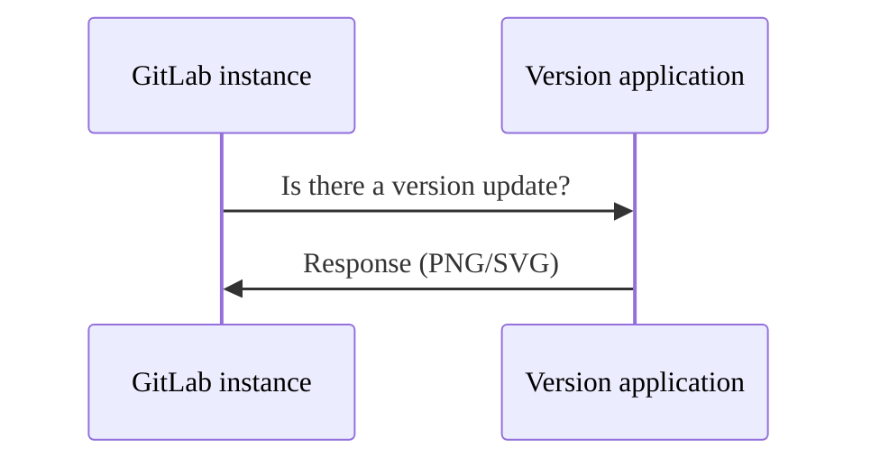



- プラン: Free、Premium、Ultimate
- 提供形態: GitLab Self-Managed



GitLab Inc. は、さまざまなアクションを実行するために、お客様のインスタンスに関する情報を定期的に収集します。

FreeのGitLab Self-Managedインスタンスの場合、すべての使用状況の統計は[オプトアウト](#enable-or-disable-service-ping)です。

## Service Ping {#service-ping}

Service Pingは、週次のペイロードを収集してGitLab Inc.に送信するプロセスです。Service Pingが有効になっている場合、GitLabは他のインスタンスからデータを収集し、Service Pingに依存する特定の[インスタンスレベルの分析機能](../../user/analytics/_index.md)を有効にします。

### Service Pingを有効にする理由 {#why-enable-service-ping}

Service Pingの主な目的は、より良いGitLabを構築することです。機能やステージの導入状況と使用状況を理解するために、GitLabがどのように使用されているかに関するデータを収集します。このデータは、GitLabがどのように価値を付加しているかのインサイトを提供し、人々がGitLabを使用する理由を理解するのに役立ちます。この知識があれば、より良い製品の意思決定を行うことができます。

Service Pingを有効にすることには、他にもいくつかのメリットがあります:

- GitLabインストールのユーザーのアクティビティーを経時的に分析します。
- 計画からモニタリングまで、同時DevOpsのインスタンス全体の導入状況の概要を示す[DevOpsスコア](../analytics/devops_adoption.md)。
- 収集されたデータを使用できるカスタマーサクセスマネージャー（CSM）を通じて、より積極的なサポートを提供します。
- GitLabへの投資から最大限の価値を引き出す方法に関するインサイトとアドバイス。
- 他の類似組織（匿名化）と比較して、DevOpsプロセスを改善する方法に関する具体的なアドバイスと推奨事項を示すレポート。
- 無料の有料機能を受け取るための[登録機能プログラム](#registration-features-program)への参加。

### Service Pingの設定 {#service-ping-settings}

GitLabは、Service Pingに関連する3つの設定を提供します:

- **Enable Service Ping**（Service Pingを有効にする）: Service PingデータをGitLabに送信するかどうかを制御します。
- **Service Pingの生成を有効にする**: Service Pingデータをお客様のインスタンスで生成するかどうかを制御します。
- **Include optional data in Service Ping**（Service Pingにオプションデータを含める）: Service Pingデータにオプションのメトリクスを含めるかどうかを制御します。

これら3つの設定は、次の方法で相互に作用します:

- **Service Ping**が有効になっている場合、**Service Ping Generation**（Service Pingの生成）が自動的に有効になり、無効にすることはできません。
- **Service Ping**が無効になっている場合は、**Service Ping Generation**（Service Pingの生成）を個別に制御できます。
- **Include optional data in Service Ping**（Service Pingにオプションデータを含める）は、**Service Ping**または**Service Ping Generation**（Service Pingの生成）のいずれかが有効になっている場合にのみ使用できます。

## 登録機能プログラム {#registration-features-program}

GitLabバージョン14.1以降では、GitLab Self-ManagedインスタンスでGitLab Enterprise Editionを実行しているGitLab Freeのお客様は、[登録機能を有効にする](#enable-registration-features)にしてService Ping経由でアクティビティーデータを送信することで、有料機能を利用できます。ここで紹介する機能は、有料ティアから機能を削除するものではありません。有料ティアのインスタンスは、[製品使用状況データポリシー](https://handbook.gitlab.com/handbook/legal/privacy/customer-product-usage-information/) （[クラウドライセンス](https://about.gitlab.com/pricing/licensing-faq/cloud-licensing/)によって管理）の対象となります。

### 利用可能な機能 {#available-features}

次の表では、以下を確認できます:

- 登録機能プログラムで利用できる機能
- 機能が利用可能なGitLabバージョン

| 機能 | 利用可能なID: |
| ------ | ------ |
| [GitLabからのメール](../email_from_gitlab.md)       |   GitLab 14.1以降     |
| [リポジトリサイズ制限](account_and_limit_settings.md#repository-size-limit) | GitLab 14.4以降 |
| [IPアドレスによるグループアクセス制限](../../user/group/access_and_permissions.md#restrict-group-access-by-ip-address) | GitLab 14.4以降 |
| [説明の変更履歴を表示する](../../user/discussions/_index.md#view-description-change-history) | GitLab 16.0以降 |
| [メンテナンスモード](../maintenance_mode/_index.md) | GitLab 16.0以降 |
| [構成可能なイシューボード](../../user/project/issue_board.md#configurable-issue-boards) | GitLab 16.0以降 |
| [カバレッジガイドファズテスト](../../user/application_security/coverage_fuzzing/_index.md) | GitLab 16.0以降 |
| [パスワードの複雑さの要件](sign_up_restrictions.md#password-complexity-requirements) | GitLab 16.0以降 |
| [グループWiki](../../user/project/wiki/group.md) | GitLab 16.5以降 |
| [イシュー分析](../../user/group/issues_analytics/_index.md) | GitLab 16.5以降 |
| [メール内のカスタムテキスト](email.md#custom-additional-text) | GitLab 16.5以降 |
| [コントリビュート分析](../../user/group/contribution_analytics/_index.md) | GitLab 16.5以降 |
| [グループファイルテンプレート](../../user/group/manage.md#group-file-templates) | GitLab 16.6以降 |
| [グループWebhook](../../user/project/integrations/webhooks.md#group-webhooks) | GitLab 16.6以降 |
| [サービスレベル契約のカウントダウンタイマー](../../operations/incident_management/incidents.md#service-level-agreement-countdown-timer) | GitLab 16.6以降 |
| [グループへのプロジェクトメンバーシップのロック](../../user/group/access_and_permissions.md#prevent-members-from-being-added-to-projects-in-a-group) | GitLab 16.6以降 |
| [ユーザーと権限のレポート](../admin_area.md#user-permission-export) | GitLab 16.6以降 |
| [高度な検索](../../user/search/advanced_search.md) | GitLab 16.6以降 |
| [DevOpsの導入](../../user/group/devops_adoption/_index.md) | GitLab 16.6以降 |
| [アーティファクト依存関係のあるプロジェクト間のクロスプロジェクトパイプライン](../../ci/yaml/_index.md#needsproject) | GitLab 16.7以降 |
| [機能フラグ関連のイシュー](../../operations/feature_flags.md#feature-flag-related-issues) | GitLab 16.7以降 |
| [マージ結果パイプライン](../../ci/pipelines/merged_results_pipelines.md) | GitLab 16.7以降 |
| [CI/CD（外部リポジトリ用）](../../ci/ci_cd_for_external_repos/_index.md) | GitLab 16.7以降 |
| [GitHub向けCI/CD](../../ci/ci_cd_for_external_repos/github_integration.md) | GitLab 16.7以降 |

### 登録機能を有効にする {#enable-registration-features}

1. 管理者権限を持つユーザーとしてサインインします。
1. 左側のサイドバーの下部で、**管理者**を選択します。
1. **設定** > **メトリクスとプロファイリング**を選択します。
1. **使用状況の統計**セクションを展開します。
1. 有効になっていない場合は、**Enable Service Ping**（Service Pingを有効にする）チェックボックスを選択します。
1. **登録機能を有効にする**チェックボックスを選択します。
1. **変更を保存**を選択します。

## バージョンチェック {#version-check}

有効にすると、新しいバージョンが利用可能かどうかとその重要度をステータスで通知します。ステータスは、すべての認証済みユーザーのヘルプページ（`/help`）と、**管理者**エリアページに表示されます。ステータスは次のとおりです:

- 緑: 最新バージョンのGitLabを実行しています。
- オレンジ: 更新されたバージョンのGitLabが利用可能です。
- 赤: 実行しているGitLabのバージョンには脆弱性があります。セキュリティ修正を含む最新バージョンをできるだけ早くインストールする必要があります。


### バージョンチェックを有効または無効にする {#enable-or-disable-version-check}

1. 左側のサイドバーの下部で、**管理者**を選択します。
1. **設定** > **メトリクスとプロファイリング**を選択します。
1. **使用状況の統計**を展開します。
1. **バージョンチェックを有効にする**チェックボックスを選択またはクリアします。
1. **変更を保存**を選択します。

### リクエストフローの例 {#request-flow-example}

次の例は、お客様のインスタンスとGitLabバージョンアプリケーション間の基本的なリクエスト/レスポンスフローを示しています:



## ネットワークを設定する {#configure-your-network}

使用状況の統計をGitLab Inc.に送信するには、GitLabインスタンスからホスト`version.gitlab.com`へのポート`443`でのネットワークトラフィックを許可する必要があります。

GitLabインスタンスがプロキシの背後にある場合は、適切な[プロキシ設定変数](https://docs.gitlab.com/omnibus/settings/environment-variables.html)を設定します。

## Service Pingを有効または無効にする {#enable-or-disable-service-ping}



Service Pingを完全に無効にできるかどうかは、インスタンスのティアと特定のライセンスによって異なります。Service Pingの設定は、データがGitLabと共有されているか、インスタンスによる内部使用のみに制限されているかを制御するだけです。Service Pingを無効にしても、`gitlab_service_ping_worker`バックグラウンドジョブは、インスタンスのService Pingペイロードを定期的に生成します。ペイロードは、[メトリクスとプロファイリング](#manually-upload-service-ping-payload)の管理者セクションにあります。



### UIを使用する場合 {#through-the-ui}

Service Pingを有効または無効にするには、次のようにします:

1. 左側のサイドバーの下部で、**管理者**を選択します。
1. **設定** > **メトリクスとプロファイリング**を選択します。
1. **使用状況の統計**を展開します。
1. **Enable Service Ping**（Service Pingを有効にする）チェックボックスを選択またはクリアします。
1. **変更を保存**を選択します。

### 設定ファイルを使用する {#through-the-configuration-file}

管理者を無効にして、今後**管理者**エリアから設定されないようにするには、次の手順に従います。





1. `/etc/gitlab/gitlab.rb`を編集します: 

   ```ruby
   gitlab_rails['usage_ping_enabled'] = false
   ```

1. GitLabを再設定します:

   ```shell
   sudo gitlab-ctl reconfigure
   ```





1. `/home/git/gitlab/config/gitlab.yml`を編集します: 

   ```yaml
   production: &base
     # ...
     gitlab:
       # ...
       usage_ping_enabled: false
   ```

1. GitLabを再起動します:

   ```shell
   sudo service gitlab restart
   ```





## Service Pingの生成を有効または無効にする {#enable-or-disable-service-ping-generation}

Service Pingの生成は、お客様のインスタンスでService Pingデータが自動的に生成されるかどうかを制御します。有効にすると、GitLabは使用状況の統計を含むService Pingペイロードを定期的に生成します。この設定は、データがGitLabと共有されているかどうかに関係なく機能します。

### UIを使用する場合 {#through-the-ui-1}

Service Pingの生成を有効または無効にするには:

1. 左側のサイドバーの下部で、**管理者**を選択します。
1. **設定** > **メトリクスとプロファイリング**を選択します。
1. **使用状況の統計**を展開します。
1. **Service Pingの生成を有効にする**チェックボックスを選択またはクリアします。
   - **Enable Service Ping**（Service Pingを有効にする）が選択されている場合、この設定は自動的に有効になり、インタラクションから無効になります。
   - **Enable Service Ping**（Service Pingを有効にする）がクリアされている場合は、この設定を個別に制御できます。
1. **変更を保存**を選択します。

### 設定ファイルを使用する {#through-the-configuration-file-1}

設定を通じてService Pingの生成を制御するには:





1. `/etc/gitlab/gitlab.rb`を編集します: 

   ```ruby
   gitlab_rails['usage_ping_enabled'] = false
   gitlab_rails['usage_ping_generation_enabled'] = false
   ```

1. GitLabを再設定します:

   ```shell
   sudo gitlab-ctl reconfigure
   ```





1. `/home/git/gitlab/config/gitlab.yml`を編集します: 

   ```yaml
   production: &base
     # ...
     gitlab:
       # ...
       usage_ping_enabled: false
       usage_ping_generation_enabled: false
   ```

1. GitLabを再起動します:

   ```shell
   sudo service gitlab restart
   ```





## Service Pingのオプションデータを有効または無効にする {#enable-or-disable-optional-data-in-service-ping}

GitLabは、運用データとオプションの収集データを区別します。



**Include optional data in Service Ping**（Service Pingにオプションデータを含める）オプションは、**Enable Service Ping**（Service Pingを有効にする）または**Enable Service Ping Generation**（Service Pingの生成を有効にする）のいずれかが有効になっている場合にのみ使用できます。両方の設定が無効になっている場合、このオプションは自動的に無効になります。



### UIを使用する場合 {#through-the-ui-2}

Service Pingでオプションのデータを有効または無効にするには、次のようにします:

1. 左側のサイドバーの下部で、**管理者**を選択します。
1. **設定** > **メトリクスとプロファイリング**に移動します。
1. **Usage Statistics**（使用状況の統計）セクションを展開します。
1. **Enable Service Ping**（Service Pingを有効にする）または**Enable Service Ping Generation**（Service Pingの生成を有効にする）のいずれかのチェックボックスが選択されていることを確認します。
1. オプションのデータを有効にするには、**Include optional data in Service Ping**（Service Pingにオプションデータを含める）チェックボックスを選択します。無効にするには、ボックスをオフにします。
1. **変更を保存**を選択します。

### 設定ファイルを使用する {#through-the-configuration-file-2}





1. `/etc/gitlab/gitlab.rb`を編集します: 

   ```ruby
   gitlab_rails['include_optional_metrics_in_service_ping'] = false
   ```

1. GitLabを再設定します:

   ```shell
   sudo gitlab-ctl reconfigure
   ```





1. `/home/git/gitlab/config/gitlab.yml`を編集します: 

   ```yaml
   production: &base
     # ...
     gitlab:
       # ...
       include_optional_metrics_in_service_ping: false
   ```

1. GitLabを再起動します:

   ```shell
   sudo service gitlab restart
   ```





## Service Pingペイロードへのアクセス {#access-the-service-ping-payload}

GitLab Inc.に送信された正確なJSONペイロードには、**管理者**エリアまたはAPIを介してアクセスできます。

### UIの場合 {#in-the-ui}

1. 管理者権限を持つユーザーとしてサインインします。
1. 左側のサイドバーの下部で、**管理者**を選択します。
1. **設定 > メトリクスとプロファイリング > 使用状況の統計**を選択します。
1. **ペイロードのプレビュー**を選択します。

### API経由: {#through-the-api}

[Service Ping APIドキュメント](../../api/usage_data.md)を参照してください。

## Service Pingペイロードを手動でアップロードする {#manually-upload-service-ping-payload}

インスタンスがインターネットにアクセスできない場合、またはService Ping cronジョブが有効になっていない場合でも、Service PingペイロードをGitLabにアップロードできます。

ペイロードを手動でアップロードするには、次のようにします:

1. 管理者権限を持つユーザーとしてサインインします。
1. 左側のサイドバーの下部で、**管理者**を選択します。
1. **設定 > メトリクスとプロファイリング > 使用状況の統計**を選択します。
1. **ペイロードのダウンロード**を選択します。
1. JSONファイルを保存します。
1. [Service Usage Data Center](https://version.gitlab.com/usage_data/new)にアクセスします。
1. **ファイルを選択**し、ダウンロードしたペイロードを含むJSONファイルを選択します。
1. **アップロード**を選択します。

アップロードされたファイルは、セキュアHTTPSプロトコルを使用して暗号化され、送信されます。HTTPSは、Webブラウザーとサーバー間に安全な通信チャンネルを作成し、中間者攻撃から送信されたデータを保護します。

手動アップロードで問題が発生した場合:

1. [バージョンアプリプロジェクトのセキュリティフォーク](https://gitlab.com/gitlab-org/security/version.gitlab.com)で機密イシューを開きます。
1. 可能であれば、JSONペイロードを添付してください。
1. `@gitlab-org/analytics-section/analytics-instrumentation`をタグ付けして、イシューのトリアージを行います。
