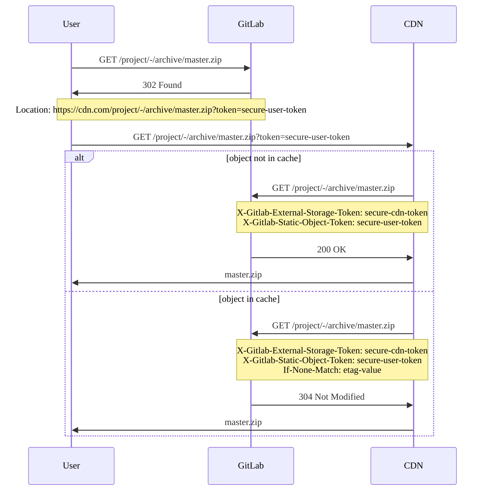



- プラン: Free、Premium、Ultimate
- 提供形態: GitLab Self-Managed



GitLabを設定して、コンテンツデリバリーネットワーク（CDN）などの外部ストレージから、リポジトリの静的オブジェクト（アーカイブやrawなど）を提供します。

## 外部ストレージを設定する {#configure-external-storage}

静的オブジェクトの外部ストレージを設定するには、次の手順に従います:

1. 左側のサイドバーの下部で、**管理者**を選択します。
1. **設定** > **リポジトリ**を選択します。
1. **リポジトリの静的オブジェクトの外部ストレージ**を展開します。
1. ベースURLと任意のトークンを入力します。[外部ストレージをセットアップ](#set-up-external-storage)する場合、これらの値を`ORIGIN_HOSTNAME`と`STORAGE_TOKEN`として設定するスクリプトを使用します。
1. **変更を保存**を選択します。

トークンは、外部ストレージからのリクエストを区別するために必要です。これにより、ユーザーが外部ストレージを迂回してアプリケーションに直接アクセスすることを防ぎます。GitLabは、外部ストレージからのリクエストの`X-Gitlab-External-Storage-Token`ヘッダーに、このトークンが設定されることを想定しています。

## プライベート静的オブジェクトの提供 {#serving-private-static-objects}

GitLabは、プライベートプロジェクトに属する静的オブジェクトのURLにユーザー固有のトークンを追加し、外部ストレージがユーザーの代わりに認証できるようにします。

外部ストレージからのリクエストを処理する際、GitLabは以下をチェックして、ユーザーがリクエストされたオブジェクトにアクセスできることを確認します:

- `token` queryパラメータ
- `X-Gitlab-Static-Object-Token`ヘッダー

## リクエストフローの例 {#requests-flow-example}

次の例は、以下に示すリクエストと応答のシーケンスを示しています:

- ユーザー
- GitLab 
- コンテンツデリバリーネットワーク。



## 外部ストレージをセットアップ {#set-up-external-storage}

この手順では外部ストレージに[Cloudflareワーカー](https://workers.cloudflare.com)を使用していますが、他のCDNまたはFunction as a Service（FaaS）システムも同じ原則で動作するはずです。

1. Cloudflareワーカードメインをまだ選択していない場合は選択してください。
1. 次のスクリプトで、最初の2つの定数に次の値を設定します:

   - `ORIGIN_HOSTNAME`: GitLabインストールのホスト名。
   - `STORAGE_TOKEN`: 任意の安全なトークン。UNIXマシンで`pwgen -cn1 64`を実行して、トークンを取得できます。**管理者**のトークンを保存します。詳細については、[設定](#configure-external-storage)セクションを参照してください。

     ```javascript
     const ORIGIN_HOSTNAME = 'gitlab.installation.com' // FIXME: SET CORRECT VALUE
     const STORAGE_TOKEN = 'very-secure-token' // FIXME: SET CORRECT VALUE
     const CACHE_PRIVATE_OBJECTS = false

     const CORS_HEADERS = {
       'Access-Control-Allow-Origin': '*',
       'Access-Control-Allow-Methods': 'GET, HEAD, OPTIONS',
       'Access-Control-Allow-Headers': 'X-Csrf-Token, X-Requested-With',
     }

     self.addEventListener('fetch', event => event.respondWith(handle(event)))

     async function handle(event) {
       try {
         let response = await verifyAndHandle(event);

         // responses returned from cache are immutable, so we recreate them
         // to set CORS headers
         response = new Response(response.body, response)
         response.headers.set('Access-Control-Allow-Origin', '*')

         return response
       } catch (e) {
         return new Response('An error occurred!', {status: e.statusCode || 500})
       }
     }

     async function verifyAndHandle(event) {
       if (!validRequest(event.request)) {
         return new Response(null, {status: 400})
       }

       if (event.request.method === 'OPTIONS') {
         return handleOptions(event.request)
       }

       return handleRequest(event)
     }

     function handleOptions(request) {
       // Make sure the necessary headers are present
       // for this to be a valid pre-flight request
       if (
         request.headers.get('Origin') !== null &&
         request.headers.get('Access-Control-Request-Method') !== null &&
         request.headers.get('Access-Control-Request-Headers') !== null
       ) {
         // Handle CORS pre-flight request
         return new Response(null, {
           headers: CORS_HEADERS,
         })
       } else {
         // Handle standard OPTIONS request
         return new Response(null, {
           headers: {
             Allow: 'GET, HEAD, OPTIONS',
           },
         })
       }
     }

     async function handleRequest(event) {
       let cache = caches.default
       let url = new URL(event.request.url)
       let static_object_token = url.searchParams.get('token')
       let headers = new Headers(event.request.headers)

       url.host = ORIGIN_HOSTNAME
       url = normalizeQuery(url)

       headers.set('X-Gitlab-External-Storage-Token', STORAGE_TOKEN)
       if (static_object_token !== null) {
         headers.set('X-Gitlab-Static-Object-Token', static_object_token)
       }

       let request = new Request(url, { headers: headers })
       let cached_response = await cache.match(request)
       let is_conditional_header_set = headers.has('If-None-Match')

       if (cached_response) {
         return cached_response
       }

       // We don't want to override If-None-Match that is set on the original request
       if (cached_response && !is_conditional_header_set) {
         headers.set('If-None-Match', cached_response.headers.get('ETag'))
       }

       let response = await fetch(request, {
         headers: headers,
         redirect: 'manual'
       })

       if (response.status == 304) {
         if (is_conditional_header_set) {
           return response
         } else {
           return cached_response
         }
       } else if (response.ok) {
         response = new Response(response.body, response)

         // cache.put will never cache any response with a Set-Cookie header
         response.headers.delete('Set-Cookie')

         if (CACHE_PRIVATE_OBJECTS) {
           response.headers.delete('Cache-Control')
         }

         event.waitUntil(cache.put(request, response.clone()))
       }

       return response
     }

     function normalizeQuery(url) {
       let searchParams = url.searchParams
       url = new URL(url.toString().split('?')[0])

       if (url.pathname.includes('/raw/')) {
         let inline = searchParams.get('inline')

         if (inline == 'false' || inline == 'true') {
           url.searchParams.set('inline', inline)
         }
       } else if (url.pathname.includes('/-/archive/')) {
         let append_sha = searchParams.get('append_sha')
         let path = searchParams.get('path')

         if (append_sha == 'false' || append_sha == 'true') {
           url.searchParams.set('append_sha', append_sha)
         }
         if (path) {
           url.searchParams.set('path', path)
         }
       }

       return url
     }

     function validRequest(request) {
       let url = new URL(request.url)
       let path = url.pathname

       if (/^(.+)(\/raw\/|\/-\/archive\/)/.test(path)) {
         return true
       }

       return false
     }
     ```

1. このスクリプトで新しいワーカーを作成します。
1. `ORIGIN_HOSTNAME`と`STORAGE_TOKEN`の値をコピーします。これらの値を使用して、[静的オブジェクトの外部ストレージを設定](#configure-external-storage)します。
