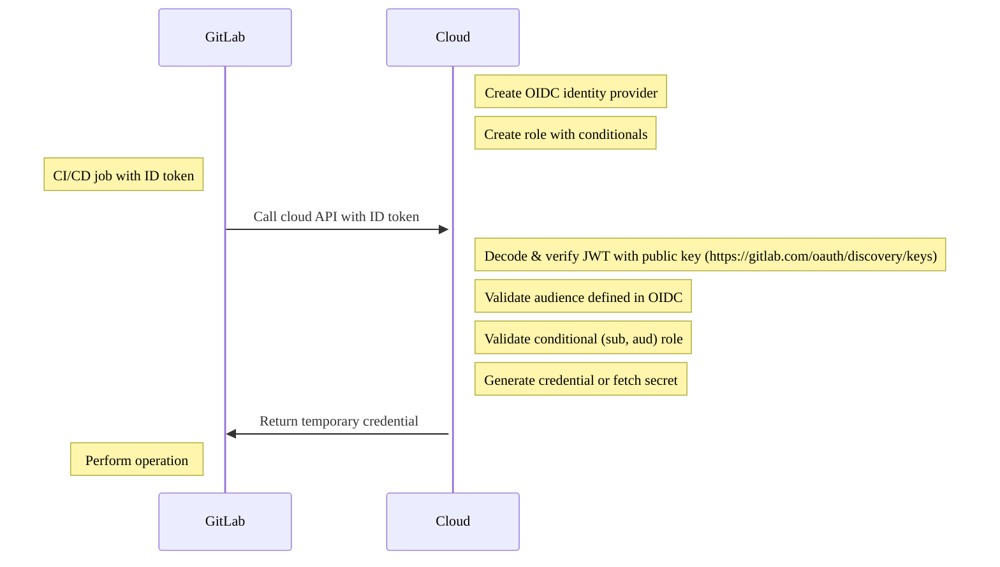



- プラン: Free、Premium、Ultimate
- 提供形態: GitLab.com、GitLab Self-Managed、GitLab Dedicated





- 任意のOIDCプロバイダー（HashiCorp Vaultを含む）をサポートする[IDトークン](../secrets/id_token_authentication.md)は、GitLab 15.7で[導入されました](https://gitlab.com/gitlab-org/gitlab/-/issues/356986)。





`CI_JOB_JWT`と`CI_JOB_JWT_V2`は、[GitLab 15.9で非推奨](../../update/deprecations.md#old-versions-of-json-web-tokens-are-deprecated)となり、GitLab 17.0で削除される予定です。代わりに[IDトークン](../secrets/id_token_authentication.md)を使用してください。



GitLab CI/CDは、[OpenID Connect（OIDC）](https://openid.net/developers/how-connect-works/)をサポートし、ビルドおよびデプロイジョブがクラウド認証情報とサービスにアクセスできるようにします。従来、チームはシークレットをプロジェクトに保存するか、GitLab Runnerインスタンスに対する権限を適用してビルドおよびデプロイしていました。OIDC対応の[IDトークン](../secrets/id_token_authentication.md)は、CI/CDジョブで構成可能であり、スケーラブルで最小特権のセキュリティアプローチに従うことができます。

GitLab 15.6以前は、IDトークンの代わりに`CI_JOB_JWT_V2`を使用する必要がありますが、カスタマイズできません。

## 前提要件 {#prerequisites}

- GitLabのアカウント
- 認可を構成し、ロールを作成するために、OIDCをサポートするクラウドプロバイダーへのアクセス。

IDトークンは、以下を含むOIDCを持つクラウドプロバイダーをサポートします:

- AWS
- Azure
- GCP
- HashiCorp Vault



OIDCを構成すると、すべてのパイプラインのターゲット環境へのJWTトークンアクセスが可能になります。OIDCをパイプライン用に構成する場合は、追加のアクセスに焦点を当てて、パイプラインのソフトウェアサプライチェーンセキュリティレビューを完了する必要があります。サプライチェーン攻撃の詳細については、[DevOpsプラットフォームがサプライチェーン攻撃から保護するのにどのように役立つか](https://about.gitlab.com/blog/2021/04/28/devops-platform-supply-chain-attacks/)を参照してください。



## ユースケース {#use-cases}

- GitLabグループまたはプロジェクトにシークレットを保存する必要がなくなります。一時的な認証情報は、OIDCを介してクラウドプロバイダーから取得できます。
- グループ、プロジェクト、ブランチ、タグなどのきめ細かいGitLab条件で、クラウドリソースへの一時的なアクセスを提供します。
- 環境への条件付きアクセスを使用して、CI/CDジョブで職務分離を定義できます。従来、アプリは、ステージング環境または本番環境へのアクセスのみを持つ、指定されたGitLab Runnerでデプロイされていた可能性があります。これにより、各マシンが専用の権限を持つため、Runnerが乱立するようになりました。
- インスタンスRunnerが複数のクラウドアカウントに安全にアクセスできるようになります。アクセスはJWTトークンによって決定されます。これは、パイプラインを実行しているユーザーに固有のものです。
- デフォルトで一時的な認証情報を取得することにより、シークレットをローテーションするロジックを作成する必要がなくなります。

## クラウドサービスのIDトークン認証 {#id-token-authentication-for-cloud-services}

各ジョブは、[トークンペイロード](../secrets/id_token_authentication.md#token-payload)を含むCI/CD変数として提供されるIDトークンで構成できます。これらのJWTは、AWS、Azure、GCP、VaultなどのOIDCサポート対象のクラウドプロバイダーで認証するために使用できます。

### 認可ワークフロー {#authorization-workflow}



1. クラウド（たとえば、AWS、Azure、GCP、Vault）でOIDCIdentity Providerを作成します。
1. グループ、プロジェクト、ブランチ、またはタグにフィルタリングする条件付きロールをクラウドプロバイダーで作成します。
1. CI/CDジョブには、JWTトークンであるIDトークンが含まれています。このトークンを使用して、クラウドAPIで認可できます。
1. クラウドはトークンを検証し、ペイロードから条件付きロールを検証し、一時的な認証情報を返します。

## OIDCクレームを使用した条件付きロールの構成 {#configure-a-conditional-role-with-oidc-claims}

GitLabとOIDCの間の信頼を構成するには、JWTに対してチェックする条件付きロールをクラウドプロバイダーに作成する必要があります。条件は、JWTに対して検証され、オーディエンスとサブジェクトの2つのクレームに対して特に信頼が作成されます。

- オーディエンスまたは`aud`: IDトークンの一部として構成されます:

  ```yaml
  job_needing_oidc_auth:
    id_tokens:
      OIDC_TOKEN:
        aud: https://oidc.provider.com
    script:
      - echo $OIDC_TOKEN
  ```

- サブジェクトまたは`sub`: グループ、プロジェクト、ブランチ、タグを含むGitLab CI/CDワークフローを記述するメタデータの連結。`sub`フィールドは、次の形式です:
  - `project_path:{group}/{project}:ref_type:{type}:ref:{branch_name}`

| フィルターの種類                                        | 例 |
|----------------------------------------------------|---------|
| 任意のブランチへのフィルター                               | ワイルドカードがサポートされています。`project_path:mygroup/myproject:ref_type:branch:ref:*` |
| 特定のプロジェクト、mainブランチへのフィルター            | `project_path:mygroup/myproject:ref_type:branch:ref:main` |
| グループ内のすべてのプロジェクトへのフィルター               | ワイルドカード</wildカードがサポートされています。`project_path:mygroup/*:ref_type:branch:ref:main` |
| Gitタグへのフィルター                                | ワイルドカードがサポートされています。`project_path:mygroup/*:ref_type:tag:ref:1.0` |

## お使いのクラウドプロバイダーによるOIDC認可 {#oidc-authorization-with-your-cloud-provider}

クラウドプロバイダーとの接続については、次のチュートリアルを参照してください:

- [AWSでOpenID Connectを設定する](aws/_index.md)
- [AzureでOpenID Connectを設定する](azure/_index.md)
- Google CloudでOpenID Connectを[設定する](google_cloud/_index.md)
