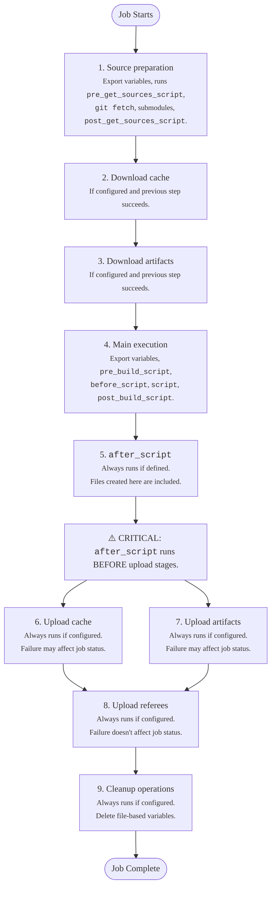



- プラン: Free、Premium、Ultimate
- 提供形態: GitLab.com、GitLab Self-Managed、GitLab Dedicated



ジョブの実行フローでは、GitLab RunnerがCI/CDジョブを最初から最後までどのように処理するかを説明します。

GitLab Runnerは、ジョブを受信し、Vaultからシークレット (設定されている場合) を取得し、executorを準備した後、CI/CDジョブを実行します。すべてのCI/CDジョブは、一連の連続したステップとして実行され、各ステップは個別のShellコンテキストで実行されます。Runnerは次の処理を行います:

1. ジョブのコードのソースを準備します:

   - 変数をShellコンテキストにエクスポートします
   - 設定で定義されている場合は、`pre_get_sources_script`を実行します
   - `git fetch`およびその他のソース処理コマンドを実行します（`none`戦略が設定されていない場合）。
   - サブモジュールが存在する場合は、サブモジュールを更新するコマンドを実行します
   - 設定で定義されている場合は、`post_get_sources_script`を実行します

1. [キャッシュ](../yaml/_index.md#cache)が設定されていて、前のステップが成功した場合は、キャッシュされたファイルシステムをダウンロードします:

   - 変数をShellコンテキストにエクスポートします
   - 以前のジョブの実行からキャッシュされたファイルシステムをダウンロードするコマンドを実行します

1. アーティファクトのダウンロードが設定されていて、前のステップが成功した場合は、以前のジョブから[アーティファクト](../yaml/_index.md#artifacts)をダウンロードします:

   - 変数をShellコンテキストにエクスポートします
   - 以前のジョブからアーティファクトファイルをダウンロードするコマンドを実行します

1. 前のステップが成功した場合は、メインのジョブスクリプトを実行します:

   - 変数をShellコンテキストにエクスポートします
   - 設定で定義されている場合は、`pre_build_script`を実行します
   - 定義されている場合は、`before_script`コマンドを実行します
   - メインの`script`コマンドを実行します
   - 設定で定義されている場合は、`post_build_script`を実行します

1. 以前のステップが失敗したかどうかに関係なく、定義されている場合は、`after_script`コマンドを実行します:

   - 変数を新しいShellコンテキストにエクスポートします
   - `after_script`コマンドを実行します
   - これらのコマンドが失敗しても、ジョブステータス全体には影響しません

1. キャッシュのアップロードが設定されている場合は、前のステップが失敗したかどうかに関係なく、キャッシュにファイルをアップロードします:

   - 変数をShellコンテキストにエクスポートします
   - キャッシュストレージに指定されたファイルをアップロードするコマンドを実行します
   - このステップが失敗すると、ジョブステータス全体に影響する可能性があります

1. アーティファクトのアップロードが設定されている場合は、前のステップが失敗したかどうかに関係なく、アーティファクトをアップロードします:

   - 変数をShellコンテキストにエクスポートします
   - 指定されたファイルをジョブアーティファクトとしてアップロードするコマンドを実行します
   - このステップが失敗すると、ジョブステータス全体に影響する可能性があります

1. レフェリーのアップロードが設定されている場合は、前のステップが失敗したかどうかに関係なく、レフェリーデータをアップロードします:

   - 変数をShellコンテキストにエクスポートします
   - レフェリー情報をアップロードするコマンドを実行します
   - これらのコマンドが失敗しても、ジョブステータス全体には影響しません

1. 前のステップが失敗したかどうかに関係なく、設定されている場合は、クリーンアップ操作を実行します:

   - 変数をShellコンテキストにエクスポートします
   - ファイルベースの変数を作業ディレクトリから削除するコマンドを実行します
   - これらのコマンドが失敗しても、ジョブ全体には影響しません

## Shellコンテキストの分離 {#shell-context-isolation}

各Shellコンテキストは、設計上分離されています。コンテキスト間の唯一の接続は、共有の作業ディレクトリファイルシステムです。

- 1つのコンテキストでの手動変数のエクスポート（`export my_variable=$(date)`など）は、他のコンテキストでは使用できません
- 各スクリプトは、最初のエラーで早期に失敗するように、`set -eo pipefail` (Shell用) で実行されます
- 各ステップの結果は、後続のステップが実行されるかどうか、および全体的なジョブステータスに影響します
