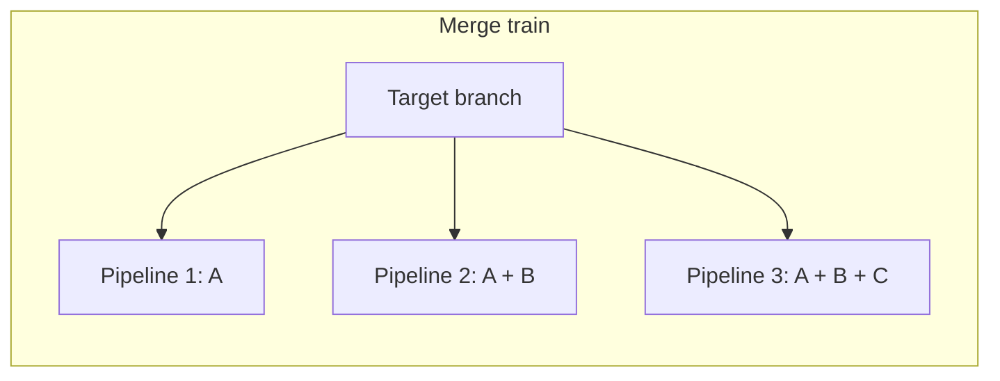



- プラン: Premium、Ultimate
- 提供形態: GitLab.com、GitLab Self-Managed、GitLab Dedicated



デフォルトブランチへのマージが頻繁に行われるプロジェクトでは、異なるマージリクエストの変更が互いに競合する可能性があります。マージトレインを使用して、マージリクエストをキューに入れます。各マージリクエストが、それ以前にキューに入れられた他のマージリクエストと比較され、すべてが整合して動作することを確認できます。

１つのマージリクエストの変更とターゲットブランチを組み合わせてテストする[マージ結果パイプライン](merged_results_pipelines.md)。マージ結果パイプラインは、ほぼ同時にマージされる他のマージリクエストを考慮しません。2つのマージリクエストはそれぞれ独自のパイプラインに合格できますが、それらの結合された変更はまだ競合する可能性があります。両方がマージされた場合、すべてのパイプラインが成功しても、ターゲットブランチが壊れる可能性があります。

```mermaid
%%{init: { "fontFamily": "GitLab Sans" }}%%
graph LR
accTitle: Two merge requests that pass individually but conflict together
accDescr: Merge request A and merge request B each pass a pipeline that tests their changes combined with the target branch alone. When both merge, the combined changes break the target branch.

  subgraph Without merge trains
    target[Target branch] --> pipeline_a[Pipeline for A: passes]
    target --> pipeline_b[Pipeline for B: passes]
    pipeline_a --> merge_both[Both merge]
    pipeline_b --> merge_both
    merge_both -.-> broken[Target branch breaks]
  end
```

マージトレインは、各マージリクエストをキュー内のその前にあるすべてのマージリクエストの結合された変更に対してテストすることで、これを防ぎます。これにより、ターゲットブランチに到達する前に競合を捕捉します。

プロジェクトが次のいずれかの場合は、マージトレインを使用します:

- デフォルトブランチへの頻繁なマージ
- ほぼ同時にマージする準備ができている複数のマージリクエスト
- 常にデフォルトブランチでパイプラインをパスし続ける要件

## マージトレインワークフロー {#merge-train-workflow}

マージを待機しているマージリクエストがなく、[**マージ**または**自動マージに設定**](#start-a-merge-train)を選択すると、マージトレインが開始されます。GitLabは、変更がデフォルトブランチにマージできることを確認するマージトレインパイプラインを開始します。この最初のパイプラインは[マージ結果パイプライン](merged_results_pipelines.md)と同じで、ソースブランチとターゲットブランチを組み合わせた変更に対して実行されます。内部マージ結果コミットの作成者は、マージを開始したユーザーです。

最初のパイプラインが完了した直後にマージする2番目のマージリクエストをキューに入れるには、[**マージ**または**自動マージに設定**](#add-a-merge-request-to-a-merge-train)を選択して、トレインに追加します。この2番目のマージトレインパイプラインは、ターゲットブランチと組み合わせた_両方_のマージリクエストの変更に対して実行されます。同様に、3番目のマージリクエストを追加すると、そのパイプラインは、ターゲットブランチとマージされた3つのマージリクエストすべての変更に対して実行されます。パイプラインはすべて並行して実行されます。

各マージリクエストは、以下の場合にのみターゲットブランチにマージされます。

- マージリクエストのパイプラインが正常に完了した場合。
- その前にキューに入れられた他のすべてのマージリクエストがマージされた場合。

マージトレインパイプラインが失敗した場合、マージリクエストはマージされません。GitLabはそのマージリクエストをマージトレインから削除し、その後にキューに入れられたすべてのマージリクエストに対して新しいパイプラインを開始します。

例: 

3つのマージリクエスト（`A`、`B`、および`C`）が順番にマージトレインに追加され、並行して実行される3つのマージ結果パイプラインが作成されます。

1. 最初のパイプラインは、`A`からの変更とターゲットブランチを組み合わせて実行されます。
1. 2番目のパイプラインは、`A`と`B`からの変更とターゲットブランチを組み合わせて実行されます。
1. 3番目のパイプラインは、`A`、`B`、および`C`からの変更とターゲットブランチを組み合わせて実行されます。

`B`のパイプラインが失敗した場合:

- 最初のパイプライン（`A`）は引き続き実行されます。
- `B`がトレインから削除されます。
- `C`のパイプライン[はキャンセル](#automatic-pipeline-cancellation)され、`A`と`C`からの変更とターゲットブランチを組み合わせた新しいパイプラインが（`B`の変更なしで）開始されます。

次に、`A`が正常に完了すると、ターゲットブランチにマージされ、`C`の実行が継続されます。トレインに追加された新しいマージリクエストには、ターゲットブランチにある`A`の変更と、マージトレインからの`C`の変更が含まれます。

<i class="fa-youtube-play" aria-hidden="true"></i>[マージトレインの並列実行によってコミットがデフォルトブランチを破損するのを防ぐ方法](https://www.youtube.com/watch?v=D4qCqXgZkHQ)のデモについては、このビデオをご覧ください。

### 自動パイプラインキャンセル {#automatic-pipeline-cancellation}

GitLab CI/CDは、冗長なパイプラインを検出し、リソースを節約するためにそれらをキャンセルします。

冗長なマージトレインパイプラインは、以下の場合に発生します。

- マージトレイン内のいずれかのマージリクエストでパイプラインが失敗した場合。
- [マージトレインをスキップしてすぐにマージ](#skip-the-merge-train-and-merge-immediately)する場合。
- [マージトレインからマージリクエストを削除](#remove-a-merge-request-from-a-merge-train)する場合。

これらの場合、GitLabはトレイン上の一部のまたはすべてのマージリクエストに対して新しいマージトレインパイプラインを作成する必要があります。古いパイプラインは、マージトレイン内の以前の結合された変更と比較していましたが、これはもはや有効ではないため、これらの古いパイプラインはキャンセルされます。

## マージトレインを有効にする {#enable-merge-trains}

前提条件: 

- メンテナーのロールを持っている必要があります。
- リポジトリは、[外部リポジトリ](../ci_cd_for_external_repos/_index.md)ではなく、GitLabリポジトリである必要があります。
- パイプラインが[マージリクエストパイプラインを使用するように設定されている](merge_request_pipelines.md#prerequisites)必要があります。そうでない場合、マージリクエストが未解決の状態でスタックしたり、パイプラインがドロップされたりする可能性があります。
- [マージ結果パイプラインが有効になっている](merged_results_pipelines.md#enable-merged-results-pipelines)必要があります。

マージトレインを有効にするには:

1. 上部のバーで、**検索または移動先**を選択して、プロジェクトを見つけます。
1. 左側のサイドバーで、**設定** > **マージリクエスト**を選択します。
1. **マージオプション**セクションで、**マージ結果パイプラインを有効にする**が有効になっていることを確認し、**マージトレインを有効にする**を選択します。
1. **変更を保存**を選択します。

## マージトレインを開始する {#start-a-merge-train}

前提条件: 

- ターゲットブランチにマージまたはプッシュする[権限](../../user/permissions.md)が必要です。

マージトレインを開始するには:

1. マージリクエストに移動します。
1. 次を選択します:
   - パイプラインが実行されていない場合は、**マージ**。
   - パイプラインが実行されている場合は、[**自動マージに設定**](../../user/project/merge_requests/auto_merge.md)。

マージリクエストのマージトレイン状態が、`A new merge train has started and this merge request is the first of the queue. View merge train details.`のようなメッセージとともにパイプラインウィジェットの下に表示されます。リンクを選択して、マージトレインを表示できます。

他のマージリクエストをトレインに追加できるようになりました。

## マージトレインを表示する {#view-a-merge-train}



- GitLab 17.3でマージトレインの可視化[が導入](https://gitlab.com/groups/gitlab-org/-/epics/13705)されました。



マージトレインを表示して、キュー内のマージリクエストの順序と状態をより詳細に把握できます。マージトレインの詳細ページには、キュー内のアクティブなマージリクエストと、トレインの一部であったマージ済みのマージリクエストが表示されます。

マージリクエストのリストからマージトレインの詳細にアクセスするには:

1. 上部のバーで、**検索または移動先**を選択して、プロジェクトを見つけます。
1. 左側のサイドバーで、**コード** > **マージリクエスト**を選択します。
1. マージリクエストのリストの上にある**マージトレイン**を選択します。
1. オプション。ターゲットブランチでマージトレインをフィルタリングします。

次の場所から**マージトレインの詳細を表示**を選択して、このビューにアクセスすることもできます。

- マージトレインに追加されたマージリクエストのパイプラインウィジェットとシステムノート。
- マージトレインパイプラインのパイプライン詳細ページ。

マージトレインの詳細ビューからマージリクエストを削除（）することもできます。

## マージリクエストをマージトレインに追加する {#add-a-merge-request-to-a-merge-train}



- マージトレインの自動マージは、GitLab 17.2で`merge_when_checks_pass_merge_train`という名前の[機能フラグ](../../administration/feature_flags/_index.md)と共に[導入](https://gitlab.com/groups/gitlab-org/-/work_items/10874)されました。デフォルトでは無効になっています。
- GitLab.comでのマージトレインの自動マージが、GitLab 17.2で[有効](https://gitlab.com/gitlab-org/gitlab/-/issues/470667)になりました。
- GitLab 17.4では、マージトレインの自動マージがデフォルトで[有効](https://gitlab.com/gitlab-org/gitlab/-/issues/470667)になっています。
- GitLab 17.7では、マージトレインの自動マージが[一般提供](https://gitlab.com/gitlab-org/gitlab/-/merge_requests/174357)されています。機能フラグ`merge_when_checks_pass_merge_train`は削除されました。



前提条件: 

- ターゲットブランチにマージまたはプッシュする[権限](../../user/permissions.md)が必要です。

マージリクエストをマージトレインに追加するには:

1. マージリクエストにアクセスします。
1. 次を選択します:
   - パイプラインが実行されていない場合は、**マージ**。
   - パイプラインが実行されている場合は、[**自動マージに設定**](../../user/project/merge_requests/auto_merge.md)。

マージリクエストのマージトレイン状態が、`This merge request is 2 of 3 in queue.`のようなメッセージとともにパイプラインウィジェットの下に表示されます

各マージトレインは、[最大数のパイプラインを並行して](#merge-train-parallel-pipeline-limit)実行できます。デフォルトの制限は20です。制限を超えてマージトレインにマージリクエストを追加した場合、追加のマージリクエストはパイプラインが完了するまでキューに入れられます。キューに入れられるマージリクエストの数に制限はありません。

マージリクエストがマージトレインに参加した後、新しい会話スレッドは、[すべてのスレッドが解決する必要がある](../../user/project/merge_requests/_index.md#prevent-merge-unless-all-threads-are-resolved)が有効になっている場合でも、それをトレインから削除したり、マージを妨げたりすることはありません。この動作は意図的なものです。詳細については、[イシュー220916](https://gitlab.com/gitlab-org/gitlab/-/issues/220916)を参照してください。

## マージトレインからマージリクエストを削除する {#remove-a-merge-request-from-a-merge-train}

マージリクエストをマージトレインから削除すると:

- 削除されたマージリクエストの後にキューに入れられたマージリクエストのすべてのパイプラインが再起動します。
- 冗長なパイプライン[はキャンセルされます](#automatic-pipeline-cancellation)。

後でマージリクエストをマージトレインに再度追加できます。

マージリクエストをマージトレインから削除するには:

- マージリクエストから**自動マージをキャンセル**を選択します。
- [マージトレインの詳細](#view-a-merge-train)から、マージリクエストの横にあるを選択します。

## マージトレインをスキップして、今すぐマージする {#skip-the-merge-train-and-merge-immediately}

緊急にマージする必要がある重要なパッチのような優先度の高いマージリクエストがある場合は、**すぐにマージ**を選択できます。

> [!warning]
> 今すぐマージすると、多くのCI/CDリソースを消費する可能性があります。このオプションは、重大な状況でのみ使用してください。

マージリクエストをすぐにマージすると:

- マージリクエストからのコミットが、マージトレインの状態を無視してマージされます。
- トレイン上の他のすべてのマージリクエストのマージトレインパイプライン[はキャンセルされます](#automatic-pipeline-cancellation)。
- 新しいマージトレインが開始され、元のマージトレインからのすべてのマージリクエストがこの新しいマージトレインに追加され、それぞれに新しいマージトレインパイプラインが追加されます。これらの新しいマージトレインパイプラインには、すぐにマージされたマージリクエストによって追加されたコミットが含まれるようになりました。

> [!note]
> **merge immediately**オプションは、プロジェクトが[早送り](../../user/project/merge_requests/methods/_index.md#fast-forward-merge)マージメソッドを使用しており、ソースブランチがターゲットブランチよりも遅れている場合、利用できない場合があります。詳細については、[イシュー434070](https://gitlab.com/gitlab-org/gitlab/-/issues/434070)を参照してください。

### マージトレインのパイプラインを再起動せずにマージする {#merge-immediately-without-restarting-merge-train-pipelines}



- ステータス: 実験的機能





- GitLab 16.5で、`merge_trains_skip_train`という名前の[機能フラグ](../../administration/feature_flags/_index.md)と共に[導入](https://gitlab.com/gitlab-org/gitlab/-/issues/414505)されました。デフォルトでは無効になっています。
- GitLab 16.10では、[実験機能](../../policy/development_stages_support.md)として[有効](https://gitlab.com/gitlab-org/gitlab/-/issues/422111)になっています。



> [!flag]
> GitLab Self-Managedでは、デフォルトでこの機能が利用可能です。この機能を非表示にするために、管理者は`merge_trains_skip_train`という名前の[機能フラグを無効](../../administration/feature_flags/_index.md)にできます。GitLab.comおよびGitLab Dedicatedでは、この機能を使用できます。

実行中のマージトレインを完全に再起動せずに、マージリクエストをマージできます。この機能を使用すると、パイプラインを安全にスキップできる変更（たとえば、マイナーなドキュメントの更新）をすばやくマージできます。

早送りまたは半線形のマージ方法では、マージトレインをスキップできません。詳細については、[イシュー429009](https://gitlab.com/gitlab-org/gitlab/-/issues/429009)を参照してください。

マージトレインのスキップは実験的な機能です。今後のリリースで変更または完全に削除される可能性があります。

> [!warning]
> この機能を使用してセキュリティ修正またはバグ修正を迅速にマージできますが、トレインをスキップしたマージリクエストの変更は、トレイン内の他のどのマージリクエストに対しても検証されません。これらの他のマージトレインパイプラインが正常に完了してマージされた場合、結合された変更に互換性がないリスクがあります。その後、ターゲットブランチで新しい不具合を解決するために追加の作業が必要になる可能性があります。

前提条件: 

- メンテナーのロールを持っている必要があります。
- [マージトレインが有効](#enable-merge-trains)になっている必要があります。

パイプラインを再起動せずにトレインのスキップを有効にするには:

1. 上部のバーで、**検索または移動先**を選択して、プロジェクトを見つけます。
1. 左側のサイドバーで、**設定** > **マージリクエスト**を選択します。
1. **マージオプション**セクションで、**マージ結果パイプラインを有効にする**オプションと**マージトレインを有効にする**オプションが有効になっていることを確認します。
1. **マージトレインを再起動せずに即時マージする**を選択します。
1. **変更を保存**を選択します。

マージトレインをスキップしてマージリクエストをマージするには、属性`skip_merge_train`を`true`に設定してマージする[マージリクエストマージAPIエンドポイント](../../api/merge_requests.md#merge-a-merge-request)を使用します。

マージリクエストがマージされ、既存のマージトレインパイプラインはキャンセルまたは再起動されません。

### マージトレインの並列パイプライン制限 {#merge-train-parallel-pipeline-limit}



- GitLab 19.0で[導入](https://gitlab.com/gitlab-org/gitlab/-/issues/374188)されました。



デフォルトでは、各マージトレインは最大20のパイプラインを並行して実行できます。この制限に達すると、パイプラインが完了するまで追加のマージリクエストがキューに入れられます。

プロジェクトのこの制限を変更するには:

1. 上部のバーで、**検索または移動先**を選択して、プロジェクトを見つけます。
1. 左側のサイドバーで、**設定** > **マージリクエスト**を選択します。
1. **マージオプション**セクションで、**マージトレインごとの最大並列パイプライン数**の値を設定します。最小値は`1`です。`1`の値は、並列処理なしでマージリクエストを順次処理します。
1. **変更を保存**を選択します。

プロジェクトの制限は、[インスタンスの制限](../../administration/cicd/limits.md#merge-train-parallel-pipeline-limit)を超えることはできません。

[プロジェクトAPI](../../api/projects.md)、または[GraphQL API](../../api/graphql/reference/_index.md#projectcicdsetting)を使用することもできます。

## マージトレインを適用する {#enforce-merge-trains}



- GitLab 19.2で`merge_train_enforcement`[機能フラグ](../../administration/feature_flags/_index.md)とともに[導入](https://gitlab.com/gitlab-org/gitlab/-/issues/597962)されました。デフォルトでは無効になっています。
- GitLab 19.3で[一般提供](https://gitlab.com/gitlab-org/gitlab/-/merge_requests/245861)になりました。機能フラグ`merge_train_enforcement`は削除されました。



デフォルトでは、マージする権限がある場合、マージトレインをバイパスすることができます。適用には、すべてのマージリクエストがトレインを経由する必要があります。

適用が有効な場合:

- GitLabは、**今すぐマージして、続きを再開しない**を含む**今すぐマージする**オプションを非表示にします。
- REST APIとGraphQL APIは、直接的なマージを拒否します。
- 自動マージは、すべてのマージをトレインにルーティングします。

マージトレインの適用には3つのレベルがあります:

- **バイパスを許可** (デフォルト): マージ権限を持つユーザーは、UIまたはAPIを介してマージトレインをバイパスすることができます。
- **すべてのユーザーに適用**: すべてのマージリクエストはマージトレインを経由する必要があります。オーナーや管理者を含め、誰もマージトレインをバイパスすることはできません。
- **オーナーによる上書きを許可して適用**: すべてのマージリクエストはマージトレインを経由する必要がありますが、オーナーと管理者は個々のマージリクエストに対してマージトレインをバイパスすることができます。

前提条件: 

- メンテナーのロールを持っている必要があります。
- プロジェクトの[マージトレインを有効にする](#enable-merge-trains)必要があります。

プロジェクトのこの制限を変更するには:

1. 上部のバーで、**検索または移動先**を選択して、プロジェクトを見つけます。
1. 左側のサイドバーで、**設定** > **マージリクエスト**を選択します。
1. **マージオプション**セクションの**マージトレインの適用**で、適用レベルを選択します。
1. **変更を保存**を選択します。

## トラブルシューティング {#troubleshooting}

### マージトレインから削除されたマージリクエスト {#merge-request-dropped-from-the-merge-train}

マージトレインパイプラインの実行中にマージリクエストがマージできなくなった場合、マージトレインはマージリクエストを自動的にドロップします。一般的な原因は次のとおりです:

- マージリクエストを[ドラフト](../../user/project/merge_requests/drafts.md)に変更する。
- マージの競合。

マージリクエストがマージトレインから削除された理由は、システムノートで確認できます。**概要**タブの**アクティビティ**セクションで、`User removed this merge request from the merge train because ...`のようなメッセージを確認してください

### 自動マージを使用できません {#cannot-use-auto-merge}

マージトレインが有効になっている場合、マージトレインをスキップするために[自動マージ](../../user/project/merge_requests/auto_merge.md)（以前の**パイプラインが成功したらマージ**）を使用できません。詳細については、[イシュー12267](https://gitlab.com/gitlab-org/gitlab/-/issues/12267)を参照してください。

### マージトレインのパイプラインを再試行できません {#cannot-retry-merge-train-pipeline}

マージトレインパイプラインが失敗すると、マージリクエストがトレインから削除され、パイプラインが失敗した後に再試行できなくなります。マージトレインパイプラインは、マージリクエストの変更と、すでにトレイン上にある他のマージリクエストからの変更のマージされた結果に対して実行されます。マージリクエストがトレインから削除されると、マージされた結果が古くなり、パイプラインを再試行できなくなります。

次のことができます:

- [マージリクエストをトレインに再度追加](#add-a-merge-request-to-a-merge-train)します。これにより、新しいパイプラインがトリガーされます。
- ジョブが断続的に失敗する場合は、ジョブに[`retry`](../yaml/_index.md#retry)キーワードを追加します。再試行後に成功した場合、マージリクエストはマージトレインから削除されません。

### マージトレインにマージリクエストを追加できません {#cannot-add-a-merge-request-to-the-merge-train}

[**パイプラインが成功する必要がある**](../../user/project/merge_requests/auto_merge.md#require-a-successful-pipeline-for-merge)が有効になっているが、最新のパイプラインが失敗した場合:

- **自動マージに設定**または**マージ**オプションは使用できません。
- マージリクエストには`The pipeline for this merge request failed. Please retry the job or push a new commit to fix the failure.`が表示されます

マージリクエストをマージトレインに再度追加する前に、次のことを試すことができます:

- 失敗したジョブを再試行します。合格し、他のジョブが失敗しなかった場合、パイプラインは成功としてマークされます。
- パイプライン全体を再実行します。**パイプライン**タブで、**パイプラインの実行**を選択します。
- イシューを修正する新しいコミットをプッシュします。これにより、新しいパイプラインもトリガーされます。

詳細については、[イシュー35135](https://gitlab.com/gitlab-org/gitlab/-/issues/35135)を参照してください。

### 自動化ツールが405エラーでマージに失敗する {#automation-tools-fail-to-merge-with-a-405-error}

マージトレインの適用が有効な場合、`auto_merge=true`なしで[マージリクエストAPI](../../api/merge_requests.md#merge-a-merge-request)を呼び出すツールは、`405 Method Not Allowed`応答を受け取ります。これには、スクリプト、CI/CDジョブ、およびボットが含まれます。

これを解決するには、ツールを更新して`auto_merge=true`を渡すようにします。これにより、マージリクエストが直接マージされるのではなく、マージトレインに追加されます。例えば、[Renovate](https://docs.renovatebot.com/configuration-options/#platformautomerge)を使用している場合は、`platformAutomerge`設定オプションを有効にします。
