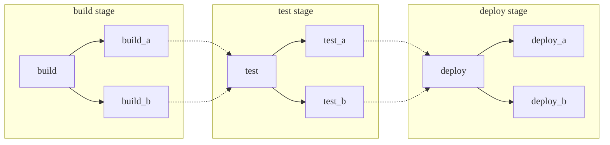
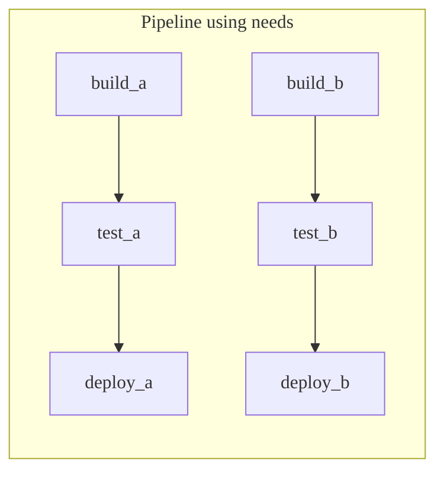
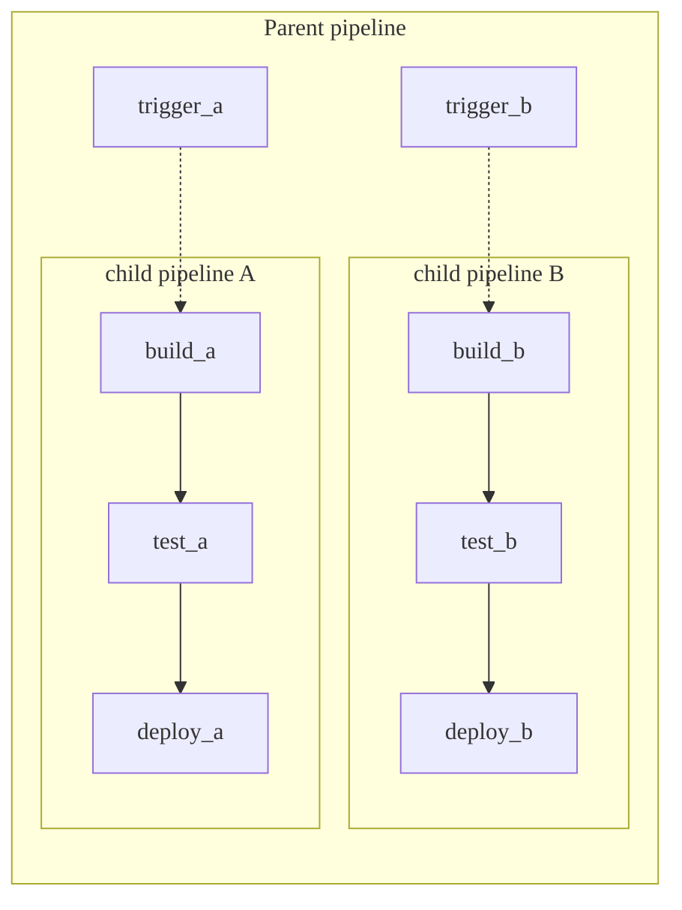



- プラン:Free、Premium、Ultimate
- 提供:GitLab.com、GitLab Self-Managed、GitLab Dedicated



パイプラインは、GitLabのCI/CDの基本的な構成要素です。このページでは、パイプラインに関連する重要なドキュメントについて説明します。

さまざまな方法でパイプラインを構造化でき、それぞれに利点があります。これらの方法は、必要に応じて組み合わせて使用できます:

- [基本](#basic-pipelines):すべての設定が 1 か所にまとめられている、単純なプロジェクトに適しています。
- [`needs` キーワードを使用したパイプライン](#pipelines-with-the-needs-keyword):効率的な実行が必要な、大規模で複雑なプロジェクトに適しています。
- [親子パイプライン](#parent-child-pipelines):モノレポや、独立して定義されたコンポーネントが多数あるプロジェクトに適しています。

  <i class="fa fa-youtube-play youtube" aria-hidden="true"></i> 概要については、[親子パイプラインの機能デモ](https://youtu.be/n8KpBSqZNbk)をご覧ください。

- [マルチプロジェクトパイプライン](downstream_pipelines.md#multi-project-pipelines):[マイクロサービスアーキテクチャー](https://about.gitlab.com/blog/2016/08/16/trends-in-version-control-land-microservices/)を使用しているものなど、プロジェクト間の相互依存関係を必要とする大規模な製品に適しています。

  たとえば、3つの異なるGitLabプロジェクトからWebアプリケーションをデプロイできます。マルチプロジェクトパイプラインを使用すると、各プロジェクトでパイプラインをトリガーでき、それぞれが独自のビルド、テスト、およびデプロイプロセスを持ちます。プロジェクト間のすべての相互依存関係を含め、接続されたパイプラインを 1 か所で視覚化できます。

  <i class="fa fa-youtube-play youtube" aria-hidden="true"></i> 概要については、[マルチプロジェクトパイプラインのデモ](https://www.youtube.com/watch?v=g_PIwBM1J84)をご覧ください。

## 基本的なパイプライン

基本的なパイプラインは、GitLabで最もシンプルなパイプラインです。ビルドステージのすべてを同時に実行し、それらがすべて完了すると、Test および後続のステージのすべてを同じように実行します。効率的ではなく、多くのステップがある場合は非常に複雑になる可能性がありますが、メンテナンスは簡単です。



図と一致する基本的な`/.gitlab-ci.yml`パイプライン設定の例:

```yaml
stages:
  - build
  - test
  - deploy

default:
  image: alpine

build_a:
  stage: build
  script:
    - echo "This job builds something."

build_b:
  stage: build
  script:
    - echo "This job builds something else."

test_a:
  stage: test
  script:
    - echo "This job tests something. It will only run when all jobs in the"
    - echo "build stage are complete."

test_b:
  stage: test
  script:
    - echo "This job tests something else. It will only run when all jobs in the"
    - echo "build stage are complete too. It will start at about the same time as test_a."

deploy_a:
  stage: deploy
  script:
    - echo "This job deploys something. It will only run when all jobs in the"
    - echo "test stage complete."
  environment: production

deploy_b:
  stage: deploy
  script:
    - echo "This job deploys something else. It will only run when all jobs in the"
    - echo "test stage complete. It will start at about the same time as deploy_a."
  environment: production
```

## `needs`キーワードを使用したパイプライン

効率性が重要で、すべてをできるだけ早く実行したい場合は、[`needs` キーワード](../yaml/needs.md)を使用してジョブ間の依存関係を定義できます。GitLabはジョブ間の依存関係を認識しているため、ジョブは可能な限り高速に実行でき、同じステージ内の他のジョブよりも早く開始することもできます。

以下の例では、`build_a`と`test_a`が`build_b`と`test_b`よりもはるかに高速な場合、GitLabは`build_b`がまだ実行中であっても`deploy_a`を開始します。



図と一致する`/.gitlab-ci.yml`設定の例:

```yaml
stages:
  - build
  - test
  - deploy

default:
  image: alpine

build_a:
  stage: build
  script:
    - echo "This job builds something quickly."

build_b:
  stage: build
  script:
    - echo "This job builds something else slowly."

test_a:
  stage: test
  needs: [build_a]
  script:
    - echo "This test job will start as soon as build_a finishes."
    - echo "It will not wait for build_b, or other jobs in the build stage, to finish."

test_b:
  stage: test
  needs: [build_b]
  script:
    - echo "This test job will start as soon as build_b finishes."
    - echo "It will not wait for other jobs in the build stage to finish."

deploy_a:
  stage: deploy
  needs: [test_a]
  script:
    - echo "Since build_a and test_a run quickly, this deploy job can run much earlier."
    - echo "It does not need to wait for build_b or test_b."
  environment: production

deploy_b:
  stage: deploy
  needs: [test_b]
  script:
    - echo "Since build_b and test_b run slowly, this deploy job will run much later."
  environment: production
```

## 親子パイプライン

パイプラインが複雑になるにつれて、いくつかの関連する問題が発生し始めます。

- ステージ内のすべてのステップが次のステージの最初のジョブが開始される前に完了する必要がある段階的な構造により、待ち時間が発生し、処理が遅くなります。
- 単一のグローバルパイプラインの設定は、管理が難しくなります。
- [`include`](../yaml/_index.md#include)を使用したインポートは、設定の複雑さを増し、ジョブが意図せずに重複するネームスペースの競合を引き起こす可能性があります。
- パイプラインユーザーエクスペリエンスには、操作するジョブとステージが多すぎます。

さらに、パイプラインの動作がより動的である必要がある場合があります。サブパイプラインを開始するかどうかを選択できることは、特にYAMLが動的に生成される場合に強力な機能です。

上記の[基本的なパイプライン](#basic-pipelines)および[`needs` パイプライン](#pipelines-with-the-needs-keyword)の例では、独立して構築できる2つのパッケージがあります。これらのケースは、[親子パイプライン](downstream_pipelines.md#parent-child-pipelines)の使用に最適です。設定を複数のファイルに分離し、物事をよりシンプルに保ちます。親子パイプラインを以下と組み合わせることができます。

- [`rules` キーワード](../yaml/_index.md#rules):たとえば、その領域への変更がある場合にのみ、子パイプラインをトリガーします。
- [`include` キーワード](../yaml/_index.md#include):共通の動作を取り込み、繰り返しを避けます。
- 子パイプライン内の[`needs` キーワード](#pipelines-with-the-needs-keyword)。両方の利点を実現します。



図と一致する親パイプラインの`/.gitlab-ci.yml`設定例:

```yaml
stages:
  - triggers

trigger_a:
  stage: triggers
  trigger:
    include: a/.gitlab-ci.yml
  rules:
    - changes:
        - a/*

trigger_b:
  stage: triggers
  trigger:
    include: b/.gitlab-ci.yml
  rules:
    - changes:
        - b/*
```

`needs`キーワードを利用して、`/a/.gitlab-ci.yml`にある子`a`パイプライン設定の例:

```yaml
stages:
  - build
  - test
  - deploy

default:
  image: alpine

build_a:
  stage: build
  script:
    - echo "This job builds something."

test_a:
  stage: test
  needs: [build_a]
  script:
    - echo "This job tests something."

deploy_a:
  stage: deploy
  needs: [test_a]
  script:
    - echo "This job deploys something."
  environment: production
```

`needs`キーワードを利用して、`/b/.gitlab-ci.yml`にある子`b`パイプライン設定の例:

```yaml
stages:
  - build
  - test
  - deploy

default:
  image: alpine

build_b:
  stage: build
  script:
    - echo "This job builds something else."

test_b:
  stage: test
  needs: [build_b]
  script:
    - echo "This job tests something else."

deploy_b:
  stage: deploy
  needs: [test_b]
  script:
    - echo "This job deploys something else."
  environment: production
```

ジョブは、GitLabで子パイプラインをトリガーする前または後に実行するように設定でき、共通のセットアップステップまたは統合されたデプロイが可能になります。
