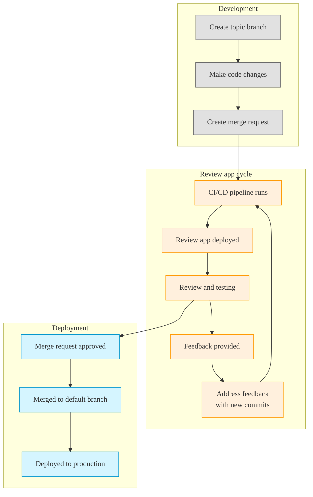



- プラン: Free、Premium、Ultimate
- 提供形態: GitLab.com、GitLab Self-Managed、GitLab Dedicated



レビューアプリは、各ブランチや各マージリクエストに対して自動的に作成される一時的なテスト環境です。ローカル開発環境をセットアップしなくても、変更をプレビューしたり検証したりできます。

[動的環境](../environments/_index.md#create-a-dynamic-environment)上に構築されたレビューアプリは、ブランチまたはマージリクエストごとに一意の環境を提供します。


これらの環境は、以下のように開発ワークフローの効率化に役立ちます。

- 変更をテストするためのローカルセットアップが不要になる。
- すべてのチームメンバーに一貫した環境を提供する。
- 関係者がURLを使用して変更をプレビューできる。
- 変更が本番環境に到達する前に、より迅速なフィードバックサイクルを促進する。



Kubernetesクラスターがある場合は、[Auto DevOps](../../topics/autodevops/_index.md)を使用してレビューアプリを自動的にセットアップできます。



## レビューアプリのワークフロー {#review-app-workflow}

レビューアプリのワークフローは、次のようなものになります。



## レビューアプリを設定する {#configure-review-apps}

各ブランチまたはマージリクエストについて、アプリケーションのプレビュー環境を提供する場合、レビューアプリを設定します。

前提要件:

- プロジェクトのデベロッパーロール以上が必要です。
- プロジェクトでCI/CDパイプラインを利用できる必要があります。
- レビューアプリをホスティングおよびデプロイするためのインフラストラクチャをセットアップする必要があります。

プロジェクトでレビューアプリを設定するには、次のようにします。

1. 左側のサイドバーで、**検索または移動先**を選択して、プロジェクトを見つけます。
1. **ビルド > パイプラインエディタ**を選択します。
1. `.gitlab-ci.yml`ファイルに、[動的環境](../environments/_index.md#create-a-dynamic-environment)を作成するジョブを追加します。各環境を区別するために、[定義済みCI/CD変数](../variables/predefined_variables.md)を使用できます。たとえば、`CI_COMMIT_REF_SLUG`定義済み変数を使用します。

   ```yaml
   review_app:
     stage: deploy
     script:
       - echo "Deploy to review app environment"
       # Add your deployment commands here
     environment:
       name: review/$CI_COMMIT_REF_SLUG
       url: https://$CI_COMMIT_REF_SLUG.example.com
     rules:
       - if: $CI_COMMIT_BRANCH && $CI_COMMIT_BRANCH != $CI_DEFAULT_BRANCH
   ```

1. （オプション）ジョブに`when: manual`を追加して、レビューアプリを手動でのみデプロイできるようにします。
1. （オプション）不要になった際に[レビューアプリを停止](#stop-review-apps)するジョブを追加します。
1. コミットメッセージを入力し、**変更をコミットする**を選択します。

### レビューアプリテンプレートを使用する {#use-the-review-apps-template}

GitLabには、マージリクエストパイプライン用にデフォルトで設定された組み込みテンプレートが用意されています。

このテンプレートを使用およびカスタマイズするには、次のようにします。

1. 左側のサイドバーで、**検索または移動先**を選択して、プロジェクトを見つけます。
1. **操作 > 環境**を選択します。
1. **レビューアプリを有効にする**を選択します。
1. 表示される**レビューアプリを有効にする**ダイアログから、YAMLテンプレートをコピーします。

   ```yaml
   deploy_review:
     stage: deploy
     script:
       - echo "Add script here that deploys the code to your infrastructure"
     environment:
       name: review/$CI_COMMIT_REF_NAME
       url: https://$CI_ENVIRONMENT_SLUG.example.com
     rules:
       - if: $CI_PIPELINE_SOURCE == "merge_request_event"
   ```

1. **ビルド > パイプラインエディタ**を選択します。
1. テンプレートを`.gitlab-ci.yml`ファイルに貼り付けます。
1. デプロイのニーズに基づいてテンプレートをカスタマイズします。

   - 実際のインフラストラクチャで動作するよう、デプロイスクリプトと環境URLに変更を加えます。
   - マージリクエストがなくてもブランチに対するレビューアプリをトリガーする必要がある場合は、[rulesセクション](../jobs/job_rules.md)を調整します。

   たとえば、Herokuへのデプロイの場合、次のようになります。

   ```yaml
   deploy_review:
     stage: deploy
     image: ruby:latest
     script:
       - apt-get update -qy
       - apt-get install -y ruby-dev
       - gem install dpl
       - dpl --provider=heroku --app=$HEROKU_APP_NAME --api-key=$HEROKU_API_KEY
     environment:
       name: review/$CI_COMMIT_REF_NAME
       url: https://$HEROKU_APP_NAME.herokuapp.com
       on_stop: stop_review_app
     rules:
       - if: $CI_PIPELINE_SOURCE == "merge_request_event"
   ```

   この設定により、マージリクエストのパイプラインが実行されるたびにHerokuに自動デプロイされるようになります。プロセスの処理にはRubyの`dpl`デプロイツールを使用しており、指定されたURLからアクセスできる動的レビュー環境を作成します。

1. コミットメッセージを入力し、**変更をコミットする**を選択します。

### レビューアプリを停止する {#stop-review-apps}

リソースを節約するため、レビューアプリを手動または自動で停止するように設定できます。

レビューアプリ環境の停止の詳細については、[環境を停止する](../environments/_index.md#stopping-an-environment)を参照してください。

#### マージ時にレビューアプリを自動停止する {#auto-stop-review-apps-on-merge}

関連するマージリクエストがマージされるかブランチが削除された時点で、レビューアプリが自動的に停止するよう設定するには、次のようにします。

1. [`on_stop`](../yaml/_index.md#environmenton_stop)キーワードをデプロイメントジョブに追加します。
1. [`environment:action: stop`](../yaml/_index.md#environmentaction)を指定した停止ジョブを作成します。
1. （オプション）レビューアプリをいつでも手動で停止できるようにするには、停止ジョブに[`when: manual`](../yaml/_index.md#when)を追加します。

次に例を示します。

```yaml
# In your .gitlab-ci.yml file
deploy_review:
  # Other configuration...
  environment:
    name: review/${CI_COMMIT_REF_NAME}
    url: https://${CI_ENVIRONMENT_SLUG}.example.com
    on_stop: stop_review_app  # References the stop_review_app job

stop_review_app:
  stage: deploy
  script:
    - echo "Stop review app"
    # Add your cleanup commands here
  environment:
    name: review/${CI_COMMIT_REF_NAME}
    action: stop
  when: manual  # Makes this job manually triggerable
  rules:
    - if: $CI_PIPELINE_SOURCE == "merge_request_event"
```

#### 時間ベースの自動停止 {#time-based-automatic-stop}

一定時間の経過後にレビューアプリが自動的に停止するよう設定するには、デプロイメントジョブに[`auto_stop_in`](../yaml/_index.md#environmentauto_stop_in)キーワードを追加します。

```yaml
# In your .gitlab-ci.yml file
review_app:
  script: deploy-review-app
  environment:
    name: review/$CI_COMMIT_REF_SLUG
    auto_stop_in: 1 week  # Stops after one week of inactivity
  rules:
    - if: $CI_MERGE_REQUEST_ID
```

## レビューアプリを表示する {#view-review-apps}

レビューアプリをデプロイしてアクセスするには、次のようにします。

1. マージリクエストに移動します。
1. （オプション）レビューアプリジョブが手動の場合は、**実行**（）を選択してデプロイをトリガーします。
1. パイプラインが完了したら、**アプリを表示**を選択して、ブラウザーでレビューアプリを開きます。

## 実装例 {#example-implementations}

以下のプロジェクトは、さまざまなレビューアプリの実装を示しています。

| プロジェクト                                                                                 | 設定ファイル |
| --------------------------------------------------------------------------------------- | ------------------ |
| [NGINX](https://gitlab.com/gitlab-examples/review-apps-nginx)                           | [`.gitlab-ci.yml`](https://gitlab.com/gitlab-examples/review-apps-nginx/-/blob/b9c1f6a8a7a0dfd9c8784cbf233c0a7b6a28ff27/.gitlab-ci.yml#L20) |
| [OpenShift](https://gitlab.com/gitlab-examples/review-apps-openshift)                   | [`.gitlab-ci.yml`](https://gitlab.com/gitlab-examples/review-apps-openshift/-/blob/82ebd572334793deef2d5ddc379f38942f3488be/.gitlab-ci.yml#L42) |
| [HashiCorp Nomad](https://gitlab.com/gitlab-examples/review-apps-nomad)                 | [`.gitlab-ci.yml`](https://gitlab.com/gitlab-examples/review-apps-nomad/-/blob/ca372c778be7aaed5e82d3be24e98c3f10a465af/.gitlab-ci.yml#L110) |
| [GitLabドキュメント](https://gitlab.com/gitlab-org/technical-writing/docs-gitlab-com) | [`build.gitlab-ci.yml`](https://gitlab.com/gitlab-org/technical-writing/docs-gitlab-com/-/blob/bdbf11814428a06e82d7b712c72b5cb53c750f29/.gitlab/ci/build.gitlab-ci.yml#L73-76) |
| [`https://about.gitlab.com/`](https://gitlab.com/gitlab-com/www-gitlab-com/)            | [`.gitlab-ci.yml`](https://gitlab.com/gitlab-com/www-gitlab-com/-/blob/6ffcdc3cb9af2abed490cbe5b7417df3e83cd76c/.gitlab-ci.yml#L332) |
| [GitLabインサイト](https://gitlab.com/gitlab-org/gitlab-insights/)                       | [`.gitlab-ci.yml`](https://gitlab.com/gitlab-org/gitlab-insights/-/blob/9e63f44ac2a5a4defc965d0d61d411a768e20546/.gitlab-ci.yml#L234) |

レビューアプリのその他の例:

- <i class="fa-youtube-play" aria-hidden="true"></i> [Cloud Native Development with GitLab](https://www.youtube.com/watch?v=jfIyQEwrocw)（GitLabを使用したクラウドネイティブ開発）。
- [Android向けのレビューアプリ](https://about.gitlab.com/blog/2020/05/06/how-to-create-review-apps-for-android-with-gitlab-fastlane-and-appetize-dot-io/)。

## ルートマップ {#route-maps}

ルートマップを使用すると、ソースファイルからレビューアプリ環境内の対応する公開ページに直接移動できます。この機能により、マージリクエスト内の特定の変更をより簡単にプレビューできます。

ルートマップを設定すると、コンテキストリンクが追加され、マッピングパターンに一致するファイルをレビューアプリ内で表示できるようになります。これらのリンクは以下に表示されます。

- マージリクエストウィジェット。
- コミットとファイルビュー。

### ルートマップを設定する {#configure-route-maps}

ルートマップを設定するには、次のようにします。

1. リポジトリ内で`.gitlab/route-map.yml`ファイルを作成します。
1. ソースパス（リポジトリ内）と公開パス（レビューアプリのインフラストラクチャまたはウェブサイト上）のマッピングを定義します。

ルートマップはYAML配列で、その各エントリは`source`パスを`public`パスにマッピングします。

ルートマップ内の各マッピングの形式は次のとおりです。

```yaml
- source: 'path/to/source/file'  # Source file in repository
  public: 'path/to/public/page'  # Public page on the website
```

次の2種類のマッピングを使用できます。

- 完全一致：一重引用符で囲んだ文字列リテラル
- パターン一致：スラッシュで囲んだ正規表現

正規表現を使用したパターンマッチングの場合:

- 正規表現は、ソースパス全体と一致する必要があります（`^`と`$`のアンカーが暗黙的に先頭と末尾に付与されます）。
- `()`のキャプチャグループを使用でき、`public`パスで参照できます。
- キャプチャグループを参照するには、出現順に`\N`式（`\1`、`\2`など）を使用します。
- スラッシュ（`/`）は`\/`、ピリオド（`.`）は`\.`としてエスケープします。

GitLabは、定義された順にマッピングを評価します。最初に一致した`source`式によって`public`パスが決定されます。

### ルートマップの例 {#example-route-map}

次の例は、[GitLabウェブサイト](https://about.gitlab.com)で使用される静的サイトジェネレーターである[Middleman](https://middlemanapp.com)のルートマップを示しています。

```yaml
# Team data
- source: 'data/team.yml'  # data/team.yml
  public: 'team/'  # team/

# Blogposts
- source: /source\/posts\/([0-9]{4})-([0-9]{2})-([0-9]{2})-(.+?)\..*/  # source/posts/2017-01-30-around-the-world-in-6-releases.html.md.erb
  public: '\1/\2/\3/\4/'  # 2017/01/30/around-the-world-in-6-releases/

# HTML files
- source: /source\/(.+?\.html).*/  # source/index.html.haml
  public: '\1'  # index.html

# Other files
- source: /source\/(.*)/  # source/images/blogimages/around-the-world-in-6-releases-cover.png
  public: '\1'  # images/blogimages/around-the-world-in-6-releases-cover.png
```

この例では:

- マッピングが順番に評価されます。
- 3番目のマッピングにより、`source/index.html.haml`は、キャッチオールの`/source\/(.*)/`ではなく`/source\/(.+?\.html).*/`に一致します。これにより、`index.html.haml`ではなく`index.html`という公開パスが生成されます。

### マップ先ページを表示する {#view-mapped-pages}

ルートマップを使用すると、ソースファイルからレビューアプリ内の対応するページに直接移動できます。

前提要件:

- `.gitlab/route-map.yml`でルートマップを設定している必要があります。
- ブランチまたはマージリクエストにレビューアプリがデプロイされている必要があります。

マージリクエストウィジェットからマップ先ページを表示するには、次のようにします。

1. マージリクエストウィジェットで、**アプリを表示**を選択します。ドロップダウンリストには、最大5件のマップ先ページが表示されます（それより多い場合はフィルタリングされます）。


ファイルからマップ先ページを表示するには、次のようにします。

1. 次のいずれかの方法で、ルートマップに一致するファイルに移動します。
   - マージリクエストから: **変更**タブで、**ファイルを表示 @ [コミット]**を選択します。
   - コミットページから: ファイル名を選択します。
   - 比較から: リビジョンを比較する際にファイル名を選択します。
1. ファイルのページで、右上隅にある**[環境名]で表示**（）を選択します。

コミットからマップ先ページを表示するには、次のようにします。

1. レビューアプリがデプロイされているコミットに移動します。
   - ブランチパイプライン: **コード > コミット**を選択し、パイプラインバッジのあるコミットを選択します。
   - マージリクエストパイプライン: マージリクエストで**コミット**タブを選択し、コミットを選択します。
   - マージ結果パイプライン: マージリクエストで**パイプライン**タブを選択し、パイプラインコミットを選択します。
1. ルートマップに一致するファイル名の横にあるレビューアプリアイコン（）を選択します。そのアイコンを選択すると、レビューアプリ内で対応するページが開きます。



マージ結果パイプラインは、ブランチとターゲットブランチをマージする内部コミットを作成します。これらのパイプラインのレビューアプリリンクにアクセスするには、**コミット**タブではなく、**パイプライン**タブのコミットを使用します。


