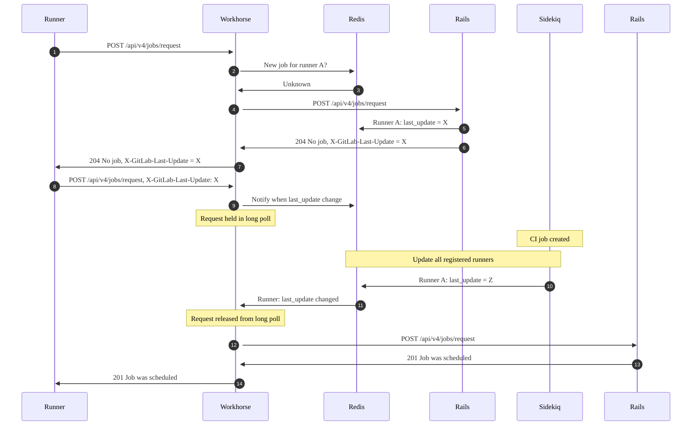



- プラン: Free、Premium、Ultimate
- 提供形態: GitLab.com、GitLab Self-Managed、GitLab Dedicated



デフォルトでは、GitLab Runnerは新しいCI/CDジョブについて、GitLabインスタンスを定期的にポーリングします。実際のポーリングの間隔は、[`check_interval`とRunner設定ファイルで設定されたRunnerの数によって異なります](https://docs.gitlab.com/runner/configuration/advanced-configuration.html#how-check_interval-works)。

多数のRunnerを処理するサーバーでは、このポーリングにより、次のパフォーマンスの問題が発生する可能性があります:

- キューイング時間が長くなる。
- GitLabインスタンスでのCPU使用率が高くなる。

これらの問題を軽減するには、ロングポーリングを有効にする必要があります。

前提要件: 

- 管理者である必要があります。

## ロングポーリングを有効にする {#enable-long-polling}

GitLabインスタンスを構成して、新しいジョブの準備ができるまで、Runnerからのジョブリクエストをロングポーリングで保持できます。

これを行うには、GitLab Workhorseのロングポーリング時間（`apiCiLongPollingDuration`）を構成して、ロングポーリングを有効にします:





1. `/etc/gitlab/gitlab.rb`を編集します: 

   ```ruby
   gitlab_workhorse['api_ci_long_polling_duration'] = "50s"
   ```

1. ファイルを保存して、GitLabを再設定します:

   ```shell
   sudo gitlab-ctl reconfigure
   ```





`gitlab.webservice.workhorse.extraArgs`設定でロングポーリングを有効にします。

1. Helmの値をエクスポートします: 

   ```shell
   helm get values gitlab > gitlab_values.yaml
   ```

1. `gitlab_values.yaml`を編集します: 

   ```yaml
   gitlab:
     webservice:
       workhorse:
         extraArgs: "-apiCiLongPollingDuration 50s"
   ```

1. ファイルを保存して、新しい値を適用します: 

   ```shell
   helm upgrade -f gitlab_values.yaml gitlab gitlab/gitlab
   ```





1. `docker-compose.yml`を編集します: 

   ```yaml
   version: "3.6"
   services:
     gitlab:
       image: 'gitlab/gitlab-ee:latest'
       restart: always
       hostname: 'gitlab.example.com'
       environment:
         GITLAB_OMNIBUS_CONFIG: |
           gitlab_workhorse['api_ci_long_polling_duration'] = "50s"
   ```

1. ファイルを保存して、GitLabを再起動します: 

   ```shell
   docker compose up -d
   ```





## メトリクス {#metrics}

ロングポーリングを有効にすると、GitLab WorkhorseはRedis PubSubチャンネルをサブスクリプションし、通知を待機します。ジョブリクエストは、Runnerキーが変更された場合、または`apiCiLongPollingDuration`に達した場合に、ロングポーリングからリリースされます。監視できるPrometheusメトリクスが多数あります:

| メトリック | 型 | 説明 | ラベル |
| -----  | ---- | ----------- | ------ |
| `gitlab_workhorse_keywatcher_keywatchers` | ゲージ | GitLab Workhorseによって監視されているキーの数 | |
| `gitlab_workhorse_keywatcher_redis_subscriptions` | ゲージ | Redis PubSubサブスクリプションの数 | |
| `gitlab_workhorse_keywatcher_total_messages` | カウンター | GitLab WorkhorseがPubSubチャンネルで受信したメッセージの総数 | |
| `gitlab_workhorse_keywatcher_actions_total` | カウンター | さまざまなキーウォッチャーアクションの数 | `action` |
| `gitlab_workhorse_keywatcher_received_bytes_total` | カウンター | PubSubチャンネルで受信した合計バイト数 | |

[あるユーザーがこれらのメトリクスを使用して、ロングポーリングの問題をどのように発見したかの例](https://gitlab.com/gitlab-org/omnibus-gitlab/-/issues/8329)を確認できます。

## ロングポーリングワークフロー {#long-polling-workflow}

この図は、単一のRunnerがロングポーリングを有効にしてジョブを取得する方法を示しています:



ステップ1で、Runnerが新しいジョブをリクエストすると、`POST`リクエスト（`/api/v4/jobs/request`）をGitLabサーバーに発行します。これは、最初にWorkhorseによって処理されます。

Workhorseは、`X-GitLab-Last-Update`ヘッダーからRunnerトークンと値を読み取り、キーを構築し、そのキーを使用してRedis PubSubチャンネルをサブスクリプションします。キーの値が存在しない場合、WorkhorseはすぐにリクエストをRailsに転送します（ステップ3と4）。

Railsはジョブキューをチェックします。Runnerが使用できるジョブがない場合、Railsは`204 No job`と`last_update`トークンをRunnerに返します（ステップ5〜7）。

Runnerはその`last_update`トークンを使用し、別のジョブのリクエストを発行して、`X-GitLab-Last-Update`ヘッダーにこのトークンを入力します。今回、WorkhorseはRunnerの`last_update`トークンが変更されたかどうかを確認します。そうでない場合、Workhorseは`apiCiLongPollingDuration`で指定された時間だけリクエストを保持します。

ユーザーが新しいパイプラインまたは実行するジョブをトリガーすると、Sidekiqのバックグラウンドタスクは、ジョブで使用可能なすべてのRunnerの`last_update`の値を更新します。Runnerは、プロジェクト、グループ、インスタンスに登録できます。

ステップ10と11のこの「ティック」は、Workhorseロングポーリングキューからジョブリクエストをリリースし、リクエストがRails（ステップ12）に送信されます。Railsは使用可能なジョブを検索し、そのジョブにRunnerを割り当てます（ステップ13と14）。

ロングポーリングを使用すると、新しいジョブが使用可能になった直後に、Runnerに通知が送信されます。これにより、ジョブのキュー時間を短縮できるだけでなく、新しい作業がある場合にのみジョブリクエストがRailsに到達するため、サーバーのオーバーヘッドも削減されます。

## トラブルシューティング {#troubleshooting}

longポーリングを使用している場合、以下の問題が発生する可能性があります。

### ジョブのピックアップの遅延 {#slow-job-pickup}

ロングポーリングは、一部のRunner構成では、Runnerがタイムリーにジョブをピックアップしないため、デフォルトでは有効になっていません。[issue 27709](https://gitlab.com/gitlab-org/gitlab-runner/-/issues/27709)を参照してください。

これは、Runner `config.toml`の`concurrent`設定が、定義されたRunnerの数よりも低い値に設定されている場合に発生する可能性があります。この問題を解決するには、`concurrent`の値がRunnerの数以上の値になっていることを確認してください。

`config.toml`に3つの`[[runners]]`エントリがある場合、`concurrent`が少なくとも3に設定されていることを確認してください。

ロングポーリングが有効になっている場合、Runner:

1. `concurrent`個のGoroutineを起動します。
1. ロングポーリング後にGoroutineが戻るのを待ちます。
1. 別のリクエストのバッチを実行します。

たとえば、単一の`config.toml`が構成されている場合を考えてみます:

- プロジェクトAの3つのRunner。
- プロジェクトBの1つのRunner。
- `concurrent`が3に設定されます。

この例では、Runnerは最初の3つのプロジェクトに対してGoroutineを起動します。最悪の場合、RunnerはプロジェクトAの完全なロングポーリング間隔を待ってから、プロジェクトBのジョブをリクエストする処理に進みます。
