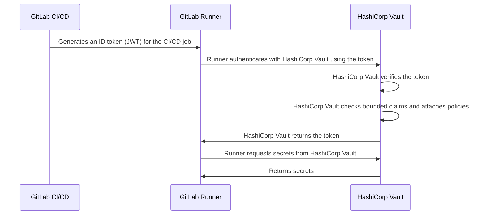



- プラン: Free、Premium、Ultimate
- 提供形態: GitLab.com、GitLab Self-Managed、GitLab Dedicated





- GitLab 15.7で[導入](https://gitlab.com/gitlab-org/gitlab/-/issues/356986)されました。



IDトークンは、[JSON Webトークン (JSON Webトークン)](https://www.rfc-editor.org/rfc/rfc7519)で、GitLab CI/CDによって生成されます。CI/CDジョブは、サードパーティサービスとのOIDC認証にIDトークンを使用できます。対象となるサービスは次のとおりです:

- [シークレットプロバイダー](_index.md)
- [クラウドサービス](../cloud_services/_index.md)

たとえば、IDトークンを使用してHashiCorp Vaultで認証を行うフローは、次の図にまとめられています:



IDトークンは、[`secrets`](../yaml/_index.md#secrets)キーワードでも使用されます。

## CI/CDジョブでIDトークンを設定する {#configure-id-tokens-in-a-cicd-job}

IDトークンを使用するには、[`id_tokens`](../yaml/_index.md#id_tokens)キーワードでCI/CDジョブを設定します。

例: 

```yaml
job_with_id_tokens:
  id_tokens:
    FIRST_ID_TOKEN:
      aud: https://first.service.com
    SECOND_ID_TOKEN:
      aud: https://second.service.com
  script:
    - first-service-authentication-script.sh $FIRST_ID_TOKEN
    - second-service-authentication-script.sh $SECOND_ID_TOKEN
```

この例では、2つのトークンには異なる`aud`クレームが含まれています。サードパーティサービスは、バインドされたオーディエンスに一致する`aud`クレームを持たないトークンを拒否するように設定できます。この機能を使用して、トークンが認証に使用できるサービスの数を減らします。これにより、トークンが侵害された場合の重大度が軽減されます。

## トークンのペイロード {#token-payload}

各IDトークンには、次の標準クレームが含まれています:

| フィールド                                                              | 説明 |
|--------------------------------------------------------------------|-------------|
| [`iss`](https://www.rfc-editor.org/rfc/rfc7519.html#section-4.1.1) | トークンの発行者。これはGitLabインスタンスのドメイン（「issuer」クレーム）です。 |
| [`sub`](https://www.rfc-editor.org/rfc/rfc7519.html#section-4.1.2) | トークンのサブジェクト（「subject」クレーム）。デフォルトは`project_path:{group}/{project}:ref_type:{type}:ref:{branch_name}`です。[プロジェクトAPI](../../api/projects.md#edit-a-project)でプロジェクトに対して設定できます。 |
| [`aud`](https://www.rfc-editor.org/rfc/rfc7519.html#section-4.1.3) | トークンの対象オーディエンス（「audience」クレーム）。[IDトークン](#configure-id-tokens-in-a-cicd-job)設定で指定されます。デフォルトではGitLabインスタンスのドメイン。 |
| [`exp`](https://www.rfc-editor.org/rfc/rfc7519.html#section-4.1.4) | 有効期限（「expiration time」クレーム）。 |
| [`nbf`](https://www.rfc-editor.org/rfc/rfc7519.html#section-4.1.5) | トークンが有効になる時刻（「not before」クレーム）。 |
| [`iat`](https://www.rfc-editor.org/rfc/rfc7519.html#section-4.1.6) | JWTが発行された時刻（「issued at」クレーム）。 |
| [`jti`](https://www.rfc-editor.org/rfc/rfc7519.html#section-4.1.7) | トークンの固有識別子（「JWT ID」クレーム）。 |

トークンには、GitLabによって提供されるカスタムクレームも含まれています:

| フィールド                   | 使用時                                       | 説明 |
|-------------------------|--------------------------------------------|-------------|
| `project_id`            | 常時                                     | ジョブを実行しているプロジェクトのID。マージリクエストパイプラインでは、これはソースブランチプロジェクトのIDです。 |
| `project_path`          | 常時                                     | ジョブを実行しているプロジェクトのパス。マージリクエストパイプラインでは、これはソースブランチプロジェクトのパスです。 |
| `namespace_id`          | 常時                                     | ジョブを実行しているプロジェクトのネームスペースID。マージリクエストパイプラインでは、これはソースブランチプロジェクトのネームスペースIDです。 |
| `namespace_path`        | 常時                                     | ジョブを実行しているプロジェクトのネームスペースパス。マージリクエストパイプラインでは、これはソースブランチプロジェクトのネームスペースパスです。 |
| `user_id`               | 常時                                     | ジョブを実行しているユーザーのID。 |
| `user_login`            | 常時                                     | ジョブを実行しているユーザーのユーザー名。 |
| `user_email`            | 常時                                     | ジョブを実行しているユーザーのメール。 |
| `user_access_level`     | 常時                                     | ジョブを実行しているユーザーのアクセスレベル。GitLab 16.9で[導入](https://gitlab.com/gitlab-org/gitlab/-/issues/432052)されました。 |
| `job_project_id`        | 常時                                     | ジョブを実行しているプロジェクトのID。これを使用して、IDでプロジェクトにスコープを設定します。GitLab 18.4で[導入](https://gitlab.com/gitlab-org/gitlab/-/issues/563038)されました。 |
| `job_project_path`      | 常時                                     | ジョブを実行しているプロジェクトのパス。これを使用して、パスでプロジェクトにスコープを設定します。GitLab 18.4で[導入](https://gitlab.com/gitlab-org/gitlab/-/issues/563038)されました。 |
| `job_namespace_id`      | 常時                                     | ジョブを実行しているプロジェクトのネームスペースID。IDでグループまたはユーザーレベルのネームスペースにスコープを設定するために使用します。GitLab 18.4で[導入](https://gitlab.com/gitlab-org/gitlab/-/issues/563038)されました。 |
| `job_namespace_path`    | 常時                                     | ジョブを実行しているプロジェクトのネームスペースパス。パスでグループまたはユーザーレベルのネームスペースにスコープを設定するために使用します。GitLab 18.4で[導入](https://gitlab.com/gitlab-org/gitlab/-/issues/563038)されました。 |
| `user_identities`       | ユーザー設定で有効のとき                    | ユーザーの外部IDのリスト（GitLab 16.0で[導入](https://gitlab.com/gitlab-org/gitlab/-/issues/387537)されました）。 |
| `pipeline_id`           | 常時                                     | パイプラインのID。 |
| `pipeline_source`       | 常時                                     | [パイプラインソース](../jobs/job_rules.md#common-if-clauses-with-predefined-variables)。 |
| `job_id`                | 常時                                     | ジョブのID。 |
| `ref`                   | 常時                                     | このジョブのGit ref。マージリクエストパイプラインでは、これはソースブランチrefsです。 |
| `ref_type`              | 常時                                     | Git refタイプ（`branch`または`tag`）。 |
| `ref_path`              | 常時                                     | ジョブの完全修飾参照。たとえば`refs/heads/main`などです。マージリクエストパイプラインでは、これはソースブランチrefsパスです。GitLab 16.0で[導入](https://gitlab.com/gitlab-org/gitlab/-/merge_requests/119075)されました。 |
| `ref_protected`         | 常時                                     | Git参照が保護されている場合は`true`、それ以外の場合は`false`。 |
| `groups_direct`         | ユーザーが0 - 200のグループの直接メンバーであるとき | ユーザーの直接メンバーシップグループのパス。ユーザーが200を超えるグループの直接のメンバーである場合は省略されます。（GitLab 16.11で[導入](https://gitlab.com/gitlab-org/gitlab/-/issues/435848)され、GitLab 17.3で`ci_jwt_groups_direct`[機能フラグ](../../administration/feature_flags/_index.md)の背後に置かれました。 |
| `environment`           | ジョブが環境を指定するとき               | このジョブのデプロイ先の環境。 |
| `environment_protected` | ジョブが環境を指定するとき               | デプロイされた環境が保護されている場合は`true`、それ以外の場合は`false`。 |
| `deployment_tier`       | ジョブが環境を指定するとき               | ジョブが指定する環境の[デプロイ層](../environments/_index.md#deployment-tier-of-environments)。GitLab 15.2で[導入](https://gitlab.com/gitlab-org/gitlab/-/issues/363590)されました。 |
| `environment_action`    | ジョブが環境を指定するとき               | ジョブで指定された[環境アクション（`environment:action`）](../environments/_index.md)。（GitLab 16.5で[導入](https://gitlab.com/gitlab-org/gitlab/-/)されました） |
| `runner_id`             | 常時                                     | ジョブを実行しているRunnerのID。GitLab 16.0で[導入](https://gitlab.com/gitlab-org/gitlab/-/issues/404722)されました。 |
| `runner_environment`    | 常時                                     | ジョブで使用されるRunnerのタイプ。`gitlab-hosted`または`self-hosted`のいずれかになります。GitLab 16.0で[導入](https://gitlab.com/gitlab-org/gitlab/-/issues/404722)されました。 |
| `sha`                   | 常時                                     | ジョブのコミットSHA。GitLab 16.0で[導入](https://gitlab.com/gitlab-org/gitlab/-/issues/404722)されました。 |
| `ci_config_ref_uri`     | 常時                                     | トップレベルのパイプライン定義への参照パス（例: `gitlab.example.com/my-group/my-project//.gitlab-ci.yml@refs/heads/main`）。GitLab 16.2で[導入](https://gitlab.com/gitlab-org/gitlab/-/issues/404722)されました。パイプライン定義が同じプロジェクトにない場合、このクレームは`null`です。 |
| `ci_config_sha`         | 常時                                     | `ci_config_ref_uri`のGitコミットSHA。GitLab 16.2で[導入](https://gitlab.com/gitlab-org/gitlab/-/issues/404722)されました。パイプライン定義が同じプロジェクトにない場合、このクレームは`null`です。 |
| `project_visibility`    | 常時                                     | パイプラインが実行されているプロジェクトの[表示レベル](../../user/public_access.md)。`internal`、`private`、または`public`を指定できます。GitLab 16.3で[導入](https://gitlab.com/gitlab-org/gitlab/-/issues/418810)されました。 |

```json
{
  "namespace_id": "72",
  "namespace_path": "my-group",
  "project_id": "20",
  "project_path": "my-group/my-project",
  "user_id": "1",
  "user_login": "sample-user",
  "user_email": "sample-user@example.com",
  "user_identities": [
      {"provider": "github", "extern_uid": "2435223452345"},
      {"provider": "bitbucket", "extern_uid": "john.smith"}
  ],
  "pipeline_id": "574",
  "pipeline_source": "push",
  "job_id": "302",
  "ref": "feature-branch-1",
  "ref_type": "branch",
  "ref_path": "refs/heads/feature-branch-1",
  "ref_protected": "false",
  "groups_direct": ["mygroup/mysubgroup", "myothergroup/myothersubgroup"],
  "environment": "test-environment2",
  "environment_protected": "false",
  "deployment_tier": "testing",
  "environment_action": "start",
  "runner_id": 1,
  "runner_environment": "self-hosted",
  "sha": "714a629c0b401fdce83e847fc9589983fc6f46bc",
  "project_visibility": "public",
  "ci_config_ref_uri": "gitlab.example.com/my-group/my-project//.gitlab-ci.yml@refs/heads/main",
  "ci_config_sha": "714a629c0b401fdce83e847fc9589983fc6f46bc",
  "jti": "235b3a54-b797-45c7-ae9a-f72d7bc6ef5b",
  "iss": "https://gitlab.example.com",
  "iat": 1681395193,
  "nbf": 1681395188,
  "exp": 1681398793,
  "sub": "project_path:my-group/my-project:ref_type:branch:ref:feature-branch-1",
  "aud": "https://vault.example.com"
}
```

IDトークンはRS256を使用してエンコードされ、専用の秘密キーで署名されます。トークンの有効期限は、ジョブのタイムアウト（指定されている場合）または5分（タイムアウトが指定されていない場合）に設定されます。

## トラブルシューティング {#troubleshooting}

### `400: missing token`ステータスコード {#400-missing-token-status-code}

このエラーは、IDトークンに必要な基本コンポーネントが1つ以上欠落しているか、予期したとおりに設定されていないことを示しています。

管理者が問題を特定するには、失敗した特定の方法について、インスタンスの`exceptions_json.log`で詳細を確認できます。

### `GitLab::Ci::Jwt::NoSigningKeyError` {#gitlabcijwtnosigningkeyerror}

`exceptions_json.log`ファイル内のこのエラーは、署名キーがデータベースから欠落しており、トークンを生成できなかったことが原因で発生している可能性があります。これが問題であることを確認するには、インスタンスのPostgreSQLターミナルで次のクエリを実行します:

```sql
SELECT encrypted_ci_jwt_signing_key FROM application_settings;
```

返された値が空の場合は、次のRailsスニペットを使用して新しいキーを生成し、内部的に置き換えます:

```ruby
  key = OpenSSL::PKey::RSA.new(2048).to_pem

  ApplicationSetting.find_each do |application_setting|
    application_setting.update(ci_jwt_signing_key: key)
  end
```

### `401: unauthorized`ステータスコード {#401-unauthorized-status-code}

このエラーは、認証リクエストが失敗したことを示しています。GitLabパイプラインから外部サービスへのOpenID Connect（OIDC）認証を使用する場合、次のようないくつかの一般的な理由により`401 Unauthorized`エラーが発生することがあります:

- `$CI_JOB_JWT_V2`のような非推奨のトークンを、[IDトークン](#configure-id-tokens-in-a-cicd-job)の代わりに使ってしまった。詳細については、[古いバージョンのJSON Webトークンは非推奨](../../update/deprecations.md#old-versions-of-json-web-tokens-are-deprecated)を参照してください。
- `.gitlab-ci.yml`ファイルと外部サービスのOIDC Identity Providerの設定の間で`provider_name`の値が一致していない。
- GitLabが発行したIDトークンと、外部サービスが予期する内容の間で、`aud`（オーディエンス）クレームが欠落しているか、一致していない。
- GitLab CI/CDジョブで`id_tokens:`ブロックを有効にしていないか、設定していない。

このエラーを解決するには、ジョブ内でトークンをデコードします:

```shell
echo $OIDC_TOKEN | cut -d '.' -f2 | base64 -d | jq .
```

以下を確認してください:

- `aud`（オーディエンス）が、予期されるオーディエンス（外部サービスのURLなど）と一致している。
- `sub`（サブジェクト）が、サービスのIdentity Providerの設定でマップされている。
- `preferred_username`が、デフォルトでGitLab IDトークンに存在しない。
