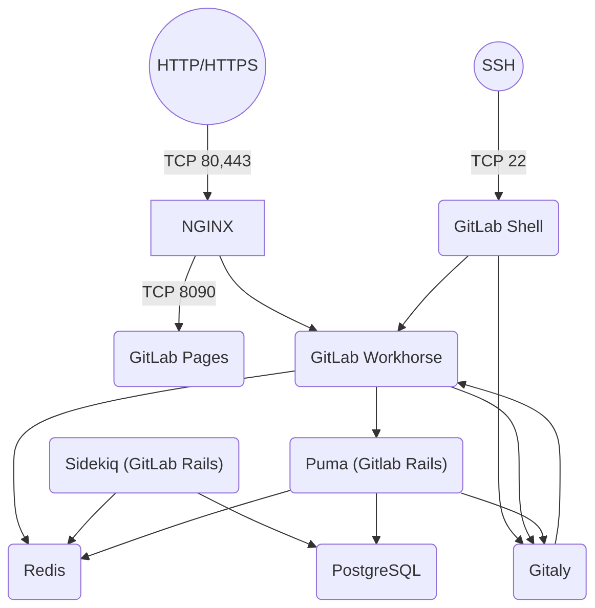
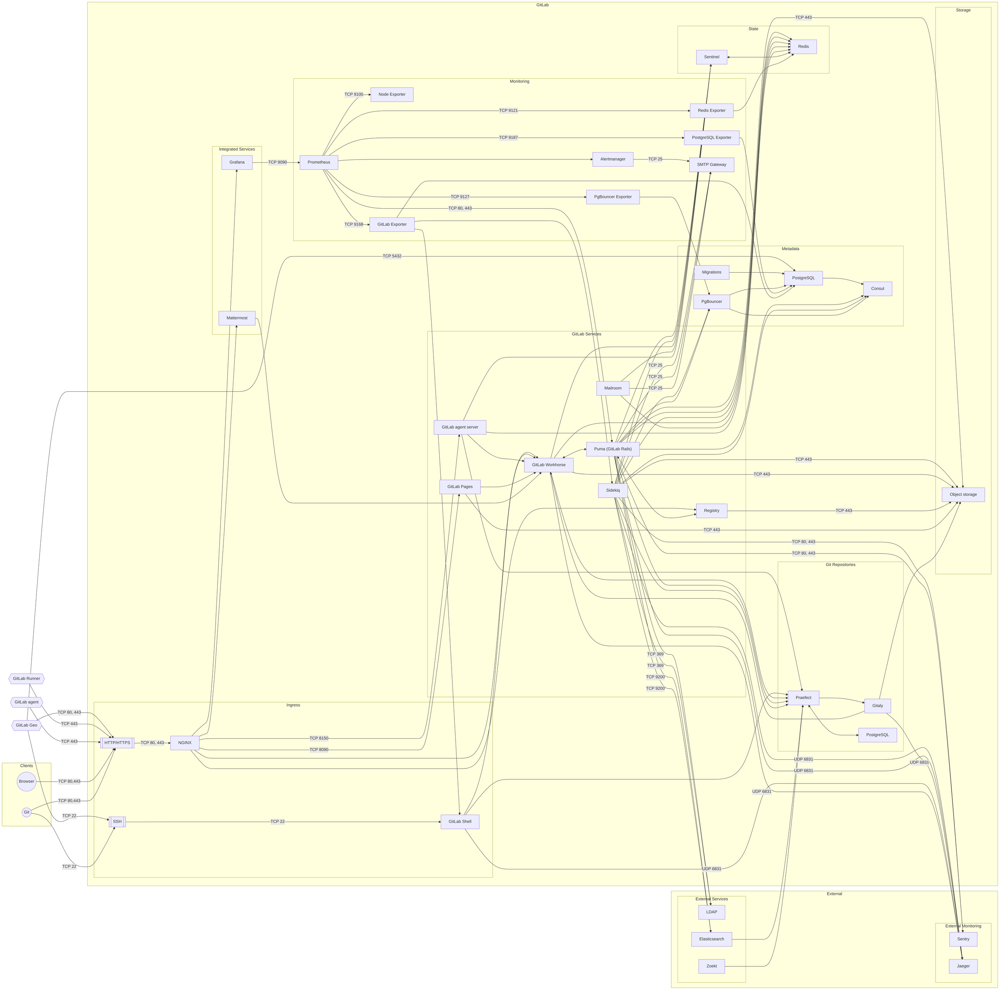
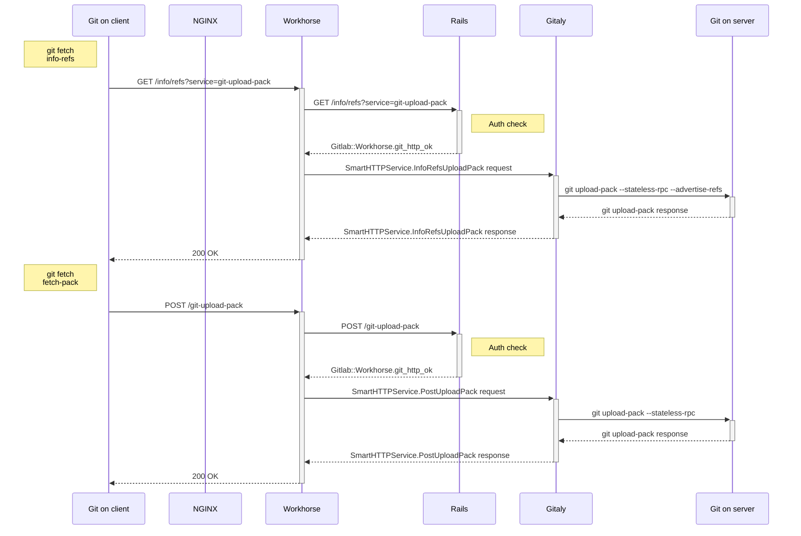
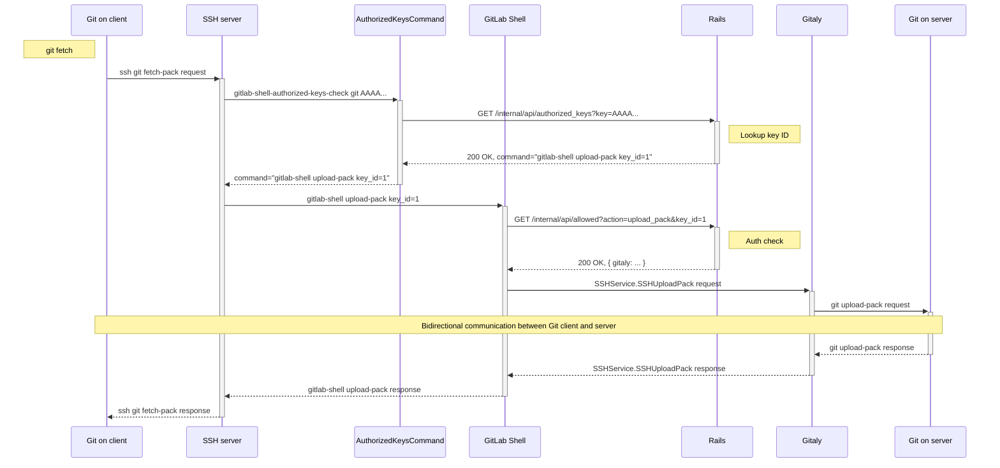

## ソフトウェアデリバリー

GitLabのソフトウェアディストリビューションには2種類あります。

- オープンソースの[Community Edition](https://gitlab.com/gitlab-org/gitlab-foss/)（CE）。
- オープンコアの[Enterprise Edition](https://gitlab.com/gitlab-org/gitlab/)（EE）。

EEリポジトリはアーカイブされました。GitLabは現在、[単一のコードベース](https://about.gitlab.com/blog/2019/08/23/a-single-codebase-for-gitlab-community-and-enterprise-edition/)で運用しています。

GitLabは[さまざまなサブスクリプション](https://about.gitlab.com/pricing/)で利用できます。

GitLabの新しいバージョンは安定したブランチからリリースしていて、最先端の開発には`main`ブランチを使用します。

詳細については、[GitLabリリースプロセス](https://handbook.gitlab.com/handbook/engineering/releases/)を参照してください。

どちらのディストリビューションにも追加のコンポーネントが必要です。追加のコンポーネントについては[コンポーネントの詳細](#components)セクションで説明していますが、すべて独自のリポジトリを備えています。各依存コンポーネントの新バージョンは通常はタグですが、GitLabコードベースの`main`ブランチを使用すると、そのコンポーネントの最新の安定バージョンを入手できます。新バージョンは通常、GitLabのリリースとほぼ同時にリリースされますが、重大と見なされる非公式のセキュリティアップデートは例外です。

## コンポーネント

GitLabの一般的なインストールはGNU/Linux上で行いますが、Kubernetesプラットフォームを使用するデプロイも増えています。既知の最大のGitLabインスタンスはGitLab.com上にあり、[公式GitLab Helmチャート](https://docs.gitlab.com/charts/)と[公式Linuxパッケージ](https://about.gitlab.com/install/)を使用してデプロイしています。

一般的なインストールでは、WebサーバーとしてNGINXまたはApacheを使用し、[GitLab Workhorse](https://gitlab.com/gitlab-org/gitlab/tree/master/workhorse)をプロキシとして経由して[Puma](https://puma.io)アプリケーションサーバーにアクセスします。GitLabは、Pumaアプリケーションサーバーを使用してWebページと[GitLab API](../api/rest/_index.md)を提供します。Sidekiqをジョブキューとして使用し、同様にRedisをジョブ情報、メタデータ、受信ジョブの非永続化データベースバックエンドとして使用します。

デフォルトでは、PumaとWorkhorse間の通信はUnixドメインソケット経由ですが、TCP経由でリクエストの転送もサポートしています。Workhorseは`gitlab/public`ディレクトリにアクセスし、Pumaアプリケーションサーバーをバイパスして、静的ページ、アバター画像や添付ファイルなどのアップロード、プリコンパイル済みの資産を提供します。

GitLabアプリケーションは、永続化データベース情報（ユーザー、権限、イシュー、その他のメタデータなど）にPostgreSQLを使用します。GitLabは、[設定ファイルの`repositories:`セクション](https://gitlab.com/gitlab-org/gitlab/-/blob/master/config/gitlab.yml.example)で定義した場所にGitのベアリポジトリを格納します。デフォルトのブランチとフック情報も、ベアリポジトリで保持します。

HTTP/HTTPSでリポジトリを機能させる場合、GitLabはGitLab APIを使用して認証とアクセスを解決し、Gitオブジェクトを提供します。

アドオンコンポーネントのGitLab Shellは、SSHでリポジトリを提供します。[設定ファイルの`GitLab Shell`セクション](https://gitlab.com/gitlab-org/gitlab/-/blob/master/config/gitlab.yml.example)で定義した場所でSSHキーを管理します。その場所にあるファイルは、手動で編集しないでください。GitLab Shellは、Gitalyを介してベアリポジトリにアクセスしてGitオブジェクトを提供し、Redisと通信してジョブをGitLabで処理するためにSidekiqに送信します。GitLab ShellはGitLab APIにクエリを発行して、認証とアクセスを判断します。

Gitalyは、GitLab ShellとGitLab WebアプリからGitオペレーションを実行し、GitLab WebアプリにAPIを提供して、Gitから属性（タイトル、ブランチ、タグ、その他のメタデータなど）を取得し、blob（差分、コミット、ファイルなど）を取得します。

[GitLab.comの本番環境のアーキテクチャ](https://handbook.gitlab.com/handbook/engineering/infrastructure/production/architecture/)にも興味があるかもしれません。

## 既存のコンポーネントに適応し新しいコンポーネントを導入する

従来のLinuxマシンにインストールした場合、Kubernetesなどのコンテナ化したプラットフォームと比較して、アプリケーションの動作には根本的な違いがあります。

[公式のインストール方法](https://about.gitlab.com/install/)と比較した場合の顕著な違いを以下に挙げます。

- 公式のLinuxパッケージは、異なるサービスで同じファイルシステム上のファイルにアクセスできます。[共有ファイル](shared_files.md)は、Kubernetesプラットフォームで実行しているアプリケーションのオプションではありません。
- 公式のLinuxパッケージでは、デフォルトで共有設定とネットワークにアクセスできるサービスがあります。Kubernetesで実行されているサービスではそうではなく、サービスを完全に分離して実行したり、特定のポート経由でのみアクセス可能だったりする場合があります。

つまり、新機能を設計して新コンポーネントを追加するときは、サービス間の共有状態を慎重に検討する必要があります。同じファイルにアクセスする必要があるサービスは、適切なAPIを通じて情報を交換できるようにする必要があります。可能であれば、これはファイルを介して行うべきではありません。

APIファーストの理念を念頭に置いて作成したコンポーネントは両方の方式と互換性があるため、新機能と新サービスは、必ずKubernetesとの互換性を**第一に**考慮して作成する必要があります。

これを確保する最も簡単な方法は、[公式のGitLab Helmチャート](https://docs.gitlab.com/charts/)に機能やサービスのサポートを追加するか、[ディストリビューションチーム](https://handbook.gitlab.com/handbook/engineering/infrastructure/core-platform/systems/distribution/#how-to-work-with-distribution)に連絡することです。

詳細については、[新しいサービスコンポーネントを追加するプロセス](adding_service_component.md)を参照してください。

### コンポーネントの概要（簡略版）

これはGitLabアーキテクチャを理解するための、簡略化したアーキテクチャ図です。

完全なアーキテクチャ図は、以下の[コンポーネント図](#component-diagram)にあります。



特に指定しない限り、すべての接続でUnixソケットを使用します。

### コンポーネント図



### コンポーネントの凡例

- ✅ - デフォルトでインストール
- ⚙ - 追加の設定が必要
- ⤓ - 手動インストールが必要
- ❌ - サポートされていないか、利用可能な指示がない
- N/A - 該当なし

コンポーネントのステータスは、各コンポーネントの設定ドキュメントにリンクしています。

### コンポーネントリスト

| コンポーネント                                             | 説明                                                          | [オムニバスGitLab](https://docs.gitlab.com/omnibus/) | [GitLab Environment Toolkit（GET）](https://gitlab.com/gitlab-org/gitlab-environment-toolkit) | [GitLabチャート](https://docs.gitlab.com/charts/) | [minikube Minimal](https://docs.gitlab.com/charts/development/minikube/#deploying-gitlab-with-minimal-settings) | [GitLab.com](https://gitlab.com) | [ソース](../install/installation.md) | [GitLab Development Kit（GDK）](https://gitlab.com/gitlab-org/gitlab-development-kit) |  [CE/EE](https://about.gitlab.com/install/ce-or-ee/)  |
|-------------------------------------------------------|----------------------------------------------------------------------|:--------------:|:--------------:|:------------:|:----------------:|:----------:|:------:|:---:|:-------:|
| [証明書管理](#certificate-management)     | TLS 設定、Let's Encrypt                                          |       ✅       |       ✅        |      ✅       |        ⚙         |     ✅      |   ⚙    |  ⚙  | CEとEE |
| [Consul](#consul)                                     | データベースノードの調査、フェイルオーバー                                    |       ⚙       |       ✅         |      ❌       |        ❌         |     ✅      |   ❌    |  ❌  | EEのみ |
| [データベースの移行](#database-migrations)           | データベースの移行                                                  |       ✅       |       ✅        |      ✅       |        ✅         |     ✅      |   ⚙    |  ✅  | CEとEE |
| [Elasticsearch](#elasticsearch)                       | GitLab内の検索を改善                                        |       ⤓        |       ⚙        |      ⤓       |        ⤓         |     ✅      |   ⤓    |  ⚙ | EEのみ |
| [Gitaly](#gitaly)                                     | GitLabが行うすべてのGit呼び出しを処理するGit RPCサービス            |       ✅       |       ✅        |      ✅       |        ✅         |     ✅      |   ⚙    |  ✅  | CEとEE |
| [GitLab Exporter](#gitlab-exporter)                   | さまざまなGitLabメトリクスを生成                                |       ✅       |       ✅        |      ✅       |        ✅         |     ✅      |   ❌    |  ❌  | CEとEE |
| [GitLab Geo](#gitlab-geo)                        | 地理的に分散したGitLabサイト                              |       ⚙        |       ⚙      |        ❌      |        ❌         |     ✅      |   ❌    |  ⚙  | EEのみ |
| [GitLab Pages](#gitlab-pages)                         | 静的ウェブサイトをホスト                                                |       ⚙       |       ⚙        |      ⚙       |        ❌         |     ✅      |   ⚙    |  ⚙  | CEとEE |
| [GitLabエージェント](#gitlab-agent)              | クラウドネイティブな方法でKubernetesクラスターを統合                  |       ⚙       |       ⚙        |      ⚙       |        ❌         |     ❌      |   ⤓    |  ⚙   | EEのみ |
| [GitLab自己モニタリング: Alertmanager](#alertmanager) | Prometheusからのアラートの重複排除、グループ化、ルーティング              |       ⚙       |       ⚙        |      ✅       |        ⚙         |     ✅      |   ❌    |  ❌  | CEとEE |
| [GitLab自己モニタリング: Grafana](#grafana)           | メトリクスダッシュボード                                                    |       ✅       |       ✅        |      ⚙       |        ⤓         |     ✅      |   ❌    |  ⚙  | CEとEE |
| [GitLab自己モニタリング: Jaeger](#jaeger)             | GitLabインスタンスが生成したトレースを表示                         |       ❌       |       ⚙        |      ⚙       |        ❌         |     ❌      |   ⤓    |  ⚙  | CEとEE |
| [GitLab自己モニタリング: Prometheus](#prometheus)     | 時系列データベース、メトリクス収集、クエリサービス          |       ✅       |       ✅        |      ✅       |        ⚙         |     ✅      |   ❌    |  ⚙  | CEとEE |
| [GitLab自己モニタリング: Sentry](#sentry)             | GitLabインスタンスが生成したエラーを追跡                        |       ⤓        |       ⤓        |      ⤓       |        ❌         |     ✅      |   ⤓    |  ⤓  | CEとEE |
| [GitLab Shell](#gitlab-shell)                         | SSHセッションで`git`を処理                                      |       ✅       |       ✅        |      ✅       |        ✅         |     ✅      |   ⚙    |  ✅  | CEとEE |
| [GitLab Workhorse](#gitlab-workhorse)                 | スマートリバースプロキシ、大規模なHTTPリクエストを処理                     |       ✅       |       ✅        |      ✅       |        ✅         |     ✅      |   ⚙    |  ✅  | CEとEE |
| [受信メール（SMTP）](#inbound-email)                | イシューを更新するメッセージを受信                                    |       ⤓        |       ⤓        |      ⚙       |        ⤓         |     ✅      |   ⤓    |  ⤓  | CEとEE |
| [Jaegerインテグレーション](#jaeger)                         | デプロイしたアプリの分散トレーシング                                |       ⤓        |       ⤓        |      ⤓       |        ⤓         |     ⤓      |   ⤓    |  ⚙  | EEのみ |
| [LDAP認証](#ldap-authentication)           | 一元化されたLDAPディレクトリのユーザーを認証                |       ⤓        |       ⤓        |      ⤓       |        ⤓         |     ❌      |   ⤓    |  ⚙  | CEとEE |
| [Mattermost](#mattermost)                             | オープンソースのSlackの代替                                        |       ⚙       |       ⚙        |      ⤓       |        ⤓         |     ⤓      |   ❌    |  ⚙  | CEとEE |
| [MinIO](#minio)                                       | オブジェクトストレージサービス                                               |       ⤓        |       ⤓        |      ✅       |        ✅         |     ✅      |   ❌    |  ⚙  | CEとEE |
| [NGINX](#nginx)                                       | リクエストを適切なコンポーネントにルーティングし、SSLを終端            |       ✅       |       ✅        |      ✅       |        ⚙         |     ✅      |   ⤓    |  ⚙  | CEとEE |
| [ノードExporter](#node-exporter)                       | システムメトリクスを含むPrometheusエンドポイント                              |       ✅       |       ✅        |     N/A      |       N/A        |     ✅      |   ❌    |  ❌  | CEとEE |
| [送信メール（SMTP）](#outbound-email)              | ユーザーにメールメッセージを送信                                         |       ⤓        |       ⤓        |      ⚙       |        ⤓         |     ✅      |   ⤓    |  ⤓  | CEとEE |
| [Patroni](#patroni)                                   | PostgreSQL HAクラスターのリーダー選択とレプリケーションを管理        |       ⚙       |       ✅        |      ❌       |        ❌         |     ✅      |   ❌    |  ❌  | EEのみ |
| [PgBouncer Exporter](#pgbouncer-exporter)             | PgBouncerメトリクスを含むPrometheusエンドポイント                           |       ⚙       |       ✅        |      ❌       |        ❌         |     ✅      |   ❌    |  ❌  | CEとEE |
| [PgBouncer](#pgbouncer)                               | データベース接続プーリング、フェイルオーバー                                |       ⚙       |       ✅        |      ❌       |        ❌         |     ✅      |   ❌    |  ❌  | EEのみ |
| [PostgreSQL Exporter](#postgresql-exporter)           | PostgreSQLメトリクスを含むPrometheusエンドポイント                          |       ✅       |       ✅        |      ✅       |        ✅         |     ✅      |   ❌    |  ❌  | CEとEE |
| [PostgreSQL](#postgresql)                             | データベース                                                             |       ✅       |       ✅        |      ✅       |        ✅         |     ✅      |   ⤓    |  ✅  | CEとEE |
| [Praefect](#praefect)                                 | GitクライアントとGitalyストレージノード間の透過型プロキシ。 |       ✅       |       ✅        |      ⚙       |        ❌         |     ❌      |   ⚙    |  ✅  | CEとEE |
| [Puma（GitLab Rails）](#puma)                          | WebインターフェースとAPI間のリクエストを処理                       |       ✅       |       ✅        |      ✅       |        ✅         |     ✅      |   ⚙    |  ✅  | CEとEE |
| [Redis Exporter](#redis-exporter)                     | Redisメトリクスを含むPrometheusエンドポイント                               |       ✅       |       ✅        |      ✅       |        ✅         |     ✅      |   ❌    |  ❌  | CEとEE |
| [Redis](#redis)                                       | キャッシュサービス                                                      |       ✅       |       ✅        |      ✅       |        ✅         |     ✅      |   ⤓    |  ✅  | CEとEE |
| [レジストリ](#registry)                                 | コンテナレジストリ。イメージのプッシュとプルを許可             |       ⚙       |       ⚙        |      ✅       |        ✅         |     ✅      |   ⤓    |  ⚙  | CEとEE |
| [Runner](#gitlab-runner)                              | GitLab CI/CDジョブを実行                                           |       ⤓        |       ⤓        |      ✅       |        ⚙         |     ✅      |   ⚙    |  ⚙  | CEとEE |
| [Sentryインテグレーション](#sentry)                         | デプロイしたアプリのエラー追跡                                     |       ⤓        |       ⤓        |      ⤓       |        ⤓         |     ⤓      |   ⤓    |  ⤓  | CEとEE |
| [Sidekiq](#sidekiq)                                   | バックグラウンドジョブプロセッサ                                            |       ✅       |       ✅        |      ✅       |        ✅         |     ✅      |   ✅    |  ✅  | CEとEE |
| [トークン失効API](sec/token_revocation_api.md)   | 流出したシークレットを受信して失効させる                                  |       ❌       |       ❌        |      ❌       |        ❌         |     ✅      |   ❌    |  ❌  | EEのみ |

### コンポーネントの詳細

このドキュメントは、GitLabの内部構造とその連携方法について、より深く理解したいシステム管理者やGitLabサポートエンジニアによる利用を想定して作成しています。

デプロイ時、GitLabは以下のプロセスの集合体と見なす必要があります。トラブルシューティングまたはデバッグを行う際は、どのコンポーネントを参照しているかを可能な限り特定します。それで明確性が向上し、混乱を軽減します。

**レイヤ**

GitLabは、プロセスの観点からは2つのレイヤを持つと考えることができます。

- **モニタリング**: このレイヤのものはGitLabアプリケーションの提供には不要ですが、管理者はインフラストラクチャやサービス全体の動作についてより深く知ることができます。
- **コア**: プラットフォームとしてのGitLabの提供に不可欠なプロセス。このプロセスのいずれかが停止すると、GitLabが停止します。コアレイヤは、さらに以下に分類できます。
  - **プロセッサ**: このプロセスは実際に操作を実行し、サービスを提供する機能を分担しています。
  - **データ**: このサービスはGitLabサービス用に構造化されたデータを保存/公開します。

#### Alertmanager

- [プロジェクトページ](https://github.com/prometheus/alertmanager/blob/main/README.md)
- 設定:
  - [Omnibus](https://gitlab.com/gitlab-org/omnibus-gitlab/blob/master/files/gitlab-config-template/gitlab.rb.template)
  - [チャート](https://github.com/helm/charts/tree/master/stable/prometheus)
- レイヤ: モニタリング
- プロセス: `alertmanager`
- GitLab.com: [GitLab.comのモニタリング](https://handbook.gitlab.com/handbook/engineering/monitoring/)

[Alertmanager](https://prometheus.io/docs/alerting/latest/alertmanager/)はPrometheusが提供するツールで、_Prometheusサーバーなどのクライアントアプリケーションが送信したアラートを処理します。メール、PagerDuty、Opsgenieなどの適切な受信側インテグレーションへの重複排除、グループ化、ルーティングを行います。また、アラートのサイレント化と禁止も行います。_アラートの内容については、[イシュー#45740](https://gitlab.com/gitlab-org/gitlab-foss/-/issues/45740)をご覧ください。

#### 証明書管理

- プロジェクトページ:
  - [Omnibus](https://github.com/certbot/certbot/blob/master/README.rst)
  - [チャート](https://github.com/cert-manager/cert-manager/blob/master/README.md)
- 設定:
  - [Omnibus](https://docs.gitlab.com/omnibus/settings/ssl/)
  - [チャート](https://docs.gitlab.com/charts/installation/tls.html)
  - [ソース](../install/installation.md#using-https)
  - [GitLab Development Kit（GDK）](https://gitlab.com/gitlab-org/gitlab-development-kit/-/blob/main/doc/howto/nginx.md)
- レイヤ: コアサービス（プロセッサ）
- GitLab.com: [シークレット管理](https://handbook.gitlab.com/handbook/engineering/infrastructure/production/architecture/#secrets-management)

#### Consul

- [プロジェクトページ](https://github.com/hashicorp/consul/blob/main/README.md)
- 設定:
  - [Omnibus](../administration/consul.md)
  - [チャート](https://docs.gitlab.com/charts/installation/deployment.html#postgresql)
- レイヤ: コアサービス（データ）
- GitLab.com: [Consul](../user/gitlab_com/_index.md#consul)

Consulは、サービスディスカバリと設定のためのツールです。Consulは分散型で可用性が高く、高度にスケーラブルです。

#### データベースの移行

- 設定:
  - [Omnibus](https://docs.gitlab.com/omnibus/settings/database.html#disabling-automatic-database-migration)
  - [チャート](https://docs.gitlab.com/charts/charts/gitlab/migrations/)
  - [ソース](../update/upgrading_from_source.md#install-libraries-and-run-migrations)
- レイヤ: コアサービス（データ）

#### Elasticsearch

- [プロジェクトページ](https://github.com/elastic/elasticsearch/)
- 設定:
  - [Omnibus](../integration/advanced_search/elasticsearch.md)
  - [チャート](../integration/advanced_search/elasticsearch.md)
  - [ソース](../integration/advanced_search/elasticsearch.md)
  - [GitLab Development Kit（GDK）](https://gitlab.com/gitlab-org/gitlab-development-kit/blob/main/doc/howto/elasticsearch.md)
- レイヤ: コアサービス（データ）
- GitLab.com: [GitLab.comでの高度な検索の動作（完了）](https://gitlab.com/groups/gitlab-org/-/epics/153) エピックを取得します。

Elasticsearchは、クラウド向けに構築された分散RESTful検索エンジンです。

#### Gitaly

- [プロジェクトページ](https://gitlab.com/gitlab-org/gitaly/blob/master/README.md)
- 設定:
  - [Omnibus](../administration/gitaly/_index.md)
  - [チャート](https://docs.gitlab.com/charts/charts/gitlab/gitaly/)
  - [ソース](../install/installation.md#install-gitaly)
- レイヤ: コアサービス（データ）
- プロセス: `gitaly`

Gitalyは、GitLabの分散デプロイ（GitLab.comやHA（高可用性）デプロイなど）においてGitストレージにNFSを必要としないように、GitLabが設計したサービスです。11.3.0の時点で、このサービスはGitLabでのすべてのGitレベルのアクセスを処理します。このプロジェクトの詳細については、[プロジェクトのREADME](https://gitlab.com/gitlab-org/gitaly)を参照してください。

#### Praefect

- [プロジェクトページ](https://gitlab.com/gitlab-org/gitaly/blob/master/README.md)
- 設定:
  - [Omnibus](../administration/gitaly/_index.md)
  - [ソース](../install/installation.md#install-gitaly)
- レイヤ: コアサービス（データ）
- プロセス: `praefect`

Praefectは、各GitクライアントとGitaly間の透過型プロキシで、セカンダリノードへのリポジトリの更新のレプリケーションを調整します。

#### GitLab Geo

- 設定:
  - [Omnibus](../administration/geo/setup/_index.md)
  - [チャート](https://docs.gitlab.com/charts/advanced/geo/)
  - [GitLab Development Kit（GDK）](https://gitlab.com/gitlab-org/gitlab-development-kit/blob/main/doc/howto/geo.md)
- レイヤ: コアサービス（プロセッサ）

Geoは、プライマリGitLabインスタンスの1つ以上の読み取り専用ミラーを提供して、分散したチームによる開発を高速化するように構築した高度な機能です。このミラー（Geoセカンダリサイト）は、大規模なリポジトリやプロジェクトのクローンやフェッチにかかる時間を短縮したり、ディザスタリカバリソリューションの一部にしたりできます。

#### GitLab Exporter

- [プロジェクトページ](https://gitlab.com/gitlab-org/ruby/gems/gitlab-exporter)
- 設定:
  - [Omnibus](../administration/monitoring/prometheus/gitlab_exporter.md)
  - [チャート](https://docs.gitlab.com/charts/charts/gitlab/gitlab-exporter/)
- レイヤ: モニタリング
- プロセス: `gitlab-exporter`
- GitLab.com: [GitLab.comのモニタリング](https://handbook.gitlab.com/handbook/engineering/monitoring/)

GitLab Exporterは、GitLabアプリケーションの内部に関するメトリクスをPrometheusにエクスポートできるように、社内で設計したプロセスです。詳細については[プロジェクトのREADME](https://gitlab.com/gitlab-org/ruby/gems/gitlab-exporter)を参照してください。

#### GitLabエージェント

- [プロジェクトページ](https://gitlab.com/gitlab-org/cluster-integration/gitlab-agent)
- 設定:
  - [Omnibus](https://gitlab.com/gitlab-org/omnibus-gitlab/blob/master/files/gitlab-config-template/gitlab.rb.template)
  - [チャート](https://docs.gitlab.com/charts/charts/gitlab/kas/)

[GitLabエージェント](../user/clusters/agent/_index.md)は、安全かつクラウドネイティブな方法でGitLabとKubernetesの統合タスクを解決するための、アクティブなインクラスターコンポーネントです。

これを使用して、Kubernetesクラスターへのデプロイを同期できます。

#### GitLab Pages

- 設定:
  - [Omnibus](../administration/pages/_index.md)
  - [チャート](https://gitlab.com/gitlab-org/charts/gitlab/-/issues/37)
  - [ソース](../install/installation.md#install-gitlab-pages)
  - [GitLab Development Kit（GDK）](https://gitlab.com/gitlab-org/gitlab-development-kit/blob/main/doc/howto/pages.md)
- レイヤ: コアサービス（プロセッサ）
- GitLab.com: [GitLab Pages](../user/gitlab_com/_index.md#gitlab-pages)

GitLab Pagesは、GitLabのリポジトリから静的ウェブサイトを直接公開できる機能です。

ポートフォリオ、ドキュメント、マニフェスト、ビジネスプレゼンテーションなど、個人用またはビジネス用のウェブサイトのいずれかに使用できます。コンテンツにライセンスを付与することもできます。

#### GitLab Runner

- [プロジェクトページ](https://gitlab.com/gitlab-org/gitlab-runner/blob/main/README.md)
- 設定:
  - [Omnibus](https://docs.gitlab.com/runner/)
  - [チャート](https://docs.gitlab.com/runner/install/kubernetes.html)
  - [ソース](https://docs.gitlab.com/runner/)
  - [GitLab Development Kit（GDK）](https://gitlab.com/gitlab-org/gitlab-development-kit/blob/main/doc/howto/runner.md)
- レイヤ: コアサービス（プロセッサ）
- GitLab.com: [Runner](../ci/runners/_index.md)

GitLab Runnerはジョブを実行し、結果をGitLabに送信します。

GitLab CI/CDは、GitLabに含まれているオープンソースの継続的インテグレーションサービスであり、テストを統合します。このプロジェクトの以前の名前は`GitLab CI Multi Runner`でしたが、今後は`GitLab Runner`（CIなし）を使用します。

#### GitLab Shell

- [プロジェクトページ](https://gitlab.com/gitlab-org/gitlab-shell/)
- [ドキュメント](gitlab_shell/_index.md)
- 設定:
  - [Omnibus](https://gitlab.com/gitlab-org/omnibus-gitlab/blob/master/files/gitlab-config-template/gitlab.rb.template)
  - [チャート](https://docs.gitlab.com/charts/charts/gitlab/gitlab-shell/)
  - [ソース](../install/installation.md#install-gitlab-shell)
  - [GitLab Development Kit（GDK）](https://gitlab.com/gitlab-org/gitlab/-/blob/master/config/gitlab.yml.example)
- レイヤ: コアサービス（プロセッサ）

[GitLab Shell](gitlab_shell/_index.md)はGitLabで設計したプログラムで、SSHベースの`git`セッションを処理し、許可されたキーのリストを変更します。GitLab ShellはUnixシェルではなく、BashやZshの代替でもありません。

#### GitLab Workhorse

- [プロジェクトページ](https://gitlab.com/gitlab-org/gitlab/-/blob/master/doc/development/workhorse/index.md)
- 設定:
  - [Omnibus](https://gitlab.com/gitlab-org/omnibus-gitlab/blob/master/files/gitlab-config-template/gitlab.rb.template)
  - [チャート](https://docs.gitlab.com/charts/charts/gitlab/webservice/)
  - [ソース](../install/installation.md#install-gitlab-workhorse)
- レイヤ: コアサービス（プロセッサ）
- プロセス: `gitlab-workhorse`

[GitLab Workhorse](https://gitlab.com/gitlab-org/gitlab/-/tree/master/doc/development/workhorse)はGitLabで設計したプログラムで、Pumaからの圧力を軽減します。[開発の歴史的理由](https://about.gitlab.com/blog/2016/04/12/a-brief-history-of-gitlab-workhorse/)を参照してください。GitLab全体を高速化するための、スマートリバースプロキシとして機能するように設計しています。

#### Grafana

- [プロジェクトページ](https://github.com/grafana/grafana/blob/master/README.md)
- 設定:
  - [Omnibus](../administration/monitoring/performance/grafana_configuration.md)
  - [チャート](https://docs.gitlab.com/charts/charts/globals#configure-grafana-integration)
- レイヤ: モニタリング
- GitLab.com: [GitLabトリアージGrafanaダッシュボード](https://dashboards.gitlab.com/d/RZmbBr7mk/gitlab-triage?refresh=30s)

Grafanaは、Graphite、Elasticsearch、OpenTSDB、Prometheus、InfluxDB用の、オープンソースで機能豊富なメトリクスダッシュボードおよびグラフエディタです。

#### Jaeger

- [プロジェクトページ](https://github.com/jaegertracing/jaeger/blob/main/README.md)
- 設定:
  - [Omnibus](https://gitlab.com/gitlab-org/omnibus-gitlab/-/issues/4104)
  - [チャート](https://docs.gitlab.com/charts/charts/globals#tracing)
  - [ソース](distributed_tracing.md#enabling-distributed-tracing)
  - [GitLab Development Kit（GDK）](distributed_tracing.md#using-jaeger-in-the-gitlab-development-kit)
- レイヤ: モニタリング
- GitLab.com: [GitLabインスタンスのトレーシングを有効化する設定](https://gitlab.com/gitlab-org/omnibus-gitlab/-/issues/4104)のイシュー。

DapperとOpenZipkinに触発されたJaegerは、分散トレーシングシステムです。マイクロサービスベースの分散システムの監視に使用できます。

#### Logrotate

- [プロジェクトページ](https://github.com/logrotate/logrotate/blob/main/README.md)
- 設定:
  - [Omnibus](https://docs.gitlab.com/omnibus/settings/logs.html#logrotate)
- レイヤ: コアサービス
- プロセス: `logrotate`

GitLabは、すべてをログに記録する多数のサービスで構成されています。独自のLogrotateをバンドルし、責任を持ってログ記録を確認しています。これは一般的なオープンソース製品の単なるパッケージ化バージョンです。

#### Mattermost

- [プロジェクトページ](https://github.com/mattermost/mattermost/blob/master/README.md)
- 設定:
  - [Omnibus](../integration/mattermost/_index.md)
  - [チャート](https://docs.mattermost.com/install/install-mmte-helm-gitlab-helm.html)
- レイヤ: コアサービス（プロセッサ）
- GitLab.com: [Mattermost](../user/project/integrations/mattermost.md)

Mattermostは<https://mattermost.com>による、オープンソースのプライベートクラウドによるSlack代替品です。

#### MinIO

- [プロジェクトページ](https://github.com/minio/minio/blob/master/README.md)
- 設定:
  - [Omnibus](https://min.io/download)
  - [チャート](https://docs.gitlab.com/charts/charts/minio/)
  - [GitLab Development Kit（GDK）](https://gitlab.com/gitlab-org/gitlab-development-kit/blob/main/doc/howto/object_storage.md)
- レイヤ: コアサービス（データ）
- GitLab.com: [ストレージアーキテクチャ](https://handbook.gitlab.com/handbook/engineering/infrastructure/production/architecture/#storage-architecture)

MinIOは、GNU AGPL v3.0の下でリリースされたオブジェクトストレージサーバーです。Amazon S3 Cloud Storageサービスと互換性があります。写真、ビデオ、ログファイル、バックアップ、コンテナ/VMイメージなどの非構造化データの保存に最適です。オブジェクトのサイズは数KBから最大5 TBまでです。

#### NGINX

- プロジェクトページ:
  - [Omnibus](https://github.com/nginx/nginx)
  - [チャート](https://github.com/kubernetes/ingress-nginx/blob/main/README.md)
- 設定:
  - [Omnibus](https://docs.gitlab.com/omnibus/settings/nginx.html)
  - [チャート](https://docs.gitlab.com/charts/charts/nginx/)
  - [ソース](../install/installation.md#10-nginx)
- レイヤ: コアサービス（プロセッサ）
- プロセス: `nginx`

NGINXには、すべてのHTTPリクエストのIngressポートがあり、GitLab内の適切なサブシステムにルーティングします。一般的なオープンソースのWebサーバーの未変更バージョンをバンドルしています。

#### ノードExporter

- [プロジェクトページ](https://github.com/prometheus/node_exporter/blob/master/README.md)
- 設定:
  - [Omnibus](../administration/monitoring/prometheus/node_exporter.md)
  - [チャート](https://gitlab.com/gitlab-org/charts/gitlab/-/issues/1332)
- レイヤ: モニタリング
- プロセス: `node-exporter`
- GitLab.com: [GitLab.comのモニタリング](https://handbook.gitlab.com/handbook/engineering/monitoring/)

[Node Exporter](https://github.com/prometheus/node_exporter)はPrometheusのツールで、基盤となるマシン（CPU /ディスク/ロードなど）にメトリクスを提供します。これはPrometheusプロジェクトからの一般的なオープンソース製品の、単なるパッケージ化バージョンです。

#### Patroni

- [プロジェクトページ](https://github.com/patroni/patroni)
- 設定:
  - [Omnibus](../administration/postgresql/replication_and_failover.md#patroni)
- レイヤ: コアサービス（データ）
- プロセス: `patroni`
- GitLab.com: [データベースアーキテクチャ](https://handbook.gitlab.com/handbook/engineering/infrastructure/production/architecture/#database-architecture)

#### PgBouncer

- [プロジェクトページ](https://github.com/pgbouncer/pgbouncer/blob/master/README.md)
- 設定:
  - [Omnibus](../administration/postgresql/pgbouncer.md)
  - [チャート](https://docs.gitlab.com/charts/installation/deployment.html#postgresql)
- レイヤ: コアサービス（データ）
- GitLab.com: [データベースアーキテクチャ](https://handbook.gitlab.com/handbook/engineering/infrastructure/production/architecture/#database-architecture)

PostgreSQL用の軽量コネクションプーラー。

#### PgBouncer Exporter

- [プロジェクトページ](https://github.com/prometheus-community/pgbouncer_exporter/blob/master/README.md)
- 設定:
  - [Omnibus](../administration/monitoring/prometheus/pgbouncer_exporter.md)
  - [チャート](https://docs.gitlab.com/charts/installation/deployment.html#postgresql)
- レイヤ: モニタリング
- GitLab.com: [GitLab.comのモニタリング](https://handbook.gitlab.com/handbook/engineering/monitoring/)

PgBouncer用Prometheus exporter。9127/メトリクスでメトリクスをエクスポートします。

#### PostgreSQL

- [プロジェクトページ](https://github.com/postgres/postgres/)
- 設定:
  - [Omnibus](https://docs.gitlab.com/omnibus/settings/database.html)
  - [チャート](https://docs.gitlab.com/charts/installation/deployment.html#postgresql)
  - [ソース](../install/installation.md#7-database)
- レイヤ: コアサービス（データ）
- プロセス: `postgresql`
- GitLab.com: [PostgreSQL](https://handbook.gitlab.com/handbook/engineering/infrastructure/database/)

GitLabは一般的なデータベースをパッケージ化し、アプリケーションのメタデータとユーザー情報のストレージを提供しています。

#### PostgreSQL Exporter

- [プロジェクトページ](https://github.com/prometheus-community/postgres_exporter/blob/master/README.md)
- 設定:
  - [Omnibus](../administration/monitoring/prometheus/postgres_exporter.md)
  - [チャート](https://docs.gitlab.com/charts/installation/deployment.html#postgresql)
- レイヤ: モニタリング
- プロセス: `postgres-exporter`
- GitLab.com: [GitLab.comのモニタリング](https://handbook.gitlab.com/handbook/engineering/monitoring/)

[`postgres_exporter`](https://github.com/prometheus-community/postgres_exporter)はコミュニティが提供するPrometheus exporterで、Grafanaダッシュボードで使用するためにPostgreSQLに関するデータをPrometheusに提供します。

#### Prometheus

- [プロジェクトページ](https://github.com/prometheus/prometheus/blob/main/README.md)
- 設定:
  - [Omnibus](../administration/monitoring/prometheus/_index.md)
  - [チャート](https://docs.gitlab.com/charts/installation/deployment.html#prometheus)
- レイヤ: モニタリング
- プロセス: `prometheus`
- GitLab.com: [Prometheus](../user/gitlab_com/_index.md#prometheus)

Prometheusは時系列ツールで、GitLab管理者がGitLabサービスを提供する際に使用する、個別のプロセスに関するメトリクスの公開に役立ちます。

#### Redis

- [プロジェクトページ](https://github.com/redis/redis/blob/unstable/README.md)
- 設定:
  - [Omnibus](https://docs.gitlab.com/omnibus/settings/redis.html)
  - [チャート](https://docs.gitlab.com/charts/installation/deployment.html#redis)
  - [ソース](../install/installation.md#8-redis)
- レイヤ: コアサービス（データ）
- プロセス: `redis`

Redisは、以下の情報を格納する場所を提供するようパッケージ化しています。

- セッションデータ
- 一時キャッシュ情報
- バックグラウンドジョブキュー

GitLabでのRedisの使用方法の詳細については、[Redisガイドライン](redis.md)を参照してください。

#### Redis Exporter

- [プロジェクトページ](https://github.com/oliver006/redis_exporter/blob/master/README.md)
- 設定:
  - [Omnibus](../administration/monitoring/prometheus/redis_exporter.md)
  - [チャート](https://docs.gitlab.com/charts/installation/deployment.html#redis)
- レイヤ: モニタリング
- プロセス: `redis-exporter`
- GitLab.com: [GitLab.comのモニタリング](https://handbook.gitlab.com/handbook/engineering/monitoring/)

[Redis Exporter](https://github.com/oliver006/redis_exporter)は、Redisプロセスに関する特定のメトリクスをPrometheusに提供し、そのメトリクスをGrafanaでグラフ化できるように設計しています。

#### レジストリ

- [プロジェクトページ](https://gitlab.com/gitlab-org/container-registry)
- 設定:
  - [Omnibus](../administration/packages/container_registry.md)
  - [チャート](https://docs.gitlab.com/charts/charts/registry/)
  - [ソース](https://gitlab.com/gitlab-org/container-registry/-/blob/master/docs/configuration.md?ref_type=heads)
  - [GitLab Development Kit（GDK）](https://gitlab.com/gitlab-org/gitlab-development-kit/blob/main/doc/howto/registry.md)
- レイヤ: コアサービス（プロセッサ）
- GitLab.com: [GitLabコンテナレジストリ](../user/packages/container_registry/build_and_push_images.md#use-gitlab-cicd)

レジストリは、ユーザーが独自のDockerイメージを保存する際に使用します。バンドルしているレジストリは、ロードバランサーとしてNGINXを、認証マネージャーとしてGitLabを使用します。クライアントがレジストリからイメージをプルまたはプッシュするリクエストを行うたびに、`401`レスポンスと、認証トークンを取得する場所（この場合はGitLabインスタンス）を詳細に指定するヘッダーを返します。その後クライアントはGitLabからプルまたはプッシュ認証トークンをリクエストし、レジストリへの元のリクエストを再試行します。詳細については、[トークン認証](https://distribution.github.io/distribution/spec/auth/token/)を参照してください。

外部レジストリも、GitLabを認証エンドポイントとして使用するように設定できます。

#### Sentry

- [プロジェクトページ](https://github.com/getsentry/sentry/)
- 設定:
  - [Omnibus](https://docs.gitlab.com/omnibus/settings/configuration.html#error-reporting-and-logging-with-sentry)
  - [チャート](https://docs.gitlab.com/charts/charts/globals#sentry-settings)
  - [ソース](https://gitlab.com/gitlab-org/gitlab/-/blob/master/config/gitlab.yml.example)
  - [GitLab Development Kit（GDK）](https://gitlab.com/gitlab-org/gitlab/-/blob/master/config/gitlab.yml.example)
- レイヤ: モニタリング
- GitLab.com: [Sentryの検索](https://handbook.gitlab.com/handbook/support/workflows/500_errors/#searching-sentry)

Sentryは基本的に、リアルタイムでクラッシュを監視し修正するのに役立つサービスです。サーバーはPythonで記述されていますが、どのアプリケーションでも任意の言語からイベントを送信する完全なAPIを装備しています。

デプロイしたアプリのモニタリングについては、[Sentryインテグレーションドキュメント](../operations/error_tracking.md)を参照してください

#### Sidekiq

- [プロジェクトページ](https://github.com/sidekiq/sidekiq/blob/main/README.md)
- 設定:
  - [Omnibus](https://gitlab.com/gitlab-org/omnibus-gitlab/blob/master/files/gitlab-config-template/gitlab.rb.template)
  - [チャート](https://docs.gitlab.com/charts/charts/gitlab/sidekiq/)
  - [minikube Minimal](https://docs.gitlab.com/charts/charts/gitlab/sidekiq/)
  - [ソース](https://gitlab.com/gitlab-org/gitlab/-/blob/master/config/gitlab.yml.example)
  - [GitLab Development Kit（GDK）](https://gitlab.com/gitlab-org/gitlab/-/blob/master/config/gitlab.yml.example)
- レイヤ: コアサービス（プロセッサ）
- プロセス: `sidekiq`
- GitLab.com: [Sidekiq](../user/gitlab_com/_index.md#sidekiq)

Sidekiqは、Redisキューからジョブをプルして処理するRubyバックグラウンドジョブプロセッサです。バックグラウンドジョブを使用すると、GitLabは作業をバックグラウンドに移行して、より高速なリクエスト/レスポンスサイクルを提供できます。

#### Puma

GitLab 13.0以降、PumaがデフォルトのWebサーバーです。

- [プロジェクトページ](https://gitlab.com/gitlab-org/gitlab/-/blob/master/README.md)
- 設定:
  - [Omnibus](../administration/operations/puma.md)
  - [チャート](https://docs.gitlab.com/charts/charts/gitlab/webservice/)
  - [ソース](../install/installation.md#configure-it)
  - [GitLab Development Kit（GDK）](https://gitlab.com/gitlab-org/gitlab/-/blob/master/config/gitlab.yml.example)
- レイヤ: コアサービス（プロセッサ）
- プロセス: `puma`
- GitLab.com: [Puma](../user/gitlab_com/_index.md#puma)

[Puma](https://puma.io/)はRubyアプリケーションサーバーで、GitLabでユーザー向け機能を提供するコアRailsアプリケーションの実行に使用します。これはGitLabのバージョンによっては、しばしばプロセス出力に`bundle`または`config.ru`と表示されます。

#### LDAP認証

- 設定:
  - [Omnibus](../administration/auth/ldap/_index.md)
  - [チャート](https://docs.gitlab.com/charts/charts/globals.html#ldap)
  - [ソース](https://gitlab.com/gitlab-org/gitlab/-/blob/master/config/gitlab.yml.example)
  - [GitLab Development Kit（GDK）](https://gitlab.com/gitlab-org/gitlab-development-kit/blob/main/doc/howto/ldap.md)
- レイヤ: コアサービス（プロセッサ）
- GitLab.com: [製品プラン](https://about.gitlab.com/pricing/#gitlab-com)

#### 送信メール

- 設定:
  - [Omnibus](https://docs.gitlab.com/omnibus/settings/smtp.html)
  - [チャート](https://docs.gitlab.com/charts/installation/command-line-options.html#outgoing-email-configuration)
  - [ソース](https://gitlab.com/gitlab-org/gitlab/-/blob/master/config/gitlab.yml.example)
  - [GitLab Development Kit（GDK）](https://gitlab.com/gitlab-org/gitlab/-/blob/master/config/gitlab.yml.example)
- レイヤ: コアサービス（プロセッサ）
- GitLab.com: [メール設定](../user/gitlab_com/_index.md#email)

#### 受信メール

- 設定:
  - [Omnibus](../administration/incoming_email.md)
  - [チャート](https://docs.gitlab.com/charts/installation/command-line-options.html#incoming-email-configuration)
  - [ソース](https://gitlab.com/gitlab-org/gitlab/-/blob/master/config/gitlab.yml.example)
  - [GitLab Development Kit（GDK）](https://gitlab.com/gitlab-org/gitlab/-/blob/master/config/gitlab.yml.example)
- レイヤ: コアサービス（プロセッサ）
- GitLab.com: [メール設定](../user/gitlab_com/_index.md#email)

## リクエストタイプ別のGitLab

GitLabは、エンドユーザーがサービスにアクセスするための2つの「インターフェース」を提供します。

- Web HTTPリクエスト（UI/APIの表示）
- Git HTTP/SSHリクエスト（Gitデータのプッシュ/プル）

一部のプロセスは両方に、その他のプロセスは排他的に特定のタイプのリクエストに使用されるため、この区別を理解することが重要です。

### GitLab Web HTTPリクエストサイクル

HTTPエンドポイント（`/users/sign_in`など）にリクエストを行う場合、リクエストはGitLabサービスを介して次のパスを通過します。

- NGINX - 最初の行のリバースプロキシとして機能します。
- GitLab Workhorse - これでRailsアプリケーションや他の場所にアクセスする必要があるかを判断し、Pumaへの負荷を軽減します。
- Puma - Webリクエストであればアプリケーションにアクセスする必要があるため、Pumaにルーティングされます。
- PostgreSQL/Gitaly/Redis - リクエストの種類によっては、これらのサービスにアクセスしてデータを保存または取得します。

### GitLab Gitリクエストサイクル

以下に、HTTPとSSH Gitリクエストが実行されるさまざまなパスについて説明します。Webリクエストサイクルと一部重複する部分もありますが、異なる部分もあります。

### Webリクエスト（80/443）

HTTP経由のGitオペレーションは、[Gitドキュメント](https://git-scm.com/docs/http-protocol)で説明しているステートレスな「スマート」プロトコルを使用していますが、このオペレーションを処理する責任は、複数のGitLabコンポーネントに分散されます。

これは`git fetch`のシーケンス図です。すべてのリクエストはNGINXと他のHTTPロードバランサーを通過しますが、何らかの方法でそれらが変換されることはありません。すべてのパスは`/namespace/project.git`のURLからの相対パスとして表示されます。



`git push`の場合もシーケンスはほぼ同じですが、`git-upload-pack`の代わりに`git-receive-pack`を使用します。

### SSHリクエスト（22）

SSHでのGitオペレーションは、[Gitドキュメント](https://git-scm.com/docs/pack-protocol#_ssh_transport)で説明しているステートフルなプロトコルを使用できますが、それを処理する責任は、複数のGitLabコンポーネントに分散されます。

GitLabコンポーネントはSSHを直接認識しません。すべてのSSH接続は、クライアントマシン上のGitとSSHサーバーの間で行い、SSHサーバーが接続を終了させます。SSHサーバーは、すべての接続を`git`ユーザーとして認証します。GitLabユーザーは、クライアントが提示したSSHキーで区別します。

これは`git fetch`のシーケンス図で、[高速SSHキー検索](../administration/operations/fast_ssh_key_lookup.md)が有効になっていると仮定しています。`AuthorizedKeysCommand`は[GitLab Shell](#gitlab-shell)が提供する実行可能ファイルです。



`git push`オペレーションは非常によく似ていますが、`git upload-pack`の代わりに`git receive-pack`を使用します。

高速SSHキー検索が有効になっていない場合、SSHサーバーは`~git/.ssh/authorized_keys`ファイルを読んで、特定のSSHセッションで実行するコマンドを決定します。これはユーザーがSSHキーを変更するたびに実行するようにスケジュールした、Railsの[`AuthorizedKeysWorker`](https://gitlab.com/gitlab-org/gitlab/-/blob/master/app/workers/authorized_keys_worker.rb)が最新の状態に保ちます。

[SSH証明書](../administration/operations/ssh_certificates.md)はキーの代わりに使用できます。この場合、`AuthorizedKeysCommand`は`AuthorizedPrincipalsCommand`に置き換えられます。こうしてRailsの内部APIを使用せずに証明書からユーザー名を抽出します。これは後ほど`key_id`の代わりに[`/api/internal/allowed`](internal_api/_index.md)コールで使用します。

GitLab Shellには2要素認証コードのリセットなど、Gitalyを必要としないオペレーションもいくつかあります。これらは同じ方法で処理しますが、Gitalyへのラウンドトリップはありません。Railsが[内部API](internal_api/_index.md)コールの一部としてアクションを実行し、GitLab Shellが応答をユーザーに直接ストリーミングして返します。

## システムレイアウト

図で`~git`を参照する場合、それは通常`/home/git`であるGitユーザーのホームディレクトリを意味します。

GitLabは、主に`/home/git`ユーザーのホームディレクトリに`git`ユーザーとしてインストールされます。ホームディレクトリ内には、GitLabサーバーソフトウェアとリポジトリがあります（ただしリポジトリの場所は設定可能です）。

ベアリポジトリは`/home/git/repositories`にあります。GitLabはRuby on Railsアプリケーションであり、内部の動作の詳細は、Ruby on Railsアプリケーションの動作方法を学習すれば理解できます。

SSHでリポジトリを提供するには、`/home/git/gitlab-shell`にインストールしたGitLab Shellというアドオンアプリケーションが使えます。

### インストールフォルダーの概要

要約すると、これは[`git`ユーザーのホームディレクトリのディレクトリ構造](../install/installation.md#gitlab-directory-structure)です。

### プロセス

```shell
ps aux | grep '^git'
```

GitLabには、動作させるためのコンポーネントがいくつかあります。永続化データベース（PostgreSQL）とRedisデータベースが必要で、Apache `httpd`またはNGINXを使用してPumaに`proxypass`します。これらのコンポーネントはすべて、異なるシステムユーザー（たとえば`git`ではなく`postgres`、`redis`、`www-data`など）としてGitLabに実行する必要があります。

`git`ユーザーとして、SidekiqとPuma（デフォルトでは`8080`ポートで実行されているシンプルなRuby HTTPサーバー）を起動します。GitLabユーザー下には通常、`puma master`（1プロセス）、`puma cluster worker`（2プロセス）、`sidekiq`（1プロセス）の4プロセスがあります。

### リポジトリアクセス

リポジトリには、HTTPまたはSSH経由でアクセスできます。HTTPクローニング/プッシュ/プルはGitLab APIを使用し、SSHクローニングはGitLab Shellが処理します（前述）。

## トラブルシューティング

詳細については、READMEを参照してください。

### サービスのInitスクリプト

以下のGitLab initスクリプトは、PumaとSidekiqを起動/停止します。

```plaintext
/etc/init.d/gitlab
Usage: service gitlab {start|stop|restart|reload|status}
```

Redis（キー値を保存/非永続化データベース）:

```plaintext
/etc/init.d/redis
Usage: /etc/init.d/redis {start|stop|status|restart|condrestart|try-restart}
```

SSHデーモン:

```plaintext
/etc/init.d/sshd
Usage: /etc/init.d/sshd {start|stop|restart|reload|force-reload|condrestart|try-restart|status}
```

Webサーバー（次のいずれか）:

```plaintext
/etc/init.d/httpd
Usage: httpd {start|stop|restart|condrestart|try-restart|force-reload|reload|status|fullstatus|graceful|help|configtest}

$ /etc/init.d/nginx
Usage: nginx {start|stop|restart|reload|force-reload|status|configtest}
```

永続化データベース:

```plaintext
$ /etc/init.d/postgresql
Usage: /etc/init.d/postgresql {start|stop|restart|reload|force-reload|status} [version ..]
```

### サービスのログの場所

GitLab（PumaとSidekiqのログを含む）:

- `/home/git/gitlab/log/`には通常、`application.log`、`production.log`、`sidekiq.log`、`puma.stdout.log`、`git_json.log`、`puma.stderr.log`が含まれています。

GitLab Shell:

- `/home/git/gitlab-shell/gitlab-shell.log`

SSH:

- `/var/log/auth.log`認証ログ（Ubuntuの場合）。
- `/var/log/secure`認証ログ（RHELの場合）。

NGINX:

- `/var/log/nginx/`にはエラーログとアクセスログが含まれています。

Apache `httpd`:

- [Apacheログの説明](https://httpd.apache.org/docs/2.2/logs.html)。
- `/var/log/apache2/`にはエラーログと出力ログが含まれています（Ubuntuの場合）。
- `/var/log/httpd/`にはエラーログと出力ログが含まれています（RHELの場合）。

Redis:

- `/var/log/redis/redis.log`にはログローテーションされたログもあります。

PostgreSQL:

- `/var/log/postgresql/*`

### GitLab固有の設定ファイル

GitLabでは`/home/git/gitlab/config/*`に設定ファイルがあります。一般的に参照される設定ファイルには次のものがあります。

- `gitlab.yml`: GitLab Railsの設定
- `puma.rb`: Puma Webサーバーの設定
- `database.yml`: データベース接続の設定

GitLab Shellでは`/home/git/gitlab-shell/config.yml`に設定ファイルがあります。

#### GitLab Railsに新しい設定を追加する

`gitlab.yml`に属する設定には、以下に関するものがあります。

- 複数のサービスにわたってアプリケーションを接続する方法。たとえばGitalyアドレス、Redisアドレス、Postgresアドレス、Consulアドレスなどです。
- 分散トレーシング設定と一部の可観測性設定。たとえばヒストグラムバケット境界などです。
- Railsの初期化中に、おそらくはPostgres 接続を確立する前に設定する必要があるもの。

他の多くの設定は、`ApplicationSetting`でアプリ 自体に入れる方が適切です。通常はUIで設定を管理する方が、設定ファイルを管理するよりもユーザーエクスペリエンスが優れています。開発コストに関して言えば、`gitlab.yml`を変更する方がイテレーションが迅速に思えることがよくありますが、以下のすべてのデプロイ方法を考慮すると、見合わない可能性があります。

`gitlab.yml`に設定を追加する場合は、以下のようにします。

1. [Omnibusにも追加](https://docs.gitlab.com/omnibus/settings/gitlab.yml#adding-a-new-setting-to-gitlabyml)していることを確認します。
1. 必要に応じて、[Chartsにも追加](https://docs.gitlab.com/charts/development/style_guide.html)していることを確認します。
1. [GDKにも追加](https://gitlab.com/gitlab-org/gitlab-development-kit/-/blob/main/support/templates/gitlab/config/gitlab.yml.erb)していることを確認します。

### メンテナンスタスク

[GitLab](https://gitlab.com/gitlab-org/gitlab/-/tree/master)ではバージョン情報を表示したり、設定を簡単にチェックしてアプリケーション内で適切に設定されていることを確認するための、Rakeタスクを用意しています。[メンテナンスRakeタスク](../administration/raketasks/maintenance.md)を参照してください。要するに、以下を実行します。

```shell
sudo -i -u git
cd gitlab
bundle exec rake gitlab:env:info RAILS_ENV=production
bundle exec rake gitlab:check RAILS_ENV=production
```

`sudo -i -u git`または`sudo su - git`のいずれかを使用して、`git`ユーザーとしてサインインすることを推奨します。GitLab が提供する`sudo`コマンドはUbuntuでは動作しますが、RHELでは常に動作するとは限りません。

## GitLab.com

[GitLab.com のアーキテクチャ](https://handbook.gitlab.com/handbook/engineering/infrastructure/production/architecture/)は参照用として詳しく記述していますが、このアーキテクチャは数百万人のユーザーがいる場合にのみ役立ちます。

### AIアーキテクチャ

[SaaSモデルゲートウェイ](ai_architecture.md)を使用して、AI搭載機能を有効化できます。
