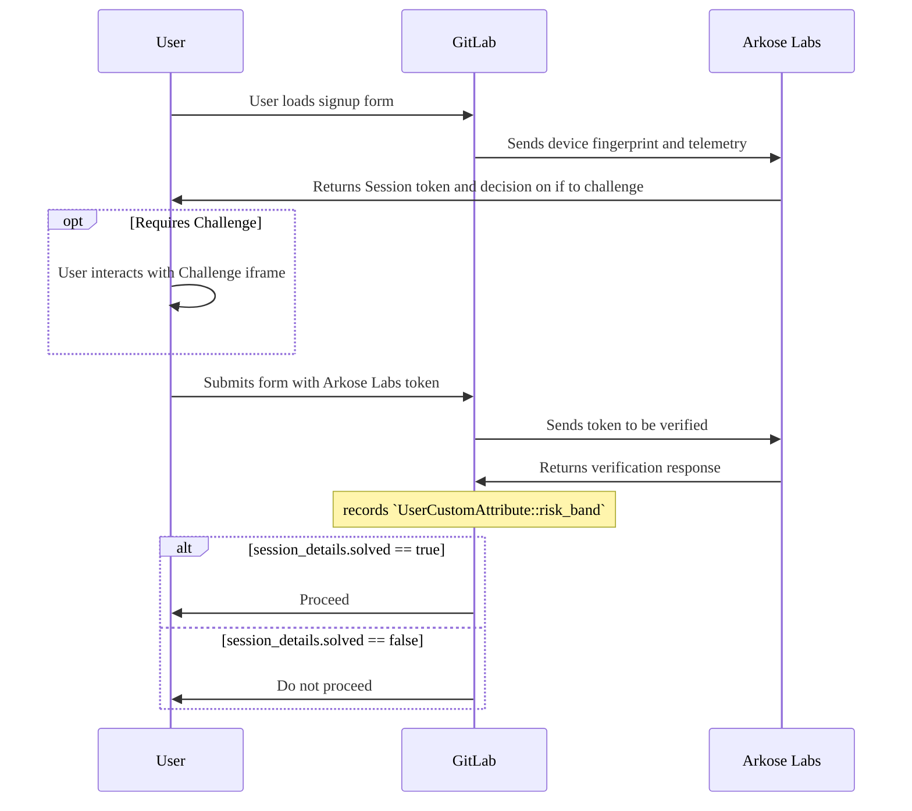



GitLab.comではArkose Protectが使用されていますが、GitLabセルフマネージドインスタンスではサポートされていません。以下は、GitLab.comでArkose Protectを維持するための社内要件をドキュメント化したものです。この機能フラグは理論的にはGitLabセルフマネージドインスタンスで使用できますが、現時点では推奨されていません。



GitLabは、悪意のあるユーザーによるアカウント作成を防ぐために、[Arkose Protect](https://www.arkoselabs.com/platform/)を統合しています。

## どのように機能しますか？ {#how-does-it-work}

Arkose Protectがユーザーを疑わしいと判断した場合、`Sign in`ボタンの下にインタラクティブなチャレンジが表示されます。サインインを試みるには、チャレンジを完了する必要があります。Arkose Protectがユーザーを信頼している場合、チャレンジは透過モードで実行されます。つまり、ユーザーは追加の操作を行う必要がなく、通常どおりサインインできます。



## 悪意のあるサインアップの試みをどのように扱いますか？ {#how-do-we-treat-malicious-sign-up-attempts}

受け取ったリスクスコアによっては、ユーザーはアカウントを登録するために、最大3つのステージの[本人確認](../security/identity_verification.md)を実行する必要がある場合があります。

## 設定 {#configuration}

Arkose Protectを有効にするには:

1. ArkoseLabsのライセンスを取得します。
1. [ArkoseLabs Portal](https://portal.arkoselabs.com/)からパブリックAPIキーとプライベートAPIキーを取得します。
1. ArkoseLabsログインチャレンジを有効にします。`<your_public_api_key>`と`<your_private_api_key>`を独自のAPIキーに置き換えて、Railsコンソールで次のコマンドを実行します。

   ```ruby
   ApplicationSetting.current.update(arkose_labs_public_api_key: '<your_public_api_key>')
   ApplicationSetting.current.update(arkose_labs_private_api_key: '<your_private_api_key>')
   ```

Arkose Protectを無効にするには、Railsコンソールで次のコマンドを実行します。

   ```ruby
   ApplicationSetting.current.update(arkose_labs_enabled: false)
   ```



Arkoseを無効にすると、電話番号とクレジットカードの認証も無効になります。新しいユーザーは、メールアドレスの確認のみを求められます。



Arkoseを無効にすると、電話番号とクレジットカードの認証も無効になることに注意してください。すべての新規ユーザーは、メールアドレスの確認のみを求められます。

## ArkoseLabsのイシューのトリアージとデバッグ {#triage-and-debug-arkoselabs-issues}

ArkoseLabsによって提起されたイシューは、以下を使用してトリアージおよびデバッグできます:

<!-- markdownlint-disable MD044 -->
- Slack上のArkoseLabsとGitLabのコラボレーションチャンネル: [\#ext-gitlab-arkose](https://gitlab.slack.com/archives/C02SGF6RLPQ)
<!-- markdownlint-enable MD044 -->

- [GitLab production logs](https://log.gprd.gitlab.net)。
- [Arkose logging service](https://gitlab.com/gitlab-org/gitlab/-/blob/master/ee/lib/arkose/logger.rb)
- [Arkose Labs Portal](https://portal.arkoselabs.com)（ユーザーはOktaポータルからアクセスをリクエストできます）

### Arkose Labsダッシュボードの分析 {#analysing-arkose-labs-dashboard}

- GitLabは定期的にセッションデータをArkoseチームに送信します。これは、悪意のあるユーザーがサインアップするのを防ぐために、カスタムのtelltaleを適用するために使用されます。
- 正常に機能している場合、ユーザーの10％未満が`high`リスクとして分類され、セッションの90％以上が検証されるはずです。
<!-- markdownlint-disable MD044 -->
- `high`リスクのあるユーザーまたは検証済みのセッションの割合が予想される割合と大幅に異なる場合は、[#ext-gitlab-arkose](https://gitlab.slack.com/archives/C02SGF6RLPQ) Slackチャンネルにお問い合わせください。
<!-- markdownlint-enable MD044 -->

### ユーザーセッションのArkoseLabs Verify API応答を表示 {#view-arkoselabs-verify-api-response-for-a-user-session}

ユーザーのArkoseLabs Verify API応答を表示するには、次のKQLを使用して[GitLab production logsをクエリします](https://log.gprd.gitlab.net/goto/54b82f50-935a-11ed-9f43-e3784d7fe3ca):

```plaintext
KQL: json.message:"Arkose challenge solved" AND json.username:replace_username_here
```

クエリが有効な場合、結果にはユーザーのセッションに関するデバッグ情報が含まれます:

| 応答 | 説明 |
|---------|-------------|
| `json.response.session_details.suppressed` | チャレンジがユーザーに表示されなかった場合、値は`true`です。ユーザーが許可リストに登録されている場合は常に`true`です。 |
| `json.arkose.risk_band` | `low`、`medium`、`high`のいずれかです。サインイン時に無視されます。本人確認イシューのデバッグに使用します。 |
| `json.response.session_details.solved` | ユーザーがチャレンジを解決したかどうかを示します。ユーザーが許可リストに登録されている場合は常に`true`です。 |
| `json.response.session_details.previously_verified` | トークンが再利用されたかどうかを示します。デフォルトは`false`です。`true`の場合、悪意のあるアクティビティーを示している可能性があります。 |

### ユーザーがArkoseLabsチャレンジに失敗したかどうかを確認する {#check-if-a-user-failed-an-arkoselabs-challenge}

ArkoseLabsチャレンジが解決されなかったためにユーザーがサインインに失敗したかどうかを確認するには、次のKQLを使用して[GitLab production logsをクエリします](https://log.gprd.gitlab.net/goto/b97c8a80-935a-11ed-85ed-e7557b0a598c):

```plaintext
KQL: json.message:"Arkose*" AND json.username:replace_username_here
```

| ログメッセージ                             | 説明 |
| --------------------------------------- | ----------- |
| `Arkose was unable to verify the token` | ユーザーはチャレンジを解決しましたが、Arkoseはトークンを検証できませんでした。同じユーザーに対してこのエラーが繰り返し表示される場合は、Arkose側にエラーがある可能性があります。 |
| `Arkose challenge not solved`           | ユーザーはチャレンジを解決しませんでした。 |
| `Arkose challenge solved`               | ユーザーはチャレンジを正常に解決しました。 |
| `Arkose challenge skipped`              | Arkoseのステータスサービスがエラーを返したため、チャレンジはスキップされました。 |

## 許可リスト {#allowlists}

エンドツーエンドの品質保証テストスイートがステージング環境と本番環境で合格できるように、[許可リスト](https://developer.arkoselabs.com/docs/verify-api-v4#creating-allowlists-and-denylists)に[GITLAB_QA_USER_AGENT](https://start.1password.com/open/i?a=LKATQYUATRBRDHRRABEBH4RJ5Y&v=6gq44ckmq23vqk5poqunurdgay&i=u2wvs63affaxzi22gnfbjjw2zm&h=gitlab.1password.com)を登録しました。各品質保証ユーザーは、`ALLOWLIST`[リスクカテゴリ](https://developer.arkoselabs.com/docs/risk-score)を受け取ります。

許可リストtelltaleの使用法は、[Arkose::VerifyResponse](https://gitlab.com/gitlab-org/gitlab/-/blob/master/ee/lib/arkose/verify_response.rb#L38)クラスにあります。

## フィードバックジョブ {#feedback-job}

Arkoseが保護サービスを改善できるように、私たちがブロックしたユーザーのリストを送信するために、毎日のバックグラウンドジョブを作成しました。このジョブは、`Arkose::BlockedUsersReportWorker`クラスによって実行されます。

## インテグレーションをテストする {#test-your-integration}



- Data Exchangeによる特定の動作のリクエスト[が導入されました](https://gitlab.com/gitlab-org/gitlab/-/issues/435275) GitLab 16.8 [で、機能フラグ](../administration/feature_flags/_index.md)という名前が付けられました`arkose_labs_signup_data_exchange`。デフォルトでは無効になっています。



ステージング環境および開発環境でのみ、チャレンジを抑制したり、強制的に表示したりできます。特定のリスクバンドを受信したい場合は、この機能フラグを使用できます。

チャレンジを強制的に実行するには、ブラウザの[ユーザーエージェント文字列](https://developer.chrome.com/docs/devtools/device-mode/override-user-agent/)を変更します。適切な文字列は[1Password](https://start.1password.com/open/i?a=LKATQYUATRBRDHRRABEBH4RJ5Y&v=6gq44ckmq23vqk5poqunurdgay&i=5v3ushqmfgifpwyqohop5gv5xe&h=gitlab.1password.com)にあります。

または、特定の動作をリクエストするには、`arkose_labs_signup_data_exchange`機能フラグを有効にし、Data Exchangeペイロードを変更して、次のいずれかの値を持つ`interactive`フィールドを含めます:

- `'true'`-チャレンジを強制的に表示します。
- `'false'`-チャレンジを抑制します。チャレンジを抑制すると、ArkoseLabsはお客様のセッションを安全と見なします。

たとえば、次の差分は、チャレンジを抑制するためにペイロードを更新します:

```diff
diff --git a/ee/lib/arkose/data_exchange_payload.rb b/ee/lib/arkose/data_exchange_payload.rb
index 191ae0b5cf82..b2d888b98c95 100644
--- a/ee/lib/arkose/data_exchange_payload.rb
+++ b/ee/lib/arkose/data_exchange_payload.rb
@@ -35,6 +35,7 @@ def json_data
       now = Time.current.to_i

       data = {
+        interactive: 'false',
         timestamp: now.to_s, # required to be a string
         "HEADER_user-agent" => request.user_agent,
         "HEADER_origin" => request.origin,
```

## 追加リソース {#additional-resources}

- GitLabチームメンバーのみ。[本人確認](https://internal.gitlab.com/handbook/engineering/identity-verification/#arkose-integration)

ArkoseLabsは、次のリソースも管理しています:

- [ArkoseLabs portal](https://portal.arkoselabs.com/)
- [ArkoseLabs Zendesk](https://support.arkoselabs.com/hc/en-us)
- [ArkoseLabs documentation](https://developer.arkoselabs.com/docs/documentation-guide)
- [ArkoseLabs Data Exchange documentation](https://support.arkoselabs.com/hc/en-us/articles/4410529474323-Data-Exchange-Enhanced-Detection-and-API-Source-Validation)
