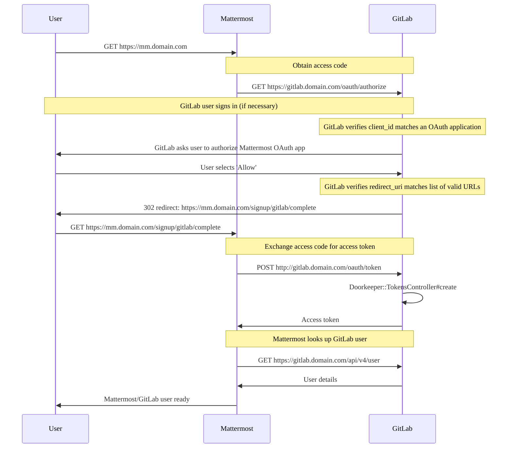



- 提供形態: GitLab Self-Managed



GitLabサーバー上で[GitLab Mattermost](https://gitlab.com/gitlab-org/gitlab-mattermost)サービスを実行できます。Mattermostは、GitLabの単一アプリケーションの一部ではありません。[MattermostとGitLab](https://mattermost.com/solutions/mattermost-gitlab/)の間には良好なインテグレーションがあり、Linuxパッケージを使用してインストールできます。**ただし、Mattermostは別の企業が提供する独立したアプリケーションです**。GitLabサポートでは、GitLabとのインテグレーションを超えるMattermost固有の質問には対応できません。Mattermost自体に関するヘルプが必要な場合は、[コミュニティサポートリソース](#community-support-resources)を参照してください。

## 前提要件 {#prerequisites}

GitLab Mattermostの各リリースは、Linux用のAMD 64チップセットでコンパイルされ、手動でテストされています。Raspberry PiなどのARMチップセットとオペレーティングシステムはサポートされていません。

## はじめに {#getting-started}

GitLab Mattermostは、専用の仮想ホストで実行されることを想定しています。DNS設定では、同じマシンを指す2つのエントリが必要です。例: `gitlab.example.com`、`mattermost.example.com`。

GitLab Mattermostはデフォルトで無効になっています。有効にするには、次の手順に従います:

1. `/etc/gitlab/gitlab.rb`を編集して、Mattermostの外部URIを追加します:

   ```ruby
   mattermost_external_url 'https://mattermost.example.com'
   ```

1. GitLabを再設定します:

   ```shell
   sudo gitlab-ctl reconfigure
   ```

1. `https://mattermost.example.com`でGitLab Mattermostにアクセスでき、GitLabに接続する認可されていることを確認します。GitLabでMattermostを認可すると、ユーザーはGitLabをSSOプロバイダーとして使用できます。

Linuxパッケージは、アプリケーションが同じサーバー上で実行されている場合、GitLabでGitLab Mattermostを自動的に認可しようとします。

自動認可には、GitLabデータベースへのアクセスが必要です。GitLabデータベースが利用できない場合は、[GitLab Mattermostの認可セクション](#authorize-gitlab-mattermost)で説明されているプロセスを使用して、GitLabへのアクセスを許可するようにGitLab Mattermostを手動で認可する必要があります。

## Mattermostの設定 {#configuring-mattermost}

Mattermostは、Mattermostシステムコンソールを使用して設定できます。Mattermostの設定と、それらを設定できる場所の広範なリストは、[Mattermostドキュメント](https://docs.mattermost.com/administration/config-settings.html)にあります。

システムコンソールを使用することをお勧めしますが、次のいずれかのオプションを使用してMattermostを設定することもできます:

1. `/var/opt/gitlab/mattermost/config.json`を介してMattermostの設定を直接編集します。
1. `gitlab.rb`の`mattermost['env']`設定を変更して、Mattermostの実行に使用される環境変数を指定します。この方法で設定された設定は、システムコンソールから無効になり、Mattermostを再起動しない限り変更できません。

## HTTPSでのGitLab Mattermostの実行 {#running-gitlab-mattermost-with-https}

SSL証明書とSSL証明書キーを`/etc/gitlab/ssl`内に配置します。ディレクトリが存在しない場合は、作成します:

```shell
sudo mkdir -p /etc/gitlab/ssl
sudo chmod 755 /etc/gitlab/ssl
sudo cp mattermost.gitlab.example.key mattermost.gitlab.example.crt /etc/gitlab/ssl/
```

`/etc/gitlab/gitlab.rb`で、次のように設定します:

```ruby
mattermost_external_url 'https://mattermost.gitlab.example'
mattermost_nginx['redirect_http_to_https'] = true
```

証明書とキーに`mattermost.gitlab.example.crt`と`mattermost.gitlab.example.key`という名前を付けていない場合は、次のフルパスも追加する必要があります:

```ruby
mattermost_nginx['ssl_certificate'] = "/etc/gitlab/ssl/mattermost-nginx.crt"
mattermost_nginx['ssl_certificate_key'] = "/etc/gitlab/ssl/mattermost-nginx.key"
```

ここで、`mattermost-nginx.crt`はSSL証明書、`mattermost-nginx.key`はSSLキーです。

設定が完了したら、`sudo gitlab-ctl reconfigure`を実行して変更を適用します。

## 外部PostgreSQLデータベースサービスを使用したGitLab Mattermostの実行 {#running-gitlab-mattermost-with-an-external-postgresql-service}

デフォルトでは、MattermostはLinuxパッケージにバンドルされているPostgreSQLデータベースサービスを使用します。外部PostgreSQLデータベースサービスでMattermostを使用する場合は、独自の特定の設定が必要です。[GitLabで使用される既存の外部PostgreSQLデータベース接続設定](../../administration/postgresql/external.md)は、Mattermostに自動的に継承されません。

1. `/etc/gitlab/gitlab.rb`を編集し、次の設定を指定します:

   ```ruby
   mattermost['sql_driver_name'] = 'postgres'
   mattermost['sql_data_source'] = "user=gitlab_mattermost host=<hostname-of-postgresql-service> port=5432 sslmode=required dbname=<mattermost_production> password=<user-password>"
   ```

1. `user`値と、`mattermost['sql_data_source']`で定義した`password`値に一致するPostgreSQLデータベースユーザーを作成します。
1. 使用された`dbname`値に一致するPostgreSQLデータベースを作成します。
1. `user`に、`dbname`で作成されたデータベースへのアクセス許可があることを確認してください。

1. GitLabを再設定し、Mattermostを再起動して変更を適用します:

   ```shell
   sudo gitlab-ctl reconfigure && sudo gitlab-ctl restart mattermost
   ```

## 独自のサーバーでのGitLab Mattermostの実行 {#running-gitlab-mattermost-on-its-own-server}

2つの異なるサーバーでGitLabとGitLab Mattermostを実行する場合、GitLabサービスは引き続きGitLab Mattermostサーバーに設定されますが、ユーザーリクエストを受け入れたり、システムリソースを消費したりすることはありません。LinuxパッケージにバンドルされているGitLabサービスを効果的に無効にするには、GitLab Mattermostサーバーで次の設定と設定の詳細を使用できます。

```ruby
mattermost_external_url 'http://mattermost.example.com'

# Shut down GitLab services on the Mattermost server
alertmanager['enable'] = false
gitlab_exporter['enable'] = false
gitlab_kas['enable'] = false
gitlab_rails['enable'] = false
grafana['enable'] = false
letsencrypt['enable'] = false
node_exporter['enable'] = false
postgres_exporter['enable'] = false
prometheus['enable'] = false
redis_exporter['enable'] = false
redis['enable'] = false
```

次に、[GitLab Mattermostの認可セクション](#authorize-gitlab-mattermost)の適切な手順に従います。最後に、GitLabとのインテグレーションを有効にするには、GitLabサーバーに以下を追加します:

```ruby
gitlab_rails['mattermost_host'] = "https://mattermost.example.com"
```

デフォルトでは、GitLab MattermostはすべてのユーザーがGitLabにサインアップすることを要求し、メールオプションによるサインアップを無効にします。Mattermostの[GitLab SSOに関するドキュメント](https://docs.mattermost.com/deployment/sso-gitlab.html)を参照してください。

## GitLabでのGitLab Mattermostの手動による（再）認可 {#manually-reauthorizing-gitlab-mattermost-with-gitlab}

### GitLab Mattermostの再認可 {#reauthorize-gitlab-mattermost}

GitLab Mattermostを再認可するには、まず既存の認可を失効する必要があります。これは、GitLabの**設定** > **アプリケーション**領域で実行できます。次のセクションの手順に従って、認可を完了します。

### GitLab Mattermostの認可 {#authorize-gitlab-mattermost}

GitLabの**設定** > **アプリケーション**領域に移動します。新しいアプリケーションを作成し、**Redirect URI**（リダイレクトURI）には、以下を使用します（HTTPSを使用する場合は、`http`を`https`に置き換えます）:

```plaintext
http://mattermost.example.com/signup/gitlab/complete
http://mattermost.example.com/login/gitlab/complete
```

**信用済み**および**非公開**の設定を選択してください。**スコープ**で、`read_user`を選択します。次に、**アプリケーションを保存**を選択します。

アプリケーションを作成すると、`Application ID`と`Secret`が提供されます。必要なもう1つの情報は、GitLabインスタンスのURIです。GitLab Mattermostを実行しているサーバーに戻り、以前に受信した値を使用して、次のように`/etc/gitlab/gitlab.rb`設定ファイルを編集します:

```ruby
mattermost['gitlab_enable'] = true
mattermost['gitlab_id'] = "12345656"
mattermost['gitlab_secret'] = "123456789"
mattermost['gitlab_scope'] = "read_user"
mattermost['gitlab_auth_endpoint'] = "http://gitlab.example.com/oauth/authorize"
mattermost['gitlab_token_endpoint'] = "http://gitlab.example.com/oauth/token"
mattermost['gitlab_user_api_endpoint'] = "http://gitlab.example.com/api/v4/user"
```

変更を保存し、`sudo gitlab-ctl reconfigure`を実行します。エラーがない場合、GitLabとGitLab Mattermostは正しく設定されているはずです。

## 数値ユーザーとグループ識別子の指定 {#specify-numeric-user-and-group-identifiers}

Linuxパッケージは、ユーザーとグループ`mattermost`を作成します。これらのユーザーの数値識別子を`/etc/gitlab/gitlab.rb`で次のように指定できます:

```ruby
mattermost['uid'] = 1234
mattermost['gid'] = 1234
```

`sudo gitlab-ctl reconfigure`を実行して、変更を適用します。

## 環境変数をカスタム設定する {#setting-custom-environment-variables}

必要に応じて、`/etc/gitlab/gitlab.rb`を介してMattermostで使用されるカスタム環境変数を設定できます。これは、Mattermostサーバーが企業インターネットプロキシの背後で運用されている場合に役立ちます。`/etc/gitlab/gitlab.rb`で、ハッシュ値を持つ`mattermost['env']`を指定します。例: 

```ruby
mattermost['env'] = {"HTTP_PROXY" => "my_proxy", "HTTPS_PROXY" => "my_proxy", "NO_PROXY" => "my_no_proxy"}
```

`sudo gitlab-ctl reconfigure`を実行して、変更を適用します。

## バンドルされたPostgreSQLデータベースへの接続 {#connecting-to-the-bundled-postgresql-database}

バンドルされたPostgreSQLデータベースに接続する必要があり、デフォルトのLinuxパッケージデータベース設定を使用している場合は、PostgreSQLデータベーススーパーユーザーとして接続できます:

```shell
sudo gitlab-psql -d mattermost_production
```

## GitLab Mattermostのバックアップ {#back-up-gitlab-mattermost}

GitLab Mattermostは、通常の[Linuxパッケージのバックアップ](../../administration/backup_restore/_index.md)Rakeタスクには含まれていません。

一般的なMattermostの[バックアップとディザスターリカバリー](https://docs.mattermost.com/deploy/backup-disaster-recovery.html)ドキュメントは、バックアップする必要があるものに関するガイドとして使用できます。

### バンドルされたPostgreSQLデータベースのバックアップ {#back-up-the-bundled-postgresql-database}

バンドルされたPostgreSQLデータベースをバックアップする必要があり、デフォルトのLinuxパッケージデータベース設定を使用している場合は、次のコマンドを使用してバックアップできます:

```shell
sudo -i -u gitlab-psql -- /opt/gitlab/embedded/bin/pg_dump -h /var/opt/gitlab/postgresql mattermost_production | gzip > mattermost_dbdump_$(date --rfc-3339=date).sql.gz
```

### `data`ディレクトリと`config.json`のバックアップ {#back-up-the-data-directory-and-configjson}

Mattermostには、`data`ディレクトリと`config.json`ファイルがあり、これらもバックアップする必要があります:

```shell
sudo tar -zcvf mattermost_data_$(date --rfc-3339=date).gz -C /var/opt/gitlab/mattermost data config.json
```

## GitLab Mattermostの復元 {#restore-gitlab-mattermost}

以前に[GitLab Mattermostのバックアップを作成した](#back-up-gitlab-mattermost)場合は、次のコマンドを実行して復元できます:

```shell
# Stop Mattermost so we don't have any open database connections
sudo gitlab-ctl stop mattermost

# Drop the Mattermost database
sudo -u gitlab-psql /opt/gitlab/embedded/bin/dropdb -U gitlab-psql -h /var/opt/gitlab/postgresql -p 5432 mattermost_production

# Create the Mattermost database
sudo -u gitlab-psql /opt/gitlab/embedded/bin/createdb -U gitlab-psql -h /var/opt/gitlab/postgresql -p 5432 mattermost_production

# Perform the database restore
# Replace /tmp/mattermost_dbdump_2021-08-05.sql.gz with your backup
sudo -u mattermost sh -c "zcat /tmp/mattermost_dbdump_2021-08-05.sql.gz | /opt/gitlab/embedded/bin/psql -U gitlab_mattermost -h /var/opt/gitlab/postgresql -p 5432 mattermost_production"

# Restore the data directory and config.json
# Replace /tmp/mattermost_data_2021-08-09.gz with your backup
sudo tar -xzvf /tmp/mattermost_data_2021-08-09.gz -C /var/opt/gitlab/mattermost

# Fix permissions if required
sudo chown -R mattermost:mattermost /var/opt/gitlab/mattermost/data
sudo chown mattermost:mattermost /var/opt/gitlab/mattermost/config.json

# Start Mattermost
sudo gitlab-ctl start mattermost
```

## Mattermostコマンドラインツール（CLI） {#mattermost-command-line-tool-cli}

[`mmctl`](https://docs.mattermost.com/manage/mmctl-command-line-tool.html)は、ローカルにインストールされ、Mattermost APIを使用するMattermostサーバー用のCLIツールですが、リモートで使用することもできます。ローカル接続用にMattermostを設定するか、ローカルログイン認証情報（GitLab SSO経由ではない）を持つ管理者として認証する必要があります。実行可能ファイルは、`/opt/gitlab/embedded/bin/mmctl`にあります。

### ローカル接続を介した`mmctl`の使用 {#use-mmctl-through-a-local-connection}

ローカル接続の場合、`mmctl`バイナリとMattermostは同じサーバーから実行する必要があります。ローカルソケットを有効にするには:

1. `/var/opt/gitlab/mattermost/config.json`を編集し、次の行を追加します:

   ```json
   {
       "ServiceSettings": {
          ...
           "EnableLocalMode": true,
           "LocalModeSocketLocation": "/var/tmp/mattermost_local.socket",
           ...
       }
   }
   ```

1. Mattermostを再起動します:

   ```shell
   sudo gitlab-ctl restart mattermost
   ```

次に、`sudo /opt/gitlab/embedded/bin/mmctl --local`を使用して、Mattermostインスタンスで`mmctl`コマンドを実行できます。

たとえば、ユーザーのリストを表示するには:

```shell
$ sudo /opt/gitlab/embedded/bin/mmctl --local user list

13dzo5bmg7fu8rdox347hbfxde: appsbot (appsbot@localhost)
tbnkwjdug3dejcoddboo4yuomr: boards (boards@localhost)
wd3g5zpepjgbfjgpdjaas7yj6a: feedbackbot (feedbackbot@localhost)
8d3zzgpurp85zgf1q88pef73eo: playbooks (playbooks@localhost)
There are 4 users on local instance
```

### リモート接続を介した`mmctl`の使用 {#use-mmctl-through-a-remote-connection}

リモート接続、またはソケットを使用できないローカル接続の場合は、非SSOユーザーを作成し、そのユーザーに管理者権限を付与します。これらの認証情報を使用して、`mmctl`を認証できます:

```shell
$ /opt/gitlab/embedded/bin/mmctl auth login http://mattermost.example.com

Connection name: test
Username: local-user
Password:
 credentials for "test": "local-user@http://mattermost.example.com" stored
```

## GitLabとMattermostのインテグレーションの設定 {#configuring-gitlab-and-mattermost-integrations}

このプラグインを使用すると、Mattermostをサブスクライブして、イシュー、マージリクエスト、プルリクエスト、およびマージリクエストのレビュー、未読メッセージ、タスク割り当てに関する個人の通知を受信できます。イシューの作成や表示などのアクションを実行するためにスラッシュコマンドを使用する場合、またはデプロイをトリガーする場合は、GitLabの[Mattermostスラッシュコマンド](../../user/project/integrations/mattermost_slash_commands.md)を使用します。

このプラグインとスラッシュコマンドは、組み合わせて使用することも、個別に使用することもできます。

## メール通知 {#email-notifications}

### GitLab MattermostのSMTPの設定 {#setting-up-smtp-for-gitlab-mattermost}

これらの設定は、システム管理者によってMattermostシステムコンソールを介して設定されます。**System Console**の**Environment** > **SMTP**タブで、SMTPプロバイダーから提供されたSMTP認証情報、または`127.0.0.1`およびポート`25`を入力すると、`sendmail`を使用できます。必要な特定の設定に関する詳細情報は、[Mattermostドキュメント](https://docs.mattermost.com/install/smtp-email-setup.html)にあります。

これらの設定は、`/var/opt/gitlab/mattermost/config.json`で設定することもできます。

### メールバッチ処理 {#email-batching}

この機能を有効にすると、ユーザーはメール通知を受信する頻度を制御できます。

メールバッチ処理は、Mattermost **System Console**の**Environment** > **SMTP**タブに移動し、**Enable Email Batching**設定を**true**に設定することで有効にできます。

この設定は、`/var/opt/gitlab/mattermost/config.json`で設定することもできます。

## GitLab Mattermostのアップグレード {#upgrading-gitlab-mattermost}



Mattermostバージョンをアップグレードする場合は、実行する必要がある変更または移行に対処するために、Mattermostの[重要なアップグレードノート](https://docs.mattermost.com/administration/important-upgrade-notes.html)を確認することが不可欠です。



GitLab Mattermostは、通常のLinuxパッケージ更新プロセスを通じてアップグレードできます。以前のバージョンのGitLabをアップグレードする場合、Mattermostの設定設定がGitLabの外部で変更されていない場合にのみ、更新プロセスを使用できます。つまり、Mattermostの`config.json`ファイルには、直接的にも、Mattermostの**System Console**を介して`config.json`に変更を保存する方法でも、一切変更が加えられていません。

`gitlab.rb`を使用してMattermostのみを設定した場合は、Linuxパッケージを使用してGitLabをアップグレードし、`gitlab-ctl reconfigure`を実行してGitLab Mattermostを最新バージョンにアップグレードできます。

そうでない場合は、次の2つのオプションがあります:

1. `config.json`に加えられた変更で[`gitlab.rb`](https://gitlab.com/gitlab-org/omnibus-gitlab/blob/master/files/gitlab-config-template/gitlab.rb.template#L706)を更新します。`config.json`のすべての設定が`gitlab.rb`で使用できるわけではないため、いくつかのパラメータを追加する必要がある場合があります。完了すると、LinuxパッケージはGitLab Mattermostをあるバージョンから次のバージョンにアップグレードできるようになります。
1. MattermostをLinuxパッケージによって制御されているディレクトリの外部に移行して、個別に管理およびアップグレードできるようにします。[Mattermost移行ガイド](https://docs.mattermost.com/administration/migrating.html)に従って、Mattermostの設定設定とデータを、Linuxパッケージとは別のディレクトリまたはサーバーに移動します。

以前のバージョンのアップグレード通知と特別な考慮事項の完全なリストについては、[Mattermostドキュメント](https://docs.mattermost.com/administration/important-upgrade-notes.html)を参照してください。

### Linuxパッケージに同梱されているGitLab Mattermostバージョンとエディション {#gitlab-mattermost-versions-and-edition-shipped-with-the-linux-package}

次の表は、GitLab 15.0以降のMattermostバージョンの変更の概要を示しています:

| GitLabバージョン | Mattermostバージョン |
|:---------------|:-------------------|
| 18.3           | 10.10              |
| 18.2           | 10.9               |
| 18.1           | 10.8               |
| 18.0           | 10.7               |
| 17.11          | 10.6               |
| 17.9           | 10.4               |
| 17.7           | 10.2               |
| 17.6           | 10.1               |
| 17.5           | 10.0               |
| 17.4           | 9.11               |
| 17.3           | 9.10               |
| 17.2           | 9.9                |
| 17.1           | 9.8                |
| 17.0           | 9.7                |
| 16.11          | 9.6                |
| 16.10          | 9.5                |
| 16.9           | 9.4                |
| 16.7           | 9.3                |
| 16.6           | 9.1                |
| 16.5           | 9.0                |
| 16.4           | 8.1                |
| 16.3           | 8.0                |
| 16.0           | 7.10               |
| 15.11          | 7.9                |
| 15.10          | 7.8                |
| 15.9           | 7.7                |
| 15.7           | 7.5                |
| 15.6           | 7.4                |
| 15.5           | 7.3                |
| 15.4           | 7.2                |
| 15.3           | 7.1                |
| 15.2           | 7.0                |
| 15.1           | 6.7                |
| 15.0           | 6.6                |



Mattermostのアップグレードノートは、PostgreSQLデータベースとMySQLデータベースで使用した場合に異なる影響があることを示しています。LinuxパッケージにバンドルされているGitLab Mattermostは、PostgreSQLデータベースを使用します。



Linuxパッケージには、無料のオープンソースエディションであり、商用機能は含まれていない[Mattermost Team Edition](https://docs.mattermost.com/about/editions-and-offerings.html#mattermost-team-edition)がバンドルされています。[Mattermost Enterprise Edition](https://docs.mattermost.com/about/editions-and-offerings.html#mattermost-enterprise-edition)にアップグレードするには、Mattermostの[アップグレードに関するドキュメント](https://docs.mattermost.com/install/enterprise-install-upgrade.html#upgrading-to-enterprise-edition-in-gitlab-omnibus)を参照してください。

## OAuth 2.0シーケンス図 {#oauth-20-sequence-diagram}

次の図は、GitLabがMattermostのOAuth 2.0プロバイダーとしてどのように機能するかのシーケンス図です。これを使用して、インテグレーションを機能させる際のエラーをトラブルシューティングできます:



## コミュニティサポートリソース {#community-support-resources}

GitLab Mattermostデプロイに関するヘルプとサポートについては、以下を参照してください:

- [Mattermostのイシューのトラブルシューティング](https://docs.mattermost.com/install/troubleshooting.html)。
- [Mattermostフォーラム](https://forum.mattermost.com/search?q=gitlab)。
