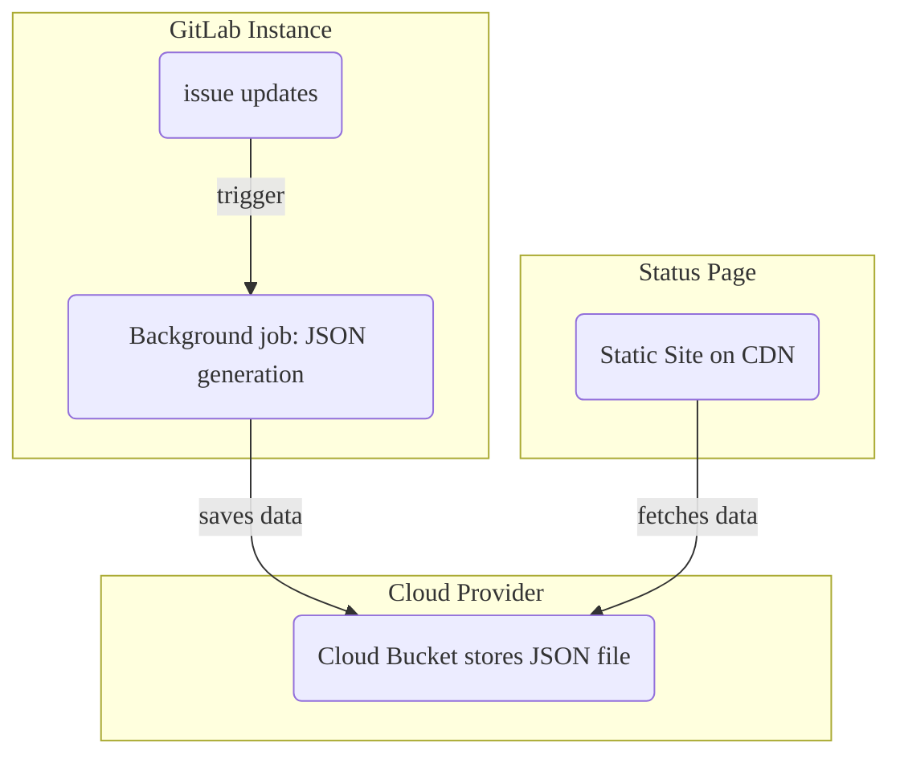



- プラン: Ultimate
- 提供形態: GitLab.com、GitLab Self-Managed、GitLab Dedicated



GitLabのステータスページを使用すると、インシデント発生時にユーザーに効率的に伝えるための静的なウェブサイトを作成し、デプロイできます。ステータスページのランディングページには、最近のインシデントの概要が表示されます:

インシデントを選択すると、特定のインシデントに関する詳細情報が記載された詳細ページが表示されます:

- 最後にインシデントが更新された時間など、インシデントのステータス。
- 絵文字を含むインシデントのタイトル。
- 絵文字を含むインシデントの説明。
- インシデントの説明、または有効な画像拡張子を持つコメントで提供されるすべての添付ファイル。
- インシデントの更新の時系列順のリスト。

## ステータスページをセットアップする {#set-up-a-status-page}

GitLabのステータスページを設定するには、以下が必要です:

1. クラウドプロバイダー情報を使用して[GitLabを設定](#configure-gitlab-with-cloud-provider-information)します。
1. [AWSアカウントを設定](#configure-your-aws-account)します。
1. GitLabで[ステータスページプロジェクトを作成](#create-a-status-page-project)します。
1. [ステータスページにインシデントを同期](#sync-incidents-to-the-status-page)します。

### クラウドプロバイダー情報でGitLabを設定する {#configure-gitlab-with-cloud-provider-information}

デプロイターゲットとしてサポートされているのは、AWS S3のみです。

前提要件:

- メンテナーロール以上が必要です。

ステータスページにコンテンツをプッシュするために必要なAWSアカウント情報をGitLabに提供するには、次の手順を実行します:

1. 左側のサイドバーで、**検索または移動先**を選択して、プロジェクトを見つけます。
1. 左側のサイドバーで、**設定**を選択して、プロジェクトを見つけます。**モニタリング** > モニタリングを選択します。
1. **ステータスページ**します。
1. **有効**チェックボックスを選択します。
1. **Status Page URL**ボックスに、外部ステータスページのURLを入力します。
1. **S3バケット名**ボックスに、S3バケットの名前を入力します。詳細については、[バケット構成のドキュメント](https://docs.aws.amazon.com/AmazonS3/latest/dev/HostingWebsiteOnS3Setup.html)を参照してください。
1. **AWSリージョン**ボックスに、バケットのリージョンを入力します。詳細については、[AWSドキュメント](https://github.com/aws/aws-sdk-ruby#configuration)を参照してください。
1. **AWSアクセスキーID**と**AWSシークレットアクセスキー**を入力します。
1. **変更を保存**を選択します。

### AWSアカウントを設定する {#configure-your-aws-account}

1. AWSアカウント内で、次のファイルを例として使用して、2つの新しいIAMポリシーを作成します:
    - [バケットを作成](https://gitlab.com/gitlab-org/status-page/-/blob/master/deploy/etc/s3_create_policy.json)します。
    - [バケットの内容を更新](https://gitlab.com/gitlab-org/status-page/-/blob/master/deploy/etc/s3_update_bucket_policy.json)します（`S3_BUCKET_NAME`をバケット名に置き換えてください）。
1. 最初の手順で作成した権限ポリシーを使用して、新しいAWSアクセスキーを作成します。

### ステータスページプロジェクトを作成する {#create-a-status-page-project}

AWSアカウントを設定したら、ステータスページプロジェクトを追加し、必要なCI/CD変数を設定して、ステータスページをAWS S3にデプロイする必要があります。

1. [ステータスページプロジェクトをフォークする](https://gitlab.com/gitlab-org/status-page)。これは[リポジトリのミラーリング](https://gitlab.com/gitlab-org/status-page#repository-mirroring)を介して行うことができます。これにより、最新のステータスページ機能を入手できます。
1. 左側のサイドバーで、**設定** > **CI/CD**を選択します。
1. **変数**を展開します。
1. Amazonコンソールから次の変数を追加します:
   - `S3_BUCKET_NAME` - Amazon S3バケットの名前。指定された名前のバケットが存在しない場合、最初のパイプラインの実行で[静的ウェブサイトホスティング](https://docs.aws.amazon.com/AmazonS3/latest/dev/HostingWebsiteOnS3Setup.html)用に作成および構成されます。

   - `AWS_DEFAULT_REGION` - AWSリージョン。
   - `AWS_ACCESS_KEY_ID` - AWSのアクセスキーID。
   - `AWS_SECRET_ACCESS_KEY` - AWSのシークレット。
1. 左側のサイドバーで、**ビルド** > **パイプライン**を選択します。
1. ステータスページをS3にデプロイするには、**パイプラインを新規作成**を選択します。



このプロジェクトでイシューにアクセスできるユーザーを制限することを検討してください。インシデントを表示できるすべてのユーザーが、[GitLabステータスページにコメントを公開](#publish-comments-on-incidents)できる可能性があります。



### ステータスページにインシデントを同期する {#sync-incidents-to-the-status-page}

CI/CD変数を作成したら、インシデントに使用するプロジェクトを設定します。

1. 左側のサイドバーで、**検索または移動先**を選択して、プロジェクトを見つけます。
1. **設定** > **モニタリング**を選択します。
1. **ステータスページ**します。
1. クラウドプロバイダーの認証情報を入力し、必ず**有効**チェックボックスをオンにしてください。
1. **変更を保存**を選択します。

## GitLabステータスページの使用方法 {#how-to-use-your-gitlab-status-page}

GitLabインスタンスを設定すると、関連する更新により、インシデントに関するJSON形式のデータが外部クラウドプロバイダーにプッシュされるバックグラウンドジョブがトリガーされます。ステータスページのウェブサイトは、このJSON形式のデータを定期的にフェッチします。チームからの余分な労力をかけずに、進行中のインシデントに関する情報を提供することで、ユーザーにフォーマットして表示します:

### インシデントを公開する {#publish-an-incident}

インシデントを公開するには、次の手順を実行します:

1. GitLabステータスページの設定を有効にしたプロジェクトでインシデントを作成します。
1. [プロジェクトまたはグループオーナー](../../user/permissions.md)は、`/publish` [クイックアクション](../../user/project/quick_actions.md)を使用して、インシデントをGitLabステータスページに公開する必要があります。[機密インシデント](../../user/project/issues/confidential_issues.md)は公開できません。

バックグラウンドワーカーは、セットアップ中に提供した認証情報を使用して、インシデントをステータスページに公開します。公開の一環として、GitLabは次のことを行います:

- `Incident Responder`を使用して、ユーザーとグループのメンションを匿名化します。
- 非公開の[GitLab参照](../../user/markdown.md#gitlab-specific-references)のタイトルを削除します。
- インシデントの説明に添付されているすべてのファイルを、インシデントあたり最大5000個まで公開します。

公開後、インシデントのタイトルの下に表示される**ステータスページに公開済み**ボタンを選択して、インシデントの詳細ページにアクセスできます。

### インシデントを更新する {#update-an-incident}

インシデントの更新を公開するには、インシデントの説明を更新します。



参照されているインシデントが変更された場合（タイトルや機密性など）、参照元のインシデントは更新されません。



### インシデントにコメントを公開する {#publish-comments-on-incidents}

ステータスページのインシデントにコメントを公開するには、次の手順を実行します:

- インシデントに関するコメントを作成します。
- コメントを公開する準備ができたら、マイクの[絵文字リアクション](../../user/emoji_reactions.md)(`:microphone:`🎤)をコメントに追加して、コメントを公開用にマークします。
- コメントに添付されているすべてのファイル（インシデントあたり最大5000個）も公開されます。



インシデントを表示するアクセス権を持つユーザーは誰でも絵文字リアクションをコメントに追加できるため、イシューへのアクセスをチームメンバーのみに制限することを検討してください。



### インシデントのステータスを更新する {#update-the-incident-status}

インシデントのステータスを`open`から`closed`に変更するには、GitLab内でインシデントをクローズします。インシデントをクローズすると、バックグラウンドワーカーがトリガーされ、GitLabステータスページのウェブサイトが更新されます。

[公開済みのインシデントを機密にする](../../user/project/issues/confidential_issues.md#make-an-issue-confidential)と、GitLabはGitLabステータスページのウェブサイトからそれを公開解除します。
