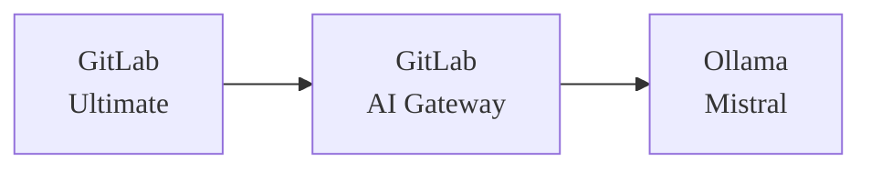



- プラン: Ultimate
- アドオン: GitLab Duo ProまたはEnterprise
- 提供形態: GitLab Self-Managed



このドキュメントでは、Ollama上でMistralモデルを実行するセルフホストLLM（LLM）を使用した、GitLabとGitLab Duoのインストールとインテグレーションについて説明します。このガイドでは、3つの異なる仮想マシンを使用した設定について説明しており、AWSまたはGCPで簡単に実行できます。もちろん、このプロセスはさまざまなデプロイプラットフォームにも適用できます。

このガイドは、目的の設定を動作させるための包括的なエンドツーエンドの手順セットです。最終的な構成の作成をサポートするために使用された、GitLabドキュメントの多くの領域への参照を呼び出します。特定のシナリオに合わせて実装を調整するために、より多くの背景情報が必要な場合は、参照されているドキュメントが重要になります。
<!-- TOC -->

- GitLab Duo Self-Hosted: Ollamaインテグレーション対応のAWS/Google Cloudデプロイ完全ガイド
  - [前提要件](#prerequisites)
    - [仮想マシン](#virtual-machines)
      - [リソースとオペレーティングシステム](#resources--operating-system)
      - [ネットワーキング](#networking)
    - [GitLab](#gitlab)
      - [ライセンス](#licensing)
      - [SSL/TLS](#ssltls)
- [はじめに](#introduction)
  - [インストール](#installation)
    - [AIゲートウェイ](#ai-gateway)
    - [Ollama](#ollama)
      - [インストール](#installation)
      - [モデルのデプロイ](#model-deployment)
  - [インテグレーション](#integration)
    - [ルートユーザーのGitLab Duoを有効化](#enable-gitlab-duo-for-root-user)
    - [GitLabでセルフホストモデルを設定](#configure-gitlab-duo-self-hosted-in-gitlab)
  - [検証](#verification)

<!-- /TOC -->

## 前提要件 {#prerequisites}

### 仮想マシン {#virtual-machines}

#### リソースとオペレーティングシステム {#resources--operating-system}

GitLab、GitLab AIゲートウェイ、Ollamaをそれぞれ別々の仮想マシンにインストールします。このガイドではUbuntu 24.0xを使用していますが、組織の要件と好みに合わせてUnixベースのオペレーティングシステムを柔軟に選択できます。ただし、このセットアップでは、Unixベースのオペレーティングシステムの使用が必須です。これにより、必要なソフトウェアスタックとのシステムの安定性、セキュリティ、および互換性が確保されます。このセットアップは、テストおよび評価フェーズにおいてコストとパフォーマンスのバランスが良好ですが、使用要件やチーム規模に応じて、本番環境に移行する際にはGPUインスタンスタイプのアップグレードが必要になる場合があります。

|                | **GCP**       | **AWS**     | **OS**    | **ディスク** |
|----------------|---------------|-------------|-----------|----------|
| **GitLab**     | c2-standard-4 | c6xlarge    | Ubuntu 24 | 50 GB    |
| **AIゲートウェイ** | e2-medium     | t2.medium   | Ubuntu 24 | 20 GB    |
| **Ollama**     | n1-standard-4 | g4dn.xlarge | Ubuntu 24 | 50 GB    |

コンポーネントとその目的の詳細については、[AIゲートウェイ](../../user/gitlab_duo/gateway.md)を参照してください。



これらのコンポーネントは連携して、セルフホストAI機能を実現します。このガイドでは、LLMサーバーとしてOllamaを使用して、完全なセルフホストAI環境を構築するための詳細な手順を説明します。



完全な本番環境では、[公式ドキュメント](../../administration/gitlab_duo_self_hosted/supported_models_and_hardware_requirements.md)は1x NVIDIA A100（40 GB）などのより強力なGPUインスタンスを推奨していますが、g4dn.xlargeインスタンスの種類は、少人数のユーザーチームでの評価目的には十分です。



#### ネットワーキング {#networking}

GitLabへのアクセスを有効にするには、（AWSのElastic IPやGoogle CloudのExternal IPなどの）静的なパブリックIPアドレスが必要です。他のすべてのコンポーネントは、内部通信に静的な内部IPアドレスを使用する必要があります。すべてのVMが同じネットワーク上にあり、直接通信できることを前提としています。

|                | **Public IP**（パブリックIP） | **Private IP**（プライベートIP） |
|----------------|---------------|----------------|
| **GitLab**     | はい           | はい            |
| **AIゲートウェイ** | いいえ            | はい            |
| **Ollama**     | いいえ            | はい            |

内部IPを使用する理由

- 内部IPは、AWS/Google Cloudのインスタンスのライフタイム全体で静的なままです。
- GitLabサーバーのみが外部アクセスを必要とし、Ollamaなどの他のコンポーネントは内部通信に依存します。
- このアプローチにより、パブリックIPアドレスの料金を回避してコストを削減し、インターネットからLLMサーバーにアクセスできないようにすることでセキュリティを強化します。

### GitLab {#gitlab}

このガイドの残りの部分では、GitLabのインスタンスが起動して実行されており、次の要件を満たしていることを前提としています:

#### ライセンス {#licensing}

GitLab Duoセルフホストの操作には、GitLab UltimateライセンスとGitLab Duo Enterpriseライセンスの両方が必要です。GitLab Ultimateライセンスは、オンラインまたはオフラインのライセンスオプションのいずれかで動作します。このドキュメントでは、両方のライセンスが事前に取得されており、実装に利用できることを前提としています。


#### SSL/TLS {#ssltls}

有効なSSL証明書（Let's Encryptなど）がGitLabインスタンス用に構成されている必要があります。これは、セキュリティのベストプラクティスであるだけでなく、技術的な要件でもあります。なぜなら:

- システム（2025年1月現在）では、GitLabと通信する際に、適切なSSL検証が厳密に必要になるからです。
- AIゲートウェイは自己署名証明書を受け付けません
- SSL以外の接続（HTTP）もサポートされていません

GitLabには、便利な自動SSL設定プロセスが用意されています:

- GitLabのインストール中に、URLを"https://"プレフィックスで指定するだけです
- GitLabは自動的に行います:
  - Let's Encrypt SSL証明書を取得します
  - 証明書をインストール
  - HTTPSを構成します
- 手動によるSSL証明書の管理は不要です

GitLabのインストール中、手順は次のようになります:

1. パブリックIPアドレスと静的IPアドレスを割り当てて、GitLabインスタンスに関連付けます
1. DNSレコードを設定して、そのアドレスを指すようにします
1. GitLabのインストール中に、HTTPS URL（たとえば、`https://gitlab.yourdomain.com`）を使用します
1. GitLabにSSL証明書の設定を自動的に処理させます

詳細については、[ドキュメント](https://docs.gitlab.com/omnibus/settings/ssl/)ページを参照してください。

## はじめに {#introduction}

GitLab Duoセルフホストを設定する前に、AIの仕組みを理解しておくことが重要です。AIモデルは、データでトレーニングされたAIの頭脳です。この頭脳は、LLMサービングプラットフォームまたは単に「サービングプラットフォーム」と呼ばれる、動作するためのフレームワークを必要とします。AWSでは「Amazon Bedrock」、Azureでは「Azure OpenAI Service」、ChatGPTではそのプラットフォームです。Anthropicの場合、「Claude」です。セルフホスティングモデルの場合、Ollamaは一般的な選択肢です。

例: 

- AWSでは、サービングプラットフォームはAmazon Bedrockです。
- Azureでは、Azure OpenAI Serviceです。
- ChatGPTの場合、OpenAIの独自のプラットフォームです
- Anthropicの場合、サービングプラットフォームはClaudeです。

自分でAIモデルをホストする場合は、サービングプラットフォームも選択する必要があります。セルフホストモデルの一般的なオプションは、Ollamaです。

このアナロジーでは、ChatGPTの頭脳部分はGPT-4モデルであり、AnthropicエコシステムではClaude 3.7 Sonnetモデルです。サービングプラットフォームは、頭脳を世界に接続し、「考え」て効果的に対話できるようにする重要なフレームワークとして機能します。

サポートされているサービングプラットフォームとモデルの詳細については、[LLMサービングプラットフォーム](../../administration/gitlab_duo_self_hosted/supported_llm_serving_platforms.md)と[モデル](../../administration/gitlab_duo_self_hosted/supported_models_and_hardware_requirements.md)を参照してください。

**Ollamaとは**？

Ollamaは、ローカル環境で大規模言語モデル（LLM）を実行するための合理化されたオープンソースフレームワークです。従来複雑だったAIモデルのデプロイプロセスを簡素化し、効率的で柔軟性があり、スケーラブルなAIソリューションを探している個人と組織の両方がアクセスできるようにします。

主なハイライト:

1. **Simplified Deployment**（簡素化されたデプロイ）: ユーザーフレンドリーなコマンドラインインターフェースにより、迅速な設定と手間のかからないインストールが保証されます。
1. **Wide Model Support**（幅広いモデルサポート）: 一般的なオープンソースモデル（Llama 2、Mistral、Code Llamaなど）と互換性があります。
1. **Optimized Performance**（最適化されたパフォーマンス）: リソース効率のために、GPU環境とCPU環境の両方でシームレスに動作します。
1. **Integration-Ready**（すぐにインテグレーションできる）: 既存のツールとワークフローとの簡単なインテグレーションのために、OpenAI互換のAPIを備えています。
1. **No Containers Needed**（コンテナは不要）: Dockerまたはコンテナ化された環境を必要とせずに、ホストシステム上で直接実行されます。
1. **Versatile Hosting Options**（多様なホスティングオプション）: ローカルマシン、オンプレミスサーバー、またはクラウドGPUインスタンスにデプロイできます。

Ollamaは、シンプルさとパフォーマンスを考慮して設計されており、ユーザーが従来のAIインフラストラクチャの複雑さなしにLLMの力を活用できるようにします。設定とサポートされているモデルに関する詳細については、ドキュメントで後ほど説明します。

- [Ollamaモデルサポート](https://ollama.com/search)

## インストール {#installation}

### AIゲートウェイ {#ai-gateway}

公式インストールガイドは[AIゲートウェイのインストール](../../install/install_ai_gateway.md)で入手できますが、を設定するための合理化されたアプローチを次に示します。2025年1月現在、イメージ`gitlab/model-gateway:self-hosted-v17.6.0-ee`がGitLab 17.7で動作することが確認されています。

1. 以下を確認してください...

   - APIゲートウェイVMへのTCPポート5052が許可されている（セキュリティグループの設定を確認してください）
   - 次のスニペットで、`GITLAB_DOMAIN`をGitLabのインスタンスのドメイン名サービスに置き換えます:

1. 次のコマンドを実行して、GitLabを起動します:

   ```shell
   GITLAB_DOMAIN="gitlab.yourdomain.com"
   docker run -p 5052:5052 \
     -e AIGW_GITLAB_URL=$GITLAB_DOMAIN \
     -e AIGW_GITLAB_API_URL=https://${GITLAB_DOMAIN}/api/v4/ \
     -e AIGW_AUTH__BYPASS_EXTERNAL=true \
     gitlab/model-gateway:self-hosted-v17.6.0-ee
   ```

次の表は、インスタンスの設定における主要な環境変数とその役割について説明しています:

| **変数**                 | **説明** |
|------------------------------|-----------------|
| `AIGW_GITLAB_URL`            | GitLabインスタンスのドメイン。 |
| `AIGW_GITLAB_API_URL`        | GitLabインスタンスのAPIエンドポイント。 |
| `AIGW_AUTH__BYPASS_EXTERNAL` | 認証の処理の構成。 |

初期セットアップおよびテストフェーズ中は、AIGW_AUTH__BYPASS_EXTERNAL=trueを設定して、認証をバイパスして問題を回避できます。ただし、この設定は、本番環境またはインターネットに公開されているサーバーでは決して使用しないでください。

### Ollama {#ollama}

#### インストール {#installation-1}

1. 公式インストールスクリプトを使用してOllamaをインストールします:

   ```shell
   curl --fail --silent --show-error --location "https://ollama.com/install.sh" | sh
   ```

1. `OLLAMA_HOST`環境変数を起動構成に追加して、内部IPでリッスンするようにOllamaを構成します

   ```shell
   systemctl edit ollama.service
   ```

   ```ini
   [Service]
   Environment="OLLAMA_HOST=172.31.11.27"
   ```

   

   IPアドレスを実際のサーバーの内部IPアドレスに置き換えます。

   

1. サービスをリロードして再起動します:

   ```shell
   systemctl daemon-reload
   systemctl restart ollama
   ```

#### モデルのデプロイ {#model-deployment}

1. 環境変数を設定します:

   ```shell
   export OLLAMA_HOST=172.31.11.27
   ```

1. Mistral Instructモデルをインストールします:

   ```shell
   ollama pull mistral:instruct
   ```

   `mistral:instruct`モデルには約4.1 GBのストレージ容量が必要で、接続速度によってはダウンロードに時間がかかります。

1. モデルのインストールを確認します:

   ```shell
   ollama list
   ```

   このコマンドは、インストールされているモデルをリストに表示します。

## インテグレーション {#integration}

### ルートユーザーのGitLab Duoを有効にする {#enable-gitlab-duo-for-root-user}

1. GitLab Webインターフェースにアクセスします

   - 管理者ユーザーとしてログインします
   - 管理者エリア（レンチアイコン）に移動します

1. Duoライセンスを構成します

   - 左側のサイドバーにある「サブスクリプション」セクションに移動します
   - 「使用中のシート: 1/5」と表示され、利用可能なDuoシートが示されているはずです
   - 注: ルートユーザーに必要なシートは1つだけです

1. Duoライセンスをルートに割り当てます

   - 「管理者エリア」>「GitLab Duo」>「シート使用率」に移動します
   - ユーザーリストでルートユーザー（管理者）を見つけます
   - 「GitLab Duo Enterprise」列のスイッチを切り替えて、ルートユーザーのDuoを有効にします
   - 切替ボタンは、有効にすると青色に変わります




ルートユーザーのみのDuoを有効にすることは、初期設定とテストには十分です。必要に応じて、シートライセンスの制限内で、後で追加のユーザーにDuoアクセスを許可できます。



### GitLab Duo Self-HostedをGitLabで設定 {#configure-gitlab-duo-self-hosted-in-gitlab}

1. GitLab Duoセルフホスト構成にアクセスする

   - 管理者エリア > GitLab Duo > 「GitLab Duoセルフホストの構成」に移動します
   - 「セルフホストモデルを追加」ボタンをクリックします

   

1. モデル設定を構成する

   - **デプロイ名**: わかりやすい名前を選択します（例: `Mistral-7B-Instruct-v0.3 on AWS Tokyo`）
   - **モデルファミリー**: ドロップダウンリストから「Mistral」を選択します
   - **エンドポイント**: OllamaサーバーのURLを次の形式で入力します:

     ```plaintext
     http://[Internal-IP]:11434/v1
     ```

     例: `http://172.31.11.27:11434/v1`

   - **モデルの識別子**: `custom_openai/mistral:instruct`を入力します。
   - **APIキー**: このフィールドを空白のままにすることはできないため、任意のプレースホルダーテキスト（たとえば、`test`）を入力します


1. AI機能を有効にする

   - 「AIネイティブ機能」タブに移動します
   - 構成されたモデルを次の機能に割り当てます:
     - コード提案 > コード提案
     - コード提案 > コード補完
     - GitLab Duoチャット > 一般チャット
   - 各機能のドロップダウンリストから、デプロイされたモデルを選択します


これらの設定により、GitLabインスタンスとAIゲートウェイを介したセルフホストOllamaモデル間の接続が確立され、GitLab内でAIネイティブ機能が有効になります。

## 検証 {#verification}

1. GitLabでテストグループを作成します
1. GitLab Duoチャットアイコンが右上隅に表示されます
1. これは、GitLabとAIゲートウェイ間のインテグレーションが成功したことを示します


