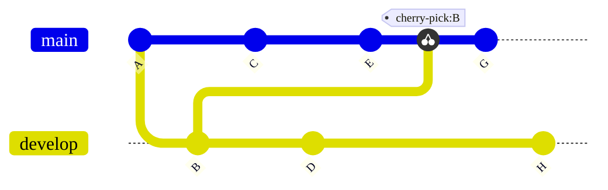



- プラン: Free、Premium、Ultimate
- 提供形態: GitLab.com、GitLab Self-Managed、GitLab Dedicated



`git cherry-pick`をコマンドラインから使用すると、既存のブランチから現在のブランチに特定の変更がコピーされます。チェリーピックは、次のような場合に役立ちます:

- 新しい機能を追加せずに、以前のリリースブランチにバグの修正をバックポートします。
- マージできないブランチから作業を再利用します。
- 試験的な変更を含めずに、以前のリリースに小さな機能のバックポートを行います。
- 緊急本番環境修正（ホットフィックス）を開発ブランチに適用します。
- フォークからアップストリームリポジトリに変更をコピーする。

GitLabユーザーインターフェースからチェリーピックする方法については、[Cherry-pick changes](../../user/project/merge_requests/cherry_pick_changes.md)を参照してください。

コミットをチェリーピックすると、Gitは次の処理を行います:

- 現在のブランチに同じ変更内容で新しいコミットを作成します。
- 元のコミットメッセージと作成者情報を保持します。
新しいコミットSHAを生成します。（元のコミットは変更されません）。

<!-- Diagram reused in doc/user/projects/merge_requests/cherry_pick_changes.md -->



`git cherry-pick`は、同一の変更内容で異なるセキュアハッシュアルゴリズム（SHA）を持つ重複したコミットを作成する可能性があるため、慎重に使用してください。これにより、プロジェクトの履歴が複雑になる可能性があります。最初にこれらの代替手段を検討してください:

- ブランチ内のほとんどの変更が必要で、ブランチの履歴がクリーンな場合は、ブランチ全体を現在のブランチにマージします。
- 元のコミットに新しいブランチで不要な複雑な依存関係が含まれている場合は、古いコミットをチェリーピックする代わりに、新しいコミットを作成します。

## 別のブランチに1つのコミットを適用する {#apply-one-commit-to-another-branch}

単一のコミットを現在の作業ブランチにチェリーピックするには、次のようにします:

1. チェリーピックするコミットのSHAを特定します。これを見つけるには、コミットの履歴を確認するか、`git log`コマンドを使用します。次に例を示します: 

   ```shell
   $ git log

   commit abc123f
   Merge: 88888999999 aaaaabbbbbb
   Author: user@example.com
   Date:   Tue Aug 31 21:19:41 2021 +0000

       Fixes a regression we found yesterday
    ```

1. チェリーピック先のブランチをチェックアウトします:

   ```shell
   git checkout release
   ```

1. `git cherry-pick`コマンドを使用して、フィーチャーブランチから`abc123f`コミットを`release`ブランチにコピーします。`abc123f`を、特定したコミットのSHAに置き換えます:

   ```shell
   git cherry-pick abc123f
   ```

Gitは、コミット`abc123f`から`release`ブランチに変更をコピーし、競合が発生した場合は通知を表示します。競合を解決し、チェリーピックプロセスを続行します。コミット`abc123f`の内容が必要な各ブランチに対して繰り返します。

## 別のブランチに複数のコミットを適用する {#apply-multiple-commits-to-another-branch}

必要なコードが複数のコミットの過程で追加された場合は、それらの各コミットを目的のターゲットブランチにチェリーピックします:

1. チェリーピックするコミットのSHAを特定します。これを見つけるには、コミットの履歴を確認するか、`git log`コマンドを使用します。たとえば、コードの変更が1つのコミットにあり、改善されたテストカバレッジが次のコミットにある場合:

   ```shell
   $ git log

   commit abc123f
   Merge: 88888999999 aaaaabbbbbb
   Author: user@example.com
   Date:   Tue Aug 31 21:19:41 2021 +0000

       Fixes a regression we found yesterday

   commit ghi456j
   Merge: 44444666666 cccccdddddd
   Author: user@example.com
   Date:   Tue Aug 31 21:19:41 2021 +0000

       Adds tests to ensure the problem does not happen again
    ```

1. チェリーピック先のブランチ（`release`）をチェックアウトします:

   ```shell
   git checkout release
   ```

1. コミットを`release`ブランチにコピーします。

   - 各コミットを`release`ブランチに個別にコピーするには、各コミットに対して`git cherry-pick`コマンドを使用します。`abc123f`と`ghi456j`を、目的のコミットのSHAに置き換えます:

     ```shell
     git cherry-pick abc123f
     git cherry-pick ghi456j
     ...
     ```

   - SHAを使用して始点と終点をマークし、`release`ブランチにコミットの範囲をチェリーピックするには、`..`表記を使用します。このコマンドは、`abc123f`と`ghi456j`の間のすべてのコミットに適用されます:

     ```shell
     git cherry-pick abc123f..ghi456j
     ```

## ブランチ全体の内容をコピーする {#copy-the-contents-of-an-entire-branch}

ブランチのマージコミットをチェリーピックすると、チェリーピックはブランチから現在の作業ブランチにすべての変更をコピーします。マージコミットをチェリーピックするには、`-m`フラグが必要です。このフラグは、使用する親コミットをGitに指示します。マージコミットには、作成方法に応じて複数の親コミットを含めることができます。

単純なケースでは、`-m 1`は最初の親を使用します。これは、ブランチのマージコミットです。2番目の親を指定するには、多くの場合、フィーチャーブランチがマージされる前の最後のコミットですが、代わりに`-m 2`を使用します。これらのフラグは、Gitが現在のブランチに適用する変更を決定します。

ブランチ`feature-1`から現在の作業ブランチにマージコミットをチェリーピックするには、次のようにします:

1. チェリーピックするコミットのSHAを特定します。これを見つけるには、コミットの履歴を確認するか、`git log`コマンドを使用します。次に例を示します: 

   ```shell
   $ git log

   commit 987pqr6
   Merge: 88888999999 aaaaabbbbbb
   Author: user@example.com
   Date:   Tue Aug 31 21:19:41 2021 +0000

       Merges feature-1 into main
    ```

1. チェリーピック先のブランチをチェックアウトします:

   ```shell
   git checkout feature-2
   ```

1. `git cherry-pick`コマンドを`-m`オプションとともに使用して、メインラインとして使用する親コミットのインデックスを指定します。`<merge-commit-hash>`をマージコミットのSHAに置き換え、`<parent_index>`を親コミットのインデックスに置き換えます。インデックスは`1`から始まります。次に例を示します: 

   ```shell
   # git cherry-pick -m <parent_index> <merge-commit-hash>
   git cherry-pick -m 1 987pqr6
   ```

このコマンドを実行すると、Gitは`987pqr6`マージコミットの内容を`feature-2`ブランチにコピーします。マージコミット`987pqr6`の代わりに、`feature-1`ブランチからの最後のコミットを使用する場合は、代わりに`-m 2`を使用します。

## 関連トピック {#related-topics}

- [GitLab UIを使用したチェリーピックの変更](../../user/project/merge_requests/cherry_pick_changes.md)。
- [コミットAPI](../../api/commits.md#cherry-pick-a-commit)

## トラブルシューティング {#troubleshooting}

チェリーピック中に競合が発生した場合:

1. 影響を受けるファイルで競合を手動で解決します。
1. 解決されたファイルをステージングします:

   ```shell
   git add <resolved_file>
   ```

1. チェリーピックプロセスを続行します:

   ```shell
   git cherry-pick --continue
   ```

チェリーピックプロセスを中断して前の状態に戻すには、次のコマンドを使用します:

```shell
git cherry-pick --abort
```

これにより、チェリーピックプロセス中に行われた変更がすべて元に戻ります。
