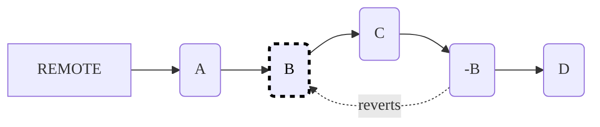

Gitでの作業には、実験とイテレーションが必要です。開発中に間違いは起こるものであり、変更を元に戻す必要がある場合があります。Gitでは、[Gitワークフロー](get_started.md#understand-the-git-workflow)の任意の時点で変更を取り消す機能を使用して、コード履歴を管理できます。

誤ったコミットからの復旧、機密データの削除、正しくないマージの修正を行い、クリーンなリポジトリ履歴を維持します。他のユーザーとコラボレーションしている場合は、新しいリバートコミットで透明性を維持するか、共有する前にローカルで作業をリセットします。使用する方法は、次のどちらであるかによって異なります。

- 変更がローカルコンピューターでのみ行われている。
- 変更がGitLab.comなどのGitサーバーにリモートで保存されている。

## ローカルでの変更を取り消す {#undo-local-changes}

変更をリモートリポジトリにプッシュするまで、Gitで行う変更はローカルの開発環境にのみ格納されます。

Gitでファイルを_ステージ_する場合、コミットの準備としてファイルへの変更を追跡するようにGitに指示します。ファイルへの変更を無視し、次のコミットに含めないようにする場合は、ファイルの_ステージングを解除_します。

### ステージングされていないローカルでの変更を取り消す {#revert-unstaged-local-changes}

まだステージングされていないローカルでの変更を取り消すには、次の手順に従います。

1. `git status`を実行して、ファイルのステージングが解除されたこと（`git add <file>`を使用しなかったこと）を確認します。

   ```shell
   git status
   ```

   出力例:

   ```shell
   On branch main
   Your branch is up-to-date with 'origin/main'.
   Changes not staged for commit:
     (use "git add <file>..." to update what will be committed)
     (use "git checkout -- <file>..." to discard changes in working directory)

       modified:   <file>
   no changes added to commit (use "git add" and/or "git commit -a")
   ```

1. オプションを選択して、変更を取り消します。

   - ローカルでの変更を上書きするには:

     ```shell
     git checkout -- <file>
     ```

   - すべてのファイルに対するローカルでの変更を完全に破棄するには:

     ```shell
     git reset --hard
     ```

### ステージングされたローカルでの変更を取り消す {#revert-staged-local-changes}

すでにステージングされたローカルでの変更は取り消すことができます。次の例では、ファイルがステージングに追加されましたが、コミットされていません。

1. `git status`でファイルがステージングされていることを確認します。

   ```shell
   git status
   ```

   出力例:

   ```shell
   On branch main
   Your branch is up-to-date with 'origin/main'.
   Changes to be committed:
     (use "git restore --staged <file>..." to unstage)

     new file:   <file>
   ```

1. オプションを選択して、変更を取り消します。

   - 変更を保持したままファイルのステージングを解除するには:

     ```shell
     git restore --staged <file>
     ```

   - 変更を保持したまますべてのステージングを解除するには:

     ```shell
     git reset
     ```

   - ファイルの現在のコミット（HEAD）へのステージングを解除するには:

     ```shell
     git reset HEAD <file>
     ```

   - すべてを完全に破棄するには:

     ```shell
     git reset --hard
     ```

## ローカルでのコミットを取り消す {#undo-local-commits}

`git commit`を使用してローカルリポジトリにコミットするとき、Gitは変更を記録します。まだリモートリポジトリにプッシュしていないため、変更は公開されておらず、他のユーザーと共有されてもいません。この時点では、変更を取り消すことができます。

### 履歴を変更せずにコミットを取り消す {#revert-commits-without-altering-history}

コミット履歴を保持しながら、コミットを取り消すことができます。

この例では、5つのコミット、`A`、`B`、`C`、`D`、`E`を使用します。これらは、`A-B-C-D-E`の順にコミットされました。取り消すコミットは`B`です。

1. 取り消すコミットのコミットSHAを見つけます。コミットのログを確認するには、コマンド`git log`を使用します。
1. オプションを選択して、変更を取り消します。

   - コミット`B`によって導入された変更を取り消すには:

     ```shell
     git revert <commit-B-SHA>
     ```

   - コミット`B`からの単一のファイルまたはディレクトリの変更を取り消しつつ、ステージングされた状態に保持するには:

     ```shell
     git checkout <commit-B-SHA> <file>
     ```

   - コミット`B`からの単一のファイルまたはディレクトリの変更を取り消しつつ、ステージングされていない状態に保持するには:

     ```shell
     git reset <commit-B-SHA> <file>
     ```

### コミットを取り消して履歴を変更する {#revert-commits-and-modify-history}

次のセクションでは、Git履歴を書き換えるタスクについて説明します。詳細については、[コンフリクトのリベースと解決](git_rebase.md)を参照してください。

#### 特定のコミットを削除する {#delete-a-specific-commit}

特定のコミットを削除できます。たとえば、コミット`A-B-C-D`があり、コミット`B`を削除するとします。

1. 現在のコミット`D`から`B`までの範囲をリベースします。

   ```shell
   git rebase -i A
   ```

   コミットのリストがエディタに表示されます。

1. コミット`B`の前で、`pick`を`drop`に置き換えます。
1. 他のすべてのコミットはデフォルトの`pick`のままにします。
1. 保存してエディタを終了します。

#### 特定のコミットを編集する {#edit-a-specific-commit}

特定のコミットを変更できます。たとえば、コミット`A-B-C-D`があり、コミット`B`で導入された内容を変更するとします。

1. 現在のコミット`D`から`B`までの範囲をリベースします。

   ```shell
   git rebase -i A
   ```

   コミットのリストがエディタに表示されます。

1. コミット`B`の前で、`pick`を`edit`に置き換えます。
1. 他のすべてのコミットはデフォルトの`pick`のままにします。
1. 保存してエディタを終了します。
1. エディタでファイルを開き、編集を行い、変更をコミットします。

   ```shell
   git commit -a
   ```

### 複数のコミットを取り消す {#undo-multiple-commits}

ブランチに複数のコミット（`A-B-C-D`）を作成した後、コミット`C`と`D`が間違っていることに気付いた場合は、両方の間違ったコミットを取り消します。

1. 最後にある正しいコミットをチェックアウトします。この例では、`B`です。

   ```shell
   git checkout <commit-B-SHA>
   ```

1. 新しいブランチを作成します。

   ```shell
   git checkout -b new-path-of-feature
   ```

1. 変更を追加、プッシュ、コミットします。

   ```shell
   git add .
   git commit -m "Undo commits C and D"
   git push --set-upstream origin new-path-of-feature
   ```

コミットは`A-B-C-D-E`になりました。

または、そのコミットを新しいマージリクエストに[cherry-pick](../../user/project/merge_requests/cherry_pick_changes.md#cherry-pick-a-single-commit)します。



別の方法は、`B`にリセットし、`E`をコミットすることです。ただし、この方法では`A-B-E`になり、他のユーザーのローカルにあるものと衝突します。ブランチが共有されている場合は、この方法を使用しないでください。



### 取り消したコミットを復元する {#recover-undone-commits}

過去のローカルでのコミットを呼び出すことができます。ただし、Gitは[ブランチまたはタグから到達できないコミットを定期的にクリーンアップ](https://git-scm.com/book/en/v2/Git-Internals-Maintenance-and-Data-Recovery)するため、過去のすべてのコミットが利用できるわけではありません。

リポジトリ履歴を表示して過去のコミットを追跡するには、`git reflog show`を実行します。例は次のとおりです。

```shell
$ git reflog show

# Example output:
b673187 HEAD@{4}: merge 6e43d5987921bde189640cc1e37661f7f75c9c0b: Merge made by the 'recursive' strategy.
eb37e74 HEAD@{5}: rebase -i (finish): returning to refs/heads/master
eb37e74 HEAD@{6}: rebase -i (pick): Commit C
97436c6 HEAD@{7}: rebase -i (start): checkout 97436c6eec6396c63856c19b6a96372705b08b1b
...
88f1867 HEAD@{12}: commit: Commit D
97436c6 HEAD@{13}: checkout: moving from 97436c6eec6396c63856c19b6a96372705b08b1b to test
97436c6 HEAD@{14}: checkout: moving from master to 97436c6
05cc326 HEAD@{15}: commit: Commit C
6e43d59 HEAD@{16}: commit: Commit B
```

この出力は、次のものを含むリポジトリ履歴を示しています。

- コミットSHA。
- コミットが行われた`HEAD`変更アクションが過去に何回行われたか（`HEAD@{12}`は過去に12回`HEAD`変更アクションがあったという意味）。
- 実行されたアクション（例: コミット、リベース、マージ）。
- `HEAD`を変更したアクションの説明。

## リモートでの変更を取り消す {#undo-remote-changes}

ブランチでリモートでの変更を取り消すことができます。ただし、自分のブランチにマージされたブランチの変更は取り消せません。その場合は、リモートブランチで変更を取り消す必要があります。

### 履歴を変更せずにリモートでの変更を取り消す {#revert-remote-changes-without-altering-history}

リモートリポジトリの変更を取り消すには、取り消す変更を含む新しいコミットを作成します。このプロセスは、履歴を保持し、明確なタイムラインと開発構造を提供します。



特定のコミット`B`で導入された変更を取り消すには:

```shell
git revert B
```

### リモートでの変更を取り消して履歴を変更する {#revert-remote-changes-and-modify-history}

リモートでの変更を取り消して履歴を変更できます。

履歴が更新されても、少なくともデタッチされたコミットの自動クリーンアップがすべて実行されるか、手動でクリーンアップが実行されるまでは、古いコミットにコミットSHAでアクセスできます。古いコミットを参照するrefsがまだある場合、クリーンアップでも古いコミットが削除されない可能性があります。


パブリックブランチ、つまり他のユーザーが使用する可能性のあるブランチで作業している場合は、履歴を変更しないでください。



[デフォルトブランチ](../../user/project/repository/branches/default.md)または共有ブランチのコミット履歴は絶対に変更しないでください。



### `git rebase`を使用して履歴を変更する {#modify-history-with-git-rebase}

マージリクエストのブランチはパブリックブランチであり、他のデベロッパーが使用する可能性があります。ただし、プロジェクトルールでは、レビューが完了した後、`git rebase`を使用してターゲットブランチに表示されるコミットの数を減らす必要がある場合があります。

`git rebase -i`を使用して履歴を変更できます。このコマンドを使用して、コミットの変更、スカッシュ、削除を行います。

```shell
#
# Commands:
# p, pick = use commit
# r, reword = use commit, but edit the commit message
# e, edit = use commit, but stop for amending
# s, squash = use commit, but meld into previous commit
# f, fixup = like "squash", but discard this commit's log message
# x, exec = run command (the rest of the line) using shell
# d, drop = remove commit
#
# These lines can be re-ordered; they are executed from top to bottom.
#
# If you remove a line THAT COMMIT WILL BE LOST.
#
# However, if you remove everything, the rebase will be aborted.
#
# Empty commits are commented out
```



リベースを停止する場合は、エディタを閉じないでください。エディタを閉じずに、コメント化されていないすべての行を削除して保存します。



共有ブランチおよびリモートブランチで、`git rebase`を慎重に使用します。リモートリポジトリにプッシュする前に、ローカルで実験します。

```shell
# Modify history from commit-id to HEAD (current commit)
git rebase -i commit-id
```

### `git merge --squash`を使用して履歴を変更する {#modify-history-with-git-merge---squash}

大規模なオープンソースリポジトリにコントリビュートする場合は、コミットを1つのコミットにスカッシュすることを検討してください。このプラクティスで次のことができます。

- クリーンで線形のプロジェクト履歴を維持するのに役立ちます。
- すべての変更が1つのコミットに凝縮されるため、変更を取り消すプロセスが簡素化されます。

マージ時にブランチのコミットをターゲットブランチの1つのコミットにスカッシュするには、`git merge --squash`を使用します。例は次のとおりです。

1. ベースブランチをチェックアウトします。この例では、ベースブランチは`main`です。

   ```shell
   git checkout main
   ```

1. `--squash`を使用してターゲットブランチをマージします。

   ```shell
   git merge --squash <target-branch>
   ```

1. 変更をコミットします。

   ```shell
   git commit -m "Squash commit from feature-branch"
   ```

GitLab UIからコミットをスカッシュする方法については、[スカッシュとマージ](../../user/project/merge_requests/squash_and_merge.md)を参照してください。

### マージコミットを別の親にリバートする {#revert-a-merge-commit-to-a-different-parent}

マージコミットをリバートすると、マージ先のブランチが常に最初の親になります。たとえば、[デフォルトブランチ](../../user/project/repository/branches/default.md)または`main`です。マージコミットを別の親にリバートするには、コマンドラインからコミットをリバートする必要があります。

1. リバート先の親コミットのSHAを特定します。
1. リバート先のコミットの親番号を特定します（最初の親の場合、デフォルトは`1`です）。
1. このコマンドを実行し、`2`を親番号に、`7a39eb0`をコミットSHAに置き換えます。

   ```shell
   git revert -m 2 7a39eb0
   ```

GitLab UIから変更を取り消す方法については、[変更を取り消す](../../user/project/merge_requests/revert_changes.md)を参照してください。

## 機密情報の処理 {#handle-sensitive-information}

パスワードやAPIキーなどの機密情報が、誤ってGitリポジトリにコミットされる可能性があります。このセクションでは、この状況に対処する方法について説明します。

### 情報を削除する {#redact-information}

誤ってコミットされた機密情報や社外秘の情報を完全に削除し、リポジトリの履歴からアクセスできないようにします。このプロセスでは、文字列のリストを`***REMOVED***`に置き換えます。

または、リポジトリから特定のファイルを完全に削除するには、[blobを削除する](../../user/project/repository/repository_size.md#remove-blobs)を参照してください。

リポジトリからテキストを削除するには、[リポジトリからテキストを削除する](../../user/project/merge_requests/revert_changes.md#redact-text-from-repository)を参照してください。

### コミットから情報を削除する {#remove-information-from-commits}

Gitを使用すると、過去のコミットから機密情報を削除できます。ただし、履歴はプロセスで変更されます。

[特定のフィルター](https://git-scm.com/docs/git-filter-branch#_options)を使用して履歴を書き換えるには、`git filter-branch`を実行します。

履歴からファイルを完全に削除するには、次を使用します。

```shell
git filter-branch --tree-filter 'rm filename' HEAD
```

`git filter-branch`コマンドは、大規模なリポジトリでは低速になる可能性があります。Gitコマンドをより高速で実行できるツールが用意されています。これらのツールは、`git filter-branch`と同じ機能セットを提供するのではなく、特定のユースケースに重点を置いているため、高速です。

リポジトリの履歴とGitLabストレージからファイルをパージする方法の詳細については、[リポジトリサイズを削減する](../../user/project/repository/repository_size.md#methods-to-reduce-repository-size)を参照してください。

## コミットを取り消して削除する {#undo-and-remove-commits}

- 最後のコミットを取り消し、すべてをステージングエリアに戻します。

  ```shell
  git reset --soft HEAD^
  ```

- ファイルを追加して、コミットメッセージを変更します。

  ```shell
  git commit --amend -m "New Message"
  ```

- まだプッシュしていない場合は、最後の変更を取り消して、他のすべての変更を削除します。

  ```shell
  git reset --hard HEAD^
  ```

- まだプッシュしていない場合は、最後の変更を取り消して、最後の2つのコミットを削除します。

  ```shell
  git reset --hard HEAD^^
  ```

### `git reset`のワークフロー例 {#example-git-reset-workflow}

次に、一般的なGitリセットのワークフローを示します。

1. ファイルを編集します。
1. ブランチの状態を確認します。

   ```shell
   git status
   ```

1. 誤ったコミットメッセージでブランチに変更をコミットします。

   ```shell
   git commit -am "kjkfjkg"
   ```

1. Gitログを確認します。

   ```shell
   git log
   ```

1. 正しいコミットメッセージでコミットを修正します。

   ```shell
   git commit --amend -m "New comment added"
   ```

1. Gitログを再度確認します。

   ```shell
   git log
   ```

1. ブランチをソフトリセットします。

   ```shell
   git reset --soft HEAD^
   ```

1. Gitログを再度確認します。

   ```shell
   git log
   ```

1. リモートからブランチの更新をプルします。

   ```shell
   git pull origin <branch>
   ```

1. ブランチの変更をリモートにプッシュします。

   ```shell
   git push origin <branch>
   ```

## 新しいコミットでコミットを取り消す {#undo-commits-with-a-new-commit}

コミットでファイルが変更されており、それを前のコミットの状態に戻しつつもコミット履歴を保持したい場合は、`git revert`を使用できます。このコマンドは、元のコミットで行われたすべてのアクションを元に戻す新しいコミットを作成します。

たとえば、コミット`B`でのファイルの変更を削除し、コミット`A`からコンテンツを復元するには、次を実行します。

```shell
git revert <commit-sha>
```

## リポジトリからファイルを削除する {#remove-a-file-from-a-repository}

- ディスクとリポジトリからファイルを削除するには、`git rm`を使用します。ディレクトリを削除するには、`-r`フラグを使用します。

  ```shell
  git rm '*.txt'
  git rm -r <dirname>
  ```

- ファイルをディスクに保持したまま、リポジトリから削除するには（たとえば、`.gitignore`に追加するファイルなど）、`--cache`フラグを指定して`rm`コマンドを使用します。

  ```shell
  git rm <filename> --cache
  ```

これらのコマンドは、現在のブランチからファイルを削除しますが、リポジトリの履歴からは消滅させません。リポジトリからファイルのすべてのトレース（過去と現在）を完全に削除するには、[blobを削除する](../../user/project/repository/repository_size.md#remove-blobs)を参照してください。

## `git revert`と`git reset`を比較する {#compare-git-revert-and-git-reset}

- `git reset`コマンドは、コミットを完全に削除します。
- `git revert`コマンドは、変更を削除しますが、コミットはそのまま残します。取り消しを取り消すことができるため、より安全です。

```shell
# Changed file
git commit -am "bug introduced"
git revert HEAD
# New commit created reverting changes
# Now we want to re apply the reverted commit
git log # take hash from the revert commit
git revert <rev commit hash>
# reverted commit is back (new commit created again)
```

## 関連トピック {#related-topics}

- [`git blame`](../../user/project/repository/files/git_blame.md)
- [Cherry-pick](../../user/project/merge_requests/cherry_pick_changes.md)
- [Git履歴](../../user/project/repository/files/git_history.md)
- [既存のコミットを取り消す](../../user/project/merge_requests/revert_changes.md#revert-a-commit)
- [スカッシュとマージ](../../user/project/merge_requests/squash_and_merge.md)
