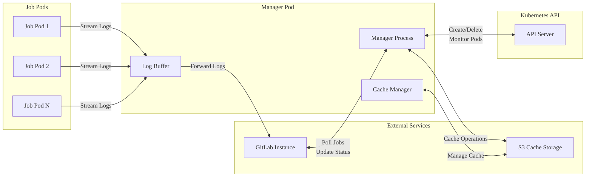
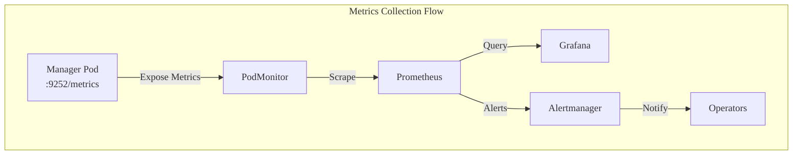
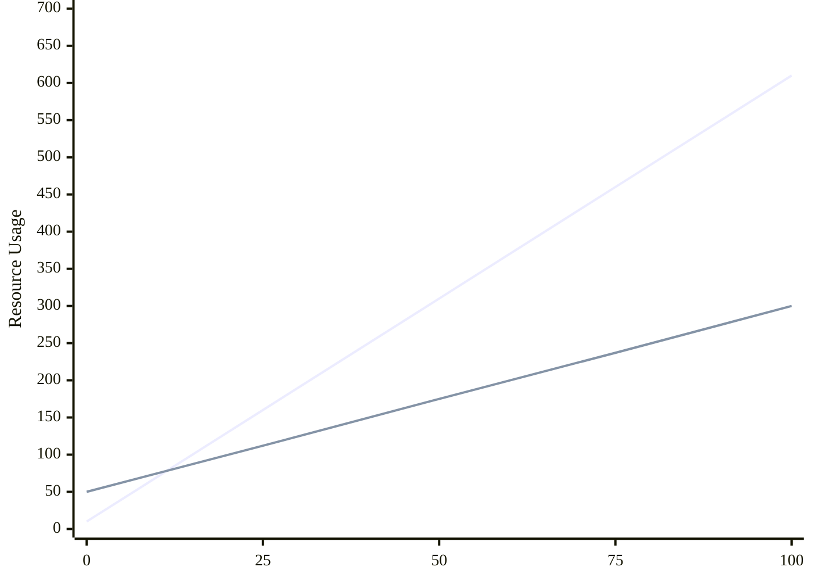
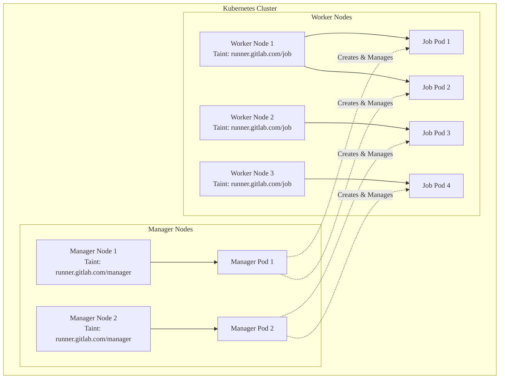



- プラン: Free、Premium、Ultimate
- 提供形態: GitLab.com、GitLab Self-Managed、GitLab Dedicated



Kubernetes環境でGitLab Runnerマネージャーポッドのパフォーマンスを監視および最適化するために、GitLabは次のベストプラクティスを推奨します。これらを適用して、パフォーマンスのボトルネックを特定し、最適なCI/CDパイプラインの実行のためのソリューションを実装します。

## 前提要件 {#prerequisites}

これらの推奨事項を実装する前に:

- [Kubernetes executor](https://docs.gitlab.com/runner/executors/kubernetes/)を使用して、KubernetesにGitLab Runnerをデプロイします
- Kubernetesクラスタへの管理者アクセス権を持っている
- GitLab Runnerの[Prometheusモニタリング](../../administration/monitoring/_index.md)を設定する
- Kubernetesリソース管理の基本的な理解

## GitLab Runnerマネージャーポッドの役割 {#gitlab-runner-manager-pod-responsibilities}

GitLab Runnerマネージャーポッドは、Kubernetes内のすべてのCI/CDジョブの実行を調整します。そのパフォーマンスは、パイプラインの効率に直接影響します。

処理内容:

- **ログ処理**: ワーカーポッドからのジョブログを収集してGitLabに転送します
- **キャッシュ管理**: ローカルおよびクラウドベースのキャッシュ操作を調整します
- **Kubernetes APIリクエスト**: ワーカーポッドを作成、監視、および削除します
- **GitLab API通信**: ジョブをポーリングして、ステータスの更新をレポートします
- **ポッドライフサイクル管理**: ワーカーポッドのプロビジョニングとクリーンアップを管理します



各役割はパフォーマンスに異なる影響を与えます:

- **CPU集中型**: Kubernetes API操作、ログ処理
- **メモリ集中型**: ログバッファリング、ジョブキュー管理
- **ネットワーク集中型**: GitLab API通信、ログストリーミング

## KubernetesにGitLab Runnerをデプロイする {#deploy-gitlab-runner-in-kubernetes}

[GitLab Runner Operator](https://gitlab.com/gitlab-org/gl-openshift/gitlab-runner-operator)を使用してGitLab Runnerをインストールします。Operatorは、新しい機能と改善を積極的に受信します。GitLab Runnerチームは、[Experimental GRIT framework](https://gitlab.com/gitlab-org/ci-cd/runner-tools/grit/-/tree/main/scenarios/google/gke/operator?ref_type=heads)を介してOperatorをインストールします。

KubernetesにGitLab Runnerをインストールする最も簡単な方法は、[最新リリースの`operator.k8s.yaml`マニフェスト](https://gitlab.com/gitlab-org/gl-openshift/gitlab-runner-operator/-/releases)を適用し、[Operatorインストールに関するドキュメント](https://docs.gitlab.com/runner/install/operator/#install-on-kubernetes)の手順に従うことです。

## モニタリングの設定 {#configure-monitoring}

ポッドは一時的であり、メトリクスが主要な運用表示レベルを提供するため、KubernetesでのGitLab Runner管理には可観測性が重要です。

モニタリングには、[`kube-prometheus-stack`](https://github.com/prometheus-community/helm-charts/blob/main/charts/kube-prometheus-stack/README.md)をインストールします。

Operatorのモニタリングを設定するには、[GitLab Runner Operatorのモニタリング](https://docs.gitlab.com/runner/monitoring#monitor-gitlab-runner-operator)を参照してください。

## パフォーマンスのモニタリング {#performance-monitoring}

効果的なモニタリングは、最適なマネージャーポッドのパフォーマンスを維持するために重要です。



### 主要なパフォーマンスメトリクス {#key-performance-metrics}

これらの重要なメトリクスを監視します:

| メトリック                                             | 説明                      | パフォーマンス指標 |
| -------------------------------------------------- | -------------------------------- | --------------------- |
| `gitlab_runner_jobs`                               | 現在実行中のジョブ             | ジョブキューの飽和  |
| `gitlab_runner_limit`                              | 設定されたジョブの並行処理制限 | 容量使用率  |
| `gitlab_runner_request_concurrency_exceeded_total` | 並行処理制限を超えるリクエスト | APIスロットリング        |
| `gitlab_runner_errors_total`                       | キャッチされたエラーの合計              | システムの安定性      |
| `container_cpu_usage_seconds_total`                | コンテナのCPU使用量              | リソース消費量  |
| `container_memory_working_set_bytes`               | コンテナのメモリ使用量           | メモリプレッシャー       |

### Prometheusクエリ {#prometheus-queries}

これらのクエリを使用して、マネージャーポッドのパフォーマンスを追跡します:

```prometheus
# Manager pod memory usage in MB
container_memory_working_set_bytes{pod=~"gitlab-runner.*"} / 1024 / 1024

# Manager pod CPU utilization in Millicores
rate(container_cpu_usage_seconds_total{pod=~"gitlab-runner.*"}[5m]) * 1000

# Job queue saturation
gitlab_runner_jobs / gitlab_runner_limit

# Jobs per runner
gitlab_runner_jobs

# API request rate
sum(rate(apiserver_request_total[5m]))
```

### ダッシュボードの例 {#example-dashboard}

次のダッシュボードは、以前に説明したPrometheusクエリを使用して、すべてのポッドでのManagerポッドの使用率を示しています:


このダッシュボードは、以下を視覚化するのに役立ちます:

- マネージャーポッド全体のメモリ使用量の傾向
- ジョブ実行中のCPU使用率パターン
- ジョブキューの飽和レベル
- 個々のポッドのリソース消費量

## オーバーロードされたマネージャーポッドの特定 {#identify-overloaded-manager-pods}

パフォーマンスの低下を認識して、パイプラインに影響を与える前に認識します。

### リソース使用率指標 {#resource-utilization-indicators}

デフォルトでは、GitLab Runner OperatorはマネージャーポッドにCPUまたはメモリ制限を適用しません。

リソース制限を設定するには:

```shell
kubectl patch deployment gitlab-runner -p '{"spec":{"template":{"spec":{"containers":[{"name":"gitlab-runner","resources":{"requests":{"cpu":"500m","memory":"256Mi"},"limits":{"cpu":"1000m","memory":"512Mi"}}}]}}}}'
```



Operator設定からのデプロイパッチを許可する機能は開発中です。詳細については、[マージリクエスト197](https://gitlab.com/gitlab-org/gl-openshift/gitlab-runner-operator/-/merge_requests/197)を参照してください。



**CPU使用率が高いパターン:**

- 標準操作中にCPUが常に70%を超えている
- ジョブの作成中にCPUスパイクが90%を超える
- 対応するジョブアクティビティーがない状態で高いCPUが持続する

**メモリ消費量の傾向:**

- 割り当てられた制限の80%を超えるメモリ使用量
- ワークロードが増加せずに継続的なメモリ増加
- マネージャーポッドログでのメモリ不足（OOM）イベント

### パフォーマンス低下の兆候 {#performance-degradation-signs}

これらの運用上の症状に注意してください:

- ジョブが通常よりも長く保留になっている
- ポッドの作成時間が30秒を超える
- GitLabジョブインターフェースでのログ出力の遅延
- ログ内の`etcdserver: request timed out`エラー

### 診断コマンド {#diagnostic-commands}

```shell
# Current resource usage
kubectl top pods --containers

> POD                                                 NAME              CPU(cores)   MEMORY(bytes)
> gitlab-runner-runner-86cd68d899-m6qqm               runner            7m           32Mi

# Check for performance errors
kubectl logs gitlab-runner-runner-86cd68d899-m6qqm --since=2h | grep -E "(error|timeout|failed)"
```

## リソース設定 {#resource-configuration}

適切なリソース設定は、最適なパフォーマンスに不可欠です。

### パフォーマンステスト開発手法 {#performance-testing-methodology}

GitLab Runner Managerポッドのパフォーマンスは、ログ出力を最大化するジョブを使用してテストされます:

<details>
<summary>パフォーマンステストジョブ定義</summary>

```yaml
performance_test:
  stage: build
  timeout: 30m
  tags:
    - kubernetes_runner
  image: alpine:latest
  parallel: 100
  variables:
    FILE_SIZE_MB: 4
    CHUNK_SIZE_BYTES: 1024
    FILE_NAME: "test_file_${CI_JOB_ID}_${FILE_SIZE_MB}MB.dat"
    KUBERNETES_CPU_REQUEST: "200m"
    KUBERNETES_CPU_LIMIT: "200m"
    KUBERNETES_MEMORY_REQUEST: "200Mi"
    KUBERNETES_MEMORY_LIMIT: "200Mi"
  script:
    - echo "Starting performance test job ${CI_PARALLEL_ID}/${CI_PARALLEL_TOTAL} with ${FILE_SIZE_MB}MB file size, ${CHUNK_SIZE_BYTES} bytes chunk size"
    - dd if=/dev/urandom of="${FILE_NAME}" bs=1M count=${FILE_SIZE_MB}
    - echo "File generated successfully. Size:"
    - ls -lh "${FILE_NAME}"
    - echo "Reading file in ${CHUNK_SIZE_BYTES} byte chunks"
    - |
      TOTAL_SIZE=$(stat -c%s "${FILE_NAME}")
      BLOCKS=$((TOTAL_SIZE / CHUNK_SIZE_BYTES))
      echo "Processing $BLOCKS blocks of $CHUNK_SIZE_BYTES bytes each"
      for i in $(seq 0 99 $BLOCKS); do
        echo "Processing blocks $i to $((i+99))"
        dd if="${FILE_NAME}" bs=${CHUNK_SIZE_BYTES} skip=$i count=100 2>/dev/null | xxd -l $((CHUNK_SIZE_BYTES * 100)) -c 16
        sleep 0.5
      done
```

</details>

このテストでは、ジョブあたり4MBのログ出力が生成され、マネージャーポッドのログ処理機能をストレステストするために、デフォルトの[`output_limit`](https://docs.gitlab.com/runner/configuration/advanced-configuration/#the-runners-section)に到達します。

**テスト結果:**

| 並列ジョブ数 | ピークCPU使用率 | ピークメモリ使用量 |
| ------------- | -------------- | ----------------- |
| 50            | 308m           | 261 MB            |
| 100           | 657m           | 369 MB            |



**主な調査結果:**

- CPU使用率は、並行処理ジョブ数とほぼ線形にスケールします
- メモリ使用量はジョブ数とともに増加しますが、線形ではありません
- すべてのジョブは、キューイングなしで同時に実行されます

### CPU要件 {#cpu-requirements}

GitLabのパフォーマンステストに基づいて、マネージャーポッドのCPU要件を計算します:

マネージャーポッドのCPU =基本CPU +（並行処理ジョブ×ジョブあたりのCPUファクター）

各設定項目の意味は次のとおりです。:

- 基本CPU: 10m（ベースラインオーバーヘッド）
- ジョブあたりのCPUファクター：並行処理ジョブあたり約6m（テストに基づく）

**テスト結果に基づく例:**

50個の並行処理ジョブの場合:

```yaml
resources:
  requests:
    cpu: "310m" # 10m + (50 × 6m) = 310m
  limits:
    cpu: "465m" # 50% headroom for burst traffic
```

100個の並行処理ジョブの場合:

```yaml
resources:
  requests:
    cpu: "610m" # 10m + (100 × 6m) = 610m
  limits:
    cpu: "915m" # 50% headroom
```

### メモリ要件 {#memory-requirements}

GitLabのテストに基づいて、メモリ要件を計算します:

マネージャーポッドメモリ=基本メモリ+（並行処理ジョブ×ジョブあたりのメモリ）

各設定項目の意味は次のとおりです。:

- 基本メモリ: 50 MB（ベースラインオーバーヘッド）
- ジョブあたりのメモリ：並行処理ジョブあたり約2.5 MB（4MBのログ出力を使用）

**テスト結果に基づく例:**

50個の並行処理ジョブの場合:

```yaml
resources:
  requests:
    memory: "175Mi" # 50 + (50 × 2.5) = 175 MB
  limits:
    memory: "350Mi" # 100% headroom
```

100個の並行処理ジョブの場合:

```yaml
resources:
  requests:
    memory: "300Mi" # 50 + (100 × 2.5) = 300 MB
  limits:
    memory: "600Mi" # 100% headroom
```



メモリ使用量は、ログ量に基づいて大幅に異なります。4 MBを超えるログを生成するジョブには、比例してより多くのメモリが必要です。



### 設定例 {#configuration-examples}

**小規模（1〜20個の並行処理ジョブ）:**

```yaml
resources:
  limits:
    cpu: 300m
    memory: 256Mi
  requests:
    cpu: 150m
    memory: 128Mi

runners:
  config: |
    concurrent = 20

    [[runners]]
      limit = 20
      request_concurrency = 5
```

**大規模（75個以上の並行処理ジョブ）:**

```yaml
resources:
  limits:
    cpu: 1000m
    memory: 1Gi
  requests:
    cpu: 600m
    memory: 600Mi

runners:
  config: |
    concurrent = 150

    [[runners]]
      limit = 150
      request_concurrency = 20
```

### 水平ポッドオートスケーラー {#horizontal-pod-autoscaler}

自動スケーリングを設定する:

```yaml
apiVersion: autoscaling/v2
kind: HorizontalPodAutoscaler
metadata:
  name: gitlab-runner-hpa
spec:
  scaleTargetRef:
    apiVersion: apps/v1
    kind: Deployment
    name: gitlab-runner
  minReplicas: 2
  maxReplicas: 5
  metrics:
    - type: Resource
      resource:
        name: cpu
        target:
          type: Utilization
          averageUtilization: 70
    - type: Resource
      resource:
        name: memory
        target:
          type: Utilization
          averageUtilization: 80
```

## パフォーマンスの問題のトラブルシューティング {#troubleshoot-performance-issues}

これらのソリューションを使用して、一般的なマネージャーポッドのパフォーマンスの問題に対処します。

### APIレート制限 {#api-rate-limiting}

**問題:** マネージャーポッドがKubernetes APIレート制限を超えています。

**解決策:** APIポーリングを最適化します。

```toml
[[runners]]
  [runners.kubernetes]
    poll_interval = "5s"  # Increase from default 3s
    poll_timeout = "180s"
```

## パフォーマンスの最適化 {#performance-optimization}

困難なシナリオについては、これらのパフォーマンス最適化戦略を適用します。

### キャッシュの最適化 {#cache-optimization}

分散キャッシュを設定して、マネージャーポッドの負荷を軽減します。このアクションにより、キャッシュされたファイルを共有することで、ジョブポッドに必要な計算が削減されます:

```toml
[runners.cache]
  Type = "s3"
  Shared = true

  [runners.cache.s3]
    ServerAddress = "cache.example.com"
    BucketName = "gitlab-runner-cache"
    PreSignedURLDisabled = false
```

## ノード分離 {#node-segregation}

安定したパフォーマンスを確保し、リソースの競合を防ぐために、専用ノードを使用してマネージャーポッドをジョブポッドから分離します。この分離により、ジョブポッドが重要なマネージャーポッド操作を中断することがなくなります。



### ノードテイイントの設定 {#configure-node-taints}

**マネージャーノードの場合:**

```shell
# Taint nodes dedicated to Manager Pods
kubectl taint nodes <manager-node-name> runner.gitlab.com/manager=:NoExecute

# Label nodes for easier selection
kubectl label nodes <manager-node-name> runner.gitlab.com/workload-type=manager
```

**ワーカーノードの場合:**

```shell
# Taint nodes dedicated to job pods
kubectl taint nodes <worker-node-name> runner.gitlab.com/job=:NoExecute

# Label nodes for job scheduling
kubectl label nodes <worker-node-name> runner.gitlab.com/workload-type=job
```

### マネージャーポッドのスケジューリングを設定する {#configure-manager-pod-scheduling}

専用ノードでのみマネージャーポッドをスケジュールするようにGitLab Runner Operator設定を更新します:

```yaml
apiVersion: apps.gitlab.com/v1beta2
kind: Runner
metadata:
  name: gitlab-runner
spec:
  gitlabUrl: https://gitlab.example.com
  token: gitlab-runner-secret
  buildImage: alpine
  podSpec:
    name: "manager-node-affinity"
    patch: |
      {
        "spec": {
          "nodeSelector": {
            "runner.gitlab.com/workload-type": "manager"
          },
          "tolerations": [
            {
              "key": "runner.gitlab.com/manager",
              "operator": "Exists",
              "effect": "NoExecute"
            }
          ]
        }
      }
    patchType: "strategic"
```

### ジョブポッドのスケジューリングを設定する {#configure-job-pod-scheduling}

`config.toml`を更新して、ジョブポッドがワーカーノードでのみ実行されるようにします。

```toml
[runners.kubernetes.node_selector]
"runner.gitlab.com/workload-type" = "job"

[runners.kubernetes.node_tolerations]
"runner.gitlab.com/job=" = "NoExecute"
```

**ノード分離の利点:**

- ジョブの干渉なしにマネージャーポッド専用のリソース
- リソースの競合なしに予測可能なパフォーマンス
- 専用ノードを使用する場合、リソース制限なしで実行するオプション
- ノードベースのスケーリングによる容量計画の簡素化

### 緊急手順 {#emergency-procedures}

**正常な再起動:**

```shell
# Scale down to stop accepting new jobs
kubectl scale deployment gitlab-runner --replicas=0

# Wait for active jobs to complete (max 10 minutes)
timeout 600 bash -c 'while kubectl get pods -l job-type=user-job | grep Running; do sleep 10; done'

# Scale back up
kubectl scale deployment gitlab-runner --replicas=1
```

## 容量計画 {#capacity-planning}

これらの計算は、ジョブあたり4 MBのログ出力を使用したテストに基づいています。リソース要件は、以下に基づいて異なる場合があります:

- ジョブごとのログ量
- ジョブの実行パターン
- キャッシュの使用状況
- GitLabへのネットワークレイテンシー

このPython関数を使用して、最適なリソースを計算します:

```python
def calculate_manager_resources(concurrent_jobs, avg_log_mb_per_job=4):
    """Calculate Manager Pod resources based on performance testing."""
    # CPU: ~6m per concurrent job + 10m base
    base_cpu = 0.01  # 10m
    cpu_per_job = 0.006  # 6m per job
    total_cpu = base_cpu + (concurrent_jobs * cpu_per_job)

    # Memory: ~2.5MB per job + 50MB base (for 4MB log output)
    base_memory = 50
    memory_per_job = 2.5 * (avg_log_mb_per_job / 4)  # Scale with log size
    total_memory = base_memory + (concurrent_jobs * memory_per_job)

    return {
        'cpu_request': f"{int(total_cpu * 1000)}m",
        'cpu_limit': f"{int(total_cpu * 1.5 * 1000)}m",  # 50% headroom
        'memory_request': f"{int(total_memory)}Mi",
        'memory_limit': f"{int(total_memory * 2.0)}Mi"  # 100% headroom
    }
```

## パフォーマンスのしきい値 {#performance-thresholds}

プロアクティブな介入のしきい値を確立します:

| メトリック         | 警告        | 重大       | 必要なアクション         |
| -------------- | -------------- | -------------- | ----------------------- |
| CPU使用率      | 70%持続  | 85%持続  | スケールまたは最適化       |
| メモリ使用状況   | 制限の80%   | 制限の90%   | 制限を引き上げる         |
| APIエラー率 | リクエストの2% | リクエストの5% | ボトルネックを調査する |
| ジョブキュー時間 | 30秒     | 2分      | 容量を確認する         |

## 関連トピック {#related-topics}

- [GitLab Runnerフリートの設定とベストプラクティス](gitlab_runner_fleet_config_and_best_practices.md)-ジョブポッドのパフォーマンスの最適化
- [GitLab Runnerエグゼキューター](https://docs.gitlab.com/runner/executors/)-実行環境のパフォーマンス特性
- [GitLab Runnerモニタリング](../../administration/monitoring/_index.md)-一般的なモニタリング設定
- [Runnerフリートの計画と運用](https://docs.gitlab.com/runner/fleet_scaling/)-戦略的なRunnerフリートデプロイ

## 概要 {#summary}

GitLab Runnerマネージャーポッドのパフォーマンスを最適化するには、体系的なモニタリング、適切なリソース割り当て、およびプロアクティブなトラブルシューティングが必要です。

主要な戦略は次のとおりです:

- PrometheusメトリクスとGrafanaダッシュボードを使用した**プロアクティブなモニタリング**
- 並行処理ジョブ容量とログ量に基づく**リソース計画**
- フォールトトレランスと負荷分散のための**マルチマネージャーアーキテクチャ**
- 迅速な問題解決のための**緊急手順**

これらの戦略を実装して、信頼性の高いCI/CDパイプラインの実行を保証しながら、最適なリソース使用率を維持します。
