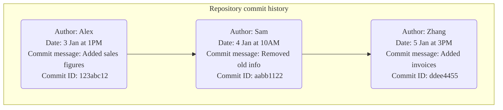
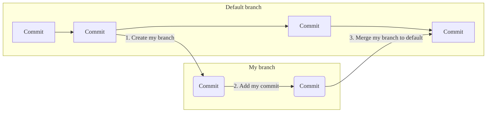

<!-- vale gitlab_base.FutureTense = NO -->

このチュートリアルでは、Gitの基本的な仕組みを体験できます。プロジェクトを自分で作成し、ファイルを編集し、コマンドラインからGitリポジトリに変更をコミットする手順を学びます。

チュートリアルを完了すると、Gitの使い方を練習できるプロジェクトが完成します。

## はじめる前 {#before-you-begin}

- [ローカルマシンにGitをインストール](../../topics/git/how_to_install_git/_index.md)します。
- GitLabのインスタンスにサインインできることを確認します。組織にGitLabがない場合は、GitLab.comでアカウントを作成します。
- [SSHキーを作成し、GitLabに追加](../../user/ssh.md)します。SSHキーは、コンピュータとGitLabの間で安全に通信する方法です。

## Gitとは {#what-is-git}

手順に入る前に、Gitの基本的な概念について説明します。

Gitは、バージョン管理システムです。ファイルへの変更を追跡するために使用します。

コードやドキュメントなどのファイルをGit*リポジトリ*に保存します。ファイルを編集する場合は、リポジトリの*クローン*をコンピュータに作成し、変更を加え、変更をリポジトリに*プッシュ*します。GitLabでは、Gitリポジトリは*プロジェクト*にあります。

変更をプッシュするたびに、Gitは変更を一意の*コミット*として記録します。これらのコミットにより、ファイルの変更日時、ファイルの変更内容、ファイルの変更者の履歴を構成します。



Gitリポジトリで作業するときは、*ブランチ*で作業します。デフォルトでは、リポジトリの内容はデフォルトブランチにあります。変更を加えるには、次の手順に従います:

1. ブランチを自分で作成します。このブランチは、作成時のデフォルトブランチのスナップショットです。
1. 変更を加え、変更をブランチにプッシュします。プッシュするたびにコミットが作成されます。
1. 準備ができたら、ブランチをデフォルトブランチに*マージ*します。



ここまでの説明で少しとまどっているかもしれませんが、大丈夫です。これから、これらの概念がどのように機能するのかを見ていきます。

## ステップ {#steps}

これから次の手順を実行します:

1. [サンプルプロジェクトを作成する](#create-a-sample-project)。
1. [リポジトリのクローンを作成する](#clone-the-repository)。
1. [ブランチを作成して変更を加える](#create-a-branch-and-make-changes)。
1. [変更をコミットしてプッシュする](#commit-and-push-your-changes)。
1. [変更をマージする](#merge-your-changes)。
1. [GitLabで変更を表示する](#view-your-changes-in-gitlab)。

### サンプルプロジェクトを作成する {#create-a-sample-project}

まず、GitLabでサンプルプロジェクトを作成します。

1. GitLabの左側のサイドバーの上部で、**新規作成**（）を選択し、**新規プロジェクト/リポジトリ**を選択します。
1. **プロジェクト名**に、`My sample project`と入力します。プロジェクトslugが生成されます。このslugは、作成後にプロジェクトにアクセスするために使用できるURLです。
1. **リポジトリを初期化しREADMEファイルを生成する**が選択されていることを確認します。他のフィールドは自由に設定してください。
1. **プロジェクトを作成**を選択します。

### リポジトリのクローンを作成する {#clone-the-repository}

プロジェクトでリポジトリのクローンを作成できるようになりました。リポジトリの*クローンを作成*するということは、コンピュータ上、またはファイルを保存および操作する場所にコピーを作成することを意味します。

1. プロジェクトの概要ページの右上隅で、**コード**を選択し、**SSHでクローン**のURLをコピーします。

   

1. コンピュータでターミナルを開き、ファイルのクローンを作成するディレクトリに移動します。

1. `git clone`と入力し、URLを貼り付けます:

   ```shell
   git clone git@gitlab.com:gitlab-example/my-sample-project.git
   ```

1. ディレクトリに移動します:

   ```shell
   cd my-sample-project
   ```

1. デフォルトで、リポジトリのデフォルトブランチのクローンを作成しました。通常、このブランチは`main`です。念のため、デフォルトブランチの名前を取得します:

   ```shell
   git branch
   ```

   作業中のブランチにアスタリスクが付いています。キーボードの`Q`を押して、メインのターミナルウィンドウに戻ります。

### ブランチを作成して変更を加える {#create-a-branch-and-make-changes}

リポジトリのコピーを作成したので、ブランチを自分で作成して、変更を個別に操作できます。

1. `example-tutorial-branch`という名前の新しいブランチを作成します。

   ```shell
   git checkout -b example-tutorial-branch
   ```

1. Visual Studio Code、Sublime、`vi`などのテキストエディタで、README.mdファイルを開き、次のテキストを追加します:

   ```plaintext
   Hello world! I'm using Git!
   ```

1. ファイルを保存します。

1. Gitは変更されたファイルを追跡します。どのファイルが変更されたかを確認するには、状態を取得します。

   ```shell
   git status
   ```

   次のような出力が得られるはずです:

   ```shell
   On branch example-tutorial-branch
   Changes not staged for commit:
   (use "git add <file>..." to update what will be committed)
   (use "git restore <file>..." to discard changes in working directory)
   modified:   README.md

   no changes added to commit (use "git add" and/or "git commit -a")
   ```

### 変更をコミットしてプッシュする {#commit-and-push-your-changes}

リポジトリ内のファイルを変更しました。ここでは、初めてのコミットを実行し、それらの変更を記録します。

1. `README.md`ファイルを*ステージング*エリアに追加します。ステージングエリアは、コミットする前にファイルを配置する場所です。

   ```shell
   git add README.md
   ```

1. ファイルがステージされたことを確認します:

   ```shell
   git status
   ```

   次のような出力が表示され、ファイル名が緑色のテキストで表示されるはずです。

   ```shell
   On branch example-tutorial-branch
   Changes to be committed:
   (use "git restore --staged <file>..." to unstage)
   modified:   README.md
   ```

1. 次に、ステージされたファイルをコミットし、加えた変更を説明するメッセージを含めます。メッセージは必ず二重引用符（"）で囲んでください。

   ```shell
   git commit -m "I added text to the README file"
   ```

1. 変更はブランチにコミットされましたが、ブランチとそのコミットは、まだ自分のコンピュータでしか使用できません。まだ誰もアクセスできません。ブランチをGitLabにプッシュします:

   ```shell
   git push origin example-tutorial-branch
   ```

ブランチがGitLabで使用可能になり、プロジェクト内の他のユーザーに表示されるようになりました。


### 変更をマージする {#merge-your-changes}

これで、`example-tutorial-branch`ブランチからデフォルトブランチ（`main`）に変更をマージする準備ができました。

1. リポジトリのデフォルトブランチをチェックアウトします。

   ```shell
   git checkout main
   ```

1. ブランチをデフォルトブランチにマージします。

   ```shell
   git merge example-tutorial-branch
   ```

1. 変更をプッシュします。

   ```shell
   git push
   ```



このチュートリアルでは、ブランチをリポジトリのデフォルトブランチに直接マージします。GitLabでは、通常、[マージリクエスト](../../user/project/merge_requests/_index.md)を使用してブランチをマージします。



### GitLabで変更を表示する {#view-your-changes-in-gitlab}

おめでとうございます。ブランチ内の`README.md`ファイルを更新し、それらの変更を`main`ブランチにマージしました。

では、UI上で変更を確認しましょう。プロジェクトに移動してください。

- 下にスクロールして、`README.md`ファイルの内容を表示します。変更が表示されるはずです。
- `README.md`ファイルの上にある**最新コミット**列のテキストを確認します。コミットメッセージがこの列に表示されます:

  

これで、コマンドラインに戻り、個人のブランチ（`git checkout example-tutorial-branch`）に切り替えることができます。引き続きファイルを更新したり、新しいファイルを作成したりできます。`git status`と入力して変更の状態を表示し、思い切ってコミットしてみましょう。

うまくできなくても心配しないでください。Gitではすべての操作をリバートできます。復旧が難しい場合でも、いつでも新しいブランチを作成して最初からやり直すことができます。

おつかれさまでした。

## その他のGit学習リソース {#find-more-git-learning-resources}

- <i class="fa fa-youtube-play youtube" aria-hidden="true"></i> [Git for GitLab](https://www.youtube.com/watch?v=4lxvVj7wlZw)初心者向けコースでは、Gitの基本を学べます（1時間33分）。
- [チュートリアルページ](../_index.md)で、GitとGitLabに関する他のチュートリアルを見つけることができます。
- PDFダウンロード: [GitLab Gitチートシート](https://about.gitlab.com/images/press/git-cheat-sheet.pdf)。
- ブログ投稿: [Git Tips & Tricks](https://about.gitlab.com/blog/2016/12/08/git-tips-and-tricks/)。
- ブログ投稿: [Eight Tips to help you work better with Git](https://about.gitlab.com/blog/2015/02/19/8-tips-to-help-you-work-better-with-git/)。
- 公式のGit[ドキュメント](https://git-scm.com) （[Git on the Server - GitLab](https://git-scm.com/book/en/v2/Git-on-the-Server-GitLab)、他）。
