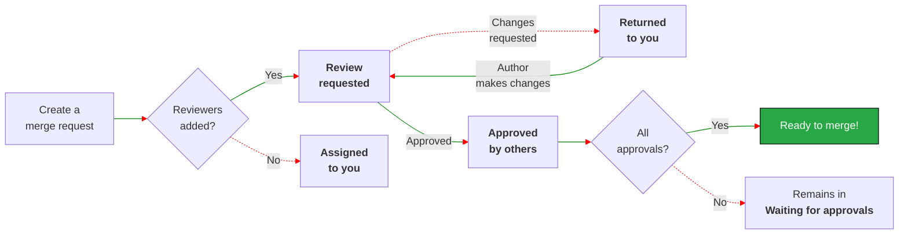



- プラン: Free、Premium、Ultimate
- 提供形態: GitLab.com、GitLab Self-Managed、GitLab Dedicated





- GitLab 17.9で`merge_request_dashboard`[フラグ](../../administration/feature_flags/_index.md)とともに[導入](https://gitlab.com/groups/gitlab-org/-/epics/13448)されました。デフォルトでは無効になっています。
- 機能フラグ`merge_request_dashboard`は、GitLab 17.9のGitLab.comで[有効](https://gitlab.com/gitlab-org/gitlab/-/issues/480854)になりました。
- 機能フラグ`mr_dashboard_list_type_toggle`は、GitLab 18.1のGitLab.comで[有効](https://gitlab.com/gitlab-org/gitlab/-/issues/535244)になりました。
- 機能フラグ`merge_request_dashboard`は、GitLab 18.2で[デフォルトで有効](https://gitlab.com/gitlab-org/gitlab/-/merge_requests/194999)になりました。





この機能の利用可否は、機能フラグによって制御されます。詳細については、履歴を参照してください。



このチュートリアルでは、マージリクエストを管理するための新しいユーザーインターフェースを紹介します。

あなたがレビュー待ちの作成者であれ、フィードバックを提供するレビュアーであれ、このページはあなたの作業を追跡するのに役立ちます。このページでは、作業が明確なカテゴリに分類され、次のことが容易になります:

- 注意が必要なマージリクエストを追跡する時間を短縮。
- 最も緊急性の高い作業に最初に集中。
- コントリビュートのステータスを表示。
- 進行中の作業が忘れられるのを防止。
- コードレビューのベロシティを向上。

## 実際に見てみましょう {#see-it-in-action}

GitLab.comでマージリクエストのホームページを表示するには、次のいずれかの操作を行います:

- <kbd>Shift</kbd>+<kbd>m</kbd> [キーボードショートカット](../../user/shortcuts.md)を使用します。
- 左側のサイドバーで、**マージリクエスト**を選択します。

3つのタブに整理されており、現在注意が必要なものに集中しやすくなると同時に、他の最近の作業にもアクセスできます:

- **有効**: これらのマージリクエストは、あなたまたはあなたのチームのメンバーからの注意が必要です。
- **マージ済み**: これらのマージリクエストは過去14日間にマージされており、あなたは担当者またはレビュアーでした。
- **検索**: すべてのマージリクエストを検索し、必要に応じてフィルターを適用します。

GitLabでは、すべてのページの左側のサイドバーに、**有効**なマージリクエストの合計数が表示されます。たとえば、このユーザーには次のものがあります:

- 9件のオープンイシュー ()
- 1件の有効なマージリクエスト ()
- 1 To-Do項目()

各テーブル行は、マージリクエストに関する関連情報を列にまとめています:

- **ステータス** \- マージリクエストの現在のステータス。
- **タイトル** \- 次を含む、イシューに関する重要なメタデータ:
  - マージリクエストのタイトル。
  - 担当者のアバター。
  - 追加および削除されたファイルと行の数(`+` / `-`)。
  - マイルストーン:
- **作成者** \- 作成者のアバター。
- **レビュアー** \- レビュアーのアバター。緑色のチェックマークが付いたレビュアーは、マージリクエストを承認しています。
- **チェック** \- マージ可能性のコンパクトな評価。
  - オープンスレッドの数（例：`0 of 3`）。
  - 現在の必須[承認ステータス](../../user/project/merge_requests/approvals/_index.md#in-the-list-of-merge-requests)。
  - 最新のパイプラインのステータス。
  - 最終更新日。

## UIの表示設定を行う {#set-your-display-preferences}

右上にある**Display preferences**（表示設定） () を選択して、マージリクエストを次で並べ替えます:

- **ワークフロー**。このビューでは、マージリクエストがステータス別にグループ化されます。マージリクエストは、あなたが作成者であるかレビュアーであるかにかかわらず、注意が必要なものが最初に表示されます。
- **ロール**このビューでは、マージリクエストがあなたがレビュアーであるか作成者であるかによってグループ化されます。





**ワークフロー**ビューでは、**有効**タブにマージリクエストが次の順序で並べ替えられます:

- **返却されました**
- **リクエストしたレビュー**
- **マージリクエスト**

次の状態のマージリクエストは、**有効**数から除外する:

- **Waiting for assignee**（担当者の割り当てを待っています）
- **承認待ち**
- **あなたにより承認済み**
- **他の人により承認済み**





**ロール**ビューでは、**有効**なタブにマージリクエストが次の順序で並べ替えられます:

- **Reviewer (Active)**（レビュアー (有効)）
- **Reviewer (Inactive)**（レビュアー (非アクティブ)）
- **Your merge requests (Active)**（マージリクエスト (有効)）
- **Your merge requests (Inactive)**（マージリクエスト (非アクティブ)）





## ロールビューについて {#understand-the-role-view}

**ロール**ビューは、担当者またはレビュアーであるマージリクエストをグループ化します:

- **Reviewer (Active)**（レビュアー (有効)）: あなたからのレビュー待ち。
- **Reviewer (Inactive)**（レビュアー (非アクティブ)）: あなたによって既にレビュー済み。
- **Your merge requests (Active)**（マージリクエスト (有効)）
- **Your merge requests (Inactive)**（マージリクエスト (非アクティブ)）

**有効**リストのマージリクエストは、左側のサイドバーに表示される合計数にカウントされます。

## ワークフロービューについて {#understand-the-workflow-view}

**ワークフロー**ビューは、マージリクエストを[レビュープロセス](../../user/project/merge_requests/reviews/_index.md)のどこにあるかでグループ化します。このビューは、次に取るべきアクションを理解するのに役立ちます:

このレビューフローは、次を前提としています:

1. **担当者**は、マージリクエストの作成者です。
1. **レビュアー**は、マージリクエストの作業をレビューするユーザーです。
1. レビュアーは、[**レビューを開始**](../../user/project/merge_requests/reviews/_index.md#start-a-review)および[**レビューを送信**](../../user/project/merge_requests/reviews/_index.md#submit-a-review)機能を使用します。

**有効**なステータスの1つにあるマージリクエストは、左側のサイドバーに表示される合計数にカウントされます。

- 有効なステータス: **返却されました**、**リクエストしたレビュー**、**マージリクエスト**
- 非アクティブステータス: **Waiting for assignee**（担当者の割り当てを待っています）、**承認待ち**、**あなたにより承認済み**、**他の人により承認済み**

## ワークフロービュー: 有効なステータス {#workflow-view-active-statuses}

これらのマージリクエストは、あなたまたはあなたのチームのメンバーからの注意が必要です。

### 返却されました {#returned-to-you}

レビュアーがフィードバックを提供したか、変更をリクエストしました。

- 次の手順: レビュアーのコメントに対処し、提案された変更を実装します。
- ステータス:
  - **変更リクエスト済み**: レビュアーが変更をリクエストしました。
  - **レビュアーがコメント**: レビュアーがコメントを残しましたが、変更はリクエストしませんでした。

### レビューリクエスト {#review-requested}

あなたはこのマージリクエストのレビュアーです。

- 次の手順: マージリクエストをレビューします。承認とフィードバックを提供します。必要に応じて変更をリクエストします。
- ステータス:
  - **リクエスト済み**: まだレビューを開始していません。
  - **レビュー開始**: レビューを開始しましたが、まだ完了していません。

### あなたのマージリクエスト {#your-merge-requests}

あなたはこのマージリクエストの作成者または担当者です。まだレビュアーを追加していません。

- 次の手順: レビュアーを追加して、レビュープロセスを開始します。
- ステータス:
  - **ドラフト**: マージリクエストはドラフトとしてマークされています。
  - **Reviewers needed**（レビュー担当者が必要です）: マージリクエストはドラフトではありませんが、レビュアーがいません。

## ワークフロービュー: 非アクティブなステータス {#workflow-view-inactive-statuses}

**有効**なタブには、進行中のすべてのマージリクエストがステータスで並べ替えられて表示されます。これらのマージリクエストは、現在あなたからのアクションが不要なため、有効数から除外する:

### 担当者の割り当てを待っています {#waiting-for-assignee}

承認待ちの担当者に割り当てられたマージリクエストと、変更をリクエストしたレビュー。

- 次の手順: レビューと承認を待ちます。
- ステータス:
  - **変更をリクエストしました**: レビューを完了し、変更をリクエストしました。
  - **コメント済み**: コメントしましたが、レビューは完了していません。

### 承認待ち {#waiting-for-approvals}

承認待ちの担当者に割り当てられたマージリクエストと、変更をリクエストしたレビュー。

- 次の手順: すべての承認要件が満たされるまで待ちます。
- ステータス:
  - **承認が必要** \- 残りの必須承認の数。
  - **承認済み** \- あなたが承認したか、すべての必須承認が満たされています。
  - **承認待ち**。

### あなたにより承認済み {#approved-by-you}

レビューして承認したマージリクエスト。

- 次の手順: 他の承認およびその他のマージ要件が満たされるまで待ちます。
- ステータス:
  - **承認済み** \- あなたが承認し、必要な承認が満たされました。
  - **承認が必要** \- あなたが承認しましたが、必要なすべての承認が満たされているわけではありません。

### 他の人により承認済み {#approved-by-others}

他のチームメンバーから承認を受けたマージリクエスト。

- 次の手順: すべての要件が満たされている場合は、マージする準備ができている可能性があります。
- ステータス:
  - **承認済み** \- マージリクエストは必要な承認を受けました。
