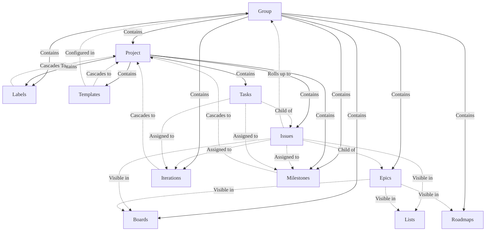
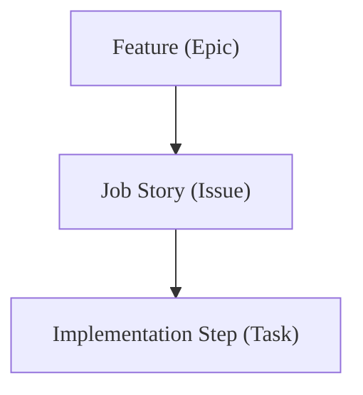
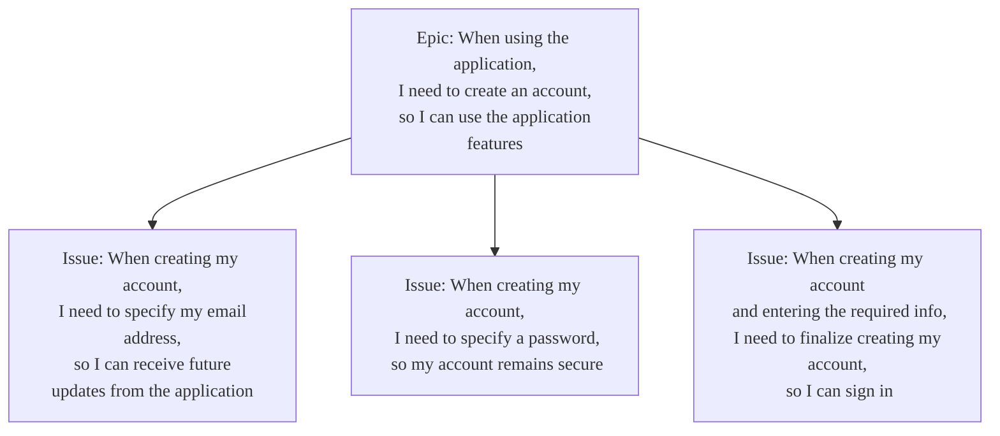
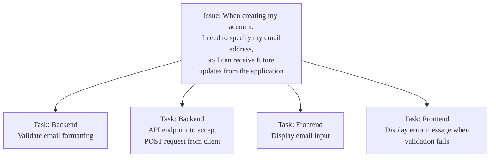



- プラン: Premium、Ultimate
- 提供形態: GitLab.com、GitLab Self-Managed、GitLab Dedicated



<!-- vale gitlab_base.FutureTense = NO -->

このチュートリアルでは、GitLabのアジャイルプランニングおよび追跡機能を使用して、主要なScrumセレモニーとワークフローを促進する方法を段階的に説明します。グループ、プロジェクト、ボード、およびその他の機能を意図的に設定することで、チームは透明性、コラボレーション、および配信ケイデンスを強化できます。

Martin Fowlerの[アジャイルFluency Model](https://martinfowler.com/articles/agileFluency.html)によると、[Scrum](https://scrumguides.org/scrum-guide.html)を実践しているチームは、次のようになります:

> スポンサー、顧客、およびユーザーがソフトウェアから得られるメリットという観点から考え、計画を立てます。

彼らは、毎月進捗状況を実証し、ビジネスと顧客の価値をより高めるために、プロセスと作業習慣の改善を定期的に見直すことによって、これを実現しています。

このチュートリアルでは、次のトピックについて説明します:

- [グループとプロジェクトの設定](#setting-up-your-groups-and-projects)
- [フィーチャーバックログの管理](#managing-your-feature-backlog)
- [ストーリーバックログの管理](#managing-your-story-backlog)
- [スプリントの進捗状況の追跡](#tracking-sprint-progress)

## グループとプロジェクトの設定 {#setting-up-your-groups-and-projects}

GitLabでScrumプラクティスを促進するには、まず、グループとプロジェクトの基本的な構造を設定する必要があります。グループを使用して、そのグループの下にネストされたプロジェクトが継承できるボードとラベルを作成します。プロジェクトには、各スプリントの実際の作業アイテムを構成するイシューとタスクが含まれます。

### GitLabでの継承モデルの理解 {#understanding-the-inheritance-model-in-gitlab}

GitLabには、グループがプロジェクトを含む階層構造があります。グループレベルで適用される設定と構成は、子プロジェクトにカスケードされるため、複数のプロジェクト間でラベル、ボード、およびイテレーションを標準化できます:



- グループには、1つ以上のプロジェクト、エピック、ボード、ラベル、およびイテレーションが含まれています。グループのユーザーメンバーシップは、グループのプロジェクトにカスケードされます。
- グループまたはプロジェクトでボードとラベルを作成できます。このチュートリアルでは、単一のグループ内の多くのプロジェクトにわたる標準化された計画ワークフローとレポート作成を容易にするために、グループでそれらを作成する必要があります。
- プロジェクトにカスケードされるオブジェクトは、そのプロジェクトのイシューに関連付けることができます。たとえば、グループからイシューにラベルを適用できます。

### グループの作成 {#create-your-group}

Scrumアクティビティー専用のグループを作成します。これは、プロジェクト全体で標準化するボードやラベルなどのプロジェクトと構成の親コンテナになります。

このグループは、一般的なScrumケイデンス中のさまざまなアクティビティーの主要な場所になります。ボード、フィーチャー（エピック）、ストーリー（イシュー）のロールアップ、およびラベルが含まれます。

グループを作成するには:

1. 左側のサイドバーの上部で、**新規作成**（）を選択し、**新規グループ**を選択します。
1. **グループを作成**を選択します。
1. **グループ名**テキストボックスに、グループの名前を入力します。グループ名として使用できない単語のリストについては、[予約済みの名前](../../user/reserved_names.md)を参照してください。
1. **グループURL**テキストボックスに、[ネームスペース](../../user/namespace/_index.md)に使用するグループのパスを入力します。
1. グループの[**表示レベル**](../../user/public_access.md)を選択します。
1. オプション。GitLabエクスペリエンスをパーソナライズするには:
   - **ロール**ドロップダウンリストから、自分のロールを選択します。
   - **だれがこのグループを使用しますか?**で、オプションを選択します。
   - **このグループを何に使う予定ですか?**ドロップダウンリストから、オプションを選択します。
1. オプション。グループにメンバーを招待するには、**Email 1**（メール1）テキストボックスに、招待するユーザーのメールアドレスを入力します。他のユーザーを招待するには、**他のメンバーを招待**を選択し、ユーザーのメールアドレスを入力します。
1. **グループを作成**を選択します。

### プロジェクトの作成 {#create-your-projects}

作成したグループで、1つ以上のプロジェクトを作成します。プロジェクトには、親グループにロールアップするストーリーが含まれます。

空のプロジェクトを作成するには: 

1. 左側のサイドバーの上部で、**新規作成**（）を選択し、**新規プロジェクト/リポジトリ**を選択します。
1. **空のプロジェクトの作成**を選択します。
1. プロジェクトの詳細を入力します:
   - **プロジェクト名**フィールドに、プロジェクトの名前を入力します。[プロジェクト名の制限](../../user/reserved_names.md)を参照してください。
   - **プロジェクトslug**フィールドに、プロジェクトへのパスを入力します。GitLabインスタンスは、このslugをプロジェクトへのURLパスとして使用します。slugを変更するには、最初にプロジェクト名を入力し、次にslugを変更します。
   - ユーザーのプロジェクトの[表示およびアクセス権](../../user/public_access.md)を変更するには、**表示レベル**を変更します。
   - Gitリポジトリが初期化され、デフォルトブランチがあり、クローンを作成できるようにReadmeファイルを作成するには、**リポジトリを初期化しREADMEファイルを生成する**チェックボックスをオンにします。
1. **プロジェクトを作成**を選択します。

### Scrumライフサイクルのさまざまなフェーズをサポートするためのスコープ付きラベルの作成 {#create-scoped-labels-to-support-different-phases-of-the-scrum-lifecycle}

次に、作成したグループで、イシューに追加して分類するためのラベルを作成します。

これに最適なツールは、相互に排他的な属性を設定するために使用できる[スコープ付きラベル](../../user/project/labels.md#scoped-labels)です。

スコープ付きラベルの名前のダブルコロン（`::`）は、同じスコープの2つのラベルを一緒に使用できないようにします。たとえば、すでに`status::ready`があるイシューに`status::in progress`ラベルを追加すると、前のラベルが削除されます。

各ラベルを作成するには:

1. 左側のサイドバーで、**検索または移動先**を選択して、グループを見つけます。
1. **管理** > **ラベル**を選択します。
1. **新しいラベル**を選択します。
1. **タイトル**フィールドに、ラベルの名前を入力します。`priority::now`で始まる。
1. オプション。使用可能な色から選択するか、**背景色**フィールドに特定の色を表す16進数のカラー値を入力して、色を選択します。
1. **ラベルを作成**を作成を選択します。

これらの手順を繰り返して、必要なすべてのラベルを作成します:

- **優先順位**: これらをエピックボードで使用して、フィーチャーレベルのリリース優先順位を容易にします。
  - `priority::now`
  - `priority::next`
  - `priority::later`
- **ステータス**: これらのラベルをイシューボードで使用して、ストーリーの全体的な開発ライフサイクルにおける現在のステップを理解します。
  - `status::triage`
  - `status::refine`
  - `status::ready`
  - `status::in progress`
  - `status::in review`
  - `status::acceptance`
  - `status::done`
- **種類**: これらのラベルを使用して、通常1つのイテレーションにプルされるさまざまなタイプの作業アイテムを表します:
  - `type::story`
  - `type::bug`
  - `type::maintenance`

### イテレーションケイデンスを作成する {#create-an-iteration-cadence}

GitLabでは、スプリントはイテレーションと呼ばれます。イテレーションケイデンスには、イシューの計画とレポート作成のための個々のシーケンシャルイテレーションタイムボックスが含まれています。ラベルと同様に、イテレーションはグループ、サブグループ、およびプロジェクトの階層にカスケードされます。そのため、作成したグループにイテレーションケイデンスを作成します。

前提要件:

- グループのレポーター以上のロールが必要です。

イテレーションケイデンスを作成するには:

1. 左側のサイドバーで、**検索または移動先**を選択して、グループを見つけます。
1. **Plan** > **イテレーション**を選択します。
1. **新しいイテレーションケイデンス**を選択します。
1. イテレーションケイデンスのタイトルと説明を入力します。
1. **自動スケジュールを有効にする**チェックボックスがオンになっていることを確認します。
1. 自動スケジュールを使用するには、必須フィールドに入力します。
   - イテレーションケイデンスの自動開始日を選択します。イテレーションは、開始日の曜日と同じ曜日に開始するようにスケジュールされます。
   - **期間**ドロップダウンリストから**2**（2）を選択します。
   - **今後のイテレーション**ドロップダウンリストから**4**（4）を選択します。
   - **ロールオーバーを有効にする**チェックボックスをオンにします。
1. **ケイデンスを作成**を選択します。ケイデンスリストのページが開きます。

この方法で構成されたイテレーションケイデンスを使用すると:

- 各スプリントの長さは2週間です。
- GitLabは、将来的に4つのスプリントを自動的に作成します。
- 1つのスプリントからの未完了のイシューは、現在のスプリントが閉じられると、自動的に次のスプリントに再割り当てされます。

**自動スケジュール**を無効にして、ケイデンスで[手動でイテレーションを作成および管理する](../../user/group/iterations/_index.md#create-an-iteration-manually)こともできます。

## フィーチャーバックログの管理 {#managing-your-feature-backlog}

フィーチャーバックログは、エピックの形式でアイデアと目的の機能をキャプチャします。このバックログを絞り込むと、エピックは優先順位付けされて、今後のスプリントに移行します。このセクションでは、バックログ管理を容易にするためのエピックボードの作成と、最初のフィーチャーエピックの作成について説明します。

### 作業を構造化する方法の決定 {#decide-on-a-way-to-structure-your-work}

GitLabは拡張可能であり、さまざまなフレーバーのバックログ管理をサポートできます。このチュートリアルでは、次の方法で成果物を構造化します:



- エピックは、チームが1回のイテレーションで提供できるフィーチャーを表します。
- 各エピックには、多数の[ジョブストーリー](https://medium.com/@umang.soni/moving-from-user-role-based-approach-to-problem-statement-based-approach-for-product-development-18b2d2395e5)が含まれます。
  - ストーリーは、具体的な顧客価値を提供し、明示的な受け入れ基準を含み、個人が1日または2日で完了できるほど小さくする必要があります。
  - チームはスプリントごとに4〜10個のストーリーを完了できる必要があります。
- フィーチャーを分割する方法はたくさんありますが、優れた戦略は、ユーザーが目標を達成するために実行する必要のある個別のスタンドアロンストーリーに[垂直方向にスライス](https://www.agilerant.info/vertical-slicing-to-boost-software-value/)することです。

  単一のストーリーを顧客に出荷できない場合でも、チームは、本番環境またはステージング環境で機能フラグを使用して各ストーリーをテストおよび操作できる必要があります。これにより、関係者がストーリーの進捗状況を透明性高く把握できるだけでなく、より複雑なフィーチャーを手頃な開発目標に分解するメカニズムにもなります。
- ストーリーの複雑さに応じて、タスクを使用して、開発者がストーリーを完了するために実行する必要がある個別の実装ステップにストーリーを分解できます。

時間軸に関しては、次のガイドラインをターゲットにして、作業アイテムのサイズとスコープを決定します:

- **feature**（フィーチャー）は、1回のイテレーションで完了できます。
- **story**（ストーリー）は、数日で完了できます。
- **タスク**は、数時間から1日で完了できます。

#### 例: フィーチャーの垂直方向へのスライス {#example-vertically-slicing-a-feature}

これは、エンドユーザーのジャーニーに基づいて、フィーチャーを垂直方向にスライスされたジョブストーリーに分割する例です:



アプリケーションの変更されていないアカウントサインアップのフィーチャーを取得し、それを3つの個別のストーリーに分割しました:

1. メールアドレスの入力。
1. パスワードの入力。
1. ボタンを選択して、アカウントの作成を実行します。

フィーチャーをストーリーに分割した後、ストーリーを個別の実装ステップにさらに分割できます:



### リリース計画ボードの設定 {#set-up-a-release-planning-board}

すでに成果物の構造を定義しました。次のステップでは、フィーチャーバックログを開発および維持するために使用するエピックボードを作成します。

新しいエピックボードを作成するには:

1. 左側のサイドバーで、**検索または移動先**を選択して、グループを見つけます。
1. 左側のサイドバーで、**Plan**>**エピックボード**を選択します。
1. 左上隅で、現在のボード名を含むドロップダウンリストを選択します。
1. **新しいボードを作成する**を選択します。
1. 新しいボードのタイトルを入力します: `Release Planning`。
1. **ボードを作成する**を選択します。

次に、`priority::later`、`priority::next`、および`priority::now`ラベルの[リストを作成](../../user/group/epics/epic_boards.md#create-a-new-list)します。

新しいリストを作成するには:

1. ボードの右上隅で、**Create list**（New list）を選択します。
1. **新しいリスト**列で、**ラベルを選択**ドロップダウンリストを展開し、リストスコープとして使用するラベルを選択します。
1. **ボードに追加**を選択します。

これらのリストを使用して、フィーチャーをボードの左から右に移動することを容易にします。

リリース計画ボードの各リストを使用して、次の時間軸を表します:

- **オープン**: 優先の準備がまだできていない機能。
- **Later**（後で）: 後のリリースで優先順位付けされる機能。
- **次へ**: 次のリリースで仮計画されている機能。
- **Now**（今）: 現在のリリースで優先順位付けされた機能。
- **クローズ**: 完了またはキャンセルされた機能。

### 最初のエピックを作成 {#create-your-first-epic}

次に、`priority::now`リストに新しいエピックを作成します:

1. **`priority::now`**リストの上部にある**新しいエピック**（）アイコンを選択します。
1. 新しいエピックのタイトルを入力します:

   ```plaintext
   When using the application, I need to create an account, so that I can use the application features.
   ```

1. **エピックを作成**を選択します。

このステップを完了すると、ボードは次のようになります:


これで、**Release Planning**（リリース計画）ボードを使用して、バックログをすばやくビルドできます。

多くのフィーチャーをスタブアウトし、それらを**Now**（今）、**次へ**、**Later**（後で）リストに優先順位を付けます。次に、時間をかけて各ストーリーをさらにストーリーとタスクに分割します。

リスト内またはリスト間でフィーチャーエピックの順序を変更するには、エピックカードをドラッグします。リストの[カードを上または下に移動](../../user/group/epics/epic_boards.md#move-an-epic-to-the-start-of-the-list)することもできます。

## ストーリーバックログの管理 {#managing-your-story-backlog}

エピックとして定義されたフィーチャーがある場合、次のステップは、それらのフィーチャーを粒度の高い垂直方向にスライスしてイシューとして分割することです。次に、それらのイシューを専用のバックログボードのイテレーション間で絞り込み、順序付けします。

### フィーチャーをストーリーに分解する {#break-down-features-into-stories}

スプリント計画会議を効率的に行うために、事前にフィーチャーを垂直方向にスライスされたストーリーに分解します。前のステップでは、最初のフィーチャーを作成しました。それをストーリーに分解してみましょう。

最初のストーリーを作成するには:

1. 左側のサイドバーで、**検索または移動先**を選択して、グループを見つけます。
1. 左側のサイドバーで、**Plan**>**エピックボード**を選択します。
1. 左上隅で、現在のボード名を含むドロップダウンリストに**Release Planning**（リリース計画）が表示されていることを確認します。そうでない場合は、ドロップダウンリストからそのボードを選択します。
1. エピックカードのタイトルをクリックして、エピックを開きます。
1. **子のイシューとエピック**セクションで、**追加** > **新しいイシューを作成**を選択します。
1. イシューの次のタイトルを入力します:

   ```plaintext
   When creating my account, I need to specify my email address so that I can receive future updates from the application
   ```

1. **プロジェクト**ドロップダウンリストから、イシューを作成するプロジェクトを選択します。
1. **イシューの作成**を選択します。
1. 他の2つの垂直方向へのスライスについて、このプロセスを繰り返します:

   ```plaintext
   When creating my account, I need to specify a password so that my account remains secure
   ```

   ```plaintext
   When creating my account and entering the required information, I need to finalize creating my account so that I can sign in
   ```

### ストーリーバックログの絞り込み {#refine-your-story-backlog}

前のステップでは、フィーチャーを完了するために必要なユーザーストーリーにフィーチャーを分解しました。次に、ストーリーバックログを管理および絞り込むための標準的な場所として機能するようにイシューボードを設定します。

グループで、**Backlog**（Backlog）というタイトルの新しいイシューボードを作成します。このボードを使用して、今後のスプリント（イテレーション）にストーリーを順序付けしてスケジュールします:

1. 左側のサイドバーで、**検索または移動先**を選択して、グループを見つけます。
1. **Plan** > **イシューボード**を選択します。
1. 左上隅で、現在のボード名を含むドロップダウンリストを選択します。
1. **新しいボードを作成する**を選択します。
1. 新しいボードのタイトルを入力します: `Backlog`。
1. **ボードを作成する**を選択します。

ボードを作成したら、今後の各イテレーションの新しいリストを作成します:

1. イシューボードページの右上隅で、**Create list**（リストを作成）を選択します。
1. 表示される列の**スコープ**で**イテレーション**を選択します。
1. **値**ドロップダウンリストから、イテレーションの1つを選択します。
1. **ボードに追加**を選択します。
1. 他の今後のイテレーションについて、前の手順を繰り返します。

次に、イテレーションが終了したら、[完了したイテレーションリストを削除](../../user/project/issue_board.md#remove-a-list)し、ケイデンス設定に基づいて自動的に作成された新しい将来のイテレーションの新しいリストを追加する必要があります。

この時点では、ストーリーはまだ見積もりまたはタスクに絞り込まれていません。絞り込むためにマークします:

1. ボードで[各イシューのカードを選択](../../user/project/issue_board.md#edit-an-issue)し、`status::refine`ラベルを適用します:
   1. サイドバーの**ラベル**セクションで、**編集**を選択します。
   1. **Assign labels**（ラベルを割り当て）リストから、`status::refine`ラベルを選択します。
   1. **X**（ラベルを割り当て）の横にある**Assign labels**（X）を選択するか、ラベルセクションの外側の任意の領域を選択します。
1. 3つのストーリーを目的の今後のスプリントにドラッグして、対応するスプリントタイムボックスにストーリーを割り当てます。

チュートリアルのこの時点では、**Backlog**（Backlog）ボードは次のようになります:


実際には、このボードを使用して、多くのストーリーを今後のイテレーションに順序付けます。バックログが増加し、複数のフィーチャーにまたがる多数のストーリーがある場合は、[**Group by epic**（エピックでグループ化）](../../user/project/issue_board.md#group-issues-in-swimlanes)を有効にすると、対応するフィーチャーエピックに関連するストーリーを表示できると役立ちます。ストーリーがグループ化されている場合、それらを今後のスプリントに順序付けるのが簡単になります。

### スプリント計画セレモニー {#sprint-planning-ceremony}

バックログが準備されたので、今後のスプリントを計画する時間です。同期および非同期の方法を使用して、GitLabでスプリント計画会議を促進できます。

#### 同期計画 {#synchronous-planning}

スプリント計画のセレモニーの時間になったら、チームで**Backlog**（バックログ）ボードを表示し、各ストーリーに取り組みます。次のスプリントの計画は、現在のスプリントの最終日に開始する必要があります。各イシューについて話し合う際は、以下を行います:

- 受け入れ基準を確認し、協力して決定します。これは、チェックリストまたはリスト項目を使用して、イシューの説明に記述できます。
- 実装の各ステップについて、さらに[ストーリーをタスクに分割](../../user/tasks.md#create-a-task)します。
- イシューのストーリーポイントの見積もり工数または複雑さを見積もり、**ウェイト**フィールドにこの値を設定します。
- チームがイシューのスコープに満足し、ストーリーポイント値に同意したら、`status::ready`ラベルをイシューに適用します:

  1. サイドバーの**ラベル**セクションで、**編集**を選択します。
  1. **Assign labels**（ラベルの割り当て）リストから、`status::ready`ラベルを選択します。
  1. **Assign labels**（ラベルの割り当て）の横にある**X**（X）を選択するか、ラベルセクションの外側の任意の領域を選択します。

今後のイテレーションのすべてのイシューを処理したら、スプリント計画は完了です。

チームのベロシティをスプリントのコミットメントに組み込むことを忘れないでください。各イテレーションリストの上部には、各スプリントに割り当てられたストーリーポイント（ウェイト）の合計数が表示されます。前のスプリントからロールオーバーされる可能性が高いストーリーポイントを確認することも価値があります。

#### 非同期スプリント計画 {#asynchronous-planning}

同期会議を開催する代わりに、イシューを使用してスプリント計画を実行します。

非同期スプリント計画の性質を考えると、これは現在のスプリントの終了日の数日前に開始する必要があります。すべてのチームメンバーに、貢献とコラボレーションのための適切な時間を提供します。

1. **Backlog**（バックログ）イシューボードを開きます:
   1. 左側のサイドバーで、**検索または移動先**を選択して、グループを見つけます。
   1. **Plan** > **イシューボード**を選択します。
   1. 左上隅で、現在のボード名が記載されたドロップダウンリストを選択します。
   1. **Backlog**（バックログ）を選択します。
1. 今後のスプリントのリストで、**イシューの新規作成**()を選択します。
1. イシューのタイトルを入力します: `Release Planning`
1. **イシューの作成**を選択します。
1. イシューを開き、今後のスプリントに割り当てられた各ストーリーのディスカッションスレッドを作成します。

   タイトルを自動的にアンフールするには、イシューURLに`+`を追加します。タイトル、マイルストーン、および担当者を自動的にアンフールするには、イシューURLに`+s`を追加します。チェックボックスを作成するには、これらのスレッドに次のテンプレートを使用できます:

   ```markdown
   ## https://gitlab.example.com/my-group/application-b/-/issues/5+

   - [ ] Acceptance criteria defined
   - [ ] Weight set
   - [ ] Implementation steps (tasks) created
   ```

   次に例を示します: 

   

1. すべてのストーリーにスレッドがある場合は、イシューの説明を編集し、[各チームメンバーにメンション](../../user/discussions/_index.md#mentions)します。チームメンバーにメンションすると、それぞれの[To-Do](../../user/todos.md)リストに、To-Do項目が自動的に作成されます。
1. 次に、非同期的に、今後のスプリントの開始前に、チームメンバーは以下を行う必要があります:

   - 各イシューについて話し合い、質問をし、協力して計画された各イシューの受け入れ基準を調整します。
   - `:one:`、`:two:`、`:three:`などのリアクションの絵文字を使用して、ストーリーポイント（ウェイト）をどのようにすべきかについての投票を行います。チームメンバーが異なるストーリーポイント値を設定した場合、コンセンサスが得られるまでさらに話し合う絶好の機会です。また、さまざまなリアクションを平均して、ストーリーポイントがどうなるかを調整することもできます。
   - 垂直スライス（イシュー）を実装ステップ（タスク）に分割します。

1. 各ストーリーのディスカッションが終了したら、受け入れ基準への変更でイシューを更新し、**ウェイト**フィールドにストーリーポイント値を設定します。
1. ストーリーが更新されたら、各イシューに`status::ready`ラベルを追加します。
1. 次に、その垂直スライスの計画が完了したことを知らせるために、計画イシューで[各ディスカッションスレッドを解決](../../user/discussions/_index.md#resolve-a-thread)します。

## スプリントの進捗状況の追跡 {#tracking-sprint-progress}

スプリント中の作業を視覚化および管理するために、チームは現在のスプリントのスコープを表す専用のイシューボードを作成できます。このボードは、チームの進捗状況と潜在的なブロッカーに対する透明性を提供します。チームはまた、バーンダウンチャートを通じて、追加の可視性のためにイテレーション分析を使用できます。

### 現在のスプリントのボードを作成します {#create-a-board-for-your-current-sprint}

グループで、**Current Sprint**（現在のスプリント）というタイトルの新しいイシューボードを作成します:

1. 左側のサイドバーで、**検索または移動先**を選択して、グループを見つけます。
1. **Plan** > **イシューボード**を選択します。
1. 左上隅で、現在のボード名が記載されたドロップダウンリストを選択します。
1. **新しいボードを作成する**を選択します。
1. 新しいボードのタイトルを入力します: `Current Sprint`。
1. **スコープ**の横にある**全て展開**を選択します。
1. **イテレーション**の横にある**編集**を選択します。
1. イテレーションケイデンスの下で、**現在**を選択します。
1. **ボードを作成する**を選択します。

ボードは現在、現在のイテレーションに割り当てられたイシューのみを表示するようにフィルタリングされています。アクティブなスプリントでチームの進捗状況を視覚化するために使用します。

次に、すべてのステータスのラベルリストを作成します:

1. イシューボードページの右上隅で、**Create list**（リストを作成）を選択します。
1. 表示される列で、**スコープ**の下にある**ラベル**を選択します。
1. **値**ドロップダウンリストから、次のいずれかのラベルを選択します:

   - `status::refine`: このイシューは、開発される前にさらに絞り込む必要があります。
   - `status::ready`: このイシューは開発の準備ができています。
   - `status::in progress`: このイシューは開発中です。
   - `status::review`: このイシューに対応するMRは、コードレビューを受けています。
   - `status::acceptance`: このイシューは、ステークホルダーの承認と品質保証テストの準備ができています。
   - `status::done`: このイシューの受け入れ基準は満たされています。

1. **ボードに追加**を選択します。
1. 他のラベルについても、前の手順を繰り返します。

次に、スプリントの進行に応じて、イシューを異なるリストにドラッグして、`status::`ラベルを変更します。

### スプリントのバーンダウンチャートとバーンアップチャートを表示 {#view-burndown-and-burnup-charts-for-your-sprint}

スプリント中にイテレーションレポートを確認すると役立ちます。イテレーションレポートは、進捗状況メトリクスとバーンダウンチャートおよびバーンアップチャートを提供します。

イテレーションレポートを表示するには:

1. 左側のサイドバーで、**検索または移動先**を選択して、グループを見つけます。
1. **Plan** > **イテレーション**を選択し、イテレーションケイデンスを選択します。
1. イテレーションを選択します。
