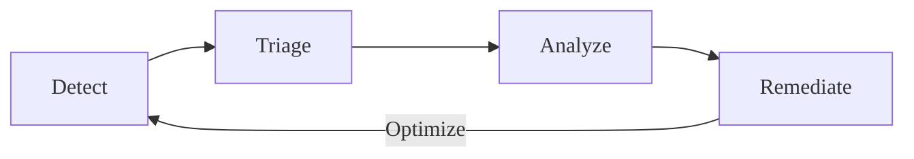



- プラン: Free、Premium、Ultimate
- 提供形態: GitLab.com、GitLab Self-Managed、GitLab Dedicated



GitLabのアプリケーションセキュリティテストは、開発中および変更のデプロイ後も継続的に脆弱性を検出します。

アプリケーションセキュリティテストは、プロジェクトのコードのソースコード、依存関係、ライブラリ、およびコンテナイメージをスキャンします。ランタイムの脆弱性は、テスト環境でデプロイされたアプリケーションに対するシミュレーション攻撃とファズテストによって検出されます。

開発中、スキャンはコードがコミットされたり、マージリクエストが作成されたりすると、CI/CDパイプラインの一部として自動的に実行されます。セキュリティに関する調査結果はマージリクエストとIDEに直接表示され、コードがマージされる前にデベロッパーに通知されます。このプロアクティブなアプローチにより、開発の後工程でイシューを修正するためのコストと労力が削減されます。

開発サイクル以外でも、オンデマンドでセキュリティスキャンを実行したり、定期的に実行するようにスケジュールしたりできます。脆弱性データベースが新たに発見された脅威とゼロデイエクスプロイトで更新されると、プロジェクトのソフトウェアライブラリとコンテナイメージに対する新たなリスクが特定されます。これらの方法を組み合わせることで、元の開発サイクル中に以前は知られていなかったリスクを特定できます。

クリックスルーデモについては、[パイプラインにセキュリティを統合する](https://gitlab.navattic.com/gitlab-scans)を参照してください。
<!-- Demo published on 2024-01-15 -->

## 脆弱性管理サイクル {#vulnerability-management-cycle}

GitLabは、包括的な脆弱性管理ワークフローを可能にし、アプリケーションセキュリティのセキュリティ対策状況を継続的に改善するのに役立ちます。このワークフローは、検出、トリアージ、分析、修正、最適化という継続的なサイクルです。

1. 検出 - 自動化されたセキュリティテストを通じて脆弱性を特定します。
1. トリアージ - 脆弱性を評価および優先順位付けして、緊急の対応が必要なものと、後で対応できるものを判別します。
1. 分析 - 確認済みの脆弱性を詳細に分析して、その影響を理解し、適切な修正戦略を決定します。
1. 脆弱性の根本原因を修正したり、適切なリスク軽減策を実装したりします。

各フェーズの結果を使用して、次のサイクルを改善します。たとえば、分析中に特定された誤検出を減らすために、検出ルールを調整します。

このサイクルはコードが変更されるたびに繰り返され、アプリケーションセキュリティと脆弱性管理プロセスの両方を段階的に改善できます。この継続的な改善により、脆弱性管理は時間の経過とともに、より効果的かつ効率的になります。
