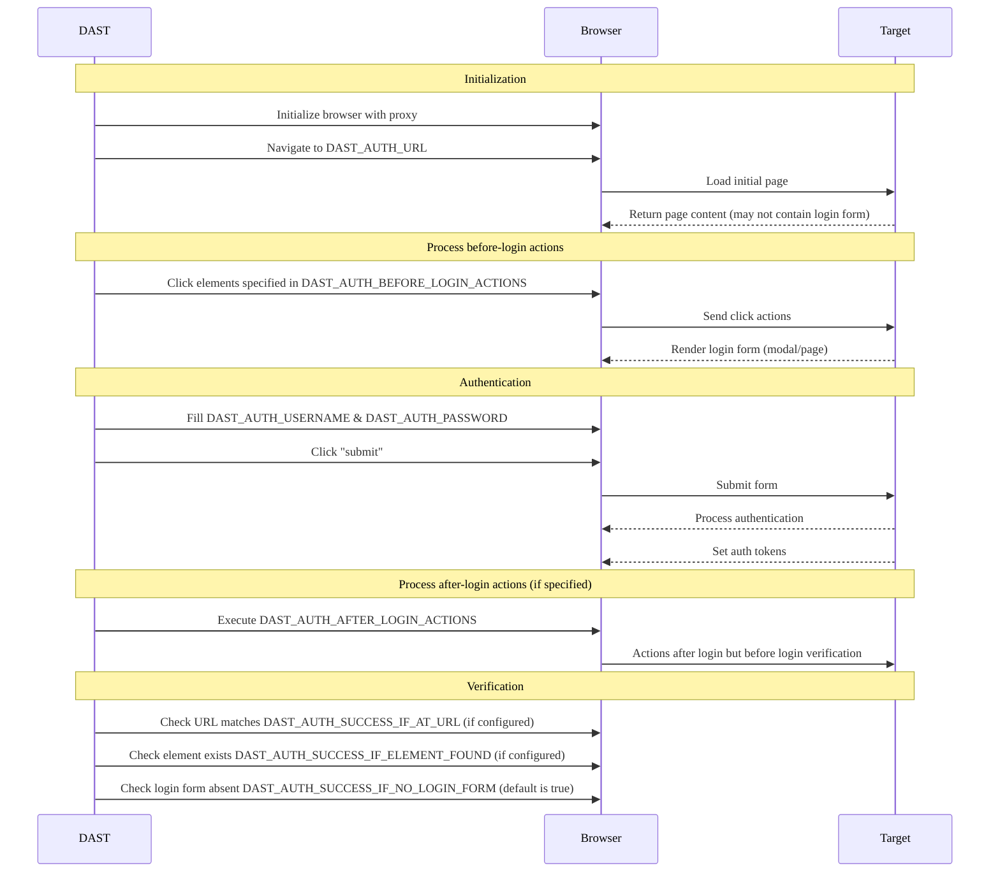

完全にカバレッジを行うには、テスト対象のアプリケーションでDASTアナライザーを認証する必要があります。これには、DAST CI/CDジョブで認証認証情報と認証方式を設定する必要があります。

DASTで認証が必要な理由:

- 実際の攻撃者をシミュレートし、攻撃者が悪用する可能性のある脆弱性を特定するため。
- 認証後にのみ表示される可能性のある、ユーザー固有の機能とカスタム動作をテストするため。

DASTジョブは、ブラウザーでログインフォームに入力して送信することにより、アプリケーションに対して自身を認証します。フォームが送信されると、DASTジョブは、認証が成功したことを確認します。認証に成功した場合、DASTジョブは続行し、ターゲットアプリケーションのクロール時に再利用できるように、認証情報を保存します。そうでない場合、DASTジョブは停止します。

DASTでサポートされている認証方法:

- シングルステップのログインフォーム
- マルチステップのログインフォーム
- 設定されたターゲットURLの外部にあるURLへの認証

認証認証情報を選択する際:

- （運用環境）システム、本番環境サーバー、または本番環境データへのアクセスに使用される認証情報は**DO NOT**（使用しないでください）。
- （本番環境）サーバーに対して認証されたスキャンを実行**DO NOT**（しないでください）。認証されたスキャンは、認証されたユーザーが実行できる**任意**の機能（データの変更や削除、フォームの送信、リンクのクリックなど）を実行する可能性があります。認証されたスキャンは、本番環境以外のシステムまたはサーバーに対してのみ実行してください。
- DASTがアプリケーション全体をテストできるように、認証情報を提供します。
- 将来の参照のために、認証情報の有効期限（もしあれば）をメモしておいてください。たとえば、1Passwordなどのパスワードマネージャーを使用します。

次の図は、認証のさまざまな段階での認証変数の使用法を示しています:



## はじめに {#getting-started}



アプリケーションの変更により、アナライザーの認証が機能しなくなる傾向があるため、定期的にアナライザーの認証がまだ機能していることを確認する必要があります。



DASTの認証済みスキャンを実行するには:

- 認証の[前提](#prerequisites)条件を読んでください。
- 認証済みユーザーのランディングページに[ターゲットWebサイトをアップデートします](#update-the-target-website)。
- ログインフォームのユーザー名、パスワード、および送信ボタンが1つのページにある場合は、[CI/CD変数](#available-cicd-variables)を使用して、[シングルステップ](#configuration-for-a-single-step-login-form)ログインフォーム認証を構成します。
- ログインフォームにユーザー名フィールドとパスワードフィールドが異なるページにある場合は、[CI/CD変数](#available-cicd-variables)を使用して、[マルチステップ](#configuration-for-a-multi-step-login-form)ログインフォーム認証を構成します。
- スキャン中にユーザーが[ログアウト](#excluding-logout-urls)されないようにしてください。

### 前提要件 {#prerequisites}

- スキャン中に認証するユーザーのユーザー名とパスワードが必要です。
- DASTがアプリケーションに対して認証できることを確認するために、[既知の問題](#known-issues)を確認しました。
- [フォーム認証](#form-authentication)を使用している場合は、前提条件を満たしている必要があります。
- フォーム認証フローに[時間ベースのワンタイムパスワード](#totp-authentication)が含まれている場合は、追加の前提条件を満たしている必要があります。
- 認証が成功したかどうかを[確認](#verifying-authentication-is-successful)する方法を検討しました。

#### フォーム認証 {#form-authentication}

- アプリケーションのログインフォームのURLを知っている必要があります。または、認証URLからログインフォームに移動する方法を知っている必要があります（[ログインフォームに移動するためにクリックする](#clicking-to-go-to-the-login-form)を参照）。
- DASTがそれぞれの入力に使用するユーザー名とパスワードのHTMLフィールドの[セレクター](#finding-an-elements-selector)を知っている必要があります。
- 選択時にログインフォームを送信する要素の[セレクター](#finding-an-elements-selector)を知っている必要があります。

#### TOTP {#totp-authentication}



- [導入](https://gitlab.com/groups/gitlab-org/-/epics/13633)されたスキャナーバージョン6.9。



- Base32でエンコードされた、テストユーザーのTOTP登録用のシークレットキーが必要です。
- 認証プロバイダーが、次のTOTP設定（Google Authenticatorと同じ）をサポートしていることを確認済みである必要があります:
  - HMACアルゴリズム: SHA-1
  - タイムステップ: 30秒
  - トークンの長さ: 6
- 生成されたTOTPトークンを入力するためにDASTが使用するTOTPフィールドの[セレクター](#finding-an-elements-selector)を知っている必要があります。
- パスワードとは別にTOTPトークンを送信する場合、TOTPトークンを送信する要素の[セレクター](#finding-an-elements-selector)を知っている必要があります。

### 利用可能なCI/CD変数 {#available-cicd-variables}

DAST認証CI/CD変数のリストについては、[認証変数](variables.md#authentication)を参照してください。

DAST CI/CD変数テーブルは、Rakeタスク`bundle exec rake gitlab:dast_variables:compile_docs`によって生成されます。これは、[`lib/gitlab/security/dast_variables.rb`](https://gitlab.com/gitlab-org/gitlab/-/blob/master/lib/gitlab/security/dast_variables.rb)で定義された変数メタデータを使用します。

### ターゲットWebサイトをアップデートする {#update-the-target-website}

CI/CD変数`DAST_TARGET_URL`を使用して定義されたターゲットWebサイトは、DASTがアプリケーションのクロールを開始するために使用するURLです。

認証されたスキャンで最適なクロール結果を得るには、ターゲットWebサイトは、ユーザーが認証された後にのみアクセスできるURLである必要があります。多くの場合、これはユーザーがログイン後にアクセスするページのURLです。

例: 

```yaml
include:
  - template: DAST.gitlab-ci.yml

dast:
  variables:
    DAST_TARGET_URL: "https://example.com/dashboard/welcome"
    DAST_AUTH_URL: "https://example.com/login"
```

### HTTP認証の設定 {#configuration-for-http-authentication}

基本認証などの[HTTP認証スキーム](https://www.chromium.org/developers/design-documents/http-authentication/)を使用するには、`DAST_AUTH_TYPE`の値を`basic-digest`に設定します。ネゴシエートやNTLMなどの他のスキームも機能する可能性がありますが、自動テストカバレッジが現在不足しているため、公式にはサポートされていません。

構成には、CI/CD変数`DAST_AUTH_TYPE`、`DAST_AUTH_URL`、`DAST_AUTH_USERNAME`、`DAST_AUTH_PASSWORD`がDASTジョブに定義されている必要があります。一意のログインURLがない場合は、`DAST_AUTH_URL`を`DAST_TARGET_URL`と同じURLに設定します。

```yaml
include:
  - template: DAST.gitlab-ci.yml

dast:
  variables:
    DAST_TARGET_URL: "https://example.com"
    DAST_AUTH_TYPE: "basic-digest"
    DAST_AUTH_URL: "https://example.com"
```

`DAST_AUTH_USERNAME`および`DAST_AUTH_PASSWORD`をYAMLジョブ定義ファイルに定義**not**（しないでください）。これは、セキュリティ上のリスクをもたらす可能性があるためです。代わりに、GitLab UIを使用して、マスクされたCI/CD変数として作成します。詳細については、[カスタムCI/CD変数](../../../../../ci/variables/_index.md#for-a-project)を参照してください。

### シングルステップログインフォームの設定 {#configuration-for-a-single-step-login-form}

シングルステップログインフォームには、すべてのログインフォーム要素が1つのページにあります。構成には、CI/CD変数`DAST_AUTH_URL`、`DAST_AUTH_USERNAME`、`DAST_AUTH_USERNAME_FIELD`、`DAST_AUTH_PASSWORD`、`DAST_AUTH_PASSWORD_FIELD`、`DAST_AUTH_SUBMIT_FIELD`がDASTジョブに定義されている必要があります。

たとえば、ジョブ定義YAMLでフィールドのURLとセレクターをセットアップする必要があります:

```yaml
include:
  - template: DAST.gitlab-ci.yml

dast:
  variables:
    DAST_TARGET_URL: "https://example.com"
    DAST_AUTH_URL: "https://example.com/login"
    DAST_AUTH_USERNAME_FIELD: "css:[name=username]"
    DAST_AUTH_PASSWORD_FIELD: "css:[name=password]"
    DAST_AUTH_SUBMIT_FIELD: "css:button[type=submit]"
```

`DAST_AUTH_USERNAME`および`DAST_AUTH_PASSWORD`をYAMLジョブ定義ファイルに定義**not**（しないでください）。これは、セキュリティ上のリスクをもたらす可能性があるためです。代わりに、GitLab UIを使用して、マスクされたCI/CD変数として作成します。詳細については、[カスタムCI/CD変数](../../../../../ci/variables/_index.md#for-a-project)を参照してください。

### マルチステップログインフォームの設定 {#configuration-for-a-multi-step-login-form}

マルチステップログインフォームには、2つのページがあります。最初のページには、ユーザー名と次の送信ボタンがあるフォームがあります。ユーザー名が有効な場合、後続の2番目のフォームにはパスワードとフォーム送信ボタンがあります。

構成では、DASTジョブに対してCI/CD変数を定義する必要があります:

- `DAST_AUTH_URL`
- `DAST_AUTH_USERNAME`
- `DAST_AUTH_USERNAME_FIELD`
- `DAST_AUTH_FIRST_SUBMIT_FIELD`
- `DAST_AUTH_PASSWORD`
- `DAST_AUTH_PASSWORD_FIELD`
- `DAST_AUTH_SUBMIT_FIELD`。

たとえば、ジョブ定義YAMLでフィールドのURLとセレクターをセットアップする必要があります:

```yaml
include:
  - template: DAST.gitlab-ci.yml

dast:
  variables:
    DAST_TARGET_URL: "https://example.com"
    DAST_AUTH_URL: "https://example.com/login"
    DAST_AUTH_USERNAME_FIELD: "css:[name=username]"
    DAST_AUTH_FIRST_SUBMIT_FIELD: "css:button[name=next]"
    DAST_AUTH_PASSWORD_FIELD: "css:[name=password]"
    DAST_AUTH_SUBMIT_FIELD: "css:button[type=submit]"
```

`DAST_AUTH_USERNAME`および`DAST_AUTH_PASSWORD`をYAMLジョブ定義ファイルに定義**not**（しないでください）。これは、セキュリティ上のリスクをもたらす可能性があるためです。代わりに、GitLab UIを使用して、マスクされたCI/CD変数として作成します。詳細については、[カスタムCI/CD変数](../../../../../ci/variables/_index.md#for-a-project)を参照してください。

### 時間ベースのワンタイムパスワード（TOTP）の設定 {#configuration-for-time-based-one-time-password-totp}

TOTPの設定には、次のCI/CD変数をDASTジョブに定義する必要があります:

- `DAST_AUTH_OTP_FIELD`
- `DAST_AUTH_OTP_KEY`

パスワードの送信後にTOTPトークンが独自のフォームで送信される場合は、次の変数も定義する必要があります:

- `DAST_AUTH_OTP_SUBMIT_FIELD`

`_FIELD`セレクター変数は、ジョブ定義YAMLで定義できます（例:

```yaml
include:
  - template: DAST.gitlab-ci.yml

dast:
  variables:
    DAST_TARGET_URL: "https://example.com"
    DAST_AUTH_URL: "https://example.com/login"
    DAST_AUTH_USERNAME_FIELD: "css:[name=username]"
    DAST_AUTH_PASSWORD_FIELD: "css:[name=password]"
    DAST_AUTH_SUBMIT_FIELD: "css:button[type=submit]"
    DAST_AUTH_OTP_FIELD: "name:otp"
    DAST_AUTH_OTP_SUBMIT_FIELD: "css:input[type=submit]"
```

`DAST_AUTH_OTP_KEY`をYAMLジョブ定義ファイルに定義**not**（しないでください）。これは、セキュリティ上のリスクをもたらす可能性があるためです。代わりに、GitLab UIを使用して、マスクされたCI/CD変数として作成します。詳細については、[カスタムCI/CD変数](../../../../../ci/variables/_index.md#for-a-project)を参照してください。

### シングルサインオン（SSO）の設定 {#configuration-for-single-sign-on-sso}

ユーザーがアプリケーションにサインインできる場合、ほとんどの場合、DASTもサインインできます。アプリケーションがシングルサインオンを使用している場合でも同様です。SSOソリューションを使用するアプリケーションでは、[シングルステップ](#configuration-for-a-single-step-login-form)または[マルチステップ](#configuration-for-a-multi-step-login-form)ログインフォーム設定ガイドを使用してDAST認証を設定する必要があります。

DASTは、ユーザーが外部のIdentity Providerのサイトにリダイレクトされてサインインする認証プロセスをサポートしています。お使いのSSO認証プロセスがサポートされているかどうかを確認するには、DAST認証の[既知の問題](#known-issues)を確認してください。

### Windows統合認証（Kerberos）の設定 {#configuration-for-windows-integrated-authentication-kerberos}

Windows統合認証（Kerberos）は、Windowsドメイン内でホストされている基幹業務（LOB）アプリケーションの一般的な認証メカニズムです。ユーザーのコンピューターログインを使用して、プロンプトなしの認証を提供します。

この形式の認証を構成するには、次の手順を実行します:

1. IT/運用チームの支援を受けて、必要な情報を収集します。
1. `.gitlab-ci.yml`ファイルで`dast`ジョブ定義を作成またはアップデートします。
1. 収集した情報を使用して、サンプルの`krb5.conf`ファイルを入力された状態にします。
1. 必要なジョブ変数を設定します。
1. プロジェクトの**設定**ページを使用して、必要なシークレット変数を設定します。
1. テストし、認証が機能していることを確認します。

IT/運用部門からの支援を得て、次の情報を収集します:

- WindowsドメインまたはKerberosレルムの名前（`EXAMPLE.COM`のように、名前にピリオドが含まれている必要があります）
- Windows/Kerberosドメインコントローラーのホスト名
- Kerberosの場合、AuthNサーバー名。Windowsドメインの場合、これはドメインコントローラーです。

`krb5.conf`ファイルを作成する:

```ini
[libdefaults]
  # Realm is another name for domain name
  default_realm = EXAMPLE.COM
  # These settings are not needed for Windows Domains
  # they support other Kerberos implementations
  kdc_timesync = 1
  ccache_type = 4
  forwardable = true
  proxiable = true
  rdns = false
  fcc-mit-ticketflags = true
[realms]
  EXAMPLE.COM = {
    # Domain controller or KDC
    kdc = kdc.example.com
    # Domain controller or admin server
    admin_server = kdc.example.com
  }
[domain_realm]
  # Mapping DNS domains to realms/Windows domain
  # DNS domains provided by DAST_AUTH_NEGOTIATE_DELEGATION
  # should also be represented here (but without the wildcard)
  .example.com = EXAMPLE.COM
  example.com = EXAMPLE.COM
```

この設定では、`DAST_AUTH_NEGOTIATE_DELEGATION`変数を使用します。この変数は、統合認証を許可するために必要な次のChromiumポリシーを設定します:

- [AuthServerAllowlist](https://chromeenterprise.google/policies/#AuthServerAllowlist)
- [AuthNegotiateDelegateAllowlist](https://chromeenterprise.google/policies/#AuthNegotiateDelegateAllowlist)

この変数の設定は、WindowsドメインまたはKerberosレルムに関連付けられているDNSドメインです。それらを指定する必要があります:

- 小文字と大文字の両方で。
- ワイルドカードパターンとドメイン名のみを使用します。

この例では、Windowsドメインは`EXAMPLE.COM`で、DNSドメインは`example.com`です。これにより、`DAST_AUTH_NEGOTIATE_DELEGATION`の値は`*.example.com,example.com,*.EXAMPLE.COM,EXAMPLE.COM`になります。

すべてをまとめてジョブ定義にまとめます:

```yaml
# This job will extend the dast job defined in
# the DAST template which must also be included.
dast:
  image:
    name: "$SECURE_ANALYZERS_PREFIX/dast:$DAST_VERSION$DAST_IMAGE_SUFFIX"
    docker:
      user: root
  variables:
    DAST_TARGET_URL: https://target.example.com
    DAST_AUTH_URL: https://target.example.com
    DAST_AUTH_TYPE: basic-digest
    DAST_AUTH_NEGOTIATE_DELEGATION: '*.example.com,example.com,*.EXAMPLE.COM,EXAMPLE.COM'
    # Not shown -- DAST_AUTH_USERNAME, DAST_AUTH_PASSWORD set via Settings -> CI -> Variables
  before_script:
    - KRB5_CONF='
[libdefaults]
  default_realm = EXAMPLE.COM
  kdc_timesync = 1
  ccache_type = 4
  forwardable = true
  proxiable = true
  rdns = false
  fcc-mit-ticketflags = true
[realms]
  EXAMPLE.COM = {
    kdc = ad1.example.com
    admin_server = ad1.example.com
  }
[domain_realm]
  .example.com = EXAMPLE.COM
  example.com = EXAMPLE.COM
'
    - cat "$KRB5_CONF" > /etc/krb5.conf
    - echo '$DAST_AUTH_PASSWORD' | kinit $DAST_AUTH_USERNAME
    - klist
```

期待される出力:

ジョブコンソール出力には、`before`スクリプトからの出力が含まれています。認証に成功した場合、次のようになります。ジョブは、スキャンを実行せずに失敗した場合に失敗します。

```plaintext
Password for mike@EXAMPLE.COM:
Ticket cache: FILE:/tmp/krb5cc_1000
Default principal: mike@EXAMPLE.COM

Valid starting       Expires              Service principal
11/11/2024 21:50:50  11/12/2024 07:50:50  krbtgt/EXAMPLE.COM@EXAMPLE.COM
        renew until 11/12/2024 21:50:50
```

DASTスキャナーは、成功を示す次の出力も出力します:

```plaintext
2024-11-08T17:03:09.226 INF AUTH  attempting to authenticate find_auth_fields="basic-digest"
2024-11-08T17:03:09.226 INF AUTH  loading login page LoginURL="https://target.example.com"
2024-11-08T17:03:10.619 INF AUTH  verifying if login attempt was successful true_when="HTTP status code < 400 and has authentication token and no login form found (auto-detected)"
2024-11-08T17:03:10.619 INF AUTH  requirement is satisfied, HTTP login request returned status code 200 want="HTTP status code < 400" url="https://target.example.com/"
2024-11-08T17:03:10.623 INF AUTH  requirement is satisfied, did not detect a login form want="no login form found (auto-detected)"
2024-11-08T17:03:10.623 INF AUTH  authentication token cookies names=""
2024-11-08T17:03:10.623 INF AUTH  authentication token storage events keys=""
2024-11-08T17:03:10.623 INF AUTH  requirement is satisfied, basic authentication detected want="has authentication token"
2024-11-08T17:03:11.230 INF AUTH  login attempt succeeded
```

### ログインフォームに移動するためにクリックする {#clicking-to-go-to-the-login-form}

DASTがログインフォームにアクセスできるように、`DAST_AUTH_URL`からクリックする要素のパスを提供するように`DAST_AUTH_BEFORE_LOGIN_ACTIONS`を定義します。この方法は、ポップアップ（モーダル）ウィンドウでログインフォームを表示するアプリケーションや、ログインフォームに一意のURLがない場合に適しています。

例: 

```yaml
include:
  - template: DAST.gitlab-ci.yml

dast:
  variables:
    DAST_TARGET_URL: "https://example.com"
    DAST_AUTH_URL: "https://example.com/login"
    DAST_AUTH_BEFORE_LOGIN_ACTIONS: "css:.navigation-menu,css:.login-menu-item"
```

### ログインフォームの送信後に追加のアクションを実行する {#taking-additional-actions-after-submitting-the-login-form}

サインインフォームの送信後、検証前、認証の詳細が記録されるときに実行するアクションのシーケンスを提供するように`DAST_AUTH_AFTER_LOGIN_ACTIONS`を定義します。これは、「サインインしたままにする」ダイアログを過ぎて進むために使用できます。

| アクション                           | 形式                      |
|----------------------------------|-----------------------------|
| 要素をクリックします              | `click(on=<selector>)`      |
| ドロップダウンからオプションを選択します | `select(option=<selector>)` |

アクションはコンマで区切られます。セレクターの詳細については、[要素のセレクターを見つける](#finding-an-elements-selector)を参照してください。

例: 

```yaml
include:
  - template: DAST.gitlab-ci.yml

dast:
  variables:
    DAST_TARGET_URL: "https://example.com"
    DAST_AUTH_URL: "https://example.com/login"
    DAST_AUTH_AFTER_LOGIN_ACTIONS: "select(option=id:accept-yes),click(on=id:continue-button)"
```

### ログアウトURLの除外 {#excluding-logout-urls}

認証されたスキャンの実行中にDASTがログアウトURLをクロールすると、ユーザーはログアウトされ、スキャンの残りの部分が認証されなくなります。したがって、CI/CD変数`DAST_SCOPE_EXCLUDE_URLS`を使用してログアウトURLを除外することをお勧めします。DASTは除外されたURLにアクセスしないため、ユーザーはログインしたままになります。

指定されたURLは、絶対URL、または`DAST_TARGET_URL`のベースパスに対するURLパスの正規表現にすることができます。例: 

```yaml
include:
  - template: DAST.gitlab-ci.yml

dast:
  variables:
    DAST_TARGET_URL: "https://example.com/welcome/home"
    DAST_SCOPE_EXCLUDE_URLS: "https://example.com/logout,/user/.*/logout"
```

### 要素のセレクターを見つける {#finding-an-elements-selector}

セレクターは、ブラウザーのページに表示される要素の場所を指定するために、CI/CD変数によって使用されます。セレクターの形式は、`type`:`search string`です。DASTは、タイプに基づいて検索文字列を使用してセレクターを検索します。

| セレクタータイプ | 例                            | 説明                                                                                                                                                                                           |
|---------------|------------------------------------|-------------------------------------------------------------------------------------------------------------------------------------------------------------------------------------------------------|
| `css`         | `css:.password-field`              | 提供されたCSSセレクターを持つHTML要素を検索します。セレクターは、パフォーマンス上の理由から、できる限り具体的にする必要があります。                                                                    |
| `id`          | `id:element`                       | 指定された要素IDを持つHTML要素を検索します。                                                                                                                                            |
| `name`        | `name:element`                     | 指定された要素名を持つHTML要素を検索します。                                                                                                                                          |
| `xpath`       | `xpath://input[@id="my-button"]/a` | 指定されたXPathを持つHTML要素を検索します。XPath検索は、他の検索よりもパフォーマンスが低いと予想されます。                                                                           |

#### Google Chromeでセレクターを見つける {#find-selectors-with-google-chrome}

Chrome DevTools要素セレクターツールは、セレクターを見つける効果的な方法です。

1. Chromeを開き、セレクターを見つけたいページ（たとえば、サイトのログインページ）に移動します。
1. Chrome DevToolsの`Elements`タブを、macOSではキーボードショートカット<kbd>Command</kbd>+<kbd>Shift</kbd>+<kbd>C</kbd>、WindowsまたはLinuxでは<kbd>Control</kbd>+<kbd>Shift</kbd>+<kbd>C</kbd>で開きます。
1. `Select an element in the page to select it`ツールを選択します。
1. セレクターを知りたいページ上のフィールドを選択します。
1. ツールがアクティブになったら、詳細を表示したいフィールドをハイライトします。
1. ハイライト表示されると、セレクターの適切な候補となる属性など、要素の詳細を確認できます。

この例では、`id="user_login"`が良い候補と思われます。`DAST_AUTH_USERNAME_FIELD: "id:user_login"`を設定することで、これをDASTのユーザー名フィールドとしてセレクターとして使用できます。

#### 適切なselectorを選択してください {#choose-the-right-selector}

セレクターを適切に選択すると、アプリケーションの変更に強いスキャンになります。

優先順位に従って、セレクターとして次を選択する必要があります:

- `id`フィールドこれらのフィールドは通常、ページ上で一意であり、めったに変更されません。
- `name`フィールドこれらのフィールドは通常、ページ上で一意であり、めったに変更されません。
- フィールドに固有の`class`値。たとえば、ユーザー名フィールドの`username`クラスの`"css:.username"`などのselectorです。
- フィールド固有のデータ属性の存在。たとえば、ユーザー名フィールドに`data-username`フィールドに値がある場合の`"css:[data-username]"`などのselectorです。
- 複数の`class`階層値。たとえば、クラス`username`を持つ要素が複数あるが、クラス`login-form`を持つ要素内にネストされた要素が1つしかない場合の`"css:.login-form .username"`などのselectorです。

特定のフィールドを特定するためにセレクターを使用する場合は、次の検索は避けてください:

- 動的に生成される`id`、`name`、`attribute`、`class`、または`value`。
- `column-10`や`dark-grey`などの一般的なクラス名。
- XPath検索は、他のselector検索よりもパフォーマンスが低いためです。
- `css:*`や`xpath://*`で始まる検索などの、スコープ外検索。

## 認証が成功したかの検証 {#verifying-authentication-is-successful}

DASTがログインフォームを送信した後、認証が成功したかどうかを判断するための検証プロセスが実行されます。認証が成功しなかった場合、スキャンはエラーで停止します。

ログインフォームの送信後、次の場合に認証が失敗したと判断されます:

- ログイン送信HTTPレスポンスのステータスコードが`400`または`500`シリーズである。
- いずれかの[検証チェック](#verification-checks)が失敗する。
- 十分なランダム値を持つ[認証トークン](#authentication-tokens)が、認証プロセス中に設定されていません。

### 検証チェック {#verification-checks}

検証チェックは、認証が完了するとブラウザーの状態に対してチェックを実行し、認証が成功したかどうかをさらに判断します。

検証チェックが設定されていない場合、DASTはログインフォームがないかどうかをテストします。

#### URLに基づいて検証 {#verify-based-on-the-url}

`DAST_AUTH_SUCCESS_IF_AT_URL`を、ログインフォームが正常に送信された後にブラウザータブに表示されるURLとして定義します。

DASTは、検証URLを認証後のブラウザーのURLと比較します。同じでない場合、認証は失敗します。

例: 

```yaml
include:
  - template: DAST.gitlab-ci.yml

dast:
  variables:
    DAST_TARGET_URL: "https://example.com"
    DAST_AUTH_SUCCESS_IF_AT_URL: "https://example.com/user/welcome"
```

#### 要素の有無に基づいて検証 {#verify-based-on-presence-of-an-element}

`DAST_AUTH_SUCCESS_IF_ELEMENT_FOUND`を、ログインフォームが正常に送信された後に表示されるページ上の1つまたは複数の要素を検索する[selector](#finding-an-elements-selector)として定義します。要素が見つからない場合、認証は失敗します。ログインが失敗した場合に表示されるページでselectorを検索すると、要素は返されません。

例: 

```yaml
include:
  - template: DAST.gitlab-ci.yml

dast:
  variables:
    DAST_TARGET_URL: "https://example.com"
    DAST_AUTH_SUCCESS_IF_ELEMENT_FOUND: "css:.welcome-user"
```

#### ログインフォームがないことに基づいて検証 {#verify-based-on-absence-of-a-login-form}

`DAST_AUTH_SUCCESS_IF_NO_LOGIN_FORM`を`"true"`として定義し、ログインフォームが正常に送信された後に表示されるページで、DASTがログインフォームを検索するように指示します。ログイン後もログインフォームが表示されている場合、認証は失敗します。

例: 

```yaml
include:
  - template: DAST.gitlab-ci.yml

dast:
  variables:
    DAST_TARGET_URL: "https://example.com"
    DAST_AUTH_SUCCESS_IF_NO_LOGIN_FORM: "true"
```

### 認証トークン {#authentication-tokens}

DASTは、認証プロセス中に設定された認証トークンを記録します。認証トークンは、DASTが新しいブラウザーを開くときに読み込まれるため、スキャン全体を通して認証済みユーザーはログイン状態を維持できます。

トークンを記録するために、DASTは認証プロセス前にアプリケーションによって設定されたcookie、ローカルストレージ、およびセッションストレージの値のスナップショットを作成します。DASTは、認証後にも同じ操作を行い、その差を使用して、認証プロセスによって作成されたものを判断します。

DASTは、十分に「ランダム」な値で設定されたcookie、ローカルストレージ、およびセッションストレージの値を認証トークンと見なします。たとえば、`sessionID=HVxzpS8GzMlPAc2e39uyIVzwACIuGe0H`は認証トークンと見なされますが、`ab_testing_group=A1`は見なされません。

CI/CD変数`DAST_AUTH_COOKIE_NAMES`を使用して、認証cookieの名前を指定し、DASTで使用されるランダム性チェックを回避することができます。これにより、認証プロセスがより堅牢になるだけでなく、認証トークンを検査するチェックの脆弱性チェックの精度も向上します。

例: 

```yaml
include:
  - template: DAST.gitlab-ci.yml

dast:
  variables:
    DAST_TARGET_URL: "https://example.com"
    DAST_AUTH_COOKIE_NAMES: "sessionID,refreshToken"
```

## 既知の問題 {#known-issues}

- 認証フローにCAPTCHAが含まれている場合、DASTはCAPTCHAを回避できません。スキャン対象のアプリケーションのテスト環境で、設定されたユーザーに対してこれらをオフにします。
- DASTは、SMSまたはバイオメトリクスを使用して、ワンタイムパスワード（OTP）で認証できません。スキャン対象のアプリケーションのテスト環境で、設定されたユーザーに対してこれらをオフにするか、ユーザーのMFAのタイプをTOTPに変更します。
- ログイン時に[認証トークン](#authentication-tokens)を設定しないアプリケーションには、DASTは認証できません。
- DASTは、ユーザー名、パスワード、およびオプションのTOTPよりも多くのテキスト入力を必要とするアプリケーションには認証できません。

## トラブルシューティング {#troubleshooting}

[ログ](#read-the-logs)は、認証プロセス中にDASTが何を行い、何を期待しているかについてのインサイトを提供します。詳細については、[認証レポート](#configure-the-authentication-report)を設定します。

特定のエラーメッセージまたは状況の詳細については、[既知の問題](#known-problems)を参照してください。

ブラウザーベースのアナライザーは、ユーザーを認証するために使用されます。高度なトラブルシューティングについては、[ブラウザベースのトラブルシューティング](../troubleshooting.md)を参照してください。

### ログを読む {#read-the-logs}

DAST CI/CDジョブのコンソール出力は、`AUTH`ログモジュールを使用して、認証プロセスに関する情報を示します。たとえば、次のログは、複数ステップのログインフォームの認証が失敗したことを示しています。認証が失敗したのは、ログイン後にホームページが表示されるはずだったためです。代わりに、ログインフォームがまだ表示されていました。

```plaintext
2022-11-16T13:43:02.000 INF AUTH  attempting to authenticate
2022-11-16T13:43:02.000 INF AUTH  loading login page LoginURL=https://example.com/login
2022-11-16T13:43:10.000 INF AUTH  multi-step authentication detected
2022-11-16T13:43:15.000 INF AUTH  verifying if user submit was successful true_when="HTTP status code < 400"
2022-11-16T13:43:15.000 INF AUTH  requirement is satisfied, no login HTTP message detected want="HTTP status code < 400"
2022-11-16T13:43:20.000 INF AUTH  verifying if login attempt was successful true_when="HTTP status code < 400 and has authentication token and no login form found (no element found when searching using selector css:[id=email] or css:[id=password] or css:[id=submit])"
2022-11-24T14:43:20.000 INF AUTH  requirement is satisfied, HTTP login request returned status code 200 url=https://example.com/user/login?error=invalid%20credentials want="HTTP status code < 400"
2022-11-16T13:43:21.000 INF AUTH  requirement is unsatisfied, login form was found want="no login form found (no element found when searching using selector css:[id=email] or css:[id=password] or css:[id=submit])"
2022-11-16T13:43:21.000 INF AUTH  login attempt failed error="authentication failed: failed to authenticate user"
```

### 認証レポートを設定する {#configure-the-authentication-report}



認証レポートには、ログインの実行に使用される認証情報などの機密情報が含まれる場合があります。



認証レポートは、認証の失敗の原因を理解するために役立つCI/CDジョブアーティファクトとして保存できます。

レポートには、ログインプロセス中に実行された手順、HTTPリクエストと応答、Document Object Model（DOM）とスクリーンショットが含まれています。


認証デバッグレポートがエクスポートされるサンプル設定は、次のようになります:

```yaml
dast:
  variables:
    DAST_TARGET_URL: "https://example.com"
    DAST_AUTH_REPORT: "true"
```

### 既知の問題 {#known-problems}

#### ログインフォームが見つかりません {#login-form-not-found}

DASTは、ログインページを読み込むときにログインフォームを見つけることができませんでした。これは、認証URLを読み込むことができなかったことが原因であることがよくあります。ログには、次のような重大なエラーがレポートされます:

```plaintext
2022-12-07T12:44:02.838 INF AUTH  loading login page LoginURL=[authentication URL]
2022-12-07T12:44:11.119 FTL MAIN  authentication failed: login form not found
```

推奨されるアクション:

- HTTP応答を検査するには、[認証レポート](#configure-the-authentication-report)を生成します。
- ターゲットアプリケーションの認証がデプロイされ、実行されていることを確認します。
- `DAST_AUTH_URL`が正しいことを確認します。
- GitLab Runnerが`DAST_AUTH_URL`にアクセスできることを確認します。
- 使用されている場合、`DAST_AUTH_BEFORE_LOGIN_ACTIONS`が有効であることを確認します。

#### スキャンが認証済みユーザーのページをクロールしない {#scan-doesnt-crawl-authenticated-pages}

DASTが認証プロセス中に誤った[認証トークン](#authentication-tokens)を取得した場合、スキャンは認証済みユーザーのページをクロールできません。Cookieとストレージの認証トークンの名前がログに書き込まれます。例: 

```plaintext
2022-11-24T14:42:31.492 INF AUTH  authentication token cookies names=["sessionID"]
2022-11-24T14:42:31.492 INF AUTH  authentication token storage events keys=["token"]
```

推奨されるアクション:

- [認証レポート](#configure-the-authentication-report)を生成し、`Login submit`のスクリーンショットを見て、ログインが期待どおりに機能したことを確認します。
- ログに記録された認証トークンが、アプリケーションで使用されているものであることを確認します。
- cookieを使用して認証トークンを保存する場合は、`DAST_AUTH_COOKIE_NAMES`を使用して認証トークンcookieの名前を設定します。

#### selectorで要素が見つかりません {#unable-to-find-elements-with-selector}

DASTは、ユーザー名、パスワード、最初の送信ボタン、または送信ボタン要素を見つけることができませんでした。ログには、次のような重大なエラーがレポートされます:

```plaintext
2022-12-07T13:14:11.545 FTL MAIN  authentication failed: unable to find elements with selector: css:#username
```

推奨されるアクション:

- [認証レポート](#configure-the-authentication-report)を生成して、`Login page`のスクリーンショットを使用して、ページが正しく読み込まれたことを確認します。
- ブラウザーでログインページを読み込み、`DAST_AUTH_USERNAME_FIELD`、`DAST_AUTH_PASSWORD_FIELD`、`DAST_AUTH_FIRST_SUBMIT_FIELD`、および`DAST_AUTH_SUBMIT_FIELD`で設定された[selector](#finding-an-elements-selector)が正しいことを確認します。

#### ユーザーの認証に失敗しました {#failed-to-authenticate-user}

認証検証チェックが失敗したため、DASTは認証に失敗しました。ログには、次のような重大なエラーがレポートされます:

```plaintext
2022-12-07T06:39:49.483 INF AUTH  verifying if login attempt was successful true_when="HTTP status code < 400 and has authentication token and no login form found (no element found when searching using selector css:[name=username] or css:[name=password] or css:button[type=\"submit\"])"
2022-12-07T06:39:49.484 INF AUTH  requirement is satisfied, HTTP login request returned status code 303 url=http://auth-manual:8090/login want="HTTP status code < 400"
2022-12-07T06:39:49.513 INF AUTH  requirement is unsatisfied, login form was found want="no login form found (no element found when searching using selector css:[name=username] or css:[name=password] or css:button[type=\"submit\"])"
2022-12-07T06:39:49.589 INF AUTH  login attempt failed error="authentication failed: failed to authenticate user"
2022-12-07T06:39:53.626 FTL MAIN  authentication failed: failed to authenticate user
```

推奨されるアクション:

- ログで`requirement is unsatisfied`を探します。適切なエラーに応答します。

#### 要件が満たされていません。ログインフォームが見つかりました {#requirement-unsatisfied-login-form-was-found}

アプリケーションは通常、ユーザーがログインするとダッシュボードを表示し、ユーザー名またはパスワードが正しくない場合、エラーメッセージとともにログインフォームを表示します。

このエラーは、DASTがユーザーを認証した後に表示されるページでログインフォームを検出した場合に発生し、ログイン試行が失敗したことを示します。

```plaintext
2022-12-07T06:39:49.513 INF AUTH  requirement is unsatisfied, login form was found want="no login form found (no element found when searching using selector css:[name=username] or css:[name=password] or css:button[type=\"submit\"])"
```

推奨されるアクション:

- 使用されるユーザー名とパスワード/認証情報が正しいことを確認します。
- [認証レポート](#configure-the-authentication-report)を生成し、`Login submit`の`Request`が正しいことを確認します。
- 認証レポート`Login submit`リクエストと応答が空である可能性があります。これは、HTMLフォームの送信時など、ページ全体の再読み込みにつながるリクエストがない場合に発生します。これは、websocketsまたはAJAXを使用してログインフォームを送信する場合に発生します。
- 認証済みユーザーの後に表示されるページに、ログインフォームのselectorに一致する要素が実際に含まれている場合は、`DAST_AUTH_SUCCESS_IF_AT_URL`または`DAST_AUTH_SUCCESS_IF_ELEMENT_FOUND`を設定して、ログイン試行を検証する代替メソッドを使用します。

#### 要件が満たされていません。selectorが結果を返しませんでした {#requirement-unsatisfied-selector-returned-no-results}

DASTは、ユーザーログイン後に表示されるページの`DAST_AUTH_SUCCESS_IF_ELEMENT_FOUND`で提供されているselectorに一致する要素を見つけることができません。

```plaintext
2022-12-07T06:39:33.239 INF AUTH  requirement is unsatisfied, searching DOM using selector returned no results want="has element css:[name=welcome]"
```

推奨されるアクション:

- [認証レポート](#configure-the-authentication-report)を生成し、`Login submit`のスクリーンショットを見て、期待されるページが表示されることを確認します。
- `DAST_AUTH_SUCCESS_IF_ELEMENT_FOUND`[selector](#finding-an-elements-selector)が正しいことを確認してください。

#### 要件が満たされていません。ブラウザーがURLにありません {#requirement-unsatisfied-browser-not-at-url}

DASTは、ユーザーログイン後に表示されるページに、`DAST_AUTH_SUCCESS_IF_AT_URL`に従って予想されるものとは異なるURLがあることを検出しました。

```plaintext
2022-12-07T11:28:00.241 INF AUTH  requirement is unsatisfied, browser is not at URL browser_url="https://example.com/home" want="is at url https://example.com/user/dashboard"
```

推奨されるアクション:

- [認証レポート](#configure-the-authentication-report)を生成し、`Login submit`のスクリーンショットを見て、期待されるページが表示されることを確認します。
- `DAST_AUTH_SUCCESS_IF_AT_URL`が正しいことを確認します。

#### 要件が満たされていません。HTTPログインリクエストステータスコード {#requirement-unsatisfied-http-login-request-status-code}

ログインフォームを読み込むとき、またはフォームを送信するときのHTTP応答のステータスコードは、400（クライアントエラー）または500（サーバーエラー）でした。

```plaintext
2022-12-07T06:39:53.626 INF AUTH  requirement is unsatisfied, HTTP login request returned status code 502 url="https://example.com/user/login" want="HTTP status code < 400"
```

- 使用されるユーザー名とパスワード/認証情報が正しいことを確認します。
- [認証レポート](#configure-the-authentication-report)を生成し、`Login submit`の`Request`が正しいことを確認します。
- ターゲットアプリケーションが期待どおりに機能することを確認します。

#### 要件が満たされていません。認証トークンがありません {#requirement-unsatisfied-no-authentication-token}

DASTは、認証プロセス中に作成された[認証トークン](#authentication-tokens)を検出できませんでした。

```plaintext
2022-12-07T11:25:29.010 INF AUTH  authentication token cookies names=[]
2022-12-07T11:25:29.010 INF AUTH  authentication token storage events keys=[]
2022-12-07T11:25:29.010 INF AUTH  requirement is unsatisfied, no basic authentication, cookie or storage event authentication token detected want="has authentication token"
```

提案アクション:

- [認証レポート](#configure-the-authentication-report)を生成し、`Login submit`のスクリーンショットを見て、ログインが期待どおりに機能したことを確認します。
- ブラウザーの開発者ツールを使用して、ログイン中に作成されたcookieとローカル/セッションストレージオブジェクトを調査します。十分にランダムな値で作成された認証トークンがあることを確認します。
- cookieを使用して認証トークンを保存する場合は、`DAST_AUTH_COOKIE_NAMES`を使用して認証トークンcookieの名前を設定します。
