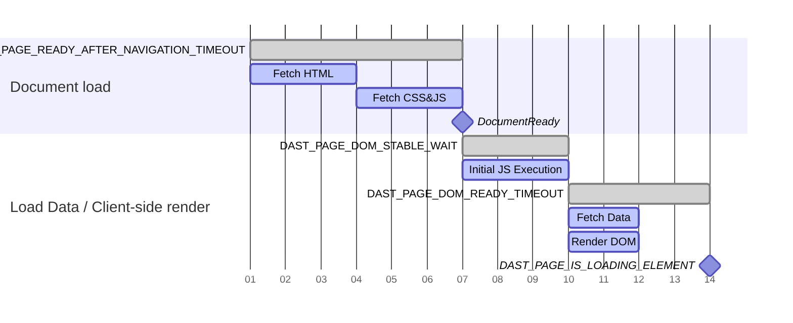

## スコープの管理 {#managing-scope}

スコープは、DASTがターゲットアプリケーションのクローラー時に追跡するURLを制御します。適切に管理されたスコープは、スキャンの実行時間を最小限に抑え、ターゲットアプリケーションのみが脆弱性についてチェックされるようにします。

### スコープの種類 {#types-of-scope}

スコープには、次の3つの種類があります:

- スコープ内
- スコープ外
- スコープから除外

#### スコープ内 {#in-scope}

DASTは、スコープ内のURLを追跡し、クローラーを続行するために実行する後続のアクションについてDOMを検索します。記録されたスコープ内のHTTPメッセージは、脆弱性について受動的にチェックされ、フルスキャンの実行時に攻撃を構築するために使用されます。

#### スコープ外 {#out-of-scope}

DASTは、画像、スタイルシート、フォント、スクリプト、またはAJAXリクエストなど、ドキュメント以外のコンテンツタイプのスコープ外のURLを追跡します。[認証](#scope-works-differently-during-authentication)は別として、DASTは、外部Webサイトへのリンクをクリックしたときなど、ページ全体の読み込みのためにスコープ外のURLを追跡しません。情報漏えいを検索するパッシブチェックを除き、スコープ外のURLに対して記録されたHTTPメッセージは、脆弱性についてチェックされません。

#### スコープから除外 {#excluded-from-scope}

DASTは、スコープから除外されたURLを追跡しません。情報漏えいを検索するパッシブチェックを除き、スコープから除外されたURLに対して記録されたHTTPメッセージは、脆弱性についてチェックされません。

### 認証中のスコープの動作の違い {#scope-works-differently-during-authentication}

多くのターゲットアプリケーションには、シングルサインオン（SSO）の識別子アクセス管理プロバイダーを使用する場合など、外部Webサイトに依存する認証プロセスがあります。DASTがこれらのプロバイダーで認証できるようにするために、DASTは認証中にページ全体の読み込みのためにスコープ外のURLを追跡します。DASTは、スコープから除外されたURLを追跡しません。

### DASTがHTTPリクエストをブロックする方法 {#how-dast-blocks-http-requests}

DASTは、スコープルールが原因でリクエストをブロックするときに、通常どおりHTTPリクエストを行うようにブラウザに指示します。リクエストはその後、`BlockedByClient`という理由でインターセプトされ、拒否されます。このアプローチにより、DASTはHTTPリクエストがターゲットサーバーに到達しないようにしながら、HTTPリクエストを記録できます。[200.1](../checks/200.1.md)などのパッシブチェックは、これらの記録されたリクエストを使用して、外部ホストに送信された情報を検証します。

### スコープを構成する方法 {#how-to-configure-scope}

デフォルトでは、ターゲットアプリケーションのホストに一致するURLは、スコープ内と見なされます。他のすべてのホストはスコープ外と見なされます。

スコープは、次の変数を使用して構成されます:

- `DAST_SCOPE_ALLOW_HOSTS`を使用して、スコープ内のホストを追加します。
- `DAST_SCOPE_IGNORE_HOSTS`を使用して、スコープ外のホストに追加します。
- `DAST_SCOPE_EXCLUDE_HOSTS`を使用して、スコープから除外されたホストに追加します。
- `DAST_SCOPE_EXCLUDE_URLS`を使用して、スコープから除外する特定のURLを設定します。

ルール:

- ホストの除外はホストの無視よりも優先され、ホストの許可よりも優先されます。
- ホストのスコープを構成しても、そのホストのサブドメインのスコープは構成されません。
- ホストのスコープを構成しても、そのホスト上のすべてのポートのスコープは構成されません。

以下は、一般的な構成です:

```yaml
include:
  - template: DAST.gitlab-ci.yml

dast:
  variables:
    DAST_TARGET_URL: "https://my.site.com"                   # my.site.com URLs are considered in-scope by default
    DAST_SCOPE_ALLOW_HOSTS: "api.site.com:8443"       # include the API as part of the scan
    DAST_SCOPE_IGNORE_HOSTS: "analytics.site.com"      # explicitly disregard analytics from the scan
    DAST_SCOPE_EXCLUDE_HOSTS: "ads.site.com"           # don't visit any URLs on the ads subdomain
    DAST_SCOPE_EXCLUDE_URLS: "https://my.site.com/user/logout"  # don't visit this URL
```

## 脆弱性の検出 {#vulnerability-detection}

DASTは、包括的な[ブラウザベースの脆弱性チェック](../checks/_index.md)を通じて脆弱性を検出します。これらのチェックは、スキャン中にWebアプリケーションのセキュリティ上のイシューを識別子します。

クローラーは、プロキシサーバーとして構成されたDASTを使用して、ブラウザでターゲットWebサイトを実行します。これにより、ブラウザによって行われたすべてのリクエストとレスポンスがDASTによって受動的にスキャンされるようになります。フルスキャンを実行する場合、DASTによって実行されるアクティブな脆弱性チェックではブラウザは使用されません。脆弱性のチェック方法のこの違いにより、スキャンが意図したとおりに機能するように、ターゲットWebサイトの特定の機能を無効にする必要が生じるイシューが発生する可能性があります。

たとえば、Anti-CSRFトークンを含むフォームを含むターゲットWebサイトの場合、ブラウザはユーザーがページを表示しているかのようにページとフォームを表示するため、パッシブスキャンは意図したとおりに機能します。ただし、フルスキャンで実行されるアクティブな脆弱性チェックでは、Anti-CSRFトークンを含むフォームを送信できません。このような場合は、フルスキャンを実行するときにAnti-CSRFトークンを無効にします。

## スキャン時間の管理 {#managing-scan-time}

標準のGitLabDASTソリューションと比較すると、ブラウザベースのクローラーを実行すると、多くのWebアプリケーションでカバレッジが向上すると予想されます。これは、スキャン時間が増加するという犠牲を伴う可能性があります。

次の対策を講じることで、カバレッジとスキャン時間のトレードオフを管理できます:

- ターゲットアプリケーションにテンプレートベースのページまたは反復コンテンツがある場合は、`DAST_CRAWL_GROUPED_URLS`変数を使用して[URLをグループ化](#grouped-urls)できます。
- Runnerを垂直方向にスケールし、[変数](variables.md) `DAST_CRAWL_WORKER_COUNT`を使用してブラウザの数を増やします。デフォルトは、使用可能な論理CPUの数に動的に設定されます。
- [変数](variables.md) `DAST_CRAWL_MAX_ACTIONS`を使用して、ブラウザによって実行されるアクションの数を制限します。デフォルトは`10,000`です。
- [変数](variables.md) `DAST_CRAWL_MAX_DEPTH`を使用して、ブラウザベースのクローラーがカバレッジをチェックするページ深度を制限します。クローラーは幅優先探索戦略を使用するため、深度の小さいページが最初にクロールされます。デフォルトは`10`です。
- [変数](variables.md) `DAST_CRAWL_TIMEOUT`を使用して、ターゲットアプリケーションのクロールにかかる時間を制限します。デフォルトは`24h`です。クローラーがタイムアウトすると、パッシブチェックとアクティブチェックが続行されます。
- [変数](variables.md) `DAST_CRAWL_GRAPH`を使用してクロールグラフを作成し、どのページがクロールされているかを確認します。
- [変数](variables.md) `DAST_SCOPE_EXCLUDE_URLS`を使用して、ページがクロールされないようにします。
- [変数](variables.md) `DAST_SCOPE_EXCLUDE_ELEMENTS`を使用して、要素が選択されないようにします。この変数を定義すると、クロールされる各ページに対して追加のルックアップが発生するため、注意して使用してください。
- ターゲットアプリケーションのレンダリングが最小限または高速な場合は、[変数](variables.md) `DAST_PAGE_DOM_STABLE_WAIT`をより小さい値に減らすことを検討してください。デフォルトは`500ms`です。

## タイムアウト {#timeouts}

ネットワークの状態が悪いか、アプリケーションの負荷が重いため、デフォルトのタイムアウトがアプリケーションに適用できない場合があります。

ブラウザベースのスキャンは、さまざまなタイムアウトを調整して、あるページから次のページにスムーズに移行できるようにする機能を提供します。これらの値は[継続時間文字列](https://pkg.go.dev/time#ParseDuration)を使用して構成され、これにより、プレフィックス：分は`m` 、秒は`s` 、ミリ秒は`ms`を使用して継続時間を構成できます。

ナビゲーション、つまり新しいページを読み込む行為は、通常、JavaScriptやCSSファイルなどの複数の新しいリソースを読み込んでいるため、最も多くの時間を必要とします。これらのリソースのサイズ、または返される速度によっては、デフォルトの`DAST_PAGE_READY_AFTER_NAVIGATION_TIMEOUT`が十分でない場合があります。

`DAST_PAGE_DOM_READY_TIMEOUT`または`DAST_PAGE_READY_AFTER_ACTION_TIMEOUT`で構成可能な安定性のタイムアウトも構成できます。安定性のタイムアウトは、ブラウザベースのスキャンがページを完全に読み込まれたと見なすタイミングを決定します。ブラウザベースのスキャンは、次の場合にページが読み込まれたと見なします:

1. [DOMContentLoaded](https://developer.mozilla.org/en-US/docs/Web/API/Document/DOMContentLoaded_event)イベントが発生しました。
1. JavaScriptやCSSなど、重要と見なされるオープンリクエストまたは未処理のリクエストはありません。通常、メディアファイルは重要でないと見なされます。
1. ブラウザがナビゲーションを実行したか、強制的に移行されたか、アクションを実行したかに応じて:

   - `DAST_PAGE_DOM_READY_TIMEOUT`または`DAST_PAGE_READY_AFTER_ACTION_TIMEOUT`の期間後、新しいドキュメントオブジェクトモデル（DOM）変更イベントはありません。

これらのイベントが発生すると、ブラウザベースのスキャンはページが読み込まれ、準備ができていると見なし、次のアクションを試みます。

アプリケーションでレイテンシーが発生したり、多くのナビゲーションの失敗が返されたりする場合は、この例のようにタイムアウト値を調整することを検討してください:

```yaml
include:
  - template: DAST.gitlab-ci.yml

dast:
  variables:
    DAST_TARGET_URL: "https://my.site.com"
    DAST_PAGE_READY_AFTER_NAVIGATION_TIMEOUT: "45s"
    DAST_PAGE_READY_AFTER_ACTION_TIMEOUT: "15s"
    DAST_PAGE_DOM_READY_TIMEOUT: "15s"
```

> [!note]これらの値を調整すると、各ブラウザがさまざまなアクティビティーの完了を待機する時間が調整されるため、スキャン時間に影響を与える可能性があります。

### ページの準備タイムアウト {#page-readiness-timeouts}

ページの準備状態とは、ページが完全に読み込まれ、DOMが安定し、インタラクティブな要素が使用可能になった状態を指します。適切なページの準備状態の検出は、以下にとって重要です:

- **Scanning accuracy**: ページが完全に読み込まれる前にページを解析すると、コンテンツが見つからなかったり、偽陰性が生成されたりする可能性があります。
- **Crawl efficiency**: 待機時間が長すぎるとスキャン時間が無駄になり、十分に待機しないと動的なコンテンツが見つかりません。
- **Modern web application support**: シングルページアプリケーション、AJAXを多用するサイト、およびプログレッシブ読み込みパターンには、高度な準備状態の検出が必要です。

一連のオプションの構成可能なタイムアウトを使用すると、DASTスキャナーは、ページのさまざまな部分が完全に読み込まれたタイミングを検出できます。

#### タイムアウト変数 {#timeout-variables}

次のCI/CD変数を使用して、DASTページの準備タイムアウトをカスタマイズします。包括的なリストについては、[利用可能なCI/CD変数](variables.md)を参照してください。

| タイムアウト変数 | デフォルト | 説明 |
|:-----------------|:--------|:------------|
| `DAST_PAGE_READY_AFTER_NAVIGATION_TIMEOUT` | `15s` | ブラウザが別のページにナビゲートするまで待機する最大時間。ページ全体の読み込みのために、ドキュメント読み込みフェーズ中に使用されます。 |
| `DAST_PAGE_READY_AFTER_ACTION_TIMEOUT` | `7s` | ブラウザがページを読み込まれ、解析の準備ができたと見なすまで待機する最大時間。ページ全体の読み込みをトリガーしないページ内アクションの`DAST_PAGE_READY_AFTER_NAVIGATION_TIMEOUT`の代替として使用されます。 |
| `DAST_PAGE_DOM_STABLE_WAIT` | `500ms` | ページが安定しているかどうかをチェックする前に、DOMへの更新を待機する時間を定義します。クライアント側のレンダリングフェーズの開始時に使用されます。 |
| `DAST_PAGE_DOM_READY_TIMEOUT` | `6s` | ナビゲーションが完了した後、ブラウザがページを読み込まれ、解析の準備ができたと見なすまで待機する最大時間。バックグラウンドデータのフェッチングとDOMレンダリングの待機を制御します。 |
| `DAST_PAGE_IS_LOADING_ELEMENT` | なし | ページに表示されなくなったセレクター。ページが読み込みを完了し、スキャンを続行できることをアナライザーに示す識別子。クライアント側のレンダリングプロセスの終了をマークします。 |

#### ページ読み込みワークフロー {#page-loading-workflow}

最新のWebアプリケーションは複数のステージで読み込まれます。DASTスキャナーには、プロセスの各ステップに固有のタイムアウトがあります:

1. **Document loading**: ブラウザは、基本的なページ構造をフェッチして処理します。

   1. サーバーからHTMLコンテンツをフェッチします。
   1. 参照されているCSSファイルとJavaScriptファイルを読み込みます。
   1. コンテンツを解析し、初期ページをレンダリングします。
   1. 標準の「ドキュメントの準備完了」イベントをトリガーします。

   このフェーズでは、`DAST_PAGE_READY_AFTER_NAVIGATION_TIMEOUT`（ページ全体の読み込みの場合）または`DAST_PAGE_READY_AFTER_ACTION_TIMEOUT` （ページ内アクションの場合）のいずれかを使用します。これにより、ドキュメントの読み込みの最大待機時間が設定されます。

1. **Client-Side rendering**: 最初の読み込みの後、多くのシングルページアプリケーション:

   - 最初のJavaScript実行（`DAST_PAGE_DOM_STABLE_WAIT`）を実行します。
   - AJAXまたはその他のAPIコールを使用して、バックグラウンドデータをフェッチします。
   - DOMをレンダリングし、フェッチされたデータに基づいて更新を実行します（`DAST_PAGE_DOM_READY_TIMEOUT`）。
   - ページの読み込みインジケーターを表示します（`DAST_PAGE_IS_LOADING_ELEMENT`）。

   スキャナーはこれらのアクティビティーを監視して、ページが対話の準備ができているかどうかを判断します。

次のチャートは、ページのクロール時に使用される一連のタイムアウトを示しています:



## グループ化されたURL {#grouped-urls}

Webサイトに対してDASTスキャナーを実行すると、一般的なスキャンの完了に数時間かかる場合があります。この遅延は、Webサイトに、同じテンプレートを使用する数千の類似ページがさまざまな情報で含まれている場合に発生します。DASTは各ページを個別に扱い、個別に解析するため、スキャン時間のほとんどをこれらの類似ページのクロールに費やします。

例: 

- 数千もの製品ページがあるEコマースサイト（`/products/item-123`、`/products/item-456`）
- ユーザープロファイルのあるソーシャルプラットフォーム（`/users/john`、`/users/jane`）
- カテゴリ分けされた記事のあるコンテンツ管理システム（`/blog/category/tech`、`/blog/category/news`）
- ページネーションされた結果のある検索インターフェース（`/search?q=term&page=1`、`/search?q=term&page=2`）

グループ化されたURLを使用すると、すべてのURLを個別に処理する代わりに、同様のURLをまとめてグループ化するワイルドカードパターンを定義できます。DASTはこれらのパターンに一致するURLを検出すると、各グループから1つの代表的なURLを解析して、セキュリティカバレッジを維持しながらスキャン時間を短縮します。たとえば、すべての製品詳細ページが同じ構造とセキュリティモデルに従う場合、DASTはそれらの1つを徹底的にテストするだけで済みます。

### グループ化されたURLの仕組み {#how-grouped-urls-work}

グループ化されたURLパターンを構成すると、DASTのクローラーはクロールを最適化します:

1. パターン認識: クローラーが新しいURLを検出すると、定義されたパターンに対して各URLをチェックします。
1. スマートグループ化: パターンに一致するURLはグループ化され、最初に検出されたURLのみが完全に解析されます。
1. ナビゲーションのスキップ: 同じパターンに一致する後続のURLは、完全なクロールからはスキップされますが、レポート用に記録されます。
1. セキュリティカバレッジ: 代表的なURLで実行されるセキュリティ分析は、グループ全体に適用されます。

> [!warning]グループ化されたURL構成が原因でスキップされたURLは、クロールグラフで**visited**または**失敗**として表示される場合があります。これは既知のイシューです。詳細については、[issue 577252](https://gitlab.com/gitlab-org/gitlab/-/issues/577252)を参照してください。

### 構成ガイドの例 {#example-configuration-guide}

次の例では、架空のEコマースWebサイトを使用します。このサイトには、クエリパラメータとして変数フィルターを含む製品リストページと、製品識別子をURLのサブパスとして持つ製品詳細ページがあります。

**Analyze your application's URL patterns**

グループ化されたURLを構成する前に、アプリケーションのURL構造を理解してください:

1. サイトマップまたはアプリケーションルートをレビューします。
1. 以前のDASTスキャンのログファイルを調べて、反復的なパターン認識を特定します。
1. URLを機能的な目的（製品ページ、ユーザープロファイル、検索結果）で分類します。
1. 同じページ構造を共有するテンプレートベースのページを識別します。

この例では、eコマースサイトのスキャンにより、次のURLが[CIアーティファクトにあるログファイル](../troubleshooting.md#log-destination)に生成されます:

```plaintext
INF REPT  visited 8 URLs
INF REPT  URL visited: (DOC www.your-site.com/products?category=vegetables&sort=price) GET www.your-site.com/products?category=vegetables&sort=price
INF REPT  URL visited: (DOC www.your-site.com/products?category=fruits&sort=price) GET www.your-site.com/products?category=fruits&sort=price
INF REPT  URL visited: (DOC www.your-site.com/products?category=frozen&sort=price) GET www.your-site.com/products?category=frozen&sort=price
INF REPT  URL visited: (DOC www.your-site.com/products?category=frozen&sort=price) GET www.your-site.com/products?category=frozen&sort=price
INF REPT  URL visited: (DOC www.your-site.com/products/029039-apple-93000/details) GET www.your-site.com/products/029039-apple-93000/details
INF REPT  URL visited: (DOC www.your-site.com/products/99345-orange-33322/details) GET www.your-site.com/products/99345-orange/details
INF REPT  URL visited: (DOC www.your-site.com/products/90845-orange-33992/details) GET www.your-site.com/products/90845-orange/details
INF REPT  URL visited: (DOC www.your-site.com/products/100232-bananas-2677/details) GET www.your-site.com/products/100232-bananas-2677/details
```

最初の4つのURLは、異なる`category`および`sort`フィルターを含む製品リストページを表しています。最後の4つのURLは、一意の製品識別子を持つ個々の製品詳細ページを表しています。製品詳細ページの2つには、`orange`が識別子に含まれています。

これら2つのページセットは、同じ基盤となるテンプレートとセキュリティ特性を共有している可能性があります。グループ化されたURLを使用せずに最適化しないと、DASTは8つすべてのページを個別にクロールしてテストします。

**Design your wildcard patterns**

パターンを作成する場合は、次のルールに従ってください:

1. パターン認識のために、少なくとも1つの`*`ワイルドカードを含めます。`*`は、URL内のゼロ個以上の文字に一致します。URLは、URLの特定の部分ではなく、文字によって照合されます。`*`は、URLの複数のサブパスと一致する可能性があります。
1. クロール中にURL内のどの文字が変化するかを探します。無関係なページを過度にグループ化することを避けるために、具体的にしてください。
1. パターンの順序を検討してください。ページが複数のパターンと一致する場合、指定された最初のパターンが使用されます。

eコマースWebサイトのパターンを設定します:

1. 製品カテゴリリストグループパターン: 最初の4つのURLは、パターン`www.your-site.com/products?category=*&sort=price`を使用して論理的にグループ化できます。このパターンは、カテゴリフィルターの両方を使用し、`price`を`sort`フィルターとして定義するすべてのページと一致します。
1. 製品詳細グループパターン: 最後の4つのURLは、パターン`www.your-site.com/products/*/details`を使用して論理的にグループ化できます。このパターンは、製品識別子に関係なく、すべての製品詳細ページと一致します。

製品詳細グループパターンをさらに2つのグループに分割することもできます:

1. オレンジ製品詳細グループパターン: パターン`www.your-site.com/products/*orange*/details`は、オレンジの2つのURLと一致します。
1. 汎用製品詳細グループパターン: パターン`www.your-site.com/products/*/details`は、他のすべての製品と一致します。

1つのページが複数のURLパターンと一致する可能性があります。一致させる順序でパターンを指定します。たとえば、`www.your-site.com/products/4782-orange-777/details`は両方のパターンと一致しますが、これはオレンジ製品の詳細ページです。オレンジ製品の詳細グループパターンと一致するようにするには、設定で、汎用製品の詳細グループパターンの前にオレンジ製品の詳細を指定します。

**`DAST_CRAWL_GROUPED_URLS`の変数を設定します**

`.gitlab-ci.yml`ファイルに設定を追加します:

```yaml
include:
  - template: DAST.gitlab-ci.yml

dast:
  variables:
    DAST_TARGET_URL: "https://your-site.com"
    DAST_CRAWL_GROUPED_URLS: "https://your-site.com/products?category=*&sort=price,https://your-site.com/products/*orange*/details,https://your-site.com/products/*/details"
```

**Monitor and validate**

グループ化されたURLを実装した後:

1. （有効になっている場合）クロールグラフをチェックして、グループ化の動作を検証します。クロールグラフのブランチが少なくなるはずです。
1. スキャンログを確認して、予期されるURLブロックを確認します。アクセスしたURLが少なくなるはずです。
1. セキュリティカバレッジが損なわれていないことを検証します。グループごとに1つのページだけが脆弱性をスキャンするため、所見の数が減る可能性があります。
1. スキャン時間のパフォーマンスの向上を測定します。スキャンの完了にかかる時間が短縮されるはずです。

#### 高度な設定の例 {#advanced-configuration-examples}

次の例は、一般的なWebアプリケーションシナリオの高度なパターンを示しています:

**Multiple query parameters with wildcards**

複数の異なるパラメータを持つ検索またはフィルターページの場合:

```yaml
dast:
  variables:
    DAST_TARGET_URL: "https://your-site.com"
    # Match search results with any query and page number
    DAST_CRAWL_GROUPED_URLS: "https://your-site.com/search?q=*&page=*,https://your-site.com/search?q=*&page=*&sort=*"
```

これにより、検索語句、ページネーション、または並べ替えオプションに関係なく、すべての検索結果ページがグループ化されます。

**Combine path and query parameter patterns**

動的なパスとクエリ文字列の両方を持つアプリケーションの場合:

```yaml
dast:
  variables:
    DAST_TARGET_URL: "https://your-site.com"
    DAST_CRAWL_GROUPED_URLS: |
      https://your-site.com/api/v1/users/*/profile?tab=*,
      https://your-site.com/dashboard/*/reports?year=*&month=*,
      https://your-site.com/catalog/*/items?filter=*
```

この設定は、以下をグループ化します:

- 異なるタブを持つユーザープロファイルページ。
- 異なる期間にわたるダッシュボードレポート。
- さまざまなフィルターを使用したカタログアイテム。

**Hierarchical URL patterns**

複数のレベルを持つネストされたリソース構造の場合:

```yaml
dast:
  variables:
    DAST_TARGET_URL: "https://your-site.com"
    DAST_CRAWL_GROUPED_URLS: |
      https://your-site.com/organizations/*/teams/*/members/*,
      https://your-site.com/projects/*/issues/*/comments,
      https://your-site.com/categories/*/subcategories/*/products/*
```

この設定は、複数のパスセグメントが異なる深くネストされたURLを処理します。

**API endpoints with resource IDs**

さまざまなリソース識別子を持つREST APIエンドポイントの場合:

```yaml
dast:
  variables:
    DAST_TARGET_URL: "https://api.your-site.com"
    DAST_CRAWL_GROUPED_URLS: |
      https://api.your-site.com/v1/customers/*/orders,
      https://api.your-site.com/v1/customers/*/orders/*,
      https://api.your-site.com/v2/resources/*/relationships/*,
      https://api.your-site.com/*/items?id=*
```

この設定は、個々のIDではなく、リソースタイプ別にAPIエンドポイントをグループ化します。

**Locale and language variations**

言語コードまたは地域コードを含む国際化されたサイトの場合:

```yaml
dast:
  variables:
    DAST_TARGET_URL: "https://your-site.com"
    DAST_CRAWL_GROUPED_URLS: |
      https://your-site.com/*/products/*,
      https://your-site.com/*/*/articles/*,
      https://*.your-site.com/content/*
```

この設定は、以下をグループ化します:

- 異なる言語の製品ページ（`/en/products/123`、`/fr/products/123`）。
- 言語コードと地域コードを含む記事（`/en/us/articles/guide`）。
- サブドメインベースのロケール（`en.your-site.com/content/page`）。

**Session and token parameters**

グループ化する必要があるセッションIDまたは一時トークンを含むURLの場合:

```yaml
dast:
  variables:
    DAST_TARGET_URL: "https://your-site.com"
    DAST_CRAWL_GROUPED_URLS: |
      https://your-site.com/checkout?session=*,
      https://your-site.com/verify?token=*&email=*,
      https://your-site.com/share/*?ref=*
```

この設定により、DASTが個別のページとして一意のセッションまたはトークンを処理することを防ぎます。

##### 複雑なeコマースのシナリオ {#complex-e-commerce-scenarios}

包括的なeコマースサイトの最適化の場合:

```yaml
dast:
  variables:
    DAST_TARGET_URL: "https://shop.your-site.com"
    DAST_CRAWL_GROUPED_URLS: |
      https://shop.your-site.com/products?category=*&brand=*&price=*,
      https://shop.your-site.com/products/*/reviews?page=*,
      https://shop.your-site.com/products/*/reviews?page=*&sort=*,
      https://shop.your-site.com/cart?item=*&quantity=*,
      https://shop.your-site.com/user/orders/*/tracking,
      https://shop.your-site.com/compare?products=*
```

この設定は、以下を処理します:

- 複数のフィルターの組み合わせを持つ製品リスト。
- 異なる並べ替えを使用した、ページネーションされた製品のレビュー。
- ショッピングカートのバリエーション。
- 注文追跡ページ。
- 製品比較ページ。

**Pattern order for specificity**

パターンが重複する場合は、最も具体的なものから最も一般的なものに順序付けます:

```yaml
dast:
  variables:
    DAST_TARGET_URL: "https://your-site.com"
    # Order matters: specific patterns first, general patterns last
    DAST_CRAWL_GROUPED_URLS: |
      https://your-site.com/products/*-premium-*/details,
      https://your-site.com/products/*-sale-*/details,
      https://your-site.com/products/*/details,
      https://your-site.com/products/*
```

この設定により、Premium製品とセール製品が、一般的な製品パターンにフォールバックする前に個別にグループ化されるようになります。

**Exclude specific patterns from grouping**

`DAST_SCOPE_EXCLUDE_URLS`と組み合わせて、特定のURLをグループ化とスキャンの両方から除外します:

```yaml
dast:
  variables:
    DAST_TARGET_URL: "https://your-site.com"
    DAST_CRAWL_GROUPED_URLS: "https://your-site.com/articles/*/comments?page=*"
    # Exclude logout and admin URLs from scanning entirely
    DAST_SCOPE_EXCLUDE_URLS: "https://your-site.com/logout,https://your-site.com/admin/*"
```

この設定は、ログアウトURLと管理者URLをスキャンから除外しながら、記事のコメントページをグループ化します。
