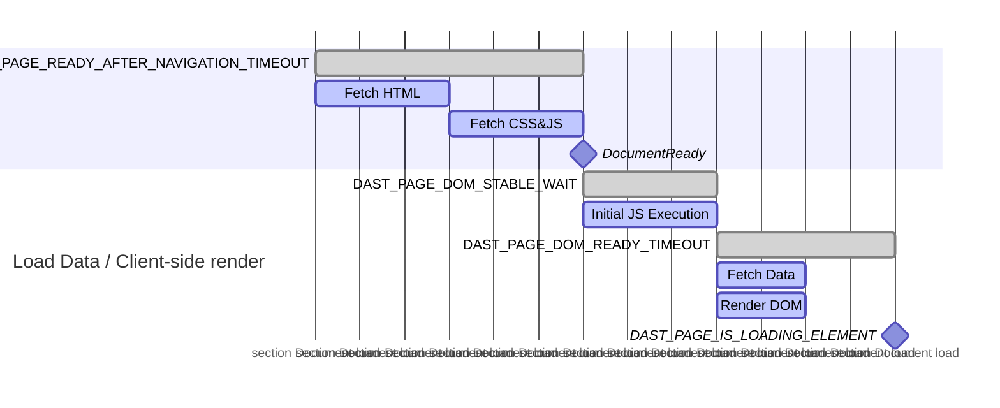

## スコープの管理 {#managing-scope}

スコープは、ターゲットアプリケーションをクロールする際にDASTが追跡するURLを制御します。スコープを適切に管理することで、スキャンの実行時間を最小限に抑え、ターゲットアプリケーションのみが脆弱性についてチェックされるようにします。

### スコープの種類 {#types-of-scope}

スコープには、次の3つの種類があります:

- スコープ内
- スコープ外
- スコープから除外

#### スコープ内 {#in-scope}

DASTはスコープ内のURLを追跡し、クロールを続行するために実行する後続のアクションについてDOMを検索します。記録されたスコープ内のHTTPメッセージは、受動的に脆弱性がチェックされ、フルスキャンの実行時に攻撃をビルドするために使用されます。

#### スコープ外 {#out-of-scope}

DASTは、画像、スタイルシート、フォント、スクリプト、AJAXリクエストなど、ドキュメント以外のコンテンツタイプについて、スコープ外のURLを追跡します。[認証](#scope-works-differently-during-authentication)は別として、DASTは、外部Webサイトへのリンクをクリックするときなど、フルページの読み込みのためにスコープ外のURLを追跡しません。情報漏えいを検索するパッシブチェックを除き、スコープ外のURLの記録されたHTTPメッセージは、脆弱性についてチェックされません。

#### スコープから除外 {#excluded-from-scope}

DASTは、スコープから除外されたURLを追跡しません。情報漏えいを検索するパッシブチェックを除き、スコープから除外されたURLの記録されたHTTPメッセージは、脆弱性についてチェックされません。

### 認証中のスコープの動作の違い {#scope-works-differently-during-authentication}

多くのターゲットアプリケーションには、シングルサインオンのためにIDアクセス管理プロバイダーを使用する場合など、外部Webサイトに依存する認証プロセスがあります。DASTがこれらのプロバイダーで認証できるように、DASTは認証中にフルページの読み込みのためにスコープ外のURLを追跡します。DASTは、スコープから除外されたURLを追跡しません。

### DASTがHTTPリクエストをブロックする方法 {#how-dast-blocks-http-requests}

DASTは、スコープルールによりリクエストをブロックするときに、通常どおりHTTPリクエストを行うようにブラウザーに指示します。リクエストはその後インターセプトされ、`BlockedByClient`という理由で拒否されます。このアプローチにより、DASTは、ターゲットサーバーに到達しないようにしながら、HTTPリクエストを記録できます。[200.1](../checks/200.1.md)などのパッシブチェックは、これらの記録されたリクエストを使用して、外部ホストに送信された情報を検証します。

### スコープを設定する方法 {#how-to-configure-scope}

デフォルトでは、ターゲットアプリケーションのホストに一致するURLは、スコープ内と見なされます。他のすべてのホストはスコープ外と見なされます。

スコープは、次の変数を使用して設定されます:

- `DAST_SCOPE_ALLOW_HOSTS`を使用して、スコープ内のホストを追加します。
- `DAST_SCOPE_IGNORE_HOSTS`を使用して、スコープ外のホストに追加します。
- `DAST_SCOPE_EXCLUDE_HOSTS`を使用して、スコープから除外されたホストに追加します。
- `DAST_SCOPE_EXCLUDE_URLS`を使用して、スコープから除外される特定のURLを設定します。

ルール:

- ホストの除外は、ホストの無視よりも優先され、ホストの許可よりも優先されます。
- ホストのスコープを設定しても、そのホストのサブドメインのスコープは設定されません。
- ホストのスコープを設定しても、そのホスト上のすべてのポートのスコープは設定されません。

以下は、一般的な設定です:

```yaml
include:
  - template: DAST.gitlab-ci.yml

dast:
  variables:
    DAST_TARGET_URL: "https://my.site.com"                   # my.site.com URLs are considered in-scope by default
    DAST_SCOPE_ALLOW_HOSTS: "api.site.com:8443"       # include the API as part of the scan
    DAST_SCOPE_IGNORE_HOSTS: "analytics.site.com"      # explicitly disregard analytics from the scan
    DAST_SCOPE_EXCLUDE_HOSTS: "ads.site.com"           # don't visit any URLs on the ads subdomain
    DAST_SCOPE_EXCLUDE_URLS: "https://my.site.com/user/logout"  # don't visit this URL
```

## 脆弱性の検出 {#vulnerability-detection}

DASTは、包括的な[ブラウザベースの脆弱性チェック](../checks/_index.md)を通じて脆弱性を検出します。これらのチェックにより、スキャン中にWebアプリケーションのセキュリティ上のイシューが特定されます。

クローラーは、DASTがプロキシサーバーとして設定されたブラウザーでターゲットWebサイトを実行します。これにより、ブラウザーによって行われたすべてのリクエストとレスポンスが、DASTによって受動的にスキャンされるようになります。フルスキャンの実行時、DASTによって実行されるアクティブな脆弱性チェックでは、ブラウザーは使用されません。脆弱性のチェック方法のこの違いにより、スキャンが意図したとおりに機能するように、ターゲットWebサイトの特定の機能を無効にする必要のあるイシューが発生する可能性があります。

たとえば、Anti-CSRFトークンを含むフォームを含むターゲットWebサイトの場合、ブラウザーはユーザーがページを表示しているかのようにページとフォームを表示するため、パッシブスキャンは意図したとおりに機能します。ただし、フルスキャンで実行されるアクティブな脆弱性チェックでは、Anti-CSRFトークンを含むフォームを送信できません。そのような場合は、フルスキャンの実行時にAnti-CSRFトークンを無効にすることをお勧めします。

## スキャン時間の管理 {#managing-scan-time}

標準のGitLab DASTソリューションと比較すると、ブラウザベースのクローラーを実行すると、多くのWebアプリケーションでカバレッジが向上することが期待されます。これにより、スキャン時間が増加するという犠牲が発生する可能性があります。

次の対策により、カバレッジとスキャン時間のトレードオフを管理できます:

- Runnerを垂直方向にスケールし、[変数](variables.md) `DAST_CRAWL_WORKER_COUNT`を使用して、より多くのブラウザーを使用します。デフォルトは、使用可能な論理CPUの数に動的に設定されます。
- [変数](variables.md) `DAST_CRAWL_MAX_ACTIONS`を使用して、ブラウザーによって実行されるアクションの数を制限します。デフォルトは`10,000`です。
- [変数](variables.md) `DAST_CRAWL_MAX_DEPTH`を使用して、ブラウザベースのクローラーがカバレッジをチェックするページ深度を制限します。クローラーは幅優先探索戦略を使用するため、深度の小さいページが最初にクロールされます。デフォルトは`10`です。
- [変数](variables.md) `DAST_CRAWL_TIMEOUT`を使用して、ターゲットアプリケーションのクロールにかかる時間を制限します。デフォルトは`24h`です。クローラーがタイムアウトすると、パッシブチェックとアクティブチェックが続行されます。
- [変数](variables.md) `DAST_CRAWL_GRAPH`を使用してクロールグラフをビルドし、クロールされているページを確認します。
- [変数](variables.md) `DAST_SCOPE_EXCLUDE_URLS`を使用して、ページのクロールを防止します。
- [変数](variables.md) `DAST_SCOPE_EXCLUDE_ELEMENTS`を使用して、要素が選択されないようにします。この変数を定義すると、クロールされた各ページに追加のルックアップが発生するため、注意して使用してください。
- ターゲットアプリケーションのレンダリングが最小限であるか高速である場合は、[変数](variables.md) `DAST_PAGE_DOM_STABLE_WAIT`をより小さい値に減らすことを検討してください。デフォルトは`500ms`です。

## タイムアウト {#timeouts}

ネットワークの状態が悪いか、アプリケーションの負荷が高いと、デフォルトのタイムアウトがアプリケーションに適用されない場合があります。

ブラウザベースのスキャンは、さまざまなタイムアウトを調整して、ページから次のページへの移行がスムーズに継続されるようにする機能を提供します。これらの値は[Duration string](https://pkg.go.dev/time#ParseDuration)を使用して設定されます。これにより、プレフィックスを使用して期間を設定できます:`m`は分、`s`は秒、`ms`はミリ秒です。

ナビゲーション、つまり新しいページを読み込む行為は、通常、JavaScriptやCSSファイルなどの複数の新しいリソースを読み込んでいるため、最も多くの時間を必要とします。これらのリソースのサイズ、またはそれらが返される速度によっては、デフォルトの`DAST_PAGE_READY_AFTER_NAVIGATION_TIMEOUT`では十分でない場合があります。

`DAST_PAGE_DOM_READY_TIMEOUT`または`DAST_PAGE_READY_AFTER_ACTION_TIMEOUT`で設定可能なものなどの安定性タイムアウトも設定できます。安定性タイムアウトは、ブラウザベースのスキャンがページが完全に読み込まれたと見なすタイミングを決定します。ブラウザベースのスキャンは、次の場合にページが読み込まれたと見なします:

1. [DOMContentLoaded](https://developer.mozilla.org/en-US/docs/Web/API/Document/DOMContentLoaded_event)イベントが発生しました。
1. JavaScriptやCSSなど、重要と見なされる未処理または未解決のリクエストはありません。メディアファイルは通常、重要ではないと見なされます。
1. ブラウザーがナビゲーションを実行したか、強制的に移行されたか、アクションを実行したかに応じて:

   - `DAST_PAGE_DOM_READY_TIMEOUT`または`DAST_PAGE_READY_AFTER_ACTION_TIMEOUT`の期間の後、新しいドキュメントオブジェクトモデル (DOM) 変更イベントはありません。

これらのイベントが発生すると、ブラウザベースのスキャンはページが読み込まれて準備ができたと見なし、次のアクションを試みます。

アプリケーションでレイテンシーが発生したり、ナビゲーションの失敗が多数返されたりする場合は、次の例のようにタイムアウト値を調整することを検討してください:

```yaml
include:
  - template: DAST.gitlab-ci.yml

dast:
  variables:
    DAST_TARGET_URL: "https://my.site.com"
    DAST_PAGE_READY_AFTER_NAVIGATION_TIMEOUT: "45s"
    DAST_PAGE_READY_AFTER_ACTION_TIMEOUT: "15s"
    DAST_PAGE_DOM_READY_TIMEOUT: "15s"
```



これらの値を調整すると、各ブラウザーがさまざまなアクティビティーの完了を待機する時間が調整されるため、スキャン時間に影響を与える可能性があります。



### ページの準備タイムアウト {#page-readiness-timeouts}

ページの準備とは、ページが完全に読み込まれ、そのDOMが安定し、インタラクティブな要素が使用可能になった状態を指します。適切なページの準備状況の検出は、次の点で重要です:

- **Scanning accuracy**（スキャン精度）: ページが完全に読み込まれる前に分析すると、コンテンツが見落とされたり、偽陰性が生成されたりする可能性があります。
- **Crawl efficiency**（クロールの効率性）: 待ち時間が長すぎるとスキャン時間が無駄になり、待ち時間が短いと動的コンテンツが見落とされます。
- **Modern web application support**（最新のWebアプリケーションのサポート）: シングルページアプリケーション、AJAXを多用するサイト、およびプログレッシブな読み込みパターンには、高度な準備状況の検出が必要です。

一連のオプションの設定可能なタイムアウトを使用すると、DASTスキャナーは、ページのさまざまな部分がいつ完全に読み込まれたかを検出できます。

#### タイムアウト変数 {#timeout-variables}

次のCI/CD変数を使用して、DASTページの準備タイムアウトをカスタマイズします。包括的なリストについては、[利用可能なCI/CD変数](variables.md)を参照してください。

| タイムアウト変数 | デフォルト | 説明 |
|:-----------------|:--------|:------------|
| `DAST_PAGE_READY_AFTER_NAVIGATION_TIMEOUT` | `15s` | ブラウザーがページ間をナビゲートするのを待つ最大時間。フルページの読み込みの場合、ドキュメントの読み込みフェーズ中に使用されます。 |
| `DAST_PAGE_READY_AFTER_ACTION_TIMEOUT` | `7s` | ブラウザーがページを読み込まれ、分析の準備ができたと見なすのを待つ最大時間。フルページの読み込みをトリガーしないページ内アクションの場合、`DAST_PAGE_READY_AFTER_NAVIGATION_TIMEOUT`の代替として使用されます。 |
| `DAST_PAGE_DOM_STABLE_WAIT` | `500ms` | ページが安定しているかどうかを確認する前に、DOMへの更新を待機する時間を定義します。クライアント側のレンダリングフェーズの開始時に使用されます。 |
| `DAST_PAGE_DOM_READY_TIMEOUT` | `6s` | ナビゲーションの完了後、ブラウザーがページを読み込まれ、分析の準備ができたと見なすのを待つ最大時間。バックグラウンドデータフェッチとDOMレンダリングの待機を制御します。 |
| `DAST_PAGE_IS_LOADING_ELEMENT` | なし | ページに表示されなくなったセレクターは、ページが読み込まれ終わったこと、およびスキャンを続行できることをアナライザーに示す。クライアント側のレンダリングプロセスの終了を示します。 |

#### ページの読み込みワークフロー {#page-loading-workflow}

最新のWebアプリケーションは、複数の段階で読み込まれます。DASTスキャナーには、プロセス内の各ステップに固有のタイムアウトがあります:

1. **Document loading**（ドキュメントの読み込み）: ブラウザーは、基本的なページ構造をフェッチして処理します。

   1. サーバーからHTMLコンテンツをフェッチします。
   1. 参照されているCSSファイルとJavaScriptファイルを読み込むます。
   1. コンテンツを解析して、初期ページをレンダリングします。
   1. 標準の「ドキュメントの準備完了」イベントをトリガーします。

   このフェーズでは、`DAST_PAGE_READY_AFTER_NAVIGATION_TIMEOUT`(フルページの読み込みの場合)または`DAST_PAGE_READY_AFTER_ACTION_TIMEOUT`(ページ内アクションの場合)のいずれかを使用します。これにより、ドキュメントの読み込みの最大待機時間が設定されます。

1. **Client-Side rendering**（クライアント側のレンダリング）: 最初の読み込み後、多くのシングルページアプリケーション:

   - 最初のJavaScriptの実行(`DAST_PAGE_DOM_STABLE_WAIT`)を実行します。
   - AJAXまたはその他のAPIコールを使用して、バックグラウンドデータをフェッチします。
   - DOMをレンダリングし、フェッチされたデータ(`DAST_PAGE_DOM_READY_TIMEOUT`)に基づいて更新を実行します。
   - ページの読み込みインジケーター(`DAST_PAGE_IS_LOADING_ELEMENT`)を表示します。

   スキャナーは、これらのアクティビティーを監視して、ページがいつインタラクションの準備ができたかを判断します。

次のチャートは、ページのクロール時に使用されるシーケンスタイムアウトを示しています:


