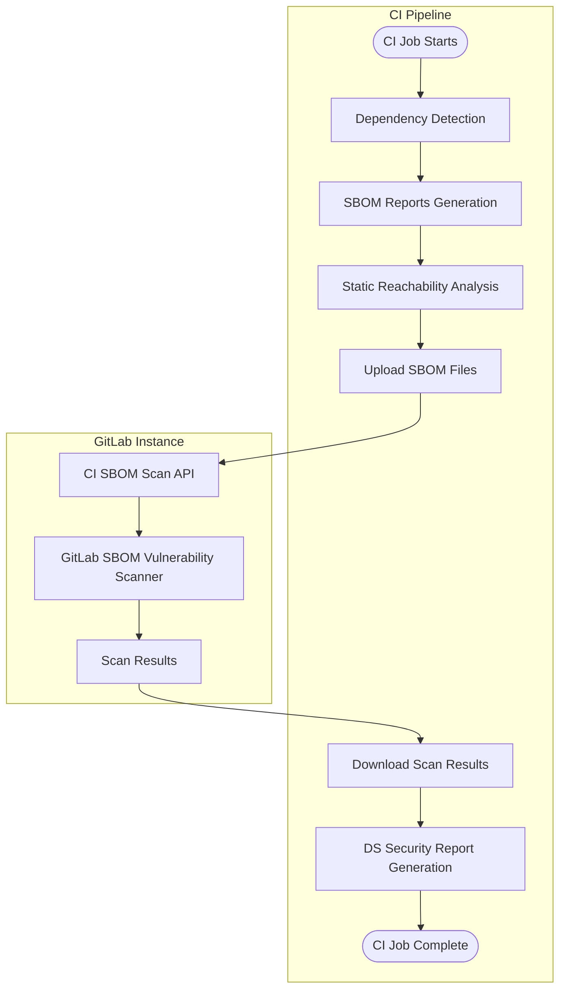



- プラン: Ultimate
- 提供形態: GitLab.com、GitLab Self-Managed、GitLab Dedicated
- ステータス: 利用制限 (GitLab.com)





- [導入](https://gitlab.com/gitlab-org/gitlab/-/issues/395692)されたのはGitLab 17.1で、`dependency_scanning_using_sbom_reports`という機能フラグを使用してGitLab 17.3の[実験](../../../../policy/development_stages_support.md#experiment)として正式にリリースされました。
- [ロックファイルベースの依存関係スキャン](https://gitlab.com/gitlab-org/security-products/analyzers/dependency-scanning/-/blob/main/README.md?ref_type=heads#supported-files)アナライザーがGitLab 17.4の[実験](../../../../policy/development_stages_support.md#experiment)としてリリースされました。
- [GitLab.com、Self-Managed、GitLab Dedicated](https://gitlab.com/gitlab-org/gitlab/-/issues/395692)で、GitLab 17.5のデフォルトブランチでのみ有効になりました。
- すべてのブランチをサポートするベータ版としてリリースされ、GitLab 17.9のCargo、Conda、Cocoapods、Swiftの[最新の依存関係スキャンCI/CDテンプレートでデフォルトで有効](https://gitlab.com/gitlab-org/gitlab/-/issues/519597)になりました。
- 機能フラグ`dependency_scanning_using_sbom_reports`はGitLab 17.10で削除されました。
- GitLab 18.5で、新しい[V2 CI/CD依存関係スキャンテンプレート](https://gitlab.com/gitlab-org/gitlab/-/merge_requests/201175/)で、GitLab.comでのみ利用制限付きでリリースされました。機能フラグ`dependency_scanning_sbom_scan_api`の背後にある依存関係スキャンSBOM APIを使用すると、デフォルトで無効になります。



CycloneDXソフトウェア部品表（SBOM）を使用した依存関係スキャンでは、既知の脆弱性についてアプリケーションの依存関係が分析されます。すべての依存関係（[推移的な依存関係を含む](../_index.md)）がスキャンされます。

依存関係スキャンは、多くの場合、ソフトウェアコンポジション解析（SCA）の一部と見なされます。SCAには、コードで使用するアイテムの検査の側面が含まれる場合があります。これらのアイテムには通常、アプリケーションやシステムの依存関係が含まれており、ほとんどの場合、これらはユーザーが記述したアイテムからではなく外部ソースからインポートされます。

依存関係スキャンは、アプリケーションのライフサイクルの開発フェーズで実行できます。パイプラインでSBOMレポートが生成されるたびに、セキュリティアドバイザリーが識別され、ソースブランチとターゲットブランチ間で比較されます。コードの変更がコミットされる前に、アプリケーションに対するリスクにプロアクティブに対処できるように、検出結果とその重大度がマージリクエストにリストされます。報告されたSBOMコンポーネントのセキュリティアドバイザリーは、新しいセキュリティアドバイザリーが公開されると、CI/CDパイプラインとは無関係に、[継続的な脆弱性スキャン](../../continuous_vulnerability_scanning/_index.md)によっても識別されます。

GitLabでは、これらのすべての依存関係タイプを確実に網羅するために、依存関係スキャンと[コンテナスキャン](../../container_scanning/_index.md)の両方を提供しています。リスク領域をできるだけ広くカバーするために、すべてのセキュリティスキャナーを使用することをおすすめします。これらの機能の比較については、[コンテナスキャンと比較した依存関係スキャン](../../comparison_dependency_and_container_scanning.md)を参照してください。

この[フィードバックイシュー](https://gitlab.com/gitlab-org/gitlab/-/issues/523458)で、新しい依存関係スキャンアナライザーに関するご意見をお聞かせください。

## はじめに {#getting-started}

依存関係スキャンを初めて使用する場合は、次の手順に従ってプロジェクトで有効にしてください。

- すべてのGitLabインスタンスの前提条件:

  - リポジトリ内、またはCI/CDパイプラインで作成され、アーティファクトとして`dependency-scanning`ジョブに渡される、[サポートされているロックファイルまたは依存関係グラフ](https://gitlab.com/gitlab-org/security-products/analyzers/dependency-scanning/#supported-files)。
  - Runnerには、[`docker`](https://docs.gitlab.com/runner/executors/docker.html)または[`kubernetes`](https://docs.gitlab.com/runner/install/kubernetes.html) executorがインストールされている必要があります。GitLab.comでは、これはデフォルトで提供されています。

- Self-ManagedインスタンスのGitLabのみの追加前提条件:

  - スキャンされるすべてのPURLタイプの[パッケージメタデータ](../../../../administration/settings/security_and_compliance.md#choose-package-registry-metadata-to-sync)は、GitLabインスタンスで同期されている必要があります。

    

    このデータがGitLabインスタンスで使用できない場合、依存関係スキャンは脆弱性を特定できません。

    

依存関係スキャンを有効にするには:

- プロジェクトの`.gitlab-ci.yml`ファイルに、`v2`依存関係スキャンCI/CDテンプレート`Dependency-Scanning.v2.gitlab-ci.yml`を含めます。

  ```yaml
  include:
    - template: Jobs/Dependency-Scanning.v2.gitlab-ci.yml
  ```

### ロックファイルまたは依存関係グラフを作成する {#create-lock-file-or-dependency-graph}

プロジェクトにサポートされているロックファイルまたはリポジトリにコミットされた依存関係グラフがない場合は、1つ指定する必要があります。

以下の例は、一般的な言語およびパッケージマネージャーでGitLabアナライザーによってサポートされているファイルを作成する方法を示しています。[サポートされている言語とファイル](#supported-languages-and-files)の完全なリストも参照してください。

#### Go {#go}

プロジェクトが`go.mod`ファイルのみを提供する場合でも、依存関係スキャンアナライザーはコンポーネントのリストを抽出できます。ただし、[依存関係パス](../../dependency_list/_index.md#dependency-paths)情報は利用できません。さらに、同じモジュールの複数のバージョンがある場合は、誤検出が発生する可能性があります。

コンポーネントの検出と機能のカバレッジを向上させるには、Goツールチェーンから[`go mod graph`コマンド](https://go.dev/ref/mod#go-mod-graph)を使用して生成された`go.graph`ファイルを提供する必要があります。

以下の例`.gitlab-ci.yml`は、Goプロジェクトで[依存関係パス](../../dependency_list/_index.md#dependency-paths)のサポートを使用してアナライザーを有効にする方法を示しています。依存関係グラフは、依存関係スキャンの実行前に、`build`ステージでジョブアーティファクトとして出力されます。

```yaml
stages:
  - build
  - test

include:
  - template: Jobs/Dependency-Scanning.v2.gitlab-ci.yml
go:build:
  stage: build
  image: "golang:latest"
  script:
    - "go mod tidy"
    - "go build ./..."
    - "go mod graph > go.graph"
  artifacts:
    when: on_success
    access: developer
    paths: ["**/go.graph"]

```

#### Gradle {#gradle}

Gradleプロジェクトの場合は、次のいずれかの方法を使用して依存関係グラフを作成します。

- Nebula Gradle Dependency Lockプラグイン
- GradleのHtmlDependencyReportTask

##### 依存関係ロックプラグイン {#dependency-lock-plugin}

この方法では、直接的な依存関係に関する情報が提供されます。

Gradleプロジェクトでアナライザーを有効にするには:

1. `build.gradle`または`build.gradle.kts`を編集して、[gradle-dependency-lock-プラグイン](https://github.com/nebula-plugins/gradle-dependency-lock-plugin/wiki/Usage#example)を使用するか、初期化スクリプトを使用します。
1. `.gitlab-ci.yml`ファイルを構成して`dependencies.lock`および`dependencies.direct.lock`アーティファクトを生成し、それらを`dependency-scanning`ジョブに渡します。

次の例は、Gradleプロジェクトのアナライザーを構成する方法を示しています。

```yaml
stages:
  - build
  - test

image: gradle:8.0-jdk11

include:
  - template: Jobs/Dependency-Scanning.v2.gitlab-ci.yml

generate nebula lockfile:
  # Running in the build stage ensures that the dependency-scanning job
  # receives the scannable artifacts.
  stage: build
  script:
    - |
      cat << EOF > nebula.gradle
      initscript {
          repositories {
            mavenCentral()
          }
          dependencies {
              classpath 'com.netflix.nebula:gradle-dependency-lock-plugin:12.7.1'
          }
      }

      allprojects {
          apply plugin: nebula.plugin.dependencylock.DependencyLockPlugin
      }
      EOF
      ./gradlew --init-script nebula.gradle -PdependencyLock.includeTransitives=true -PdependencyLock.lockFile=dependencies.lock generateLock saveLock
      ./gradlew --init-script nebula.gradle -PdependencyLock.includeTransitives=false -PdependencyLock.lockFile=dependencies.direct.lock generateLock saveLock
      # generateLock saves the lock file in the build/ directory of a project
      # and saveLock copies it into the root of a project. To avoid duplicates
      # and get an accurate location of the dependency, use find to remove the
      # lock files in the build/ directory only.
  after_script:
    - find . -path '*/build/dependencies*.lock' -print -delete
  # Collect all generated artifacts and pass them onto jobs in sequential stages.
  artifacts:
    paths:
      - '**/dependencies*.lock'
```

##### HtmlDependencyReportTask {#htmldependencyreporttask}

この方法では、推移的および直接的な依存関係に関する情報が提供されます。

[HtmlDependencyReportTask](https://docs.gradle.org/current/dsl/org.gradle.api.reporting.dependencies.HtmlDependencyReportTask.html)は、Gradleプロジェクトの依存関係のリストを取得する別の方法です（`gradle`バージョン4～8でテスト済み）。依存関係スキャンでこの方法を使用できるようにするには、`gradle htmlDependencyReport`タスクの実行からのアーティファクトを使用可能にする必要があります。

```yaml
stages:
  - build
  - test

# Define the image that contains Java and Gradle
image: gradle:8.0-jdk11

include:
  - template: Jobs/Dependency-Scanning.v2.gitlab-ci.yml

build:
  stage: build
  script:
    - gradle --init-script report.gradle htmlDependencyReport
  # The gradle task writes the dependency report as a javascript file under
  # build/reports/project/dependencies. Because the file has an un-standardized
  # name, the after_script finds and renames the file to
  # `gradle-html-dependency-report.js` copying it to the  same directory as
  # `build.gradle`
  after_script:
    - |
      reports_dir=build/reports/project/dependencies
      while IFS= read -r -d '' src; do
        dest="${src%%/$reports_dir/*}/gradle-html-dependency-report.js"
        cp $src $dest
      done < <(find . -type f -path "*/${reports_dir}/*.js" -not -path "*/${reports_dir}/js/*" -print0)
  # Pass html report artifact to subsequent dependency scanning stage.
  artifacts:
    paths:
      - "**/gradle-html-dependency-report.js"
```

上記のコマンドは`report.gradle`ファイルを使用し、`--init-script`を介して提供するか、そのコンテンツを`build.gradle`に直接追加できます:

```kotlin
allprojects {
    apply plugin: 'project-report'
}
```

> [!note]依存関係レポートは、一部の構成の依存関係が`FAILED`解決されない可能性があることを示している場合があります。この場合、依存関係スキャンは警告をログに記録しますが、ジョブは失敗しません。解決の失敗が報告された場合にパイプラインを失敗させたい場合は、上記の`build`の例に次の追加手順を追加します。

```shell
while IFS= read -r -d '' file; do
  grep --quiet -E '"resolvable":\s*"FAILED' $file && echo "Dependency report has dependencies with FAILED resolution status" && exit 1
done < <(find . -type f -path "*/gradle-html-dependency-report.js -print0)
```

#### Maven {#maven}

次の例`.gitlab-ci.yml`は、Mavenプロジェクトでアナライザーを有効にする方法を示しています。依存関係グラフは、依存関係スキャンの実行前に、`build`ステージでジョブアーティファクトとして出力されます。

要件: maven-依存関係-プラグインのバージョン`3.7.0`以上を使用します。

```yaml
stages:
  - build
  - test

image: maven:3.9.9-eclipse-temurin-21

include:
  - template: Jobs/Dependency-Scanning.v2.gitlab-ci.yml

build:
  # Running in the build stage ensures that the dependency-scanning job
  # receives the maven.graph.json artifacts.
  stage: build
  script:
    - mvn install
    - mvn org.apache.maven.plugins:maven-dependency-plugin:3.8.1:tree -DoutputType=json -DoutputFile=maven.graph.json
  # Collect all maven.graph.json artifacts and pass them onto jobs
  # in sequential stages.
  artifacts:
    paths:
      - "**/*.jar"
      - "**/maven.graph.json"
```

#### pip {#pip}

プロジェクトが[pip-compileコマンドラインツール](https://pip-tools.readthedocs.io/en/latest/cli/pip-compile/)によって生成された`requirements.txt`ロックファイルを提供する場合、依存関係スキャンアナライザーは、コンポーネントのリストと依存関係グラフ情報を抽出でき、[依存関係パス](../../dependency_list/_index.md#dependency-paths)機能をサポートします。

または、プロジェクトは、[`pipdeptree --json`コマンドラインユーティリティ](https://pypi.org/project/pipdeptree/)によって生成された`pipdeptree.json`依存関係グラフエクスポートを提供できます。

以下の例`.gitlab-ci.yml`は、pipプロジェクトで[依存関係パス](../../dependency_list/_index.md#dependency-paths)のサポートを使用してアナライザーを有効にする方法を示しています。`build`ステージは、依存関係スキャンの実行前に、ジョブアーティファクトとして依存関係グラフを出力します。

```yaml
stages:
  - build
  - test

include:
  - template: Jobs/Dependency-Scanning.v2.gitlab-ci.yml

build:
  stage: build
  image: "python:latest"
  script:
    - "pip install -r requirements.txt"
    - "pip install pipdeptree"
    # Run pipdeptree to get project's dependencies and exclude pipdeptree itself to avoid false positives
    - "pipdeptree -e pipdeptree --json > pipdeptree.json"
  artifacts:
    when: on_success
    access: developer
    paths: ["**/pipdeptree.json"]
```

[既知の問題](https://github.com/tox-dev/pipdeptree/issues/107)により、`pipdeptree`は[オプションの依存関係](https://setuptools.pypa.io/en/latest/userguide/dependency_management.html#optional-dependencies)を親パッケージの依存関係としてマークしません。その結果、依存関係スキャンは、それらを推移的な依存関係としてではなく、プロジェクトの直接的な依存関係としてマークします。

#### Pipenv {#pipenv}

プロジェクトが`Pipfile.lock`ファイルのみを提供する場合でも、依存関係スキャンアナライザーはコンポーネントのリストを抽出できます。ただし、[依存関係パス](../../dependency_list/_index.md#dependency-paths)情報は利用できません。

機能カバレッジを向上させるには、[`pipenv graph`コマンド](https://pipenv.pypa.io/en/latest/cli.html#graph)によって生成された`pipenv.graph.json`ファイルを提供する必要があります。

次の例`.gitlab-ci.yml`は、Pipenvプロジェクトで[依存関係パス](../../dependency_list/_index.md#dependency-paths)のサポートを使用してアナライザーを有効にする方法を示しています。`build`ステージは、依存関係スキャンの実行前に、ジョブアーティファクトとして依存関係グラフを出力します。

```yaml
stages:
  - build
  - test

include:
  - template: Jobs/Dependency-Scanning.v2.gitlab-ci.yml

build:
  stage: build
  image: "python:3.12"
  script:
    - "pip install pipenv"
    - "pipenv install"
    - "pipenv graph --json-tree > pipenv.graph.json"
  artifacts:
    when: on_success
    access: developer
    paths: ["**/pipenv.graph.json"]
```

#### sbt {#sbt}

sbtプロジェクトでアナライザーを有効にするには:

- `plugins.sbt`を編集して、[sbt-依存関係グラフプラグイン](https://github.com/sbt/sbt-dependency-graph/blob/master/README.md#usage-instructions)を使用します。

次の例`.gitlab-ci.yml`は、sbtプロジェクトで[依存関係パス](../../dependency_list/_index.md#dependency-paths)のサポートを使用してアナライザーを有効にする方法を示しています。`build`ステージは、依存関係スキャンの実行前に、ジョブアーティファクトとして依存関係グラフを出力します。

```yaml
stages:
  - build
  - test

include:
  - template: Jobs/Dependency-Scanning.v2.gitlab-ci.yml

build:
  stage: build
  image: "sbtscala/scala-sbt:eclipse-temurin-17.0.13_11_1.10.7_3.6.3"
  script:
    - "sbt dependencyDot"
  artifacts:
    when: on_success
    access: developer
    paths: ["**/dependencies-compile.dot"]
```

## 結果について理解する {#understanding-the-results}

依存関係スキャンアナライザーの出力:

- 検出されたサポートされているロックファイルまたは依存関係グラフエクスポートごとに、CycloneDX SBOM。
- スキャンされたすべてのSBOMドキュメントに対する単一の依存関係スキャンレポート（GitLab.comのみ）。

### CycloneDXソフトウェア部品表 {#cyclonedx-software-bill-of-materials}

依存関係スキャンアナライザーは、検出されたサポートされているロックファイルまたは依存関係グラフエクスポートごとに、[CycloneDX](https://cyclonedx.org/)ソフトウェア部品表（SBOM）を出力します。CycloneDX SBOMは、ジョブアーティファクトとして作成されます。

CycloneDX SBOMの仕様は次のとおりです。

- `gl-sbom-<package-type>-<package-manager>.cdx.json`という名前が付けられます。
- 依存関係スキャンジョブのジョブアーティファクトとして利用できます。
- `cyclonedx`レポートとしてアップロードされます。
- 検出されたロックファイルまたは依存関係グラフエクスポートファイルと同じディレクトリに保存されます。

たとえば、プロジェクトに次の構造がある場合:

```plaintext
.
├── ruby-project/
│   └── Gemfile.lock
├── ruby-project-2/
│   └── Gemfile.lock
└── php-project/
    └── composer.lock
```

次のCycloneDX SBOMは、ジョブアーティファクトとして作成されます:

```plaintext
.
├── ruby-project/
│   ├── Gemfile.lock
│   └── gl-sbom-gem-bundler.cdx.json
├── ruby-project-2/
│   ├── Gemfile.lock
│   └── gl-sbom-gem-bundler.cdx.json
└── php-project/
    ├── composer.lock
    └── gl-sbom-packagist-composer.cdx.json
```

### 複数のCycloneDX SBOMをマージする {#merging-multiple-cyclonedx-sboms}

CI/CDジョブを使用して、複数のCycloneDX SBOMを単一のSBOMにマージできます。

> [!note] GitLabは、依存関係グラフエクスポートやロックファイルの場所など、各CycloneDX SBOMのメタデータに実装固有の詳細を格納するために[CycloneDXプロパティ](https://cyclonedx.org/use-cases/#properties--name-value-store)を使用します。複数のCycloneDX SBOMをマージすると、この情報はマージ後のファイルから削除されます。

たとえば、次の`.gitlab-ci.yml`の抜粋は、複数のCyclone SBOMファイルをマージし、結果として生成されるファイルを検証する方法を示しています。

```yaml
stages:
  - test
  - merge-cyclonedx-sboms

include:
  - component: $CI_SERVER_FQDN/components/dependency-scanning/main@1

merge cyclonedx sboms:
  stage: merge-cyclonedx-sboms
  image:
    name: cyclonedx/cyclonedx-cli:0.27.1
    entrypoint: [""]
  script:
    - find . -name "gl-sbom-*.cdx.json" -exec cyclonedx merge --output-file gl-sbom-all.cdx.json --input-files "{}" +
    # optional: validate the merged sbom
    - cyclonedx validate --input-version v1_6 --input-file gl-sbom-all.cdx.json
  artifacts:
    paths:
      - gl-sbom-all.cdx.json
```

### 依存関係スキャンレポート {#dependency-scanning-report}

依存関係スキャンアナライザーは、スキャンされたすべてのロックファイルに対する脆弱性を含む単一の依存関係スキャンレポートを出力します。

依存関係スキャンレポート:

- `gl-dependency-scanning-report.json`という名前が付けられます。
- 依存関係スキャンジョブのジョブアーティファクトとして使用できます。
- `dependency_scanning`レポートとしてアップロードされます。
- プロジェクトのルートディレクトリに保存されます。

## 最適化 {#optimization}

SBOMを使用した依存関係スキャンを最適化するには、次のいずれかの方法を使用します:

- パスを除外する
- スキャンを最大のディレクトリ深度に制限する

### パスを除外する {#exclude-paths}

スキャンパフォーマンスを最適化し、関連するリポジトリコンテンツに焦点を当てるには、パスを除外します。

`.gitlab-ci.yml`ファイルに、除外されたパスを一覧表示します:

- 依存関係スキャンテンプレートを使用している場合は、`DS_EXCLUDED_PATHS` CI/CD変数を使用します。
- 依存関係スキャンCI/CDコンポーネントを使用している場合は、`excluded_paths`仕様入力を使用します。

#### 除外パターン {#exclusion-patterns}

除外パターンは、次のルールに従います:

- スラッシュのないパターンは、プロジェクト内の任意の深度でファイル名またはディレクトリ名と一致します（例: `test`は`./test`、`src/test`と一致します）。
- スラッシュ付きのパターンは親ディレクトリの一致を使用します - パターンで始まるパスと一致します（例: `a/b`は`a/b`および`a/b/c`と一致しますが、`c/a/b`とは一致しません）。
- 標準のglobワイルドカードがサポートされています（例: `a/**/b`は`a/b`、`a/x/b`、`a/x/y/b`と一致します）。
- 先頭と末尾のスラッシュは無視されます（例: `/build`と`build/`は`build`と同じように動作します）。

### スキャンを最大のディレクトリ深度に制限する {#limit-scanning-to-a-maximum-directory-depth}

スキャンパフォーマンスを最適化し、分析するファイルの数を減らすために、スキャンを最大のディレクトリ深度に制限します。

ルートディレクトリは深度`1`としてカウントされ、各サブディレクトリは深度を1ずつ増やします。デフォルトの深度は`2`です。値が`-1`の場合、深さに関係なくすべてのディレクトリをスキャンします。

`.gitlab-ci.yml`ファイルで最大の深度を指定するには:

- 依存関係スキャンテンプレートを使用している場合は、`DS_MAX_DEPTH` CI/CD変数を使用します。
- 依存関係スキャンCI/CDコンポーネントを使用している場合は、`max_scan_depth`仕様入力を使用します。

次の例では、`DS_MAX_DEPTH`が`3`に設定されている場合、`common`ディレクトリのサブディレクトリはスキャンされません。

```plaintext
timer
├── integration
│   ├── doc
│   └── modules
└── source
    ├── common
    │   ├── cplusplus
    │   └── go
    ├── linux
    ├── macos
    └── windows
```

## ロールアウトする {#roll-out}

単一のプロジェクトでSBOMの結果を使用した依存関係スキャンに自信がある場合は、その実装を複数のプロジェクトとグループに拡張できます。詳細については、[複数のプロジェクトでスキャンを強制する](#enforce-scanning-on-multiple-projects)を参照してください。

固有の要件がある場合は、[オフライン環境](#offline-support)でSBOMを使用した依存関係スキャンを実行できます。

## サポートされているパッケージタイプ {#supported-package-types}

セキュリティポリシー分析を効果的にするには、SBOMレポートにリストされているコンポーネントに、[GitLabアドバイザリデータベース](../../gitlab_advisory_database/_index.md)に対応するエントリが含まれている必要があります。

GitLab SBOM脆弱性スキャナーは、次の[PURLタイプ](https://github.com/package-url/purl-spec/blob/346589846130317464b677bc4eab30bf5040183a/PURL-TYPES.rst)のコンポーネントについて、依存関係スキャンの脆弱性を報告できます:

- `cargo`
- `composer`
- `conan`
- `gem`
- `golang`
- `maven`
- `npm`
- `nuget`
- `pypi`
- `swift`

## サポートされている言語とファイル {#supported-languages-and-files}

| 言語                  | パッケージマネージャー | ファイル                                         | 説明                                                                                                                                                            | 依存関係グラフのサポート | 静的到達可能性のサポート |
|---------------------------|-----------------|-------------------------------------------------|------------------------------------------------------------------------------------------------------------------------------------------------------------------------|--------------------------|-----------------------------|
| C#                        | NuGet           | `packages.lock.json`                            | `nuget`によって生成されたロックファイル。                                                                                                                                       |               |                   |
| C/C++                     | Conan           | `conan.lock`                                    | `conan`によって生成されたロックファイル。                                                                                                                                       |               |                   |
| C/C++/Fortran/Go/Python/R | Conda           | `conda-lock.yml`                                | `conda-lock`によって生成された環境ファイル。                                                                                                                           |                |                   |
| Dart                      | pub             | `pubspec.lock`、`pub.graph.json`                | `pub`によって生成されたロックファイル。`dart pub deps --json > pub.graph.json`から派生した依存関係グラフ。                                                                  |               |                   |
| Go                        | Go              | `go.mod`、`go.graph`                            | 標準の`go`ツールチェーンによって生成されたモジュールファイル。`go mod graph > go.graph`から派生した依存関係グラフ。                                                        |               |                   |
| Java                      | ivy             | `ivy-report.xml`                                | `report` Apache Antタスクによって生成された依存関係グラフエクスポート。                                                                                                    |                |                   |
| Java                      | Maven           | `maven.graph.json`                              | `mvn dependency:tree -DoutputType=json`によって生成された依存関係グラフエクスポート。                                                                                         |               |                   |
| Java/Kotlin               | Gradle          | `dependencies.lock`、`dependencies.direct.lock` | [gradle-依存関係-lock-プラグイン](https://github.com/nebula-plugins/gradle-dependency-lock-plugin)によって生成されたロックファイル。                                              |               |                   |
| Java/Kotlin               | Gradle          | `gradle-html-dependency-report.js`              | [htmlDependencyReport](https://docs.gradle.org/current/dsl/org.gradle.api.tasks.diagnostics.DependencyReportTask.html)タスクによって生成された依存関係グラフのエクスポート。 |               |                   |
| JavaScript/TypeScript     | npm             | `package-lock.json`、`npm-shrinkwrap.json`      | `npm` v5以降で生成されたロックファイル (`lockfileVersion`属性を生成しない以前のバージョンはサポートされていません)。                                  |               |                  |
| JavaScript/TypeScript     | pnpm            | `pnpm-lock.yaml`                                | `pnpm`によって生成されたロックファイル。                                                                                                                                        |               |                  |
| JavaScript/TypeScript     | yarn            | `yarn.lock`                                     | `yarn`によって生成されたロックファイル。                                                                                                                                        |               |                  |
| PHP                       | composer        | `composer.lock`                                 | `composer`によって生成されたロックファイル。                                                                                                                                    |               |                   |
| Python                    | pip             | `pipdeptree.json`                               | `pipdeptree --json`によって生成された依存関係グラフのエクスポート。                                                                                                             |               |                  |
| Python                    | pip             | `requirements.txt`                              | `pip-compile`によって生成された依存関係ロックファイル。                                                                                                                      |               |                  |
| Python                    | pipenv          | `Pipfile.lock`                                  | `pipenv`によって生成されたロックファイル。                                                                                                                                      |                |                   |
| Python                    | pipenv          | `pipenv.graph.json`                             | `pipenv graph --json-tree >pipenv.graph.json`によって生成された依存関係グラフのエクスポート。                                                                                   |               |                  |
| Python                    | poetry          | `poetry.lock`                                   | `poetry`によって生成されたロックファイル。                                                                                                                                      |               |                  |
| Python                    | uv              | `uv.lock`                                       | `uv`によって生成されたロックファイル。                                                                                                                                          |               |                  |
| Ruby                      | bundler         | `Gemfile.lock`、`gems.locked`                   | `bundler`によって生成されたロックファイル。                                                                                                                                     |               |                   |
| Rust                      | cargo           | `Cargo.lock`                                    | `cargo`によって生成されたロックファイル。                                                                                                                                       |               |                   |
| Scala                     | sbt             | `dependencies-compile.dot`                      | `sbt dependencyDot`によって生成された依存関係グラフのエクスポート。                                                                                                             |               |                   |
| Swift                     | swift           | `Package.resolved`                              | `swift`によって生成されたロックファイル。                                                                                                                                       |                |                   |

### パッケージハッシュ情報 {#package-hash-information}

依存関係スキャンSBOMには、利用可能な場合にパッケージハッシュ情報が含まれます。この情報は、NuGetパッケージにのみ提供されます。パッケージの整合性と信頼性を検証できるように、SBOM内の次の場所にパッケージハッシュが表示されます:

- 専用ハッシュフィールド
- PURL修飾子

例: 

```json
{
  "name": "Iesi.Collections",
  "version": "4.0.4",
  "purl": "pkg:nuget/Iesi.Collections@4.0.4?sha512=8e579b4a3bf66bb6a661f297114b0f0d27f6622f6bd3f164bef4fa0f2ede865ef3f1dbbe7531aa283bbe7d86e713e5ae233fefde9ad89b58e90658ccad8d69f9",
  "hashes": [
    {
      "alg": "SHA-512",
      "content": "8e579b4a3bf66bb6a661f297114b0f0d27f6622f6bd3f164bef4fa0f2ede865ef3f1dbbe7531aa283bbe7d86e713e5ae233fefde9ad89b58e90658ccad8d69f9"
    }
  ],
  "type": "library",
  "bom-ref": "pkg:nuget/Iesi.Collections@4.0.4?sha512=8e579b4a3bf66bb6a661f297114b0f0d27f6622f6bd3f164bef4fa0f2ede865ef3f1dbbe7531aa283bbe7d86e713e5ae233fefde9ad89b58e90658ccad8d69f9"
}
```

## アナライザーの動作をカスタマイズする {#customizing-analyzer-behavior}

アナライザーの動作のカスタマイズ方法は、イネーブルメントソリューションによって異なります。

> [!warning]これらの変更をデフォルトブランチにマージリクエストする前に、GitLabアナライザーのすべてのカスタマイズをテストしてください。そうしないと、誤検出が多数発生するなど、予期しない結果が生じる可能性があります。

### CI/CDテンプレートを使用した動作のカスタマイズ {#customizing-behavior-with-the-cicd-template}

#### 利用可能なspec入力 {#available-spec-inputs}

次のspec入力は、`Dependency-Scanning.v2.gitlab-ci.yml`テンプレートと組み合わせて使用できます。

| Spec入力 | 型 | デフォルト | 説明 |
|------------|------|---------|-------------|
| `job_name` | 文字列 | `"dependency-scanning"` | 依存関係スキャンジョブの名前。 |
| `stage` | 文字列 | `test` | 依存関係スキャンジョブのステージ。 |
| `allow_failure` | ブール値 | `true` | 依存関係スキャンジョブの失敗がパイプラインを失敗させるかどうか。 |
| `analyzer_image_prefix` | 文字列 | `"$CI_TEMPLATE_REGISTRY_HOST/security-products"` | アナライザーのリポジトリを指すレジストリURLプレフィックス。 |
| `analyzer_image_name` | 文字列 | `"dependency-scanning"` | 依存関係スキャンジョブで使用されるアナライザーイメージのリポジトリ。 |
| `analyzer_image_version` | 文字列 | `"1"` | 依存関係スキャンジョブで使用されるアナライザーイメージのバージョン。 |
| `enable_mr_pipelines` | ブール値 | `true` | 依存関係スキャンジョブをMRまたはブランチパイプラインで実行するかどうかを制御します。 |
| `additional_ca_cert_bundle` | 文字列 |  | 信頼するCA証明書バンドル。ここに示されているCAバンドルは、システムの証明書に追加され、スキャンプロセス中に他のツールでも使用されます。詳細については、[カスタムTLS認証局](#custom-tls-certificate-authority)を参照してください。 |
| `pipcompile_requirements_file_name_pattern` | 文字列 |  | 分析時に使用するカスタム要件ファイル名のパターン。このパターンは、ディレクトリパスではなく、ファイル名のみと一致する必要があります。構文の詳細は、[doublestarライブラリ](https://www.github.com/bmatcuk/doublestar/tree/v1#patterns)を参照してください。 |
| `max_scan_depth` | 数値 | `2` | サポートされているファイルを検索するためにアナライザーが検索するディレクトリレベル数を定義します。値 -1は、アナライザーが深さに関係なくすべてのディレクトリを検索することを意味します。 |
| `excluded_paths` | 文字列 | `"**/spec,**/test,**/tests,**/tmp"` | スキャンから除外するパスのカンマ区切りリスト（globがサポートされています）。 |
| `include_dev_dependencies` | ブール値 | `true` | サポートされているファイルをスキャンするときに、開発/テスト依存関係を含めます。 |
| `enable_static_reachability` | ブール値 | `false` | [静的到達可能性](../static_reachability.md)を有効にします。 |
| `analyzer_log_level` | 文字列 | `"info"` | 依存関係スキャンのログレベル。オプションは、致命的、エラー、警告、情報、デバッグです。 |
| `enable_vulnerability_scan` | ブール値 | `true` | 生成されたSBOMの脆弱性分析を有効にします |
| `api_timeout` | 数値 | `10` | 依存関係スキャンSBOM APIリクエストのタイムアウト（秒単位）。 |
| `api_scan_download_delay` | 数値 | `3` | スキャン結果のダウンロード前の依存関係スキャンSBOM APIの初期遅延（秒単位）。 |

#### 利用可能なCI/CD変数 {#available-cicd-variables}

これらの変数はspec入力を置き換えることができ、ベータ`latest`テンプレートとも互換性があります。

| CI/CD変数             | 説明 |
| ----------------------------|------------ |
| `ADDITIONAL_CA_CERT_BUNDLE` | 信頼するCA証明書バンドル。ここに示されているCAバンドルは、システムの証明書に追加され、スキャンプロセス中に他のツールでも使用されます。詳細については、[カスタムTLS認証局](#custom-tls-certificate-authority)を参照してください。 |
| `ANALYZER_ARTIFACT_DIR`     | CycloneDXレポート（SBOM）が保存されるディレクトリ。デフォルト`${CI_PROJECT_DIR}/sca-artifacts`。 |
| `DS_EXCLUDED_ANALYZERS`     | 依存関係スキャンから除外するアナライザーを（名前で）指定します。 |
| `DS_EXCLUDED_PATHS`         | パスに基づいて、スキャンからファイルとディレクトリを除外します。カンマ区切りのパターンリストを指定します。パターンには、glob（サポートされているパターンについては[`doublestar.Match`](https://pkg.go.dev/github.com/bmatcuk/doublestar/v4@v4.0.2#Match)を参照）、またはファイルパスやフォルダーパス（`doc,spec`など）を使用できます。一致ルールの詳細については、[除外パターン](#exclusion-patterns)を参照してください。これは、スキャンが実行される前に適用されるプリフィルターです。依存関係検出と静的到達可能性の両方に適用されます。デフォルトは`"**/spec,**/test,**/tests,**/tmp,**/node_modules,**/.bundle,**/vendor,**/.git"`です。 |
| `DS_MAX_DEPTH`              | アナライザーがスキャン対象のサポートされているファイルを検索するディレクトリ階層の深さを定義します。値が`-1`の場合、深さに関係なくすべてのディレクトリをスキャンします。デフォルト: `2`。 |
| `DS_INCLUDE_DEV_DEPENDENCIES` | `"false"`に設定すると、開発依存関係はレポートされません。Composer、Conda、Gradle、Maven、NPM、pnpm、Pipenv、Poetry、またはuvを使用するプロジェクトのみがサポートされています。デフォルトは`"true"`です。 |
| `DS_PIPCOMPILE_REQUIREMENTS_FILE_NAME_PATTERN`   | globパターンマッチングを使用して処理する要件ファイルを定義します（例：`requirements*.txt`または`*-requirements.txt`）。このパターンは、ディレクトリパスではなく、ファイル名のみと一致する必要があります。構文の詳細については、[globパターンドキュメント](https://github.com/bmatcuk/doublestar/tree/v1?tab=readme-ov-file#patterns)を参照してください。 |
| `SECURE_ANALYZERS_PREFIX`   | 公式のデフォルトイメージを提供するDockerレジストリ（プロキシ）の名前をオーバーライドします。 |
| `DS_FF_LINK_COMPONENTS_TO_GIT_FILES`   | CI/CDパイプラインで動的に生成されるロックファイルやグラフファイルではなく、依存関係リスト内のコンポーネントをリポジトリにコミットされたファイルにリンクします。これにより、すべてのコンポーネントがリポジトリ内のソースファイルにリンクされます。デフォルトは`"false"`です。 |
| `SEARCH_IGNORE_HIDDEN_DIRS` |  非表示のディレクトリを無視します。依存関係スキャンと静的到達可能性の両方で機能します。デフォルトは`"true"`です。 |
| `DS_STATIC_REACHABILITY_ENABLED` | [静的到達可能性](../static_reachability.md)を有効にします。デフォルトは`"false"`です。 |
| `DS_ENABLE_VULNERABILITY_SCAN`| 生成されたSBOMファイルの脆弱性スキャンを有効にします。[依存関係スキャンレポート](#dependency-scanning-report)を生成します。デフォルトは`"true"`です。 |
| `DS_API_TIMEOUT` | 依存関係スキャンSBOM APIリクエストのタイムアウト（秒単位）（最小値：`5`、最大値：`300`）デフォルト：`10` |
| `DS_API_SCAN_DOWNLOAD_DELAY` | スキャン結果のダウンロード前の初期遅延（秒単位）（最小値: 1、最大値: 120）デフォルト：`3` |
| `SECURE_LOG_LEVEL` | ログレベル。デフォルトは`"info"`です。 |

### カスタムTLS認証局 {#custom-tls-certificate-authority}

依存関係スキャンでは、アナライザーコンテナイメージに同梱されているデフォルトの代わりに、SSL/TLS接続にカスタムTLS証明書を使用できます。

#### カスタムTLS認証局を使用する {#using-a-custom-tls-certificate-authority}

カスタムTLS認証局を使用するには、CI/CD変数`ADDITIONAL_CA_CERT_BUNDLE`に[X.509 PEM公開キー証明書のテキスト表現](https://www.rfc-editor.org/rfc/rfc7468#section-5.1)を割り当てます。

たとえば、`.gitlab-ci.yml`ファイルで証明書を設定するには、次のようにします。

```yaml
variables:
  ADDITIONAL_CA_CERT_BUNDLE: |
      -----BEGIN CERTIFICATE-----
      MIIGqTCCBJGgAwIBAgIQI7AVxxVwg2kch4d56XNdDjANBgkqhkiG9w0BAQsFADCB
      ...
      jWgmPqF3vUbZE0EyScetPJquRFRKIesyJuBFMAs=
      -----END CERTIFICATE-----
```

## アプリケーションのスキャン方法 {#how-it-scans-an-application}

SBOMを使用した依存関係スキャン機能は、静的到達可能性や脆弱性スキャンなどの他の分析から依存関係検出を分離する、分解された依存関係分析アプローチに依存しています。

この懸念事項の分離とこのアーキテクチャのモジュール性により、言語サポートの拡張、GitLabプラットフォーム内でのより緊密な統合とエクスペリエンス、および業界標準のレポートタイプへの移行を通じて、お客様をより良くサポートできます。

依存関係スキャンの全体的なフローを以下に示します



依存関係検出フェーズでは、アナライザーが利用可能なロックファイルを解析して、プロジェクトの依存とその関係（依存関係グラフ）の包括的なインベントリを構築します。このインベントリは、CycloneDX SBOM（ソフトウェア部品表）ドキュメントにキャプチャされます。

静的到達可能性フェーズでは、アナライザーはソースファイルを解析して、アクティブに使用されているSBOMコンポーネントを特定し、それに応じてSBOMファイルでマークします。これにより、ユーザーは、脆弱なコンポーネントが到達可能かどうかに基づいて、脆弱性の優先順位を付けることができます。詳細については、[静的到達可能性ページ](../static_reachability.md)を参照してください。

SBOMドキュメントは、依存関係スキャンSBOM APIを介してGitLabインスタンスに一時的にアップロードされます。GitLab SBOM脆弱性スキャナーエンジンは、SBOMコンポーネントをアドバイザリと照合して、依存関係スキャンレポートに含めるためにアナライザーに返される所見のリストを生成します。

APIは、認証にデフォルトの`CI_JOB_TOKEN`を使用します。`CI_JOB_TOKEN`値を別のトークン（プロジェクトアクセストークンやパーソナルアクセストークンなど）でオーバーライドすると、カスタムトークンにスコープがある場合でも、APIはリクエストを適切に認証できません。

ユーザーは、次を使用して依存関係スキャンSBOM APIと通信するアナライザークライアントを構成できます:

- `vulnerability_scan_api_timeout`または`DS_API_TIMEOUT`
- `vulnerability_scan_api_download_delay`または`DS_API_SCAN_DOWNLOAD_DELAY`

詳細については、[利用可能なspec入力](#available-spec-inputs)および[利用可能なCI/CD変数](#available-cicd-variables)を参照してください。

生成されたレポートは、 CIジョブの完了時、通常はパイプライン完了後にGitLabインスタンスにアップロードされ、処理されます。

SBOMレポートは、[依存関係リスト](../../dependency_list/_index.md) 、[ライセンススキャン](../../../compliance/license_scanning_of_cyclonedx_files/_index.md) 、[継続的な脆弱性スキャン](../../continuous_vulnerability_scanning/_index.md)など、他のSBOMベースの機能をサポートするために使用されます。

依存関係スキャンレポートは、[セキュリティスキャン結果](../../detect/security_scanning_results.md)の一般的なプロセスに従います

- 依存関係スキャンレポートがデフォルトブランチのCI/CDジョブによって宣言されている場合：脆弱性が作成され、[脆弱性レポート](../../vulnerability_report/_index.md)に表示されます。
- 依存関係スキャンレポートがデフォルト以外のブランチのCI/CDジョブによって宣言されている場合：セキュリティ所見が作成され、[パイプラインビューのセキュリティタブ](../../detect/security_scanning_results.md)とMRセキュリティウィジェットに表示されます。

## オフラインサポート {#offline-support}



- プラン: Ultimate
- 提供形態: GitLab Self-Managed



インターネット経由での外部リソースへのアクセスが制限、制限、または断続的な環境のインスタンスでは、依存関係スキャンジョブを正常に実行するためにいくつかの調整を行う必要があります。詳細については、[オフライン環境](../../offline_deployments/_index.md)を参照してください。

### 要件 {#requirements}

オフライン環境で依存関係スキャンを実行するには、以下が必要です。

- `docker`または`kubernetes`エグゼキューターを備えたGitLab Runner。
- 依存関係スキャンアナライザーイメージのローカルコピー。
- [パッケージメタデータデータベース](../../../../topics/offline/quick_start_guide.md#enabling-the-package-metadata-database)へのアクセス。依存関係のライセンスとアドバイザリデータを取得する必要があります。

### アナライザーイメージのローカルコピー {#local-copies-of-analyzer-images}

依存関係スキャンアナライザーを使用するには:

1. `registry.gitlab.com`から、次のデフォルトの依存関係スキャンアナライザーイメージを[ローカルのDockerコンテナレジストリ](../../../packages/container_registry/_index.md)にインポートします。

   ```plaintext
   registry.gitlab.com/security-products/dependency-scanning:1
   ```

   DockerイメージをローカルのオフラインDockerレジストリにインポートするプロセスは、**ネットワークのセキュリティポリシー**によって異なります。IT部門に相談して、外部リソースをインポートまたは一時的にアクセスするための承認済みプロセスを確認してください。これらのスキャナーは新しい定義で[定期的に更新される](../../detect/vulnerability_scanner_maintenance.md)ため、定期的にダウンロードすることをおすすめします。オフラインインスタンスがGitLabレジストリにアクセスできる場合は、[Security-Binariesテンプレート](../../offline_deployments/_index.md#using-the-official-gitlab-template)を使用して、最新の依存関係スキャンアナライザーイメージをダウンロードできます。

1. ローカルアナライザーを使用するようにGitLab CI/CDを設定します。

   CI/CD変数`SECURE_ANALYZERS_PREFIX`または`analyzer_image_prefix` spec入力の値をローカルDockerレジストリに設定します（この例では、`docker-registry.example.com`）。

   ```yaml
   include:
     - template: Jobs/Dependency-Scanning.v2.gitlab-ci.yml

   variables:
     SECURE_ANALYZERS_PREFIX: "docker-registry.example.com/analyzers"
   ```

## 複数のプロジェクトでのスキャンの強制 {#enforce-scanning-on-multiple-projects}

セキュリティポリシーを使用して、複数のプロジェクトで依存関係スキャンを強制します。依存関係スキャンには、ロックファイルまたは依存関係グラフファイルのいずれかの、スキャン可能なアーティファクトが必要です。スキャン可能なアーティファクトがプロジェクトのリポジトリにコミットされているかどうかによって、ポリシーの選択が決まります。

- スキャン可能なアーティファクトがリポジトリにコミットされている場合は、[スキャン実行ポリシー](../../policies/scan_execution_policies.md)を使用します。

  スキャン可能なアーティファクトがリポジトリにコミットされているプロジェクトの場合、スキャン実行ポリシーは、依存関係スキャンを強制するための最も直接的な方法を提供します。

- スキャン可能なアーティファクトがリポジトリにコミットされていない場合は、[パイプライン実行ポリシー](../../policies/pipeline_execution_policies.md)を使用します。

  スキャン可能なアーティファクトがリポジトリにコミットされていないプロジェクトの場合は、パイプライン実行ポリシーを使用する必要があります。このポリシーでは、依存関係スキャンを呼び出す前に、スキャン可能なアーティファクトを生成するためのカスタムCI/CDジョブを定義する必要があります。

  パイプライン実行ポリシーは、次のことを行う必要があります:

  - CI/CDパイプラインの一部として、ロックファイルまたは依存関係グラフファイルを生成します。
  - 特定のプロジェクト要件に合わせて依存関係検出プロセスをカスタマイズします。
  - GradleやMavenなどのビルドツールに関する言語固有の指示を実装します。

次の例では、Gradle `nebula`プラグインを使用してロックファイルを生成します。他の言語については、[ロックファイルまたは依存関係グラフの作成](#create-lock-file-or-dependency-graph)を参照してください。

### 例: Gradleプロジェクトのパイプライン実行ポリシー {#example-pipeline-execution-policy-for-a-gradle-project}

リポジトリにコミットされたスキャン可能なアーティファクトがないGradleプロジェクトの場合は、パイプライン実行ポリシーでアーティファクト生成ステップを定義する必要があります。次の例では、`nebula`プラグインを使用しています。

1. 専用のセキュリティポリシープロジェクトで、メインポリシーファイル（例：`policy.yml`）を作成または更新します:

   ```yaml
   pipeline_execution_policy:
   - name: Enforce Gradle dependency scanning with SBOM
     description: Generate dependency artifact and run dependency scanning.
     enabled: true
     pipeline_config_strategy: inject_policy
     content:
       include:
         - project: $SECURITY_POLICIES_PROJECT
           file: "dependency-scanning.yml"
   ```

1. `dependency-scanning.yml`ポリシーファイルを追加します:

   ```yaml
   stages:
     - build
     - test

   include:
     - template: Jobs/Dependency-Scanning.v2.gitlab-ci.yml

   generate nebula lockfile:
     image: openjdk:11-jdk
     stage: build
     script:
       - |
         cat << EOF > nebula.gradle
         initscript {
             repositories {
               mavenCentral()
             }
             dependencies {
                 classpath 'com.netflix.nebula:gradle-dependency-lock-plugin:12.7.1'
             }
         }

         allprojects {
             apply plugin: nebula.plugin.dependencylock.DependencyLockPlugin
         }
         EOF
         ./gradlew --init-script nebula.gradle -PdependencyLock.includeTransitives=true -PdependencyLock.lockFile=dependencies.lock generateLock saveLock
         ./gradlew --init-script nebula.gradle -PdependencyLock.includeTransitives=false -PdependencyLock.lockFile=dependencies.direct.lock generateLock saveLock
     after_script:
       - find . -path '*/build/dependencies.lock' -print -delete
     artifacts:
       paths:
         - '**/dependencies.lock'
         - '**/dependencies.direct.lock'
   ```

このアプローチにより、次のことが保証されます:

1. Gradleプロジェクトでパイプラインを実行すると、スキャン可能なアーティファクトが生成されます。
1. 依存関係スキャンが強制され、スキャン可能なアーティファクトにアクセスできます。
1. ポリシースコープ内のすべてのプロジェクトは、同じ依存関係スキャンアプローチに一貫して従います。
1. 構成の変更は一元的に管理し、複数のプロジェクトに適用できます。

## 新しい依存関係スキャン機能を有効にするその他の方法 {#other-ways-of-enabling-the-new-dependency-scanning-feature}

`v2`テンプレートを使用して、依存関係スキャン機能を有効にすることを強くお勧めします。これが不可能な場合は、次のいずれかの方法を選択できます:

### `latest`テンプレートの使用 {#using-the-latest-template}

> [!warning] `latest`テンプレートは安定しているとはみなされず、破壊的な変更が含まれる可能性があります。[テンプレートエディション](../../detect/security_configuration.md#template-editions)を参照してください。

`latest`依存関係スキャンCI/CDテンプレート`Dependency-Scanning.latest.gitlab-ci.yml`を使用して、GitLab提供のアナライザーを有効にします。

- （非推奨）のGemnasiumアナライザーがデフォルトで使用されます。
- 新しい依存関係スキャンアナライザーを有効にするには、CI/CD変数`DS_ENFORCE_NEW_ANALYZER`を`true`に設定します。
- [サポートされているロックファイル、依存関係グラフ](#create-lock-file-or-dependency-graph) 、または[トリガーファイル](#trigger-files-for-the-latest-template)がパイプラインで`dependency-scanning`ジョブを作成するために、リポジトリに存在する必要があります。

  ```yaml
  include:
    - template: Jobs/Dependency-Scanning.latest.gitlab-ci.yml

  variables:
    DS_ENFORCE_NEW_ANALYZER: 'true'
  ```

または、`latest`テンプレートで[スキャン実行ポリシー](../../policies/scan_execution_policies.md)を使用して機能を有効にし、CI/CD変数`DS_ENFORCE_NEW_ANALYZER`を`true`に設定して、新しい依存関係スキャンアナライザーを適用できます。

アナライザーの動作をカスタマイズする場合は、[使用可能なCI/CD変数](#available-cicd-variables)を使用してください

#### `latest`テンプレートのトリガーファイル {#trigger-files-for-the-latest-template}

トリガーファイルは、[最新の依存関係スキャンCI/CDテンプレート](https://gitlab.com/gitlab-org/gitlab/-/blob/master/lib/gitlab/ci/templates/Jobs/Dependency-Scanning.latest.gitlab-ci.yml)を使用するときに、`dependency-scanning` CI/CDジョブを作成します。アナライザーはこれらのファイルをスキャンしません。トリガーファイルを使用して[ロックファイルまたは依存関係グラフを作成](#create-lock-file-or-dependency-graph)すると、プロジェクトがサポートされます。

| 言語        | ファイル                                                     |
|-----------------|-----------------------------------------------------------|
| C#/Visual Basic | `*.csproj`、`*.vbproj`                                    |
| Java            | `pom.xml`                                                 |
| Java/Kotlin     | `build.gradle`、`build.gradle.kts`                        |
| Python          | `requirements.pip`、`Pipfile`、`requires.txt`、`setup.py` |
| Scala           | `build.sbt`                                               |

### 依存関係スキャンCI/CDコンポーネントの使用 {#using-the-dependency-scanning-cicd-component}



- [ベータ](../../../../policy/development_stages_support.md#beta)としてGitLab 17.5で導入されました。[依存関係スキャンCI/CDコンポーネント](https://gitlab.com/explore/catalog/components/dependency-scanning)バージョン[`0.4.0`](https://gitlab.com/components/dependency-scanning/-/tags/0.4.0)。
- GitLab 18.8で[一般提供](https://gitlab.com/gitlab-org/gitlab/-/issues/578686)になりました。[依存関係スキャンCI/CDコンポーネント](https://gitlab.com/explore/catalog/components/dependency-scanning)バージョン[`1.0.0`](https://gitlab.com/components/dependency-scanning/-/tags/1.0.0)。



[依存関係スキャンCI/CDコンポーネント](https://gitlab.com/explore/catalog/components/dependency-scanning)を使用して、新しい依存関係スキャンアナライザーを有効にします。このアプローチを選択する前に、GitLab Self-Managedインスタンスの現在の[制限事項](../../../../ci/components/_index.md#use-a-gitlabcom-component-on-gitlab-self-managed)を確認してください。

  ```yaml
  include:
    - component: $CI_SERVER_FQDN/components/dependency-scanning/main@1
  ```

[ロックファイルまたは依存関係グラフを作成](#create-lock-file-or-dependency-graph)する必要もあります。

依存関係スキャンCI/CDコンポーネントを使用する場合、アナライザーは[入力](https://gitlab.com/explore/catalog/components/dependency-scanning)を構成することでカスタマイズできます。

### 独自のSBOMの持ち込み {#bringing-your-own-sbom}

> [!warning]サードパーティ製のSBOMのサポートは技術的には可能ですが、この[エピック](https://www.gitlab.com/groups/gitlab-org/-/epics/14760)での公式サポートが完了すると、大きく変更される可能性があります。

カスタムCIジョブで、サードパーティ製のCycloneDX SBOMジェネレーターまたはカスタムツールで生成された独自のCycloneDX SBOMドキュメントを[CI/CDアーティファクトレポート](../../../../ci/yaml/artifacts_reports.md#artifactsreportscyclonedx)として使用します。

依存関係スキャンをSBOMを使用してアクティブ化するには、提供されているCycloneDX SBOMドキュメントが以下を満たしている必要があります:

- [CycloneDX仕様](https://github.com/CycloneDX/specification)バージョン`1.4`、`1.5`、または`1.6`に準拠している。[CycloneDX Web Tool](https://cyclonedx.github.io/cyclonedx-web-tool/validate)でオンラインバリデーターを利用できます。
- [GitLab CycloneDXプロパティ分類](../../../../development/sec/cyclonedx_property_taxonomy.md)に準拠している。
- 成功したCIジョブから[CI/CDアーティファクトレポート](../../../../ci/yaml/artifacts_reports.md#artifactsreportscyclonedx)としてアップロードされる。

## トラブルシューティング {#troubleshooting}

依存関係スキャンを使用する際に、次のイシューが発生する可能性があります。

### カスタム`CI_JOB_TOKEN`を使用するときの`403 Forbidden`エラー {#403-forbidden-error-when-you-use-a-custom-ci_job_token}

依存関係スキャンSBOM APIは、スキャンのアップロードまたはダウンロードフェーズ中に`403 Forbidden`エラーを返す可能性があります。

これは、依存関係スキャンSBOM APIが認証にデフォルトの`CI_JOB_TOKEN`を必要とするために発生します。`CI_JOB_TOKEN`変数を（プロジェクトアクセストークンやパーソナルアクセストークンなどの）カスタムトークンでオーバーライドすると、カスタムトークンに`api`スコープがある場合でも、APIはリクエストを適切に認証できません。

このイシューを解決するには、次のいずれかの操作を行います:

- 推奨。`CI_JOB_TOKEN`のオーバーライドを削除します。定義済みの変数をオーバーライドすると、予期しない動作が発生する可能性があります。詳細については、[CI/CD変数](../../../../ci/variables/_index.md#use-pipeline-variables)を参照してください。
- 別の変数名を使用します。パイプラインの他の目的でカスタムトークンを使用する必要がある場合は、`CI_JOB_TOKEN`をオーバーライドする代わりに、`CUSTOM_ACCESS_TOKEN`のような別のCI/CD変数に格納します。

GitLabは、依存関係スキャンAPIエンドポイントに対して[きめ細かいジョブ権限](../../../../ci/jobs/fine_grained_permissions.md)をサポートしていませんが、[イシュー578850](https://gitlab.com/gitlab-org/gitlab/-/issues/578850)でこの機能の追加が提案されています。

### 警告: `grep: command not found` {#warning-grep-command-not-found}

アナライザーイメージには、イメージのアタックサーフェスを小さくするために、最小限の依存関係が含まれています。その結果、`grep`のような他のイメージで一般的に見られるユーティリティがイメージから欠落しています。これにより、ジョブログに`/usr/bin/bash: line 3: grep: command not found`のような警告が表示される場合があります。この警告は、アナライザーの結果には影響せず、無視できます。

### コンプライアンスフレームワークの互換性 {#compliance-framework-compatibility}

GitLab Self-ManagedインスタンスでSBOMベースの依存関係スキャンを使用する場合、コンプライアンスフレームワークとの互換性について考慮事項があります:

- GitLab.com (SaaS): 「依存関係スキャンの実行」コンプライアンスコントロールは、SBOMベースの依存関係スキャンで正しく機能します。
- 18.4以降のGitLab Self-Managedインスタンス: 従来の`gl-dependency-scanning-report.json`アーティファクトが生成されないため、「依存関係スキャンの実行」コンプライアンスコントロールは、SBOMベースの依存関係スキャン（`DS_ENFORCE_NEW_ANALYZER: 'true'`）を使用すると失敗する可能性があります。

Self-Managedインスタンスの回避策: 「依存関係スキャンの実行」コントロールを必要とするコンプライアンスフレームワークチェックに合格する必要がある場合は、`v2`テンプレート（`Jobs/Dependency-Scanning.v2.gitlab-ci.yml`）を使用できます。これにより、SBOMと依存関係スキャンレポートの両方が生成されます

コンプライアンスコントロールの詳細については、[GitLabのコンプライアンスコントロール](../../../compliance/compliance_frameworks/_index.md#gitlab-compliance-controls)を参照してください。

### エラー: `failed to verify certificate: x509: certificate signed by unknown authority` {#error-failed-to-verify-certificate-x509-certificate-signed-by-unknown-authority}

依存関係スキャンアナライザーがホストに接続すると、次のエラーが発生する可能性があります。このエラーの原因は、依存関係スキャンアナライザーで使用されている証明書がホストによって信頼されていないことです。

```plaintext
failed to verify certificate: x509: certificate signed by unknown authority
```

このイシューを解決するには、自己署名証明書を`ADDITIONAL_CA_CERT_BUNDLE` CI/CD変数に指定します。この証明書は、依存関係スキャンアナライザーがホストに接続するときに使用されます。

`ADDITIONAL_CA_CERT_BUNDLE`環境変数の値は証明書自体である必要があります:

```yaml
include:
  - template: Jobs/Dependency-Scanning.v2.gitlab-ci.yml

dependency-scanning:
  variables:
    ADDITIONAL_CA_CERT_BUNDLE: |
      -----BEGIN CERTIFICATE-----
      <...>
      -----END CERTIFICATE-----
  before_script:
    - echo "$ADDITIONAL_CA_CERT_BUNDLE" > /tmp/cacert.pem
    - export SSL_CERT_FILE="/tmp/cacert.pem"
```
