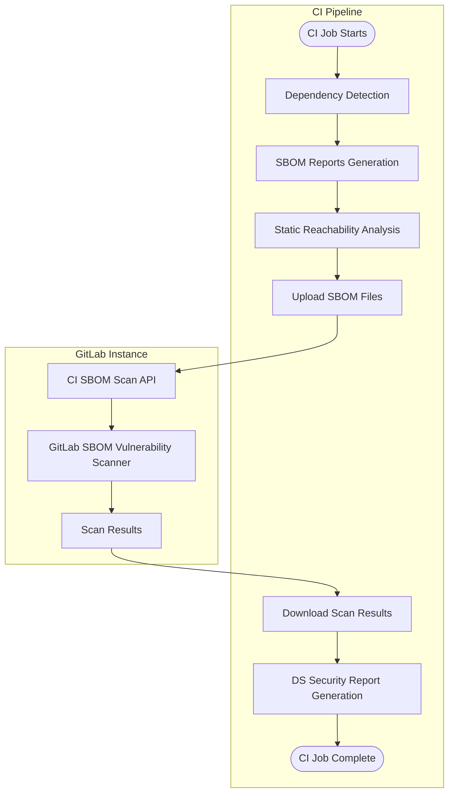



- プラン: Ultimate
- 提供形態: GitLab.com、GitLab Self-Managed、GitLab Dedicated





- GitLab 17.4で、`dependency_scanning_using_sbom_reports`[機能フラグ](../../../../administration/feature_flags/_index.md)とともにデフォルトブランチのみの[実験的機能](../../../../policy/development_stages_support.md#experiment)として[導入](https://gitlab.com/groups/gitlab-org/-/work_items/8026)されました。デフォルトでは無効になっています。
- GitLab 17.5の[GitLab Self-Managedで有効](https://gitlab.com/gitlab-org/gitlab/-/issues/395692)になりました。
- GitLab 17.9で、実験的機能からすべてのブランチをサポートするベータ版に[変更](https://gitlab.com/groups/gitlab-org/-/work_items/15960)され、Cargo、Conda、Cocoapods、Swift向けの[最新の依存関係スキャンCI/CDテンプレートで、デフォルトで有効になりました](https://gitlab.com/gitlab-org/gitlab/-/issues/519597)。
- 機能フラグ`dependency_scanning_using_sbom_reports`はGitLab 17.10で削除されました。
- GitLab 18.5で`dependency_scanning_sbom_scan_api`[機能フラグ](../../../../administration/feature_flags/_index.md)とともに、ベータ版から新しい[V2 CI/CD依存関係スキャンテンプレート](https://gitlab.com/gitlab-org/gitlab/-/merge_requests/201175/)でGitLab.comのみの限定提供に[変更](https://gitlab.com/groups/gitlab-org/-/work_items/15960)されました。デフォルトでは無効になっています。
- 機能フラグ`dependency_scanning_using_sbom_reports`は、GitLab 18.10で[デフォルトで有効](https://gitlab.com/gitlab-org/gitlab/-/work_items/551861)になっています。
- GitLab 19.0で[一般提供](https://gitlab.com/groups/gitlab-org/-/work_items/20456)になりました。



CycloneDXソフトウェア部品表（SBOM）を使用した依存関係スキャンでは、既知の脆弱性についてアプリケーションの依存関係が分析されます。すべての依存関係（[推移的依存関係を含む](../_index.md)）がスキャンされます。

依存関係スキャンは、多くの場合、ソフトウェアコンポジション解析（SCA）の一部と見なされます。SCAには、コードで使用するアイテムの検査の側面が含まれる場合があります。これらのアイテムには通常、アプリケーションやシステムの依存関係が含まれており、ほとんどの場合、これらはユーザーが記述したアイテムからではなく外部ソースからインポートされます。

依存関係スキャンは、アプリケーションのライフサイクルの開発フェーズで実行できます。新しい依存関係スキャンアナライザーをCI/CDパイプラインで使用すると、プロジェクトの依存関係が検出され、CycloneDX SBOMレポートに報告されます。セキュリティの検出結果が識別され、ソースブランチとターゲットブランチ間で比較されます。コードの変更がコミットされる前に、アプリケーションに対するリスクにプロアクティブに対処できるように、検出結果とその重大度がマージリクエストにリストされます。報告されたSBOMコンポーネントのセキュリティ検出結果は、新しいセキュリティアドバイザリーが公開されると、CI/CDパイプラインとは無関係に、[継続的脆弱性スキャン](../../continuous_vulnerability_scanning/_index.md)によっても識別されます。

GitLabは、これらのすべての依存関係タイプを確実に網羅するために、依存関係スキャンと[コンテナスキャン](../../container_scanning/_index.md)の両方を提供しています。リスク領域をできるだけ広くカバーするために、すべてのセキュリティスキャナーを使用することをおすすめします。これらの機能の比較については、[依存関係スキャンとコンテナスキャンの比較](../../comparison_dependency_and_container_scanning.md)を参照してください。

この[フィードバックイシュー](https://gitlab.com/gitlab-org/gitlab/-/issues/523458)で、新しい依存関係スキャンアナライザーに関するご意見をお聞かせください。

## 依存関係スキャンを有効にする {#turn-on-dependency-scanning}

プロジェクトの依存関係スキャンを有効にします。

### 前提条件 {#prerequisites}

すべてのGitLabインスタンスの前提条件:

- プロジェクトのデベロッパー、メンテナー、またはオーナーロール。
- [サポートされているロックファイルまたは依存関係グラフのエクスポート](#supported-languages-and-files)が、リポジトリにコミットされているか、CI/CDパイプラインで作成され、アーティファクトとして`dependency-scanning`ジョブに渡されている必要があります。または、サポートされているエコシステムでは、[依存関係解決](#dependency-resolution)によって必要なファイルを生成できます。フォールバックオプションとして、[マニフェストファイル](#manifest-fallback)を使用することもできます。
- Self-Managed Runnerの場合は、[`docker`](https://docs.gitlab.com/runner/executors/docker/)または[`kubernetes`](https://docs.gitlab.com/runner/install/kubernetes/) executorを備えたGitLab Runner。
- GitLab.com用のホストRunnerの場合、この設定はデフォルトで有効になっています。

GitLab Self-Managedの場合のみ、スキャンされるすべてのPURLタイプの[パッケージメタデータ](../../../../administration/settings/security_and_compliance.md#choose-package-registry-metadata-to-sync)がGitLabインスタンスで同期されている必要があります。このデータがGitLabインスタンスで使用できない場合、依存関係スキャンは脆弱性を特定できません。

### プロジェクトのパイプライン設定を更新する {#update-project-pipeline-configuration}

依存関係スキャンを有効にするには、依存関係スキャンテンプレートをプロジェクトのパイプライン設定に追加する必要があります。

デフォルトでは、`Dependency-Scanning.v2.gitlab-ci.yml`テンプレートは、マージリクエストパイプラインで依存関係スキャンジョブを実行します。プロジェクトが他のジョブでマージリクエストパイプラインを使用していない場合、マージリクエストパイプラインには依存関係スキャンジョブのみが表示され、その他すべてのジョブは別のブランチパイプラインで実行されます。この動作を無効にするには、[依存関係スキャンにおけるマージリクエストパイプラインを無効にする](#disable-merge-request-pipelines-for-dependency-scanning)を参照してください。

GitLab UIで依存関係スキャンを有効にするには:

1. 上部のバーで、**検索または移動先**を選択して、プロジェクトを見つけます。
1. 左側のサイドバーで、**コード** > **リポジトリ**を選択します。
1. `.gitlab-ci.yml`ファイルを選択します。
1. **編集** > **単一のファイルを編集**を選択します。
1. `Dependency-Scanning.v2` CI/CDテンプレートを追加します:

   ```yaml
   include:
     - template: Jobs/Dependency-Scanning.v2.gitlab-ci.yml
   ```

1. **変更をコミットする**を選択します。

## 利用可能なコンテナイメージ {#available-container-images}

この機能は、CIジョブを実行するためにコンテナイメージに依存しています。デフォルトのCIジョブ定義では、これらのイメージをメジャーバージョンタグ（`dependency-scanning:2`など）で参照するため、CI/CD設定を変更しなくても、パッチアップデートとマイナーアップデートを自動的に受け取ります。

### メンテナンスポリシー {#maintenance-policy}

GitLabは[リリースとメンテナンスポリシー](../../../../policy/maintenance.md)に従い、現在の安定版リリースのバグ修正と、過去2ヶ月間のリリースのセキュリティ修正を提供します。

CI/CDジョブでは、メジャーバージョンタグ（`dependency-scanning:2`など）でイメージを参照するため、そのメジャーイメージバージョンと互換性のあるすべてのGitLabバージョンで修正を自動的に利用できます。

これは、以下に示すイメージに適用されます。以前のイメージは、このポリシーの対象外です。

### 現在のイメージ {#current-images}

| CI/CDジョブ                               | 本番環境イメージ                                                                                        | GitLabのバージョン |
| --------------------------------------- | ------------------------------------------------------------------------------------------------------- | -------------- |
| `dependency-scanning`                   | `registry.gitlab.com/security-products/dependency-scanning:2`                                           | `19.x`         |
| `dependency-scanning:maven-resolution`  | `registry.gitlab.com/security-products/dependency-resolution/ubi9/openjdk-21:1`                         | `18.x`、`19.x` |
| `dependency-scanning:gradle-resolution` | `registry.gitlab.com/security-products/dependency-resolution/ubi9/openjdk-17-with-gradle-8:1`           | `19.x`         |
| `dependency-scanning:python-resolution` | `registry.gitlab.com/security-products/dependency-resolution/ubi9/python-312-minimal-with-piptools-7:9` | `18.x`、`19.x`  |

現在のイメージは、ベースイメージベンダーから提供されるアップストリームのパッチを組み込むために定期的に再ビルドされます。

### 以前のイメージ {#previous-images}

これらのイメージは非推奨であり、バグ修正や新機能の提供は終了しています。これらはコンテナレジストリで引き続き利用可能であり、対応するGitLabバージョンで引き続き動作します。非推奨のイメージを新しいGitLabバージョンで使用することはサポートされておらず、予期しない結果が生じる可能性があります。

| CI/CDジョブ             | 本番環境イメージ                                              | GitLabのバージョン | 非推奨になったバージョン |
| --------------------- | ------------------------------------------------------------- | -------------- | ------------- |
| `dependency-scanning` | `registry.gitlab.com/security-products/dependency-scanning:1` | `18.x`         | `19.0`        |
| `dependency-scanning` | `registry.gitlab.com/security-products/dependency-scanning:0` | `18.x`         | `19.0`        |

### FIPSコンプライアンス {#fips-compliance}

依存関係スキャンアナライザーイメージおよびすべての[依存関係解決イメージ](#dependency-resolution)は、FIPS 140で検証済みの暗号化モジュールを使用する[Red Hat UBI](https://www.redhat.com/en/blog/introducing-red-hat-universal-base-image)をベースとしています。FIPS対応環境では、追加の設定は必要ありません。

## 結果について理解する {#understanding-the-results}

依存関係スキャンアナライザーの出力内容:

- 検出されたサポート対象のロックファイルまたは依存関係グラフのエクスポートごとのCycloneDX SBOM。
- スキャンされたすべてのSBOMドキュメントに対する単一の依存関係スキャンレポート。

> [!note]
> アナライザーが[サポート対象ファイル](#supported-languages-and-files)を見つけられない場合、依存関係スキャンジョブは正常に完了し、CI/CDジョブログに警告を出力します。この場合、CycloneDX SBOMまたは依存関係スキャンレポートは生成されません。

### CycloneDXソフトウェア部品表 {#cyclonedx-software-bill-of-materials}

依存関係スキャンアナライザーは、サポート対象のロックファイル、依存関係グラフ、またはマニフェストファイルが検出されたディレクトリごとに、[CycloneDX](https://cyclonedx.org/)ソフトウェア部品表（SBOM）を出力します。CycloneDX SBOMは、ジョブアーティファクトとして作成されます。

CycloneDX SBOMの仕様は次のとおりです:

- `gl-sbom-<package-type>-<package-manager>.cdx.json`という名前が付けられます。
- 依存関係スキャンジョブのジョブアーティファクトとして利用できます。
- `cyclonedx`レポートとしてアップロードされます。
- 検出されたロックファイルまたは依存関係グラフファイルと同じディレクトリに保存されます。

たとえば、プロジェクトに次の構造がある場合:

```plaintext
.
├── ruby-project/
│   └── Gemfile.lock
├── ruby-project-2/
│   └── Gemfile.lock
└── php-project/
    └── composer.lock
```

次のCycloneDX SBOMは、ジョブアーティファクトとして作成されます:

```plaintext
.
├── ruby-project/
│   ├── Gemfile.lock
│   └── gl-sbom-gem-bundler.cdx.json
├── ruby-project-2/
│   ├── Gemfile.lock
│   └── gl-sbom-gem-bundler.cdx.json
└── php-project/
    ├── composer.lock
    └── gl-sbom-packagist-composer.cdx.json
```

### 依存関係スキャンレポート {#dependency-scanning-report}



- 提供形態: GitLab.com、GitLab Self-Managed、GitLab Dedicated



依存関係スキャンアナライザーは、CycloneDX SBOMファイルで識別された依存関係で特定されたすべての脆弱性をドキュメント化する依存関係スキャンレポートを生成します。

依存関係スキャンレポート:

- `gl-dependency-scanning-report.json`という名前が付けられます。
- 依存関係スキャンジョブのジョブアーティファクトとして使用できます。
- `dependency_scanning`レポートとしてアップロードされます。
- プロジェクトのルートディレクトリに保存されます。

## スキャンパフォーマンスの改善 {#improve-scanning-performance}

依存関係スキャンのパフォーマンスにおける主な要因は、スキャンする依存関係の数です。デフォルトでは、依存関係スキャンは次のスコープで動作します:

- すべてのサポートされている言語とファイルが含まれます。
- ルートディレクトリとその直下のサブディレクトリが含まれます。
- 非表示のディレクトリは除外されます。

パフォーマンスを向上させるには、特定のパスを除外したり、スキャンディレクトリの深さを制限したり、開発依存関係とテスト依存関係を除外したりできます。

### スキャンからパスを除外する {#exclude-paths-from-scanning}

スキャンパフォーマンスを向上させるには、パスを除外します。たとえば、ドキュメントを含むパスを除外することができます。パスを除外する際は、脆弱性が隠蔽されないように注意深く選択してください。

`.gitlab-ci.yml`ファイルに、除外されたパスを一覧表示します:

- 依存関係スキャンテンプレートでは、`DS_EXCLUDED_PATHS` CI/CD変数を使用します。
- 依存関係スキャンCI/CDコンポーネントでは、`excluded_paths` specインプットを使用します。

除外パターンは、次のルールに従います:

- スラッシュのないパターンは、プロジェクト内の任意の深さのファイル名またはディレクトリ名に一致します。たとえば、`test`は`./test`と`src/test`に一致します。
- スラッシュのあるパターンは、そのパターンで始まるパスに一致します。たとえば、`a/b`は`a/b`と`a/b/c`に一致しますが、`c/a/b`には一致しません。
- 標準のglobワイルドカードがサポートされています。たとえば、`a/**/b`は`a/b`、`a/x/b`、および`a/x/y/b`に一致します。
- 先頭と末尾のスラッシュは無視されます。たとえば、`/build`と`build/`は`build`と同じ結果に一致します。

### スキャンディレクトリの深さを制限する {#limit-scan-directory-depth}

デフォルトでは、スキャンはリポジトリのルートディレクトリとその直下のサブディレクトリのみを検索してパッケージマネージャーファイルを探します。スキャンパフォーマンスを向上させるには、最大ディレクトリ深度を`1`に設定し、検索をリポジトリのルートディレクトリのみに制限します。リポジトリ内のすべての関連するパッケージマネージャーファイルを含めるように注意してください。

`.gitlab-ci.yml`ファイルでスキャンディレクトリの最大深度を指定するには:

- 依存関係スキャンテンプレートでは、`DS_MAX_DEPTH` CI/CD変数を使用します。
- 依存関係スキャンCI/CDコンポーネントでは、`max_scan_depth` specインプットを使用します。

次の例では、`DS_MAX_DEPTH`が`1`に設定されている場合、依存関係スキャンは`timer`ディレクトリのみを検索してパッケージマネージャーファイルを探します。サブディレクトリはスキャンしません。

```plaintext
timer
├── integration
└── source
```

### 開発依存関係とテスト依存関係を除外する {#exclude-development-and-test-dependencies}

デフォルトでは、開発依存関係とテスト依存関係はスキャンに含まれます。スキャンパフォーマンスを向上させるには、次のいずれかを設定して除外します:

- CI/CD変数`DS_INCLUDE_DEV_DEPENDENCIES`を`"false"`に設定します。
- CI/CDコンポーネント入力`include_dev_dependencies`をfalseに設定します。

次のパッケージマネージャーを使用するプロジェクトのみがサポートされます: Composer、Conda、Gradle、Maven、NPM、pnpm、Pipenv、Poetry、およびuv。

## ロールアウトする {#roll-out}

単一のプロジェクトでSBOMの結果を使用した依存関係スキャンに自信がある場合は、その実装を複数のプロジェクトとグループに拡張できます。詳細については、[複数のプロジェクトでスキャンを強制する](#enforce-scanning-on-multiple-projects)を参照してください。

固有の要件がある場合、SBOMを使用した依存関係スキャンは[オフライン環境](#offline-environment)で実行できます。

## サポートされているパッケージタイプ {#supported-package-types}

セキュリティポリシー分析を効果的にするには、SBOMレポートにリストされているコンポーネントに、[GitLab Advisory Database](../../gitlab_advisory_database/_index.md)に対応するエントリが含まれている必要があります。

GitLab SBOM脆弱性スキャナーは、次の[PURLタイプ](https://github.com/package-url/purl-spec/blob/346589846130317464b677bc4eab30bf5040183a/PURL-TYPES.rst)のコンポーネントについて、依存関係スキャンの脆弱性を報告できます:

- `cargo`
- `composer`
- `conan`
- `gem`
- `golang`
- `maven`
- `npm`
- `nuget`
- `pypi`
- `swift`

## サポートされている言語とファイル {#supported-languages-and-files}

| 言語                  | パッケージマネージャー | ファイル                                         | 説明                                                                                                                                                                           | 依存関係グラフのエクスポートのサポート | 静的到達可能性のサポート |
| ------------------------- | --------------- | ----------------------------------------------- | ------------------------------------------------------------------------------------------------------------------------------------------------------------------------------------- | ------------------------------- | --------------------------- |
| C#                        | NuGet           | `packages.lock.json`                            | `nuget`によって生成されたロックファイル。                                                                                                                                                       |                      |                   |
| C/C++                     | Conan           | `conan.lock`                                    | `conan`によって生成されたロックファイル。                                                                                                                                                       |                      |                   |
| C/C++/Fortran/Go/Python/R | Conda           | `conda-lock.yml`                                | `conda-lock`によって生成された環境ファイル。                                                                                                                                          |                       |                   |
| Dart                      | pub             | `pubspec.lock`、`pub.graph.json`                | `pub`によって生成されたロックファイル。`dart pub deps --json > pub.graph.json`から派生した依存関係グラフのエクスポート。                                                                           |                      |                   |
| Go                        | go              | `go.mod`、`go.graph`                            | 標準の`go`ツールチェーンによって生成されたモジュールファイル。`go mod graph > go.graph`から派生した依存関係グラフのエクスポート。                                                                |                      |                   |
| Java                      | ivy             | `ivy-report.xml`                                | Apache Antの`report`タスクによって生成された依存関係グラフのエクスポート。                                                                                                                   |                       |                  |
| Java                      | Maven           | `maven.graph.json`                              | `mvn dependency:tree -DoutputType=json`によって生成された依存関係グラフのエクスポート。                                                                                                        |                      |                  |
| Java                      | Maven           | `pom.xml`                                       | [依存関係解決](#dependency-resolution)で使用されるMavenマニフェストファイル。または依存関係グラフのエクスポートが利用できない場合に、[マニフェストフォールバック](#manifest-fallback)として使用されます。           |                       |                  |
| Java/Kotlin               | Gradle          | `gradle.graph.txt`                              | `./gradlew dependencies`によって生成された依存関係グラフのエクスポート。                                                                                                                       |                      |                  |
| Java/Kotlin               | Gradle          | `dependencies.lock`、`dependencies.direct.lock` | [gradle-dependency-lock-plugin](https://github.com/nebula-plugins/gradle-dependency-lock-plugin)によって生成されたロックファイル。                                                              |                      |                  |
| Java/Kotlin               | Gradle          | `gradle.lockfile`                               | `gradle dependencies --write-locks`によって生成されたロックファイル。                                                                                                                           |                       |                  |
| Java/Kotlin               | Gradle          | `gradle-html-dependency-report.js`              | [htmlDependencyReport](https://docs.gradle.org/current/dsl/org.gradle.api.tasks.diagnostics.DependencyReportTask.html)タスクによって生成された依存関係グラフのエクスポート。                |                      |                  |
| Java/Kotlin               | Gradle          | `build.gradle`、`build.gradle.kts`              | [依存関係解決](#dependency-resolution)で使用されるGradleビルドファイル。または、ロックファイルや依存関係グラフのエクスポートが利用できない場合に、[マニフェストフォールバック](#manifest-fallback)として使用されます。 |                       |                  |
| JavaScript/TypeScript     | Bun             | `bun.lock`                                      | `bun`によって生成されたロックファイル。                                                                                                                                                          |                      |                  |
| JavaScript/TypeScript     | npm             | `package-lock.json`、`npm-shrinkwrap.json`      | `npm` v5以降によって生成されたロックファイル（`lockfileVersion`属性を生成しない以前のバージョンはサポートされていません）。                                                  |                      |                  |
| JavaScript/TypeScript     | pnpm            | `pnpm-lock.yaml`                                | `pnpm`によって生成されたロックファイル。                                                                                                                                                        |                      |                  |
| JavaScript/TypeScript     | yarn            | `yarn.lock`                                     | `yarn`によって生成されたロックファイル。                                                                                                                                                        |                      |                  |
| Objective-C               | CocoaPods       | `Podfile.lock`                                  | `cocoapods`によって生成されたロックファイル。                                                                                                                                                   |                       |                   |
| PHP                       | composer        | `composer.lock`                                 | `composer`によって生成されたロックファイル。                                                                                                                                                    |                      |                   |
| Python                    | pip             | `pipdeptree.json`                               | `pipdeptree --json`によって生成された依存関係グラフのエクスポート。                                                                                                                            |                      |                  |
| Python                    | pip             | `requirements.txt`（ロックファイル）                   | `pip-compile`によって生成されたロックファイル。                                                                                                                                                 |                      |                  |
| Python                    | pip             | `requirements.txt`                              | [依存関係解決](#dependency-resolution)で使用されるマニフェストファイル。または、ロックファイルや依存関係グラフのエクスポートが利用できない場合の[マニフェストフォールバック](#manifest-fallback)として使用されます。     |                       |                   |
| Python                    | pipenv          | `Pipfile.lock`                                  | `pipenv`によって生成されたロックファイル。                                                                                                                                                      |                       |                   |
| Python                    | pipenv          | `pipenv.graph.json`                             | `pipenv graph --json-tree >pipenv.graph.json`によって生成された依存関係グラフのエクスポート。                                                                                                  |                      |                  |
| Python                    | poetry          | `poetry.lock`                                   | `poetry` v1またはv2によって生成されたロックファイル。                                                                                                                                             |                      |                  |
| Python                    | uv <sup>1</sup>  | `uv.lock`                                       | `uv`によって生成されたロックファイル。                                                                                                                                                          |                      |                  |
| Ruby                      | bundler         | `Gemfile.lock`、`gems.locked`                   | `bundler`によって生成されたロックファイル。                                                                                                                                                     |                      |                   |
| Rust                      | cargo           | `Cargo.lock`                                    | `cargo`によって生成されたロックファイル。                                                                                                                                                       |                      |                   |
| Scala                     | sbt             | `dependencies-compile.dot`                      | `sbt dependencyDot`によって生成された依存関係グラフのエクスポート。                                                                                                                            |                      |                   |
| Swift                     | swift           | `Package.resolved`                              | `swift`によって生成されたロックファイル。                                                                                                                                                       |                       |                   |

**補足説明**: 

1. ロックファイルに、異なる環境マーカーを持つ同じパッケージの複数のエントリが含まれている場合（たとえば、Python 3.11未満の場合はnumpy==2.2.6、Python 3.11以上の場合はnumpy==2.4.1）、最初のエントリのみが解析され、レポートされます。

### パッケージハッシュ情報 {#package-hash-information}

依存関係スキャンSBOMには、利用可能な場合にパッケージハッシュ情報が含まれます。この情報は、NuGetパッケージにのみ提供されます。パッケージの整合性と信頼性を検証できるように、SBOM内の次の場所にパッケージハッシュが表示されます:

- 専用ハッシュフィールド
- PURL修飾子

例: 

```json
{
  "name": "Iesi.Collections",
  "version": "4.0.4",
  "purl": "pkg:nuget/Iesi.Collections@4.0.4?sha512=8e579b4a3bf66bb6a661f297114b0f0d27f6622f6bd3f164bef4fa0f2ede865ef3f1dbbe7531aa283bbe7d86e713e5ae233fefde9ad89b58e90658ccad8d69f9",
  "hashes": [
    {
      "alg": "SHA-512",
      "content": "8e579b4a3bf66bb6a661f297114b0f0d27f6622f6bd3f164bef4fa0f2ede865ef3f1dbbe7531aa283bbe7d86e713e5ae233fefde9ad89b58e90658ccad8d69f9"
    }
  ],
  "type": "library",
  "bom-ref": "pkg:nuget/Iesi.Collections@4.0.4?sha512=8e579b4a3bf66bb6a661f297114b0f0d27f6622f6bd3f164bef4fa0f2ede865ef3f1dbbe7531aa283bbe7d86e713e5ae233fefde9ad89b58e90658ccad8d69f9"
}
```

## アナライザーの動作をカスタマイズする {#customizing-analyzer-behavior}

アナライザーの動作のカスタマイズ方法は、イネーブルメントソリューションによって異なります。

> [!warning]
> これらの変更をデフォルトブランチにマージする前に、マージリクエストでGitLabアナライザーのすべてのカスタマイズをテストしてください。そうしないと、誤検出が多数発生するなど、予期しない結果が生じる可能性があります。

### CI/CDテンプレートを使用した動作をカスタマイズする {#customizing-behavior-with-the-cicd-template}

#### 利用可能なspecインプット {#available-spec-inputs}

次のspecインプットは、`Dependency-Scanning.v2.gitlab-ci.yml`テンプレートと組み合わせて使用できます。

| Specインプット                                  | 型    | デフォルト                                                                                                   | 説明                                                                                                                                                                                                                                                           |
| ------------------------------------------- | ------- | --------------------------------------------------------------------------------------------------------- | --------------------------------------------------------------------------------------------------------------------------------------------------------------------------------------------------------------------------------------------------------------------- |
| `job_name`                                  | 文字列  | `"dependency-scanning"`                                                                                   | 依存関係スキャンジョブの名前。                                                                                                                                                                                                                              |
| `stage`                                     | 文字列  | `test`                                                                                                    | 依存関係スキャンジョブのステージ。                                                                                                                                                                                                                             |
| `allow_failure`                             | ブール値 | `true`                                                                                                    | 依存関係スキャンジョブの失敗がパイプラインを失敗させるかどうか。                                                                                                                                                                                                 |
| `analyzer_image_prefix`                     | 文字列  | `"$CI_TEMPLATE_REGISTRY_HOST/security-products"`                                                          | アナライザーのリポジトリを指すレジストリURLプレフィックス。                                                                                                                                                                                                   |
| `analyzer_image_name`                       | 文字列  | `"dependency-scanning"`                                                                                   | 依存関係スキャンジョブで使用されるアナライザーイメージのリポジトリ。                                                                                                                                                                                             |
| `analyzer_image_version`                    | 文字列  | `"2"`                                                                                                     | 依存関係スキャンジョブで使用されるアナライザーイメージのバージョン。                                                                                                                                                                                                |
| `additional_ca_cert_bundle`                 | 文字列  |                                                                                                           | 信頼するCA証明書バンドル。ここに示されているCAバンドルは、システムの証明書に追加され、スキャンプロセス中に他のツールでも使用されます。詳細については、[カスタムTLS認証局](#custom-tls-certificate-authority)を参照してください。              |
| `pip_manifest_file_name_pattern`            | 文字列  |                                                                                                           | 依存関係解決およびマニフェストスキャンに使用するカスタムpipマニフェストファイル名パターン。このパターンは、ディレクトリパスではなく、ファイル名のみと一致する必要があります。構文の詳細については、[doublestarライブラリ](https://www.github.com/bmatcuk/doublestar/tree/v1#patterns)を参照してください。 |
| `pipcompile_lockfile_file_name_pattern`     | 文字列  |                                                                                                           | 分析時に使用するpip-compileロックファイル名パターン。このパターンは、ディレクトリパスではなく、ファイル名のみと一致する必要があります。構文の詳細については、[doublestarライブラリ](https://www.github.com/bmatcuk/doublestar/tree/v1#patterns)を参照してください。                          |
| `pipcompile_requirements_file_name_pattern` | 文字列  |                                                                                                           | GitLab 19.0で[非推奨](https://gitlab.com/gitlab-org/gitlab/-/work_items/598796)になりました: 代わりに`pipcompile_lockfile_file_name_pattern`を使用してください。                                                                                                                           |
| `max_scan_depth`                            | 数値  | `2`                                                                                                       | サポート対象ファイルを検索するためにアナライザーが検索するディレクトリレベル数を定義します。値 -1は、アナライザーが深さに関係なくすべてのディレクトリを検索することを意味します。                                                                                                       |
| `excluded_paths`                            | 文字列  | `"**/spec,**/test,**/tests,**/tmp"`                                                                       | スキャンから除外するパスのカンマ区切りリスト（globがサポートされています）。                                                                                                                                                                                           |
| `include_dev_dependencies`                  | ブール値 | `true`                                                                                                    | サポート対象ファイルをスキャンするときに、開発/テスト依存関係を含めます。                                                                                                                                                                                                 |
| `enable_static_reachability`                | ブール値 | `false`                                                                                                   | [静的到達可能性](../static_reachability.md)を有効にします。                                                                                                                                                                                                              |
| `enable_manifest_fallback`                  | ブール値 | `true`                                                                                                    | [マニフェストフォールバック](#manifest-fallback)を有効にします。                                                                                                                                                                                                                       |
| `analyzer_log_level`                        | 文字列  | `"info"`                                                                                                  | 依存関係スキャンのログレベル。オプションは、致命的、エラー、警告、情報、デバッグです。                                                                                                                                                                               |
| `enable_vulnerability_scan`                 | ブール値 | `true`                                                                                                    | 生成されたSBOMの脆弱性分析を有効にします                                                                                                                                                                                                                  |
| `api_timeout`                               | 数値  | `10`                                                                                                      | 依存関係スキャンSBOM APIリクエストのタイムアウト（秒単位）。                                                                                                                                                                                                              |
| `api_scan_download_delay`                   | 数値  | `3`                                                                                                       | スキャン結果をダウンロードする前の依存関係スキャンSBOM APIの初期遅延（秒単位）。                                                                                                                                                                                |
| `resolution_jobs_stage`                     | 文字列  | `.pre`                                                                                                    | 依存関係解決ジョブのパイプラインステージ。                                                                                                                                                                                                                         |
| `resolution_jobs_allow_failure`             | ブール値 | `true`                                                                                                    | `true`の場合、解決ジョブが失敗してもパイプラインは失敗しません。`false`の場合、解決の失敗によってパイプラインがブロックされます。                                                                                                                                              |
| `disabled_resolution_jobs`                  | 文字列  | `""`                                                                                                      | 無効にする解決ジョブのカンマ区切りリスト（例: `"maven, python"`）。デフォルトでは、利用可能なすべての解決ジョブが有効になります。指定可能な値は`maven`、`gradle`、`python`です。[依存関係解決](#dependency-resolution)を参照してください                       |
| `resolution_jobs_checkout_timeout`          | 数値  | `60`                                                                                                      | リポジトリのチェックアウトを解決サービスが待機する秒単位のタイムアウト。正の整数である必要があります。                                                                                                                                                         |
| `resolution_jobs_script_timeout`            | 数値  | `60`                                                                                                      | 依存関係解決サービスが解決スクリプトを生成するのを待機する秒単位のタイムアウト。正の整数である必要があります。サービスがまだリポジトリのチェックアウトを待機している場合は、代わりに`resolution_jobs_checkout_timeout`を増やしてください。                     |
| `maven_resolution_job_name`                 | 文字列  | `"dependency-scanning:maven-resolution"`                                                                  | Maven依存関係解決ジョブの名前。                                                                                                                                                                                                                  |
| `maven_resolution_image`                    | 文字列  | `"registry.gitlab.com/security-products/dependency-resolution/ubi9/openjdk-21:1"`                         | Maven依存関係解決ジョブで使用されるイメージ。                                                                                                                                                                                                                |
| `maven_dependency_plugin_version`           | 文字列  | `"3.7.0"`                                                                                                 | Maven依存関係解決中に使用される`maven-dependency-plugin`のバージョン。`3.7.0`以降である必要があります。                                                                                                                                                           |
| `python_resolution_job_name`                | 文字列  | `"dependency-scanning:python-resolution"`                                                                 | Python依存関係解決ジョブの名前。                                                                                                                                                                                                                 |
| `python_resolution_image`                   | 文字列  | `"registry.gitlab.com/security-products/dependency-resolution/ubi9/python-312-minimal-with-piptools-7:9"` | Python依存関係解決ジョブで使用されるイメージ。                                                                                                                                                                                                               |
| `gradle_resolution_job_name`                | 文字列  | `"dependency-scanning:gradle-resolution"`                                                                 | Gradle依存関係解決ジョブの名前。                                                                                                                                                                                                                 |
| `gradle_resolution_image`                   | 文字列  | `"registry.gitlab.com/security-products/dependency-resolution/ubi9/openjdk-17-with-gradle-8:1"`           | Gradle依存関係解決ジョブで使用されるイメージ。                                                                                                                                                                                                               |

#### 利用可能なCI/CD変数 {#available-cicd-variables}

これらの変数はspecインプットを置き換えることができ、ベータ`latest`テンプレートとも互換性があります。

| CI/CD変数                                | 説明                                                                                                                                                                                                                                                                                                                                                                                                                                                                                                                                                                                      |
| ---------------------------------------------- | ------------------------------------------------------------------------------------------------------------------------------------------------------------------------------------------------------------------------------------------------------------------------------------------------------------------------------------------------------------------------------------------------------------------------------------------------------------------------------------------------------------------------------------------------------------------------------------------------ |
| `AST_ENABLE_MR_PIPELINES`                      | 依存関係スキャンジョブをMRまたはブランチパイプラインで実行するかどうかを制御します。デフォルト: `"true"`。プロジェクトでMRパイプラインを使用していない場合は、重複するパイプラインを避けるためにこれを無効にしてください。                                                                                                                                                                                                                                                                                                                                                                                                                  |
| `ADDITIONAL_CA_CERT_BUNDLE`                    | 信頼するCA証明書バンドル。ここに示されているCAバンドルは、システムの証明書に追加され、スキャンプロセス中に他のツールでも使用されます。詳細については、[カスタムTLS認証局](#custom-tls-certificate-authority)を参照してください。                                                                                                                                                                                                                                                                                                                                         |
| `ANALYZER_ARTIFACT_DIR`                        | CycloneDXレポート（SBOM）が保存されるディレクトリ。デフォルトは`${CI_PROJECT_DIR}/sca-artifacts`です。                                                                                                                                                                                                                                                                                                                                                                                                                                                                                                  |
| `DEPENDENCY_SCANNING_DISABLED`                 | `"true"`または`"1"`に設定すると、すべての依存関係スキャンジョブが無効になります。デフォルト: 未設定。                                                                                                                                                                                                                                                                                                                                                                                                                                                                                                          |
| `DS_EXCLUDED_ANALYZERS`                        | 依存関係スキャンから除外するアナライザーを（名前で）指定します。                                                                                                                                                                                                                                                                                                                                                                                                                                                                                                                             |
| `DS_EXCLUDED_PATHS`                            | パスに基づいて、スキャンからファイルとディレクトリを除外します。カンマ区切りのパターンリストを指定します。パターンには、glob（サポートされているパターンについては[`doublestar.Match`](https://pkg.go.dev/github.com/bmatcuk/doublestar/v4@v4.0.2#Match)を参照）、またはファイルパスやフォルダーパス（`doc,spec`など）を使用できます。マッチングルールについては、[スキャンからパスを除外する](#exclude-paths-from-scanning)を参照してください。これは、スキャンが実行される前に適用されるプレフィルターです。依存関係検出と静的到達可能性の両方に適用されます。デフォルト: `"**/spec,**/test,**/tests,**/tmp,**/node_modules,**/.bundle,**/vendor,**/.git"`。 |
| `DS_MAX_DEPTH`                                 | アナライザーがスキャン対象のサポートされているファイルを検索するディレクトリ階層の深さを定義します。値が`-1`の場合、深度に関係なくすべてのディレクトリをスキャンします。デフォルト: `2`。                                                                                                                                                                                                                                                                                                                                                                                                                     |
| `DS_INCLUDE_DEV_DEPENDENCIES`                  | `"false"`に設定すると、開発依存関係はレポートされません。Composer、Conda、Gradle、Maven、NPM、pnpm、Pipenv、Poetry、またはuvを使用するプロジェクトのみがサポートされています。デフォルト: `"true"`                                                                                                                                                                                                                                                                                                                                                                                                          |
| `DS_PIP_MANIFEST_FILE_NAME_PATTERN`            | globパターンマッチング（例: `custom-requirements.txt`、`*-requirements.txt`）を使用して、依存関係解決とマニフェストスキャンで処理するpipマニフェストファイルを定義します。このパターンは、ディレクトリパスではなく、ファイル名のみと一致する必要があります。構文の詳細については、[globパターンドキュメント](https://github.com/bmatcuk/doublestar/tree/v1?tab=readme-ov-file#patterns)を参照してください。                                                                                                                                                                                                         |
| `PIP_REQUIREMENTS_FILE`                        | GitLab 19.0で[非推奨](https://gitlab.com/gitlab-org/gitlab/-/work_items/588580)になりました: 代わりに`DS_PIP_MANIFEST_FILE_NAME_PATTERN`を使用してください。                                                                                                                                                                                                                                                                                                                                                                                                                                                          |
| `DS_PIPCOMPILE_LOCKFILE_FILE_NAME_PATTERN`     | globパターンマッチング（例: `requirements*.txt`、`*-requirements.txt`）を使用して、処理するpip-compileロックファイルを定義します。このパターンは、ディレクトリパスではなく、ファイル名のみと一致する必要があります。構文の詳細については、[globパターンドキュメント](https://github.com/bmatcuk/doublestar/tree/v1?tab=readme-ov-file#patterns)を参照してください。                                                                                                                                                                                                                                                             |
| `DS_PIPCOMPILE_REQUIREMENTS_FILE_NAME_PATTERN` | GitLab 19.0で[非推奨](https://gitlab.com/gitlab-org/gitlab/-/work_items/598796)になりました: 代わりに`DS_PIPCOMPILE_LOCKFILE_FILE_NAME_PATTERN`を使用してください。                                                                                                                                                                                                                                                                                                                                                                                                                                                   |
| `SECURE_ANALYZERS_PREFIX`                      | 公式のデフォルトイメージを提供するDockerレジストリ（プロキシ）の名前をオーバーライドします。                                                                                                                                                                                                                                                                                                                                                                                                                                                                                                          |
| `DS_FF_LINK_COMPONENTS_TO_GIT_FILES`           | ロックファイルやCI/CDパイプラインで動的に生成されたグラフファイルではなく、依存関係リスト内のコンポーネントをリポジトリにコミットされたファイルにリンクします。これにより、すべてのコンポーネントがリポジトリ内のソースファイルにリンクされます。デフォルト: `"false"`。                                                                                                                                                                                                                                                                                                                                      |
| `SEARCH_IGNORE_HIDDEN_DIRS`                    | 非表示のディレクトリを無視します。依存関係スキャンと静的到達可能性の両方で機能します。デフォルト: `"true"`。                                                                                                                                                                                                                                                                                                                                                                                                                                                                                        |
| `DS_STATIC_REACHABILITY_ENABLED`               | [静的到達可能性](../static_reachability.md)を有効にします。デフォルト: `"false"`。                                                                                                                                                                                                                                                                                                                                                                                                                                                                                                                    |
| `DS_ENABLE_VULNERABILITY_SCAN`                 | 生成されたSBOMファイルの脆弱性スキャンを有効にします。[依存関係スキャンレポート](#dependency-scanning-report)を生成します。デフォルト: `"true"`。                                                                                                                                                                                                                                                                                                                                                                                                                                                 |
| `DS_API_TIMEOUT`                               | 依存関係スキャンSBOM APIリクエストのタイムアウト（秒単位）（最小値: `5`、最大値: `300`）デフォルト: `10`                                                                                                                                                                                                                                                                                                                                                                                                                                                                                             |
| `DS_API_SCAN_DOWNLOAD_DELAY`                   | スキャン結果のダウンロード前の初期遅延（秒単位）（最小値: 1、最大値: 120）デフォルト: `3`                                                                                                                                                                                                                                                                                                                                                                                                                                                                                                 |
| `DS_ENABLE_MANIFEST_FALLBACK`                  | ロックファイルまたは依存関係グラフのエクスポートが利用できない場合に、マニフェストフォールバックを有効にします。[マニフェストフォールバック](#manifest-fallback)を参照してください。デフォルト: `"true"`。                                                                                                                                                                                                                                                                                                                                                                                                                                               |
| `DS_SKIP_IF_NO_SUPPORTED_FILES`                | `"true"`に設定すると、プロジェクトで[サポート対象ファイル](#supported-languages-and-files)が検出されない場合、依存関係スキャンジョブをスキップします。詳細については、[サポート対象ファイルが存在しない場合にジョブをスキップする](#skip-the-job-when-no-supported-file-is-present)を参照してください。デフォルト: `"false"`。                                                                                                                                                                                                                                                                                                                            |
| `SECURE_LOG_LEVEL`                             | ログレベル。デフォルト: `"info"`。                                                                                                                                                                                                                                                                                                                                                                                                                                                                                                                                                                    |
| `DS_DISABLED_RESOLUTION_JOBS`                  | 無効にする解決ジョブのカンマ区切りリスト（例: `"maven, python"`）。デフォルトでは、利用可能なすべての解決ジョブが有効になります。指定可能な値は`maven`、`gradle`、`python`です。                                                                                                                                                                                                                                                                                                                                                                                                      |
| `DS_MAVEN_RESOLUTION_IMAGE`                    | Maven依存関係解決ジョブで使用されるイメージ。                                                                                                                                                                                                                                                                                                                                                                                                                                                                                                                                           |
| `DS_MAVEN_DEPENDENCY_PLUGIN_VERSION`           | Maven依存関係解決中に使用される`maven-dependency-plugin`のバージョン。`3.7.0`以降である必要があります。デフォルト: `3.7.0`。                                                                                                                                                                                                                                                                                                                                                                                                                                                                    |
| `MAVEN_ARGS`                                   | Maven依存関係解決中に`mvn`コマンドに渡す追加の引数。レガシーの`MAVEN_CLI_OPTS`変数を置き換えます。                                                                                                                                                                                                                                                                                                                                                                                                                                                             |
| `DS_PYTHON_RESOLUTION_IMAGE`                   | Python依存関係解決ジョブで使用されるイメージ。                                                                                                                                                                                                                                                                                                                                                                                                                                                                                                                                          |
| `PIP_INDEX_URL`                                | Python依存関係解決中に使用されるPythonパッケージインデックスのベースURL。デフォルト: `https://pypi.org/simple`。                                                                                                                                                                                                                                                                                                                                                                                                                                                                            |
| `PIP_EXTRA_INDEX_URL`                          | Python依存関係解決中に`PIP_INDEX_URL`とともに使用する追加のPythonパッケージインデックスURL。                                                                                                                                                                                                                                                                                                                                                                                                                                                                                  |
| `DS_GRADLE_RESOLUTION_IMAGE`                   | Gradle依存関係解決ジョブで使用されるイメージ。                                                                                                                                                                                                                                                                                                                                                                                                                                                                                                                                          |
| `GRADLE_CLI_OPTS`                              | Gradle依存関係解決中に`gradle`または`gradlew`コマンドに渡す追加の引数。                                                                                                                                                                                                                                                                                                                                                                                                                                                                                          |

### 依存関係スキャンにおけるマージリクエストパイプラインを無効にする {#disable-merge-request-pipelines-for-dependency-scanning}

デフォルトでは、`Dependency-Scanning.v2.gitlab-ci.yml`テンプレートは、マージリクエストパイプラインで依存関係スキャンジョブを実行します。プロジェクトが他のジョブでマージリクエストパイプラインを使用していない場合、マージリクエストごとに2つのパイプラインが実行され、他のジョブは別のブランチパイプラインで実行される可能性があります。この動作を無効にするには、specインプット`enable_mr_pipelines: false`またはCI/CD変数`AST_ENABLE_MR_PIPELINES: "false"`を設定します。

### サポート対象ファイルが存在しない場合にジョブをスキップする {#skip-the-job-when-no-supported-file-is-present}

デフォルトでは、プロジェクトに[サポート対象ファイル](#supported-languages-and-files)が含まれていない場合でも、テンプレートを含むすべてのパイプラインで依存関係スキャンジョブが実行されます。サポート対象ファイルが検出されない場合にジョブをスキップするには、`DS_SKIP_IF_NO_SUPPORTED_FILES`を`"true"`に設定します:

```yaml
include:
  - template: Jobs/Dependency-Scanning.v2.gitlab-ci.yml

variables:
  DS_SKIP_IF_NO_SUPPORTED_FILES: "true"
```

この変数が設定されている場合、依存関係スキャンジョブは、プロジェクトに[サポート対象ファイルリスト](#supported-languages-and-files)内のファイルが少なくとも1つ含まれている場合、または`DS_PIPCOMPILE_LOCKFILE_FILE_NAME_PATTERN`、`DS_PIP_MANIFEST_FILE_NAME_PATTERN`、`PIP_REQUIREMENTS_FILE`（非推奨）でカスタムパターンが設定されている場合にのみ実行されます。

### カスタムTLS認証局 {#custom-tls-certificate-authority}

依存関係スキャンでは、アナライザーコンテナイメージに付属するデフォルトの代わりに、カスタムTLS証明書をSSL/TLS接続に使用できます。

#### カスタムTLS認証局を使用する {#using-a-custom-tls-certificate-authority}

カスタムTLS認証局を使用するには、CI/CD変数`ADDITIONAL_CA_CERT_BUNDLE`に[X.509 PEM公開キー証明書のテキスト表現](https://www.rfc-editor.org/rfc/rfc7468#section-5.1)を割り当てます。

たとえば、`.gitlab-ci.yml`ファイルで証明書を設定するには、次のようにします:

```yaml
variables:
  ADDITIONAL_CA_CERT_BUNDLE: |
      -----BEGIN CERTIFICATE-----
      MIIGqTCCBJGgAwIBAgIQI7AVxxVwg2kch4d56XNdDjANBgkqhkiG9w0BAQsFADCB
      ...
      jWgmPqF3vUbZE0EyScetPJquRFRKIesyJuBFMAs=
      -----END CERTIFICATE-----
```

## 依存関係解決 {#dependency-resolution}



- GitLab 18.11でMavenとPython向けに[導入](https://gitlab.com/groups/gitlab-org/-/work_items/20461)されました。デフォルトでは無効です。
- Gradleのサポートが[追加](https://gitlab.com/gitlab-org/gitlab/-/work_items/590734)されました。GitLab 19.0のすべてのサポート対象プロジェクトにおいてデフォルトで有効になりました。



プロジェクトのリポジトリに、サポート対象のロックファイルまたは依存関係グラフのエクスポートがコミットされていない場合、依存関係解決によって、スキャンの実行前に必要なファイルを自動的に生成できます。

サポート対象のマニフェストファイルがプロジェクトで検出されると、依存関係解決が自動的にトリガーされます。解決ジョブは、最小限のエコシステムイメージ（例: `ubi9/openjdk-21`）を使用して、`.pre`パイプラインステージで実行され、ロックファイルまたは依存関係グラフのエクスポートをネイティブに生成します。これらのジョブは既存のロックファイルまたはグラフエクスポートを保持し、存在しない場合にのみ作成します。生成されたアーティファクトは、その後、`test`パイプラインステージの`dependency-scanning`ジョブによって使用されます。デフォルトイメージは、同等の代替イメージ（`eclipse-temurin:jdk-21`など）や、必要なビルドツールを含むカスタムイメージに置き換えることができます。

次のエコシステムが依存関係解決をサポートしています:

| 言語    | パッケージマネージャー | 検出されるマニフェストファイル                                                                                                           | 解決コマンド    | 出力アーティファクト       |
| ----------- | --------------- | --------------------------------------------------------------------------------------------------------------------------------- | --------------------- | --------------------- |
| Java        | Maven           | `pom.xml`                                                                                                                         | `mvn dependency:tree` | `maven.graph.json`    |
| Java/Kotlin | Gradle          | `build.gradle`、`build.gradle.kts`                                                                                                | `gradle dependencies` | `gradle.graph.txt`    |
| Python      | pip、setuptools | `requirements.txt`、`requirements.in`、`requirements.pip`、`requires.txt`、`setup.py`、`setup.cfg`、`pyproject.toml`（Poetry以外） | `pip-compile`         | `pipcompile.lock.txt` |

### 依存関係解決をカスタマイズする {#customizing-dependency-resolution}

利用可能なすべてのオプションについては、[利用可能なspecインプット](#available-spec-inputs)および[利用可能なCI/CD変数](#available-cicd-variables)を参照してください。

#### カスタム依存関係解決イメージを使用する {#use-a-custom-dependency-resolution-image}

独自のイメージを使用するには、次のインプットを設定できます:

- `maven_resolution_image`
- `gradle_resolution_image`
- `python_resolution_image`

たとえば、Mavenの解決にカスタムイメージを使用するには、次のようにします:

```yaml
include:
  - template: Jobs/Dependency-Scanning.v2.gitlab-ci.yml
    inputs:
      maven_resolution_image: "registry.gitlab.mycorp.com/eclipse-temurin:jdk-21"
```

または、次のCI/CD変数を設定できます:

- `DS_MAVEN_RESOLUTION_IMAGE`
- `DS_GRADLE_RESOLUTION_IMAGE`
- `DS_PYTHON_RESOLUTION_IMAGE`

#### 依存関係解決を無効にする {#disable-dependency-resolution}

特定のエコシステムにおける依存関係解決を無効にするには、`DS_DISABLED_RESOLUTION_JOBS` CI/CD変数または`disabled_resolution_jobs`インプットを使用します。指定可能な値は`maven`、`gradle`、`python`です。

たとえば、Mavenの依存関係解決を無効にするには、次のようにします:

```yaml
variables:
  DS_DISABLED_RESOLUTION_JOBS: "maven"

include:
  - template: Jobs/Dependency-Scanning.v2.gitlab-ci.yml
```

### 依存関係解決のセキュリティに関する考慮事項 {#security-considerations-for-dependency-resolution}

依存関係解決ジョブは、CI/CDジョブコンテナ内で、エコシステムネイティブのビルドツール（`mvn`、`gradle`、`pip-compile`）を実行します。これらのツールは、起動時に拡張機能を読み込んだり任意のコードを実行したりできる環境変数や設定ファイルをネイティブに尊重します。以下にその一例を示します:

- Maven: `MAVEN_ARGS`、`MAVEN_CLI_OPTS`（レガシー）、`MAVEN_OPTS`、`JAVA_TOOL_OPTIONS`、`-s`または`--settings`で参照される任意の`settings.xml`、および`pom.xml`または`settings.xml`で宣言された`<extensions>`。
- Gradle: `GRADLE_OPTS`、`JAVA_TOOL_OPTIONS`、`--init-script`、および`build.gradle`または`build.gradle.kts`内のトップレベルのGroovyまたはKotlinコード。
- Python: `PIP_INDEX_URL`、`PIP_EXTRA_INDEX_URL`、`setup.py`、およびロックファイルのインストールフック。

これらのCI/CD変数を設定できるユーザー、またはプロジェクトのビルドファイルを変更できるユーザーは、解決ジョブで任意のコードを実行させることができます。解決ジョブは`CI_JOB_TOKEN`で実行され、スコープ内のマスクされたCI/CD変数にアクセスし、ジョブの実行中にプロジェクトリポジトリへの読み取りまたは書き込みを行います。

この性質は、エコシステムネイティブのビルドツールに本来備わっているものであり、依存関係スキャンに固有のものではありません。解決ジョブは機密性の高い実行コンテキストとして扱ってください。

推奨される制御策:

- 前述の変数を定義またはオーバーライドできるユーザーを制限します。保護ブランチおよびタグにスコープ設定された、[保護されたCI/CD変数](../../../../ci/variables/_index.md#for-a-project)を使用します。デベロッパーが編集できる`.gitlab-ci.yml`の`variables:`ブロックには設定しないでください。
- 通常のコードレビュープロセスの一環として、`MAVEN_ARGS`、`MAVEN_CLI_OPTS`、`GRADLE_OPTS`、`--init-script`、カスタム`settings.xml`、および`pom.xml`内の`<extensions>`の使用を監査します。
- [スキャン実行ポリシー](../../policies/scan_execution_policies.md)を使用して依存関係スキャンを強制する場合、ターゲットプロジェクトのデベロッパーが作成した`variables:`は、挿入された解決ジョブに流れます。ポリシーフレームワークがどの変数を転送するかを確認し、ポリシー内でビルドツール関連の変数を未設定にするか、オーバーライドしてください。
- プロジェクトのビルドが、自分で管理し信頼しているCI/CDジョブ（`mvn package`を実行する`build`ステージなど）で実行される場合、その同じジョブでロックファイルまたは依存関係グラフのエクスポートを生成し、`DS_DISABLED_RESOLUTION_JOBS`を使用して、GitLabが提供する解決ジョブを無効にします。このアプローチは、ビルドツールを実行するリスクを軽減するものではありませんが、機密性の高いジョブのコンテキストを1つに限定できます。
- 既知のツールチェーンを保証する必要がある場合は、ダイジェストで固定された[カスタム解決イメージ](#use-a-custom-dependency-resolution-image)を使用します。

### 依存関係解決の制限事項 {#dependency-resolution-limitations}

依存関係解決は、エコシステムごとに単一の固定されたランタイムバージョンとビルドツールを使用して、プレーンなイメージまたはカスタムイメージ内で、エコシステムネイティブのビルドツールを実行します。

解決が成功するかどうかは、プロジェクトがこの環境と互換性があるか、パッケージレジストリに到達できるか、依存関係収集を超えるビルド時要件が存在しないかによって決まります。

デフォルト環境で失敗するプロジェクトでは、関連する解決ジョブイメージをオーバーライドして、必要なすべての依存関係を含む、互換性のあるイメージを提供できます。

互換性がある場合でも、解決環境は、プロジェクトがビルドされた正確なランタイムバージョンやその他の要件と一致しない場合があります。したがって、生成された依存関係グラフは、プロジェクトの実際のビルド環境で解決されるであろう正確な依存関係のセットを反映しない場合があります。固定されたランタイムバージョン、未解決の環境マーカー、プラットフォーム固有の依存関係、または解決ジョブでは利用できないビルド時コンテキストに依存する条件付き依存関係グループによって、差異が生じる可能性があります。

依存関係解決ワークフローで適切にカバーされていない高度にカスタマイズされたビルドを持つプロジェクトの場合は、[ロックファイルまたは依存関係グラフの手動エクスポートを生成](#create-lockfile-or-dependency-graph-export-manually)に記載されているように、独自のビルド環境で生成されたロックファイルまたは依存関係グラフエクスポートを提供する必要があります。

#### Maven解決の既知の問題 {#maven-resolution-known-issues}

デフォルト環境: Java 21、Maven 3.9

Mavenプロジェクトには次の制限が適用されます:

- Maven Enforcerプラグイン: Maven Enforcerプラグインで厳格なJavaバージョンルールを使用しているプロジェクトは、失敗する可能性があります。この問題を軽減するため、解決コマンドは`-Denforcer.skip=true`を渡しますが、すべてのenforcerルールがスキップされるわけではありません。
- プロファイルベースのアクティベーション: JDKバージョンによってアクティブ化される条件付きモジュールを使用しているプロジェクト（例: ZXing、Dubbo）では、本来対象としていたJavaバージョンでビルドした場合とは異なる依存関係グラフが生成される可能性があります。
- ライフサイクルの早い段階にあるプラグイン: 検証または初期化フェーズにバインドされているプラグインが、解決イメージのJavaバージョンと互換性がない場合、失敗を引き起こす可能性があります。

#### Gradle解決の既知の問題 {#gradle-resolution-known-issues}

デフォルト環境: Java 17、Gradle 8

Gradleラッパーが存在する場合、解決ジョブは`./gradlew dependencies`を実行し、存在しない場合は`gradle dependencies`を実行します。マルチモジュールプロジェクトでは、`:<subproject>:dependencies`を使用して各サブプロジェクトが個別に解決されます。ジョブは、対応するプロジェクトディレクトリ内の`gradle.graph.txt`に出力を書き込みます。

Gradleプロジェクトには次の制限が適用されます:

- ラッパーの要件: Gradleラッパー（`gradlew`）が存在する場合、有効な`gradle-wrapper.jar`を参照している必要があります。ラッパーが存在しない場合、ジョブはシステムの`gradle`を使用します。
- プラグインとバージョンの互換性: 特定のGradleプラグイン、カスタムツールチェーン、またはJava 17以外のJavaバージョンを必要とするプロジェクトは失敗する可能性があります。必要なビルド環境を含むイメージで、解決イメージ（`spec:inputs:gradle_resolution_image`）をオーバーライドしてください。

#### Python解決の既知の問題 {#python-resolution-known-issues}

デフォルト環境: Python 3.12、pip-tools 7

Pythonプロジェクトには次の制限が適用されます:

- Pipfileはサポート対象外: Pipfileプロジェクト（`Pipfile.lock`ファイルなし）はサポートされません。リポジトリに`Pipfile`ファイルが存在しても、Python解決ジョブはトリガーされません。
- Git/VCS依存関係: GitまたはVCSのURL（`git+https://...`）として指定された依存関係は解決できません。この特定のマニフェストファイルに対しては解決コマンドが失敗しますが、他にマニフェストファイルがある場合は処理が続行されます。
- ローカル/編集可能インストール: `-e .`、`file:`、またはローカルパス参照を使用するエントリは、解決前に取り除かれ、警告が出力されます。これらのパッケージは出力に表示されません。
- 動的な`install_requires`を含む`setup.py`: `install_requires`が実行時にファイルから読み取られる場合、警告が出力され、`pip-compile`は解決を試みますが失敗する可能性があります。
- `[project]`テーブルがない`pyproject.toml`: ビルドシステム設定のみを含む`pyproject.toml`はスキップされ、警告が出力されます。
- `DS_INCLUDE_DEV_DEPENDENCIES`のスコープ: `[dependency-groups]`を持つ`pyproject.toml`に対してのみ、開発依存関係のインクルードが実装されています。

## ロックファイルまたは依存関係グラフのエクスポートを手動で作成する {#create-lockfile-or-dependency-graph-export-manually}

プロジェクトのリポジトリに、サポート対象の[ロックファイル](../../terminology/_index.md#lockfile)または[依存関係グラフのエクスポート](../../terminology/_index.md#dependency-graph-export)がコミットされておらず、依存関係解決でもサポートされていない場合、それらのいずれかを提供する必要があります。

複雑なビルド、カスタムビルドステップ、プライベートレジストリ、または特定の環境要件があるプロジェクトでは、ロックファイルまたは依存関係グラフのエクスポートを手動で作成することを検討してください。既存のビルドプロセスの一環としてファイルを生成するほうが、その環境を再現するために[依存関係解決](#dependency-resolution)を設定するよりも、多くの場合、高速かつ簡単です。手動でファイルを作成すると、結果の精度も高くなります。そのファイルには、推移的依存関係やプラットフォーム固有の解決策を含め、独自のビルドで使用される正確な依存関係バージョンが反映されます。

以下の例は、一般的な言語およびパッケージマネージャーでGitLabアナライザーによってサポートされているファイルを作成する方法を示しています。[サポートされている言語とファイル](#supported-languages-and-files)の完全なリストも参照してください。

### Go {#go}

この方法では、Goツールチェーンの[`go mod graph`コマンド](https://go.dev/ref/mod#go-mod-graph)を使用して、アナライザーに必要なすべての情報を含む`go.graph`ファイルを生成します。この情報には、直接の依存関係と推移的依存関係が含まれます。このファイルがない場合、アナライザーは`go.mod`のみからコンポーネントを抽出しますが、[依存関係パス](../../dependency_list/_index.md#dependency-paths)の情報は利用できません。また、同じモジュールの複数のバージョンが存在する場合、誤検出が発生する可能性があります。

Goプロジェクトでアナライザーを有効にするには、以下の手順に従います:

1. `Dependency-Scanning.v2` CI/CDテンプレートを追加します。
1. プロジェクトの既存のビルドジョブに`go mod graph`コマンドを追加するか、ビルドジョブが存在しない場合は専用のジョブを作成します。このジョブは、スキャンの開始時にアーティファクトを利用できるように、`dependency-scanning`ジョブの前に実行する必要があります。
1. `go.graph`をジョブアーティファクトとして宣言します。

既存のビルドジョブにコマンドを追加すると、ビルドのモジュールキャッシュを再利用できるため、別のジョブで実行するよりも高速です。

例: 

```yaml
stages:
  - build
  - test

include:
  - template: Jobs/Dependency-Scanning.v2.gitlab-ci.yml

build:
  # Running in the build stage ensures that the dependency-scanning job
  # receives the go.graph artifact.
  stage: build
  image: "golang:latest"
  script:
    # Your regular build script
    - go mod tidy
    - go build ./...
    # New instruction to generate the dependency graph
    - go mod graph > go.graph
  # Make the artifact available to the dependency-scanning job.
  artifacts:
    paths:
      - "**/go.graph"
```

### Gradle {#gradle}

Gradleプロジェクトの場合は、次のいずれかの方法を使用して依存関係グラフのエクスポートを作成します。

- Gradle `dependencies`タスク
- Nebula Gradle依存関係ロックプラグイン
- Gradle `HtmlDependencyReportTask`

#### Gradle依存関係タスク {#gradle-dependencies-task}

この方法では、自動的な[依存関係解決](#dependency-resolution)を支えているのと同じ`gradle dependencies`タスクを使用します。この方法は、アナライザーに必要なすべての情報を含む単一の`gradle.graph.txt`ファイルを生成するため、推奨されます。この情報には、直接の依存関係、推移的依存関係、および[依存関係パス](../../dependency_list/_index.md#dependency-paths)を有効にするためのグラフ情報が含まれます。

Gradleプロジェクトでアナライザーを有効にするには、以下の手順に従います:

1. `Dependency-Scanning.v2` CI/CDテンプレートを追加します。
1. プロジェクトの既存のビルドジョブに`gradle dependencies`コマンドを追加するか、ビルドジョブが存在しない場合は専用のジョブを作成します。このジョブは、スキャンの開始時にアーティファクトを利用できるように、`dependency-scanning`ジョブの前に実行する必要があります。
1. `gradle.graph.txt`をジョブアーティファクトとして宣言します。
1. 自動依存関係解決を無効にするには、`DS_DISABLED_RESOLUTION_JOBS` CI/CD変数または`disabled_resolution_jobs`インプット値に`gradle`を追加します。

既存のビルドジョブにコマンドを追加すると、Gradleデーモン、キャッシュ、およびビルドで解決済みの設定を再利用できるため、別のジョブで実行するよりも高速です。

例: 

```yaml
stages:
  - build
  - test

image: gradle:8.0-jdk11

include:
  - template: Jobs/Dependency-Scanning.v2.gitlab-ci.yml

build:
  # Running in the build stage ensures that the dependency-scanning job
  # receives the gradle.graph.txt artifact.
  stage: build
  script:
    # Your regular build script
    - ./gradlew build
    # New instruction to generate the dependency graph
    - ./gradlew dependencies > gradle.graph.txt
  # Make the artifact available to the dependency-scanning job.
  artifacts:
    paths:
      - "**/gradle.graph.txt"
```

#### 依存関係ロックプラグイン {#dependency-lock-plugin}

> [!warning]
> `gradle-dependency-lock-plugin`はGradle 9以降と互換性がありません。これらのバージョンで`dependencies.lock`ファイルを生成しようとすると、プラグインがGradle 9で削除された内部Gradle APIに依存しているため、ビルドが失敗します。Gradle 9以降のプロジェクトでは、代わりに[Gradle依存関係タスク](#gradle-dependencies-task)または[HtmlDependencyReportTask](#htmldependencyreporttask)を使用してください。

この方法では、[gradle-dependency-lock-plugin](https://github.com/nebula-plugins/gradle-dependency-lock-plugin)を使用して、`dependencies.lock`直接の依存関係と推移的依存関係）と`dependencies.direct.lock`（直接の依存関係のみ）という2つのロックファイルを生成します。アナライザーは依存関係グラフ内で直接の依存関係と推移的依存関係を区別するために、両方のファイルを使用します。

Gradleプロジェクトでアナライザーを有効にするには、以下の手順に従います:

1. `Dependency-Scanning.v2` CI/CDテンプレートを追加します。
1. `build.gradle`または`build.gradle.kts`を編集するか、`init`スクリプトを使用して、[gradle-dependency-lock-plugin](https://github.com/nebula-plugins/gradle-dependency-lock-plugin/wiki/Usage#example)をプロジェクトに適用します。
1. プロジェクトの既存のビルドジョブに`generateLock saveLock`コマンドを追加するか、ビルドジョブが存在しない場合は専用のジョブを作成します。このジョブは、スキャンの開始時にアーティファクトを利用できるように、`dependency-scanning`ジョブの前に実行する必要があります。
1. `dependencies.lock`と`dependencies.direct.lock`をジョブアーティファクトとして宣言します。
1. 自動依存関係解決を無効にするには、`DS_DISABLED_RESOLUTION_JOBS` CI/CD変数または`disabled_resolution_jobs`インプット値に`gradle`を追加します。

例: 

```yaml
stages:
  - build
  - test

image: gradle:8.0-jdk11

include:
  - template: Jobs/Dependency-Scanning.v2.gitlab-ci.yml

generate nebula lockfile:
  # Running in the build stage ensures that the dependency-scanning job
  # receives the scannable artifacts.
  stage: build
  script:
    - |
      cat << EOF > nebula.gradle
      initscript {
          repositories {
            mavenCentral()
          }
          dependencies {
              classpath 'com.netflix.nebula:gradle-dependency-lock-plugin:12.7.1'
          }
      }

      allprojects {
          apply plugin: nebula.plugin.dependencylock.DependencyLockPlugin
      }
      EOF
      ./gradlew --init-script nebula.gradle -PdependencyLock.includeTransitives=true -PdependencyLock.lockFile=dependencies.lock generateLock saveLock
      ./gradlew --init-script nebula.gradle -PdependencyLock.includeTransitives=false -PdependencyLock.lockFile=dependencies.direct.lock generateLock saveLock
      # generateLock saves the lockfile in the build/ directory of a project
      # and saveLock copies it into the root of a project. To avoid duplicates
      # and get an accurate location of the dependency, use find to remove the
      # lockfiles in the build/ directory only.
  after_script:
    - find . -path '*/build/dependencies*.lock' -print -delete
  # Make the artifacts available to the dependency-scanning job.
  artifacts:
    paths:
      - '**/dependencies*.lock'
```

#### `HtmlDependencyReportTask` {#htmldependencyreporttask}

この方法では、[`HtmlDependencyReportTask`](https://docs.gradle.org/current/dsl/org.gradle.api.reporting.dependencies.HtmlDependencyReportTask.html)を使用して、直接の依存関係と推移的依存関係を含む`gradle-html-dependency-report.js`ファイルを生成します。このメソッドはGradleバージョン4から8でテストされており、Gradle 9以降のプロジェクトに推奨されます。

Gradleプロジェクトでアナライザーを有効にするには、以下の手順に従います:

1. `Dependency-Scanning.v2` CI/CDテンプレートを追加します。
1. プロジェクトの既存のビルドジョブに`gradle htmlDependencyReport`コマンドを追加するか、ビルドジョブが存在しない場合は専用のジョブを作成します。このジョブは、スキャンの開始時にアーティファクトを利用できるように、`dependency-scanning`ジョブの前に実行する必要があります。
1. `gradle-html-dependency-report.js`をジョブアーティファクトとして宣言します。
1. 自動依存関係解決を無効にするには、`DS_DISABLED_RESOLUTION_JOBS` CI/CD変数または`disabled_resolution_jobs`インプット値に`gradle`を追加します。

例: 

```yaml
stages:
  - build
  - test

# Define the image that contains Java and Gradle
image: gradle:8.0-jdk11

include:
  - template: Jobs/Dependency-Scanning.v2.gitlab-ci.yml

build:
  stage: build
  script:
    - gradle --init-script report.gradle htmlDependencyReport
  # The gradle task writes the dependency report as a javascript file under
  # build/reports/project/dependencies. Because the file has an un-standardized
  # name, the after_script finds and renames the file to
  # `gradle-html-dependency-report.js` copying it to the  same directory as
  # `build.gradle`
  after_script:
    - |
      reports_dir=build/reports/project/dependencies
      while IFS= read -r -d '' src; do
        dest="${src%%/$reports_dir/*}/gradle-html-dependency-report.js"
        cp $src $dest
      done < <(find . -type f -path "*/${reports_dir}/*.js" -not -path "*/${reports_dir}/js/*" -print0)
  # Make the artifact available to the dependency-scanning job.
  artifacts:
    paths:
      - "**/gradle-html-dependency-report.js"
```

上記のコマンドは`report.gradle`ファイルを使用し、`--init-script`を介して提供するか、そのコンテンツを`build.gradle`に直接追加できます:

```kotlin
allprojects {
    apply plugin: 'project-report'
}
```

> [!note]
> 依存関係レポートは、一部の設定の依存関係について解決に失敗した（`FAILED`）ことを示している場合があります。この場合、依存関係スキャンは警告をログに記録しますが、ジョブは失敗しません。解決の失敗が報告された場合にパイプラインを失敗させたい場合は、上記の`build`の例に次の追加手順を追加します。

```shell
while IFS= read -r -d '' file; do
  grep --quiet -E '"resolvable":\s*"FAILED' $file && echo "Dependency report has dependencies with FAILED resolution status" && exit 1
done < <(find . -type f -path "*/gradle-html-dependency-report.js -print0)
```

### Maven {#maven}

この方法では、自動的な[依存関係解決](#dependency-resolution)を支えているのと同じ`mvn dependency:tree`コマンドを使用します。この方法では、アナライザーに必要なすべての情報を含む単一の`maven.graph.json`ファイルを生成します。この情報には、直接の依存関係、推移的依存関係、および[依存関係パス](../../dependency_list/_index.md#dependency-paths)を有効にするためのグラフ情報が含まれます。

Mavenプロジェクトでアナライザーを有効にするには、以下の手順に従います:

1. `Dependency-Scanning.v2` CI/CDテンプレートを追加します。
1. `maven-dependency-plugin`バージョン`3.7.0`以降を使用して、プロジェクトの既存のビルドジョブに`mvn dependency:tree`コマンドを追加するか、ビルドジョブが存在しない場合は専用のジョブを作成します。このジョブは、スキャンの開始時にアーティファクトを利用できるように、`dependency-scanning`ジョブの前に実行する必要があります。
1. `maven.graph.json`をジョブアーティファクトとして宣言します。
1. 自動依存関係解決を無効にするには、`DS_DISABLED_RESOLUTION_JOBS` CI/CD変数または`disabled_resolution_jobs`インプット値に`maven`を追加します。

既存のビルドジョブにコマンドを追加すると、Mavenセッションとビルドで解決済みの設定を再利用できるため、別のジョブで実行するよりも高速です。

例: 

```yaml
stages:
  - build
  - test

image: maven:3.9.9-eclipse-temurin-21

include:
  - template: Jobs/Dependency-Scanning.v2.gitlab-ci.yml

build:
  # Running in the build stage ensures that the dependency-scanning job
  # receives the maven.graph.json artifacts.
  stage: build
  script:
    # Your regular build script
    - mvn install
    # New instruction to generate the dependency graph
    - mvn org.apache.maven.plugins:maven-dependency-plugin:3.8.1:tree -DoutputType=json -DoutputFile=maven.graph.json
  # Make the artifact available to the dependency-scanning job.
  artifacts:
    paths:
      - "**/*.jar"
      - "**/maven.graph.json"
```

### pip {#pip}

pipプロジェクトの場合は、次のいずれかの方法を使用して依存関係グラフのエクスポートを作成します:

- `pip-compile`
- `pipdeptree`

#### `pip-compile` {#pip-compile}

この方法では、自動的な[依存関係解決](#dependency-resolution)を支えているのと同じ[`pip-compile`](https://pip-tools.readthedocs.io/en/latest/cli/pip-compile/)コマンドを使用します。これにより、アナライザーに必要なすべての情報を含む`requirements.txt`ロックファイルが生成されます。この情報には、直接の依存関係、推移的依存関係、および[依存関係パス](../../dependency_list/_index.md#dependency-paths)を有効にするためのグラフ情報が含まれます。

pipプロジェクトでアナライザーを有効にするには、以下の手順に従います:

1. `Dependency-Scanning.v2` CI/CDテンプレートを追加します。
1. プロジェクトの既存のビルドジョブに`pip-compile`コマンドを追加するか、ビルドジョブが存在しない場合は専用のジョブを作成します。このジョブは、スキャンの開始時にアーティファクトを利用できるように、`dependency-scanning`ジョブの前に実行する必要があります。
1. `requirements.txt`をジョブアーティファクトとして宣言します。
1. 自動依存関係解決を無効にするには、`DS_DISABLED_RESOLUTION_JOBS` CI/CD変数または`disabled_resolution_jobs`インプット値に`python`を追加します。

既存のビルドジョブにコマンドを追加すると、ビルドでインストール済みの依存関係を再利用できるため、別のジョブで実行するよりも高速です。

例: 

```yaml
stages:
  - build
  - test

include:
  - template: Jobs/Dependency-Scanning.v2.gitlab-ci.yml

build:
  # Running in the build stage ensures that the dependency-scanning job
  # receives the requirements.txt artifact.
  stage: build
  image: "python:latest"
  script:
    # Your regular build script
    - pip install pip-tools
    # New instruction to generate the dependency lockfile
    - pip-compile requirements.in
  # Make the artifact available to the dependency-scanning job.
  artifacts:
    paths:
      - "**/requirements.txt"
```

#### `pipdeptree` {#pipdeptree}

この方法では、[`pipdeptree --json`](https://pypi.org/project/pipdeptree/)を使用して、アナライザーに必要なすべての情報を含む`pipdeptree.json`ファイルを生成します。この情報には、直接の依存関係、推移的依存関係、および[依存関係パス](../../dependency_list/_index.md#dependency-paths)を有効にするためのグラフ情報が含まれます。

pipプロジェクトでアナライザーを有効にするには、以下の手順に従います:

1. `Dependency-Scanning.v2` CI/CDテンプレートを追加します。
1. プロジェクトの既存のビルドジョブに`pipdeptree --json`コマンドを追加するか、ビルドジョブが存在しない場合は専用のジョブを作成します。このジョブは、スキャンの開始時にアーティファクトを利用できるように、`dependency-scanning`ジョブの前に実行する必要があります。
1. `pipdeptree.json`をジョブアーティファクトとして宣言します。
1. 自動依存関係解決を無効にするには、`DS_DISABLED_RESOLUTION_JOBS` CI/CD変数または`disabled_resolution_jobs`インプット値に`python`を追加します。

既存のビルドジョブにコマンドを追加すると、ビルドでインストール済みの依存関係を再利用できるため、別のジョブで実行するよりも高速です。

例: 

```yaml
stages:
  - build
  - test

include:
  - template: Jobs/Dependency-Scanning.v2.gitlab-ci.yml

build:
  # Running in the build stage ensures that the dependency-scanning job
  # receives the pipdeptree.json artifact.
  stage: build
  image: "python:latest"
  script:
    # Your regular build script
    - pip install -r requirements.txt
    # New instructions to generate the dependency graph.
    # Exclude pipdeptree itself to avoid false positives.
    - pip install pipdeptree
    - pipdeptree -e pipdeptree --json > pipdeptree.json
  # Make the artifact available to the dependency-scanning job.
  artifacts:
    paths:
      - "**/pipdeptree.json"
```

[既知の問題](https://github.com/tox-dev/pipdeptree/issues/107)により、`pipdeptree`は[オプションの依存関係](https://setuptools.pypa.io/en/latest/userguide/dependency_management.html#optional-dependencies)を親パッケージの依存関係としてマークしません。その結果、依存関係スキャンは、それらを推移的依存関係ではなく、プロジェクトの直接の依存関係としてマークします。

### Pipenv {#pipenv}

この方法では、[`pipenv graph`コマンド](https://pipenv.pypa.io/en/latest/cli.html#graph)を使用して、アナライザーに必要な情報を含む`pipenv.graph.json`ファイルを生成します。この情報には、直接の依存関係と推移的依存関係が含まれます。このファイルがない場合、アナライザーは`Pipfile.lock`のみからコンポーネントを抽出しますが、[依存関係パス](../../dependency_list/_index.md#dependency-paths)の情報は利用できません。

Pipenvプロジェクトでアナライザーを有効にするには、以下の手順に従います:

1. `Dependency-Scanning.v2` CI/CDテンプレートを追加します。
1. プロジェクトの既存のビルドジョブに`pipenv graph --json-tree`コマンドを追加するか、ビルドジョブが存在しない場合は専用のジョブを作成します。このジョブは、スキャンの開始時にアーティファクトを利用できるように、`dependency-scanning`ジョブの前に実行する必要があります。
1. `pipenv.graph.json`をジョブアーティファクトとして宣言します。

既存のビルドジョブにコマンドを追加すると、ビルドでインストール済みの依存関係を再利用できるため、別のジョブで実行するよりも高速です。

例: 

```yaml
stages:
  - build
  - test

include:
  - template: Jobs/Dependency-Scanning.v2.gitlab-ci.yml

build:
  # Running in the build stage ensures that the dependency-scanning job
  # receives the pipenv.graph.json artifact.
  stage: build
  image: "python:3.12"
  script:
    # Your regular build script
    - pip install pipenv
    - pipenv install
    # New instruction to generate the dependency graph
    - pipenv graph --json-tree > pipenv.graph.json
  # Make the artifact available to the dependency-scanning job.
  artifacts:
    paths:
      - "**/pipenv.graph.json"
```

### `sbt` {#sbt}

この方法では、[`sbt-dependency-graph`](https://github.com/sbt/sbt-dependency-graph/blob/master/README.md#usage-instructions)プラグインを使用して、アナライザーに必要なすべての情報を含む`dependencies-compile.dot`ファイルを生成します。この情報には、直接の依存関係と推移的依存関係が含まれます。

`sbt`プロジェクトでアナライザーを有効にするには、以下の手順に従います:

1. `Dependency-Scanning.v2` CI/CDテンプレートを追加します。
1. `plugins.sbt`を編集して、[`sbt-dependency-graph`](https://github.com/sbt/sbt-dependency-graph/blob/master/README.md#usage-instructions)プラグインを追加します。
1. プロジェクトの既存のビルドジョブに`sbt dependencyDot`コマンドを追加するか、ビルドジョブが存在しない場合は専用のジョブを作成します。このジョブは、スキャンの開始時にアーティファクトを利用できるように、`dependency-scanning`ジョブの前に実行する必要があります。
1. `dependencies-compile.dot`をジョブアーティファクトとして宣言します。

既存のビルドジョブにコマンドを追加すると、sbtセッションとビルドで解決済みの設定を再利用できるため、別のジョブで実行するよりも高速です。

例: 

```yaml
stages:
  - build
  - test

include:
  - template: Jobs/Dependency-Scanning.v2.gitlab-ci.yml

build:
  # Running in the build stage ensures that the dependency-scanning job
  # receives the dependencies-compile.dot artifact.
  stage: build
  image: "sbtscala/scala-sbt:eclipse-temurin-17.0.13_11_1.10.7_3.6.3"
  script:
    # Your regular build script
    - sbt compile
    # New instruction to generate the dependency graph
    - sbt dependencyDot
  # Make the artifact available to the dependency-scanning job.
  artifacts:
    paths:
      - "**/dependencies-compile.dot"
```

## マニフェストフォールバック {#manifest-fallback}



- GitLab 18.9で[導入](https://gitlab.com/gitlab-org/gitlab/-/work_items/585886)されました。Mavenマニフェストファイルのみがサポートされており、デフォルトでは無効になっています。
- GitLab 18.9で[更新](https://gitlab.com/gitlab-org/gitlab/-/work_items/586921)されました。Pythonの要件ファイルのサポートが追加され、デフォルトでは無効になっています。
- GitLab 18.10で[更新](https://gitlab.com/gitlab-org/gitlab/-/work_items/588788)されました。Gradleマニフェストファイルのサポートが追加され、デフォルトでは無効になっています。
- GitLab 19.0でデフォルトで有効になりました



サポートされているロックファイルまたは依存関係グラフのエクスポートが利用できない場合、依存関係スキャンアナライザーは、サポートされているマニフェストファイルからフォールバックとして依存関係を抽出できます。

次のマニフェストファイルがサポートされています:

| 言語 | パッケージマネージャー | マニフェストファイル                      |
| -------- | --------------- | ---------------------------------- |
| Java     | Maven           | `pom.xml`                          |
| Python   | pip             | `requirements.txt`                 |
| Java     | Gradle          | `build.gradle`、`build.gradle.kts` |

> [!warning]
>
> マニフェストフォールバックは、ロックファイルスキャンと比べて精度が低くなります:
>
> - 推移的依存関係なし: 直接の依存関係のみが検出されます。
> - 解決済みの正確なバージョンを常に特定できるとは限りません。

### マニフェストフォールバックを無効にする {#disable-manifest-fallback}

マニフェストフォールバックを無効にするには、`DS_ENABLE_MANIFEST_FALLBACK` CI/CD変数または`enable_manifest_fallback`インプットを使用します。

```yaml
variables:
  DS_ENABLE_MANIFEST_FALLBACK: "false"

include:
  - template: Jobs/Dependency-Scanning.v2.gitlab-ci.yml
```

## アプリケーションのスキャン方法 {#how-it-scans-an-application}

SBOMを使用した依存関係スキャン機能は、静的到達可能性や脆弱性スキャンなどの他の分析から依存関係検出を分離する、分解された依存関係分析アプローチに依存しています。

この関心事の分離とアーキテクチャのモジュール性により、言語サポートの拡張、GitLabプラットフォーム内でのより緊密なインテグレーションとエクスペリエンス、そして業界標準のレポートタイプへの移行を通じて、お客様をより良くサポートできます。

[依存関係解決](#dependency-resolution)が有効になっている場合、解決ジョブは`dependency-scanning`ジョブの前に`.pre`パイプラインステージで実行されます。これらのジョブは、ロックファイルまたは依存関係グラフのエクスポートをアーティファクトとして生成し、`dependency-scanning`ジョブがそれらを使用します。

依存関係スキャンの全体的なフローを以下に示します。


```mermaid
flowchart TD
    subgraph CI[CI Pipeline]
        START([CI Job Starts])
        DETECT[Dependency Detection]
        SBOM_GEN[SBOM Reports Generation]
        SR[Static Reachability Analysis]
        UPLOAD[Upload SBOM Files]
        DL[Download Scan Results]
        REPORT[DS Security Report Generation]
        END([CI Job Complete])
    end

    subgraph GitLab[GitLab Instance]
        API[CI SBOM Scan API]
        SCANNER[GitLab SBOM Vulnerability Scanner]
        RESULTS[Scan Results]
    end

    START --> DETECT
    DETECT --> SBOM_GEN
    SBOM_GEN --> SR
    SR --> UPLOAD
    UPLOAD --> API
    API --> SCANNER
    SCANNER --> RESULTS
    RESULTS --> DL
    DL --> REPORT
    REPORT --> END
```

依存関係検出フェーズでは、アナライザーは利用可能なロックファイルを解析して、プロジェクトの依存関係とその関係（依存関係グラフ）の包括的なインベントリを構築します。このインベントリは、CycloneDX SBOM（ソフトウェア部品表）ドキュメントにキャプチャされます。

静的到達可能性フェーズでは、アナライザーはソースファイルを解析して、どのSBOMコンポーネントが積極的に使用されているかを特定し、SBOMファイルにそれに応じてマークを付けます。これにより、ユーザーは、脆弱なコンポーネントが到達可能かどうかに基づいて、脆弱性の優先順位を付けることができます。詳細については、[静的到達可能性ページ](../static_reachability.md)を参照してください。

SBOMドキュメントは、依存関係スキャンSBOM APIを介してGitLabインスタンスに一時的にアップロードされます。GitLab SBOM脆弱性スキャナーエンジンは、SBOMコンポーネントをアドバイザリと照合して、検出結果のリストを生成します。これはアナライザーに返され、依存関係スキャンレポートに含まれます。

APIは、認証にデフォルトの`CI_JOB_TOKEN`を使用します。`CI_JOB_TOKEN`値を別のトークンで上書きすると、APIから403 Forbidden応答が返される可能性があります。

ユーザーは、次のいずれかを使用して、依存関係スキャンSBOM APIと通信するアナライザークライアントを設定できます:

- `vulnerability_scan_api_timeout`または`DS_API_TIMEOUT`
- `vulnerability_scan_api_download_delay`または`DS_API_SCAN_DOWNLOAD_DELAY`

詳細については、[利用可能なspecインプット](#available-spec-inputs)と[利用可能なCI/CD変数](#available-cicd-variables)を参照してください。

生成されたレポートは、CIジョブの完了時にGitLabインスタンスにアップロードされ、通常はパイプライン完了後に処理されます。

SBOMレポートは、[依存関係リスト](../../dependency_list/_index.md)、[ライセンススキャン](../../../compliance/license_scanning_of_cyclonedx_files/_index.md)、または[継続的脆弱性スキャン](../../continuous_vulnerability_scanning/_index.md)など、他のSBOMベースの機能をサポートするために使用されます。

依存関係スキャンレポートは、[セキュリティスキャン結果](../../detect/security_scanning_results.md)の一般的なプロセスに従います:

- 依存関係スキャンレポートがデフォルトブランチのCI/CDジョブによって宣言されている場合: 脆弱性が作成され、[脆弱性レポート](../../vulnerability_report/_index.md)に表示されます。
- 依存関係スキャンレポートが非デフォルトブランチのCIジョブによって宣言された場合、セキュリティの検出結果が作成され、[パイプラインビューのセキュリティタブ](../../detect/security_scanning_results.md)および[マージリクエストレポート](../../../project/merge_requests/reports.md)で確認できます。

## オフライン環境 {#offline-environment}



- プラン: Ultimate
- 提供形態: GitLab Self-Managed



インターネット経由での外部リソースへのアクセスが制限されている、または不安定な環境にあるインスタンスでは、依存関係スキャンジョブを正常に実行するためにいくつかの調整を行う必要があります。詳細については、[オフライン環境](../../offline_deployments/_index.md)を参照してください。

### 要件 {#requirements}

オフライン環境で依存関係スキャンを実行するには、以下が必要です:

- `docker`または`kubernetes`のexecutorを備えたGitLab Runner。
- 依存関係スキャンアナライザーイメージのローカルコピー。
- [パッケージメタデータデータベース](../../../../topics/offline/quick_start_guide.md#enabling-the-package-metadata-database)へのアクセス。依存関係のライセンスとアドバイザリデータを取得する必要があります。

### アナライザーイメージのローカルコピー {#local-copies-of-analyzer-images}

依存関係スキャンアナライザーを使用するには、以下の手順に従います:

1. [現在のイメージ](#current-images)を`registry.gitlab.com`から[ローカルDockerコンテナレジストリ](../../../packages/container_registry/_index.md)にインポートします。DockerイメージをローカルのオフラインDockerレジストリにインポートするプロセスは、**ネットワークのセキュリティポリシー**によって異なります。IT部門に相談して、外部リソースをインポートまたは一時的にアクセスするための承認済みプロセスを確認してください。これらのイメージは新機能、バグ修正、パッチによって定期的に更新されるため、定期的にダウンロードすることをおすすめします。オフラインインスタンスがGitLabレジストリにアクセスできる場合は、[Security-Binariesテンプレート](../../offline_deployments/_index.md#using-the-official-gitlab-template)を使用して、最新の依存関係スキャンアナライザーイメージをダウンロードできます。

1. ローカルアナライザーを使用するようにGitLab CI/CDを設定します。

   CI/CD変数`SECURE_ANALYZERS_PREFIX`または`analyzer_image_prefix` specインプットの値をローカルDockerレジストリに設定します（この例では、`docker-registry.example.com`）。

   ```yaml
   include:
     - template: Jobs/Dependency-Scanning.v2.gitlab-ci.yml

   variables:
     SECURE_ANALYZERS_PREFIX: "docker-registry.example.com/analyzers"
   ```

## 複数のプロジェクトでスキャンを強制する {#enforce-scanning-on-multiple-projects}

セキュリティポリシーを使用して、複数のプロジェクトで依存関係スキャンを強制します。依存関係スキャンにはスキャン可能なアーティファクト、つまりロックファイルまたは依存関係グラフのエクスポートが必要です。スキャン可能なアーティファクトがプロジェクトのリポジトリにコミットされているかどうかによって、使用するポリシーが決まります。

- スキャン可能なアーティファクトがリポジトリにコミットされている場合は、[スキャン実行ポリシー](../../policies/scan_execution_policies.md)を使用します。

  スキャン可能なアーティファクトがリポジトリにコミットされているプロジェクト、または[依存関係解決](#dependency-resolution)でサポートされているプロジェクトでは、スキャン実行ポリシーが依存関係スキャンを強制する最も直接的な方法となります。

- スキャン可能なアーティファクトがリポジトリにコミットされておらず、[依存関係解決](#dependency-resolution)によってサポートされていない場合は、[パイプライン実行ポリシー](../../policies/pipeline_execution_policies.md)を使用してください。

  スキャン可能なアーティファクトがリポジトリにコミットされていないプロジェクトの場合は、パイプライン実行ポリシーを使用する必要があります。このポリシーでは、依存関係スキャンを呼び出す前に、スキャン可能なアーティファクトを生成するためのカスタムCI/CDジョブを定義する必要があります。

  パイプライン実行ポリシーは、次のことを行う必要があります:

  - CI/CDパイプラインの一部として、ロックファイルまたは依存関係グラフのエクスポートを生成する。
  - 特定のプロジェクト要件に合わせて依存関係検出プロセスをカスタマイズする。
  - GradleやMavenなどのビルドツール向けに、言語固有の手順を実装する。

次の例では、Gradle `nebula`プラグインを使用してロックファイルを生成します。他の言語については、[ロックファイルまたは依存関係グラフのエクスポートを手動で作成する](#create-lockfile-or-dependency-graph-export-manually)を参照してください。

### 例: Gradleプロジェクトのパイプライン実行ポリシー {#example-pipeline-execution-policy-for-a-gradle-project}

リポジトリにコミットされたスキャン可能なアーティファクトがないGradleプロジェクトの場合は、パイプライン実行ポリシーでアーティファクト生成ステップを定義する必要があります。次の例では、`nebula`プラグインを使用しています。

1. 専用のセキュリティポリシープロジェクトで、メインポリシーファイル（例: `policy.yml`）を作成または更新します:

   ```yaml
   pipeline_execution_policy:
   - name: Enforce Gradle dependency scanning with SBOM
     description: Generate dependency artifact and run dependency scanning.
     enabled: true
     pipeline_config_strategy: inject_policy
     content:
       include:
         - project: $SECURITY_POLICIES_PROJECT
           file: "dependency-scanning.yml"
   ```

1. `dependency-scanning.yml`ポリシーファイルを追加します:

   ```yaml
   stages:
     - build
     - test

   include:
     - template: Jobs/Dependency-Scanning.v2.gitlab-ci.yml

   generate nebula lockfile:
     image: openjdk:11-jdk
     stage: build
     script:
       - |
         cat << EOF > nebula.gradle
         initscript {
             repositories {
               mavenCentral()
             }
             dependencies {
                 classpath 'com.netflix.nebula:gradle-dependency-lock-plugin:12.7.1'
             }
         }

         allprojects {
             apply plugin: nebula.plugin.dependencylock.DependencyLockPlugin
         }
         EOF
         ./gradlew --init-script nebula.gradle -PdependencyLock.includeTransitives=true -PdependencyLock.lockFile=dependencies.lock generateLock saveLock
         ./gradlew --init-script nebula.gradle -PdependencyLock.includeTransitives=false -PdependencyLock.lockFile=dependencies.direct.lock generateLock saveLock
     after_script:
       - find . -path '*/build/dependencies.lock' -print -delete
     artifacts:
       paths:
         - '**/dependencies.lock'
         - '**/dependencies.direct.lock'
   ```

このアプローチにより、次のことが保証されます:

1. Gradleプロジェクトで実行されるパイプラインによって、スキャン可能なアーティファクトが生成される。
1. 依存関係スキャンが確実に適用され、スキャン可能なアーティファクトへアクセスできる。
1. ポリシーの適用範囲内にあるすべてのプロジェクトで、同一の依存関係スキャン方式が一貫して使用される。
1. 設定変更を一元管理し、複数のプロジェクトに横断的に適用できる。

## 新しい依存関係スキャン機能を有効にするその他の方法 {#other-ways-of-enabling-the-new-dependency-scanning-feature}

`v2`テンプレートを使用して、依存関係スキャン機能を有効にすることを強くおすすめします。これが不可能な場合、以下のいずれかの方法を選択できます。

### `latest`テンプレートを使用する {#using-the-latest-template}

> [!warning]
> `latest`テンプレートは安定版とは見なされておらず、破壊的な変更が含まれる可能性があります。詳しくは[テンプレートエディション](../../detect/security_configuration.md#template-editions)を参照してください。

`latest`依存関係スキャンCI/CDテンプレート`Dependency-Scanning.latest.gitlab-ci.yml`を使用して、GitLab提供のアナライザーを有効にします。

- （非推奨の）Gemnasiumアナライザーがデフォルトで使用されます。
- 新しい依存関係スキャンアナライザーを有効にするには、CI/CD変数`DS_ENFORCE_NEW_ANALYZER`を`true`に設定します。
- A [サポートされているロックファイルまたは依存関係グラフエクスポート](#create-lockfile-or-dependency-graph-export-manually)、あるいは[トリガーファイル](#trigger-files-for-the-latest-template)がリポジトリに存在して初めて、パイプラインで`dependency-scanning`ジョブを作成できます。

  ```yaml
  include:
    - template: Jobs/Dependency-Scanning.latest.gitlab-ci.yml

  variables:
    DS_ENFORCE_NEW_ANALYZER: 'true'
  ```

または、[スキャン実行ポリシー](../../policies/scan_execution_policies.md)を使用して`latest`テンプレートでこの機能を有効にし、CI/CD変数`DS_ENFORCE_NEW_ANALYZER`を`true`に設定することで、新しい依存関係スキャンアナライザーを適用できます。

アナライザーの動作をカスタマイズする場合は、[利用可能なCI/CD変数](#available-cicd-variables)を使用してください。

#### `latest`テンプレートのトリガーファイル {#trigger-files-for-the-latest-template}

[最新の依存関係スキャンCI/CDテンプレート](https://gitlab.com/gitlab-org/gitlab/-/blob/master/lib/gitlab/ci/templates/Jobs/Dependency-Scanning.latest.gitlab-ci.yml)を使用している場合、トリガーファイルが`dependency-scanning` CI/CDジョブを作成します。アナライザーはこれらのファイルをスキャンしません。トリガーファイルを使用して[ロックファイルまたは依存関係グラフのエクスポートを手動で作成](#create-lockfile-or-dependency-graph-export-manually)する場合、プロジェクトをサポート対象にできます。

| 言語        | ファイル                                                     |
| --------------- | --------------------------------------------------------- |
| C#/Visual Basic | `*.csproj`、`*.vbproj`                                    |
| Java            | `pom.xml`                                                 |
| Java/Kotlin     | `build.gradle`、`build.gradle.kts`                        |
| Python          | `requirements.pip`、`Pipfile`、`requires.txt`、`setup.py` |
| Scala           | `build.sbt`                                               |

### 依存関係スキャンCI/CDコンポーネントを使用する {#using-the-dependency-scanning-cicd-component}



- GitLab 17.5で[ベータ版](../../../../policy/development_stages_support.md#beta)として導入されました。[依存関係スキャンCI/CDコンポーネント](https://gitlab.com/explore/catalog/components/dependency-scanning)バージョン[`0.4.0`](https://gitlab.com/components/dependency-scanning/-/tags/0.4.0)。
- GitLab 18.8で[一般提供](https://gitlab.com/gitlab-org/gitlab/-/issues/578686)になりました。[依存関係スキャンCI/CDコンポーネント](https://gitlab.com/explore/catalog/components/dependency-scanning)バージョン[`1.0.0`](https://gitlab.com/components/dependency-scanning/-/tags/1.0.0)。



[依存関係スキャンCI/CDコンポーネント](https://gitlab.com/explore/catalog/components/dependency-scanning)を使用して、新しい依存関係スキャンアナライザーを有効にします。このアプローチを選択する前に、GitLab Self-Managedインスタンスの現在の[制限事項](../../../../ci/components/_index.md#use-a-gitlabcom-component-on-gitlab-self-managed)を確認してください。

  ```yaml
  include:
    - component: $CI_SERVER_FQDN/components/dependency-scanning/main@1
  ```

また、[手動でロックファイルまたは依存関係グラフのエクスポートを作成](#create-lockfile-or-dependency-graph-export-manually)する必要もあります。

依存関係スキャンCI/CDコンポーネントを使用している場合、[インプット](https://gitlab.com/explore/catalog/components/dependency-scanning)を設定することでアナライザーをカスタマイズできます。

### 独自のSBOMを持ち込む {#bringing-your-own-sbom}

> [!warning]
> サードパーティ製SBOMのサポートは技術的には可能ですが、この[エピック](https://www.gitlab.com/groups/gitlab-org/-/epics/14760)で公式サポートが完了するまで、大きく変更される可能性があります。

サードパーティのCycloneDX SBOMジェネレーターまたはカスタムツールで生成された独自のCycloneDX SBOMドキュメントを、カスタムCIジョブで[CI/CDアーティファクトレポート](../../../../ci/yaml/artifacts_reports.md#artifactsreportscyclonedx)として使用します。

SBOMを使用した依存関係スキャンをアクティブ化するには、提供するCycloneDX SBOMドキュメントが次の条件を満たしている必要があります:

- [CycloneDX仕様](https://github.com/CycloneDX/specification)バージョン`1.4`、`1.5`、または`1.6`に準拠している。[CycloneDX Web Tool](https://cyclonedx.github.io/cyclonedx-web-tool/validate)でオンラインバリデーターを利用できます。
- [GitLab CycloneDXプロパティ分類](../../../../development/sec/cyclonedx_property_taxonomy.md)に準拠している。
- 成功したCIジョブから[CI/CDアーティファクトレポート](../../../../ci/yaml/artifacts_reports.md#artifactsreportscyclonedx)としてアップロードされている。
