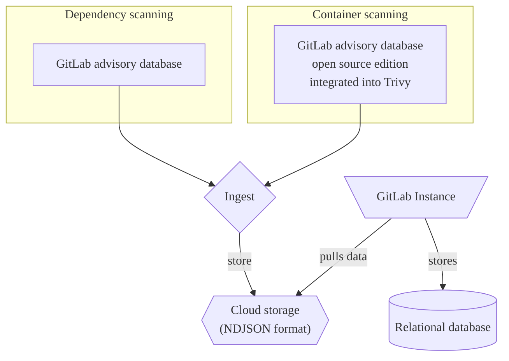

[GitLabセキュリティアドバイザリーデータベース](https://gitlab.com/gitlab-org/security-products/gemnasium-db)は、ソフトウェア依存関係に関するセキュリティアドバイザリーのリポジトリとして機能します。最新のセキュリティアドバイザリーで、毎時間更新されます。

このデータベースは、[依存関係スキャン](../dependency_scanning/_index.md)と[コンテナスキャン](../container_scanning/_index.md)の両方にとって不可欠なコンポーネントです。

[GitLabセキュリティアドバイザリーデータベース (オープンソース版)](https://gitlab.com/gitlab-org/advisories-community)として、GitLabセキュリティアドバイザリーデータベースのFreeかつオープンソース版も利用できます。オープンソース版は同じ更新を受け取りますが、30日遅延します。

## 標準化 {#standardization}

アドバイザリーでは、脆弱性とその影響を効果的に伝達するために、標準化されたプラクティスを採用しています。

- [CVE](../terminology/_index.md#cve)
- [CVSS](../terminology/_index.md#cvss)
- [CWE](../terminology/_index.md#cwe)

## データベースを調査する {#explore-the-database}

データベースのコンテンツを表示するには、[GitLabセキュリティアドバイザリーデータベース](https://advisories.gitlab.com)のホームページにアクセスしてください。ホームページでは、次のことができます:

- 識別子、パッケージ名、および説明でデータベースを検索します。
- 最近追加されたアドバイザリーを表示します。
- カバレッジや更新頻度などの統計情報を表示します。

### 検索 {#search}

各アドバイザリーには、次の詳細が記載されたページがあります:

- **識別子**: 公開識別子。たとえば、CVE ID、GHSA ID、またはGitLab内部ID（`GMS-<year>-<nr>`）など。
- **Package Slug**（パッケージSlug）: パッケージの種類とパッケージ名がスラッシュで区切られています。
- **脆弱性**: セキュリティ上の欠陥の簡単な説明。
- **説明**: セキュリティ上の欠陥と潜在的なリスクの詳細な説明。
- **Affected Versions**（影響を受けるバージョン）: 影響を受けるバージョン:
- **解決策**: 脆弱性を修正する方法。
- **Last Modified**（最終更新日）: アドバイザリーが最後に変更された日付。

## オープンソース版 {#open-source-edition}

GitLabは、データベースのFreeかつオープンソース版である[GitLabセキュリティアドバイザリーデータベース（オープンソース版）](https://gitlab.com/gitlab-org/advisories-community)を提供しています。

オープンソース版は、GitLabセキュリティアドバイザリーデータベースの一定期間遅延したクローンであり、MITライセンスが付与されており、30日より古いか、`community-sync`フラグが付いたGitLabセキュリティアドバイザリーデータベースのすべてのアドバイザリーが含まれています。

## インテグレーション {#integrations}

- [依存関係スキャン](../dependency_scanning/_index.md)
- [コンテナスキャン](../container_scanning/_index.md)
- サードパーティ製のツール



GitLabセキュリティアドバイザリーデータベースの条項では、サードパーティ製のツールによるGitLabセキュリティアドバイザリーデータベースに含まれるデータの使用は禁止されています。サードパーティ製のインテグレーターは、代わりにMITライセンスが付与された、時間遅延型の[リポジトリクローン](https://gitlab.com/gitlab-org/advisories-community)を使用できます。



### データベースの使用方法 {#how-the-database-can-be-used}

例として、継続的な脆弱性スキャンの一環として、アドバイザリーの取り込みプロセスにおけるデータベースのソースとしての使用を強調します。

## メンテナンス {#maintenance}

脆弱性調査チームは、GitLabセキュリティアドバイザリーデータベースおよびGitLabセキュリティアドバイザリーデータベース（オープンソース版）のメンテナンスと定期的な更新を担当します。

コミュニティのコントリビュートは、[advisories-community](https://gitlab.com/gitlab-org/advisories-community)で`community-sync`フラグを介してアクセスできます。

## 脆弱性データベースにコントリビュートする {#contributing-to-the-vulnerability-database}

リストされていない脆弱性をご存知の場合は、イシューをオープンするか、脆弱性を送信して、GitLabセキュリティアドバイザリーデータベースにコントリビュートできます。

詳細については、[コントリビュートガイドライン](https://gitlab.com/gitlab-org/security-products/gemnasium-db/-/blob/master/CONTRIBUTING.md)を参照してください。

## ライセンス {#license}

GitLabセキュリティアドバイザリーデータベースは、[GitLabセキュリティアドバイザリーデータベースの条項](https://gitlab.com/gitlab-org/security-products/gemnasium-db/-/blob/master/LICENSE.md#gitlab-advisory-database-term)に従って自由にアクセスできます。
