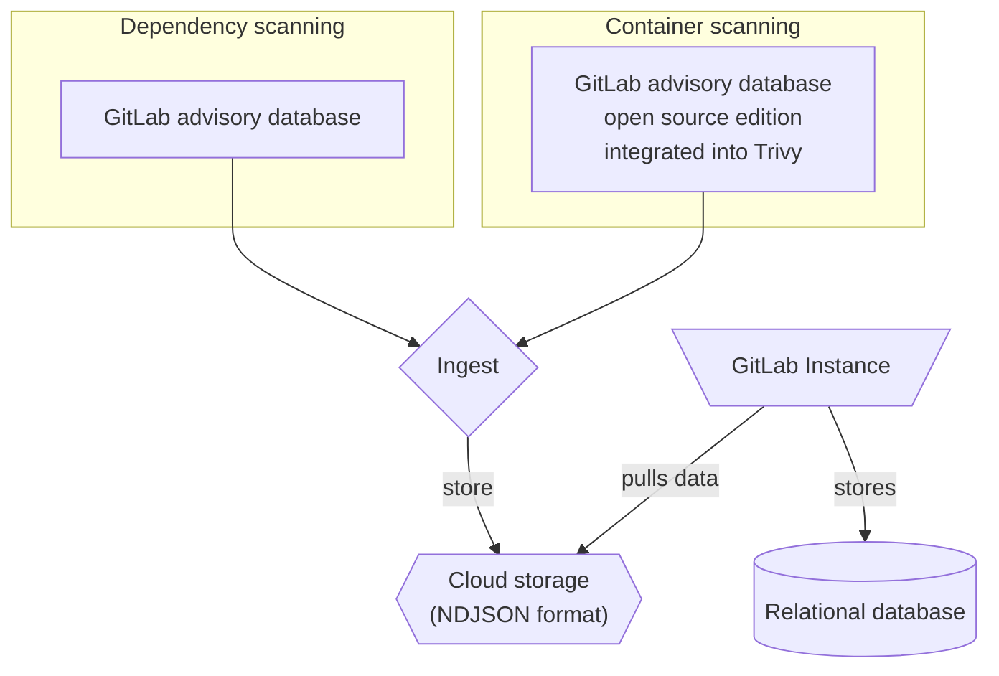

この[GitLab Advisory Database](https://gitlab.com/gitlab-org/security-products/gemnasium-db)（GLAD）は、ソフトウェアの依存関係に関連するセキュリティアドバイザリのリポジトリとして機能します。最新のセキュリティアドバイザリが1時間ごとに更新されます。

このデータベースは、[依存関係スキャン](../dependency_scanning/_index.md)と[コンテナスキャン](../container_scanning/_index.md)の両方にとって不可欠なコンポーネントです。

GitLab Advisory Databaseの無料のオープンソースバージョンは、[GitLab Advisory Database（オープンソースエディション）](https://gitlab.com/gitlab-org/advisories-community)としても利用できます。オープンソースエディションは、同じアップデートを受け取りますが、30日間の遅延があります。

## GitLab Malware Advisory {#gitlab-malware-advisories}



- プラン: Ultimate
- 提供形態: GitLab.com、GitLab Self-Managed、GitLab Dedicated
- ステータス: ベータ版





- GitLab 19.3で`sync_malware_advisories`および`ingest_malware_advisories`[フラグ](../../../administration/feature_flags/_index.md)とともに[導入](https://gitlab.com/groups/gitlab-org/-/epics/20876)されました。デフォルトでは無効になっています。
- GitLab 19.3で[GitLab.com、GitLab Self-Managed、およびGitLab Dedicatedで有効になりました](https://gitlab.com/gitlab-org/gitlab/-/merge_requests/249740)。



> [!flag]
> この機能の利用可否は、機能フラグによって制御されます。詳細については、履歴を参照してください。

GitLabは、パッケージレジストリで見つかった既知の悪意のあるパッケージに関するプライベートなアドバイザリデータベースを維持しています。GitLab Malware Advisory（GLAM）は、このページの他の箇所で説明されているGLADアドバイザリとは別のものです。GitLabはこれらのアドバイザリをバックグラウンドで自動的にGitLabインスタンスに同期します。

GitLabはこれらのアドバイザリを次の3つの情報源から取得します:

- この[OpenSSF malicious-packages project](https://github.com/ossf/malicious-packages)は、悪意のあるパッケージのレポートを集めたオープンソースのリポジトリです。
- GitLabが実行する公開パッケージレジストリのスキャン。
- パッケージレジストリからのアドバイザリデータのアップストリームフィード。

各マルウェアアドバイザリには`GLAM-`で始まる`GLAM-<year>-<month>-<sequence>`形式のIDがあります。たとえば、`GLAM-2026-09-00138`のようになります。これらのアドバイザリから作成された脆弱性は、そのIDを識別子として持ち、CVE IDは持ちません。

> [!note]
> [オフライン環境](../offline_deployments/_index.md)では、GitLabはこれらアドバイザリを自動的に同期できません。代わりに、インターネットにアクセスできるマシンで[ダウンロード](../../../topics/offline/quick_start_guide.md#download-gitlab-v3-malware-advisories)し、インスタンスにコピーします。

これらのアドバイザリは3つの目的を果たします:

- [依存関係スキャン](../dependency_scanning/_index.md#dependency-scanning-using-sbom)は、パイプラインが悪意のあるパッケージを検出したときに、これらを使用して脆弱性を作成します。
- [継続的脆弱性スキャン](../continuous_vulnerability_scanning/_index.md#malicious-packages)は、パイプラインの実行を必要とせずに脆弱性を作成するためにこれらを使用します。
- [マージリクエスト承認ポリシー](../policies/merge_request_approval_policies.md#block-malicious-packages-with-the-malware-rule)は、これらを使用して悪意のあるパッケージを導入するマージリクエストをブロックします。

### サポートされているパッケージタイプ {#supported-package-types}

マルウェアアドバイザリは、以下の[PURLタイプ](https://github.com/package-url/purl-spec/blob/346589846130317464b677bc4eab30bf5040183a/PURL-TYPES.rst)を持つコンポーネントで利用できます:

- `cargo`
- `go`
- `maven`
- `npm`
- `nuget`
- `pypi`
- `rubygem`

これは、[通常のアドバイザリ](../dependency_scanning/continuous_dependency_scanning/_index.md#supported-package-types)でサポートされているPURLタイプのサブセットです。`conan`、`packagist`、`pub`、または`swift`のマルウェアアドバイザリはないため、これらのPURLタイプを持つコンポーネントが悪意があるとフラグが付けられることはありません。`apk`や`deb`のようなコンテナスキャンPURLタイプについても、マルウェアアドバイザリはありません。

## 標準化 {#standardization}

GitLabアドバイザリは、脆弱性とその影響を伝えるために標準化されたプラクティスを使用しています。

- [共通脆弱性識別子](../terminology/_index.md#cve)
- [共通脆弱性評価システム](../terminology/_index.md#cvss)
- [CWE](../terminology/_index.md#cwe)

## データベースを探索する {#explore-the-database}

データベースの内容を表示するには、[GitLab Advisory Database](https://advisories.gitlab.com)のホームページにアクセスしてください。ホームページでは、次のことができます:

- 識別子、パッケージ名、および説明でデータベースを検索します。
- 最近追加されたアドバイザリを表示します。
- カバレッジや更新頻度を含む統計情報を表示します。

### 検索 {#search}

各アドバイザリには、以下の詳細が記載されたページがあります:

- **識別子**: 公開識別子。例えば、CVE ID、GHSA ID、またはGitLab内部ID（`GMS-<year>-<nr>`）です。
- **パッケージSlug**: スラッシュで区切られたパッケージタイプとパッケージ名。
- **脆弱性**: セキュリティ上の欠陥の簡単な説明。
- **説明**: セキュリティ上の欠陥と潜在的なリスクの詳細な説明。
- **影響を受けるバージョン**: 影響を受けるバージョン。
- **解決策**: 脆弱性を修正する方法。
- **最終更新日**: アドバイザリが最後に変更された日付。

### GraphQL API {#graphql-api}



- プラン: Ultimate
- 提供形態: GitLab.com、GitLab Self-Managed
- ステータス: 実験的機能





- GitLab 18.11で`pm_advisory_graphql`[機能フラグ](../../../administration/feature_flags/_index.md)とともに[導入](https://gitlab.com/gitlab-org/gitlab/-/work_items/503307)されました。デフォルトでは無効になっています。これは[実験的機能](../../../policy/development_stages_support.md)です。



> [!flag]
> この機能の利用可否は、機能フラグによって制御されます。詳細については、履歴を参照してください。この機能はテストには利用できますが、本番環境での使用には適していません。

識別子で個別または複数のアドバイザリを検索するには、以下のGraphQLエンドポイントを使用します:

- [`Query.packageMetadataAdvisory`を使用して単一のアドバイザリを検索する](../../../api/graphql/reference/_index.md#querypackagemetadataadvisory)
- [`Query.packageMetadataAdvisories`を使用して複数のアドバイザリを検索する](../../../api/graphql/reference/_index.md#querypackagemetadataadvisories)

#### 例 {#examples}

##### 単一のアドバイザリ {#single-advisory}

識別子で単一のアドバイザリを検索するには:

```graphql
{
  packageMetadataAdvisory(identifier: "CVE-2026-34598") {
    id,
    title,
    description,
    publishedDate
    identifiers {
      name
      url
    }
  }
}
```

次のような結果が返されます:

```json
{
  "data": {
    "packageMetadataAdvisory": {
      "id": "gid://gitlab/PackageMetadata::Advisory/8295281",
      "title": "YesWiki has Persistent Blind XSS at \"/?BazaR&vue=consulter\"",
      "description": "A stored and blind XSS vulnerability exists in the form title field. A malicious attacker can inject JavaScript without any authentication via a form title that is saved in the backend database. When any user visits that injected page, the JavaScript payload gets executed.\n\nType: Stored and Blind Cross-Site Scripting (XSS)\nAffected Component: form title input field\nAuthentication Required: No (Unauthenticated attack possible)\nImpact: Arbitrary JavaScript execution in victim's browser",
      "publishedDate": "2026-04-01",
      "identifiers": [
        {
          "name": "CVE-2026-34598",
          "url": "https://cve.mitre.org/cgi-bin/cvename.cgi?name=CVE-2026-34598"
        },
        {
          "name": "GHSA-37fq-47qj-6j5j",
          "url": "https://github.com/advisories/GHSA-37fq-47qj-6j5j"
        },
        {
          "name": "CWE-79",
          "url": "https://cwe.mitre.org/data/definitions/79.html"
        },
        {
          "name": "CWE-87",
          "url": "https://cwe.mitre.org/data/definitions/87.html"
        },
        {
          "name": "CWE-937",
          "url": "https://cwe.mitre.org/data/definitions/937.html"
        },
        {
          "name": "CWE-1035",
          "url": "https://cwe.mitre.org/data/definitions/1035.html"
        }
      ]
    }
  },
  "correlationId": "9f10f45bdb871a6e-MEL"
}
```

##### 複数のアドバイザリ {#multiple-advisories}

識別子で複数のアドバイザリを検索するには:

```graphql
{
  packageMetadataAdvisories(identifiers: ["CVE-2026-34598", "CVE-2026-34601"]) {
    nodes {
      id
      title
      description
      publishedDate
      identifiers {
        name
        url
      }
    }
  }
}
```

次のような結果が返されます:

```json
{
  "data": {
    "packageMetadataAdvisories": {
      "nodes": [
        {
          "id": "gid://gitlab/PackageMetadata::Advisory/8295281",
          "title": "YesWiki has Persistent Blind XSS at \"/?BazaR&vue=consulter\"",
          "description": "A stored and blind XSS vulnerability exists in the form title field. A malicious attacker can inject JavaScript without any authentication via a form title that is saved in the backend database. When any user visits that injected page, the JavaScript payload gets executed.\n\nType: Stored and Blind Cross-Site Scripting (XSS)\nAffected Component: form title input field\nAuthentication Required: No (Unauthenticated attack possible)\nImpact: Arbitrary JavaScript execution in victim's browser",
          "publishedDate": "2026-04-01",
          "identifiers": [
            {
              "name": "CVE-2026-34598",
              "url": "https://cve.mitre.org/cgi-bin/cvename.cgi?name=CVE-2026-34598"
            },
            {
              "name": "GHSA-37fq-47qj-6j5j",
              "url": "https://github.com/advisories/GHSA-37fq-47qj-6j5j"
            },
            {
              "name": "CWE-79",
              "url": "https://cwe.mitre.org/data/definitions/79.html"
            },
            {
              "name": "CWE-87",
              "url": "https://cwe.mitre.org/data/definitions/87.html"
            },
            {
              "name": "CWE-937",
              "url": "https://cwe.mitre.org/data/definitions/937.html"
            },
            {
              "name": "CWE-1035",
              "url": "https://cwe.mitre.org/data/definitions/1035.html"
            }
          ]
        },
        {
          "id": "gid://gitlab/PackageMetadata::Advisory/8295301",
          "title": "xmldom: XML injection via unsafe CDATA serialization allows attacker-controlled markup insertion",
          "description": "`@xmldom/xmldom` allows attacker-controlled strings containing the CDATA terminator `]]>` to be inserted into a `CDATASection` node. During serialization, `XMLSerializer` emitted the CDATA content verbatim without rejecting or safely splitting the terminator. As a result, data intended to remain text-only became **active XML markup** in the serialized output, enabling XML structure\ninjection and downstream business-logic manipulation.\n\nThe sequence `]]>` is not allowed inside CDATA content and must be rejected or safely handled during serialization. ([MDN Web Docs](https://developer.mozilla.org/))",
          "publishedDate": "2026-04-01",
          "identifiers": [
            {
              "name": "CVE-2026-34601",
              "url": "https://cve.mitre.org/cgi-bin/cvename.cgi?name=CVE-2026-34601"
            },
            {
              "name": "GHSA-wh4c-j3r5-mjhp",
              "url": "https://github.com/advisories/GHSA-wh4c-j3r5-mjhp"
            },
            {
              "name": "CWE-91",
              "url": "https://cwe.mitre.org/data/definitions/91.html"
            },
            {
              "name": "CWE-937",
              "url": "https://cwe.mitre.org/data/definitions/937.html"
            },
            {
              "name": "CWE-1035",
              "url": "https://cwe.mitre.org/data/definitions/1035.html"
            }
          ]
        },
        {
          "id": "gid://gitlab/PackageMetadata::Advisory/8295310",
          "title": "xmldom: XML injection via unsafe CDATA serialization allows attacker-controlled markup insertion",
          "description": "`@xmldom/xmldom` allows attacker-controlled strings containing the CDATA terminator `]]>` to be inserted into a `CDATASection` node. During serialization, `XMLSerializer` emitted the CDATA content verbatim without rejecting or safely splitting the terminator. As a result, data intended to remain text-only became **active XML markup** in the serialized output, enabling XML structure\ninjection and downstream business-logic manipulation.\n\nThe sequence `]]>` is not allowed inside CDATA content and must be rejected or safely handled during serialization. ([MDN Web Docs](https://developer.mozilla.org/))",
          "publishedDate": "2026-04-01",
          "identifiers": [
            {
              "name": "CVE-2026-34601",
              "url": "https://cve.mitre.org/cgi-bin/cvename.cgi?name=CVE-2026-34601"
            },
            {
              "name": "GHSA-wh4c-j3r5-mjhp",
              "url": "https://github.com/advisories/GHSA-wh4c-j3r5-mjhp"
            },
            {
              "name": "CWE-91",
              "url": "https://cwe.mitre.org/data/definitions/91.html"
            },
            {
              "name": "CWE-937",
              "url": "https://cwe.mitre.org/data/definitions/937.html"
            },
            {
              "name": "CWE-1035",
              "url": "https://cwe.mitre.org/data/definitions/1035.html"
            }
          ]
        },
        {
          "id": "gid://gitlab/PackageMetadata::Advisory/9800476",
          "title": "xmldom: xmldom: XML structure injection via CDATA terminator",
          "description": "xmldom is a pure JavaScript W3C standard-based (XML DOM Level 2 Core) `DOMParser` and `XMLSerializer` module. In xmldom versions 0.6.0 and prior and @xmldom/xmldom prior to versions 0.8.12 and 0.9.9, xmldom/xmldom allows attacker-controlled strings containing the CDATA terminator ]]> to be inserted into a CDATASection node. During serialization, XMLSerializer emitted the CDATA content verbatim without rejecting or safely splitting the terminator. As a result, data intended to remain text-only became active XML markup in the serialized output, enabling XML structure injection and downstream business-logic manipulation. This issue has been patched in xmldom version 0.6.0 and @xmldom/xmldom versions 0.8.12 and 0.9.9.",
          "publishedDate": "2026-04-02",
          "identifiers": [
            {
              "name": "CVE-2026-34601",
              "url": "https://cve.mitre.org/cgi-bin/cvename.cgi?name=CVE-2026-34601"
            },
            {
              "name": "CWE-91",
              "url": "https://cwe.mitre.org/data/definitions/91.html"
            }
          ]
        }
      ]
    }
  },
  "correlationId": "9f10f5072e0f1a6e-MEL"
}
```

## オープンソースエディション {#open-source-edition}

GitLabは、無料のオープンソース版データベースである[GitLab Advisory Database（オープンソースエディション）](https://gitlab.com/gitlab-org/advisories-community)を提供しています。

オープンソース版は、GitLab Advisory Databaseの内容を時間差で反映するMITライセンスのクローンであり、30日以上前のすべてのアドバイザリ、または`community-sync`フラグが設定されているアドバイザリが含まれています。

## インテグレーション {#integrations}

- [依存関係スキャン](../dependency_scanning/_index.md)
- [コンテナスキャン](../container_scanning/_index.md)
- サードパーティツール

> [!note]
> GitLab Advisory Databaseの利用規約により、GitLab Advisory Databaseに含まれるデータのサードパーティツールによる使用は禁止されています。サードパーティのインテグレーターは、代わりにMITライセンスの下で提供される時限[リポジトリクローン](https://gitlab.com/gitlab-org/advisories-community)を使用できます。

### データベースの活用方法 {#how-the-database-can-be-used}

次の例では、継続的脆弱性スキャンの一部として、アドバイザリの取り込みプロセスにおける情報源としてデータベースを使用します。


```mermaid
%%{init: { "fontFamily": "GitLab Sans" }}%%
flowchart TB
accTitle: Advisory ingestion process
accDescr: Sequence of actions that make up the advisory ingestion process.

    subgraph Dependency scanning
        A[GitLab advisory database]
    end
    subgraph Container scanning
        C[GitLab advisory database
          open source edition
          integrated into Trivy]
    end
    A --> B{Ingest}
    C --> B
    B --> |store| D{{"Cloud storage
                     (NDJSON format)"}}
    F[\GitLab Instance/] --> |pulls data| D
    F --> |stores| G[(Relational database)]
```

## メンテナンス {#maintenance}

GitLab Advisory DatabaseおよびGitLab Advisory Database（オープンソースエディション）のメンテナンスと定期的な更新は脆弱性リサーチチームが担当しています。

コミュニティコントリビュートは、`community-sync`フラグを介して[advisories-community](https://gitlab.com/gitlab-org/advisories-community)でアクセス可能です。

## 脆弱性データベースにコントリビュートする {#contributing-to-the-vulnerability-database}

リストにない脆弱性をご存じの場合は、イシューを作成するか、その脆弱性を提出することで、GitLab Advisory Databaseにコントリビュートできます。

詳細については、[コントリビュートガイドライン](https://gitlab.com/gitlab-org/security-products/gemnasium-db/-/blob/master/CONTRIBUTING.md)を参照してください。

## ライセンス {#license}

GitLab Advisory Databaseは、[GitLab Advisory Databaseの利用規約](https://gitlab.com/gitlab-org/security-products/gemnasium-db/-/blob/master/LICENSE.md#gitlab-advisory-database-term)に従って自由にアクセスできます。
