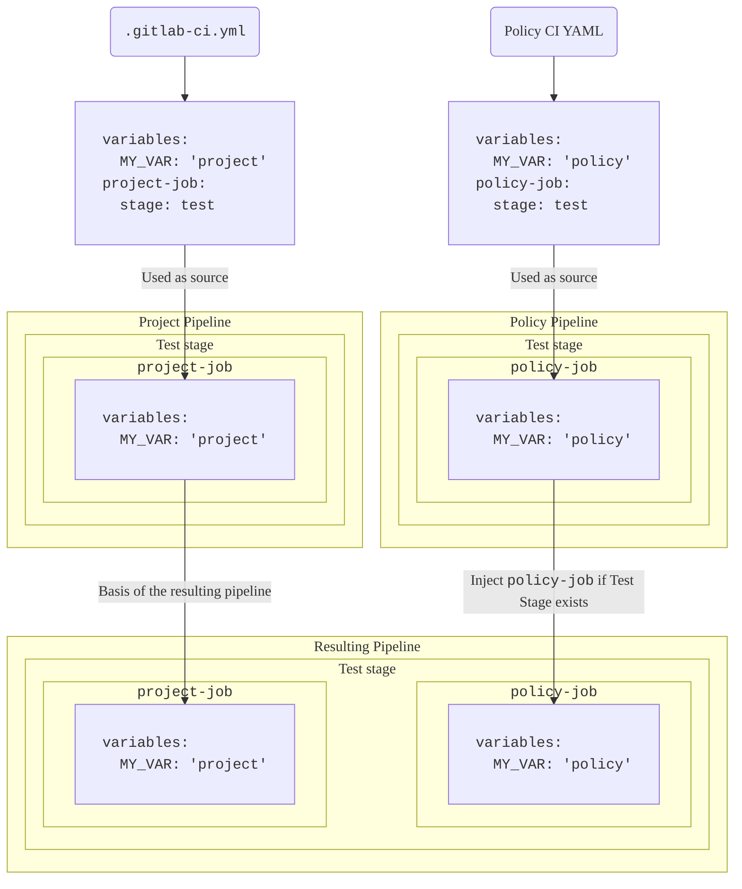



- プラン: Ultimate
- 製品: GitLab.com、GitLab Self-Managed、GitLab Dedicated





- `pipeline_execution_policy_type`という名前の[フラグを使用](../../../administration/feature_flags.md)して、GitLab 17.2で[導入](https://gitlab.com/groups/gitlab-org/-/epics/13266)されました。デフォルトで有効になっています。
- GitLab 17.3で[一般提供](https://gitlab.com/gitlab-org/gitlab/-/issues/454278)になりました。機能フラグ`pipeline_execution_policy_type`を削除しました。



パイプライン実行ポリシーを使用して、適用可能なすべてのプロジェクトにCI/CDジョブを適用します。

- <i class="fa fa-youtube-play youtube" aria-hidden="true"></i> ビデオチュートリアルについては、[Security Policies: Pipeline Execution Policy Type（セキュリティポリシー: パイプライン実行ポリシーの種類（英語））](https://www.youtube.com/watch?v=QQAOpkZ__pA)をご覧ください。

## パイプライン実行ポリシー（複数）のスキーマ 



- GitLab 17.4で`suffix`フィールドを[有効](https://gitlab.com/gitlab-org/gitlab/-/merge_requests/159858)にしました。
- GitLab 17.7で、`.pipeline-policy-pre`ステージが完了するまで、それ以降のステージが待機するようにパイプラインの実行を[変更](https://gitlab.com/gitlab-org/gitlab/-/merge_requests/165096)しました。



パイプライン実行ポリシーを含むYAMLファイルは、`pipeline_execution_policy`キーの下にネストされたパイプライン実行ポリシーのスキーマに一致するオブジェクトの配列で構成されます。セキュリティポリシープロジェクトごとに、`pipeline_execution_policy`キーの下に最大5つのポリシーを設定できます。最初の5つのポリシーの後に設定されたポリシーは適用されません。

新しいポリシーを保存すると、GitLabは[このJSONスキーマ](https://gitlab.com/gitlab-org/gitlab/-/blob/master/ee/app/validators/json_schemas/security_orchestration_policy.json)に照らしてその内容を検証します。[JSONスキーマ](https://json-schema.org/)に慣れていない方は、代わりに以下のセクションと表をご覧ください。

| フィールド | 型 | 必須 | 説明 |
|-------|------|----------|-------------|
| `pipeline_execution_policy` | パイプライン実行ポリシーの`array` | true | パイプライン実行ポリシーのリスト（最大5つ） |

## パイプライン実行ポリシーのスキーマ

| フィールド | 型 | 必須 | 説明 |
|-------|------|----------|-------------|
| `name` | `string` | true | ポリシーの名前。最大255文字。|
| `description`（オプション） | `string` | true | ポリシーの説明。 |
| `enabled` | `boolean` | true | ポリシーを有効（`true`）または無効（`false`）にするフラグ。 |
| `content` | [`content`](#content-type)の`object` | true | プロジェクトのパイプラインに挿入するCI/CD設定への参照。 |
| `pipeline_config_strategy` | `string` | false | `inject_policy`、`inject_ci`（非推奨）、または`override_project_ci`を使用できます。詳細については、[パイプライン戦略](#pipeline-configuration-strategies)を参照してください。 |
| `policy_scope` | [`policy_scope`](_index.md#scope)の`object` | false | 指定したプロジェクト、グループ、またはコンプライアンスフレームワークのラベルに基づいてポリシーのスコープを設定します。 |
| `suffix` | `string` | false | `on_conflict`（デフォルト）または`never`のいずれかを指定できます。ジョブの命名の競合を処理するための動作を定義します。`on_conflict`は、一意性を損なうジョブに対して、ジョブ名に一意のサフィックスを適用します。`never`は、プロジェクトおよび適用可能なすべてのポリシーでジョブ名が一意でない場合、パイプラインを失敗させます。 |
| `skip_ci` | [`skip_ci`](pipeline_execution_policies.md#skip_ci-type)の`object` | false | ユーザーが`skip-ci`ディレクティブを適用できるかどうかを定義します。デフォルトでは、`skip-ci`の使用は無視されるため、パイプライン実行ポリシーを含むパイプラインはスキップできません。 |

次の点に注意してください。

- パイプラインをトリガーするユーザーには、少なくとも、パイプライン実行ポリシーに指定されたパイプライン実行ファイルに対する読み取りアクセス権が必要です。そうでない場合、パイプラインは開始されません。
- パイプライン実行ファイルの削除または名前の変更が行われた場合、ポリシーが適用されたプロジェクトのパイプラインが動作しなくなる可能性があります。
- パイプライン実行ポリシーのジョブは、次の2つの予約済みステージのいずれかに割り当てることができます。
  - パイプラインの先頭にある`.pipeline-policy-pre`（`.pre`ステージの前）。
  - パイプラインの最後にある`.pipeline-policy-post`（`.post`ステージの後）。
- 予約済みステージのいずれかにジョブを挿入すると、常に動作することが保証されます。実行ポリシーのジョブは、標準（ビルド、テスト、デプロイ）ステージまたはユーザー定義のステージに割り当てることもできます。ただし、この場合、ジョブはプロジェクトのパイプライン設定に応じて無視されることがあります。
- パイプライン実行ポリシーの外部でジョブを予約済みステージに割り当てることはできません。
- `needs`キーワードに関係なく、`.pipeline-policy-pre`ステージが完了するまで、パイプライン内のジョブは開始されません。パイプラインの先頭でノンブロッキングジョブを実行するには、`.pre`ステージの前に実行するカスタムステージを追加します。たとえば、`stages: [custom-non-blocking-stage, .pre]`のようになります。
- パイプライン実行ポリシーには、一意のジョブ名を選択してください。一部のCI/CD設定はジョブ名に基づいているため、同じパイプラインに同じジョブ名が複数ある場合、望ましくない結果が生じる可能性があります。たとえば、`needs`キーワードを使用すると、あるジョブが別のジョブに依存します。名前が`example`のジョブが複数ある場合、`example`ジョブ名を`needs`するジョブは、`example`ジョブインスタンスの1つにのみ無作為に依存します。
- パイプライン実行ポリシーは、プロジェクトにCI/CD設定ファイルがない場合でも有効です。
- 適用されるサフィックスには、ポリシーの順序が重要です。
- 特定のプロジェクトに適用されるポリシーに`suffix: never`がある場合、同じ名前の別のジョブがパイプラインにすでに存在する場合、パイプラインは失敗します。
- パイプライン実行ポリシーは、すべてのブランチおよびパイプラインソースで適用されます。[ワークフローのルール](../../../ci/yaml/workflow.md)を使用して、パイプライン実行ポリシーを適用するタイミングを制御できます。

### ジョブの命名に関するベストプラクティス



- 命名の競合処理はGitLab 17.4で[導入](https://gitlab.com/gitlab-org/gitlab/-/issues/473189)されました。



セキュリティポリシーに関係するジョブを視覚的に示す表示はありません。ジョブ名に一意のプレフィックスまたはサフィックスを追加すると、ジョブの識別が容易になり、ジョブ名の競合を回避できます。

例:

- `policy1:deployments:sast` - 良い例。ポリシーとプロジェクト全体で一意です。
- `sast` - 悪い例。他の場所で使用される可能性があります。

パイプライン実行ポリシーは、`suffix`属性に応じて命名の競合を処理します。同じ名前のジョブが複数ある場合、次のように処理します。

- `on_conflict`（デフォルト）を使用すると、ジョブ名がパイプライン内の別のジョブと競合する場合、サフィックスがジョブに追加されます。
- `never`を使用すると、競合が発生した場合にサフィックスは追加されず、パイプラインは失敗します。

サフィックスは、ジョブがメインパイプラインにマージされる順序に基づいて追加されます。

順序は次のとおりです。

1. プロジェクトパイプラインのジョブ
1. プロジェクトポリシーのジョブ（該当する場合）
1. グループポリシーのジョブ（該当する場合、階層順、トップレベルグループが最後に適用される）

適用されるサフィックスの形式は次のとおりです。

`:policy-<security-policy-project-id>-<policy-index>`。

サフィックスが追加されたジョブの例: `sast:policy-123456-0`。

セキュリティポリシープロジェクト内の複数のポリシーが同じジョブ名を定義している場合、数値サフィックスは競合するポリシーのインデックスに対応します。

サフィックスが追加されたジョブの例:

- `sast:policy-123456-0`
- `sast:policy-123456-1`

### ジョブステージに関するベストプラクティス

パイプライン実行ポリシーで定義されたジョブは、プロジェクトのCI/CD設定で定義された任意の[ステージ](../../../ci/yaml/_index.md#stage)を使用でき、予約済みステージ`.pipeline-policy-pre`と`.pipeline-policy-post`も使用できます。



ポリシーが`.pre`ステージと`.post`ステージにのみジョブを含んでいる場合、ポリシーのパイプラインは「空」と評価されるため、プロジェクトのパイプラインとマージされません。パイプライン実行ポリシーで`.pre`ステージと`.post`ステージを使用するには、プロジェクトで使用可能な別のステージで実行するもう1つのジョブ（たとえば、`.pipeline-policy-pre`）を含める**必要**があります。



`inject_ci`[パイプライン戦略](#pipeline-configuration-strategies)を使用するときに、対象のプロジェクトに独自の`.gitlab-ci.yml`ファイルがない場合、使用できるステージはデフォルトのパイプラインステージと予約済みステージのみになります。

`inject_policy`[パイプライン戦略](#pipeline-configuration-strategies)を使用するときに、対象のプロジェクトに独自の`.gitlab-ci.yml`ファイルがない場合、すべてのポリシーステージがパイプラインに挿入されます。

CI/CD設定を制御しないプロジェクトにパイプライン実行ポリシーを適用する場合は、`.pipeline-policy-pre`ステージと`.pipeline-policy-post`ステージでジョブを定義する必要があります。これらのステージは、プロジェクトのCI/CD設定に関係なく、常に使用できます。

`override_project_ci`[パイプライン戦略](#pipeline-configuration-strategies)、複数のパイプライン実行ポリシー、カスタムステージを同時に使用する場合、ステージを同じ相対順序で定義して、相互の互換性を確保する必要があります。

有効な設定例:

```yaml
  - override-policy-1 stages: [build, test, policy-test, deploy]
  - override-policy-2 stages: [test, deploy]
```

無効な設定例:

```yaml
  - override-policy-1 stages: [build, test, policy-test, deploy]
  - override-policy-2 stages: [deploy, test]
```

1つ以上の`override_project_ci`ポリシーに無効な`stages`設定がある場合、パイプラインは失敗します。

### `content`タイプ

| フィールド | 型 | 必須 | 説明 |
|-------|------|----------|-------------|
| `project` | `string` | true | 同じGitLabインスタンス上のプロジェクトへのGitLabプロジェクトのフルパス。 |
| `file` | `string` | true | ルートディレクトリ（/）を基準にしたファイルのフルパス。YAMLファイルの拡張子は`.yml`または`.yaml`でなければなりません。 |
| `ref` | `string` | false | ファイルの取得元のref。指定しない場合、デフォルトはプロジェクトのHEADです。 |

別のリポジトリに保存されているCI/CD設定を参照するには、ポリシーで`content`タイプを使用します。これにより、複数のポリシーで同じCI/CD設定を再利用できるため、これらの設定のメンテナンスのオーバーヘッドを削減できます。たとえば、ポリシーAとポリシーBで適用するカスタムシークレット検出CI/CD設定がある場合は、1つのYAML設定ファイルを作成し、両方のポリシーでその設定を参照できます。

前提要件:

- `content`タイプを含むポリシーが適用されているプロジェクトでパイプライン実行をトリガーするユーザーには、少なくとも、CI/CDを含むプロジェクトに対する読み取り専用アクセス権が必要です。
- パイプライン実行ポリシーを適用するプロジェクトでは、パイプラインをトリガーするために、ユーザーに少なくとも、CI/CD設定を含むプロジェクトに対する読み取り専用アクセス権が必要です。

  GitLab 17.4以降では、`content`タイプを使用して、セキュリティポリシープロジェクトで指定されたCI/CD設定ファイルに必要な読み取り専用アクセス権を付与できます。これを行うには、セキュリティポリシープロジェクトの一般設定で**パイプライン実行ポリシー**設定を有効にします。この設定を有効にすると、パイプラインをトリガーしたユーザーに、パイプライン実行ポリシーによって適用されるCI/CD設定ファイルを読み取るためのアクセス権が付与されます。この設定では、設定ファイルが保存されているプロジェクトの他の部分へのアクセス権はユーザーに付与されません。詳細については、「[アクセス権を自動的に付与する](#grant-access-automatically)」を参照してください。

### `skip_ci`タイプ



- GitLab 17.7で[導入](https://gitlab.com/gitlab-org/gitlab/-/merge_requests/173480)されました。



パイプライン実行ポリシーは、誰が`[skip ci]`ディレクティブを使用できるかを制御します。`[skip ci]`を使用できる特定のユーザーまたはサービスアカウントを指定すると同時に、重要なセキュリティとコンプライアンスのチェックが確実に実行されるようにすることができます。

`skip_ci`キーワードを使用して、ユーザーが`skip_ci`ディレクティブを適用してパイプラインをスキップできるかどうかを指定します。キーワードを指定しなかった場合、`skip_ci`ディレクティブは無視され、すべてのユーザーはパイプライン実行ポリシーをバイパスできません。

| フィールド                   | 型     | 使用可能な値          | 説明 |
|-------------------------|----------|--------------------------|-------------|
| `allowed` | `boolean`   | `true`、`false` | パイプライン実行ポリシーが適用されたパイプラインで、`skip-ci`ディレクティブの使用を許可（`true`）または禁止（`false`）するフラグ。 |
| `allowlist`             | `object` | `users` | `allowed`フラグに関係なく、`skip-ci`ディレクティブの使用が常に許可されるユーザーを指定します。`users:`の後に、ユーザーIDを表す`id`キーを含んだオブジェクトの配列を指定します。 |

### ポリシーのスコープスキーマ

ポリシーの適用をカスタマイズするには、ポリシーのスコープを定義して、指定したプロジェクト、グループ、またはコンプライアンスフレームワークのラベルを含めるか、除外します。詳細については、「[スコープ](_index.md#scope)」を参照してください。

## CI/CD設定へのアクセスを管理する

プロジェクトにパイプライン実行ポリシーを適用する場合、パイプラインをトリガーするユーザーには、少なくとも、ポリシーのCI/CD設定を含むプロジェクトに対する読み取り専用アクセス権が必要です。プロジェクトへのアクセス権は手動または自動で付与できます。

### アクセス権を手動で付与する

パイプライン実行ポリシーが適用されたパイプラインをユーザーまたはグループが実行できるようにするには、ポリシーのCI/CD設定を含むプロジェクトに招待します。

### アクセス権を自動的に付与する

パイプライン実行ポリシーが適用されたプロジェクトでパイプラインを実行するすべてのユーザーに対して、ポリシーのCI/CD設定へのアクセス権を自動的に付与できます。

前提要件:

- パイプライン実行ポリシーのCI/CD設定がセキュリティポリシープロジェクトに保存されていることを確認してください。
- セキュリティポリシープロジェクトの一般設定で、**パイプライン実行ポリシー**設定を有効にします。

セキュリティポリシープロジェクトがまだなく、最初のパイプライン実行ポリシーを作成する場合は、空のプロジェクトを作成し、セキュリティポリシープロジェクトとしてリンクします。プロジェクトをリンクするには、次の手順を実行します。

- ポリシーを適用するグループまたはプロジェクトで、**セキュリティ** > **ポリシー** > **ポリシープロジェクトを編集**を選択し、セキュリティポリシープロジェクトを選択します。

プロジェクトはセキュリティポリシープロジェクトになり、設定が利用可能になります。

#### 設定

1. ポリシープロジェクトで、**設定** > **一般** > **可視性、プロジェクトの機能、権限**を選択します。
1. 設定**パイプライン実行ポリシー: セキュリティポリシーのソースとしてこのセキュリティポリシープロジェクトにリンクされているプロジェクトのCI/CD設定へのアクセス権を付与します。**を有効にします。
1. ポリシープロジェクトで、ポリシーのCI/CD設定のファイルを作成します。

   ```yaml
   # policy-ci.yml

   policy-job:
     script: ...
   ```

1. ポリシーを適用するグループまたはプロジェクトで、パイプライン実行ポリシーを作成し、セキュリティポリシープロジェクトのCI/CD設定ファイルを指定します。

   ```yaml
   pipeline_execution_policy:
   - name: My pipeline execution policy
     description: Enforces CI/CD jobs
     enabled: true
     pipeline_config_strategy: inject_policy
     content:
       include:
       - project: my-group/my-security-policy-project
         file: policy-ci.yml
   ```

## パイプライン設定の戦略

パイプライン設定の戦略は、ポリシー設定をプロジェクトパイプラインにマージする方法を定義します。パイプライン実行ポリシーは、`.gitlab-ci.yml`ファイルで定義されたジョブを分離されたパイプラインで実行します。このパイプラインは対象のプロジェクトのパイプラインにマージされます。

### `inject_policy`



- GitLab 17.9で[導入されました](https://gitlab.com/gitlab-org/gitlab/-/issues/475152)。



この戦略では、プロジェクトの元のCI/CD設定を完全に置き換えることなく、カスタムCI/CD設定を既存のプロジェクトパイプラインに追加します。これは、新しいセキュリティスキャン、コンプライアンスチェック、カスタムスクリプトの追加など、追加の手順で現在のパイプラインを強化または拡張する場合に適しています。

非推奨の`inject_ci`戦略とは異なり、`inject_policy`を使用すると、カスタムポリシーのステージをパイプラインに挿入できるため、CI/CDワークフローでポリシールールが適用される場所をより細かく制御できます。

複数のポリシーが有効になっている場合、この戦略は各ポリシーからすべてのジョブを挿入します。

この戦略を使用する場合、各パイプラインには分離されたYAML設定があるため、プロジェクトのCI/CD設定はポリシーパイプラインで定義された動作をオーバーライドできません。

`.gitlab-ci.yml`ファイルがないプロジェクトの場合、この戦略は`.gitlab-ci.yml`ファイルを暗黙的に作成します。実行されるパイプラインには、パイプライン実行ポリシーで定義されたジョブのみが追加されます。



パイプライン実行ポリシーで、ポリシージョブが実行されないようにするワークフローのルールを使用する場合、プロジェクトのCI/CDジョブのみが実行されます。プロジェクトで、プロジェクトのCI/CDジョブが実行されないようにするワークフローのルールを使用する場合、パイプライン実行ポリシーのジョブのみが実行されます。



#### ステージの挿入

ポリシーパイプラインのステージは、通常のCI/CD設定に従います。カスタムステージの前後にステージを挿入することにより、カスタムポリシーステージをプロジェクトパイプラインに挿入する順序を定義します。

プロジェクトとポリシーのパイプラインステージは有向非巡回グラフ（DAG）で表され、ノードがステージで、エッジが依存関係を表します。パイプラインを組み合わせる場合、個別のDAGは1つの大きなDAGにマージされます。その後、トポロジカルソートが実行され、すべてのパイプラインからのステージを実行する順序が決定されます。このソートにより、最終的な順序ですべての依存関係が確実に守られます。競合する依存関係がある場合、パイプラインは実行に失敗します。これを修正するには、プロジェクトとポリシーで使用するステージが一致していることを確認します。

ポリシーパイプライン設定でステージが明示的に定義されていない場合、パイプラインはデフォルトのステージ`stages: [build, test, deploy]`を使用します。これらのステージが含まれているにもかかわらず、異なる順序でリストされている場合、パイプラインは`Cyclic dependencies detected when enforcing policies`エラーで失敗します。

以下の例で、この動作を示します。すべての例は、以下のプロジェクトのCI/CD設定を前提としています。

```yaml
# .gitlab-ci.yml
stages: [build, test, deploy]

project-build-job:
  stage: build
  script: ...

project-test-job:
  stage: test
  script: ...

project-deploy-job:
  stage: deploy
  script: ...
```

##### 例1

```yaml
# policy-ci.yml
stages: [test, policy-stage, deploy]

policy-job:
  stage: policy-stage
  script: ...
```

この例では、`policy-stage`ステージは次の場所に挿入する必要があります。

- 存在する場合、`test`ステージの後
- 存在する場合、`deploy`ステージの前

結果: パイプラインには、ステージ`[build, test, policy-stage, deploy]`が含まれます。

特別なケース:

- `.gitlab-ci.yml`がステージを`[build, deploy, test]`として指定した場合、制約を満たすことができないため、パイプラインはエラー`Cyclic dependencies detected when enforcing policies`で失敗します。失敗を修正するには、プロジェクト設定を調整して、ステージをポリシーと一致させる必要があります。
- `.gitlab-ci.yml`がステージを`[build]`として指定した場合、結果のパイプラインにはステージ`[build, policy-stage]`が含まれます。

##### 例2

```yaml
# policy-ci.yml
stages: [policy-stage, deploy]

policy-job:
  stage: policy-stage
  script: ...
```

この例では、`policy-stage`ステージは次の場所に挿入する必要があります。

- 存在する場合、`deploy`ステージの前

結果: パイプラインには、ステージ`[build, test, policy-stage, deploy]`が含まれます。

特別なケース:

- `.gitlab-ci.yml`がステージを`[build, deploy, test]`として指定した場合、結果のパイプラインのステージは`[build, policy-stage, deploy, test]`になります。
- プロジェクトパイプラインに`deploy`ステージがない場合、`policy-stage`ステージはパイプラインの最後（`.pipeline-policy-post`の直前）に挿入されます。

##### 例3

```yaml
# policy-ci.yml
stages: [test, policy-stage]

policy-job:
  stage: policy-stage
  script: ...
```

この例では、`policy-stage`ステージは次の場所に挿入する必要があります。

- 存在する場合、`test`ステージの後

結果: パイプラインには、ステージ`[build, test, deploy, policy-stage]`が含まれます。

特別なケース:

- プロジェクトパイプラインに`test`ステージがない場合、`policy-stage`ステージはパイプラインの最後（`.pipeline-policy-post`の直前）に挿入されます。

##### 例4

```yaml
# policy-ci.yml
stages: [policy-stage]

policy-job:
  stage: policy-stage
  script: ...
```

この例では、`policy-stage`ステージには制約がありません。

結果: パイプラインには、ステージ`[build, test, deploy, policy-stage]`が含まれます。

##### 例5

```yaml
# policy-ci.yml
stages: [check, lint, test, policy-stage, deploy, verify, publish]

policy-job:
  stage: policy-stage
  script: ...
```

この例では、`policy-stage`ステージは次の場所に挿入する必要があります。

- 存在する場合、`check`、`lint`、`test`ステージの後
- 存在する場合、`deploy`、`verify`、`publish`ステージの前

結果: パイプラインには、ステージ`[build, test, policy-stage, deploy]`が含まれます。

特別なケース:

- `.gitlab-ci.yml`がステージを`[check, publish]`として指定した場合、結果のパイプラインにはステージ`[check, policy-stage, publish]`が含まれます。

### `inject_ci`（非推奨）



この機能は、GitLab 17.9で[非推奨](https://gitlab.com/gitlab-org/gitlab/-/issues/475152)になりました。代わりに[`inject_policy`](#inject_policy)を使用してください。この機能はカスタムポリシーのステージの適用をサポートしています。



この戦略では、プロジェクトの元のCI/CD設定を完全に置き換えることなく、カスタムCI/CD設定を既存のプロジェクトパイプラインに追加します。これは、新しいセキュリティスキャン、コンプライアンスチェック、カスタムスクリプトの追加など、追加の手順で現在のパイプラインを強化または拡張する場合に適しています。

複数のポリシーを有効にすると、すべてのジョブが付加的に挿入されます。

この戦略を使用する場合、各パイプラインには分離されたYAML設定があるため、プロジェクトのCI/CD設定はポリシーパイプラインで定義された動作をオーバーライドできません。

`.gitlab-ci.yml`ファイルがないプロジェクトの場合、この戦略は`.gitlab-ci.yml`ファイルを暗黙的に作成します。つまり、パイプライン実行ポリシーで定義されたジョブのみを含むパイプラインが実行されます。



パイプライン実行ポリシーで、ポリシージョブが実行されないようにするワークフローのルールを使用する場合、プロジェクトのCI/CDジョブのみが実行されます。プロジェクトで、プロジェクトのCI/CDジョブが実行されないようにするワークフローのルールを使用する場合、パイプライン実行ポリシーのジョブのみが実行されます。



### `override_project_ci`



- GitLab 17.8で[導入された](https://gitlab.com/gitlab-org/gitlab/-/merge_requests/175088)ワークフローのルールの処理を`policies_always_override_project_ci`という名前の[フラグで](../../../administration/feature_flags.md)更新しました。デフォルトで有効になっています。
- GitLab 17.10で[一般提供](https://gitlab.com/gitlab-org/gitlab/-/issues/512877)されているワークフローのルールの処理を更新しました。機能フラグ`policies_always_override_project_ci`を削除しました。



この戦略は、プロジェクトの既存のCI/CD設定を、パイプライン実行ポリシーによって定義された新しい設定に置き換えます。この戦略は、組織全体のCI/CD標準や、規制の厳しい業界のコンプライアンス要件を適用する場合など、パイプライン全体を標準化または置き換える必要がある場合に最適です。パイプライン設定をオーバーライドするには、CI/CDジョブを定義し、`include:project` を使用しないでください。

この戦略は、`inject_ci`戦略または`inject_policy`戦略を使用する他のポリシーよりも優先されます。`override_project_ci`を含むポリシーが適用される場合、プロジェクトのCI/CD設定は無視されます。ただし、他のセキュリティポリシー設定はオーバーライドされません。

または、プロジェクトのCI/CD設定をオーバーライドする代わりに、プロジェクトの`.gitlab-ci.yml`とマージできます。設定をマージするには、`include:project`を使用します。この戦略を使用すると、ユーザーはプロジェクトのCI/CD設定をパイプライン実行ポリシー設定に含めることができるため、ユーザーはポリシーのジョブをカスタマイズできます。たとえば、ポリシーとプロジェクトのCI/CD設定を1つのYAMLファイルに結合して、`before_script`設定をオーバーライドしたり、スキャンするコンテナに必要なパスを定義するために`CS_IMAGE`などの必要な変数を定義したりできます。[こちら](https://youtu.be/W8tubneJ1X8)に、この動作の短いデモがあります。次の図は、プロジェクトレベルおよびポリシーレベルで定義された変数が、結果のパイプラインでどのように選択されるかを示しています。





パイプライン実行ポリシーのワークフローのルールは、プロジェクトの元のCI/CD設定をオーバーライドします。ポリシーでワークフロールールを定義することにより、ブランチパイプラインの使用を禁止するなど、リンクされているすべてのプロジェクトに適用されるルールを設定できます。



### パイプライン実行ポリシーの設定にプロジェクトのCI/CD設定を含める

`override_project_ci`戦略を使用する場合、プロジェクトの設定をパイプライン実行ポリシーの設定に含めることができます。

```yaml
include:
  - project: $CI_PROJECT_PATH
    ref: $CI_COMMIT_SHA
    file: $CI_CONFIG_PATH

compliance_job:
 ...
```

## CI/CD変数



変数はプレーンテキストのポリシー設定の一部としてGitリポジトリに保存されるため、機密情報や認証情報を変数に保存しないでください。



パイプライン実行ジョブは分離して実行されます。別のポリシーまたはプロジェクトの`.gitlab-ci.yml`ファイルで定義された変数は、パイプライン実行ポリシーでは使用できず、外部から上書きできません。

変数は、グループまたはプロジェクトの設定を使用してパイプライン実行ポリシーと共有できます。これは、標準の[CI/CD変数の優先順位](../../../ci/variables/_index.md#cicd-variable-precedence)ルールに従います。ただし、優先順位ルールは、パイプライン実行ポリシー戦略に応じて異なる可能性があるため、パイプライン実行ポリシーを使用する場合はより複雑になります。

- `inject_policy`戦略: 変数がパイプライン実行ポリシーで定義されている場合、ジョブは常にこの値を使用します。変数がパイプライン実行ポリシーで定義されていない場合、ジョブはグループまたはプロジェクトの設定からの値を適用します。
- `inject_ci`戦略: 変数がパイプライン実行ポリシーで定義されている場合、ジョブは常にこの値を使用します。変数がパイプライン実行ポリシーで定義されていない場合、ジョブはグループまたはプロジェクトの設定からの値を適用します。
- `override_project_ci`戦略: 結果のパイプライン内のすべてのジョブは、ポリシーのジョブとして処理されます。ポリシーで定義された変数（含まれているファイル内の変数を含む）は、プロジェクト変数およびグループ変数よりも優先されます。つまり、含まれているプロジェクトのCI/CD設定にあるジョブからの変数が、プロジェクトとグループの設定で定義された変数よりも優先されます。

パイプライン実行ポリシーの変数の詳細については、「[パイプライン実行ポリシーでの変数の優先順位](#precedence-of-variables-in-pipeline-execution-policies)」を参照してください。

[UIでプロジェクトまたはグループの変数を定義](../../../ci/variables/_index.md#define-a-cicd-variable-in-the-ui)できます。

### パイプライン実行ポリシーでの変数の優先順位

特に`override_project_ci`戦略と一緒にパイプライン実行ポリシーを使用する場合、複数の場所で定義された変数の値の優先順位は、標準のGitLab CI/CDパイプラインとは異なる場合があります。理解しておくべき重要な点を次に示します。

- `override_project_ci`を使用する場合、結果のパイプライン内のすべてのジョブは、含まれているプロジェクトのCI/CD設定からのジョブを含め、ポリシーのジョブと見なされます。
- ポリシーパイプラインで定義された変数（インスタンス全体またはジョブを対象）は、プロジェクトまたはグループの設定で定義された変数よりも優先されます。
- この動作は、プロジェクトのCI/CD設定ファイル（`.gitlab-ci.yml`）に含まれているジョブを含め、すべてのジョブに適用されます。

### 例

プロジェクトのCI/CD設定の変数と、含まれている`.gitlab-ci.yml`ファイルに定義されているジョブ変数が同じ名前を持つ場合、`override_project_ci`を使用するとジョブ変数が優先されます。

プロジェクトのCI/CD設定に、`MY_VAR`変数が定義されています。

- キー: `MY_VAR`
- 値: `Project configuration variable value`

含まれているプロジェクトの`.gitlab-ci.yml`に、同じ変数が定義されています。

```yaml
project-job:
  variables:
    MY_VAR: "Project job variable value"
  script:
    - echo $MY_VAR  # This will output "Project job variable value"
```

この場合、ジョブ変数の値`Project job variable value`が優先されます。

## `[skip ci]`を使用する場合の動作

デフォルトでは、標準のパイプラインがトリガーされないようにするために、ユーザーはコミットメッセージに`[skip ci]`を追加して、保護ブランチにコミットをプッシュできます。ただし、ポリシーは`[skip ci]`ディレクティブを無視するため、パイプライン実行ポリシーで定義されたジョブは常にトリガーされます。これにより、デベロッパーはポリシーで定義されたジョブの実行をスキップできなくなり、重要なセキュリティとコンプライアンスのチェックが常に実行されるようになります。

`[skip ci]`動作のより柔軟な制御については、「[`skip_ci`タイプ](#skip_ci-type)」セクションを参照してください。

## スキャン実行ポリシーとの相互作用

`override_project_ci`戦略と一緒にパイプライン実行ポリシーを使用すると、[スキャン実行ポリシー](scan_execution_policies.md)の動作に影響する可能性があります。

スキャン実行ポリシーは、次の条件をすべて満たす場合にオーバーライドできます。

- スキャン実行ポリシーがプロジェクト用に設定されている。
- パイプライン実行ポリシーがプロジェクト用に設定されている。
- パイプライン実行ポリシーは`override_project_ci`戦略を使用している。

`override_project_ci`戦略は、ポリシーを含め、プロジェクト用に定義されたすべてのCI/CD設定を削除するため、スキャン実行ポリシーは無視されます。

パイプライン実行ポリシーとスキャン実行ポリシーの両方が適用されるようにするには:

- パイプライン実行ポリシーに、`inject_policy`などの別の戦略を使用することを検討してください。
- `override_project_ci`を使用する必要がある場合は、必要なスキャナーテンプレートをパイプライン実行ポリシーに含めて、目的のセキュリティスキャンを維持してください。

これらのポリシータイプ間のインテグレーションの改善のサポートは、[イシュー504434](https://gitlab.com/gitlab-org/gitlab/-/issues/504434)で提案されています。

## 例

次の例は、パイプライン実行ポリシーで実現できることを示しています。

### パイプライン実行ポリシー

[セキュリティポリシープロジェクト](_index.md#security-policy-project)に保存されている`.gitlab/security-policies/policy.yml`ファイルで、次の例を使用できます。

```yaml
---
pipeline_execution_policy:
- name: My pipeline execution policy
  description: Enforces CI/CD jobs
  enabled: true
  pipeline_config_strategy: override_project_ci
  content:
    include:
    - project: my-group/pipeline-execution-ci-project
      file: policy-ci.yml
      ref: main # optional
  policy_scope:
    projects:
      including:
      - id: 361
```

### プロジェクト変数に基づいて適用されるジョブをカスタマイズする

プロジェクト変数の有無に基づいて、適用されるジョブをカスタマイズできます。この例では、`CS_IMAGE`の値は、ポリシーで`alpine:latest`として定義されています。ただし、プロジェクトが`PROJECT_CS_IMAGE`の値も定義している場合、代わりにその値が使用されます。CI/CD変数は、プロジェクトの`.gitlab-ci.yml`ファイルで定義されるのではなく、定義済みのプロジェクト変数である必要があります。

```yaml
variables:
  CS_ANALYZER_IMAGE: "$CI_TEMPLATE_REGISTRY_HOST/security-products/container-scanning:7"
  CS_IMAGE: alpine:latest

policy::container-security:
  stage: .pipeline-policy-pre
  rules:
    - if: $PROJECT_CS_IMAGE
      variables:
        CS_IMAGE: $PROJECT_CS_IMAGE
    - when: always
  script:
    - echo "CS_ANALYZER_IMAGE:$CS_ANALYZER_IMAGE"
    - echo "CS_IMAGE:$CS_IMAGE"
```

### プロジェクトの設定に`before_script`があるセキュリティスキャナーの動作をカスタマイズする

プロジェクトの`.gitlab-ci.yml`にあるポリシーによって適用されるセキュリティジョブの動作をカスタマイズするには、`before_script`をオーバーライドできます。これを行うには、ポリシーで`override_project_ci`戦略を使用し、プロジェクトのCI/CD設定を含めます。パイプライン実行ポリシー設定の例を次に示します。

```yaml
# policy.yml
type: pipeline_execution_policy
name: Secret detection
description: >-
  This policy enforces secret detection and allows projects to override the
  behavior of the scanner.
enabled: true
pipeline_config_strategy: override_project_ci
content:
  include:
    - project: gitlab-org/pipeline-execution-policies/compliance-project
      file: secret-detection.yml
```

```yaml
# secret-detection.yml
include:
  - project: $CI_PROJECT_PATH
    ref: $CI_COMMIT_SHA
    file: $CI_CONFIG_PATH
  - template: Jobs/Secret-Detection.gitlab-ci.yml
```

プロジェクトの`.gitlab-ci.yml`で、スキャナーの`before_script`を定義できます。

```yaml
include:
  - template: Jobs/Secret-Detection.gitlab-ci.yml

secret_detection:
  before_script:
    - echo "Before secret detection"
```

`override_project_ci`を使用し、プロジェクトの設定を含めることで、YAML設定をマージできます。

### パイプライン実行ポリシーでグループ変数またはプロジェクト変数を使用する

パイプライン実行ポリシーでグループ変数またはプロジェクト変数を使用できます。

`PROJECT_VAR="I'm a project"`のプロジェクト変数を使用すると、次のパイプライン実行ポリシージョブの結果は`I'm a project`になります。

```yaml
pipeline execution policy job:
    stage: .pipeline-policy-pre
    script:
    - echo "$PROJECT_VAR"
```

### パイプライン実行ポリシーを使用して変数の値を適用する

パイプライン実行ポリシーで定義された変数の値は、同じ名前のグループ変数またはポリシー変数の値をオーバーライドします。この例では、変数`PROJECT_VAR`のプロジェクトの値が上書きされ、ジョブの結果は`I'm a pipeline execution policy`になります。

```yaml
variables:
  PROJECT_VAR: "I'm a pipeline execution policy"

pipeline execution policy job:
    stage: .pipeline-policy-pre
    script:
    - echo "$PROJECT_VAR"
```

### セキュリティポリシーのスコープが指定された`policy.yml`の例

この例では、セキュリティポリシーの`policy_scope`で以下を指定します。

- ID `9`が適用されたコンプライアンスフレームワークを持つすべてのプロジェクトを含めます。
- ID `456`のプロジェクトを除外します。

```yaml
pipeline_execution_policy:
- name: Pipeline execution policy
  description: ''
  enabled: true
  pipeline_config_strategy: inject_policy
  content:
    include:
    - project: my-group/pipeline-execution-ci-project
      file: policy-ci.yml
  policy_scope:
    compliance_frameworks:
    - id: 9
    projects:
      excluding:
      - id: 456
```

### パイプライン実行ポリシーで`ci_skip`を設定する

次の例では、パイプライン実行ポリシーが適用され、[CIのスキップ](#skip_ci-type)は、ID `75`のユーザーを除き、許可されません。

```yaml
pipeline_execution_policy:
  - name: My pipeline execution policy with ci.skip exceptions
    description: 'Enforces CI/CD jobs'
    enabled: true
    pipeline_config_strategy: inject_policy
    content:
      include:
        - project: group-a/project1
          file: README.md
    skip_ci:
      allowed: false
      allowlist:
        users:
          - id: 75
```
