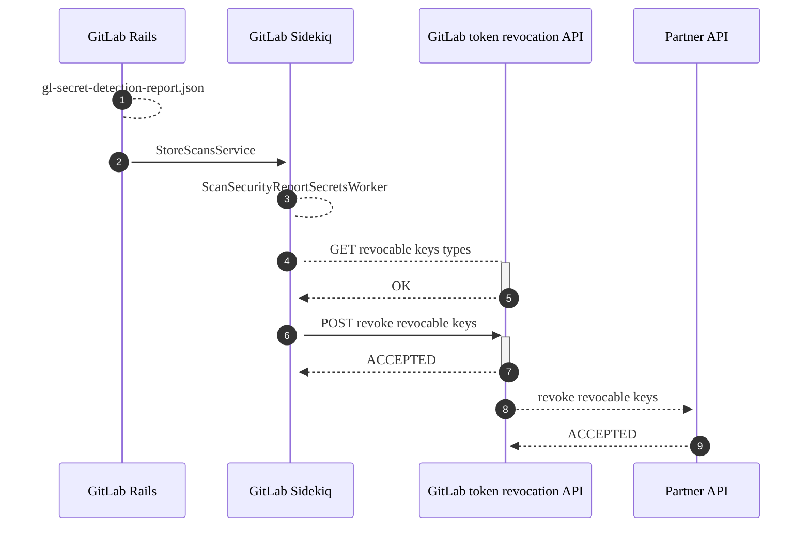
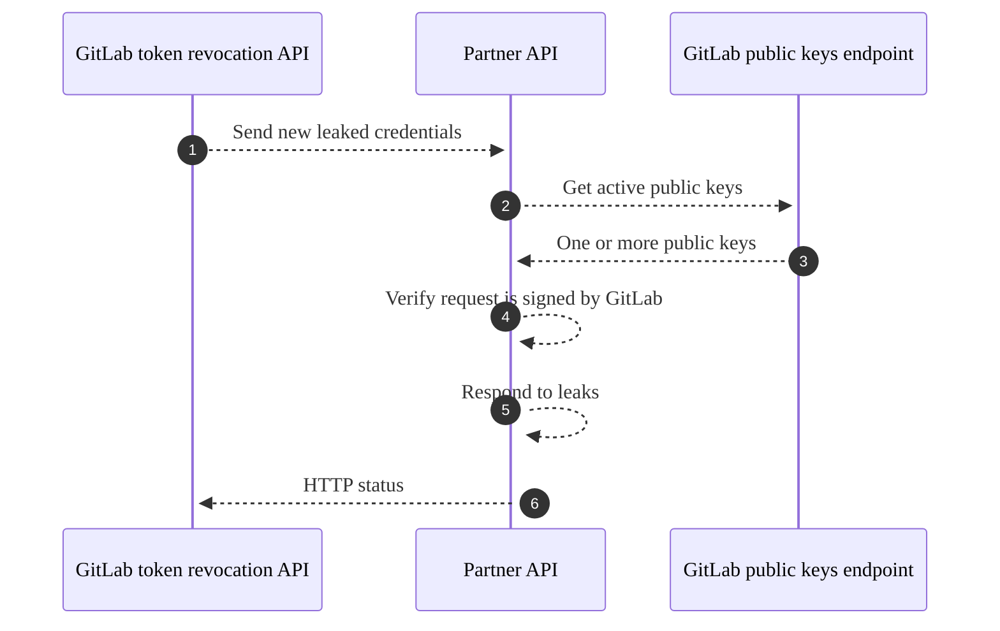



- プラン: Ultimate
- 提供形態: GitLab.com、GitLab Self-Managed、GitLab Dedicated



GitLabのシークレット検出は、特定の種類の流出したシークレットを検出すると、自動的に応答します。自動応答では、次のことが可能です:

- シークレットを自動的に失効します。
- シークレットを発行したパートナーに通知します。パートナーはシークレットを失効し、オーナーに通知するか、その他の方法で悪用を防ぐことができます。

## サポートされているシークレットのタイプとアクション {#supported-secret-types-and-actions}

GitLabは、次の種類のシークレットに対する自動応答をサポートしています:

| シークレットの種類 | 実行されるアクション | GitLab.comでサポート | GitLab Self-Managedでサポート |
| ----- | --- | --- | --- |
| GitLabの[パーソナルアクセストークン](../../profile/personal_access_tokens.md) | すぐにトークンを失効し、オーナーにメールを送信します。<sup>1</sup> | ✅ | ✅ |
| Amazon Web Services（AWS）[IAMアクセスキー](https://docs.aws.amazon.com/IAM/latest/UserGuide/id_credentials_access-keys.html) | AWSに通知します。 | ✅ | ⚙ |
| Google Cloudの[サービスアカウントキー](https://cloud.google.com/iam/docs/best-practices-for-managing-service-account-keys) 、[APIキー](https://cloud.google.com/docs/authentication/api-keys) 、および[OAuthクライアントシークレット](https://support.google.com/cloud/answer/6158849#rotate-client-secret) | Google Cloudに通知します。 | ✅ | ⚙ |
| Postman [APIキー](https://learning.postman.com/docs/developer/postman-api/authentication/) | Postmanに通知します。Postmanは[キーのオーナーに通知します](https://learning.postman.com/docs/administration/managing-your-team/secret-scanner/#protect-postman-api-keys-in-gitlab)。 | ✅ | ⚙ |

**脚注**: 

1. [`gitlab_personal_access_token`](https://gitlab.com/gitlab-org/security-products/secret-detection/secret-detection-rules/-/blob/a9ea19d0d9e06f266a80975467b4b3a8360c04eb/rules/mit/gitlab/gitlab.toml#L2)でのみサポートされます。

**Component legend**（コンポーネント凡例）:

- ✅ - デフォルトで使用可能
- ⚙ - トークン失効APIを使用した手動インテグレーションが必要です

## 機能の可用性 {#feature-availability}



- GitLab 15.11で[デフォルト以外のブランチに対して有効](https://gitlab.com/gitlab-org/gitlab/-/issues/299212)。



認証情報は、シークレット検出で検出された場合にのみ、処理されます:

- 公開プロジェクトでは、公開されている認証情報は脅威が増大するためです。プライベートプロジェクトへの拡大は、[issue 391379](https://gitlab.com/gitlab-org/gitlab/-/issues/391379)で検討されています。
- 技術的な理由から、GitLab Ultimateを使用しているプロジェクトに限られます。すべてのUltimateプランへの拡張は、[issue 391763](https://gitlab.com/gitlab-org/gitlab/-/issues/391763)で追跡されています。

## 高レベルアーキテクチャ {#high-level-architecture}

この図は、後処理フックがGitLabアプリケーションでシークレットを失効する方法を示しています:



1. シークレット検出ジョブを含むパイプラインが完了し、スキャンレポート（**1**）が生成されます。
1. このレポートは、サービスクラスによって処理（**2**）され、トークンの失効が可能な場合は、非同期ワーカーをスケジュールします。
1. この非同期ワーカー（**3**）は、外部にデプロイされたHTTPサービス（**4**および**5**）と通信して、どの種類のシークレットを自動的に失効できるかを判断します。
1. ワーカーは、GitLabトークン失効APIが失効できる検出されたシークレットのリストを送信（**6**および**7**）します。
1. GitLabトークン失効APIは、失効可能な各トークンをそれぞれのベンダーの[パートナーAPI](#implement-a-partner-api)に送信（**8**および**9**）します。

## 流出した認証情報の通知に関するパートナープログラム {#partner-program-for-leaked-credential-notifications}

GitLabは、パートナーが発行した認証情報がGitLab.comの公開リポジトリで流出したシークレットとして検出された場合に、そのパートナーに通知します。クラウド製品またはSaaS製品を運用していて、これらの通知の受信に関心がある場合は、[エピック4944](https://gitlab.com/groups/gitlab-org/-/epics/4944)をご覧ください。パートナーは[パートナーAPIを実装](#implement-a-partner-api)する必要があります。これは、GitLabトークン失効APIによって呼び出すされます。

### パートナーAPIを実装する {#implement-a-partner-api}

パートナーAPIは、GitLabトークン失効APIとインテグレーションして、流出したトークンの失効リクエストを受信して応答します。このサービスは、べき等でレート制限されている、公開されているHTTP APIである必要があります。

このサービスへのリクエストには、1つ以上の流出したトークンと、リクエスト本文の署名を含むヘッダーを含めることができます。この署名を使用して受信リクエストを検証し、GitLabからの本物のリクエストであることを証明することを強くお勧めします。次の図は、流出したトークンを受信、検証、失効するために必要なステップを示しています:



1. GitLabトークン失効APIは、パートナーAPIに（**1**）[失効リクエスト](#revocation-request)を送信します。このリクエストには、公開キー識別子とリクエスト本文の署名を含むヘッダーが含まれています。
1. パートナーAPIは、GitLabから**2**）[公開キー](#public-keys-endpoint)のリストをリクエストします。この応答（**3**）には、キーのローテーション時に複数の公開キーが含まれる場合があり、リクエストヘッダー内の識別子でフィルタリングする必要があります。
1. パートナーAPIは、公開キー（**4**）を使用して、実際のリクエスト本文に対して[署名を検証](#verifying-the-request)します。
1. パートナーAPIは、流出したトークンを処理します。これには、自動失効（**5**）が含まれる場合があります。
1. パートナーAPIは、適切なHTTPステータスコードを使用して、GitLabトークン失効API（**6**）に応答します:
   - 成功した応答コード（HTTP 200～299）は、パートナーがリクエストを受信して処理したことを確認します。
   - エラーコード（HTTP 400以上）が発生すると、GitLabトークン失効APIはリクエストを再試行します。

#### 失効リクエスト {#revocation-request}

このJSONスキーマドキュメントは、失効リクエストの本文について説明しています:

```json
{
    "type": "array",
    "items": {
        "description": "A leaked token",
        "type": "object",
        "properties": {
            "type": {
                "description": "The type of token. This is vendor-specific and can be customized to suit your revocation service",
                "type": "string",
                "examples": [
                    "my_api_token"
                ]
            },
            "token": {
                "description": "The substring that was matched by the secret detection analyzer. In most cases, this is the entire token itself",
                "type": "string",
                "examples": [
                    "XXXXXXXXXXXXXXXX"
                ]
            },
            "url": {
                "description": "The URL to the raw source file hosted on GitLab where the leaked token was detected",
                "type": "string",
                "examples": [
                    "https://gitlab.example.com/some-repo/-/raw/abcdefghijklmnop/compromisedfile1.java"
                ]
            }
        }
    }
}
```

例: 

```json
[{"type": "my_api_token", "token": "XXXXXXXXXXXXXXXX", "url": "https://example.com/some-repo/-/raw/abcdefghijklmnop/compromisedfile1.java"}]
```

この例では、シークレット検出により、`my_api_token`のインスタンスが流出したシークレットとして検出されたことが判明しています。トークンの値は、流出したトークンを含むファイルのrawコンテンツへの公開されているURLに加えて、あなたに提供されます。

このリクエストには、2つの特別なヘッダーが含まれています:

| ヘッダー | 型 | 説明 |
|--------|------|-------------|
| `Gitlab-Public-Key-Identifier` | 文字列 | このリクエストの署名に使用されたキーペアの固有識別子。主に、キーのローテーションを支援するために使用されます。 |
| `Gitlab-Public-Key-Signature` | 文字列 | リクエスト本文のBase64エンコードされた署名。 |

これらのヘッダーをGitLab公開キーエンドポイントと組み合わせて使用すると、失効リクエストが本物であることを確認できます。

#### 公開キーエンドポイント {#public-keys-endpoint}

GitLabは、失効リクエストの検証に使用される公開キーを取得するための、公開されているエンドポイントを維持しています。このエンドポイントは、リクエストに応じて提供できます。

このJSONスキーマドキュメントは、公開キーエンドポイントの応答本文について説明しています:

```json
{
    "type": "object",
    "properties": {
        "public_keys": {
            "description": "An array of public keys managed by GitLab used to sign token revocation requests.",
            "type": "array",
            "items": {
                "type": "object",
                "properties": {
                    "key_identifier": {
                        "description": "A unique identifier for the keypair. Match this against the value of the Gitlab-Public-Key-Identifier header",
                        "type": "string"
                    },
                    "key": {
                        "description": "The value of the public key",
                        "type": "string"
                    },
                    "is_current": {
                        "description": "Whether the key is currently active and signing new requests",
                        "type": "boolean"
                    }
                }
            }
        }
    }
}
```

例: 

```json
{
    "public_keys": [
        {
            "key_identifier": "6917d7584f0fa65c8c33df5ab20f54dfb9a6e6ae",
            "key": "-----BEGIN PUBLIC KEY-----\nMFkwEwYHKoZIzj0CAQYIKoZIzj0DAQcDQgAEN05/VjsBwWTUGYMpijqC5pDtoLEf\nuWz2CVZAZd5zfa/NAlSFgWRDdNRpazTARndB2+dHDtcHIVfzyVPNr2aznw==\n-----END PUBLIC KEY-----\n",
            "is_current": true
        }
    ]
}
```

#### リクエストの検証 {#verifying-the-request}

上記のAPI応答から取得した対応する公開キーを使用して、リクエスト本文に対して`Gitlab-Public-Key-Signature`ヘッダーを検証することにより、失効リクエストが本物かどうかを確認できます。SHA256ハッシュによる[ECDSA](https://en.wikipedia.org/wiki/Elliptic_Curve_Digital_Signature_Algorithm)を使用して署名を生成し、ヘッダー値にBase64エンコードします。

次のPythonスクリプトは、署名を検証する方法を示しています。これは、暗号学的操作のために、一般的な[pyca/cryptography](https://cryptography.io/en/latest/)モジュールを使用します:

```python
import hashlib
import base64
from cryptography.hazmat.primitives import hashes
from cryptography.hazmat.primitives.serialization import load_pem_public_key
from cryptography.hazmat.primitives.asymmetric import ec

public_key = str.encode("")      # obtained from the public keys endpoint
signature_header = ""            # obtained from the `Gitlab-Public-Key-Signature` header
request_body = str.encode(r'')   # obtained from the revocation request body

pk = load_pem_public_key(public_key)
decoded_signature = base64.b64decode(signature_header)

pk.verify(decoded_signature, request_body, ec.ECDSA(hashes.SHA256()))  # throws if unsuccessful

print("Signature verified!")
```

主な手順は次のとおりです:

1. 使用している暗号ライブラリに適した形式で、公開キーを読み込む。
1. `Gitlab-Public-Key-Signature`ヘッダー値をBase64デエンコードする。
1. SHA256ハッシュによるECDSAを指定して、デエンコードされた署名に対して本文を検証します。
