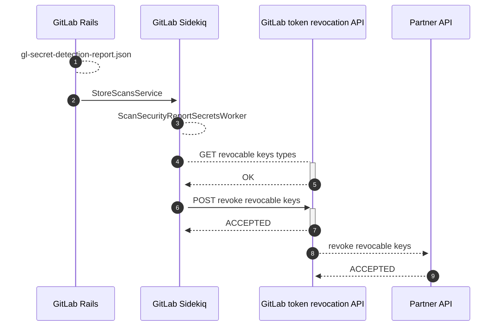
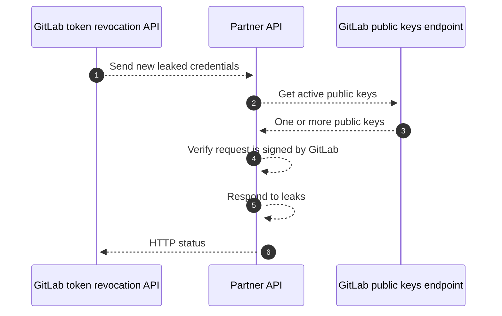



- プラン: Ultimate
- 提供形態: GitLab.com、GitLab Self-Managed、GitLab Dedicated



GitLabシークレット検出は、特定の種類の流出したシークレットを検出すると自動的に対応します。自動応答では次のことができます:

- シークレットを自動的に失効させます。
- シークレットを発行したパートナーに通知します。パートナーは、シークレットを失効させたり、オーナーに通知したり、その他の方法で不正利用から保護したりできます。

## サポートされているシークレットの種類とアクション {#supported-secret-types-and-actions}

GitLabは、以下の種類のシークレットに対する自動応答をサポートしています:

| シークレットの種類 | 実行されたアクション | GitLab.comでサポートされています | GitLab Self-Managedでサポートされています |
| ----- | --- | --- | --- |
| GitLab [パーソナルアクセストークン](../../profile/personal_access_tokens.md) | トークンを即座に失効させ、オーナーにメールを送信します。[^supported-personal-access] | ✅ | ✅ |
| Amazon Web Services（AWS）[IAMアクセスキー](https://docs.aws.amazon.com/IAM/latest/UserGuide/id_credentials_access-keys.html) | AWSに通知します。 | ✅ | ⚙ |
| Google Cloud [サービスアカウントキー](https://cloud.google.com/iam/docs/best-practices-for-managing-service-account-keys)、[APIキー](https://cloud.google.com/docs/authentication/api-keys)、および[OAuthクライアントシークレット](https://support.google.com/cloud/answer/6158849#rotate-client-secret) | Google Cloudに通知します。 | ✅ | ⚙ |
| Postman [APIキー](https://learning.postman.com/docs/developer/postman-api/authentication/) | Postmanに通知します。Postmanは[キーオーナーに通知します](https://learning.postman.com/docs/administration/managing-your-team/secret-scanner/#protect-postman-api-keys-in-gitlab)。 | ✅ | ⚙ |

[^supported-personal-access]: `gitlab_personal_access_token`、`gitlab_personal_access_token_routable`、`gitlab_personal_access_token_routable_versioned`の[検出ルール](https://gitlab.com/gitlab-org/security-products/secret-detection/secret-detection-rules/-/blob/3204c843e960cec1b26a6cf8f95f609c68400de8/rules/mit/gitlab/gitlab.toml)でサポートされています。

**コンポーネントの凡例**:

- ✅ - デフォルトで利用可能
- ⚙ - トークン失効APIを使用した手動インテグレーションが必要です

## 機能の可用性 {#feature-availability}

認証情報は、シークレット検出によって発見された場合にのみ後処理されます:

- 公開プロジェクトでは、公開された認証情報が増大する脅威をもたらすためです。プライベートプロジェクトへの拡張は、[イシュー391379](https://gitlab.com/gitlab-org/gitlab/-/issues/391379)で検討されています。
- GitLab Ultimateを使用するプロジェクトでは、技術的な理由のためです。すべてのプランへの拡張は、[イシュー391763](https://gitlab.com/gitlab-org/gitlab/-/issues/391763)で追跡されています。

## トークンの自動失効を有効にする {#turn-on-automatic-token-revocation}

GitLab.comでは、トークンの自動失効はデフォルトで有効になっており、アクションは不要です。

GitLab Self-ManagedおよびGitLab Dedicatedでは、管理者が`secret_detection_token_revocation_enabled`を`true`に設定することで有効にする必要があります。この設定にはUIがなく、[アプリケーション設定API](../../../api/settings.md)または[Railsコンソール](../../../administration/operations/rails_console.md)を介して設定する必要があります。





管理者のアクセストークンを使用して、[アプリケーション設定API](../../../api/settings.md)を使用します。

現在の値を確認するには、レスポンス内の`secret_detection_token_revocation_enabled`フィールドを見つけます:

```shell
curl --header "PRIVATE-TOKEN: <your_admin_access_token>" \
  --url "https://gitlab.example.com/api/v4/application/settings"
```

この設定を有効にするには:

```shell
curl --request PUT \
  --header "PRIVATE-TOKEN: <your_admin_access_token>" \
  --data "secret_detection_token_revocation_enabled=true" \
  --url "https://gitlab.example.com/api/v4/application/settings"
```





[Railsコンソールセッション](../../../administration/operations/rails_console.md#starting-a-rails-console-session)を開きます。

現在の値を確認するには:

```ruby
::Gitlab::CurrentSettings.secret_detection_token_revocation_enabled?
```

この設定を有効にするには:

```ruby
::Gitlab::CurrentSettings.update!(secret_detection_token_revocation_enabled: true)
```





## 高レベルアーキテクチャ {#high-level-architecture}

この図は、後処理フックがGitLabアプリケーションでシークレットを失効させる方法を示しています:


```mermaid
%%{init: { "fontFamily": "GitLab Sans" }}%%
sequenceDiagram
accTitle: Architecture diagram
accDescr: How a post-processing hook revokes a secret in the GitLab application.

    autonumber
    GitLab Rails-->+GitLab Rails: gl-secret-detection-report.json
    GitLab Rails->>+GitLab Sidekiq: StoreScansService
    GitLab Sidekiq-->+GitLab Sidekiq: ScanSecurityReportSecretsWorker
    GitLab Sidekiq-->+GitLab token revocation API: GET revocable keys types
    GitLab token revocation API-->>-GitLab Sidekiq: OK
    GitLab Sidekiq->>+GitLab token revocation API: POST revoke revocable keys
    GitLab token revocation API-->>-GitLab Sidekiq: ACCEPTED
    GitLab token revocation API-->>+Partner API: revoke revocable keys
    Partner API-->>+GitLab token revocation API: ACCEPTED
```

1. シークレット検出ジョブを含むパイプラインが完了し、スキャンレポート（**1**）が生成されます。
1. レポートはサービスクラスによって処理され（**2**）、トークンの失効が可能であれば非同期ワーカーをスケジュールします。
1. 非同期ワーカー（**3**）は、外部にデプロイされたHTTPサービス（**4**および**5**）と通信し、どの種類のシークレットを自動的に失効できるかを決定します。
1. ワーカーは、GitLabトークン失効APIが失効できる検出されたシークレットのリストを送信します（**6**および**7**）。
1. GitLabトークン失効APIは、失効可能な各トークンをそれぞれのベンダーの[パートナーAPI](#implement-a-partner-api)に送信します（**8**および**9**）。

## 流出した認証情報の通知のためのパートナープログラム {#partner-program-for-leaked-credential-notifications}

GitLabは、パートナーが発行した認証情報がGitLab.comのパブリックリポジトリで流出した場合に、パートナーに通知します。クラウドまたはSaaS製品を運用しており、これらの通知を受け取ることに興味がある場合は、[エピック4944](https://gitlab.com/groups/gitlab-org/-/epics/4944)で詳細をご覧ください。パートナーは、GitLabトークン失効APIによって呼び出される[パートナーAPIを実装する](#implement-a-partner-api)必要があります。

### パートナーAPIを実装する {#implement-a-partner-api}

パートナーAPIは、GitLabトークン失効APIとインテグレーションし、流出したトークンの失効リクエストを受信して応答します。このサービスは、べき等でレート制限された、公開アクセス可能なHTTP APIである必要があります。

サービスへのリクエストには、1つ以上の流出したトークンと、リクエスト本文の署名を含むヘッダーを含めることができます。GitLabからの正当なリクエストであることを証明するために、この署名を使用して受信リクエストを検証することを強くお勧めします。以下の図は、流出したトークンを受信、検証、および失効させるために必要なステップを示しています:


```mermaid
%%{init: { "fontFamily": "GitLab Sans" }}%%
sequenceDiagram
accTitle: Partner API data flow
accDescr: How a partner API should receive and respond to leaked token revocation requests.

    autonumber
    GitLab token revocation API-->>+Partner API: Send new leaked credentials
    Partner API-->>+GitLab public keys endpoint: Get active public keys
    GitLab public keys endpoint-->>+Partner API: One or more public keys
    Partner API-->>+Partner API: Verify request is signed by GitLab
    Partner API-->>+Partner API: Respond to leaks
    Partner API-->>+GitLab token revocation API: HTTP status
```

1. GitLabトークン失効APIは、パートナーAPIに[失効リクエスト](#revocation-request)を送信します（**1**）。リクエストには、公開キー識別子とリクエスト本文の署名を含むヘッダーが含まれています。
1. パートナーAPIは、GitLabから[公開キー](#public-keys-endpoint)のリストをリクエストします（**2**）。レスポンス（**3**）には、キーローテーションの場合に複数の公開キーが含まれる可能性があり、リクエストヘッダー内の識別子でフィルタリングする必要があります。
1. パートナーAPIは、公開キー（**4**）を使用して、実際のリクエスト本文に対して[署名を検証します](#verifying-the-request)。
1. パートナーAPIは、流出したトークンを処理し、自動失効（**5**）を伴う場合があります。
1. パートナーAPIは、適切なHTTPステータスコードでGitLabトークン失効API（**6**）に応答します:
   - 成功応答コード（HTTP 200～299）は、パートナーがリクエストを受信して処理したことを確認します。
   - エラーコード（HTTP 400以上）は、GitLabトークン失効APIにリクエストの再試行を促します。

#### 失効リクエスト {#revocation-request}

このJSONスキーマドキュメントは、失効リクエストの本文を記述します:

```json
{
    "type": "array",
    "items": {
        "description": "A leaked token",
        "type": "object",
        "properties": {
            "type": {
                "description": "The type of token. This is vendor-specific and can be customized to suit your revocation service",
                "type": "string",
                "examples": [
                    "my_api_token"
                ]
            },
            "token": {
                "description": "The substring that was matched by the secret detection analyzer. In most cases, this is the entire token itself",
                "type": "string",
                "examples": [
                    "XXXXXXXXXXXXXXXX"
                ]
            },
            "url": {
                "description": "The URL to the raw source file hosted on GitLab where the leaked token was detected",
                "type": "string",
                "examples": [
                    "https://gitlab.example.com/some-repo/-/raw/abcdefghijklmnop/compromisedfile1.java"
                ]
            }
        }
    }
}
```

例: 

```json
[{"type": "my_api_token", "token": "XXXXXXXXXXXXXXXX", "url": "https://example.com/some-repo/-/raw/abcdefghijklmnop/compromisedfile1.java"}]
```

この例では、シークレット検出によって`my_api_token`のインスタンスが流出したと判断されています。トークンの値は、流出したトークンを含むファイルのrawコンテンツへの公開アクセス可能なURLに加えて、提供されます。

リクエストには2つの特別なヘッダーが含まれています:

| ヘッダー | タイプ | 説明 |
|--------|------|-------------|
| `Gitlab-Public-Key-Identifier` | 文字列 | このリクエストに署名するために使用されるキーペアの固有識別子。主にキーローテーションを支援するために使用されます。 |
| `Gitlab-Public-Key-Signature` | 文字列 | リクエスト本文のbase64エンコードされた署名。 |

これらのヘッダーをGitLab公開キーエンドポイントと合わせて使用すると、失効リクエストが正当なものであったことを検証できます。

#### 公開キーエンドポイント {#public-keys-endpoint}

GitLabは、失効リクエストを検証するために使用される公開キーを取得するための、公開アクセス可能なエンドポイントを維持しています。エンドポイントはリクエストに応じて提供できます。

このJSONスキーマドキュメントは、公開キーエンドポイントのレスポンス本文を記述します:

```json
{
    "type": "object",
    "properties": {
        "public_keys": {
            "description": "An array of public keys managed by GitLab used to sign token revocation requests.",
            "type": "array",
            "items": {
                "type": "object",
                "properties": {
                    "key_identifier": {
                        "description": "A unique identifier for the keypair. Match this against the value of the Gitlab-Public-Key-Identifier header",
                        "type": "string"
                    },
                    "key": {
                        "description": "The value of the public key",
                        "type": "string"
                    },
                    "is_current": {
                        "description": "Whether the key is currently active and signing new requests",
                        "type": "boolean"
                    }
                }
            }
        }
    }
}
```

例: 

```json
{
    "public_keys": [
        {
            "key_identifier": "6917d7584f0fa65c8c33df5ab20f54dfb9a6e6ae",
            "key": "-----BEGIN PUBLIC KEY-----\nMFkwEwYHKoZIzj0CAQYIKoZIzj0DAQcDQgAEN05/VjsBwWTUGYMpijqC5pDtoLEf\nuWz2CVZAZd5zfa/NAlSFgWRDdNRpazTARndB2+dHDtcHIVfzyVPNr2aznw==\n-----END PUBLIC KEY-----\n",
            "is_current": true
        }
    ]
}
```

#### リクエストの検証 {#verifying-the-request}

上記APIレスポンスから取得した対応する公開キーを使用して、`Gitlab-Public-Key-Signature`ヘッダーとリクエスト本文を照合することで、失効リクエストが正当なものであるかを確認できます。署名の生成にはSHA256ハッシュを使用した[ECDSA](https://en.wikipedia.org/wiki/Elliptic_Curve_Digital_Signature_Algorithm)を使用しており、その署名はbase64エンコードされてヘッダー値になります。

以下のPythonスクリプトは、署名を検証する方法を示しています。これは、暗号学的操作のために一般的な[pyca/cryptography](https://cryptography.io/en/latest/)モジュールを使用しています:

```python
import hashlib
import base64
from cryptography.hazmat.primitives import hashes
from cryptography.hazmat.primitives.serialization import load_pem_public_key
from cryptography.hazmat.primitives.asymmetric import ec

public_key = str.encode("")      # obtained from the public keys endpoint
signature_header = ""            # obtained from the `Gitlab-Public-Key-Signature` header
request_body = str.encode(r'')   # obtained from the revocation request body

pk = load_pem_public_key(public_key)
decoded_signature = base64.b64decode(signature_header)

pk.verify(decoded_signature, request_body, ec.ECDSA(hashes.SHA256()))  # throws if unsuccessful

print("Signature verified!")
```

主なステップは次のとおりです:

1. 使用している暗号ライブラリに適した形式に公開キーを読み込みます。
1. `Gitlab-Public-Key-Signature`ヘッダー値をBase64デコードします。
1. デコードされた署名に対して本文を検証し、SHA256ハッシュを使用したECDSAを指定します。
