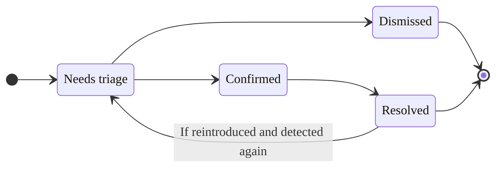



- プラン: Ultimate
- 提供形態: GitLab.com、GitLab Self-Managed、GitLab Dedicated



プロジェクト内の各脆弱性には、脆弱性の詳細を記載した脆弱性レポートページがあり、以下が含まれます: 

- 説明
- いつ検出されたか
- 現在のステータス
- 利用可能なアクション
- リンクされたイシュー
- アクションログ
- 場所
- 重大度

[共通脆弱性識別子（CVE）](https://www.cve.org/)カタログの脆弱性の場合、これらの詳細には以下も含まれます: 

- CVSSスコア
- [EPSSスコア](risk_assessment_data.md#epss)
- [KEVステータス](risk_assessment_data.md#kev)
- [到達可能性ステータス](../dependency_scanning/static_reachability.md)

この追加データの詳細については、[脆弱性リスク評価データ](risk_assessment_data.md)を参照してください。

スキャナーが脆弱性を誤検出であると判断した場合、脆弱性のページの上部にアラートメッセージが表示されます。

## 脆弱性の説明 {#vulnerability-explanation}



- プラン: Ultimate
- アドオン: GitLab Duo Enterprise、GitLab Duo with Amazon Q
- 提供形態: GitLab.com、GitLab Self-Managed、GitLab Dedicated





- LLM: Anthropic [Claude 3.7 Sonnet](https://console.cloud.google.com/vertex-ai/publishers/anthropic/model-garden/claude-3-7-sonnet)
- Amazon QのLLM: Amazon Q Developer
- [GitLab Duo with self-hosted models](../../../administration/gitlab_duo_self_hosted/_index.md)で利用可能: はい





- GitLab 16.0でGitLab.com上の[実験](../../../policy/development_stages_support.md#experiment)として[導入されました](https://gitlab.com/groups/gitlab-org/-/epics/10368)。
- GitLab 16.2で[ベータ](../../../policy/development_stages_support.md#beta)ステータスにプロモートされました。
- GitLab 17.2で[一般提供](https://gitlab.com/groups/gitlab-org/-/epics/10642)になりました。
- GitLab 17.6以降、GitLab Duoアドオンが必須となりました。



GitLab Duo脆弱性の説明は、大規模言語モデルを使用して、脆弱性に関する次のことを支援します: 

- 脆弱性を要約します。
- 開発者とセキュリティアナリストが、脆弱性、その悪用方法、および修正方法を理解するのに役立ちます。
- 推奨される軽減策を提供します。

<i class="fa fa-youtube-play youtube" aria-hidden="true"></i>[概要を見る](https://www.youtube.com/watch?v=MMVFvGrmMzw&list=PLFGfElNsQthZGazU1ZdfDpegu0HflunXW)

前提要件: 

- GitLab Ultimateプランのサブスクリプションである必要があります。
- 有料のGitLab Duo Enterpriseシートが必要です。
- [GitLab Duo](../../gitlab_duo/turn_on_off.md)をグループまたはインスタンスに対して有効にする必要があります。
- プロジェクトのメンバーである必要があります。
- 脆弱性は、SASTスキャナーからのものでなければなりません。

脆弱性を説明するには:

1. 左側のサイドバーで、**検索または移動先**を選択して、プロジェクトを見つけます。
1. **セキュリティ** > **脆弱性レポート**を選択します。
1. オプション。デフォルトのフィルターを削除するには、**Clear**（クリア）（）を選択します。
1. 脆弱性のリストの上にある、フィルターバーを選択します。
1. 表示されるドロップダウンリストで、**ツール**を選択し、次に**SAST**カテゴリのすべての値を選択します。
1. フィルターフィールドの外側を選択します。脆弱性の重大度の合計と、一致する脆弱性のリストが更新されます。
1. 説明したいSAST脆弱性を選択します。
1. 次のいずれかを実行します: 

   - 脆弱性の説明の下にある_GitLab Duo Chatにこの脆弱性とその推奨される修正について質問することで、AIを使用することもできます_というテキストを選択します。
   - 右上にある**マージリクエストで解決**ドロップダウンリストから、**脆弱性の説明**を選択し、**脆弱性の説明**を選択します。
   - GitLab Duoチャットを開き、`/vulnerability_explain`[explain a vulnerability](../../gitlab_duo_chat/examples.md#explain-a-vulnerability)コマンドを入力して使用します。

応答がページの右側に表示されます。

GitLab.comでは、この機能を利用できます。デフォルトでは、Anthropic [`claude-3-haiku`](https://docs.anthropic.com/en/docs/about-claude/models#claude-3-a-new-generation-of-ai)モデルを搭載しています。大規模言語モデルが正しい結果を生成することを保証することはできません。説明は注意して使用してください。

### 脆弱性の説明のために第三者AIAPIと共有されるデータ {#data-shared-with-third-party-ai-apis-for-vulnerability-explanation}

次のデータは、サードパーティのAIAPIと共有されます: 

- 脆弱性のタイトル（どのスキャナーが使用されているかに応じて、ファイル名が含まれる場合があります）。
- 脆弱性の識別子。
- ファイル名

## 脆弱性の解決 {#vulnerability-resolution}



- プラン: Ultimate
- アドオン: GitLab Duo Enterprise、GitLab Duo with Amazon Q
- 提供形態: GitLab.com、GitLab Self-Managed、GitLab Dedicated





- GitLab Self-Managed、GitLab DedicatedのLLM: Anthropic [Claude 3.5 Sonnet](https://console.cloud.google.com/vertex-ai/publishers/anthropic/model-garden/claude-3-5-sonnet)
- GitLab.comのLLM: Anthropic [Claude 3.7 Sonnet](https://console.cloud.google.com/vertex-ai/publishers/anthropic/model-garden/claude-3-7-sonnet)
- Amazon QのLLM: Amazon Q Developer
- [GitLab Duo with self-hosted models](../../../administration/gitlab_duo_self_hosted/_index.md)で利用可能: はい





- GitLab 16.7でGitLab.com上の[実験](../../../policy/development_stages_support.md#experiment)として[導入されました](https://gitlab.com/groups/gitlab-org/-/epics/10779)。
- GitLab 17.3でベータ版に変更されました。
- GitLab 17.6以降、GitLab Duoアドオンが必須となりました。



GitLab Duo脆弱性解決を使用して、脆弱性を解決するマージリクエストを自動的に作成します。デフォルトでは、Anthropic [`claude-3.5-sonnet`](https://console.cloud.google.com/vertex-ai/publishers/anthropic/model-garden/claude-3-5-sonnet)モデルを搭載しています。

大規模言語モデルが正しい結果を生成することを保証することはできません。提案された変更は、マージする前に必ずレビューする必要があります。レビューする際は、以下を確認してください: 

- アプリケーションの既存の機能が維持されている。
- 脆弱性が組織の標準に従って解決されている。

<i class="fa fa-youtube-play youtube" aria-hidden="true"></i>[概要を見る](https://www.youtube.com/watch?v=VJmsw_C125E&list=PLFGfElNsQthZGazU1ZdfDpegu0HflunXW)

前提要件: 

- GitLab UltimateプランのサブスクリプションとGitLab Duo Enterpriseが必要です。
- プロジェクトのメンバーである必要があります。
- 脆弱性は、サポートされているアナライザーからのSAST調査結果である必要があります: 
  - サポートされているすべての[GitLabアナライザー](../sast/analyzers.md)。
  - 脆弱性のロケーションと各脆弱性のCWE識別子をレポートする、適切に統合されたサードパーティSASTスキャナー。
- 脆弱性は、[サポートされているタイプ](#supported-vulnerabilities-for-vulnerability-resolution)である必要があります。

[すべてのGitLab Duo機能を有効にする方法](../../gitlab_duo/turn_on_off.md)の詳細をご覧ください。

脆弱性を解決するには:

1. 左側のサイドバーで、**検索または移動先**を選択して、プロジェクトを見つけます。
1. **セキュリティ** > **脆弱性レポート**を選択します。
1. オプション。デフォルトのフィルターを削除するには、**Clear**（クリア）（）を選択します。
1. 脆弱性のリストの上にある、フィルターバーを選択します。
1. 表示されるドロップダウンリストで、**アクティビティー**を選択し、次に**GitLab Duo (AI)**カテゴリで**脆弱性の解決策は利用可能**を選択します。
1. フィルターフィールドの外側を選択します。脆弱性の重大度の合計と、一致する脆弱性のリストが更新されます。
1. 解決するSAST脆弱性を選択します。
   - 脆弱性解決をサポートする脆弱性の横に青いアイコンが表示されます。
1. 右上隅で、**AIを使用して解決する**を選択します。このプロジェクトがパブリックプロジェクトである場合、MRを作成すると、脆弱性と提供された解決策が公開されることに注意してください。プライベートにMRを作成するには、[プライベートフォークを作成](../../project/merge_requests/confidential.md)し、このプロセスを繰り返します。
1. 追加のコミットをMRに追加します。これにより、新しいパイプラインが強制的に実行されます。
1. パイプラインが完了したら、[パイプラインセキュリティタブ](../detect/security_scanning_results.md)で、脆弱性が表示されなくなったことを確認します。
1. 脆弱性レポートで、[脆弱性を手動で更新](../vulnerability_report/_index.md#change-status-of-vulnerabilities)します。

AI修正の提案を含むマージリクエストが開きます。提案された変更をレビューし、標準ワークフローに従ってマージリクエストを処理します。

この機能に関するフィードバックを[イシュー476553](https://gitlab.com/gitlab-org/gitlab/-/issues/476553)で提供してください。

### 脆弱性解決でサポートされている脆弱性 {#supported-vulnerabilities-for-vulnerability-resolution}

提案された解決策が高品質であることを保証するために、脆弱性解決は特定の脆弱性セットでのみ使用できます。システムは、脆弱性の共通脆弱性タイプ一覧(CWE) 識別子に基づいて、脆弱性解決を提供するかどうかを決定します。

自動化されたシステムとセキュリティの専門家によるテストに基づいて、現在の脆弱性セットを選択しました。より多くの種類の脆弱性へのカバレッジを拡大するために積極的に取り組んでいます。

<details><summary style="color:#5943b6; margin-top: 1em;"><a>脆弱性解決でサポートされているCWEの完全なリストを表示</a></summary>

<ul>
  <li>CWE-23: 相対パストラバーサル</li>
  <li>CWE-73: ファイル名またはパスの外部制御</li>
  <li>CWE-78: OSコマンドインジェクション（'OS Command Injection'）で使用される特殊要素の不適切なニュートラル化</li>
  <li>CWE-80: Webページでのスクリプト関連のHTMLタグの不適切なニュートラル化（基本的なXSS）</li>
  <li>CWE-89: SQLコマンド（「SQL Injection」）で使用される特殊要素の不適切なニュートラル化</li>
  <li>CWE-116: 出力の不適切なエンコードまたはエスケープ</li>
  <li>CWE-118: 指標可能なリソースの不正なアクセス（「範囲エラー」）</li>
  <li>CWE-119: メモリーバッファの範囲内での操作の不適切な制限</li>
  <li>CWE-120: 入力サイズを確認せずにバッファをコピー（「クラシックバッファオーバーフロー」）</li>
  <li>CWE-126: バッファオーバーリード</li>
  <li>CWE-190: 整数のオーバーフローまたはラップアラウンド</li>
  <li>CWE-200: 機密情報の権限のないアクターへの公開</li>
  <li>CWE-208: 観察可能なタイミングの矛盾</li>
  <li>CWE-209: 機密情報を含むエラーメッセージの生成</li>
  <li>CWE-272: 最小特権の違反</li>
  <li>CWE-287: 不適切な認証</li>
  <li>CWE-295: 証明書の検証が不適切</li>
  <li>CWE-297: ホストのミスマッチがある証明書の不適切な検証</li>
  <li>CWE-305: 主要な脆弱性による認証のバイパス</li>
  <li>CWE-310: 暗号学的な問題</li>
  <li>CWE-311: 機密データの暗号化の欠落</li>
  <li>CWE-323: 暗号化におけるNonce、キーペアの再利用</li>
  <li>CWE-327: 壊れたまたは危険な暗号学的アルゴリズムの使用</li>
  <li>CWE-328: 脆弱なハッシュの使用</li>
  <li>CWE-330: 不十分にランダムな値の使用</li>
  <li>CWE-338: 暗号学的に脆弱な疑似乱数ジェネレーター（PRNG）の使用</li>
  <li>CWE-345: データの信頼性の検証が不十分</li>
  <li>CWE-346: 起点の検証エラー</li>
  <li>CWE-352: クロスサイトリクエストフォージェリ</li>
  <li>CWE-362: 不適切な同期を使用した共有リソースの同時実行（「競合状態」）</li>
  <li>CWE-369: ゼロ除算</li>
  <li>CWE-377: 安全でない一時ファイル</li>
  <li>CWE-378: 安全でない権限を持つ一時ファイルの作成</li>
  <li>CWE-400: 制御されないリソース消費</li>
  <li>CWE-489: アクティブなデバッグコード</li>
  <li>CWE-521: 脆弱なパスワード要件</li>
  <li>CWE-539: 機密情報を含む永続的なCookieの使用</li>
  <li>CWE-599: OpenSSL証明書の検証の欠落</li>
  <li>CWE-611: XML外部エンティティ参照の不適切な制限</li>
  <li>CWE-676: 潜在的に危険な関数の使用</li>
  <li>CWE-704: 不適切な型変換またはキャスト</li>
  <li>CWE-754: 異常な状態または例外的な状態の不適切なチェック</li>
  <li>CWE-770: 制限または調整のないリソースの割り当て</li>
  <li>CWE-1004: 'HttpOnly'フラグのない機密Cookie</li>
  <li>CWE-1275: 不適切なSameSite属性を持つ機密Cookie</li>
</ul>
</details>

### トラブルシューティング {#troubleshooting}

脆弱性解決では、推奨される修正を生成できない場合があります。一般的な原因は次のとおりです:

- **偽陽性を検出**: 修正を提案する前に、AIモデルは、脆弱性が有効かどうかを評価します。脆弱性が真の脆弱性ではないか、修正する価値がないと判断する場合があります。
  - これは、脆弱性がテストコードで発生した場合に発生する可能性があります。組織は、テストコードで発生した場合でも脆弱性を修正することを選択する可能性がありますが、モデルはこれらを誤検出と評価する場合があります。
  - 脆弱性が誤検出であるか、修正する価値がないことに同意する場合は、[脆弱性をやめる](#vulnerability-status-values)して、[一致する理由を選択](#vulnerability-dismissal-reasons)する必要があります。
    - SASTの設定をカスタマイズするか、GitLab SASTルールに関する問題をレポートするには、[SASTルール](../sast/rules.md)を参照してください。
- **一時的または予期しないエラー**: エラーメッセージには、「予期しないエラーが発生しました」、「アップストリームAIプロバイダーリクエストがタイムアウトしました」、「問題が発生しました」などの原因が表示される場合があります。
  - これらのエラーは、AIプロバイダーまたはGitLab Duoの一時的な問題が原因である可能性があります。
  - 新しいリクエストが成功する可能性があるため、脆弱性を再度解決してみてください。
  - これらのエラーが引き続き表示される場合は、GitLabにお問い合わせください。

### 脆弱性解決のために第三者AIAPIと共有されるデータ {#data-shared-with-third-party-ai-apis-for-vulnerability-resolution}

次のデータは、サードパーティのAIAPIと共有されます:

- 脆弱性名
- 脆弱性の説明
- 識別子（CWE、OWASP）
- 脆弱なコード行を含むファイル全体
- 脆弱なコード行（行番号）

## マージリクエストの脆弱性解決 {#vulnerability-resolution-in-a-merge-request}



- プラン: Ultimate
- アドオン: GitLab Duo Enterprise
- 提供形態: GitLab.com、GitLab Self-Managed、GitLab Dedicated





- GitLab 17.6で[導入](https://gitlab.com/groups/gitlab-org/-/epics/14862)されました。
- GitLab 17.7で[デフォルトで有効](https://gitlab.com/gitlab-org/gitlab/-/merge_requests/175150)になりました。
- GitLab 17.11[で一般提供](https://gitlab.com/gitlab-org/gitlab/-/merge_requests/185452)になりました。機能フラグ`resolve_vulnerability_in_mr`は削除されました。



GitLab Duo脆弱性解決を使用して、脆弱性の調査結果を解決するマージリクエストの提案コメントを自動的に作成します。デフォルトでは、Anthropic [`claude-3.5-sonnet`](https://console.cloud.google.com/vertex-ai/publishers/anthropic/model-garden/claude-3-5-sonnet) AIモデルによって動作します。

脆弱性検出を解決するには、次の手順に従います:

1. 左側のサイドバーで、**検索または移動先**を選択して、プロジェクトを見つけます。
1. **マージリクエスト**を選択します。
1. マージリクエストを選択します。
   - 脆弱性解決でサポートされている脆弱性検出は、タヌキAIアイコン()で示されます。
1. サポートされている検出を選択して、セキュリティ検出ダイアログを開きます。
1. 右下隅にある**AIを使用して解決する**を選択します。

マージリクエストで修正の提案を含むコメントが開きます。提案された変更を確認し、標準ワークフローに従ってマージリクエストの提案を適用します。

この機能に関するフィードバックは、[イシュー476553](https://gitlab.com/gitlab-org/gitlab/-/issues/476553)でお寄せください。

### トラブルシューティング {#troubleshooting-1}

マージリクエストの脆弱性解決では、提案された修正を生成できない場合があります。一般的な原因は次のとおりです: 

- **偽陽性を検出**: 修正を提案する前に、AIモデルは脆弱性が有効かどうかを評価します。脆弱性が真の脆弱性ではないか、修正する価値がないと判断する場合があります。
  - これは、脆弱性がテストコードで発生した場合に発生する可能性があります。組織はテストコードで発生した場合でも脆弱性を修正することを選択する場合がありますが、モデルはこれらを誤検出と評価する場合があります。
  - 脆弱性が誤検出であるか、修正する価値がないことに同意する場合は、[脆弱性を無視する](#vulnerability-status-values) 、一致する[理由を選択](#vulnerability-dismissal-reasons)する必要があります。
    - SAST設定をカスタマイズするか、GitLab SASTルールに関する問題をレポートするには、[SASTルール](../sast/rules.md)を参照してください。
- **一時的または予期しないエラー**: エラーメッセージには、「予期しないエラーが発生しました」、「アップストリームAIプロバイダーのリクエストがタイムアウトした」、「問題が発生しました」などの原因が表示される場合があります。
  - これらのエラーは、AIプロバイダーまたはGitLab Duoの一時的な問題が原因である可能性があります。
  - 新しいリクエストが成功する可能性があるため、脆弱性の解決を再度試すことができます。
  - これらのエラーが引き続き表示される場合は、GitLabにお問い合わせください。
- **マージリクエストで解決ターゲットが見つからず、提案を作成できません:**
  - このエラーは、ターゲットブランチで完全なセキュリティスキャンパイプラインが実行されていない場合に発生する可能性があります。[マージリクエストドキュメント](../detect/security_scanning_results.md)を参照してください。

## 脆弱性コードフロー {#vulnerability-code-flow}



- プラン: Ultimate
- 提供形態: GitLab.com、GitLab Self-Managed、GitLab Dedicated



特定の種類の脆弱性について、高度なSASTは[code flow](../sast/gitlab_advanced_sast.md#vulnerability-code-flow)情報を提供します。脆弱性のコードフローとは、データが、すべての割り当て、操作、サニタイズを通じて、ユーザー入力（ソース）から脆弱なコード行（シンク）に至るまでの間でたどるパスです。

脆弱性のコードフローを表示する方法の詳細については、[脆弱性コードフロー](../sast/gitlab_advanced_sast.md#vulnerability-code-flow)を参照してください。


## 脆弱性のステータス値 {#vulnerability-status-values}

脆弱性のステータスは次のいずれかになります: 

- **トリアージが必要**: 新しく発見された脆弱性のデフォルト状態。
- **確認済み**: ユーザーがこの脆弱性を確認し、正確であることを確認しました。
- **やめる**: ユーザーがこの脆弱性を評価し、[やめるました](#vulnerability-dismissal-reasons)。無視された脆弱性は、後続のスキャンで検出された場合でも無視されます。
- **解決済み**: 脆弱性が修正されたか、存在しなくなりました。解決済みの脆弱性が再度導入されて検出された場合、そのレコードは復活し、ステータスは**トリアージが必要**に設定されます。

脆弱性は通常、次のライフサイクルを経ます: 



## 脆弱性が検出されませんでした {#vulnerability-is-no-longer-detected}



- 脆弱性を解決したコミットへのリンクが[導入](https://gitlab.com/gitlab-org/gitlab/-/issues/372799)され、GitLab 17.9で[GitLab Self-ManagedおよびGitLab Dedicatedで一般的に利用可能になりました](https://gitlab.com/gitlab-org/gitlab/-/merge_requests/178748)。機能フラグ`vulnerability_representation_information`は削除されました。



脆弱性は、修正するために意図的に行われた変更、または他の変更の副次効果が原因で、検出されなくなる場合があります。セキュリティスキャンが実行され、デフォルトブランチで脆弱性が検出されなくなった場合、スキャナーは**検出されませんでした**をレコードのアクションログに追加しますが、レコードのステータスは変更されません。代わりに、脆弱性が解決されたことを確認し、その場合は[手動でステータスを**解決済み**に変更](#change-the-status-of-a-vulnerability)する必要があります。特定の基準に一致する脆弱性のステータスを自動的に**解決済み**に変更するには、[脆弱性管理ポリシー](../policies/vulnerability_management_policy.md)を使用することもできます。

脆弱性を解決したコミットへのリンクは、脆弱性ページの上部または下部にあります。

## 脆弱性却下の理由 {#vulnerability-dismissal-reasons}



- GitLab 15.11で`dismissal_reason`[フラグ](../../../administration/feature_flags/_index.md)とともに[導入](https://gitlab.com/groups/gitlab-org/-/epics/4942)されました。
- GitLab 16.0で[GitLab Self-ManagedおよびGitLab Dedicated](https://gitlab.com/gitlab-org/gitlab/-/issues/393005)で有効になりました。
- GitLab 16.2で[一般提供](https://gitlab.com/gitlab-org/gitlab/-/merge_requests/124397)になりました。機能フラグ`dismissal_reason`は削除されました。



脆弱性を無視する場合は、次のいずれかの理由を選択する必要があります: 

- **許容可能なリスク**: 脆弱性は既知であり、修正も軽減もされていませんが、許容できるビジネスリスクと見なされます。
- **誤検知**: 実際には脆弱性が存在しないのに、誤ってシステムに脆弱性が存在するというテスト結果を示すレポートのエラー。
- **制御を緩和中**: 脆弱性のリスクは、情報システムと同等の保護を提供する組織が採用する、管理上、運用上、または技術的な制御（つまり、保護手段または対抗手段）によって軽減されます。
- **テストで使用**: 検出結果はテストの一部またはテストデータであるため、脆弱性ではありません。
- **該当するものがありません**: 脆弱性は既知であり、修正も軽減もされていませんが、更新されないアプリケーションの一部に含まれていると見なされています。

## 脆弱性のステータスを変更 {#change-the-status-of-a-vulnerability}



- 脆弱性のステータスを変更する権限を`Developer`ロールを持つユーザーに許可する（`admin_vulnerability`）は、GitLab 16.4で[非推奨](https://gitlab.com/gitlab-org/gitlab/-/issues/424133)となり、GitLab 17.0で[削除](https://gitlab.com/gitlab-org/gitlab/-/issues/412693)されました。
- **コメント**テキストボックスがGitLab 17.9で[追加](https://gitlab.com/gitlab-org/gitlab/-/issues/451480)されました。



前提要件: 

- 少なくともプロジェクトに対するメンテナーロールか、カスタムロールでの`admin_vulnerability`権限を持っている必要があります。

脆弱性のステータスを脆弱性ページから変更するには: 

1. 左側のサイドバーで、**検索または移動先**を選択して、プロジェクトを見つけます。
1. **セキュリティ** > **脆弱性レポート**を選択します。
1. 脆弱性の説明を選択します。
1. **Change status**（ステータスを変更）を選択します。
1. **ステータス**ドロップダウンリストから、脆弱性のステータスを**やめる**に変更する場合は、ステータスまたは[却下の理由](#vulnerability-dismissal-reasons)を選択します。
1. **コメント**テキストボックスに、却下の理由に関する詳細を含むコメントを入力します。**やめる**ステータスを適用する場合は、コメントが必要です。

誰がいつ変更を加えたかなど、ステータスの変更の詳細は、脆弱性のアクションログに記録されます。

## 脆弱性のGitLabイシューを作成する {#create-a-gitlab-issue-for-a-vulnerability}

脆弱性を解決または軽減するために行われたアクションを追跡するために、GitLabプロジェクトでイシューを作成できます。脆弱性のGitLabイシューを作成するには: 

1. 左側のサイドバーで、**検索または移動先**を選択して、プロジェクトを見つけます。
1. **セキュリティ** > **脆弱性レポート**を選択します。
1. 脆弱性の説明を選択します。
1. **Create issue**（イシューの作成）を選択します。

イシューは、脆弱性レポートからの情報をもとに、GitLabプロジェクトに作成されます。

イシューを作成するには、[脆弱性のJiraイシューを作成する](../../../integration/jira/configure.md#create-a-jira-issue-for-a-vulnerability)を参照してください。

## 脆弱性をGitLabおよびJiraイシューにリンクする {#linking-a-vulnerability-to-gitlab-and-jira-issues}

脆弱性を1つまたは複数の既存の[GitLab](#create-a-gitlab-issue-for-a-vulnerability)または[Jira](../../../integration/jira/configure.md#create-a-jira-issue-for-a-vulnerability)イシューにリンクできます。同時に使用できるリンク機能は1つだけです。リンクを追加すると、脆弱性を解決または軽減するイシューを追跡するのに役立ちます。

### 既存のGitLabイシューに脆弱性をリンクする {#link-a-vulnerability-to-existing-gitlab-issues}

前提要件: 

- [Jiraイシューインテグレーション](../../../integration/jira/configure.md)を有効にしないでください。

脆弱性を既存のGitLabイシューにリンクするには: 

1. 左側のサイドバーで、**検索または移動先**を選択して、プロジェクトを見つけます。
1. **セキュリティ** > **脆弱性レポート**を選択します。
1. 脆弱性の説明を選択します。
1. **Linked issues**（リンクされたアイテム）セクションで、プラスアイコン()を選択します。
1. リンクする各イシューについて、次のいずれかを実行します:  
   - イシューへのリンクを貼り付けます。
   - イシューのID（ハッシュ`#`をプレフィックスとして付加）を入力します。
1. **Add**（追加）を選択します。

選択したGitLabイシューが**リンクされたアイテム**セクションに追加され、リンクされたイシューカウンターが更新されます。

脆弱性にリンクされたGitLabイシューは、脆弱性レポートと脆弱性のページに表示されます。

脆弱性とリンクされたGitLabイシューの間の次の状態に注意してください:  

- 脆弱性ページには関連するイシューが表示されますが、イシューページには関連する脆弱性は表示されません。
- 1つのイシューは、一度に1つの脆弱性のみに関連付けることができます。
- イシューは、グループおよびプロジェクト間でリンクできます。

### 既存のJiraイシューに脆弱性をリンクする {#link-a-vulnerability-to-existing-jira-issues}

前提要件: 

- Jiraイシューのインテグレーションが[設定](../../../integration/jira/configure.md#configure-the-integration)され、**Create Jira issues for vulnerabilities**（脆弱性のJiraイシューを作成する）チェックボックスがオンになっていることを確認してください。

脆弱性を既存のJiraイシューにリンクするには、次の行をJiraイシューの説明に追加します: 

```plaintext
/-/security/vulnerabilities/<id>
```

`<id>`は任意の[脆弱性ID](../../../api/vulnerabilities.md#single-vulnerability)です。1つの説明に、異なるIDを持つ複数の行を追加できます。

適切な説明が記載されたJiraイシューが**関連するJiraイシュー**セクションに追加され、リンクされたイシューカウンターが更新されます。

脆弱性にリンクされたJiraイシューは、脆弱性ページにのみ表示されます。

脆弱性とリンクされたJiraイシューの間の次の状態に注意してください: 

- 脆弱性ページとイシューページには、関連する脆弱性が表示されます。
- 1つのイシューを、同時に1つまたは複数の脆弱性に関連付けることができます。

## 脆弱性を解決する {#resolve-a-vulnerability}

一部の脆弱性については、解決策はすでにわかっていますが、手動で実装する必要があります。脆弱性ページの**解決策**フィールドは、セキュリティ検出をレポートしたセキュリティスキャナーツールによって提供されるか、[脆弱性の手動作成](../vulnerability_report/_index.md#manually-add-a-vulnerability)中に入力されます。GitLabツールは、[GitLabアドバイザリデータベース](../gitlab_advisory_database/_index.md)からの情報を利用します。

さらに、一部のツールには、提案された解決策を適用するためのソフトウェアパッチが含まれている場合があります。これらのインスタンスでは、脆弱性のページに**マージリクエストで解決**オプションが含まれています。

この機能では、次のスキャナーがサポートされています:  

- [依存関係スキャン](../dependency_scanning/_index.md)。自動パッチ作成は、`yarn`で管理されるNode.jsプロジェクトでのみ使用できます。自動パッチ作成は、[連邦情報処理規格モード](../../../development/fips_gitlab.md#enable-fips-mode)が無効になっている場合にのみサポートされます。

- [コンテナスキャン](../container_scanning/_index.md)。

脆弱性を解決するには、次のいずれかを実行します:  

- [マージリクエストで脆弱性を解決する](#resolve-a-vulnerability-with-a-merge-request)。
- [脆弱性を手動で解決](#resolve-a-vulnerability-manually)。

### マージリクエストで脆弱性を解決する {#resolve-a-vulnerability-with-a-merge-request}

マージリクエストを使用して脆弱性を解決するには: 

1. 左側のサイドバーで、**検索または移動先**を選択して、プロジェクトを見つけます。
1. **セキュリティ** > **脆弱性レポート**を選択します。
1. 脆弱性の説明を選択します。
1. **マージリクエストで解決**ドロップダウンリストから、**マージリクエストで解決**を選択します。

脆弱性を解決するために必要なパッチを適用するマージリクエストが作成されます。標準ワークフローに従ってマージリクエストを処理します。

### 手動で脆弱性を解決する {#resolve-a-vulnerability-manually}

GitLabが脆弱性のために生成したパッチを手動で適用するには: 

1. 左側のサイドバーで、**検索または移動先**を選択して、プロジェクトを見つけます。
1. **セキュリティ** > **脆弱性レポート**を選択します。
1. 脆弱性の説明を選択します。
1. **マージリクエストで解決**ドロップダウンリストから、**解決するためのパッチのダウンロード**を選択します。
1. ローカルプロジェクトに、パッチの生成に使用されたものと同じコミットがチェックアウトされていることを確認します。
1. `git apply remediation.patch`を実行します。
1. 変更を確認し、ブランチにコミットします。
1. 変更をmainブランチに適用するためのマージリクエストを作成します。
1. 標準ワークフローに従ってマージリクエストを処理します。

## 脆弱性のセキュリティトレーニングを有効にする {#enable-security-training-for-vulnerabilities}



セキュリティトレーニングは、オフラインの環境、つまりセキュリティ対策としてパブリックインターネットから隔離されたコンピューターではアクセスできません。具体的には、GitLabサーバーは、有効にすることを選択したすべてのトレーニングプロバイダーのAPIエンドポイントをクエリできる必要があります。一部のサードパーティトレーニングベンダーでは、無料のアカウントにサインアップする必要がある場合があります。[Secure Code Warrior](https://www.securecodewarrior.com/) 、[コントラ](https://application.security/) 、または[SecureFlag](https://www.secureflag.com/index.html)のいずれかにアクセスして、アカウントにサインアップします。GitLabは、これらのサードパーティベンダーにユーザー情報を送信しません。CWEまたはOWASP識別子とファイル拡張子の言語名を送信します。



セキュリティトレーニングは、開発者が脆弱性の修正方法を学ぶのに役立ちます。開発者は、検出された脆弱性に関連する、選択された教育プロバイダーからのセキュリティトレーニングを表示できます。

プロジェクトの脆弱性のセキュリティトレーニングを有効にするには: 

1. 左側のサイドバーで、**検索または移動先**を選択して、プロジェクトを見つけます。
1. **セキュリティ** > **セキュリティ設定**を選択します。
1. タブバーで、**脆弱性管理**を選択します。
1. セキュリティトレーニングプロバイダーを有効にするには、切替をオンにします。

各インテグレーションは、脆弱性識別子（たとえば、CWEまたはOWASP）と、セキュリティトレーニングベンダーへの言語を送信します。ベンダートレーニングへの結果のリンクは、GitLab脆弱性に表示されるものです。

## 脆弱性のセキュリティトレーニングを表示する {#view-security-training-for-a-vulnerability}

セキュリティトレーニングが有効になっている場合、脆弱性ページには、検出された脆弱性に関連するトレーニングリンクが含まれている場合があります。トレーニングの可用性は、有効になっているトレーニングベンダーに特定の脆弱性に一致するコンテンツがあるかどうかによって異なります。トレーニングコンテンツは、脆弱性識別子に基づいてリクエストされます。脆弱性に与えられた識別子は、脆弱性ごとに異なり、利用可能なトレーニングコンテンツはベンダーによって異なります。一部の脆弱性では、トレーニングコンテンツは表示されません。CWEを持つ脆弱性は、トレーニング結果を返す可能性が最も高くなります。

脆弱性のセキュリティトレーニングを表示するには: 

1. 左側のサイドバーで、**検索または移動先**を選択して、プロジェクトを見つけます。
1. **セキュリティ** > **脆弱性レポート**を選択します。
1. セキュリティトレーニングを表示する脆弱性を選択します。
1. **トレーニングを表示**を選択します。

## 推移的依存関係の脆弱性のロケーションを表示する {#view-the-location-of-a-vulnerability-in-transitive-dependencies}



- 依存関係パスオプションがGitLab 17.11で名前が`dependency_paths`[導入](https://gitlab.com/gitlab-org/gitlab/-/issues/519965)され、[フラグ付き](../../../administration/feature_flags/_index.md)ました。デフォルトでは無効になっています。
- 依存関係パスオプションがGitLab 18.2で[一般公開](https://gitlab.com/gitlab-org/gitlab/-/merge_requests/197224)されました。機能フラグ`dependency_paths`により制御されており、デフォルトで有効になっています。





この機能の利用可否は、機能フラグによって制御されます。詳細については、履歴を参照してください。



脆弱性の詳細の依存関係で見つかった脆弱性を管理する場合、**ロケーション**で、以下を表示できます:  

- 脆弱性が検出された直接の依存関係のロケーション。
- 利用可能な場合は、脆弱性が発生する特定の行番号。

1つ以上の推移的依存関係で脆弱性が発生した場合、直接の依存関係のみを知っているだけでは十分でない場合があります。推移的依存関係は、祖先として直接の依存関係を持つ間接的な依存関係です。

推移的依存関係が存在する場合は、脆弱性を含む推移的依存関係を含む、すべての依存関係へのパスを表示できます。

- 脆弱性の詳細ページの**ロケーション**で、**依存関係パスを表示**を選択します。**依存関係パスを表示**が表示されない場合、推移的依存関係はありません。
