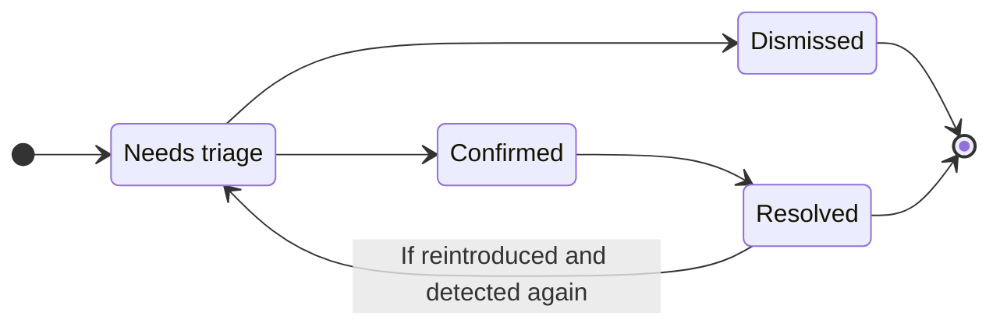



- プラン: Ultimate
- 提供形態: GitLab.com、GitLab Self-Managed、GitLab Dedicated





- 再設計された脆弱性ページは、GitLab 19.0で[導入され](https://gitlab.com/groups/gitlab-org/-/epics/21907)、[ベータ](../../../policy/development_stages_support.md#beta)機能として、`vulnerability_details_enrichment`という名前の[機能フラグと共に](../../../administration/feature_flags/_index.md)提供されました。デフォルトでは無効になっています。
- [GitLab.com、GitLab Self-Managed、およびGitLab Dedicatedで有効化](https://gitlab.com/gitlab-org/gitlab/-/work_items/606953)されました (GitLab 19.3)。



> [!flag]
> 再設計された脆弱性ページの可用性は、機能フラグによって制御されます。詳細については、履歴を参照してください。

プロジェクト内の各脆弱性には、脆弱性ページがあります。ページヘッダーには、脆弱性のタイトル、いつ、どのパイプラインで検出されたか、関連するマージリクエストとイシューの数（存在する場合）、および利用可能なアクションが表示されます。右側のサイドバーには、脆弱性のステータスと重大度が表示されます。脆弱性の残りのデータは、以下のセクションにグループ化されています:

- **リスク**: 脆弱性の優先順位付けに役立つスコアとフラグです。
- **修復**: スキャナーによって報告されたソリューションです（利用可能な場合）。
- **詳細**: 脆弱性の説明、それを報告したスキャナー、およびコード、コンテナイメージ、または依存関係内での場所。
- **補足情報**: 識別子（CVEやCWEなど）、外部参照へのリンク、およびセキュリティトレーニング。
- **証拠、論拠**: リクエストと、スキャナーによって記録された応答（それらを報告するスキャナーの場合）。
- **関連するマージリクエスト**と**関連したイシュー**: 脆弱性にリンクされたマージリクエストとイシュー。
- **アクティビティ**: ステータス変更、コメント、および検出イベントのログ。

各セクションは折りたたみ可能です。セクションの内容を非表示または表示するには、セクションヘッダーで**折りたたむ** () または**展開** () を選択します。

[Common Vulnerabilities and Exposures (CVE)](https://www.cve.org/)カタログ内の脆弱性については、**リスク**セクションにも以下が含まれます:

- CVSSスコア
- [EPSSスコア](risk_assessment_data.md#epss)
- [KEVステータス](risk_assessment_data.md#kev)
- [到達可能性ステータス](../dependency_scanning/static_reachability.md)（限定提供）

この追加データの詳細については、[脆弱性リスク評価データ](risk_assessment_data.md)を参照してください。

スキャナーが脆弱性を誤検出と判断した場合、**リスク**セクションの上にアラートが表示されます。GitLab Duoが脆弱性を誤検出の可能性があると識別した場合、**リスク**セクションには代わりに**誤検出の信頼度**スコアが表示されます。詳細については、[誤検出判定](false_positive_detection.md)を参照してください。

SASTによって検出された脆弱性については、GitLab Duoが自動的に分析し、コンテキスト認識型のコード修正を含むマージリクエストを生成できます。詳細については、[エージェント型SAST脆弱性の修正](agentic_vulnerability_resolution.md)を参照してください。

## シークレット誤検出判定 {#secret-false-positive-detection}



- プラン: Ultimate
- アドオン: GitLab Duo Core、Pro、またはEnterprise
- 提供形態: GitLab.com、GitLab Self-Managed、GitLab Dedicated
- ステータス: ベータ版





- GitLab 18.10の[エピック17885](https://gitlab.com/groups/gitlab-org/-/work_items/20152)で、`duo_secret_detection_false_positive`[機能フラグ](../../../administration/feature_flags/_index.md)とともに[ベータ](../../../policy/development_stages_support.md#beta)機能として導入されました。[GitLab.com、GitLab Self-Managed、およびGitLab Dedicatedで有効になりました。](https://gitlab.com/gitlab-org/gitlab/-/merge_requests/227074)



GitLab Duoは、シークレット検出の検出結果を自動的に分析し、誤検出の可能性があるものを特定します。誤検出を却下すると、実際のセキュリティリスクではない可能性が高い検出結果にフラグが付けられるため、脆弱性レポート内のノイズを低減できます。

分析された各脆弱性について、GitLab Duoは次の情報を提供します:

- 評価が正しい可能性を示す信頼度スコア。
- 検出結果が正しい、または正しくない可能性がある理由の説明。
- 脆弱性レポートで、脆弱性が誤検出の可能性があるものとして特定されたことを示す視覚的インジケーター。

詳細については、[シークレット誤検出判定](secret_false_positive_detection.md)を参照してください。

## 脆弱性の修正 {#vulnerability-resolution}



- プラン: Ultimate
- アドオン: GitLab Duo Enterprise、GitLab Duo with Amazon Q
- 提供形態: GitLab.com、GitLab Self-Managed、GitLab Dedicated





- [デフォルトLLM](../../gitlab_duo/model_selection.md#default-models)
- Amazon QのLLM: Amazon Q Developer
- [セルフホストモデル対応のGitLab Duo](../../../administration/gitlab_duo_self_hosted/_index.md)で利用できます





- GitLab 16.7のGitLab.comで[実験的機能](../../../policy/development_stages_support.md#experiment)として[導入](https://gitlab.com/groups/gitlab-org/-/work_items/10779)されました。
- GitLab 17.3でベータ版に変更されました。
- GitLab 17.6以降、GitLab Duoアドオンが必須になりました。



GitLab Duo脆弱性の修正を使用すると、脆弱性を解決するマージリクエストを自動的に作成できます。デフォルトでは、Anthropic [`claude-3.5-sonnet`](https://console.cloud.google.com/vertex-ai/publishers/anthropic/model-garden/claude-3-5-sonnet)モデルを基盤としています。

GitLabは、大規模言語モデルが正しい結果を生成することを保証できません。提案された変更をマージする前に、必ずレビューする必要があります。レビューする際は、以下を確認してください:

- アプリケーションの既存の機能が維持されていること。
- その脆弱性が、組織の標準に従って解決されていること。

<i class="fa-youtube-play" aria-hidden="true"></i> [概要を見る](https://www.youtube.com/watch?v=VJmsw_C125E&list=PLFGfElNsQthZGazU1ZdfDpegu0HflunXW)

前提条件: 

- GitLab UltimateプランのサブスクリプションとGitLab Duo Enterpriseが必要です。
- プロジェクトのメンバーである必要があります。
- 脆弱性は、サポートされているアナライザーからのSAST検出結果である必要があります:
  - [GitLabがサポートする任意のアナライザー](../sast/analyzers.md)。
  - 脆弱性ごとに脆弱性の場所とCWE識別子を報告する、適切に統合されたサードパーティのSASTスキャナー。
- 脆弱性は、[サポートされているタイプ](#supported-vulnerabilities-for-vulnerability-resolution)である必要があります。

[すべてのGitLab Duo機能を有効にする方法](../../gitlab_duo/turn_on_off.md)の詳細をご覧ください。

この脆弱性を解決するには:

1. 上部のバーで、**検索または移動先**を選択して、プロジェクトを見つけます。
1. 左側のサイドバーで、**セキュリティ** > **脆弱性レポート**を選択します。
1. オプション。デフォルトのフィルターを削除するには、**クリア**（）を選択します。
1. 脆弱性のリストの上にある、フィルターバーを選択します。
1. 表示されるドロップダウンリストで、**アクティビティ**を選択し、**GitLab Duo（AI）**カテゴリの**脆弱性の修正は利用可能**を選択します。
1. フィルターフィールドの外側を選択します。脆弱性の重大度別の合計数と、一致する脆弱性のリストが更新されます。
1. 修正するSAST脆弱性を選択します。
   - 脆弱性の修正の対象となる脆弱性の横には、青色のアイコンが表示されます。
1. 右上隅で、**AIを使用して解決する**を選択します。そのボタンが表示されない場合は、**AIアクション**を選択してから、**AIで解決**を選択します。このプロジェクトが公開プロジェクトの場合、MRを作成すると、脆弱性と提案された解決策が公開されてしまうことに注意してください。MRを非公開で作成するには、[非公開フォークを作成](../../project/merge_requests/confidential.md)し、このプロセスを繰り返します。
1. MRにコミットをもう1つ追加します。これにより、新しいパイプラインが強制的に実行されます。
1. パイプラインが完了したら、[パイプラインのセキュリティタブ](../detect/security_scanning_results.md)で、脆弱性が表示されなくなったことを確認します。
1. 脆弱性レポートで、[脆弱性を手動で更新](../vulnerability_report/_index.md#change-status-of-vulnerabilities)します。

AIによる修正の提案を含むマージリクエストが開きます。提案された変更をレビューし、標準のワークフローに従ってマージリクエストを処理します。

[イシュー476553](https://gitlab.com/gitlab-org/gitlab/-/issues/476553)で、この機能に関するフィードバックをお寄せください。

### 脆弱性の修正でサポートされている脆弱性 {#supported-vulnerabilities-for-vulnerability-resolution}

提案される解決策の品質を確保するため、脆弱性の修正は特定の脆弱性に限定して提供されています。脆弱性の修正を提供するかどうかは、当該脆弱性のCommon Weakness Enumeration（CWE）識別子に基づいてシステムが判断します。

現在対象としている脆弱性は、自動化システムおよびセキュリティ専門家による検証結果に基づいて選定しています。GitLabでは、より多くの種類の脆弱性に対応できるよう、カバレッジの拡大を進めています。

<details><summary style="color:#5943b6; margin-top: 1em;"><a>脆弱性の修正でサポートされているCWEの完全なリストを表示する</a></summary>

<ul>
  <li>CWE-23: 相対パストラバーサル</li>
  <li>CWE-73: ファイル名またはパスの外部制御</li>
  <li>CWE-78: OSコマンドで使用される特殊要素の不適切な無害化（「OSコマンドインジェクション」）</li>
  <li>CWE-80: Webページのスクリプト関連HTMLタグの不適切な無害化（基本XSS）</li>
  <li>CWE-89: SQLコマンドで使用される特殊要素の不適切な無害化（「SQLインジェクション」）</li>
  <li>CWE-116: 出力の不適切なエンコードまたはエスケープ</li>
  <li>CWE-118: インデックス可能なリソースの不正なアクセス（「範囲エラー」）</li>
  <li>CWE-119: メモリバッファの範囲内における操作の不適切な制限</li>
  <li>CWE-120: 入力サイズのチェックなしのバッファコピー（「従来型バッファオーバーフロー」）</li>
  <li>CWE-126: バッファオーバーリード</li>
  <li>CWE-190: 整数のオーバーフローまたはラップアラウンド</li>
  <li>CWE-200: 権限のないアクターへの機密情報の公開</li>
  <li>CWE-208: 観測可能なタイミングのずれ</li>
  <li>CWE-209: 機密情報を含むエラーメッセージの生成</li>
  <li>CWE-272: 最小権限の原則の違反</li>
  <li>CWE-287: 不適切な認証</li>
  <li>CWE-295: 証明書の不適切な検証</li>
  <li>CWE-297: ホストの不一致を伴う証明書の不適切な検証</li>
  <li>CWE-305: 根本の脆弱性による認証回避</li>
  <li>CWE-310: 暗号学的な問題</li>
  <li>CWE-311: 機密情報の暗号化の欠落</li>
  <li>CWE-323: 暗号化におけるノンスやキーペアの再利用</li>
  <li>CWE-327: 破損した、または危険な暗号アルゴリズムの使用</li>
  <li>CWE-328: 脆弱なハッシュの使用</li>
  <li>CWE-330: 不十分にランダムな値の使用</li>
  <li>CWE-338: 暗号学的に脆弱な擬似乱数ジェネレーター（PRNG）の使用</li>
  <li>CWE-345: データ真正性の不十分な検証</li>
  <li>CWE-346: オリジン検証エラー</li>
  <li>CWE-352: クロスサイトリクエストフォージェリ</li>
  <li>CWE-362: 不適切な同期を伴う共有リソースを使用した同時実行（「競合状態」）</li>
  <li>CWE-369: ゼロ除算</li>
  <li>CWE-377: 脆弱な一時ファイル</li>
  <li>CWE-378: 脆弱な権限を持つ一時ファイルの作成</li>
  <li>CWE-400: 制御されていないリソース消費</li>
  <li>CWE-489: アクティブなデバッグコード</li>
  <li>CWE-521: 脆弱なパスワード要件</li>
  <li>CWE-539: 機密情報を含む永続的なCookieの使用</li>
  <li>CWE-599: OpenSSL証明書の検証の欠落</li>
  <li>CWE-611: XML外部エンティティ参照の不適切な制限</li>
  <li>CWE-676: 潜在的に危険な関数の使用</li>
  <li>CWE-704: 不正な型変換またはキャスト</li>
  <li>CWE-754: 異常または例外的な条件の不適切なチェック</li>
  <li>CWE-770: 制限またはスロットリングなしのリソースの割り当て</li>
  <li>CWE-1004: 「HttpOnly」フラグのない機密Cookie</li>
  <li>CWE-1275: 不適切なSameSite属性を持つ機密Cookie</li>
</ul>
</details>

### トラブルシューティング {#troubleshooting}

脆弱性の修正では、修正案を生成できない場合があります。一般的な原因は次のとおりです:

- 誤検出と判定された: 
  - 修正を提案する前に、AIモデルはその脆弱性が有効かどうかを評価します。その脆弱性が真の脆弱性ではない、または修正する価値がないと判定する場合があります。
  - これは、脆弱性がテストコード内で発生している場合に起こることがあります。テストコード内であっても脆弱性を修正する方針を採る組織もありますが、モデルによってはそれらを誤検出と判定する場合があります。
  - 脆弱性が誤検出である、または修正する必要がないという判断に同意する場合は、[脆弱性を却下](#vulnerability-status-values)して、[該当する理由を選択](#vulnerability-dismissal-reasons)してください。
    - SAST設定をカスタマイズする、またはGitLab SASTルールに関する問題を報告するには、[SASTルール](../sast/rules.md)を参照してください。
- 一時的または予期しないエラー: 
  - エラーメッセージには、`an unexpected error has occurred`、`the upstream AI provider request timed out`、`something went wrong`、または同様の原因が記載されている場合があります。
  - これらのエラーは、AIプロバイダーまたはGitLab Duoの一時的な問題が原因である可能性があります。
  - 新しいリクエストが成功する可能性があるため、脆弱性の修正をもう一度試すことができます。
  - これらのエラーが引き続き表示される場合は、GitLabにお問い合わせください。

### 脆弱性の修正のためにサードパーティのAI APIと共有されるデータ {#data-shared-with-third-party-ai-apis-for-vulnerability-resolution}

次のデータは、サードパーティのAI APIと共有されます:

- 脆弱性の名前
- 脆弱性の説明
- 識別子（CWE、OWASP）
- 脆弱なコード行を含むファイル全体
- 脆弱なコード行（行番号）

## 脆弱性の修正がマージリクエストに含まれる場合 {#vulnerability-resolution-in-a-merge-request}



- プラン: Ultimate
- アドオン: GitLab Duo Enterprise
- 提供形態: GitLab.com、GitLab Self-Managed、GitLab Dedicated





- GitLab 17.6で[導入](https://gitlab.com/groups/gitlab-org/-/work_items/14862)されました。
- GitLab 17.7で[デフォルトで有効](https://gitlab.com/gitlab-org/gitlab/-/merge_requests/175150)になりました。
- GitLab 17.11で[一般提供](https://gitlab.com/gitlab-org/gitlab/-/merge_requests/185452)になりました。機能フラグ`resolve_vulnerability_in_mr`は削除されました。



GitLab Duo脆弱性の修正を使用して、脆弱性の検出結果を解決するマージリクエストの提案コメントを自動的に作成します。デフォルトでは、Anthropic [`claude-3.5-sonnet`](https://console.cloud.google.com/vertex-ai/publishers/anthropic/model-garden/claude-3-5-sonnet)モデルを基盤としています。

検出された脆弱性を解決するには:

1. 上部のバーで、**検索または移動先**を選択して、プロジェクトを見つけます。
1. 左側のサイドバーで、**コード** > **マージリクエスト**を選択します。
1. マージリクエストを選択します。
   - 脆弱性の修正で対応可能な脆弱性の検出結果は、タヌキAIアイコン（）で示されます。
1. 対応可能な検出結果を選択して、セキュリティ検出結果ダイアログを開きます。
1. 右下隅で、**AIを使用して解決する**を選択します。

AIによる修正の提案を含むコメントがマージリクエストに作成されます。提案された変更をレビューし、標準のワークフローに従ってマージリクエストの提案を適用します。

[イシュー476553](https://gitlab.com/gitlab-org/gitlab/-/issues/476553)で、この機能に関するフィードバックをお寄せください。

### トラブルシューティング {#troubleshooting-1}

マージリクエストでの脆弱性の修正では、修正案を生成できない場合があります。一般的な原因は次のとおりです:

- 誤検出と判定された: 
  - 修正を提案する前に、AIモデルはその脆弱性が有効かどうかを評価します。その脆弱性が真の脆弱性ではない、または修正する価値がないと判定する場合があります。
  - これは、脆弱性がテストコード内で発生している場合に起こることがあります。テストコード内であっても脆弱性を修正する方針を採る組織もありますが、モデルによってはそれらを誤検出と判定する場合があります。
  - 脆弱性が誤検出である、または修正する必要がないという判断に同意する場合は、[脆弱性を却下](#vulnerability-status-values)して、[該当する理由を選択](#vulnerability-dismissal-reasons)してください。
    - SAST設定をカスタマイズする、またはGitLab SASTルールに関する問題を報告するには、[SASTルール](../sast/rules.md)を参照してください。
- 一時的または予期しないエラー: 
  - エラーメッセージには、`an unexpected error has occurred`、`the upstream AI provider request timed out`、`something went wrong`、または同様の原因が記載されている場合があります。
  - これらのエラーは、AIプロバイダーまたはGitLab Duoの一時的な問題が原因である可能性があります。
  - 新しいリクエストが成功する可能性があるため、脆弱性の修正をもう一度試すことができます。
  - これらのエラーが引き続き表示される場合は、GitLabにお問い合わせください。
- `Resolution target could not be found in the merge request, unable to create suggestion`エラー:
  - このエラーは、ターゲットブランチで完全なセキュリティスキャンパイプラインが実行されていない場合に発生することがあります。[マージリクエストドキュメント](../detect/security_scanning_results.md)を参照してください。

## 脆弱性コードフロー {#vulnerability-code-flow}



- プラン: Ultimate
- 提供形態: GitLab.com、GitLab Self-Managed、GitLab Dedicated



特定の種類の脆弱性について、GitLab高度なSASTは[コードフロー](../sast/gitlab_advanced_sast.md#code-flow)情報を提供します。脆弱性のコードフローとは、ユーザー入力（ソース）から脆弱なコード行（シンク）まで、すべての代入、操作、サニタイズを経てデータがたどるパスです。

脆弱性のコードフローを表示する方法の詳細については、[脆弱性コードフロー](../sast/gitlab_advanced_sast.md#code-flow)を参照してください。


## 脆弱性のステータス値 {#vulnerability-status-values}

脆弱性のステータスは次のとおりです:

- **トリアージが必要**: 新しく検出された脆弱性のデフォルトのステータスです。
- **確認済み**: ユーザーがこの脆弱性を確認し、正確であると判断しました。
- **却下済み**: ユーザーがこの脆弱性を評価し、[却下した](#vulnerability-dismissal-reasons)状態です。却下済みの脆弱性は、後続のスキャンで検出されても無視されます。
- **解決済み**: 脆弱性が修正されたか、存在しなくなった状態です。解決済みの脆弱性が再び混入して検出された場合、そのレコードが復元され、ステータスは**トリアージが必要**に設定されます。

通常、脆弱性は次のライフサイクルをたどります:


```mermaid
%%{init: { "fontFamily": "GitLab Sans" }}%%
stateDiagram
    accTitle: Vulnerability lifecycle
    accDescr: Typical lifecycle of a vulnerability

    direction LR
    Needs_triage: Needs triage

    [*] --> Needs_triage
    Needs_triage --> Confirmed
    Needs_triage --> Dismissed
    Dismissed --> [*]
    Confirmed --> Resolved
    Resolved --> Needs_triage: If reintroduced and detected again
    Resolved --> [*]
```

## 脆弱性が検出されなくなった場合 {#vulnerability-is-no-longer-detected}



- GitLab 17.9で、脆弱性を解決したコミットへのリンクが[導入](https://gitlab.com/gitlab-org/gitlab/-/issues/372799)され、[GitLab Self-ManagedおよびGitLab Dedicatedで一般提供](https://gitlab.com/gitlab-org/gitlab/-/merge_requests/178748)になりました。機能フラグ`vulnerability_representation_information`は削除されました。



脆弱性は、その修正を目的として加えられた変更、または別の変更による副次的な影響によって、検出されなくなる場合があります。セキュリティスキャンの実行時にデフォルトブランチで脆弱性が検出されなくなると、スキャナーによってレコードのアクティビティログに**検出されませんでした**と追加されますが、レコードのステータスは変更されません。代わりに、脆弱性が解決済みであることを確認し、その場合は、[手動でそのステータスを**解決済み**に変更](#change-the-status-of-a-vulnerability)する必要があります。また、[脆弱性管理ポリシー](../policies/vulnerability_management_policy.md)を使用して、特定の条件に一致する脆弱性のステータスを自動的に**解決済み**に変更することもできます。

脆弱性を解決したコミットへのリンクは、脆弱性ページの**アクティビティ**セクションにあります。

## 脆弱性の却下理由 {#vulnerability-dismissal-reasons}

脆弱性を却下する際は、次のいずれかの理由を選択する必要があります:

- **許容可能なリスク**: 脆弱性は既知であり、修正も軽減もされていませんが、許容できるビジネスリスクと見なされます。
- **誤検出**: システムに脆弱性が存在しないにもかかわらず、テスト結果によって脆弱性が存在すると誤って示されるレポート上のエラーです。
- **影響の軽減制御**: 組織が採用する管理上、運用上、または技術上のコントロール（つまり、保護策または対策）によって、脆弱性のリスクが軽減されています。このコントロールは、情報システムに対して同等または同程度の保護を提供します。
- **テストでの使用**: 検出結果はテストの一部またはテストデータであるため、脆弱性ではありません。
- **該当するものがありません**: 脆弱性は既知であり、修正も軽減もされていませんが、更新されないアプリケーションの一部に含まれていると見なされています。

## 脆弱性のステータスを変更する {#change-the-status-of-a-vulnerability}



- GitLab 16.4で、`Developer`ロールを持つユーザーに脆弱性のステータスの変更を許可する権限（`admin_vulnerability`）が[非推奨](https://gitlab.com/gitlab-org/gitlab/-/issues/424133)となり、GitLab 17.0で[削除](https://gitlab.com/gitlab-org/gitlab/-/issues/412693)されました。
- GitLab 17.9で、**コメント**テキストボックスが[追加](https://gitlab.com/gitlab-org/gitlab/-/issues/451480)されました。



前提条件: 

- プロジェクトに対してセキュリティマネージャー、メンテナー、またはオーナーロール、あるいは`admin_vulnerability`権限を持つカスタムロールが必要です。

脆弱性ページから脆弱性のステータスを変更するには:

1. 上部のバーで、**検索または移動先**を選択して、プロジェクトを見つけます。
1. 左側のサイドバーで、**セキュリティ** > **脆弱性レポート**を選択します。
1. 脆弱性の説明を選択します。
1. 右側のサイドバーの**ステータス**セクションで、**編集**を選択します。
1. **ステータス**ドロップダウンリストからステータスを選択します。脆弱性のステータスを**却下済み**に変更する場合は、[却下理由](#vulnerability-dismissal-reasons)も選択します。
1. **コメント**テキストボックスに、却下理由の詳細を入力します。**却下済み**ステータスを適用する場合、コメントは必須です。
1. **ステータスの変更**を選択します。

ステータス変更の詳細（誰がいつ変更したかを含む）は、脆弱性ページの**アクティビティ**セクションに記録されます。

## 脆弱性のGitLabイシューを作成する {#create-a-gitlab-issue-for-a-vulnerability}

GitLabイシューを作成して、脆弱性の解決または軽減のために講じられたアクションを追跡できます。脆弱性のGitLabイシューを作成するには:

1. 上部のバーで、**検索または移動先**を選択して、プロジェクトを見つけます。
1. 左側のサイドバーで、**セキュリティ** > **脆弱性レポート**を選択します。
1. 脆弱性の説明を選択します。
1. **イシューを作成**を選択します。

脆弱性レポートの情報をもとに、GitLabプロジェクトにイシューが作成されます。

Jiraイシューを作成するには、[脆弱性のJiraイシューを作成する](../../../integration/jira/configure.md#create-a-jira-issue-for-a-vulnerability)を参照してください。

## 脆弱性をGitLabイシューおよびJiraイシューにリンクする {#linking-a-vulnerability-to-gitlab-and-jira-issues}

脆弱性を、既存の1つ以上の[GitLab](#create-a-gitlab-issue-for-a-vulnerability)イシューまたは[Jira](../../../integration/jira/configure.md#create-a-jira-issue-for-a-vulnerability)イシューにリンクできます。ただし、使用できるリンク機能はいずれか一方のみです。リンクを追加すると、脆弱性を解決または軽減するイシューを追跡するのに役立ちます。

### 脆弱性を既存のGitLabイシューにリンクする {#link-a-vulnerability-to-existing-gitlab-issues}

前提条件: 

- [Jiraイシューのインテグレーション](../../../integration/jira/configure.md)が有効になっていないこと。

脆弱性を既存のGitLabイシューにリンクするには:

1. 上部のバーで、**検索または移動先**を選択して、プロジェクトを見つけます。
1. 左側のサイドバーで、**セキュリティ** > **脆弱性レポート**を選択します。
1. 脆弱性の説明を選択します。
1. **関連したイシュー**セクションで、**既存のイシューを追加**を選択します。
1. リンクする各イシューについて、次のいずれかを実行します:
   - イシューへのリンクを貼り付けます。
   - イシューのID（ハッシュ記号`#`で始まる）を入力します。
1. **追加**を選択します。

選択されたGitLabイシューは**関連したイシュー**セクションに追加され、リンクされたイシューのカウンターが更新されます。

脆弱性にリンクされたGitLabイシューは、脆弱性レポートと脆弱性ページに表示されます。

脆弱性とリンクされたGitLabイシューの関係には、次の条件があります:

- 脆弱性ページには関連するイシューが表示されますが、イシューページには関連する脆弱性は表示されません。
- 1つのイシューは1つの脆弱性にのみ関連付けることができます。
- イシューは、所属するグループやプロジェクトにかかわらずリンクできます。

### 脆弱性を既存のJiraイシューにリンクする {#link-a-vulnerability-to-existing-jira-issues}

前提条件: 

- Jiraイシューのインテグレーションが[設定](../../../integration/jira/configure.md#configure-the-integration)され、**脆弱性のJiraイシューを作成する**チェックボックスがオンになっていることを確認してください。

脆弱性を既存のJiraイシューにリンクするには、Jiraイシューの説明に次の行を追加します:

```plaintext
/-/security/vulnerabilities/<id>
```

`<id>`は任意の[脆弱性ID](../../../api/vulnerabilities.md#retrieve-a-vulnerability)です。1つの説明に、IDが異なる複数の行を追加できます。

適切な説明を持つJiraイシューは**関連するJiraイシュー**セクションに追加され、リンクされたイシューのカウンターが更新されます。

脆弱性にリンクされたJiraイシューは、脆弱性ページにのみ表示されます。

脆弱性とリンクされたJiraイシューの関係には、次の条件があります:

- 脆弱性ページとイシューページに、関連する脆弱性が表示されます。
- 1つのイシューを1つ以上の脆弱性に関連付けることができます。

## 脆弱性を解決する {#resolve-a-vulnerability}

一部の脆弱性については、解決策はすでに知られていますが、手動で実装する必要があります。脆弱性ページの**修復**セクションには、セキュリティスキャンツールが報告したセキュリティ検出結果によって提供されたソリューション、または[脆弱性の手動作成](../vulnerability_report/_index.md#manually-add-a-vulnerability)中に入力されたソリューションが表示されます。GitLabツールは、[GitLab Advisory Database](../gitlab_advisory_database/_index.md)の情報を使用します。

さらに、一部のツールでは、提案された解決策を適用するためのソフトウェアパッチが含まれる場合があります。そのような場合、脆弱性ページの**その他のアクション**ドロップダウンリストには、**スキャナーの提案で解決する**アクションが含まれています。

この機能は次のスキャナーをサポートしています:

- [依存関係スキャン](../dependency_scanning/_index.md)。自動パッチ作成は、`yarn`で管理されているNode.jsプロジェクトでのみ利用可能です。自動パッチ作成は、[FIPSモード](../../../development/fips_gitlab.md#enable-fips-mode)が無効になっている場合にのみサポートされます。

- [コンテナスキャン](../container_scanning/_index.md)。

脆弱性を解決するには、次のいずれかの方法があります:

- [マージリクエストで脆弱性を解決する](#resolve-a-vulnerability-with-a-merge-request)。
- [手動で脆弱性を解決する](#resolve-a-vulnerability-manually)。

### マージリクエストで脆弱性を解決する {#resolve-a-vulnerability-with-a-merge-request}

マージリクエストで脆弱性を解決するには:

1. 上部のバーで、**検索または移動先**を選択して、プロジェクトを見つけます。
1. 左側のサイドバーで、**セキュリティ** > **脆弱性レポート**を選択します。
1. 脆弱性の説明を選択します。
1. 右上隅にある**その他のアクション**を選択し、次に**スキャナーの提案で解決する**を選択します。

脆弱性の解決に必要なパッチを適用するマージリクエストが作成されます。標準のワークフローに従ってマージリクエストを処理します。

### 手動で脆弱性を解決する {#resolve-a-vulnerability-manually}

脆弱性に対してGitLabが生成したパッチを手動で適用するには:

1. 上部のバーで、**検索または移動先**を選択して、プロジェクトを見つけます。
1. 左側のサイドバーで、**セキュリティ** > **脆弱性レポート**を選択します。
1. 脆弱性の説明を選択します。
1. 右上隅にある**その他のアクション**を選択し、次に**パッチのダウンロード**を選択します。
1. ローカルプロジェクトで、パッチの生成に使用されたものと同じコミットがチェックアウトされていることを確認します。
1. `git apply remediation.patch`を実行します。
1. 変更を確認し、ブランチにコミットします。
1. 変更をmainブランチに適用するためのマージリクエストを作成します。
1. 標準のワークフローに従ってマージリクエストを処理します。

## 脆弱性に関するセキュリティトレーニングを有効にする {#enable-security-training-for-vulnerabilities}

> [!note]
> オフライン環境、つまりセキュリティ対策としてパブリックインターネットから切り離しているコンピューターでは、セキュリティトレーニングにアクセスできません。具体的には、GitLabサーバーが、有効にする各トレーニングプロバイダーのAPIエンドポイントにクエリを送信できる必要があります。一部のサードパーティトレーニングベンダーでは、無料アカウントの登録が必要になる場合があります。[Secure Code Warrior](https://www.securecodewarrior.com/)、[Kontra](https://application.security/)、または[SecureFlag](https://www.secureflag.com/index.html)のいずれかにアクセスして、アカウントを登録してください。GitLabは、これらのサードパーティベンダーにユーザー情報を送信しません。ただし、CWEまたはOWASPの識別子と、ファイル拡張子から判別される言語名を送信します。

セキュリティトレーニングは、デベロッパーが脆弱性を修正する方法を学ぶのに役立ちます。デベロッパーは、検出された脆弱性に関連する、選択した教育プロバイダーのセキュリティトレーニングを表示できます。

プロジェクトで脆弱性に関するセキュリティトレーニングを有効にするには:

1. 上部のバーで、**検索または移動先**を選択して、プロジェクトを見つけます。
1. 左側のサイドバーで、**セキュリティ** > **セキュリティ設定**を選択します。
1. タブバーで、**脆弱性管理**を選択します。
1. セキュリティトレーニングプロバイダーを有効にするには、切替をオンにします。

各インテグレーションは、脆弱性識別子（たとえば、CWEやOWASP）と言語をセキュリティトレーニングベンダーに送信します。GitLabの脆弱性に表示されるのは、ベンダートレーニングへのリンクです。

## 脆弱性に関するセキュリティトレーニングを表示する {#view-security-training-for-a-vulnerability}

セキュリティトレーニングが有効になっている場合、脆弱性ページに、検出された脆弱性に関連するトレーニングへのリンクが表示されることがあります。トレーニングを利用できるかどうかは、有効になっているトレーニングベンダーに、その脆弱性に該当するコンテンツがあるかどうかによって異なります。トレーニングコンテンツは、脆弱性識別子に基づいてリクエストされます。与えられた識別子は、脆弱性ごとに異なり、利用可能なトレーニングコンテンツもベンダーによって異なります。一部の脆弱性では、トレーニングコンテンツが表示されません。CWE識別子がある脆弱性は、該当するトレーニングコンテンツが表示される可能性が最も高くなります。

脆弱性に関するセキュリティトレーニングを表示するには:

1. 上部のバーで、**検索または移動先**を選択して、プロジェクトを見つけます。
1. 左側のサイドバーで、**セキュリティ** > **脆弱性レポート**を選択します。
1. セキュリティトレーニングを表示する脆弱性を選択します。
1. **補足情報**セクションで、**トレーニング**の下にある**トレーニングを表示**を選択します。

## 推移的依存関係にある脆弱性の場所を表示する {#view-the-location-of-a-vulnerability-in-transitive-dependencies}



- 依存関係パスの表示オプションが、GitLab 17.11で[導入](https://gitlab.com/gitlab-org/gitlab/-/issues/519965)され、[機能フラグを伴う](../../../administration/feature_flags/_index.md)`dependency_paths`という名前で提供されました。デフォルトでは無効になっています。
- GitLab 18.2で、依存関係パスを表示オプションが[一般提供](https://gitlab.com/gitlab-org/gitlab/-/merge_requests/197224)になりました。機能フラグ`dependency_paths`はデフォルトで有効です。



> [!flag]
> この機能の利用可否は、機能フラグによって制御されます。詳細については、履歴を参照してください。

依存関係内で見つかった脆弱性を管理する場合、脆弱性ページの**詳細**セクションに以下が表示されます:

- 脆弱性が検出された直接の依存関係の場所。
- 利用可能な場合、脆弱性が存在する具体的な行番号。

脆弱性が1つ以上の推移的依存関係に存在する場合、直接の依存関係だけを把握しても十分ではないことがあります。推移的依存関係とは、直接の依存関係を祖先として持つ間接依存関係です。

推移的依存関係が存在する場合、脆弱性を含む推移的依存関係を含め、すべての依存関係へのパスを表示できます。

- 脆弱性ページの**詳細**セクションで、**依存関係パスを表示**を選択します。**依存関係パスを表示**が表示されない場合、推移的依存関係はありません。
