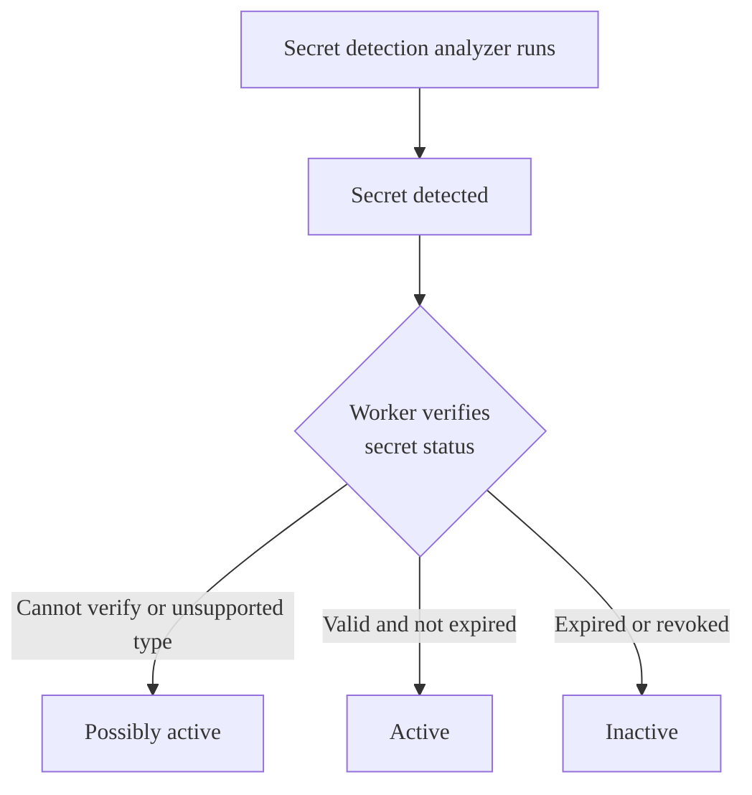



ステータス: ベータ

- プラン: Ultimate
- 提供形態: GitLab.com





- GitLab 18.0で`validity_checks`[フラグ](../../../api/feature_flags.md)とともに[導入](https://gitlab.com/gitlab-org/gitlab/-/issues/520923)されました。デフォルトでは無効になっています。
- GitLab 18.2で、`validity_checks_security_finding_status`というフラグが[導入](https://gitlab.com/gitlab-org/gitlab/-/issues/556765)され、アクセスが追加されました。デフォルトでは無効になっています。
- GitLab 18.5で実験からベータ版に[変更](https://gitlab.com/gitlab-org/gitlab/-/merge_requests/206929)されました。





この機能の利用可否は、機能フラグによって制御されます。詳細については、履歴を参照してください。この機能はテストには利用できますが、本番環境での使用には適していません。



GitLabの整合性チェックは、アクセストークンなどのシークレットがアクティブかどうかを判断します。シークレットがアクティブな場合:

- 期限切れになっていません。
- 認証に使用できます。

アクティブなシークレットは、正当なユーザーになりすますために使用される可能性があるため、非アクティブなシークレットよりもセキュリティ上のリスクが高くなります。複数のシークレットが一度にリークした場合、どのシークレットがアクティブであるかを知ることは、トリアージと修正の重要な部分です。

これは[実験的機能](../../../policy/development_stages_support.md)です。

## 整合性チェックを有効にする {#enable-validity-checks}

前提要件: 

- パイプラインのセキュリティスキャンが有効になっているプロジェクトが必要です。

プロジェクトの整合性チェックを有効にするには:

1. 左側のサイドバーで、**検索または移動先**を選択して、プロジェクトを見つけます。
1. 左側のサイドバーで**セキュリティ** > **セキュリティ設定**を選択します。
1. **パイプラインのシークレット検出**で、**整合性チェック**の切替をオンにします。

GitLabは、`secret_detection`CI/CDジョブが完了すると、検出されたシークレットのステータスを確認します。シークレットのステータスを表示するには、脆弱性レポートの詳細ページを表示します。シークレットのステータスを更新するには（たとえば、失効した後）、`secret_detection`CI/CDジョブを再実行します。

### カバレッジ {#coverage}

整合性チェックは、次のシークレットタイプをサポートしています: 

- GitLabのパーソナルアクセストークン
- ルーティング可能なGitLabパーソナルアクセストークン
- GitLabデプロイトークン
- GitLab Runnerの認証トークン
- ルーティング可能なGitLab Runner認証トークン
- GitLab Kubernetesエージェントトークン
- GitLab SCIM OAuthトークン
- GitLab CI/CDジョブトークン
- GitLab受信メールトークン
- GitLabフィードトークン (v2)
- パイプライントリガートークン

## 整合性チェックのワークフロー {#validity-check-workflow}

シークレット検出アナライザーが潜在的なシークレットを検出すると、GitLabはそのベンダーにシークレットのステータスを検証し、検出に次のいずれかのステータスを割り当てます: 

- アクティブの可能性: GitLabはシークレットのステータスを検証できませんでした。または、シークレットタイプが整合性チェックでサポートされていません。
- アクティブ: シークレットは期限切れではなく、認証に使用できます。
- 非アクティブ: シークレットは期限切れまたは失効されており、認証に使用できません。

アクティブなシークレットとアクティブの可能性のあるシークレットは、できるだけ早く解決する必要があります。

## シークレットステータスの更新 {#refresh-secret-status}



- GitLab 18.2で`secret_detection_validity_checks_refresh_token`[フラグ](../../../api/feature_flags.md)とともに[導入](https://gitlab.com/gitlab-org/gitlab/-/issues/537133)されました。デフォルトでは無効になっています。





この機能の利用可否は、機能フラグによって制御されます。詳細については、履歴を参照してください。この機能はテストには利用できますが、本番環境での使用には適していません。



整合性チェックの実行後、トークンが失効または期限切れになった場合でも、トークンのステータスは自動的に更新されません。トークンを更新するには、手動でステータスを更新できます: 

1. 脆弱性レポートで、更新する脆弱性を選択します。
1. トークンのステータスの横にある**再試行**（）を選択します。

整合性チェックが再度実行され、トークンのステータスが更新されます。

## トラブルシューティング {#troubleshooting}

整合性チェックを使用しているときに、次の問題が発生する可能性があります。

### 予期しないトークンのステータス {#unexpected-token-status}

GitLabがその検証を明確に検証できない場合、トークンはアクティブの可能性のあるステータスになります。これには次の原因が考えられます: 

- シークレットの検証が実行されていません。
- シークレットタイプは、整合性チェックでサポートされていません。
- トークンプロバイダーへの接続に問題が発生しました。

この問題を解決するには、`secret_detection`ジョブを再実行します。数回試行してもステータスが解決しない場合は、シークレットを手動で検証する必要があるかもしれません。

トークンがアクティブでないことが確実でない限り、アクティブの可能性のあるシークレットをできるだけ早く失効して交換する必要があります。
