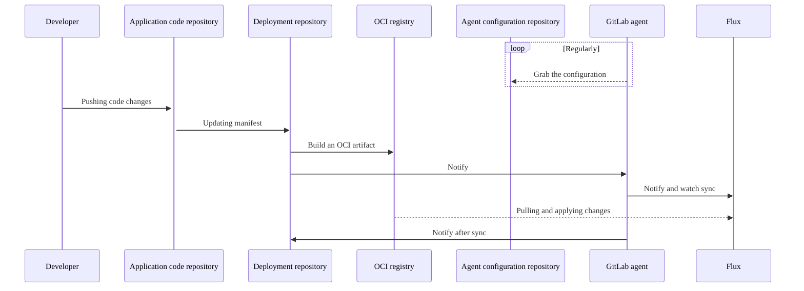



- プラン: Free、Premium、Ultimate
- 提供形態: GitLab.com、GitLab Self-Managed、GitLab Dedicated





- GitLab 15.3でGitLab PremiumからGitLab Freeに[移行](https://gitlab.com/gitlab-org/gitlab/-/issues/346567)しました。
- GitLab 15.7で`id`属性をオプションにするように[変更](https://gitlab.com/gitlab-org/gitlab/-/issues/346585)されました。
- Kubernetesのマニフェストファイルをフェッチするためのブランチ、タグ、またはコミット参照の指定は、GitLab 15.7で[導入](https://gitlab.com/groups/gitlab-org/-/epics/4516)されました。
- GitOpsのためにFluxを優先するようにGitLab 16.1で[変更](https://gitlab.com/gitlab-org/gitlab/-/issues/395364)されました。



GitLabはGitOps用に[Flux](https://fluxcd.io/flux/)を統合します。Fluxの使用を開始するには、[Flux for GitOpsチュートリアル](getting_started.md)を参照してください。

GitOpsを使用すると、次のGitリポジトリから、コンテナ化されたクラスターとアプリケーションを管理できます。

- システムの信頼できる唯一の情報源です。
- システムを操作する唯一の場所です。

GitLab、Kubernetes、およびGitOpsを組み合わせることで、以下を実現できます。

- GitOpsオペレーターとしてのGitLab。
- 自動化およびコンバージェンスシステムとしてのKubernetes。
- 継続的デプロイのためのGitLab CI/CD。
- 継続的デプロイとクラスターの可観測性のためのエージェント。
- 組み込みの自動構成ドリフト修復。
- 透過的なマルチアクターフィールドトークン管理のための[サーバーサイド適用](https://kubernetes.io/docs/reference/using-api/server-side-apply/)によるリソース管理。

## デプロイシーケンス {#deployment-sequence}

この図は、GitOpsデプロイにおけるリポジトリと主要なアクターを示しています。



GitOpsデプロイには、Fluxと`agentk`の両方を使用する必要があります。Fluxはクラスターの状態をソースと同期させ、`agentk`はFluxのセットアップを簡素化し、クラスターからGitLabへのアクセス管理を提供し、GitLab UIでクラスターの状態を視覚化します。

### ソース管理のためのOCI {#oci-for-source-control}

Gitリポジトリの代わりに、OCIイメージをFluxのソースコントローラーとして使用する必要があります。[GitLabコンテナレジストリ](../../packages/container_registry/_index.md)はOCIイメージをサポートしています。

| OCIレジストリ | Gitリポジトリ |
| ---          | ---              |
| コンテナイメージをスケールでサポートするように設計されています。 | ソース管理をバージョン管理して保存するように設計されています。 |
| イミュータブルで、セキュリティスキャンをサポートします。 | 変更可能。 |
| デフォルトのGitブランチは、同期をトリガーせずにクラスターの状態を保存できます。 | デフォルトのGitブランチは、クラスターの状態を保存するために使用されると、同期をトリガーします。 |

## リポジトリ構造 {#repository-structure}

設定を簡素化するには、チームごとに1つの配信リポジトリを使用します。アプリケーションごとに、配信リポジトリを複数のOCIイメージにパッケージ化できます。

リポジトリ構造に関するその他の推奨事項については、[Fluxドキュメント](https://fluxcd.io/flux/guides/repository-structure/)を参照してください。

## 即時Gitリポジトリ調整 {#immediate-git-repository-reconciliation}



- GitLab 16.1で`notify_kas_on_git_push`[フラグ](../../../administration/feature_flags/_index.md)とともに[導入](https://gitlab.com/gitlab-org/gitlab/-/issues/392852)されました。デフォルトでは無効になっています。
- GitLab 16.2で、[GitLab.comとGitLab Self-Managedにおいて有効](https://gitlab.com/gitlab-org/gitlab/-/merge_requests/126527)にされました。
- GitLab 16.3で[機能フラグが削除](https://gitlab.com/gitlab-org/gitlab/-/issues/410429)されました。



通常、Fluxソースコントローラーは、設定された間隔でGitリポジトリを調整します。これにより、`git push`とクラスターの状態の調整との間に遅延が発生し、GitLabからの不要なプルが発生する可能性があります。

Kubernetes用エージェントは、エージェントが接続中のインスタンス内のGitLabプロジェクトを参照するFlux `GitRepository`オブジェクトを自動的に検出し、インスタンスの[`Receiver`](https://fluxcd.io/flux/components/notification/receivers/)を設定します。Kubernetes用エージェントがアクセスできるリポジトリへの`git push`を検出すると、`Receiver`がトリガーされ、Fluxはリポジトリへの変更でクラスターを調整します。

即時Gitリポジトリ調整を使用するには、次のものを実行するKubernetesクラスターが必要です。

- Kubernetes用エージェント
- Flux `source-controller`および`notification-controller`。

即時Gitリポジトリ調整は、プッシュと調整の間の時間を短縮できますが、すべての`git push`イベントが受信されることを保証するものではありません。許容できる期間に[`GitRepository.spec.interval`](https://fluxcd.io/flux/components/source/gitrepositories/#interval)を設定する必要があります。



エージェントは、エージェント設定プロジェクトとすべてのパブリックプロジェクトにのみアクセスできます。エージェントは、エージェント設定プロジェクトを除き、プライベートプロジェクトをすぐに調整することはできません。エージェントがプライベートプロジェクトにアクセスできるようにすることは、[イシュー389393](https://gitlab.com/gitlab-org/gitlab/-/issues/389393)で提案されています。



### カスタムWebhookエンドポイント {#custom-webhook-endpoints}

Kubernetes用エージェントが`Receiver` Webhookを呼び出すと、エージェントは`http://webhook-receiver.flux-system.svc.cluster.local`にデフォルト設定されます。これは、Fluxブートストラップインストールによって設定されたデフォルトのURLでもあります。カスタムエンドポイントを設定するには、エージェントが解決できるURLに`flux.webhook_receiver_url`を設定します。次に例を示します。

```yaml
flux:
  webhook_receiver_url: http://webhook-receiver.another-flux-namespace.svc.cluster.local
```

この形式で設定された[サービスプロキシURL](https://kubernetes.io/docs/tasks/access-application-cluster/access-cluster-services/)には、特別な処理があります: `/api/v1/namespaces/[^/]+/services/[^/]+/proxy`。次に例を示します。

```yaml
flux:
  webhook_receiver_url: /api/v1/namespaces/flux-system/services/http:webhook-receiver:80/proxy
```

これらの場合、Kubernetes用エージェントは、利用可能なKubernetesの設定とコンテキストを使用して、APIエンドポイントに接続中します。クラスターの外部でエージェントを実行していて、Flux通知コントローラー用に[`Ingress`を設定していない場合は、これを使用できます](https://fluxcd.io/flux/guides/webhook-receivers/#expose-the-webhook-receiver)。



信頼できるサービスプロキシURLのみを設定する必要があります。サービスプロキシURLを指定すると、Kubernetes用エージェントは、APIサービスで認証するために必要な認証情報を含む、一般的なKubernetes APIリクエストを送信します。



## トークン管理 {#token-management}

特定のFlux機能を使用するには、複数のアクセストークンが必要になる場合があります。さらに、複数のトークンタイプを使用して同じ結果を得ることができます。

このセクションでは、必要なトークンのガイドラインを提供し、可能な場合はトークンタイプの推奨事項を提供します。

### FluxによるGitLabアクセス {#gitlab-access-by-flux}

GitLabコンテナレジストリまたはGitリポジトリにアクセスするために、Fluxは以下を使用できます。

- プロジェクトアクセストークンまたはグループデプロイトークン。
- プロジェクトアクセストークンまたはグループデプロイトークン。
- プロジェクトまたはグループのグループアクセストークン。
- パーソナルアクセストークン。

トークンは書き込みアクセスを必要としません。

`http`アクセスが可能な場合は、プロジェクトアクセストークンを使用する必要があります。`git+ssh`アクセスが必要な場合は、デプロイキーを使用する必要があります。デプロイキーとデプロイトークンを比較するには、[デプロイキー](../../project/deploy_keys/_index.md)を参照してください。

デプロイトークンの作成、ローテーション、およびレポート作成の自動化のサポートは、[イシュー389393](https://gitlab.com/gitlab-org/gitlab/-/issues/389393)で提案されています。

### GitLab通知へのFlux {#flux-to-gitlab-notification}

Gitソースから同期するようにFluxを設定すると、GitLabパイプラインで[Fluxが外部ジョブ状態を登録できます](https://fluxcd.io/flux/components/notification/providers/#git-commit-status-updates)。

Fluxから外部ジョブ状態を取得するには、以下を使用できます。

- プロジェクトアクセストークンまたはグループデプロイトークン。
- プロジェクトまたはグループのグループアクセストークン。
- パーソナルアクセストークン。

トークンには`api`スコープが必要です。漏洩したトークンのアタックサーフェスを最小限に抑えるには、プロジェクトアクセストークンを使用する必要があります。

ジョブとしてのFluxのGitLabパイプラインへの統合は、[イシュー405007](https://gitlab.com/gitlab-org/gitlab/-/issues/405007)で提案されています。

## 関連トピック {#related-topics}

- [トレーニングとデモのためのGitOpsの動作例](https://gitlab.com/groups/guided-explorations/gl-k8s-agent/gitops/-/wikis/home)
- [自己ペースの教室ワークショップ](https://gitlab-for-eks.awsworkshop.io)（AWS EKSを使用していますが、他のKubernetesクラスターにも使用できます）
- GitOpsワークフローでのKubernetesシークレットの管理
  - [SOPSを使用してFluxに組み込み](https://fluxcd.io/flux/guides/mozilla-sops/)
  - [Sealed Secretsを使用](https://fluxcd.io/flux/guides/sealed-secrets/)
