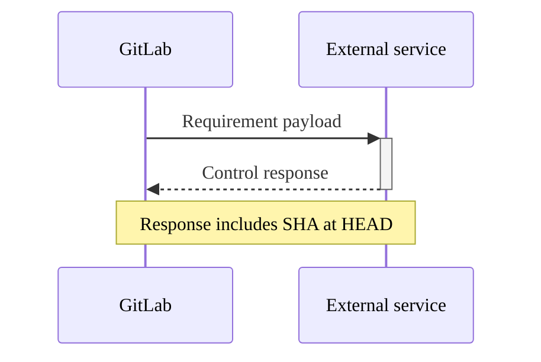



- プラン: Premium、Ultimate
- 提供形態: GitLab.com、GitLab Self-Managed、GitLab Dedicated



コンプライアンスフレームワークは、プロジェクトに特定のコンプライアンス要件があるか、追加の監視が必要であることを識別するためのラベルとして作成できます。

Ultimateプランでは、コンプライアンスフレームワークは、適用先のプロジェクトに対してオプションで[コンプライアンスコンプライアンスパイプライン構成](../compliance_pipelines.md)と[セキュリティポリシー](../../application_security/policies/enforcement/_index.md#scope)を適用できます。

コンプライアンスフレームワークはトップレベルグループに作成されます。プロジェクトが既存のトップレベルグループの外部に移動された場合、そのフレームワークは削除されます。

各プロジェクトに最大20個のコンプライアンスフレームワークを適用できます。

クリック可能なデモについては、[Custom Compliance frameworks](https://gitlab.navattic.com/custom-compliance)を参照してください。
<!-- Demo published on 2025-10-09 -->

## 前提要件 {#prerequisites}

- コンプライアンスフレームワークを作成、編集、削除するには、次のいずれかの権限がユーザーに必要です:
  - トップレベルグループのオーナーロール。
  - `admin_compliance_framework` [カスタム権限](../../custom_roles/abilities.md#compliance-management)を持つ[カスタムロール](../../custom_roles/_index.md)が割り当てられていること。
- プロジェクトとの間でコンプライアンスフレームワークを追加または削除するには、プロジェクトが所属するグループにコンプライアンスフレームワークが必要です。

## コンプライアンスフレームワークを作成、編集、または削除する {#create-edit-or-delete-a-compliance-framework}

コンプライアンスフレームワークレポートまたはコンプライアンスプロジェクトレポートのいずれかを使用して、コンプライアンスフレームワークを作成、編集、または削除できます。

コンプライアンスフレームワークレポートの使用に関する詳細については、以下を参照してください:

- [新規コンプライアンスフレームワークを作成](../compliance_center/compliance_frameworks_report.md#create-a-new-compliance-framework)。
- [コンプライアンスフレームワークを編集する](../compliance_center/compliance_frameworks_report.md#edit-a-compliance-framework)。
- [コンプライアンスフレームワークを削除する](../compliance_center/compliance_frameworks_report.md#delete-a-compliance-framework)。

コンプライアンスプロジェクトレポートの使用に関する詳細については、以下を参照してください:

- [新規コンプライアンスフレームワークを作成](../compliance_center/compliance_projects_report.md#create-a-new-compliance-framework)。
- [コンプライアンスフレームワークを編集する](../compliance_center/compliance_projects_report.md#edit-a-compliance-framework)。
- [コンプライアンスフレームワークを削除する](../compliance_center/compliance_projects_report.md#delete-a-compliance-framework)。サブグループとプロジェクトは、トップレベルグループに作成されたすべてのコンプライアンスフレームワークにアクセスできます。ただし、サブグループまたはプロジェクトを使用して、コンプライアンスフレームワークを作成、編集、または削除することはできません。プロジェクトオーナーは、プロジェクトに適用するフレームワークを選択できます。

## プロジェクトにコンプライアンスフレームワークを適用する {#apply-a-compliance-framework-to-a-project}



- 複数のコンプライアンスフレームワークの適用は、GitLab 17.3で[導入されました](https://gitlab.com/groups/gitlab-org/-/epics/13294)。
- コンプライアンスフレームワークを介したプロジェクトへのコンプライアンスフレームワークの適用は、GitLab 17.11で[導入されました](https://gitlab.com/groups/gitlab-org/-/epics/16747)。



複数のコンプライアンスフレームワークを1つのプロジェクトに適用できますが、個人用ネームスペースのプロジェクトにはコンプライアンスフレームワークを適用できません。

コンプライアンスフレームワークをプロジェクトに適用するには、[コンプライアンスプロジェクトレポート](../compliance_center/compliance_projects_report.md#apply-a-compliance-framework-to-projects-in-a-group)を介してコンプライアンスフレームワークを適用します。

[GraphQL API](../../../api/graphql/reference/_index.md#mutationprojectupdatecomplianceframeworks)を使用して、1つまたは複数のコンプライアンスフレームワークをプロジェクトに適用できます。

GraphQLを使用してサブグループにコンプライアンスフレームワークを作成する場合、ユーザーが適切な権限を持っている場合、フレームワークはルート祖先に作成されます。GitLab UIは、この動作を抑制するために読み取り専用ビューを表示します。

コンプライアンスフレームワークをコンプライアンスフレームワークを介してプロジェクトに適用するには:

1. 左側のサイドバーで、**検索または移動先**を選択して、グループを見つけます。
1. 左側のサイドバーで、**セキュリティ** > **コンプライアンスセンター**を選択します。
1. ページで、**プロジェクト**タブを選択します。
1. コンプライアンスフレームワークにカーソルを合わせ、**Edit Framework**（フレームワークを編集）タブを選択します。
1. **プロジェクト**セクションを選択します。
1. リストからプロジェクトを選択します。
1. **Update Framework**（フレームワークを更新）を選択します。

## デフォルトコンプライアンスフレームワーク {#default-compliance-frameworks}



- GitLab 15.6で[導入](https://gitlab.com/gitlab-org/gitlab/-/issues/375036)されました。



グループオーナーは、デフォルトコンプライアンスフレームワークを設定できます。デフォルトのフレームワークは、そのグループで作成されたすべての新しいプロジェクトとインポートされたプロジェクトに適用されます。既存のプロジェクトに適用されるフレームワークには影響しません。デフォルトのフレームワークは削除できません。

デフォルトに設定されているコンプライアンスフレームワークには、`default`ラベルが付いています。

### コンプライアンスセンターを使用して、デフォルトを設定および削除する {#set-and-remove-a-default-by-using-the-compliance-center}

[コンプライアンスプロジェクトレポート](../compliance_center/compliance_projects_report.md)からデフォルトとして設定する（またはデフォルトを削除する）には:

1. 左側のサイドバーで、**検索または移動先**を選択して、グループを見つけます。
1. 左側のサイドバーで、**セキュリティ** > **コンプライアンスセンター**を選択します。
1. ページで、**プロジェクト**タブを選択します。
1. コンプライアンスフレームワークにカーソルを合わせ、**Edit Framework**（フレームワークを編集）タブを選択します。
1. **デフォルトとして設定**を選択します。
1. **変更を保存**を選択します。

[コンプライアンスフレームワークレポート](../compliance_center/compliance_frameworks_report.md)からデフォルトとして設定する（またはデフォルトを削除する）には:

1. 左側のサイドバーで、**検索または移動先**を選択して、グループを見つけます。
1. 左側のサイドバーで、**セキュリティ** > **コンプライアンスセンター**を選択します。
1. ページで、**フレームワーク**タブを選択します。
1. コンプライアンスフレームワークにカーソルを合わせ、**Edit Framework**（フレームワークを編集）タブを選択します。
1. **デフォルトとして設定**を選択します。
1. **変更を保存**を選択します。

## プロジェクトからコンプライアンスフレームワークを削除する {#remove-a-compliance-framework-from-a-project}

グループ内の1つまたは複数のプロジェクトからコンプライアンスフレームワークを削除するには、[コンプライアンスプロジェクトレポート](../compliance_center/compliance_projects_report.md#remove-a-compliance-framework-from-projects-in-a-group)を使用してコンプライアンスフレームワークを削除します。

## コンプライアンスフレームワークをインポートおよびエクスポートする {#import-and-export-compliance-frameworks}



- GitLab 17.11で[導入](https://gitlab.com/groups/gitlab-org/-/epics/16499)されました。



既存のコンプライアンスフレームワークをJSONファイルとしてダウンロードし、JSONテンプレートから新しいフレームワークをアップロードします。

JSONテンプレートのライブラリは、[Compliance Adherence Templates](https://gitlab.com/gitlab-org/software-supply-chain-security/compliance/engineering/compliance-adherence-templates)プロジェクトから入手できます。これらのテンプレートを使用して、定義済みのコンプライアンスフレームワークを迅速に採用します。

### コンプライアンスフレームワークをJSONファイルとしてエクスポートする {#export-a-compliance-framework-as-a-json-file}

この機能を使用すると、コンプライアンスフレームワークを共有およびバックアップできます。

コンプライアンスセンターからコンプライアンスフレームワークをエクスポートするには:

1. 左側のサイドバーで、**検索または移動先**を選択して、グループを見つけます。
1. 左側のサイドバーで、**セキュリティ** > **コンプライアンスセンター**を選択します。
1. ページで、**フレームワーク**タブを選択します。
1. エクスポートするコンプライアンスフレームワークを見つけます。
1. 縦方向の省略記号（）を選択し、編集を選択します。
1. **Export as JSON file**（JSONファイルとしてエクスポート）を選択します。

JSONファイルがローカルシステムにダウンロードされます。

### JSONファイルからコンプライアンスフレームワークをインポートする {#import-a-compliance-framework-from-a-json-file}

この機能を使用すると、共有またはバックアップされたコンプライアンスフレームワークを使用できます。JSONファイルの名前は、既存のコンプライアンスフレームワークと同じであってはなりません。

JSONテンプレートを使用してコンプライアンスフレームワークをインポートするには:

1. 左側のサイドバーで、**検索または移動先**を選択して、グループを見つけます。
1. 左側のサイドバーで、**セキュリティ** > **コンプライアンスセンター**を選択します。
1. ページで、**フレームワーク**タブを選択します。
1. **新規フレームワーク**を選択します。
1. **フレームワークのインポート**を選択します。
1. 表示されるダイアログで、ローカルシステムからJSONファイルを選択します。

インポートが成功すると、新しいコンプライアンスフレームワークがリストに表示されます。エラーは修正のために表示されます。

### JSONテンプレートの構造とスキーマ {#json-template-structure-and-schema}

コンプライアンスフレームワークのJSONテンプレートは、フレームワークのメタデータ、要求、および関連するコントロールを定義する特定のスキーマ構造に従います。この構造を理解すると、組織固有のコンプライアンスのニーズに合わせて、カスタムテンプレートを作成したり、既存のテンプレートを変更したりするのに役立ちます。

#### フレームワークのプロパティ {#framework-properties}

各JSONテンプレートには、次のトップレベルグループプロパティが含まれています:

| プロパティ | 型 | 必須 | 説明 |
|----------|------|----------|-------------|
| `name` | 文字列 | はい | コンプライアンスフレームワークの表示名。 |
| `description` | 文字列 | はい | フレームワークの目的の詳細な説明。 |
| `color` | 文字列 | はい | フレームワークの16進カラーコード（例: `#1f75cb`）。 |
| `requirements` | 配列 | いいえ | コンプライアンスコントロールを定義する要求オブジェクトの配列。 |

#### 要求構造 {#requirements-structure}

`requirements`配列内の各要求には、以下が含まれます:

| プロパティ | 型 | 必須 | 説明 |
|----------|------|----------|-------------|
| `name` | 文字列 | はい | コンプライアンス要件の名前。 |
| `description` | 文字列 | はい | 要求が強制する内容の詳細な説明。 |
| `controls` | 配列 | はい | 要求を実装するコントロールオブジェクトの配列。 |

#### コントロール構造 {#control-structure}

`controls`配列内の各コントロールは、特定のチェックを定義します:

| プロパティ | 型 | 必須 | 説明 |
|----------|------|----------|-------------|
| `name` | 文字列 | はい | GitLabコントロールID（例: `scanner_sast_running`）。 |
| `control_type` | 文字列 | はい | GitLabコントロールの場合は常に`"internal"`。 |
| `expression` | オブジェクト | はい | コントロールの評価ロジックを定義します。 |

#### 式オブジェクト {#expression-object}

`expression`オブジェクトは、コントロールの評価方法を定義します:

| プロパティ | 型 | 必須 | 説明 |
|----------|------|----------|-------------|
| `field` | 文字列 | はい | 評価するフィールド名（コントロール名と一致）。 |
| `operator` | 文字列 | はい | 比較演算子（`=`、`>=`、`<=`、`>`、`<`）。 |
| `value` | 混合 | はい | 予想される値（ブール値、数値、または文字列）。 |

#### JSONテンプレート構造の例 {#example-json-template-structure}

完全な構造を示す簡単な例を次に示します:

```json
{
  "name": "Example Compliance Framework",
  "description": "Example framework demonstrating JSON structure",
  "color": "#1f75cb",
  "requirements": [
    {
      "name": "Security Scanning Requirement",
      "description": "Ensure security scanning is enabled for all projects",
      "controls": [
        {
          "name": "scanner_sast_running",
          "control_type": "internal",
          "expression": {
            "field": "scanner_sast_running",
            "operator": "=",
            "value": true
          }
        },
        {
          "name": "minimum_approvals_required_2",
          "control_type": "internal",
          "expression": {
            "field": "minimum_approvals_required",
            "operator": ">=",
            "value": 2
          }
        }
      ]
    }
  ]
}
```

## 要件 {#requirements}



- プラン: Ultimate
- 提供形態: GitLab.com、GitLab Self-Managed、GitLab Dedicated





- GitLab 17.11で`enable_standards_adherence_dashboard_v2`[フラグ](../../../administration/feature_flags/_index.md)とともに[導入](https://gitlab.com/gitlab-org/gitlab/-/merge_requests/186525)されました。デフォルトでは有効になっています。
- GitLab 18.3で[一般提供](https://gitlab.com/gitlab-org/gitlab/-/issues/535563)になりました。機能フラグ`enable_standards_adherence_dashboard_v2`は削除されました。



GitLab Ultimateでは、コンプライアンスフレームワークの特定の**requirements**（要求）を定義できます。要求は1つまたは複数のコントロールで構成され、フレームワークが割り当てられているプロジェクトの設定または動作に対するチェックです。各要求には、最大5つのコントロールがあります。

各コントロールには、スケジュールされたスキャンまたはトリガーされたスキャン中にGitLabがプロジェクトのコンプライアンス遵守を評価するために使用するロジックが含まれています。コンプライアンス遵守の追跡方法の詳細については、[コンプライアンス状況レポート](../compliance_center/compliance_status_report.md)を参照してください。

GitLabコンプライアンスコントロールまたは外部コントロールをフレームワーク要求に使用できます。

### GitLabコンプライアンスコントロール {#gitlab-compliance-controls}

GitLabコンプライアンスコントロールは、GitLabコンプライアンスフレームワークで使用できます。コントロールは、コンプライアンスフレームワークに割り当てられているプロジェクトの設定または動作に対するチェックです。

GitLabコンプライアンスコントロールを組み合わせて、[コンプライアンス標準](compliance_standards.md)を満たすのに役立ちます。

<!-- Updates to control names must be reflected also in compliance_standards.md -->

| コントロール名                                             | コントロールID                                                 | 説明 |
|:---------------------------------------------------------|:-----------------------------------------------------------|:------------|
| APIセキュリティを実行中                                     | `scanner_api_security_running`                             | [APIセキュリティスキャン](../../application_security/api_security/_index.md)が構成され、プロジェクトのデフォルトブランチブランチパイプラインで実行されていることを確認します。パイプラインが正常に実行される必要があります。 |
| 少なくとも1つの承認                                    | `minimum_approvals_required_1`                             | マージリクエストのマージ前に、少なくとも1つの[承認を必要とする](../../project/merge_requests/approvals/_index.md)ことを確認します。 |
| 少なくとも2件の承認                                   | `minimum_approvals_required_2`                             | マージリクエストのマージ前に、少なくとも2つの[承認を必要とする](../../project/merge_requests/approvals/_index.md)ことを確認します。 |
| 認証SSOが有効                                         | `auth_sso_enabled`                                         | プロジェクトで[シングルサインオン（SSO）認証](../../group/saml_sso/_index.md)が有効になっていることを確認します。 |
| 作成者が承認したマージリクエストは禁止されています               | `merge_request_prevent_author_approval`                    | マージリクエストの作成者が[自分の変更を承認できない](../../project/merge_requests/approvals/_index.md)ことを確認します。 |
| ブランチの削除が無効                                 | `branch_deletion_disabled`                                 | [ブランチを削除できない](../../project/repository/branches/protected.md)ことを確認します。 |
| CI/CDジョブトークンのスコープが有効                            | `cicd_job_token_scope_enabled`                             | [CI/CDジョブトークン](../../../ci/jobs/ci_job_token.md)のスコープ制限が有効になっていることを確認します。 |
| コードの変更にはコードオーナーが必要                         | `code_changes_requires_code_owners`                        | コードの変更には[コードオーナー](../../project/codeowners/_index.md)からの承認が必要であることを確認します。 |
| コードオーナーの承認を必須とする                             | `code_owner_approval_required`                             | [コードオーナーファイル](../../project/codeowners/_index.md)が構成されていることを確認します。 |
| コード品質の実行                                     | `scanner_code_quality_running`                             | [コード品質スキャン](../../../ci/testing/code_quality.md)が構成され、プロジェクトのデフォルトブランチブランチパイプラインで実行されていることを確認します。パイプラインが正常に実行される必要があります。 |
| コミッターが承認したマージリクエストは禁止されています           | `merge_request_prevent_committers_approval`                | [マージリクエストにコミットしたユーザーはそれを承認できない](../../project/merge_requests/approvals/_index.md)ことを確認します。 |
| コンテナスキャンを実行中                               | `scanner_container_scanning_running`                       | [コンテナスキャン](../../application_security/container_scanning/_index.md)が構成され、プロジェクトのデフォルトブランチブランチパイプラインで実行されていることを確認します。パイプラインが正常に実行される必要があります。 |
| DASTを実行中                                             | `scanner_dast_running`                                     | [動的アプリケーションセキュリティテスト](../../application_security/dast/_index.md)（DAST）が構成され、プロジェクトのデフォルトブランチブランチパイプラインで実行されていることを確認します。パイプラインが正常に実行される必要があります。 |
| デフォルトブランチの保護                                 | `default_branch_protected`                                 | デフォルトブランチブランチに[保護ルール](../../project/repository/branches/protected.md)が有効になっていることを確認します。 |
| デフォルトブランチが直接プッシュから保護されている                | `default_branch_protected_from_direct_push`                | [デフォルトブランチブランチへの直接プッシュを防止](../../project/repository/branches/protected.md)します。 |
| デフォルトブランチブランチのユーザーがマージできる                           | `default_branch_users_can_merge`                           | [ユーザーがデフォルトブランチブランチへの変更をマージできるかどうか](../../project/repository/branches/protected.md)を制御します。 |
| デフォルトブランチブランチのユーザーがプッシュできる                            | `default_branch_users_can_push`                            | [ユーザーがデフォルトブランチブランチに直接プッシュできるかどうか](../../project/repository/branches/protected.md)を制御します。 |
| 依存関係スキャンの実行                              | `scanner_dep_scanning_running`                             | [依存関係スキャン](../../application_security/dependency_scanning/_index.md)が構成され、プロジェクトのデフォルトブランチブランチパイプラインで実行されていることを確認します。パイプラインが正常に実行される必要があります。**メモ**: GitLabセルフマネージドインスタンス（18.4以降）では、アーティファクトの相違により、[SBOMベースの依存関係スキャン](../../application_security/dependency_scanning/dependency_scanning_sbom/_index.md)を使用すると、このコントロールが失敗する可能性があります。[互換性に関する考慮事項](../../application_security/dependency_scanning/dependency_scanning_sbom/_index.md#compliance-framework-compatibility)を参照してください。 |
| リポジトリごとに2人の管理者を確保                 | `ensure_2_admins_per_repo`                                 | [少なくとも2人のオーナー](../../project/members/_index.md)が各プロジェクトに割り当てられていることを確認します。 |
| エラートラッキングが有効                                   | `error_tracking_enabled`                                   | プロジェクトで[エラートラッキング](../../../operations/error_tracking.md)が有効になっていることを確認します。 |
| 強制プッシュが無効                                      | `force_push_disabled`                                      | リポジトリへの[強制プッシュ](../../project/repository/branches/protected.md)を防止します。 |
| プロジェクトのフォークが存在する                              | `has_forks`                                                | プロジェクトが[フォーク](../../project/repository/forking_workflow.md)されていることを確認します。 |
| ファズテストの実行                                     | `scanner_fuzz_testing_running`                             | プロジェクトのデフォルトブランチパイプラインで[ファズテスト](../../application_security/coverage_fuzzing/_index.md)が構成され、実行されていることを確認します。パイプラインが正常に実行される必要があります。 |
| GitLabライセンスレベルUltimate                            | `gitlab_license_level_ultimate`                            | GitLabインスタンスが[Ultimateライセンス](https://about.gitlab.com/pricing/feature-comparison/)を使用していることを確認します。 |
| 有効なCI/CD設定がある                            | `has_valid_ci_config`                                      | プロジェクトに[有効なCI/CD設定](../../../ci/yaml/_index.md)があることを確認します。 |
| IaCスキャンの実行                                     | `scanner_iac_running`                                      | [Infrastructure as Code（IaC）スキャン](../../application_security/iac_scanning/_index.md)が構成され、プロジェクトのデフォルトブランチパイプラインで実行されていることを確認します。パイプラインが正常に実行される必要があります。 |
| 内部表示レベルが禁止されている                         | `project_visibility_not_internal`                          | プロジェクトが[内部表示レベル](../../public_access.md)に設定されていないことを確認します。 |
| イシュートラッキングが有効                                   | `issue_tracking_enabled`                                   | プロジェクトで[イシュートラッキング](../../project/issues/_index.md)が有効になっていることを確認します。 |
| ライセンスコンプライアンスを実行中                               | `scanner_license_compliance_running`                       | プロジェクトのデフォルトブランチパイプラインで[ライセンスコンプライアンススキャン](../license_approval_policies.md)が構成され、実行されていることを確認します。パイプラインが正常に実行される必要があります。 |
| マージリクエストのコミットにより承認がリセットされる                    | `merge_request_commit_reset_approvals`                     | [マージリクエストへの新しいコミットで承認がリセットされる](../../project/merge_requests/approvals/settings.md)ことを確認します。 |
| マージリクエストの承認ルールでは編集を禁止            | `merge_requests_approval_rules_prevent_editing`            | [マージリクエストの承認ルール](../../project/merge_requests/approvals/settings.md)を編集できないようにします。 |
| マージリクエストにはコードオーナーの承認が必要               | `merge_requests_require_code_owner_approval`               | マージリクエストには[コードオーナー](../../project/codeowners/_index.md)からの承認が必要であることを確認します。 |
| 管理者よりもメンバーが多い                                 | `more_members_than_admins`                                 | プロジェクトに割り当てられている管理者[（オーナーまたはメンテナー）](../../project/members/_index.md)の数が、メンバーの総数よりも少ないことを確認します。 |
| トリアージされていないパッケージハンターの検出結果なし                     | `package_hunter_no_findings_untriaged`                     | すべての[パッケージハンター](../../application_security/triage/_index.md)の検出結果がトリアージされていることを確認します。 |
| プロジェクトはアーカイブされていません                                     | `project_archived`                                         | [プロジェクトがアーカイブされている](../../project/settings/_index.md)かどうかを確認します。通常、`false`に準拠しています。 |
| プロジェクトは削除対象としてマークされていません                          | `project_marked_for_deletion`                              | [プロジェクトが削除対象としてマークされている](../../project/settings/_index.md)かどうかを確認します。`false`に準拠しています。 |
| プロジェクトパイプラインは公開されていません                             | `project_pipelines_not_public`                             | [プロジェクトパイプラインが公開されていない](../../../ci/pipelines/settings.md)ことを確認します。 |
| プロジェクトリポジトリが存在する                                | `project_repo_exists`                                      | プロジェクトに[Gitリポジトリ](../../../topics/git/_index.md)が存在することを確認します。 |
| プロジェクトの表示レベルは公開されていません                            | `project_visibility_not_public`                            | プロジェクトが[公開表示レベル](../../public_access.md)に設定されていないことを確認します。 |
| 保護ブランチが存在する                                 | `protected_branches_set`                                   | プロジェクトに[保護ブランチ](../../project/repository/branches/protected.md)が含まれていることを確認します。 |
| プッシュ保護が有効                                  | `push_protection_enabled`                                  | 機密ファイルに対して[プッシュ保護](../../project/repository/push_rules.md)が有効になっていることを確認します。 |
| ブランチを最新にする必要                                | `require_branch_up_to_date`                                | [ソースブランチが、マージする前にターゲットブランチと一致している](../../project/merge_requests/methods/_index.md)ことを確認します。 |
| 直線的な履歴が必要                                   | `require_linear_history`                                   | マージコミットを禁止することで、[直線的なコミット履歴](../../project/merge_requests/methods/_index.md#fast-forward-merge)を確保します。 |
| 組織レベルでMFAが必要                        | `require_mfa_at_org_level`                                 | 組織レベルで[多要素認証](../../profile/account/two_factor_authentication.md)が必須であることを確認します。 |
| コントリビューターにMFAが必要                             | `require_mfa_for_contributors`                             | [コントリビューターが多要素認証を有効にしている](../../profile/account/two_factor_authentication.md)ことを確認します。 |
| 署名されたコミットが必要                                  | `require_signed_commits`                                   | [署名されたコミット](../../project/repository/signed_commits)が必須であることを確認します。 |
| プッシュ時に承認をリセット                                  | `reset_approvals_on_push`                                  | マージリクエストに[新しいコミットがプッシュされると承認がリセットされる](../../project/merge_requests/approvals/settings.md)ことを確認します。 |
| ディスカッションを解決する必要がある                             | `resolve_discussions_required`                             | マージが許可される前に、すべての[ディスカッションを解決する必要がある](../../discussions/_index.md)ことを確認します。 |
| プッシュ/マージアクセスを制限                               | `restrict_push_merge_access`                               | [保護ブランチ](../../project/repository/branches/protected.md)へのプッシュまたはマージを許可するユーザーを制限します。 |
| ビルドへのアクセス制限                                  | `restricted_build_access`                                  | [ビルドアーティファクトとパイプライン出力へのアクセスを制限する](../../../ci/pipelines/settings.md)ことを確認します。 |
| 古いリポジトリを確認してアーカイブする                    | `review_and_archive_stale_repos`                           | 古いリポジトリを確認して[アーカイブ](../../project/settings/_index.md)されていることを確認します。 |
| 非アクティブなユーザーを確認して削除する                         | `review_and_remove_inactive_users`                         | [非アクティブなユーザー](../../../administration/admin_area.md)を確認して削除されていることを確認します。 |
| SASTを実行中                                             | `scanner_sast_running`                                     | プロジェクトのデフォルトブランチパイプラインで[静的アプリケーションセキュリティテスト（SAST）](../../application_security/sast/_index.md)が構成され、実行されていることを確認します。パイプラインが正常に実行される必要があります。 |
| シークレット検出を実行中                                 | `scanner_secret_detection_running`                         | プロジェクトのデフォルトブランチパイプラインで[シークレット検出スキャン](../../application_security/secret_detection/_index.md)が構成され、実行されていることを確認します。パイプラインが正常に実行される必要があります。 |
| セキュアWebhook                                          | `secure_webhooks`                                          | [Webhook](../../project/integrations/webhooks.md)が安全に構成されていることを確認します。 |
| 古いブランチのクリーンアップを有効                             | `stale_branch_cleanup_enabled`                             | [古いブランチの自動クリーンアップ](../../project/repository/branches/_index.md)が有効になっていることを確認します。 |
| ステータスチェックが必要                                   | `status_checks_required`                                   | マージが許可される前に[ステータスチェック](../../project/merge_requests/status_checks.md)に合格する必要があることを確認します。 |
| ステータスページの設定                                   | `status_page_configured`                                   | プロジェクトに[ステータスページ](../../../operations/incident_management/status_page.md)が構成されていることを確認します。 |
| リポジトリに対する厳密なアクセス許可                         | `strict_permissions_for_repo`                              | リポジトリ・アクセスに対して[厳密なアクセス許可](../../permissions.md)が設定されていることを確認します。 |
| Terraformが有効                                        | `terraform_enabled`                                        | プロジェクトで[Terraformインテグレーション](../../../administration/terraform_state.md)が有効になっていることを確認します。 |
| ユーザー定義のCI/CD変数はメンテナーに制限   | `project_user_defined_variables_restricted_to_maintainers` | メンテナーロール以上のユーザーのみが[パイプラインをトリガーする際にユーザー定義変数を渡す](../../../ci/variables/_index.md)ことができるようにします。 |
| 脆弱性のSLO日数がしきい値を超過                  | `vulnerabilities_slo_days_over_threshold`                  | [脆弱性が、サービスレベル目標（SLO）のしきい値（180日）](../../application_security/vulnerabilities/_index.md)内で処理されるようにします。 |

### 外部コントロール {#external-controls}



- GitLab 18.1で[導入された](https://gitlab.com/gitlab-org/gitlab/-/merge_requests/192177)外部コントロール名。



外部コントロールとは、外部コントロールまたは要件のステータスを要求する外部システムへのAPIコールです。

サードパーティツールにデータを送信する外部コントロールを作成できます。

[コンプライアンススキャン](../compliance_center/compliance_status_report.md#scan-timing-and-triggers)の実行時に、GitLabは通知を送信します。ユーザーまたは自動化されたワークフローは、GitLabの外部からコントロールのステータスを更新できます。

このインテグレーションにより、ServiceNowなどのサードパーティ製ワークフローツール、または選択したカスタムツールとインテグレーションできます。サードパーティツールは、関連付けられたステータスで応答します。このステータスは、[コンプライアンスステータスレポート](../compliance_center/compliance_status_report.md)に表示されます。

プロジェクトごとに外部コントロールを構成できます。外部コントロールはプロジェクト間で共有されません。外部コントロールが6時間以上保留状態のままの場合、ステータスチェックは失敗します。

#### 外部コントロールを追加する {#add-external-controls}

フレームワークの作成時または編集時に外部コントロールを追加するには:

1. 左側のサイドバーで、**検索または移動先**を選択して、グループを見つけます。
1. 左側のサイドバーで、**セキュリティ** > **コンプライアンスセンター**を選択します。
1. ページで、**フレームワーク**タブを選択します。
1. **新規フレームワーク**を選択するか、既存のものを編集します。
1. **要求**セクションで、**新しい要件**を選択します。
1. **外部コントロールの追加**を選択します。
1. フィールドで、**外部コントロール名**、**外部URL**、**`HMAC` shared secret**（共有シークレット）を編集します。
1. オプション。**Ping enabled**（Pingを有効にする） 切替をオフにして、コンプライアンススキャン中にGitLabが外部サービスに通知を送信するかどうかを制御します。
1. **フレームワークへの変更を保存**を選択して、要件を保存します。

#### Pingが有効な設定 {#ping-enabled-setting}



- [導入](https://gitlab.com/gitlab-org/gitlab/-/issues/538898) GitLab 18.5。



**Ping enabled**（Pingを有効にする） の設定は、GitLabが外部システムから外部コントロール・ステータスの更新を12時間ごとにリクエストするかどうかを制御します。

- 有効（デフォルト）: GitLabは、HTTPリクエストを外部サービスのURLに12時間ごとに自動的に送信し、応答に基づいて外部コントロール・ステータスを更新します。
- 無効: GitLabは外部サービスに通知を送信せず、外部コントロールはコンプライアンスフレームワークのUIに**無効**バッジを表示します。外部コントロールのステータスをリクエストするには、[外部コントロールAPI](../../../api/external_controls.md)を手動で使用する必要があります。

#### 外部コントロール・ライフサイクル {#external-control-lifecycle}

外部コントロールには**asynchronous**（非同期）ワークフローがあります。[コンプライアンススキャン](../compliance_center/compliance_status_report.md#scan-timing-and-triggers)は、ペイロードを外部サービスに送信するたびに発行します。



ペイロードを受信すると、外部サービスは必要なプロセスを実行できます。次に、外部サービスはREST APIを使用して、応答をマージリクエストにポストバックできます。

外部コントロールには、3つのステータスのいずれかを設定できます。

| ステータス    | 説明 |
|:----------|:------------|
| `pending` | デフォルトの状態外部サービスから応答を受信しませんでした。 |
| `pass`  | 外部サービスから応答を受信し、外部コントロールが外部サービスによって承認されました。 |
| `fail`  | 外部サービスから応答を受信し、外部コントロールが外部サービスによって拒否されました。 |

GitLabの外部で何かが変更された場合は、APIを使用して[外部コントロールのステータスを設定](../../../api/external_controls.md)できます。最初にペイロードが送信されるのを待つ必要はありません。

### 要件を追加 {#add-requirements}

フレームワークの作成時または編集時に要件を追加するには:

1. 左側のサイドバーで、**検索または移動先**を選択して、グループを見つけます。
1. 左側のサイドバーで、**セキュリティ** > **コンプライアンスセンター**を選択します。
1. ページで、**フレームワーク**タブを選択します。
1. **新規フレームワーク**を選択するか、既存のものを編集します。
1. **要求**セクションで、**新しい要件**を選択します。
1. ダイアログで、**名前**と**説明**を追加します。
1. **GitLabコントロールを追加する**を選択して、コントロールを追加します。
1. コントロール・ドロップダウン・リストでコントロールを検索して選択します。
1. **フレームワークへの変更を保存**を選択して、要件を保存します。

### 要件の編集 {#edit-requirements}

フレームワークの作成時または編集時に要件を編集するには:

1. 左側のサイドバーで、**検索または移動先**を選択して、グループを見つけます。
1. 左側のサイドバーで、**セキュリティ** > **コンプライアンスセンター**を選択します。
1. ページで、**フレームワーク**タブを選択します。
1. **新規フレームワーク**を選択するか、既存のものを編集します。
1. **要求**セクションで、**アクション** > **編集**を選択します。
1. ダイアログで、**名前**と**説明**を編集します。
1. **GitLabコントロールを追加する**を選択して、コントロールを追加します。
1. コントロール・ドロップダウン・リストでコントロールを検索して選択します。
1. コントロールを削除するには、を選択します。
1. **フレームワークへの変更を保存**を選択して、要件を保存します。

## トラブルシューティング {#troubleshooting}

コンプライアンスフレームワークを操作しているときに、次の問題が発生する可能性があります。

### エラー: `Unable to determine the correct upload URL` {#error-unable-to-determine-the-correct-upload-url}

JSONテンプレートと同じ名前のコンプライアンスフレームワークがすでに存在する場合、[コンプライアンスフレームワークのインポート](#import-a-compliance-framework-from-a-json-file)中にこのエラーが発生します。
