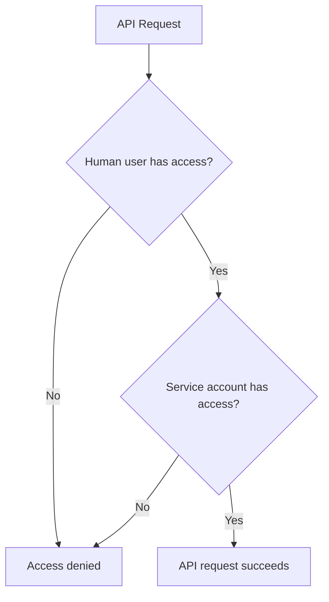



- GitLab 17.9で[導入](https://gitlab.com/gitlab-org/gitlab/-/issues/506641)されました。



GitLab Duo with Amazon Qは、複合IDを使用してリクエストを認証します。



プロダクトの他の領域における複合IDのサポートは、[イシュー511373](https://gitlab.com/gitlab-org/gitlab/-/issues/511373)で提案されています。



リクエストを認証するトークンは、2つのIDの複合です:

- プライマリ作成者は、Amazon Qの[サービスアカウント](../profile/service_accounts.md)です。このサービスアカウントはインスタンス全体に適用され、Amazon Qクイックアクションが使用されたプロジェクトのデベロッパーロールを持っています。このサービスアカウントは、トークンのオーナーです。
- セカンダリ作成者は、クイックアクションを送信した一般ユーザーです。このユーザーの`id`は、トークンのスコープに含まれています。

この複合IDにより、Amazon Qによって作成されたアクティビティーが、Amazon Qサービスアカウントに正しく帰属することが保証されます。同時に、この複合IDは、一般ユーザーに対する[特権エスカレーション](https://en.wikipedia.org/wiki/Privilege_escalation)がないことを保証します。

この[動的スコープ](https://github.com/doorkeeper-gem/doorkeeper/pull/1739)は、APIリクエストの認可時に検証されます。認可がリクエストされると、GitLabは、サービスアカウントとクイックアクションを開始したユーザーの両方が十分な権限を持っているかを検証します。

