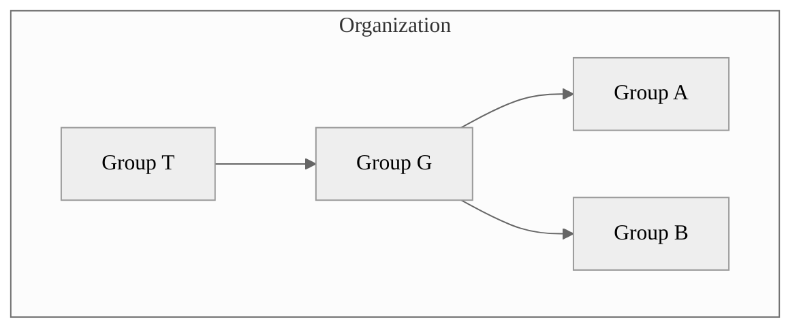



- プラン: Free、Premium、Ultimate
- 提供形態: GitLab.com、GitLab Self-Managed、GitLab Dedicated



GitLabでは、グループを使用して、1つまたは複数の関連プロジェクトを同時に管理します。

グループを使用すると、すべてのグループメンバーとコミュニケーションを取り、プロジェクトの権限を管理できます。グループへのアクセス権を持っているユーザーは、そのグループ内のすべてのプロジェクトへのアクセス権を取得します。

また、グループ内のプロジェクトのすべてのイシューとマージリクエスト、およびグループのアクティビティーに関する分析を表示することもできます。

大規模な組織の場合は、[サブグループ](subgroups/_index.md)を作成することもできます。

グループの作成と管理の詳細については、[グループを管理する](manage.md)を参照してください。

## グループ階層 {#group-hierarchy}

グループは、ツリー構造で編成されています:

- **top-level group**（トップレベルグループ）は、組織の「ルート」に作成されたグループです。1つの組織に、1つまたは複数のトップレベルグループを含めることができます。トップレベルグループには、1つまたは複数のサブグループを含めることができます。
- **parent group**（親グループ）は、1つまたは複数のサブグループを含むグループです。
- **subgroup**（サブグループ）は、別のグループに属するグループです。

たとえば、次の図について説明します:

- 組織に4つのグループがあります。1つのトップレベルグループ（T）に1つのサブグループ（G）があり、G内に2つのサブグループ（AとB）が含まれています。
- Tはトップレベルグループであり、Gの親グループです。
- GはTのサブグループ（子）であり、AとBの親グループです。
- AとBはGのサブグループ（子）です。

## グループ構造 {#group-structure}

グループの設定方法は、ユースケース、チーム規模、アクセス要件によって異なります。次の表に、グループを構成する最も一般的なモデルを示します。

<!-- vale gitlab_base.Simplicity = NO -->

| モデル | 構造 | ユースケース |
| ----- | --------- | --------- |
| シンプル | すべてのプロジェクトに1つのグループ。 | シームレスなコラボレーションとリソースへのアクセスを必要とする小規模なチームまたは特定のソリューション（マーケティングWebサイトなど）で作業する。 |
| チーム | さまざまなタイプのチーム（製品チームやエンジニアリングチームなど）向けのさまざまなグループまたはサブグループ。 | 一部のチームが自律的に作業する、または外部チームメンバーからの集中的なリソースと制限されたアクセスを必要とする大規模な組織で作業する。 |
| クライアント | クライアントごとに1つのグループ。 | 異なるリソースとアクセスレベルを必要とする複数のクライアントにカスタムソリューションを提供する。 |
| 機能 | 1つのタイプの機能（AI/MLなど）に1つのグループまたはサブグループ。 | 1つの機能に特定の専門家によるリソースとコラボレーションが必要となる複雑な製品を開発する。 |

<!-- vale gitlab_base.Simplicity = YES -->



GitLab Self-Managedで、組織全体の概要を確認する場合は、トップレベルグループを1つ作成する必要があります。すべてのグループの組織ビューを作成するための取り組みについては、[エピック9266](https://gitlab.com/groups/gitlab-org/-/epics/9266)を参照してください。トップレベルグループは、完全な[セキュリティダッシュボードとセキュリティセンター](../application_security/security_dashboard/_index.md) 、[脆弱性レポート](../application_security/vulnerability_report/_index.md) 、[コンプライアンスセンター](../compliance/compliance_center/_index.md) 、[バリューストリーム分析](value_stream_analytics/_index.md)を通じて、組織全体のインサイトを提供します。



## グループの表示レベル {#group-visibility}

プロジェクトと同様に、グループは次のユーザーに表示されるように設定できます:

- 匿名ユーザー。
- すべての認証済みユーザー。
- 明示的なグループメンバーのみ。

アプリケーション設定レベルでの[表示レベル](../../administration/settings/visibility_and_access_controls.md#restrict-visibility-levels)の制限は、グループにも適用されます。内部に設定すると、検索ページは匿名ユーザーに対して空になります。グループページには、表示レベルのアイコンがあります。

ユーザーは、直属の親グループよりも高い表示レベルでサブグループまたはプロジェクトを作成することはできません。

## 複数のグループを表示する {#view-groups}

すべての公開グループまたは内部グループを確認するには:

1. 左側のサイドバーで、**検索または移動先**を選択します。[新しいナビゲーションをオンにしている](../interface_redesign.md#turn-new-navigation-on-or-off)場合、このフィールドは上部のバーにあります。
1. **すべてのグループを表示**を選択します。
1. 右上隅で、**グループを検索する**を選択します。

## メンバーになっているグループを表示する {#view-groups-you-are-a-member-of}



- **メンバー**タブは、GitLab 18.2で`your_work_groups_vue`[フラグ](../../administration/feature_flags/_index.md)とともに[導入](https://gitlab.com/groups/gitlab-org/-/epics/13781)されました。デフォルトでは無効になっています。
- GitLab 18.3で[一般提供](https://gitlab.com/gitlab-org/gitlab/-/issues/542790)になりました。機能フラグ`your_work_groups_vue`は削除されました。



直接または間接的にメンバーシップを持っているグループを表示するには:

1. 左側のサイドバーで、**検索または移動先**を選択します。[新しいナビゲーションをオンにしている](../interface_redesign.md#turn-new-navigation-on-or-off)場合、このフィールドは上部のバーにあります。
1. **すべてのグループを表示**を選択します。

このページには、以下によって自分がメンバーであるグループが表示されます:

- サブグループの親グループのメンバーシップ。
- グループまたはサブグループ内のプロジェクトの直接または継承されたメンバーシップ。

### 非アクティブなグループを表示 {#view-inactive-groups}



- **非アクティブ**タブは、GitLab 18.2で`your_work_groups_vue`[フラグ](../../administration/feature_flags/_index.md)とともに[導入](https://gitlab.com/groups/gitlab-org/-/epics/13781)されました。デフォルトでは無効になっています。
- GitLab 18.3で[一般提供](https://gitlab.com/gitlab-org/gitlab/-/issues/542790)になりました。機能フラグ`your_work_groups_vue`は削除されました。



グループが削除の保留中であるか、アーカイブされている場合、グループは非アクティブになります。

すべての非アクティブなグループを表示するには、次の手順に従います:

1. 左側のサイドバーで、**検索または移動先**を選択して、グループを見つけます。[新しいナビゲーションをオンにしている](../interface_redesign.md#turn-new-navigation-on-or-off)場合、このフィールドは上部のバーにあります。
1. **すべてのグループを表示**を選択します。
1. **非アクティブ**タブを選択します。

リスト内の各非アクティブなグループには、グループがアーカイブ済みか削除の保留中かを示すバッジが表示されます。

グループが削除の保留中の場合、リストには以下も表示されます:

- グループが最終的に削除されるようにスケジュールされている時間。
- **復元**アクション。グループを復元すると、次のようになります:
  - **削除の保留中**のラベルが削除されます。グループは削除のスケジュールから削除されます。
  - グループが**非アクティブ**タブから削除されます。

## 1つのグループを表示する {#view-a-group}



- グループIDでグループにアクセスできる機能は、GitLab 17.5で[導入](https://gitlab.com/gitlab-org/gitlab/-/merge_requests/165889)されました。



グループの概要ページには、グループとそのメンバー、サブグループ、プロジェクトに関する次の情報が表示されます:

- グループの説明
- 最近のアクティビティー
- 作成されたマージリクエストとイシューの数
- 追加されたメンバーの数
- サブグループとプロジェクト
- 共有プロジェクト
- アーカイブされたプロジェクト

グループを表示するには:

- 左側のサイドバーで、**検索または移動先**を選択して、グループを見つけます。[新しいナビゲーションをオンにしている](../interface_redesign.md#turn-new-navigation-on-or-off)場合、このフィールドは上部のバーにあります。

グループのサブグループとプロジェクトを検索し、昇順または降順に並べ替えることができます。

`https://gitlab.example.com/-/g/<id>`で、名前の代わりにIDを使用してグループにアクセスできます。たとえば、グループ`example-group`のIDが`123456`の場合、`https://gitlab.example.com/example-group`または`https://gitlab.example.com/-/g/123456`でグループにアクセスできます。

## グループIDを見つける {#find-the-group-id}

[GitLab API](../../api/_index.md)を使用してグループを操作する場合は、グループIDが必要になる場合があります。

グループIDを見つけるには:

1. 左側のサイドバーで、**検索または移動先**を選択して、グループを見つけます。[新しいナビゲーションをオンにしている](../interface_redesign.md#turn-new-navigation-on-or-off)場合、このフィールドは上部のバーにあります。
1. グループの概要ページの右上隅で、**アクション**（）を選択します。
1. **Copy Group ID**（グループIDをコピー）を選択します。

## グループのアクティビティーを表示する {#view-group-activity}

グループのアクティビティーを表示するには:

1. 左側のサイドバーで、**検索または移動先**を選択して、グループを見つけます。[新しいナビゲーションをオンにしている](../interface_redesign.md#turn-new-navigation-on-or-off)場合、このフィールドは上部のバーにあります。
1. **管理** > **アクティビティー**を選択します。
1. オプション。コントリビュートの種類でアクティビティーをフィルタリングするには、次のタブを選択します:

   - **すべて**: グループメンバーによる、グループおよびグループのプロジェクト内のすべてのコントリビュート。
   - **プッシュイベント**: グループのプロジェクトでのプッシュイベント。
   - **マージイベント**: グループのプロジェクトで承認されたマージリクエスト。
   - **イシューイベント**: グループのプロジェクトでオープンまたはクローズされたイシュー。
   - **コメント**: グループメンバーによってグループのプロジェクトに投稿されたコメント。
   - **Wiki**: グループ内のWikiページの更新。
   - **デザイン**: グループのプロジェクトで追加、更新、削除されたデザイン。
   - **チーム**: グループのプロジェクトに参加および離脱したグループメンバー。

## グループを作成する {#create-a-group}

グループを作成するには:

<!-- vale gitlab_base.FutureTense = NO -->

1. 左側のサイドバーの上部で、**新規作成**（）を選択し、**新規グループ**を選択します。[新しいナビゲーションをオンにしている](../interface_redesign.md#turn-new-navigation-on-or-off)場合、このボタンは右上隅にあります。
1. **グループを作成**を選択します。
1. **グループ名**テキストボックスに、グループの名前を入力します。グループ名として使用できない単語のリストについては、[予約済みの名前](../reserved_names.md)を参照してください。
1. **グループURL**テキストボックスに、[ネームスペース](../namespace/_index.md)に使用するグループのパスを入力します。
1. グループの[**表示レベル**](../public_access.md)を選択します。
1. オプション。GitLabエクスペリエンスをパーソナライズするには:
   - **だれがこのグループを使用しますか？**で、オプションを選択します。
   - **このグループを何に使う予定ですか？**ドロップダウンリストから、オプションを選択します。
1. オプション。グループにメンバーを招待するには、**Email 1**（メール1）テキストボックスに、招待するユーザーのメールアドレスを入力します。他のユーザーを招待するには、**他のメンバーを招待**を選択し、ユーザーのメールアドレスを入力します。
1. **グループを作成**を選択します。

<!-- vale gitlab_base.FutureTense = YES -->

<i class="fa fa-youtube-play youtube" aria-hidden="true"></i>グループの詳細については、[GitLab Namespaces (users, groups and subgroups)](https://youtu.be/r0sJgjR2f5A)（GitLabネームスペース（ユーザー、グループ、サブグループ））をご覧ください。

## グループ名、説明、アバターを編集する {#edit-group-name-description-and-avatar}

グループの詳細は、グループの一般設定から編集できます。

前提要件: 

- グループのオーナーロールを持っている必要があります。

グループの詳細を編集するには:

1. 左側のサイドバーで、**検索または移動先**を選択して、グループを見つけます。[新しいナビゲーションをオンにしている](../interface_redesign.md#turn-new-navigation-on-or-off)場合、このフィールドは上部のバーにあります。
1. **設定** > **一般**を選択します。
1. **グループ名**テキストボックスに、グループ名を入力します。[グループ名の制限](../reserved_names.md)を参照してください。
1. オプション。**グループの説明 (オプション)**テキストボックスに、グループの説明を入力します。説明は500文字に制限されています。
1. オプション。**グループアバター**で、**ファイルを選択**を選択し、画像を選択します。理想的な画像サイズは192 x 192ピクセルで、許可される最大ファイルサイズは200 KBです。
1. **変更を保存**を選択します。

## グループを離脱する {#leave-a-group}



- GitLab 16.7で、グループを離脱するためのボタンがアクションメニューに[移動](https://gitlab.com/gitlab-org/gitlab/-/issues/431539)しました。



グループを離脱すると、次のようになります:

- グループ、そのサブグループ、およびプロジェクトのメンバーではなくなり、コントリビュートできなくなります。
- 割り当てられていたすべてのイシューとマージリクエストの割り当てが解除されます。

グループを離脱するには:

1. 左側のサイドバーで、**検索または移動先**を選択して、グループを見つけます。[新しいナビゲーションをオンにしている](../interface_redesign.md#turn-new-navigation-on-or-off)場合、このフィールドは上部のバーにあります。
1. グループの概要ページの右上隅で、**アクション**（）を選択します。
1. **このグループから離脱する**を選択し、もう一度**このグループから離脱する**を選択します。

## グループを削除する {#delete-a-group}



- GitLab 16.0の[GitLab.com](https://gitlab.com/gitlab-org/gitlab/-/issues/393622)と[GitLab Self-Managed](https://gitlab.com/gitlab-org/gitlab/-/merge_requests/119606)で、遅延削除がデフォルトで有効になり、即時削除のオプションが削除されました。
- GitLab 18.0でGitLab PremiumからGitLab Freeに[移行](https://gitlab.com/groups/gitlab-org/-/epics/17208)しました。



デフォルトでは、グループを初めて削除すると、削除保留状態になります。すぐに削除するには、グループをもう一度削除します。

前提要件: 

- グループのオーナーロールが必要です。
- グループにプロジェクトが含まれている場合、[プロジェクトの削除を許可する](../../administration/settings/visibility_and_access_controls.md#restrict-project-deletion-to-administrators)必要があります。

グループとそのコンテンツを削除するには:

1. 左側のサイドバーで、**検索または移動先**を選択して、グループを見つけます。[新しいナビゲーションをオンにしている](../interface_redesign.md#turn-new-navigation-on-or-off)場合、このフィールドは上部のバーにあります。
1. **設定** > **一般**を選択します。
1. **高度な設定**セクションを展開します。
1. **グループを削除**セクションで、**削除**を選択します。
1. 確認ダイアログで、グループ名を入力し、**確認**を選択します。

グループダッシュボードからグループを削除することもできます:

1. 左側のサイドバーで、**検索または移動先**を選択します。[新しいナビゲーションをオンにしている](../interface_redesign.md#turn-new-navigation-on-or-off)場合、このフィールドは上部のバーにあります。
1. **すべてのグループを表示**を選択します。
1. 削除するグループの（）を選択します。
1. **削除**を選択します。
1. 確認ダイアログで、グループ名を入力し、**確認**を選択します。

このアクションにより、グループを削除対象としてマークするバックグラウンドジョブが追加されます。GitLab.comでは、グループは30日後に削除されます。GitLab Self-Managedでは、[インスタンスの設定](../../administration/settings/visibility_and_access_controls.md#deletion-protection)から保持期間を変更できます。

グループの削除をスケジュールしたユーザーが、削除の実行前にグループへのアクセス権を失った場合（グループを離脱したり、ロールがダウングレードされたり、グループからBANされたりした場合）、復元するジョブは代わりにグループを復元するため、グループは削除対象としてスケジュールされなくなります。



ジョブの実行前に、グループの削除をスケジュールしたユーザーがオーナーロールまたは管理者アクセス権を回復した場合、ジョブはグループを完全に削除します。



## グループをすぐに削除する {#delete-a-group-immediately}



- GitLab 16.0では、[GitLab.com](https://gitlab.com/gitlab-org/gitlab/-/issues/393622)および[GitLab Self-Managed](https://gitlab.com/gitlab-org/gitlab/-/merge_requests/119606)におけるグループの遅延削除がデフォルトで有効になりました。
- GitLab 18.4で`disallow_immediate_deletion`[フラグ](../../administration/feature_flags/_index.md)とともに[導入](https://gitlab.com/gitlab-org/gitlab/-/issues/561680)されました。デフォルトでは無効になっています。
- [置換](https://gitlab.com/gitlab-org/gitlab/-/issues/569453) GitLab 18.5では、削除がスケジュールされているグループとプロジェクトの即時削除を許可するためのインスタンス設定。[機能フラグによって制御](../../administration/feature_flags/_index.md) `allow_immediate_namespaces_deletion`という名前。機能フラグはデフォルトで無効になっています。





GitLab.comおよびGitLab Dedicatedでは、グループが削除された後、そのデータは30日間保持され、即時削除は使用できません。GitLab.comでグループをすぐに削除する必要がある場合は、[サポートチケット](https://about.gitlab.com/support/)を開くことができます。



待機期間を経ずに、グループをすぐに削除することもできます。

前提要件: 

- グループのオーナーロールが必要です。
- [グループを削除対象としてマーク](#delete-a-group)している必要があります。

削除対象としてマークされたグループをすぐに削除するには:

1. 左側のサイドバーで、**検索または移動先**を選択して、グループを見つけます。[新しいナビゲーションをオンにしている](../interface_redesign.md#turn-new-navigation-on-or-off)場合、このフィールドは上部のバーにあります。
1. **設定** > **一般**を選択します。
1. **高度な設定**を展開します。
1. **グループを削除**セクションで、**今すぐ削除**を選択します。
1. 要求されたら、アクションを確認します。

このアクションにより、グループ、そのサブグループ、プロジェクト、およびイシューやマージリクエストを含むすべての関連リソースが削除されます。

## グループを復元する {#restore-a-group}

削除対象としてマークされているグループを復元するには:

1. 左側のサイドバーで、**検索または移動先**を選択して、グループを見つけます。[新しいナビゲーションをオンにしている](../interface_redesign.md#turn-new-navigation-on-or-off)場合、このフィールドは上部のバーにあります。
1. **設定** > **一般**を選択します。
1. **高度な設定**セクションを展開します。
1. **グループを復元**セクションで、**グループを復元**を選択します。

## アクションメニューを使用してグループを管理する {#manage-groups-with-the-actions-menu}

すべてのグループのリストを表示し、**アクション**メニューで管理できます。

前提要件: 

- グループからの離脱を除く、使用可能なすべてのアクションにはオーナーロールが必要です。

グループの**アクション**メニューにアクセスするには、次の手順に従います:

1. 左側のサイドバーで、**検索または移動先** > **すべてのグループを表示**を選択します。[新しいナビゲーションをオンにしている](../interface_redesign.md#turn-new-navigation-on-or-off)場合、このフィールドは上部のバーにあります。
1. **グループ**ページで、グループを見つけて**アクション**メニューを選択します（）。
1. アクションを選択します。

グループの状態に応じて、次のアクションを使用できます:

| グループの状態      | 利用可能なアクション       |
| ---------------- | ----------------------- |
| アクティブ           | **編集**、**アーカイブ**、**転送**、**このグループから離脱する**、**削除** |
| アーカイブ済み         | **アーカイブ解除**、**このグループから離脱する**、**削除** |
| 削除の保留中 | **復元**、**このグループから離脱する** |

## グループへのアクセスをリクエストする {#request-access-to-a-group}

ユーザーは、管理者が許可すれば、グループのメンバーになることをリクエストできます。

1. 左側のサイドバーで、**検索または移動先**を選択します。[新しいナビゲーションをオンにしている](../interface_redesign.md#turn-new-navigation-on-or-off)場合、このフィールドは上部のバーにあります。
1. **すべてのグループを表示**を選択します。
1. 右上隅で、**グループを検索する**を選択します。
1. **名前で検索**テキストボックスに、参加するグループの名前を入力します。
1. 検索結果で、グループの名前を選択します。
1. グループページで、グループ名の下にある**アクセスをリクエスト**を選択します。

最近アクティブなグループオーナーの上位10人までが、リクエストを記載したメールを受信します。グループオーナーは、リクエストを承認または拒否できます。

リクエストが承認される前に気が変わった場合は、**アクセスリクエストを取り消す**を選択します。

## グループメンバーを表示する {#view-group-members}

グループのメンバーを表示するには:

1. 左側のサイドバーで、**検索または移動先**を選択して、グループを見つけます。[新しいナビゲーションをオンにしている](../interface_redesign.md#turn-new-navigation-on-or-off)場合、このフィールドは上部のバーにあります。
1. **管理** > **メンバー**を選択します。

表には、メンバーについて次の内容が表示されます:

- **アカウント**名とユーザー名。
- **ソース**の[ソース](../project/members/_index.md#membership-types)。透明性を確保するため、GitLabはグループメンバーのすべてのメンバーシップソースを表示します。複数のメンバーシップソースを持つメンバーは、個別のメンバーとして表示およびカウントされます。たとえば、メンバーがグループに直接および継承によって追加されている場合、そのメンバーは異なるソースとともに**メンバー**テーブルに2回表示され、グループに属する2人の個別メンバーとしてカウントされます。
- グループでの[**ロール**](../project/members/_index.md#which-roles-you-can-assign)。
- グループメンバーシップの**有効期限**。
- アカウントに関連する**アクティビティー**。



グループメンバーの**ソース**の表示に一貫性がない場合があります。詳細については、[イシュー23020](https://gitlab.com/gitlab-org/gitlab/-/issues/23020)を参照してください。



すべてのネームスペースメンバー（およびそれぞれの占有シート）を表示するには、トップレベルのネームスペースで、[**使用量クォータ**ページを表示](../../subscriptions/manage_users_and_seats.md#view-seat-usage)します。

## グループ内のメンバーをフィルタリングおよび並べ替える {#filter-and-sort-members-in-a-group}

グループ内のメンバーを見つけるには、並べ替え、フィルタリング、または検索を実行します。

### グループをフィルタリングする {#filter-a-group}

グループをフィルタリングしてメンバーを見つけます。デフォルトでは、グループとサブグループのすべてのメンバーが表示されます。

グループメンバーのリストでは、エントリに次のバッジが表示されることがあります:

- **SAML**: メンバーに接続されている[SAMLアカウント](saml_sso/_index.md)があることを示します。
- **エンタープライズ**: トップレベルグループのメンバーが[Enterpriseユーザー](../enterprise_user/_index.md)であることを示します。

1. 左側のサイドバーで、**検索または移動先**を選択して、グループを見つけます。[新しいナビゲーションをオンにしている](../interface_redesign.md#turn-new-navigation-on-or-off)場合、このフィールドは上部のバーにあります。
1. **管理** > **メンバー**を選択します。
1. メンバーリストの上にある**メンバーをフィルターする**テキストボックスに、検索条件を入力します。表示するには:
   - グループの直接メンバーを表示するには、**Membership = Direct**（メンバーシップ = 直接）を選択します。
   - グループの継承、共有、および継承共有メンバーを表示するには、**Membership = Indirect**（メンバーシップ = 間接）を選択します。
   - 2要素認証が有効または無効になっているメンバーを表示するには、**2FA = Enabled**（2FA = 有効）または**2FA = Disabled**（2FA = 無効）を選択します。
   - [Enterpriseユーザー](../enterprise_user/_index.md)であるトップレベルグループのメンバーを表示するには、**Enterprise = true**を選択します。

### グループを検索する {#search-a-group}

名前、ユーザー名、または[公開メール](../profile/_index.md#set-your-public-email)でメンバーを検索できます。

1. 左側のサイドバーで、**検索または移動先**を選択して、グループを見つけます。[新しいナビゲーションをオンにしている](../interface_redesign.md#turn-new-navigation-on-or-off)場合、このフィールドは上部のバーにあります。
1. **管理** > **メンバー**を選択します。
1. メンバーのリストの上にある**メンバーをフィルターする**ボックスに、検索条件を入力します。
1. **メンバーをフィルターする**ボックスの右側にある虫眼鏡（）を選択します。

### グループ内のメンバーを並べ替える {#sort-members-in-a-group}

メンバーを**アカウント**、**アクセス付与日**、**ロール**、または**最終ログイン**で並べ替えることができます。

1. 左側のサイドバーで、**検索または移動先**を選択して、グループを見つけます。[新しいナビゲーションをオンにしている](../interface_redesign.md#turn-new-navigation-on-or-off)場合、このフィールドは上部のバーにあります。
1. **管理** > **メンバー**を選択します。
1. メンバーリストの上にある右上隅の**アカウント**リストから、フィルタリング条件を選択します。
1. 並べ替えの昇順と降順を切り替えるには、**アカウント**リストの右側にある矢印（または）を選択します。

## グループにユーザーを追加する {#add-users-to-a-group}



- 有効期限切れが近づいているアクセス権に関するメール通知は、GitLab 16.2で[導入](https://gitlab.com/gitlab-org/gitlab/-/issues/12704)されました。
- GitLab 17.4で、サブグループおよびプロジェクトの直接メンバーのアクセス権の有効期限が[削除](https://gitlab.com/gitlab-org/gitlab/-/issues/471051)されました。



ユーザーにグループ内のすべてのプロジェクトへのアクセス権を付与できます。

前提要件: 

- グループのオーナーロールを持っている必要があります。
- GitLab Self-Managedインスタンスの場合:
  - [新規サインアップが無効になっている](../../administration/settings/sign_up_restrictions.md#disable-new-sign-ups)場合、管理者がユーザーを追加する必要があります。
  - [ユーザー招待が許可されていない](../../administration/settings/visibility_and_access_controls.md#prevent-invitations-to-groups-and-projects)場合、管理者がユーザーを追加する必要があります。
  - [管理者による承認が有効になっている](../../administration/settings/sign_up_restrictions.md#turn-on-administrator-approval-for-role-promotions)場合、管理者が招待を承認する必要があります。

1. 左側のサイドバーで、**検索または移動先**を選択して、グループを見つけます。[新しいナビゲーションをオンにしている](../interface_redesign.md#turn-new-navigation-on-or-off)場合、このフィールドは上部のバーにあります。
1. **管理** > **メンバー**を選択します。
1. **メンバーを招待**を選択します。
1. 招待されるユーザーの状況に応じて、次の操作を行います:

   - GitLabアカウントを持っている場合は、ユーザーのユーザー名を入力します。
   - GitLabアカウントを持っていない場合は、ユーザーのメールアドレスを入力します。

1. [デフォルトロール](../permissions.md)または[カスタムロール](../custom_roles/_index.md)を選択します。
1. オプション。**アクセス有効期限**に、日付を入力または選択します。その日付以降、ユーザーはプロジェクトにアクセスできなくなります。

   アクセス有効期限を入力した場合、グループメンバーはアクセス権が有効期限切れになる7日前にメール通知を受け取ります。

   

   メンテナーは、自分のアクセス権の有効期限を延長する機能を含め、ロールの有効期限が切れるまで完全な権限を持ちます。

   

1. **招待**を選択します。ユーザーを招待した方法に応じて、次のようになります:

   - GitLabのユーザー名: ユーザーはメンバーリストに追加されます。
   - メールアドレス: ユーザーはメールによる招待を受け取り、アカウントを作成するように求められます。招待が承認されない場合、GitLabは2日後、5日後、および10日後にリマインダーメールを送信します。未承認の招待は、90日後に自動的に削除されます。

自動的に追加されないメンバーは、**招待済み**タブに表示されます。このタブには、次のユーザーが含まれます:

- 招待をまだ承諾していないユーザー
- [管理者からの承認](../../administration/moderate_users.md)を待機しているユーザー
- [グループのユーザーキャパシティを超えている](manage.md#user-cap-for-groups)ユーザー

### 昇格保留中のユーザーを表示する {#view-users-pending-promotion}

[ロールの昇格に対する管理者の承認](../../administration/settings/sign_up_restrictions.md#turn-on-administrator-approval-for-role-promotions)が有効になっている場合は、既存のユーザーを請求対象のロールに昇格するメンバーシップリクエストには、管理者による承認が必要です。

昇格保留中のユーザーを表示するには:

1. 左側のサイドバーで、**検索または移動先**を選択して、グループを見つけます。[新しいナビゲーションをオンにしている](../interface_redesign.md#turn-new-navigation-on-or-off)場合、このフィールドは上部のバーにあります。
1. **管理** > **メンバー**を選択します。
1. **ロールの昇格**タブを選択します。

**ロールの昇格**タブが表示されない場合、グループには保留中の昇格はありません。

## グループからメンバーを削除する {#remove-a-member-from-the-group}

前提要件: 

- オーナーロールを持っている必要があります。
- メンバーはグループの直接メンバーシップを持っている必要があります。メンバーシップが親グループから継承されている場合、メンバーは親グループからのみ削除できます。

グループからメンバーを削除するには:

1. 左側のサイドバーで、**検索または移動先**を選択して、グループを見つけます。[新しいナビゲーションをオンにしている](../interface_redesign.md#turn-new-navigation-on-or-off)場合、このフィールドは上部のバーにあります。
1. **管理** > **メンバー**を選択します。
1. 削除するメンバーの横にある縦方向の省略記号（）を選択します。
1. **メンバーを削除**を選択します。
1. オプション。**メンバーを削除**確認ダイアログで、次のチェックボックスの一方または両方を選択します:
   - **サブグループやプロジェクトからも直接ユーザーのメンバーシップを削除する**
   - **Also unassign this user from linked issues and merge requests**（関連するイシューとマージリクエストからもこのユーザーの割り当てを解除する）
1. **メンバーを削除**を選択します。

GitLab管理者は、[削除されたユーザーが自分自身を再度招待できないようにする](../project/members/_index.md#ensure-removed-users-cannot-invite-themselves-back)こともできます。

## グループにプロジェクトを追加する {#add-projects-to-a-group}

グループに新しいプロジェクトを追加するには、次の2つの方法があります:

- グループを選択し、**新規プロジェクト**を選択します。次に、[プロジェクトの作成](../project/_index.md)を続行します。
- プロジェクトの作成中に、ドロップダウンリストからグループを選択します。

  

### グループにプロジェクトを追加できるユーザーを指定する {#specify-who-can-add-projects-to-a-group}

デフォルトでは、少なくとも次のロールを持つユーザーが次の操作を実行できます:

- デベロッパーロールは、グループにプロジェクトを作成できます。このデフォルトは変更できます。
- メンテナーロールは、プロジェクトをグループにフォークできます。このデフォルトにより、デベロッパーロールを持つユーザーは保護ブランチを含むプロジェクトをフォークできません。また、このデフォルトは変更できません。

グループでプロジェクトを作成できるロールを指定するには:

1. 左側のサイドバーで、**検索または移動先**を選択して、グループを見つけます。[新しいナビゲーションをオンにしている](../interface_redesign.md#turn-new-navigation-on-or-off)場合、このフィールドは上部のバーにあります。
1. **設定** > **一般**を選択します。
1. **権限とグループ機能**セクションを展開します。
1. **プロジェクトの作成に必要な最小ロール**から、オプションを選択します。
1. **変更を保存**を選択します。

この設定をグローバルに変更する方法の詳細については、[プロジェクトの作成に必要なデフォルトの最小ロール](../../administration/settings/visibility_and_access_controls.md#define-which-roles-can-create-projects)を参照してください。
