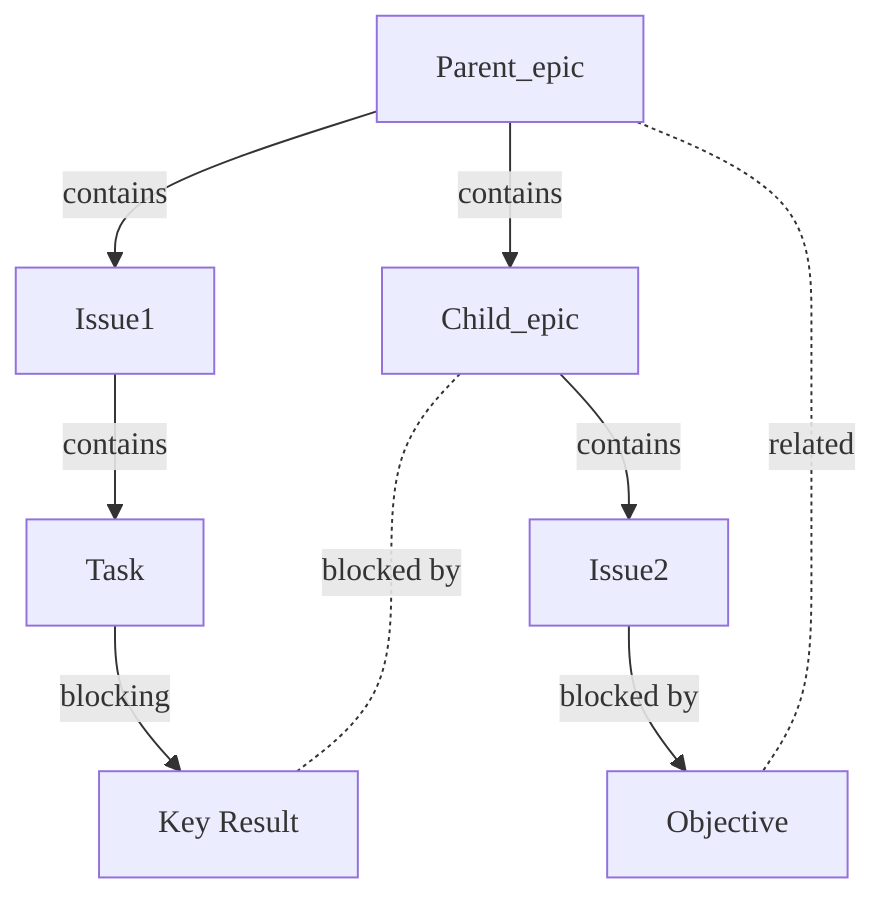



- プラン: Premium、Ultimate
- 提供形態: GitLab.com、GitLab Self-Managed、GitLab Dedicated



GitLabのエピックは、作業アイテムを作業階層に整理します。それにより、大規模なイニシアチブの連携と追跡が可能になります。エピックを使用すると、複雑なプロジェクトを管理しやすくなります。エピックを使用すると、次のことが可能になります。

- 大規模な機能を、段階的に価値を高める、より小さな成果物へと分解できます。
- 開始日と終了日のスケジュールにより、関連する作業アイテムの進捗を追跡できます。
- 機能のスコープと要件に関するディスカッションや決定事項を整理できます。
- タスクを戦略的な目標に結び付ける階層構造を作成できます。
- 目標に向けた進捗状況を監視するための視覚的なロードマップを作成できます。

チームはエピックを使用して、複数のイテレーションにわたって連携し、長期的な目標に向けた進捗を追跡します。

Ultimateプランでは、[ネストされたエピック](manage_epics.md#multi-level-child-epics)により、アジャイルフレームワークに沿った作業階層を通じて、構造を追加できます。複雑なプロジェクトを、より管理しやすい子エピックに分解できます。子エピックには、さらに独自の一連のイシューとタスクを含めることができます。このネストされた構造は、明確さを維持し、プロジェクトのすべての側面を網羅し、全体的な目標を見失わないようにするのに役立ちます。

  参照用動画: <a href="https://www.youtube.com/watch?v=c0EwYYUZppw">GitLabエピック - GitLabでの組織のセットアップ</a>。

<figure class="video-container">
  <iframe src="https://www.youtube-nocookie.com/embed/c0EwYYUZppw" frameborder="0" allowfullscreen> </iframe>
</figure>
<!-- Video published on 2023-10-30 -->

## エピックとその他のアイテム間の関係

エピックとその他のアイテムの間には、次の関係があります。

- エピックは、1つ以上のイシューの親です。
- エピックは、1つ以上の[子エピック](manage_epics.md#multi-level-child-epics)の親です。Ultimateのみです。
- エピックは、1つ以上のタスク、目標、または主な成果に[リンク](linked_epics.md)されています。[エピックの新しい外観](epic_work_items.md)を有効にする必要があります。

関係の例:

### 異なるグループ階層からの子イシュー



- GitLab 15.5で[導入](https://gitlab.com/gitlab-org/gitlab/-/issues/371081)されました。`epic_issues_from_different_hierarchies`という名前の[フラグ](../../../administration/feature_flags.md)が付きます。デフォルトでは無効になっています。
- GitLab 15.5の[GitLab.comで有効](https://gitlab.com/gitlab-org/gitlab/-/issues/373304)になりました。
- 機能フラグ`epic_issues_from_different_hierarchies`は、GitLab 15.6で削除されました。



異なるグループ階層からのイシューをエピックに追加できます。これを行うには、[既存のイシューを追加](manage_epics.md#add-an-existing-issue-to-an-epic)するときに、イシューのURLを貼り付けます。

## エピックのロードマップ



- プラン: Ultimate
- 提供形態: GitLab.com、GitLab Self-Managed、GitLab Dedicated



エピックに、開始日または期限を設定された1つ以上の[子エピック](manage_epics.md#multi-level-child-epics)が含まれている場合は、エピックから子エピックの[ロードマップ](../roadmap/_index.md)に移動できます。

<!-- When epics as work items are generally available, the steps below should be the only ones here. -->

[エピックの新しい外観](epic_work_items.md)が有効になっている場合は、次を行います。

- **子アイテム**セクションのヘッダーで、**その他のアクション**（）> **ロードマップで表示**を選択します。

親エピックでフィルタリングされたロードマップが開きます。

## 関連トピック

- [エピック](manage_epics.md)とマルチレベルの子エピックを管理します。
- 関係の種類に基づいて[関連するエピック](linked_epics.md)をリンクします。
- [エピックボード](epic_boards.md)でワークフローを作成します。
- エピックイベントに関する[通知をオン](../../profile/notifications.md)にします。
- エピックまたはそのコメントに[絵文字リアクションを追加](../../emoji_reactions.md)します。
- [スレッド](../../discussions/_index.md)にコメントを投稿して、エピックでコラボレーションします。
- [ヘルスステータス](manage_epics.md#health-status)を使用して、進捗状況を追跡します。

<!-- ## Troubleshooting

Include any troubleshooting steps that you can foresee. If you know beforehand what issues
one might have when setting this up, or when something is changed, or on upgrading, it's
important to describe those, too. Think of things that may go wrong and include them here.
This is important to minimize requests for support, and to avoid doc comments with
questions that you know someone might ask.

Each scenario can be a third-level heading, for example `### Getting error message X`.
If you have none to add when creating a doc, leave this section in place
but commented out to help encourage others to add to it in the future. -->
