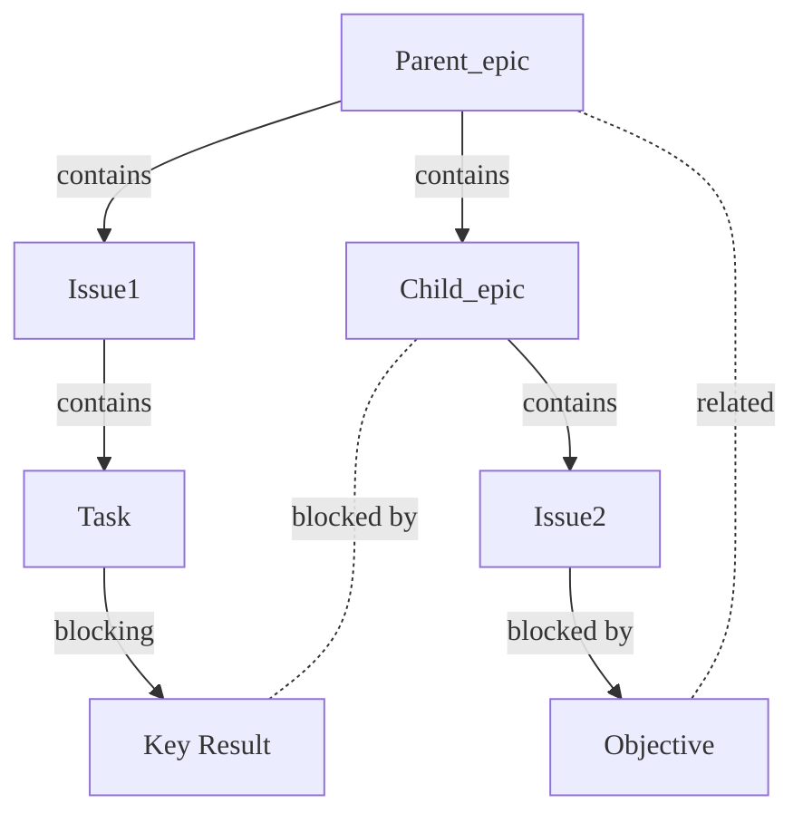



- プラン: Premium、Ultimate
- 提供形態: GitLab.com、GitLab Self-Managed、GitLab Dedicated



GitLabのエピックは、作業アイテムを作業階層に整理することで、大規模なイニシアチブの連携と追跡を可能にします。エピックを使用すると、複雑なプロジェクトを管理しやすくなります。エピックは次のことを実現します:

- 大規模な機能を、段階的に価値を高める、より小さな成果物へと分解する。
- 開始日と終了日のスケジュールに基づき、関連する作業アイテムの進捗を追跡する。
- 機能のスコープと要件に関するディスカッションや決定事項を整理する。
- タスクを戦略的な目標に結び付ける階層構造を作成する。
- 目標に向けた進捗状況を監視するための視覚的なロードマップを作成する。

チームはエピックを使用して、複数のイテレーションにわたって連携し、長期的な目標に向けた進捗を追跡します。

Ultimateプランでは、[ネストされたエピック](manage_epics.md#multi-level-child-epics)により、アジャイルフレームワークに沿った作業階層を通じて、構造を追加できます。複雑なプロジェクトを、より管理しやすい子エピックに分解できます。子エピックには、さらに独自の一連のイシューとタスクを含めることができます。このネストされた構造は、明確さを維持し、プロジェクトのすべての側面を網羅し、全体的な目標を見失わないようにするのに役立ちます。

  参照用動画: <a href="https://www.youtube.com/watch?v=c0EwYYUZppw">GitLab Epics - Setting up your Organization with GitLab</a>（GitLabエピック - GitLabでの組織のセットアップ）。

<figure class="video-container">
  <iframe src="https://www.youtube-nocookie.com/embed/c0EwYYUZppw" frameborder="0" allowfullscreen> </iframe>
</figure>
<!-- Video published on 2023-10-30 -->

## エピックとその他のアイテム間の関係 {#relationships-between-epics-and-other-items}

エピックとその他のアイテムの間には、次の関係があります:

- エピックは、1つ以上のイシューの親です。
- エピックは、1つ以上の[子エピック](manage_epics.md#multi-level-child-epics)の親です。Ultimateのみ。
- エピックは、1つ以上のタスク、目標、または主な成果に[リンク](linked_epics.md)されています。

関係の例:

### 異なるグループ階層からの子イシュー {#child-issues-from-different-group-hierarchies}

異なるグループ階層からのイシューをエピックに追加できます。これを行うには、[既存のイシューを追加](manage_epics.md#add-an-existing-issue-to-an-epic)するときに、イシューのURLを貼り付けます。

## エピックのロードマップ {#roadmap-in-epics}



- プラン: Ultimate
- 提供形態: GitLab.com、GitLab Self-Managed、GitLab Dedicated



**子アイテム**セクションのヘッダーで、**追加のアクション**（）> **ロードマップで表示**を選択します。

親エピックでフィルタリングされたロードマップが開きます。

## 作業アイテムとしてのエピック {#epics-as-work-items}



- GitLab 17.2で`work_item_epics`[フラグ](../../../administration/feature_flags/_index.md)とともに[導入](https://gitlab.com/groups/gitlab-org/-/epics/9290)されました。デフォルトでは無効になっています。[ベータ](../../../policy/development_stages_support.md#beta)として導入されました。
- GitLab 17.6の[GitLab.comで有効](https://gitlab.com/gitlab-org/gitlab/-/issues/470685)になりました。
- GitLab 17.7の[GitLab Self-ManagedおよびGitLab Dedicatedでデフォルトで有効](https://gitlab.com/gitlab-org/gitlab/-/issues/468310)になりました。
- GitLab 18.1で[一般提供](https://gitlab.com/gitlab-org/gitlab/-/issues/468310)になりました。機能フラグ`work_item_epics`は削除されました。



アジャイルプランニング製品に対するニーズにさらに応えるため、エピックを作業アイテム向けの統一フレームワークに移行し、エピックの外観を変更しました。

詳細については、[エピック9290](https://gitlab.com/groups/gitlab-org/-/epics/9290)と次のブログ記事をご覧ください:

- [First look: The new Agile planning experience in GitLab](https://about.gitlab.com/blog/2024/06/18/first-look-the-new-agile-planning-experience-in-gitlab/)（ファーストルック：GitLabにおける新しいアジャイルプランニングエクスペリエンス）（2024年6月）
- [Unveiling a new epic experience for improved Agile planning](https://about.gitlab.com/blog/2024/07/03/unveiling-a-new-epic-experience-for-improved-agile-planning/)（アジャイルプランニングを向上させる新しいエピックエクスペリエンスの発表）（2024年7月）

この変更を試しているときに問題が発生した場合は、[フィードバックイシュー](https://gitlab.com/gitlab-org/gitlab/-/issues/494462)を使用して詳細を報告できます。

## 作業アイテムのMarkdown参照 {#work-item-markdown-reference}



- GitLab 18.1で`extensible_reference_filters`[フラグ](../../../administration/feature_flags/_index.md)とともに[導入](https://gitlab.com/gitlab-org/gitlab/-/issues/352861)されました。デフォルトでは無効になっています。
- GitLab 18.2で[一般提供](https://gitlab.com/gitlab-org/gitlab/-/merge_requests/197052)になりました。機能フラグ`extensible_reference_filters`は削除されました。



GitLab Flavored Markdownフィールドでは、`[work_item:123]`を使用して作業アイテムを参照できます。詳細については、[GitLab固有の参照](../../markdown.md#gitlab-specific-references)をご覧ください。

## 関連トピック {#related-topics}

- [エピック](manage_epics.md)とマルチレベルの子エピックを管理する。
- 関係の種類に基づいて[関連するエピック](linked_epics.md)をリンクする。
- [エピックボード](epic_boards.md)でワークフローを作成する。
- エピックイベントに関する[通知をオン](../../profile/notifications.md)にする。
- エピックまたはそのコメントに[絵文字リアクションを追加](../../emoji_reactions.md)する。
- [スレッド](../../discussions/_index.md)にコメントを投稿してエピックでコラボレーションする。
- [ヘルスステータス](manage_epics.md#health-status)を使用して進捗状況を追跡する。
- [エピックテンプレートを作成](../../project/description_templates.md#create-a-description-template)してエピックの説明を標準化する。
