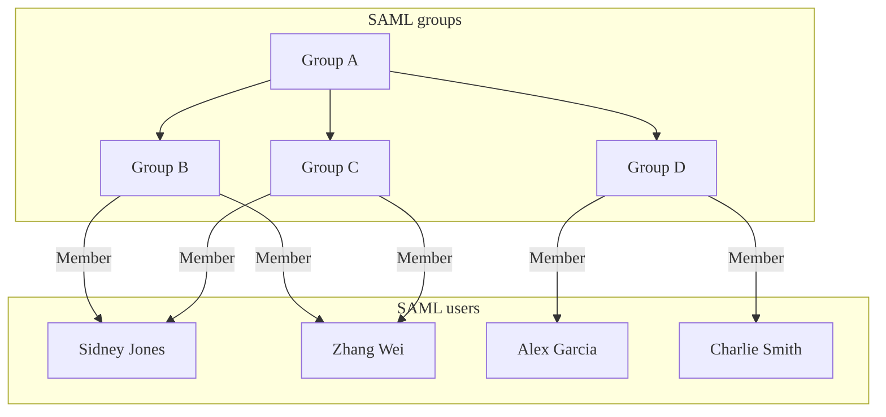
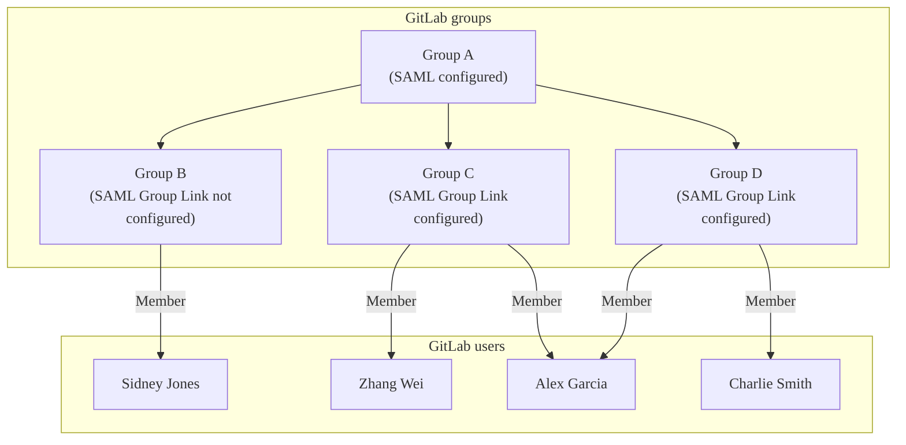
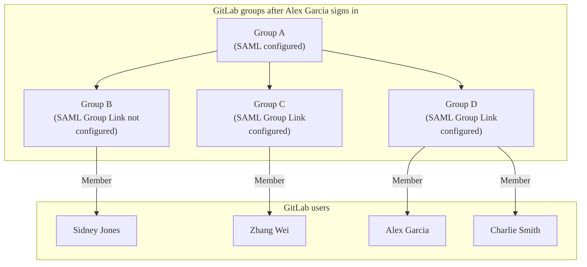



- プラン: Premium、Ultimate
- 提供形態: GitLab.com、GitLab Self-Managed、GitLab Dedicated





- GitLab 15.1のGitLab Self-Managedで[導入](https://gitlab.com/gitlab-org/gitlab/-/issues/363084)されました。



SAMLグループ同期を使用して、SAML Identity Provider（IdP）でのユーザーのグループへの割り当てに基づいて、特定のロールを持つユーザーを既存のGitLabグループに割り当てます。SAMLグループ同期を使用すると、SAML Identity ProviderグループとGitLabグループ間の多対多のマッピングを作成できます。

たとえば、ユーザー`@amelia`がSAML Identity Providerの`security`グループに割り当てられている場合、SAMLグループ同期を使用して、`@amelia`をメンテナーロールを持つ`security-gitlab`グループ、およびレポーターロールを持つ`vulnerability`グループに割り当てることができます。

SAMLグループ同期では、グループは作成されません。最初に[グループを作成](../_index.md#create-a-group)し、マッピングを作成する必要があります。

GitLab.comでは、SAMLグループ同期はデフォルトで構成されています。GitLab Self-Managedインスタンスでは、手動で構成する必要があります。

## ロールの優先順位 {#role-prioritization}

グループ同期は、マッピングされたグループ内のユーザーのロールとグループメンバーシップのタイプを決定します。

### 複数のSAML Identity Provider {#multiple-saml-idps}



- 提供形態: GitLab Self-Managed



ユーザーがサインインすると、GitLabは次の処理を行います:

- 構成されているすべてのSAMLグループリンクを確認します。
- そのユーザーが属するさまざまなIdentity ProviderにわたるSAMLグループに基づいて、対応するGitLabグループにそのユーザーを追加します。

GitLabのグループリンクマッピングは特定のIdentity Providerに紐付けられていないため、すべてのSAML Identity Providerを構成して、SAML応答にグループ属性を含める必要があります。つまり、GitLabは、サインインに使用されたIdentity Providerに関係なく、SAML応答でグループを照合できます。

たとえば、2つのIdentity Provider（`SAML1`と`SAML2`）があるとします。

GitLabの特定のグループで、2つのグループリンクを構成しました:

- `gtlb-owner => Owner role`
- `gtlb-dev => Developer role`

`SAML1`では、ユーザーは`gtlb-owner`のメンバーですが、`gtlb-dev`のメンバーではありません。

`SAML2`では、ユーザーは`gtlb-dev`のメンバーですが、`gtlb-owner`のメンバーではありません。

ユーザーが`SAML1`でグループにサインインすると、SAML応答はユーザーが`gtlb-owner`のメンバーであることを示すため、GitLabはそのグループ内のユーザーのロールを`Owner`に設定します。

その後、ユーザーはサインアウトし、`SAML2`を使用してグループに再度サインインします。SAML応答は、ユーザーが`gtlb-dev`のメンバーであることを示しているため、GitLabはそのグループ内のユーザーのロールを`Developer`に設定します。

ここで、前の例を変更して、ユーザーが`SAML2`の`gtlb-owner`または`gtlb-dev`のメンバーではないようにします。

- ユーザーが`SAML1`でグループにサインインすると、ユーザーにはそのグループで`Owner`ロールが付与されます。
- ユーザーが`SAML2`でサインインすると、構成されているグループリンクのメンバーではないため、ユーザーはグループから削除されます。

### 複数のSAMLグループ {#multiple-saml-groups}

ユーザーが同じGitLabグループにマップされる複数のSAMLグループのメンバーである場合、ユーザーにはそれらのSAMLグループのいずれかから最高のロールが割り当てられます。

たとえば、あるユーザーがグループでゲストロールを持ち、別のグループでメンテナーロールを持つ場合、メンテナーロールが割り当てられます。

### メンバーシップの種類 {#membership-types}

SAMLグループ内のユーザーのロールが、そのサブグループの1つのロールよりも高い場合、マッピングされたGitLabグループ内の[メンバーシップ](../../project/members/_index.md#display-direct-members)は、マッピングされたグループで割り当てられたロールに基づいて異なります。

グループ同期を介してユーザーに以下が割り当てられた場合:

- より高いロールの場合、グループの直接メンバーになります。
- ロールが同じか低い場合、グループの継承されたメンバーになります。

## メンバーの自動削除 {#automatic-member-removal}

グループ同期の後、マッピングされたSAMLグループのメンバーではないユーザーはグループから削除されます。GitLab.comでは、トップレベルグループのユーザーには、削除される代わりにデフォルトのグループメンバーシップロールが割り当てられます。

たとえば、次の図について説明します:

- Alex GarciaはGitLabにサインインし、SAMLグループCに属していないため、GitLabグループCから削除されます。
- Sidney JonesはSAMLグループCに属していますが、まだサインインしていないため、GitLabグループCに追加されません。







## SAML Group Sync {#configure-saml-group-sync}

グループ同期構成を追加または変更すると、グループ名がSAML応答にリストされている`groups`と一致しない場合、マッピングされたGitLabグループからユーザーが削除される可能性があります。ユーザーが削除されるのを防ぐために、グループ同期を構成する前に、次のいずれかを確認してください:

- SAML応答に`groups`属性が含まれており、`AttributeValue`の値がGitLabの**SAMLグループ名**と一致します。
- すべてのグループがGitLabから削除され、グループ同期が無効になります。

SAMLグループ同期を使用し、分散アーキテクチャまたは高可用性アーキテクチャなどで複数のGitLabノードがある場合は、すべてのSidekiqノードに、Railsアプリケーションノードに加えてSAML構成ブロックを含める必要があります。





SAMLグループ同期を構成するには:

1. [forグループ](_index.md)を参照してください。
1. SAML Identity Providerが、`Groups`または`groups`という名前の属性ステートメントを送信していることを確認します。





SAMLグループ同期を構成するには:

1. [SAML OmniAuthプロバイダー](../../../integration/saml.md)を構成します。
1. SAML Identity Providerが、`groups_attribute`設定の値と同じ名前の属性ステートメントを送信していることを確認してください。この属性は大文字と小文字が区別されます。参照として、`/etc/gitlab/gitlab.rb`の次のプロバイダー構成例を参照してください:

   ```ruby
   gitlab_rails['omniauth_providers'] = [
     {
       name: "saml",
       label: "Provider name", # optional label for login button, defaults to "Saml",
       groups_attribute: 'Groups',
       args: {
         assertion_consumer_service_url: "https://gitlab.example.com/users/auth/saml/callback",
         idp_cert_fingerprint: "43:51:43:a1:b5:fc:8b:b7:0a:3a:a9:b1:0f:66:73:a8",
         idp_sso_target_url: "https://login.example.com/idp",
         issuer: "https://gitlab.example.com",
         name_identifier_format: "urn:oasis:names:tc:SAML:2.0:nameid-format:persistent"
       }
     }
   ]
   ```





SAML応答の`Groups`または`groups`の値は、グループ名またはIDのいずれかです。たとえば、Azure ADは、名前の代わりにAzureグループオブジェクトIDを送信します。[SAMLグループのリンク](#configure-saml-group-links)を設定するときは、IDの値を使用してください。

```xml
<saml:AttributeStatement>
  <saml:Attribute Name="Groups">
    <saml:AttributeValue xsi:type="xs:string">Developers</saml:AttributeValue>
    <saml:AttributeValue xsi:type="xs:string">Product Managers</saml:AttributeValue>
  </saml:Attribute>
</saml:AttributeStatement>
```

`http://schemas.microsoft.com/ws/2008/06/identity/claims/groups`などの他の属性名は、グループのソースとして受け入れられません。

SAML Identity Providerの設定で必要なグループ属性名の構成の詳細については、[Azure AD](example_saml_config.md#group-sync)および[Okta](example_saml_config.md#group-sync-1)の構成例を参照してください。

## SAMLグループリンクを設定する {#configure-saml-group-links}

SAMLグループ同期は、そのグループに1つ以上のSAMLグループリンクがある場合にのみ、グループを管理します。

前提要件:

- GitLab Self-Managedインスタンスで、SAMLグループ同期が構成されている必要があります。

SAMLが有効になっている場合、オーナーロールを持つユーザーには、グループの**設定** > **SAMLグループのリンク**に新しいメニュー項目が表示されます。

- 1つ以上の**SAMLグループのリンク**を構成して、SAML Identity Providerグループ名をGitLabロールにマップできます。
- SAML Identity Providerグループのメンバーは、次回のSAMLサインイン時にGitLabグループのメンバーとして追加されます。
- グループメンバーシップは、ユーザーがSAMLを使用してサインインするたびに評価されます。
- SAMLグループリンクは、トップレベルグループまたは任意のサブグループに対して構成できます。
- SAMLグループリンクが作成されてから削除され、次の場合があります:
  - 他のSAMLグループリンクが構成されている場合、削除されたグループリンクに含まれていたユーザーは、同期中にグループから自動的に削除されます。
  - 他のSAMLグループリンクが構成されていない場合、ユーザーは同期中にグループに残ります。これらのユーザーは、グループから手動で削除する必要があります。

SAMLグループをリンクするには:

1. **SAMLグループ名**に、関連する`saml:AttributeValue`の値を入力します。ここに入力した値は、SAML応答で送信される値と正確に一致する必要があります。一部のIdentity Providerでは、これはわかりやすいグループ名の代わりに、グループIDまたはオブジェクトID（Azure AD）である場合があります。
1. **Access Level**（アクセスレベル）で、[デフォルトロール](../../permissions.md)または[カスタムロール](../../custom_roles/_index.md)を選択します。
1. **保存**を選択します。
1. 必要に応じて、追加のグループリンクを追加するために繰り返します。

## GitLab Duoシート割り当ての管理 {#manage-gitlab-duo-seat-assignment}



- 提供形態: GitLab.com、GitLab Self-Managed





- [導入](https://gitlab.com/gitlab-org/gitlab/-/issues/480766)：GitLab 17.8のGitLab.com向け（名前が`saml_groups_duo_pro_add_on_assignment`の[フラグ付き](../../../administration/feature_flags/_index.md)）。デフォルトでは無効になっています。
- [導入](https://gitlab.com/gitlab-org/gitlab/-/issues/512141)：GitLab 18.0のSelf-Managed向け。

前提要件:

- アクティブな[GitLab Duoアドオンサブスクリプション](../../../subscriptions/subscription-add-ons.md)

SAMLグループ同期は、Identity Providerのグループメンバーシップに基づいて、GitLab Duoシートの割り当てと削除を管理できます。シートは、サブスクリプションに残りのシートがある場合にのみ割り当てられます。





GitLab.comを設定するには:

1. [SAMLグループのリンクを構成する](#configure-saml-group-links)ときに、**このグループのユーザーにGitLab Duoのライセンスをアサインします**チェックボックスをオンにします。
1. **保存**を選択します。
1. GitLab Duo ProGitLab Duo Enterprise割り当てる必要があるすべてのSAMLユーザーに対して、追加のグループリンクを追加するために繰り返します。GitLab Duoシートは、Identity Providerのグループメンバーシップが、この設定が有効になっているグループリンクと一致しないユーザーには割り当てられません。

このチェックボックスは、アクティブなGitLab Duoアドオンサブスクリプションがないグループには表示されません。





Self-Managedを設定するには:

1. [SAML OmniAuthプロバイダー](../../../integration/saml.md)を構成します。
1. 設定に`groups_attribute`と`duo_add_on_groups`が含まれていることを確認します。`duo_add_on_groups`の1つ以上のメンバーであるユーザーには、シートが利用可能な場合、GitLab Duoシートが割り当てられます。参照として、`/etc/gitlab/gitlab.rb`の次のプロバイダー構成例を参照してください:

   ```ruby
   gitlab_rails['omniauth_providers'] = [
     {
       name: "saml",
       label: "Provider name",
       groups_attribute: 'Groups',
       duo_add_on_groups: ['Developers', 'Freelancers'],
       args: {
         assertion_consumer_service_url: "https://gitlab.example.com/users/auth/saml/callback",
         idp_cert_fingerprint: "43:51:43:a1:b5:fc:8b:b7:0a:3a:a9:b1:0f:66:73:a8",
         idp_sso_target_url: "https://login.example.com/idp",
         issuer: "https://gitlab.example.com",
         name_identifier_format: "urn:oasis:names:tc:SAML:2.0:nameid-format:persistent"
       }
     }
   ]
   ```





## Microsoft Azure Activeディレクトリインテグレーション {#microsoft-azure-active-directory-integration}



- GitLab 16.3で[導入](https://gitlab.com/groups/gitlab-org/-/epics/10507)されました。





Microsoftは、Azure Activeディレクトリ（AD）の名前がEntra IDに変更されることを[発表](https://azure.microsoft.com/en-us/updates/azure-ad-is-becoming-microsoft-entra-id/)しました。



<i class="fa fa-youtube-play youtube" aria-hidden="true"></i> Microsoft Azureを使用したグループ同期のデモについては、[デモを参照してください: Azure ADを使用したSAML Group Syncのデモ](https://youtu.be/Iqvo2tJfXjg)。

Azure ADは、`groups`クレームで最大150個のグループを送信します。SAMLグループ同期でAzure ADを使用する場合、組織内のユーザーが150を超えるグループのメンバーである場合、Azure ADは[グループの超過](https://learn.microsoft.com/en-us/security/zero-trust/develop/configure-tokens-group-claims-app-roles#group-overages)のためにSAML応答で`groups`クレーム属性を送信し、ユーザーはグループから自動的に削除される可能性があります。

この問題を回避するために、次のAzure ADインテグレーションを使用できます:

- 150個のグループに制限されていません。
- Microsoft Graph APIを使用して、すべてのユーザーメンバーシップを取得するします。[Graph APIエンドポイント](https://learn.microsoft.com/en-us/graph/api/user-list-transitivememberof?view=graph-rest-1.0&tabs=http#http-request)は、[ユーザーオブジェクトID](https://learn.microsoft.com/en-us/partner-center/find-ids-and-domain-names#find-the-user-object-id)または[userPrincipalName](https://learn.microsoft.com/en-us/entra/identity/hybrid/connect/plan-connect-userprincipalname#what-is-userprincipalname)のみを、[Azure構成](_index.md#azure)の一意のユーザー識別子（名前識別子）属性として受け入れます。
- グループ同期を処理する場合、グループの一意の識別子（`12345678-9abc-def0-1234-56789abcde`など）で構成されたグループリンクのみをサポートします。

または、[グループクレーム](https://learn.microsoft.com/en-us/entra/identity/hybrid/connect/how-to-connect-fed-group-claims)を**Groups assigned to the application**（アプリケーションに割り当てられたグループ）オプションを使用するように変更できます。

### Azure ADの構成 {#configure-azure-ad}

インテグレーションの一部として、GitLabがMicrosoft Graph APIと通信できるようにする必要があります。

<!-- vale gitlab_base.SentenceSpacing = NO -->

Azure ADを構成するには:

1. [Azure Portal](https://portal.azure.com)で、**Microsoft Entra ID** > **App registrations**（アプリの登録） > **All applications**（すべてのアプリケーション）に移動し、GitLab SAMLアプリケーションを選択します。
1. **Essentials**の下に、**Application (client) ID**と**Directory (tenant) ID**の値が表示されます。これらの値は、GitLab構成に必要なため、コピーします。
1. 左側のナビゲーションで、**Certificates & secrets**（証明書とシークレット）を選択します。
1. **Client secrets**（クライアントシークレット）タブで、**New client secret**（新しいクライアントシークレット）を選択します。
   1. **説明**テキストボックスに、説明を追加します。
   1. **有効期限**ドロップダウンリストで、認証情報の有効期限を設定します。シークレットの有効期限が切れると、認証情報が更新されるまで、GitLabインテグレーションは機能しなくなります。
   1. 認証情報を生成するには、**追加**を選択します。
   1. 認証情報の**値**をコピーします。この値は1回しか表示されず、GitLab構成に必要です。
1. 左側のナビゲーションで、**API permissions**（APIアクセス許可）を選択します。
1. **Microsoft Graph** > **Application permissions**（アプリケーションの権限）を選択します。
1. **GroupMember.Read.All**と**User.Read.All**のチェックボックスをオンにします。
1. **Add permissions**（権限の追加）を選択して保存します。
1. **Grant admin consent for `<application_name>`**（の管理者の同意を付与）を選択し、確認ダイアログで**可能**を選択します。両方の権限の**ステータス**列が、緑色のチェックマークと**Granted for `<application_name>`**（Azure ADに付与）に変わるはずです。

<!-- vale gitlab_base.SentenceSpacing = YES -->

### GitLabを設定する {#configure-gitlab}

Azure ADを構成したら、GitLabがAzure ADと通信するように構成する必要があります。

この構成では、ユーザーがSAMLでサインインし、Azureが応答で`group`クレームを送信すると、GitLabはグループ同期ジョブを開始してMicrosoft Graph APIを呼び出すし、ユーザーのグループメンバーシップを取得します。次に、GitLabのグループメンバーシップがSAMLグループリンクに従って更新されます。

次の表に、GitLab設定と、構成に対応するAzure ADフィールドを示します:

| GitLab設定 | Azureフィールド                                |
| -------------- | ------------------------------------------ |
| テナント      | ディレクトリ (テナントID)                      |
| Client ID（クライアントID）      | アプリケーション (クライアントID)                    |
| クライアントシークレット  | 値（**Certificates & secrets**（証明書とシークレット）ページ） |





GitLab.comグループに対してAzure ADを構成するには、次の手順を実行します:

1. 左側のサイドバーで、**検索または移動先**を選択して、グループを見つけます。[新しいナビゲーションをオン](../../interface_redesign.md#turn-new-navigation-on-or-off)にしている場合、このフィールドは上部のバーにあります。このグループはトップレベルにある必要があります。
1. **設定** > **SAML SSO**を選択します。
1. [グループのSAML SSO](_index.md)を設定します。
1. **Microsoft Azure integration**（Microsoft Azureインテグレーション）セクションで、**Enable Microsoft Azure integration for this group**（このグループに対してMicrosoft Azureインテグレーションを有効にする）チェックボックスを選択します。このセクションは、グループに対してSAML SSOが設定され、有効になっている場合にのみ表示されます。
1. Azure PortalでAzure Activeディレクトリを構成するときに、以前に取得した**テナントID**、**クライアントID**、および**クライアントシークレット**を入力します。
1. オプション。米国政府機関向けAzure ADまたは中国向けAzure ADを使用している場合は、適切な**ログインAPIエンドポイント**と**Graph APIエンドポイント**を入力します。デフォルト値はほとんどの組織で有効です。
1. **変更を保存**を選択します。





GitLab Self-Managedを設定するには、次の手順を実行します:

1. [インスタンスのSAML SSO](../../../integration/saml.md)を設定します。
1. 左側のサイドバーの下部で、**管理者**を選択します。[新しいナビゲーションをオンにしている](../../interface_redesign.md#turn-new-navigation-on-or-off)場合は、右上隅でアバターを選択し、**管理者**を選択します。
1. **設定** > **一般**を選択します。
1. **Microsoft Azure integration**（Microsoft Azureインテグレーション）セクションで、**Enable Microsoft Azure integration for this group**（このグループに対してMicrosoft Azureインテグレーションを有効にする）チェックボックスを選択します。
1. Azure PortalでAzure Activeディレクトリを構成するときに、以前に取得した**テナントID**、**クライアントID**、および**クライアントシークレット**を入力します。
1. オプション。米国政府機関向けAzure ADまたは中国向けAzure ADを使用している場合は、適切な**ログインAPIエンドポイント**と**Graph APIエンドポイント**を入力します。デフォルト値はほとんどの組織で有効です。
1. **変更を保存**を選択します。





## グローバルグループメンバーシップロック {#global-saml-group-memberships-lock}



- 提供形態: GitLab Self-Managed、GitLab Dedicated





- GitLab 15.10で[導入](https://gitlab.com/gitlab-org/gitlab/-/issues/386390)されました。



SAMLグループメンバーシップにグローバルロックを適用できます。このロックは、メンバーシップがSAMLグループリンクと同期されているサブグループに新しいメンバーを招待できるユーザーを制限します。

グローバルグループメンバーシップのロックが有効になっている場合:

- グループまたはサブグループを[コードオーナー](../../project/codeowners/_index.md)として設定することはできません。詳細については、[グローバルグループメンバーシップロックとの非互換性](../../project/codeowners/troubleshooting.md#incompatibility-with-global-group-memberships-locks)を参照してください。
- 管理者のみがグループメンバーを管理し、アクセスレベルを変更できます。
- グループメンバーは以下を実行できません:
  - プロジェクトを他のグループと共有する。
  - グループで作成されたプロジェクトにメンバーを招待する。
  - グループリンクが設定されたのメンバーシップは、管理者しか変更できません。

### グループメンバーシップをロックする {#lock-group-memberships}

前提要件:

- [GitLab Self-ManagedのSAML SSO](../../../integration/saml.md)が構成されている必要があります。

メンバーシップをSAMLグループリンクの同期にロックするには、次の手順に従います:

1. 左側のサイドバーの下部で、**管理者**を選択します。[新しいナビゲーションをオンにしている](../../interface_redesign.md#turn-new-navigation-on-or-off)場合は、右上隅でアバターを選択し、**管理者**を選択します。
1. **設定** > **一般**を選択します。
1. **表示レベルとアクセス制御**セクションを展開します。
1. **メンバーシップをSAMLグループリンク同期に限定**チェックボックスを選択します。
