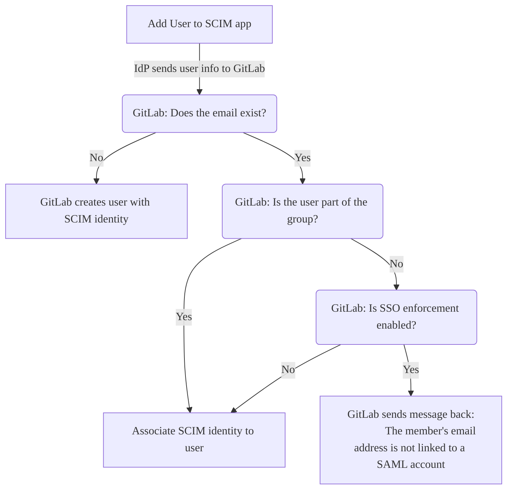
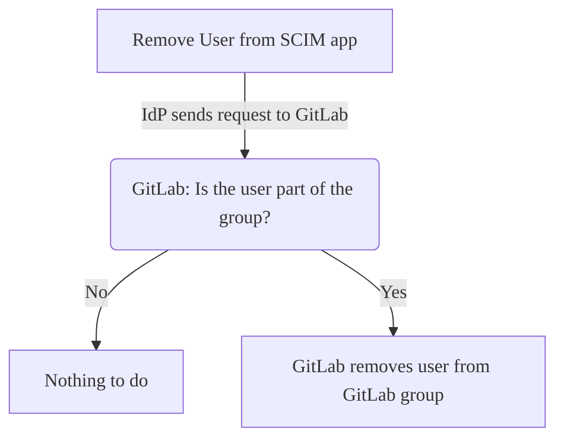



- プラン: Premium、Ultimate
- 提供形態: GitLab.com



オープン標準のSystem for Cross-domain Identity Management (SCIM) を使用して、以下を自動化できます:

- ユーザーを作成します。
- ユーザーを削除します (SCIMアイデンティティ管理を無効化)。
- ユーザーを再度追加します (SCIMアイデンティティ管理を再度有効化)。

GitLab SAML SSO SCIMは、ユーザーの更新をサポートしていません。

GitLabグループに対してSCIMが有効になっている場合、そのグループのグループメンバーシップは、GitLabとIdentity Providerの間で同期されます。

[内部GitLabグループSCIM API](../../../development/internal_api/_index.md#group-scim-api)は、[RFC7644プロトコル](https://www.rfc-editor.org/rfc/rfc7644)の一部を実装しています。Identity Providerは、[内部GitLabグループSCIM API](../../../development/internal_api/_index.md#group-scim-api)を使用して、SCIMアプリを開発できます。

GitLabセルフマネージドでSCIMをセットアップするには、[GitLabセルフマネージドのSCIMを設定](../../../administration/settings/scim_setup.md)を参照してください。

## GitLabを設定する {#configure-gitlab}

前提要件: 

- [グループシングルサインオン](_index.md)が設定されている必要があります。

GitLab SAML SSO SCIMを設定するには:

1. 左側のサイドバーで、**検索または移動先**を選択して、グループを見つけます。
1. **設定** > **SAML SSO**を選択します。
1. **SCIMトークンを生成**を選択します。
1. Identity Providerの設定のために、以下を保存します:
   - **あなたのSCIMトークン**フィールドのトークン。
   - **SCIM APIエンドポイントのURL**フィールドのURL。

## Identity Providerを設定 {#configure-an-identity-provider}

Identity Providerとして、次のいずれかを設定できます:

- [Azure Active Directory](#configure-microsoft-entra-id-formerly-azure-active-directory)。
- [Okta](#configure-okta)。



他のプロバイダーもGitLabで動作する可能性がありますが、テストされておらず、サポートされていません。サポートについては、プロバイダーにお問い合わせください。GitLabのサポートは、関連するログエントリを確認することで支援できます。



### Microsoft Entra ID（旧Azure Active Directory）を設定する {#configure-microsoft-entra-id-formerly-azure-active-directory}



- [変更](https://gitlab.com/gitlab-org/gitlab/-/merge_requests/143146) GitLab 16.10のMicrosoft Entra ID用語へ。



前提要件: 

- [GitLabが設定されました](#configure-gitlab)。
- [グループシングルサインオン](_index.md)が設定されています。

[Azure Active Directory](https://learn.microsoft.com/en-us/entra/identity/enterprise-apps/view-applications-portal)の[シングルサインオン](_index.md)の設定時に作成されたSAMLアプリケーションは、SCIM用にセットアップする必要があります。例については、[設定例](example_saml_config.md#scim-mapping)を参照してください。



次の手順で詳しく説明されているように、SCIMプロビジョニングを正確に設定する必要があります。設定を誤ると、ユーザーのプロビジョニングとサインインで問題が発生し、解決に多くの労力がかかります。いずれかの手順で問題や質問がある場合は、GitLabサポートにお問い合わせください。



SCIMのMicrosoft Entra IDを設定するには:

1. アプリで、**Provisioning**（プロビジョニング） タブに移動し、**始めましょう**を選択します。
1. **Provisioning Mode**（プロビジョニングモード）を**Automatic**（自動）に設定します。
1. 次の値を使用して、**Admin Credentials**（管理者認証情報）を完了します:
   - **SCIM APIエンドポイントのURL**を**Tenant URL**（テナントURL）フィールドに入力します。
   - **あなたのSCIMトークン**を**Secret Token**（シークレットトークン）フィールドに入力します。
1. **Test Connection**（接続のテスト）を選択します。テストが成功した場合は、続行する前に設定を保存するか、[トラブルシューティング](troubleshooting.md)の情報を参照してください。
1. **保存**を選択します。

保存後、**Mappings**（マッピング）と**設定**セクションが表示されます。

#### マッピングを設定する {#configure-mappings}

**Mappings**（マッピング）セクションで、最初にグループをプロビジョニングします:

1. **Provision Microsoft Entra ID Groups**（Microsoft Entra IDグループのプロビジョニング）を選択します。
1. 属性のマッピングページで、**有効**切替をオフにします。SCIMグループのプロビジョニングはGitLabではサポートされていません。グループのプロビジョニングを有効のままにしてもSCIMユーザーのプロビジョニングが中断されることはありませんが、Entra ID SCIMプロビジョニングログに混乱を招く可能性のあるエラーが発生します。

   

   **Provision Microsoft Entra ID Groups**（Microsoft Entra IDグループのプロビジョニング）が無効になっている場合でも、マッピングセクションに「有効: はい」と表示されることがあります。これは表示上のバグであり、無視しても問題ありません。

   

1. **保存**を選択します。

次に、ユーザーをプロビジョニングします:

1. **Provision Microsoft Entra ID Users**（Microsoft Entra IDユーザーのプロビジョニング）を選択します。
1. **有効**切替が**可能**に設定されていることを確認します。
1. すべての**Target Object Actions**（ターゲットオブジェクトアクション）が有効になっていることを確認します。
1. **Attribute Mappings**（属性のマッピング）で、[構成済みの属性のマッピング](#configure-attribute-mappings)と一致するようにマッピングを設定します:
   1. オプション。**customappsso Attribute**（customappsso属性）列で、`externalId`を見つけて削除します。
   1. 最初属性を編集して、以下を設定します:
      - `objectId`の**source attribute**（ソース属性）
      - `externalId`の**target attribute**（ターゲット属性）
      - `1`の**matching precedence**（一致の優先順位）
   1. 既存の**customappsso**属性を更新して、[構成済みの属性のマッピング](#configure-attribute-mappings)と一致させます。
   1. 次の表にない追加の属性を削除します。削除しなくても問題は発生しませんが、GitLabは属性を使用しません。
1. マッピングリストで、**Show advanced options**（詳細オプションを表示）チェックボックスを選択します。
1. **Edit attribute list for customappsso**（customappssoの属性リストを編集）リンクを選択します。
1. `id`がプライマリ必須フィールドであり、`externalId`も必須であることを確認してください。
1. **保存**を選択すると、属性のマッピング設定ページに戻ります。
1. **Attribute Mapping**（属性のマッピング）設定ページを閉じるには、右上隅の`X`を選択します。

#### 設定を構成する {#configure-settings}

**設定**セクション:

1. オプション。必要に応じて、**Send an email notification when a failure occurs**（エラー発生時にメール通知を送信する）チェックボックスを選択します。
1. オプション。必要に応じて、**Prevent accidental deletion**（誤った削除を防ぐ）チェックボックスを選択します。
1. 必要に応じて、**保存**を選択して、すべての変更が保存されていることを確認します。

マッピングと設定を設定したら、アプリの概要ページに戻り、**Start provisioning**（プロビジョニングを開始）を選択して、GitLabでのユーザーの自動SCIMプロビジョニングを開始します。



同期されると、`id`および`externalId`にマップされたフィールドを変更すると、エラーが発生する可能性があります。これには、プロビジョニングエラー、重複するユーザーが含まれ、既存のユーザーがGitLabグループにアクセスできなくなる可能性があります。



#### 属性のマッピングを設定する {#configure-attribute-mappings}



MicrosoftがAzure Active DirectoryからEntra IDの命名スキームに移行する間、ユーザーインターフェースに矛盾が見られる場合があります。問題が発生した場合は、このドキュメントの古いバージョンを表示するか、GitLabサポートにお問い合わせください。



[SCIMのEntra IDを設定する](#configure-microsoft-entra-id-formerly-azure-active-directory)と、属性のマッピングを設定します。例については、[設定例](example_saml_config.md#scim-mapping)を参照してください。

次の表に、GitLabに必要な属性のマッピングを示します。

| ソース属性                                                           | ターゲット属性               | 一致の優先順位 |
|:---------------------------------------------------------------------------|:-------------------------------|:--------------------|
| `objectId`                                                                 | `externalId`                   | 1                   |
| `userPrincipalName`または`mail` 1                                 | `emails[type eq "work"].value` |                     |
| `mailNickname`                                                             | `userName`                     |                     |
| `displayName` OR `Join(" ", [givenName], [surname])` 2          | `name.formatted`               |                     |
| `Switch([IsSoftDeleted], , "False", "True", "True", "False")` 3 | `active`                       |                     |

1. `userPrincipalName`がメールアドレスでない場合、または配信できない場合は、ソース属性として`mail`を使用します。
1. `displayName`が`Firstname Lastname`の形式と一致しない場合は、`Join`式を使用します。
1. これは式マッピングタイプであり、直接マッピングではありません。**Mapping type**（マッピングタイプ）ドロップダウンリストで`Expression`を選択します。

各属性マッピングには、以下があります:

- **customappsso Attribute**（customappsso属性）。これは、**target attribute**（ターゲット属性）に対応します。
- **Microsoft Entra ID Attribute**（Microsoft Entra ID属性）。これは、**source attribute**（ソース属性）に対応します。
- 一致の優先順位。

各属性について:

1. 既存の属性を編集するか、新しい属性を追加します。
1. ドロップダウンリストから、必要なソースとターゲットの属性のマッピングを選択します。
1. **OK**を選択します。
1. **保存**を選択します。

SAMLの設定が[推奨されるSAML設定](_index.md#azure)と異なる場合は、マッピング属性を選択し、それに応じて変更します。`externalId`ターゲット属性にマップするソース属性は、SAML `NameID`に使用される属性と一致する必要があります。

マッピングが表にリストされていない場合は、Microsoft Entra IDデフォルトを使用します。必要な属性のリストについては、[内部グループSCIM API](../../../development/internal_api/_index.md#group-scim-api)ドキュメントを参照してください。

### Oktaを設定する {#configure-okta}

Oktaの[シングルサインオン](_index.md)の設定時に作成されたSAMLアプリケーションは、SCIM用にセットアップする必要があります。

前提要件: 

- Okta [ライフサイクル管理](https://www.okta.com/products/lifecycle-management/)製品を使用する必要があります。この製品層は、OktaでSCIMを使用するために必要です。
- [GitLabが設定されました](#configure-gitlab)。
- [Okta](https://developer.okta.com/docs/guides/build-sso-integration/saml2/main/)のSAMLアプリケーションは、[Okta設定ノート](_index.md#okta)で説明されているようにセットアップします。
- Okta SAMLの設定が[構成手順](_index.md)と正確に一致していること、特にNameIDの設定。

SCIM用にOktaを設定するには:

1. Oktaにサインインします。
1. 右上隅で**管理者**を選択します。ボタンは**管理者**エリアからは見えません。
1. **Application**（アプリケーション）タブで、**Browse App Catalog**（アプリカタログの参照）を選択します。
1. **GitLab**を検索し、**GitLab**アプリケーションを見つけて選択します。
1. GitLabアプリケーションの概要ページで、**追加**を選択します。
1. **Application Visibility**（アプリケーションの表示レベル）で、両方のチェックボックスを選択します。現在、GitLabアプリケーションはSAML認証をサポートしていないため、アイコンはユーザーに表示されません。
1. **完了**を選択して、アプリケーションの追加を完了します。
1. **Provisioning**（プロビジョニング）タブで、**Configure API integration**（APIインテグレーションの設定）を選択します。
1. **Enable API integration**（APIインテグレーションを有効にする）を選択します。
   - **Base URL**（ベースURL）には、GitLab SCIM設定ページの**SCIM APIエンドポイントのURL**からコピーしたURLを貼り付けます。
   - **API Token**（APIトークン）には、GitLab SCIM設定ページの**あなたのSCIMトークン**からコピーしたSCIMトークンを貼り付けます。
1. 設定を確認するには、**Test API Credentials**（API認証情報のテスト）を選択します。
1. **保存**を選択します。
1. APIインテグレーションの詳細を保存すると、左側に新しい設定タブが表示されます。**To App**（アプリへ）を選択します。
1. **編集**を選択します。
1. **Create Users**（ユーザーの作成）と**Deactivate Users**（ユーザーの無効化）の両方に対して、**有効**チェックボックスを選択します。
1. **保存**を選択します。
1. **Assignments**（課題）タブでユーザーを割り当てます。割り当てられたユーザーは、GitLabグループで作成および管理されます。

## ユーザーアクセス {#user-access}

同期プロセス中、すべての新しいユーザーは:

- GitLabアカウントを受け取ります。
- 招待メールで自分のグループに歓迎されます。[確認済みのドメインでメール確認を回避する](_index.md#bypass-user-email-confirmation-with-verified-domains)ことができます。

次の図は、SCIMアプリにユーザーを追加したときに発生することを示しています:

プロビジョニング中:

- GitLabユーザーアカウントが存在するかどうかを確認する際、プライマリメールとセカンダリメールの両方が考慮されます。
- ユーザーの作成時に、重複するユーザー名にはサフィックス`1`を追加することで処理されます。たとえば、`test_user`が既に存在する場合は、`test_user1`が使用されます。`test_user1`が既に存在する場合、GitLabはサフィックスを増やして、未使用のユーザー名を見つけます。4回試行しても未使用のユーザー名が見つからない場合は、ランダムな文字列がユーザー名に追加されます。

その後のアクセスでは、新規および既存のユーザーは次のいずれかの方法でグループにアクセスできます:

- Identity Providerのダッシュボード経由。
- リンクに直接アクセス。

ロール情報については、[グループSAML](_index.md#user-access-and-management)ページを参照してください。

### GitLabグループのSCIMを介して作成されたユーザーのパスワード {#passwords-for-users-created-through-scim-for-gitlab-groups}

GitLabでは、すべてのユーザーアカウントにパスワードが必要です。SCIMプロビジョニングを使用して作成されたユーザーの場合、GitLabはランダムなパスワードを自動的に生成し、ユーザーは最初のサインイン時にパスワードを設定する必要はありません。GitLabグループのSCIMで作成されたユーザーに対してGitLabがパスワードを生成する方法の詳細については、[統合認証で生成されたユーザーのパスワード](../../../security/passwords_for_integrated_authentication_methods.md)を参照してください。

### SCIMとSAMLのアイデンティティをリンクする {#link-scim-and-saml-identities}

[グループSAML](_index.md)が設定されており、既存のGitLab.comアカウントがある場合、ユーザーはSCIMとSAMLのアイデンティティをリンクできます。ユーザーは、同期がアクティブな場合に既存のユーザーに対してプロビジョニングエラーが発生する可能性があるため、同期をオンにする前にこれを行う必要があります。

SCIMとSAMLのアイデンティティをリンクするには:

1. Identity Providerのユーザープロファイルメールアドレスと一致するように、GitLab.comユーザーアカウントの[プライマリメール](../../profile/_index.md#change-your-primary-email)アドレスを更新します。
1. [SAMLアイデンティティをリンクする](_index.md#link-saml-to-your-existing-gitlabcom-account)。

### アクセス権を削除する {#remove-access}

Identity Providerでユーザーを削除または非アクティブ化して、以下へのアクセス権を削除します:

- トップレベルグループ。
- すべてのサブグループとプロジェクト。

Identity Providerが設定されたスケジュールに基づいて同期を実行すると、ユーザーのグループメンバーシップが失効され、アクセス権が失われます。

SCIMを有効にしても、SAMLアイデンティティを持たない既存のユーザーは自動的に削除されません。



デプロビジョニングは、GitLabユーザーアカウントを削除しません。



### アクセス権を再度有効にする {#reactivate-access}



- GitLab 16.0で`skip_saml_identity_destroy_during_scim_deprovision`[フラグ](../../../administration/feature_flags/list.md)とともに[導入](https://gitlab.com/gitlab-org/gitlab/-/issues/379149)されました。デフォルトでは無効になっています。
- GitLab 16.4で[一般提供](https://gitlab.com/gitlab-org/gitlab/-/merge_requests/121226)になりました。機能フラグ`skip_saml_identity_destroy_during_scim_deprovision`は削除されました。



SCIMを通じてユーザーが削除または非アクティブ化された後、SCIMIdentity Providerにユーザーを追加することで、そのユーザーを再度有効にできます。

Identity Providerが構成されたスケジュールに基づいて同期を実行すると、ユーザーのSCIM IDが再度アクティブ化され、グループメンバーシップが復元されます。
