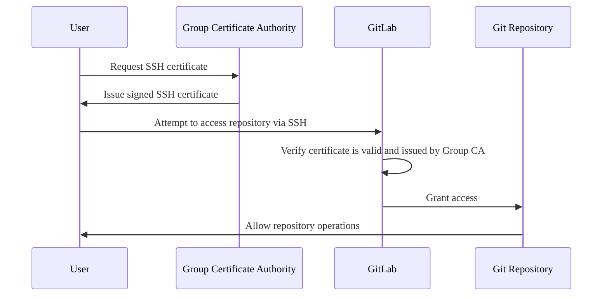



- プラン: Premium、Ultimate
- 提供形態: GitLab.com



SSH証明書を使用して、プロジェクトとグループへのGitアクセスを制御および管理できます。

SSH証明書は、ユーザーのIDと権限を認証する、暗号で署名されたドキュメントです。これらは信頼できる認証局（CA）によって発行され、ユーザーのID、有効期限、権限などの情報が含まれています。

SSH証明書認証の利点は次のとおりです:

- 集中アクセス制御: 個々のユーザーが管理するSSHキーではなく、中央CAを介してアクセスを管理できます。
- 強化されたセキュリティ: SSH証明書は、従来のSSHキーよりも安全です。
- 時間制限付きアクセス: 特定の期間が過ぎると証明書が失効するように設定できます。
- 簡素化された認証情報管理: 組織は、リポジトリへのアクセスのために承認されたSSH証明書の認証情報のリストを維持できます。
- ユーザー管理の認証情報から独立: アクセスはグループ管理の証明書で制御され、ユーザーの個人用公開SSHキーでは制御されません。

## SSH証明書とSSHキー {#ssh-certificates-and-ssh-keys}

次の表は、SSH証明書とSSHキーを比較したものです:

| 機能               | SSH証明書                      | SSHキー |
| --------------------- | ------------------------------------- | -------- |
| アクセス制御        | グループが管理するCAを通じて集中化されています。 | 個々のユーザーアカウントに分散されます。 |
| 有効期限            | 有効期限が組み込まれています。                  | 有効期限は組み込まれていません。 |
| 認証情報管理 | グループのオーナーが管理します。              | 個々のユーザーが管理します。 |
| セットアップの複雑さ      | より複雑な初期設定。           | より簡単な初期設定。 |

## 認証フロー {#authentication-flow}

次の図は、証明書のリクエストからリポジトリへのアクセスまで、GitLabでのSSH証明書認証の仕組みを示しています:



認証プロセスでは、リポジトリへのアクセスを許可する前に、ユーザーが有効なSSH証明書を持っていることを確認します。

## トップレベルグループにCA証明書を追加する {#add-a-ca-certificate-to-a-top-level-group}



- GitLab 16.4で`ssh_certificates_rest_endpoints`[フラグ](../../administration/feature_flags/list.md)とともに[導入](https://gitlab.com/gitlab-org/gitlab/-/issues/421915)されました。デフォルトでは無効になっています。
- GitLab 16.9で[GitLab.com](https://gitlab.com/gitlab-org/gitlab/-/issues/424501)で有効になりました。
- [一般提供](https://gitlab.com/gitlab-org/gitlab/-/issues/424501)は、GitLab 17.7で開始されました。機能フラグ`ssh_certificates_rest_endpoints`は削除されました。



前提要件: 

- グループのオーナーロールを持っている必要があります。
- グループはトップレベルグループである必要があり、サブグループであってはなりません。

CA証明書をグループに追加するには:

1. 認証局ファイルとして使用されるSSHキーペアを生成します:

   ```plaintext
   ssh-keygen -f CA
   ```

1. APIを使用して公開キーをトップレベルグループに追加し、グループとそのサブグループのプロジェクトへのアクセスを許可するには、[グループSSH証明書API](../../api/group_ssh_certificates.md#create-ssh-certificate)を使用します。

## ユーザーにCA証明書を発行する {#issue-ca-certificates-for-users}

前提要件: 

- グループのオーナーロールを持っている必要があります。
- ユーザーの証明書は、トップレベルグループとそのサブグループ内のプロジェクトへのアクセスにのみ使用できます。
- GitLabユーザーをユーザー証明書に関連付けるには、ユーザーのユーザー名またはプライマリメール（`user`または`user@example.com`）を指定する必要があります。
- ユーザーは[エンタープライズユーザー](../enterprise_user/_index.md)である必要があります。

ユーザー証明書を発行するには、[以前に作成](#add-a-ca-certificate-to-a-top-level-group)したペアからの秘密キーを使用します:

```shell
ssh-keygen -s CA -I user@example.com -V +1d user-key.pub
```

（`user-key.pub`）キーは、SSH認証のためにユーザーが使用するSSHキーペアからの公開キーです。SSHキーペアは、ユーザーによって生成されるか、SSH証明書とともにグループオーナーインフラストラクチャによってプロビジョニングされます。

有効期限（`+1d`）は、SSH証明書をグループプロジェクトへのアクセスに使用できる期間を示します。

ユーザー証明書は、トップレベルグループ内のプロジェクトへのアクセスにのみ使用できます。

## SSH証明書の適用 {#enforce-ssh-certificates}



- GitLab 16.7で`enforce_ssh_certificates_via_settings`[フラグ](../../administration/feature_flags/list.md)とともに[導入](https://gitlab.com/gitlab-org/gitlab/-/issues/421915)されました。デフォルトでは無効になっています。
- GitLab 16.9で[GitLab.com](https://gitlab.com/gitlab-org/gitlab/-/issues/426235)で有効になりました。
- [一般提供](https://gitlab.com/gitlab-org/gitlab/-/issues/488635)は、GitLab 17.7で開始されました。機能フラグ`enforce_ssh_certificates_via_settings`は削除されました。



SSH証明書の使用を強制し、ユーザーがSSHキーとアクセストークンを使用して認証することを制限できます。

SSH証明書が適用される場合:

- 個々のユーザーアカウントのみが影響を受けます。
- これは、サービスアカウント、デプロイキー、およびその他の種類の内部アカウントには適用されません。
- オーナーがグループに追加したSSH証明書のみが、リポジトリアクセスの認証に使用されます。



SSH証明書を適用すると、通常のユーザーのHTTPSアクセスが無効になります。



前提要件: 

- グループのオーナーロールを持っている必要があります。

SSH証明書の使用を強制するには:

1. 左側のサイドバーで、**検索または移動先**を選択して、グループを見つけます。
1. **設定** > **一般**を選択します。
1. **権限とグループ機能**セクションを展開します。
1. **SSH証明書の適用**チェックボックスをオンにします。
1. **変更を保存**を選択します。
