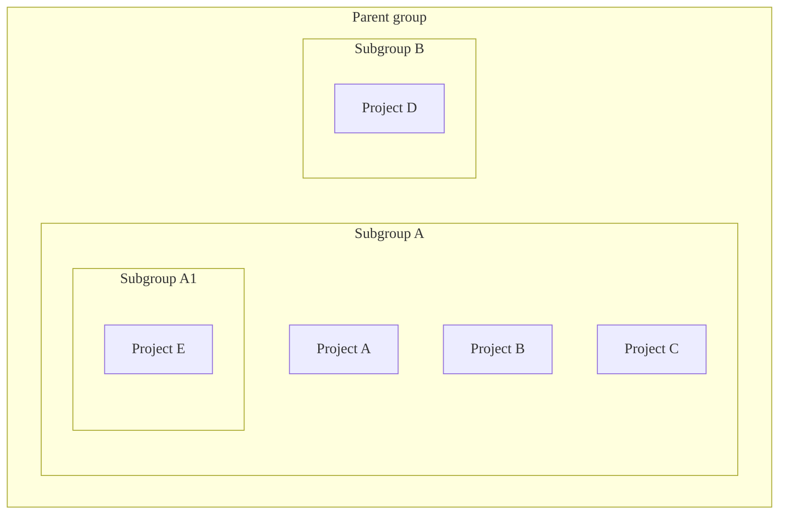
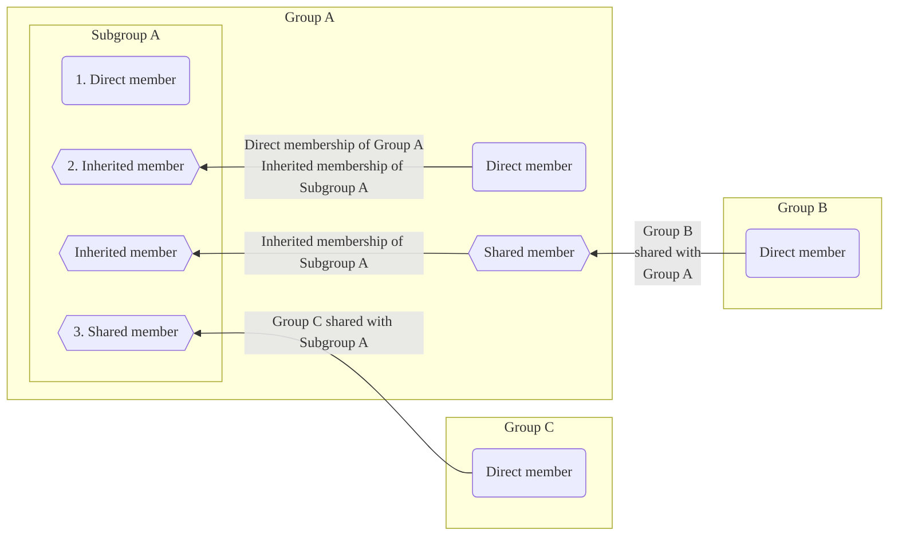



- プラン: Free、Premium、Ultimate
- 提供形態: GitLab.com、GitLab Self-Managed、GitLab Dedicated



GitLabの[グループ](../_index.md)は、サブグループに編成できます。サブグループを使用すると、次のことが可能になります:

- 内部コンテンツと外部コンテンツを分離する。すべてのサブグループは独自の[表示レベル](../../public_access.md)を持てます。したがって、同じ親グループの下でさまざまな目的のグループをホストできます。
- 大規模なプロジェクトを整理する。サブグループを使用して、ソースコードのどの部分に誰がアクセスできるかを管理できます。
- 権限を管理する。ユーザーが[メンバーになっている](#subgroup-membership)各グループの別の[ロール](../../permissions.md#group-members-permissions)をユーザーに付与します。

サブグループは次のことができます:

- 1つの直属の親グループに属する。
- 多数のサブグループを持つ。
- 最大20レベルまでネストされる。
- 親グループに[登録されたRunner](../../../ci/runners/_index.md)を使用する:
  - 親グループに対して設定されたシークレットは、サブグループジョブで使用できます。
  - サブグループに属するプロジェクトでメンテナー以上のロールを持つユーザーは、親グループに登録されているRunnerの詳細を表示できます。

次に例を示します:

## グループのサブグループを表示する {#view-subgroups-of-a-group}

前提要件:

- プライベートネストされたサブグループを表示するには、プライベートサブグループの直接または継承されたメンバーである必要があります。

グループのサブグループを表示するには、次の手順に従います:

1. 左側のサイドバーで、**検索または移動先**を選択して、グループを見つけます。
1. **サブグループとプロジェクト**タブを選択します。
1. 表示するサブグループを選択します。ネストされたサブグループを表示するには、サブグループを展開（)）します。

### パブリック親グループのプライベートサブグループ {#private-subgroups-in-public-parent-groups}

階層リスト内では、プライベートサブグループを持つパブリックグループに展開オプション（）があります。これは、グループにネストされたサブグループがあることを示します。展開オプション（）の表示は、すべてのユーザーが可能です。一方、プライベートグループの表示はプライベートサブグループの直接または継承されたメンバーのみが可能です。

ネストされたサブグループの存在に関する情報を非公開にしたい場合は、プライベート親グループのみにプライベートサブグループを追加する必要があります。

## サブグループを作成する {#create-a-subgroup}

前提要件:

- 次のいずれかが必要です:
  - グループのメンテナー以上のロール。
  - [設定によって決定されるロール](#change-who-can-create-subgroups)。これらのユーザーは、ユーザー設定でグループの作成が[管理者によって無効にされている](../../../administration/admin_area.md#prevent-a-user-from-creating-top-level-groups)場合でも、サブグループを作成できます。



トップレベルのドメイン名を持つGitLab Pagesサブグループのウェブサイトをホストすることはできません。たとえば、`subgroupname.example.io`などです。



サブグループを作成するには、次の手順に従います:

1. 左側のサイドバーで、**検索または移動先**を選択して、サブグループを作成するグループを見つけます。
1. 親グループの概要ページの右上隅で、**新しいサブグループ**を選択します。
1. フィールドに入力します。グループ名として使用できない[予約済みの名前](../../reserved_names.md)のリストを表示します。
1. **サブグループを作成**を選択します。

### サブグループを作成できるユーザーを変更する {#change-who-can-create-subgroups}

前提要件:

- グループの設定に応じて、グループのメンテナー以上のロールが必要です。

グループでサブグループを作成できるユーザーを変更するには、次の手順に従います:

- グループのオーナーロールを持つユーザーとして、次を実行します:
  1. 左側のサイドバーで、**検索または移動先**を選択して、グループを見つけます。
  1. **設定** > **一般**を選択します。
  1. **権限とグループ機能**を展開します。
  1. **サブグループの作成を許可されたロール**から、オプションを選択します。
  1. **変更を保存**を選択します。
- 管理者として、次の手順を実行します:
  1. 左側のサイドバーの下部で、**管理者**を選択します。
  1. 左側のサイドバーで、**概要** > **グループ**を選択して、グループを見つけます。
  1. グループの行で、**編集**を選択します。
  1. **Allowed to create subgroups**（サブグループの作成を許可）ドロップダウンリストから、オプションを選択します。
  1. **変更を保存**を選択します。

詳細については、[権限テーブル](../../permissions.md#group-members-permissions)を参照してください。

## サブグループメンバーシップ {#subgroup-membership}



- GitLab 16.10で、`webui_members_inherited_users`[フラグ](../../../administration/feature_flags/_index.md)とともに、招待されたグループメンバーをメンバーページのメンバータブに表示するように[変更](https://gitlab.com/gitlab-org/gitlab/-/issues/219230)されました。デフォルトでは無効になっています。
- GitLab 17.0の[GitLab.comおよびGitLab Self-Managedで有効になりました](https://gitlab.com/gitlab-org/gitlab/-/issues/219230)。
- 機能フラグ`webui_members_inherited_users`は、GitLab 17.4で[削除](https://gitlab.com/gitlab-org/gitlab/-/merge_requests/163627)されました。招待グループのメンバーは、デフォルトで表示されます。



グループにメンバーを追加すると、そのメンバーはそのグループのすべてのサブグループにも追加されます。メンバーの権限は、グループからすべてのサブグループに継承されます。

サブグループメンバーは次のいずれかになります:

1. サブグループの[直接メンバー](../../project/members/_index.md#add-users-to-a-project)。
1. サブグループの親グループからの[継承されたメンバー](../../project/members/_index.md)。
1. [サブグループのトップレベルグループと共有された](../../project/members/sharing_projects_groups.md#invite-a-group-to-a-group)グループのメンバー。
1. [間接メンバー](../../project/members/_index.md)には、継承されたメンバーと、[サブグループまたはその祖先に招待された](../../project/members/sharing_projects_groups.md#invite-a-group-to-a-group)グループのメンバーが含まれます。

メンバーのグループ権限は、次のユーザーのみが、および次の操作のみで変更できます:

- グループのオーナーロールを持つユーザー。
- メンバーが追加されたグループの設定を変更する。

### メンバーシップの継承を決定する {#determine-membership-inheritance}

メンバーが親グループから権限を継承しているかどうかを確認するには、次の手順に従います:

1. 左側のサイドバーで、**検索または移動先**を選択して、グループを見つけます。
1. **管理** > **メンバー**を選択します。メンバーの継承は、**ソース**列に表示されます。

サブグループの例**Four**のメンバーリスト:

上記のスクリーンショットでは:

- 5人のメンバーがグループ**Four**にアクセスできます。
- ユーザー0は、グループ**Four**でレポーターロールを持ち、グループ**One**から権限を継承しています:
  - ユーザー0は、グループ**One**の直接メンバーです。
  - グループ**One**は、階層内でグループ**Four**の上にあります。
- ユーザー1は、グループ**Four**でデベロッパーロールを持ち、グループ**Two**から権限を継承しています:
  - ユーザー0は、グループ**One**のサブグループであるグループ**Two**の直接メンバーです。
  - グループ**One** / **Two**は、階層内でグループ**Four**の上にあります。
- ユーザー2は、グループ**Four**でデベロッパーロールを持ち、グループ**Three**から権限を継承しています:
  - ユーザー0は、グループ**Two**のサブグループであるグループ**Three**の直接メンバーです。グループ**Two**は、グループ**One**のサブグループです。
  - グループ**One** / **Two** / **Three**は、階層内でグループ**Four**の上にあります。
- ユーザー3は、グループ**Four**の直接メンバーです。つまり、メンテナーロールをグループ**Four**から直接取得します。
- 管理者は、グループ**Four**でオーナーロールを持ち、すべてのサブグループのメンバーです。そのため、ユーザー3と同様に、**ソース**列は管理者が直接メンバーであることを示しています。

メンバーを[継承または直接メンバーシップでフィルター](../_index.md#filter-a-group)できます。

### 祖先グループメンバーシップをオーバーライドする {#override-ancestor-group-membership}

サブグループでオーナーロールを持つユーザーは、メンバーをサブグループに追加できます。

親グループでユーザーが持っているロールよりも低いロールを、サブグループでユーザーに付与することはできません。親グループでユーザーのロールをオーバーライドするには、ユーザーをより高いロールとともにサブグループに再度追加します。次に例を示します:

- ユーザー1がデベロッパーロールとともにグループ**Two**に追加された場合、ユーザー1は、そのロールをグループ**Two**のすべてのサブグループで継承します。
- （**One / Two / Three**の下の）グループ**Four**でメンテナーロールをユーザー1に付与するには、ユーザー1をメンテナーロールとともにグループ**Four**に再度追加します。
- ユーザー1がグループ**Four**から削除された場合、ユーザーのロールはグループ**Two**でのロールに戻ります。ユーザー1は、グループ**Four**でデベロッパーロールを再度持ちます。

## サブグループをメンションする {#mention-subgroups}

エピック、イシュー、コミット、およびマージリクエストでサブグループ（[`@<subgroup_name>`](../../discussions/_index.md#mentions)）にメンションすると、そのグループのすべての直接メンバーに通知されます。サブグループの継承されたメンバーは、メンションによって通知されません。メンションはプロジェクトやグループの場合と同じように機能します。また、通知するメンバーのグループを選択することもできます。
