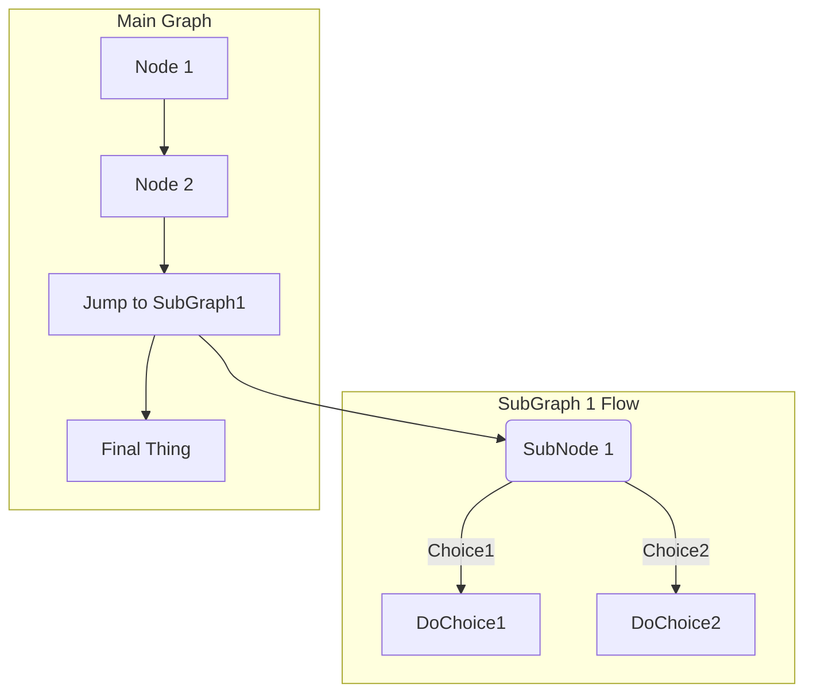



- プラン: Free、Premium、Ultimate
- 提供形態: GitLab.com、GitLab Self-Managed、GitLab Dedicated



GitLab Flavored Markdown（GLFM）は、GitLabユーザーインターフェースでテキストを整形する強力なマークアップ言語です。GLFMでは、次のことが可能です:

- コード、図表、数式、マルチメディアをサポートするリッチコンテンツを作成する。
- イシュー、マージリクエスト、その他のGitLabコンテンツをクロスリファレンスによってリンクする。
- タスクリスト、テーブル、折りたたみ可能なセクションで情報を整理する。
- 100種類以上のプログラミング言語で、構文ハイライトをサポートする。
- セマンティックな見出し構造や画像の説明により、アクセシビリティを確保する。

GitLab UIにテキストを入力すると、GitLabはそのテキストがGitLab Flavored Markdownであると見なします。

GitLab Flavored Markdownは、以下で使用できます:

- コメント
- イシュー
- エピック
- マージリクエスト
- マイルストーン
- スニペット（スニペット名には`.md`拡張子を付ける必要があります）
- Wikiページ
- リポジトリ内のMarkdownドキュメント
- リリース

GitLabでは、他のリッチテキストファイルも使用できます。ただし、そうするには依存関係のインストールが必要になる場合があります。詳細については、[`gitlab-markup` gemプロジェクト](https://gitlab.com/gitlab-org/gitlab-markup)を参照してください。



このMarkdownの仕様は、GitLabでのみ有効です。ここではできる限り忠実にMarkdownをレンダリングしていますが、[GitLabドキュメントサイト](https://docs.gitlab.com)と[GitLabハンドブック](https://handbook.gitlab.com)では異なるMarkdownレンダラーを使用しています。



ここに示した例がGitLabでどのようにレンダリングされるかを正確に確認するには、次の手順に従います:

1. 関連するMarkdownの例のrawテキスト（レンダリング結果ではないもの）をコピーします。
1. MarkdownのプレビューをサポートするGitLab内の場所にMarkdownを貼り付けます。たとえば、イシューまたはマージリクエストのコメントや説明、新しいMarkdownファイルなどです。
1. **プレビュー**を選択し、GitLabによるMarkdownのレンダリング結果を表示します。

## 標準のMarkdownとの違い {#differences-with-standard-markdown}

<!--
Use this topic to list features that are not present in standard Markdown.
Don't repeat this information in each individual topic, unless there's a specific
reason, like in "Newlines".
-->

GitLab Flavored Markdownは、次の機能で構成されています:

- [CommonMark仕様](https://spec.commonmark.org/current/)に基づくコアMarkdown機能。
- [GitHub Flavored Markdown](https://github.github.com/gfm/)の拡張機能。
- GitLab用に特別に作成された拡張機能。

すべての標準Markdown形式は、GitLabで期待どおりに機能します。一部の標準機能は、標準的な使用法に影響を与えることなく、追加機能によって拡張されています。

標準のMarkdownにはない機能は、次のとおりです:

- [アラート](#alerts)
- [`HEX`、`RGB`、`HSL`で記述されたカラーチップ](#colors)
- [説明リスト](#description-lists)
- [図表とフローチャート](#diagrams-and-flowcharts)
- [絵文字](#emoji)
- [脚注](#footnotes)
- [フロントマター](#front-matter)
- [GitLab固有の参照](#gitlab-specific-references)
- [インクルード](#includes)
- [プレースホルダー](#placeholders)
- [インライン差分](#inline-diff)
- [LaTeXで記述された数式と記号](#math-equations)
- [取り消し線](#emphasis)
- [目次](#table-of-contents)
- [テーブル](#tables)
- [タスクリスト](#task-lists)
- [Wiki固有のMarkdown](project/wiki/markdown.md)

次の機能は、標準のMarkdownから拡張されています:

| 標準Markdown                     | GitLabにおける拡張Markdown |
|---------------------------------------|-----------------------------|
| [引用ブロック](#blockquotes)           | [複数行の引用ブロック](#multiline-blockquote) |
| [コードブロック](#code-spans-and-blocks) | [カラーコードと構文ハイライト](#syntax-highlighting) |
| [見出し](#headings)                 | [リンク可能な見出しID](#heading-ids-and-links) |
| [画像](#images)                     | [埋め込み動画](#videos)と[オーディオ](#audio) |
| [リンク](#links)                       | [URLの自動リンク](#url-auto-linking) |

## Markdownとアクセシビリティ {#markdown-and-accessibility}

GitLab Flavored Markdownを使用すると、デジタルコンテンツが作成されます。このコンテンツは、閲覧者にとってできるだけアクセスしやすいものである必要があります。次のリストは網羅的なものではありませんが、特に注意すべきGitLab Flavored Markdownのスタイルに関するガイダンスを提供します:

### アクセスしやすい見出し {#accessible-headings}

見出しの書式設定を使用して、論理的な見出し構造を作成します。ページの見出し構造は、適切な目次のように意味が通るものにする必要があります。1ページに`h1`要素は1つだけにし、見出しレベルをスキップせず、正しくネストされるようにします。

### アクセスしやすいテーブル {#accessible-tables}

テーブルをアクセスしやすく、一目で読めるようにするには、テーブルに空のセルを含めないでください。セルに特に意味のある値がない場合は、「該当しない」ことを示す**N/A**または**なし**を入力することを検討してください。

### アクセスしやすい画像と動画 {#accessible-images-and-videos}

`[alt text]`で画像または動画について説明します。説明は正確、簡潔、かつ一意である必要があります。説明で`image of`や`video of`を使用しないでください。詳細については、[WebAim Alternative Text](https://webaim.org/techniques/alttext/)（WebAimの代替テキスト）を参照してください。

## 見出し {#headings}

`#`を使用して、1–6までの見出しを作成します。

```markdown
# H1
## H2
### H3
#### H4
##### H5
###### H6
```

または、H1およびH2の場合は、下線スタイルを使用します:

```markdown
Alt-H1
======

Alt-H2
------
```

### 見出しIDとリンク {#heading-ids-and-links}



- 見出しリンクの生成はGitLab 17.0で[変更](https://gitlab.com/gitlab-org/gitlab/-/issues/440733)されました。



コメントを除き、Markdownでレンダリングされたすべての見出しには、リンク可能なIDが自動的に付与されます。

マウスオーバーすると、それらのIDへのリンクが表示され、見出しへのリンクをコピーして他の場所で簡単に使用できます。

IDは、次のルールに従って見出しの内容から生成されます:

1. すべてのテキストは小文字に変換されます。
1. 単語以外のテキスト（句読点やHTMLなど）はすべて削除されます。
1. すべてのスペースはハイフンに変換されます。
1. 連続する2つ以上のハイフンは1つに変換されます。
1. 同じIDを持つ見出しがすでに生成されている場合、1から始まる一意の連番が付加されます。

例: 

```markdown
# This heading has spaces in it
## This heading has a :thumbsup: in it
# This heading has Unicode in it: 한글
## This heading has spaces in it
### This heading has spaces in it
## This heading has 3.5 in it (and parentheses)
## This heading has  multiple spaces and --- hyphens
```

次のリンクIDが生成されます:

1. `this-heading-has-spaces-in-it`
1. `this-heading-has-a-thumbsup-in-it`
1. `this-heading-has-unicode-in-it-한글`
1. `this-heading-has-spaces-in-it-1`
1. `this-heading-has-spaces-in-it-2`
1. `this-heading-has-35-in-it-and-parentheses`
1. `this-heading-has--multiple-spaces-and-----hyphens`

## 改行 {#line-breaks}

前のテキストの末尾に2つの改行コードが入ると、改行が挿入されます（新しい段落が開始されます）。たとえば、<kbd>Enter</kbd>キーを2回続けて押したときがこれに該当します。改行コードを1つだけ使用した（<kbd>Enter</kbd>を1回押した）場合、次の文は同じ段落に含まれます。長い行を折り返さずに編集可能な状態を維持する場合は、この方法を使用します:

```markdown
まず、この行から始めます。

この長い行は、上の行から2つの改行コードで区切られているため、*別の段落*になります。

この行も個別の段落ですが、
これらの行は1つの改行コードでしか区切られていないため、
*改行されず*、前の行に続いて
*同じ段落*の中に含まれます。
```

レンダリングすると、この例は次のように表示されます:

> まず、この行から始めます。
>
> この長い行は、上の行から2つの改行コードで区切られているため、*別の段落*になります。
>
> この行も個別の段落ですが、これらの行は1つの改行コードでしか区切られていないため、*改行されず*、前の行に続いて*同じ段落*の中に含まれます。

### 改行コード {#newlines}

[改行](#line-breaks)で説明したとおり、段落は、1行以上の連続したテキストで構成され、1行以上の空行で区切られています（次の例では、最初の段落の後に2つの改行コードが入っています）。

改行またはソフトリターンをより細かく制御する必要がある場合は、行末にバックスラッシュまたは2つ以上のスペースを入れると、1つの改行を追加できます。2つの改行コードを連続して入れると、間に空行を挟んで新しい段落が作成されます:

```markdown
最初の段落。
同じ段落内の別の行。
同じ段落内の3行目。ただし、今回は行末に2つスペースがあります。<space><space>
最初の段落のすぐ下の新しい行。

2番目の段落。
別の行。今回は行末にバックスラッシュがあります。\
直前のバックスラッシュによる新しい行。
```

レンダリングすると、この例は次のように表示されます:

> 最初の段落。同じ段落内の別の行。同じ段落内の3行目。ただし、今回は行末に2つスペースがあります。<br>
> 最初の段落のすぐ下の新しい行。
>
> 2番目の段落。別の行。今回は行末にバックスラッシュがあります。\
> 直前のバックスラッシュによる新しい行。

この構文は、[段落と改行](https://spec.commonmark.org/current/)の処理に関するMarkdownの仕様に準拠しています。

## 強調 {#emphasis}

テキストを強調する方法はいくつかあります。斜体、太字、取り消し線を使用するか、これらの強調スタイルを組み合わせて使用します。

例: 

```markdown
*アスタリスク*または_アンダースコア_を使用した強調（斜体）。

二重の**アスタリスク**または__アンダースコア__を使用した強い強調（太字）。

**アスタリスクと_アンダースコア_**を組み合わせた強調。

二重のチルダによる取り消し線。~~これを取り消します。~~
```

レンダリングすると、この例は次のように表示されます:

> *アスタリスク*または_アンダースコア_を使用した強調（斜体）。
>
> 二重の**asterisks**（アスタリスク）または**underscores**（アンダースコア）を使用した強い強調（太字）。
>
> **asterisks and _underscores_**（アスタリスクとアンダースコア）を組み合わせた強調。
>
> 二重のチルダによる取り消し線。~~これを取り消します。~~

### 単語を途中で強調する {#mid-word-emphasis}

単語の一部を斜体にすることは避けてください。複数のアンダースコアで表示されることが多いコードや名前を扱う場合は、特に避ける必要があります。

GitLab Flavored Markdownは、単語内の複数のアンダーライン記法を無視します。これは、コードについて説明するMarkdownドキュメントをより適切にレンダリングするためです:

```markdown
perform_complicated_task

do_this_and_do_that_and_another_thing

but_emphasis is_desired _here_
```

レンダリングすると、この例は次のように表示されます:

<!-- vale gitlab_base.Spelling = NO -->

> perform_complicated_task
>
> do_this_and_do_that_and_another_thing
>
> but_emphasis is_desired _here_

<!-- vale gitlab_base.Spelling = YES -->

単語の一部だけを強調したい場合は、アスタリスクを使用できます:

```markdown
perform*complicated*task

do*this*and*do*that*and*another thing
```

レンダリングすると、この例は次のように表示されます:

> perform*complicated*task
>
> do*this*and*do*that*and*another thing

### インライン差分 {#inline-diff}

インライン差分タグを使用すると、`{+ additions +}`または`[- deletions -]`を表示できます。

ラップタグには、中かっこまたは角かっこを使用できます:

```markdown
- {+ addition 1 +}
- [+ addition 2 +]
- {- deletion 3 -}
- [- deletion 4 -]
```


---

ただし、次のようにラップタグを混在させることはできません:

```markdown
- {+ addition +]
- [+ addition +}
- {- deletion -]
- [- deletion -}
```

`` `inline code` ``内では差分ハイライトは機能しません。テキストにバッククォート（`` ` ``）が含まれている場合は、各バッククォートをバックスラッシュ（` \ `）で[エスケープ](#escape-characters)してください:

```markdown
- {+ Just regular text +}
- {+ Text with `backticks` inside +}
- {+ Text with escaped \`backticks\` inside +}
```


### 水平線 {#horizontal-rule}

3つ以上のハイフン、アスタリスク、またはアンダースコアを使用して水平線を作成します:

```markdown
---

***

___
```

レンダリングされると、すべての水平線は次のようになります:

---

## リスト {#lists}

順序付きリストと順序なしリストを作成できます。

順序付きリストの場合は、各行の先頭にリストの開始番号（例: `1.`）を追加し、その後にスペースを入れます。最初の番号の後は、どの番号を使用してもかまいません。順序付きリストはレンダリング時に上から順に自動的に番号が付けられるため、同じリスト内のすべての項目で`1.`と記述するのが一般的です。`1.`以外の数値で始めた場合は、その数値が最初の番号として使用され、そこからカウントアップされます。

例: 

```markdown
1. 最初の順序付きリスト項目
2. 別の項目
   - 順序なしサブリスト
1. 実際の数値は関係ありません。数値であることだけが重要です
   1. 順序付きサブリスト
   1. 次の順序付きサブリスト項目
4. さらに別の項目
```

<!--
The "2." and "4." in the previous example are changed to "1." in the following example,
to match the style standards on docs.gitlab.com.
See https://docs.gitlab.com/ee/development/documentation/styleguide/#lists
-->

レンダリングすると、この例は次のように表示されます:

> 1. 最初の順序付きリスト項目
> 1. 別の項目
>    - 順序なしサブリスト
> 1. 実際の数値は関係ありません。数値であることだけが重要です
>    1. 順序付きサブリスト
>    1. 次の順序付きサブリスト項目
> 1. さらに別の項目

順序なしリストの場合は、各行の先頭に`-`、`*`、`+`のいずれかを追加し、その後にスペースを追加します。同じリスト内でこれらの記号を混在させないでください。

```markdown
順序なしリストの例: 

- 使用した記号は
- マイナス

順序なしリストの別の例: 

* 使用した記号は
* アスタリスク

順序なしリストのさらに別の例: 

+ 使用した記号は
+ プラス
```

<!--
The "*" and "+" in the previous example are changed to "-" in the following example,
to match the style standards on docs.gitlab.com.
See https://docs.gitlab.com/ee/development/documentation/styleguide/#lists
-->

レンダリングすると、この例は次のように表示されます:

> 順序なしリストの例: 
>
> - 使用した記号は
> - マイナス
>
> 順序なしリストの別の例: 
>
> - 使用した記号は
> - アスタリスク
>
> 順序なしリストのさらに別の例: 
>
> - 使用した記号は
> - プラス

---

リスト項目に複数の段落が含まれている場合、後続の各段落は、リスト項目のテキストの先頭と同じレベルにインデントする必要があります。

例: 

```markdown
1. 最初の順序付きリスト項目

   最初の項目の2番目の段落

1. 別の項目
```

レンダリングすると、この例は次のように表示されます:

> 1. 最初の順序付きリスト項目
>
>    最初の項目の2番目の段落
>
> 1. 別の項目

最初の項目の段落が適切な数のスペースでインデントされていない場合、その段落はリストの外側に表示されます。適切な数のスペースを使用して、リスト項目の下に続く段落を適切にインデントさせてください。例: 

```markdown
1. 最初の順序付きリスト項目

  （最初の項目の位置がずれた段落）

1.別の項目
```

レンダリングすると、この例は次のように表示されます:

<!-- markdownlint-disable MD027 -->

> 1. 最初の順序付きリスト項目
>
>   （最初の項目の位置がずれた段落）
>
> 1. 別の項目

<!-- markdownlint-enable MD027 -->

---

順序付きリストが、順序なしリスト項目の最初のサブ項目で、かつ`1.`で始まらない場合は、その前に空行を入れる必要があります。

空行を入れた例:

```markdown
- 順序なしリスト項目

  5. 最初の順序付きリスト項目
```

レンダリングすると、この例は次のように表示されます:

<!-- markdownlint-disable MD029 -->

> - 順序なしリスト項目
>
>   5. 最初の順序付きリスト項目

<!-- markdownlint-disable MD029 -->

空行がない場合、2番目のリスト項目は最初の項目の一部としてレンダリングされます:

```markdown
- 順序なしリスト項目
  5. 最初の順序付きリスト項目
```

レンダリングすると、この例は次のように表示されます:

> - 順序なしリスト項目
>   5. 最初の順序付きリスト項目

---

CommonMarkは、順序付きリスト項目と順序なしリスト項目の間にある空行を無視し、それらを単一のリストの一部と見なします。項目は[緩いリスト](https://spec.commonmark.org/0.30/#loose)としてレンダリングされます。各リスト項目は段落タグで囲まれるため、段落のスペースやマージンが適用されます。このため、リストでは各項目の間に余分なスペースがあるように見えます。

例: 

```markdown
- 最初のリスト項目
- 2番目のリスト項目

- 別のリスト
```

レンダリングすると、この例は次のように表示されます:

> - 最初のリスト項目
> - 2番目のリスト項目
>
> - 別のリスト

CommonMarkは空行を無視し、これを段落スペースを伴う単一のリストとしてレンダリングします。

### 説明リスト {#description-lists}



- GitLab 17.7で説明リストが[導入](https://gitlab.com/gitlab-org/gitlab/-/issues/26314)されました。



説明リストは、用語とそれに対応する説明をまとめたリストです。各用語には複数の説明を含めることができます。HTMLでは`<dl>`、`<dt>`、`<dd>`タグで表現されます。

説明リストを作成するには、1行目に用語を配置し、次の行の先頭にコロンを付けて説明を記述します。

```markdown
フルーツ
: りんご
: オレンジ

野菜
: ブロッコリー
: ケール
: ほうれん草
```

用語と説明の間に空行を入れることもできます。

```markdown
フルーツ

: りんご

: オレンジ
```



リッチテキストエディタは新しい説明リストの挿入に対応していません。新しい説明リストを挿入するには、プレーンテキストエディタを使用します。詳細については、[イシュー535956](https://gitlab.com/gitlab-org/gitlab/-/issues/535956)を参照してください。



### タスクリスト {#task-lists}



- GitLab 15.3で適用不可のチェックボックスが[導入](https://gitlab.com/gitlab-org/gitlab/-/merge_requests/85982)されました。



タスクリストは、Markdownがサポートされている場所であればどこにでも追加できます。

- イシュー、マージリクエスト、エピック、コメントでは、チェックボックスを選択できます。
- それ以外の場所ではチェックボックスを選択できません。Markdownを手動で編集し、角かっこ内の`x`を追加または削除する必要があります。

タスクは、完了および未完了の他に、**inapplicable**（適用不可）にすることもできます。イシュー、マージリクエスト、エピック、コメントで適用不可のチェックボックスを選択しても、効果はありません。

タスクリストを作成するには、順序付きリストまたは順序なしリストの形式に従います:

```markdown
- [x] Completed task
- [~] Inapplicable task
- [ ] Incomplete task
  - [x] Sub-task 1
  - [~] Sub-task 2
  - [ ] Sub-task 3

1. [x] 完了したタスク
1. [~] 該当しないタスク
1. [ ] 未完了のタスク
   1. [x] サブタスク1
   1. [~] サブタスク2
   1. [ ] サブタスク3
```


テーブルにタスクリストを含めるには、[HTMLのリストタグまたはHTMLのテーブルを使用](#task-lists-in-tables)します。

## リンク {#links}

リンクは複数の方法で作成できます:

```markdown
- この行は[インラインスタイルのリンク](https://www.google.com)を示しています
- この行は[同じディレクトリ内のリポジトリファイルへのリンク](permissions.md)を示しています
- この行は[1つ上のディレクトリにあるファイルへの相対リンク](../_index.md)を示しています
- この行は[タイトルテキストも含むリンク](https://www.google.com "このリンクはGoogleに移動します！")を示しています
```

レンダリングすると、これらの例は次のように表示されます:

> - この行は[インラインスタイルのリンク](https://www.google.com)を示しています
> - この行は[同じディレクトリ内のリポジトリファイルへのリンク](permissions.md)を示しています
> - この行は[1つ上のディレクトリにあるファイルへの相対リンク](../_index.md)を示しています
> - この行は[タイトルテキストも含むリンク](https://www.google.com "このリンクはGoogleに移動します！")を示しています



相対リンクを使用して、Wikiページ内でプロジェクトファイルを参照したり、プロジェクトファイル内でWikiページを参照したりすることはできません。この制限は、GitLabではWikiが常に別のGitリポジトリに存在することによるものです。たとえば、`[I'm a reference-style link](style)`は、リンクがWikiのMarkdownファイル内にある場合にのみ`wikis/style`を指します。詳細については、[Wiki固有の](project/wiki/markdown.md)を参照してください。



見出しのIDアンカーを使用して、ページ内の特定のセクションにリンクします:

```markdown
- この行は、[#と見出しIDを使用して、別のMarkdownページ上のセクション](permissions.md#project-members-permissions)にリンクします。
- この行は、[#と見出しIDを使用して、同じページ上の別のセクション](#heading-ids-and-links)にリンクします。
```

レンダリングすると、これらの例は次のように表示されます:

> - この行は、[`#`#と見出しIDを使用して、別のMarkdownページ上のセクション](permissions.md#project-members-permissions)にリンクします。
> - この行は、[`#`#と見出しIDを使用して、同じページ上の別のセクション](#heading-ids-and-links)にリンクします。

リンク参照の使用:

<!--
The following codeblock uses extra spaces to avoid the Vale ReferenceLinks test.
Do not remove the two-space nesting.
-->

  ```markdown
  - この行は[参照スタイルのリンク（下記参照）][大文字と小文字を区別しない任意の参照テキスト]を示しています
  - [参照スタイルのリンク定義には数字を使用できます（下記参照）][1]
  - または、空にして[リンクテキスト自体][]を使用します（下記参照）

  参照リンクがこの後に続くことを示すテキスト。

  [大文字と小文字を区別しない任意の参照テキスト]: https://www.mozilla.org/en-US/
  [1]: https://slashdot.org
  [リンクテキスト自体]: https://about.gitlab.com/
  ```

<!--
The example below uses in-line links to pass the Vale ReferenceLinks test.
Do not change to reference style links.
-->

レンダリングすると、この例は次のように表示されます:

> - この行は[参照スタイルのリンク（下記参照）](https://www.mozilla.org/en-US/)を示しています
> - [参照スタイルのリンク定義には数字を使用できます（下記参照）](https://slashdot.org)
> - または、空にして[リンクテキスト自体](https://about.gitlab.com/)を使用します（下記参照）
>
> 参照リンクがこの後に続くことを示すテキスト。

### URLの自動リンク {#url-auto-linking}

テキストに入力したほとんどのURLは、自動的にリンクされます:

```markdown
- https://www.google.com
- https://www.google.com
- ftp://ftp.us.debian.org/debian/
- smb://foo/bar/baz
- irc://irc.freenode.net/
- http://localhost:3000
```

レンダリングすると、この例は次のように表示されます:

> - <https://www.google.com>
> - <https://www.google.com>
> - <ftp://ftp.us.debian.org/debian/>
> - <a href="smb://foo/bar/baz/">smb://foo/bar/baz</a>
> - <a href="irc://irc.freenode.net">irc://irc.freenode.net</a>
> - <http://localhost:3000>

## GitLab固有の参照 {#gitlab-specific-references}



- GitLab 16.11でWikiページのオートコンプリートが[導入](https://gitlab.com/gitlab-org/gitlab/-/issues/442229)されました。
- GitLab 17.1でグループからのラベルを参照する機能が[導入](https://gitlab.com/gitlab-org/gitlab/-/issues/455120)されました。
- GitLab 18.2で`[work_item:NUMBER]`構文を使用して作業アイテム、エピック、イシューを参照する機能が[導入](https://gitlab.com/gitlab-org/gitlab/-/issues/352861)されました。
- GitLab 18.1で`[work_item:123]`構文を使用して作業アイテム、エピック、イシューを`extensible_reference_filters`[フラグ](../administration/feature_flags/_index.md)とともに[導入](https://gitlab.com/gitlab-org/gitlab/-/issues/352861)されました。デフォルトでは無効になっています。
- GitLab 18.2で`[work_item:123]`構文を使用して作業アイテム、エピック、イシューを参照する機能が[一般提供](https://gitlab.com/gitlab-org/gitlab/-/merge_requests/197052)になりました。機能フラグ`extensible_reference_filters`は削除されました。
- `[epic:123]`構文でエピックを参照するオプションが、[導入](https://gitlab.com/gitlab-org/gitlab/-/issues/352864)されました（GitLab 18.4）。



GitLab Flavored Markdownは、GitLab固有の参照をレンダリングします。たとえば、イシュー、コミット、チームメンバー、またはプロジェクトチーム全体を参照できます。GitLab Flavored Markdownは、その参照をリンクに変換し、それらの間を移動できるようにします。プロジェクトへの参照はすべて、プロジェクト名ではなく**project slug**（プロジェクトのslug）を使用する必要があります。

さらに、GitLab Flavored Markdownは特定のクロスプロジェクト参照を認識します。また、同じネームスペース内にある他のプロジェクトを参照するための短縮表記も用意されています。

GitLab Flavored Markdownは、以下を認識します:

| 参照                                                                           | インプット                                                 | クロスプロジェクト参照                        | 同じネームスペース内のショートカット |
|--------------------------------------------------------------------------------------|-------------------------------------------------------|------------------------------------------------|------------------------------------|
| 特定のユーザー                                                                        | `@user_name`                                          |                                                |                                    |
| 特定のグループ                                                                       | `@group_name`                                         |                                                |                                    |
| チーム全体                                                                          | [`@all`](discussions/_index.md#mentioning-all-members) |                                               |                                    |
| プロジェクト                                                                              | `namespace/project>`                                  |                                                |                                    |
| イシュー                                                                                | ``#123``、`GL-123`、または`[issue:123]`                  | `namespace/project#123`または`[issue:namespace/project/123]` | `project#123`または`[issue:project/123]` |
| [作業アイテム](work_items/_index.md)                                                    | `[work_item:123]`                                     | `[work_item:namespace/project/123]`            | `[work_item:project/123]`          |
| マージリクエスト                                                                        | `!123`                                                | `namespace/project!123`                        | `project!123`                      |
| スニペット                                                                              | `$123`                                                | `namespace/project$123`                        | `project$123`                      |
| [エピック](group/epics/_index.md)                                                        | `#123`、`&123`、`[work_item:123]`、または`[epic:123]`    | `group1/subgroup#123`、`group1/subgroup&123`、`[work_item:group1/subgroup/123]`、または`[epic:group1/subgroup/123]` |  |
| [イテレーション](group/iterations/_index.md)                                              | `*iteration:"iteration title"`                        |                                                |                                    |
| ID指定による[イテレーションケイデンス](group/iterations/_index.md)<sup>1</sup>                    | `[cadence:123]`                                       |                                                |                                    |
| タイトル指定による[イテレーションケイデンス](group/iterations/_index.md)（1語）<sup>1</sup>      | `[cadence:plan]`                                      |                                                |                                    |
| タイトル指定による[イテレーションケイデンス](group/iterations/_index.md)（複数語）<sup>1</sup> | `[cadence:"plan a"]`                                 |                                                |                                    |
| [脆弱性](application_security/vulnerabilities/_index.md)                       | `[vulnerability:123]`                                | `[vulnerability:namespace/project/123]`        | `[vulnerability:project/123]`      |
| 機能フラグ                                                                         | `[feature_flag:123]`                                  | `[feature_flag:namespace/project/123]`         | `[feature_flag:project/123]`       |
| ID指定によるラベル<sup>2</sup>                                                             | `~123`                                                | `namespace/project~123`                        | `project~123`                      |
| 名前指定によるラベル（1語）<sup>2</sup>                                                | `~bug`                                                | `namespace/project~bug`                        | `project~bug`                      |
| 名前指定によるラベル（複数語）<sup>2</sup>                                          | `~"feature request"`                                  | `namespace/project~"feature request"`          | `project~"feature request"`        |
| 名前指定によるラベル（スコープ付き）<sup>2</sup>                                                  | `~"priority::high"`                                   | `namespace/project~"priority::high"`           | `project~"priority::high"`         |
| ID指定によるプロジェクトマイルストーン<sup>2</sup>                                                 | `%123`                                                | `namespace/project%123`                        | `project%123`                      |
| 名前指定によるマイルストーン（1語）<sup>2</sup>                                            | `%v1.23`                                              | `namespace/project%v1.23`                      | `project%v1.23`                    |
| 名前指定によるマイルストーン（複数語）<sup>2</sup>                                      | `%"release candidate"`                                | `namespace/project%"release candidate"`        | `project%"release candidate"`      |
| コミット（特定の1つ）                                                                    | `9ba12248`                                            | `namespace/project@9ba12248`                   | `project@9ba12248`                 |
| コミット範囲比較                                                              | `9ba12248...b19a04f5`                                 | `namespace/project@9ba12248...b19a04f5`        | `project@9ba12248...b19a04f5`      |
| リポジトリファイル参照                                                            | `[README](doc/README.md)`                             |                                                |                                    |
| リポジトリファイル参照（特定の行）                                            | `[README](doc/README.md#L13)`                         |                                                |                                    |
| [アラート](../operations/incident_management/alerts.md)                                 | `^alert#123`                                          | `namespace/project^alert#123`                  | `project^alert#123`                |
| [連絡先](crm/_index.md#contacts)                                                    | `[contact:test@example.com]`                          |                                                |                                    |
| [Wikiページ](project/wiki/_index.md)（ページslugがタイトルと同じ場合）      | `[[Home]]`または`[wiki_page:Home]`                      | `[wiki_page:namespace/project:Home]`または`[wiki_page:group1/subgroup:Home]` |        |
| [Wikiページ](project/wiki/_index.md)（ページslugがタイトルと異なる場合）   | `[[How to use GitLab\|how-to-use-gitlab]]`            |                                                |                                    |

**Footnotes**（脚注）:

1. GitLab 16.9で[導入](https://gitlab.com/gitlab-org/gitlab/-/issues/384885)されました。イテレーションケイデンスの参照は、常に`[cadence:<ID>]`形式でレンダリングされます。たとえば、テキスト参照`[cadence:"plan"]`は、参照先イテレーションケイデンスのIDが`1`の場合、`[cadence:1]`としてレンダリングされます。
1. ラベルまたはマイルストーンを参照する場合は、`namespace/project`の前に`/`を追加して、特定のラベルまたはマイルストーンを明示的に指定し、あいまいさをなくします。

たとえば、`#123`形式でイシューを参照すると、出力は`#123`というテキストにイシュー番号123へのリンクが付いた形で書式設定されます。同様に、イシュー番号123へのリンクも認識され、テキスト`#123`として書式設定されます。`#123`をイシューにリンクさせたくない場合は、`\#123`のように先頭にバックスラッシュを追加します。

さらに、一部のオブジェクトへのリンクも認識され、書式設定されます。例: 

- イシューに関するコメント: `"https://gitlab.com/gitlab-org/gitlab/-/issues/1234#note_101075757"`は、`#1234 (comment 101075757)`としてレンダリング。
- イシューのデザインタブ: `"https://gitlab.com/gitlab-org/gitlab/-/issues/1234/designs"`は、`#1234 (designs)`としてレンダリング。
- 個別デザインへのリンク: `"https://gitlab.com/gitlab-org/gitlab/-/issues/1234/designs/layout.png"`は、`#1234[layout.png]`としてレンダリング。

### アイテムのタイトルを表示する {#show-item-title}



- GitLab 16.0で、作業アイテム（タスク、目標、主な成果）に対するサポートが[導入](https://gitlab.com/gitlab-org/gitlab/-/issues/390854)されました。
- GitLab 17.7で`work_item_epics`フラグとともにエピックに対するサポートが導入されました。デフォルトで有効になっています。
- GitLab 18.1でエピックに対して一般提供になりました。機能フラグ`work_item_epics`は削除されました。



イシュー、タスク、目標、主な成果、マージリクエスト、エピックのレンダリングされたリンクにタイトルを含めるには:

- 参照の末尾にプラス（`+`）を追加します。

たとえば、`#123+`のような参照は`The issue title (#123)`としてレンダリングされます。

`https://gitlab.com/gitlab-org/gitlab/-/issues/1234+`のようなURL参照も展開されます。

### アイテムサマリーを表示する {#show-item-summary}



- GitLab 16.0で、作業アイテム（タスク、目標、主な成果）に対するサポートが[導入](https://gitlab.com/gitlab-org/gitlab/-/issues/390854)されました。
- GitLab 17.7で`work_item_epics`フラグとともにエピックに対するサポートが導入されました。デフォルトで有効になっています。
- GitLab 18.1でエピックに対して一般提供になりました。機能フラグ`work_item_epics`は削除されました。



エピック、イシュー、タスク、目標、主な成果、マージリクエストのレンダリングされたリンクに拡張サマリーを含めるには:

- 参照の末尾に`+s`を追加します。

サマリーには、参照される作業アイテムの種類に応じて、該当する場合は、**assignees**（担当者）、**マイルストーン**、**health status**（ヘルスステータス）に関する情報が含まれます。

たとえば、`#123+s`のような参照は`The issue title (#123) • First Assignee, Second Assignee+ • v15.10 • Needs attention`としてレンダリングされます。

`https://gitlab.com/gitlab-org/gitlab/-/issues/1234+s`のようなURL参照も展開されます。

担当者、マイルストーン、ヘルスステータスが変更された場合に、レンダリング済みの参照を更新するには:

- ページを更新します。

### ホバー時のコメントプレビュー {#comment-preview-on-hover}



- GitLab 17.3で`comment_tooltips`[フラグ](../administration/feature_flags/_index.md)とともに[導入](https://gitlab.com/gitlab-org/gitlab/-/issues/29663)されました。デフォルトでは無効になっています。
- 機能フラグは、GitLab 17.6で削除されました。



コメントへのリンクにカーソルを合わせると、コメントの作成者と最初の行が表示されます。

### 可観測性ダッシュボードを埋め込む {#embed-observability-dashboards}

エピック、イシュー、マージリクエストなどに、GitLab可観測性UIダッシュボードの説明とコメントを埋め込むことができます。

可観測性ダッシュボードのURLを埋め込むには:

1. GitLab可観測性UIで、アドレスバーのURLをコピーします。
1. コメントまたは説明にリンクを貼り付けます。GitLab Flavored MarkdownがURLを認識し、ソースを表示します。

## テーブル {#tables}

テーブルを作成する場合:

- 1行目にはヘッダーを記述し、パイプ文字（`|`）で区切ります。
- 2行目はヘッダーとセルを区切ります。
  - セルには、空白、ハイフン、および（オプションで）水平方向の配置を指定するコロンのみを含めることができます。
  - 各セルには少なくとも1つのハイフンを含める必要がありますが、複数のハイフンを追加してもセルのレンダリング結果は変わりません。
  - ハイフン、空白、またはコロン以外の内容は許可されません。
- 3行目以降にセルの値を記述します。
  - Markdownでは、セルの内容を複数行に分けることは**can't**（できません）。セルは1行に収める必要がありますが、非常に長くすることはできます。必要に応じて、HTMLの`<br>`タグで改行を強制できます。
  - セルのサイズは互いに**don't**（一致している必要はありません）。サイズについては柔軟ですが、パイプ記号（`|`）で区切る必要があります。
  - 空のセルを作成**可能**。
- 列幅はセルの内容に基づいて動的に計算されます。
- パイプ文字（`|`）を、テーブルの区切り文字ではなくテキストとして使用するには、バックスラッシュ（`\|`）で[エスケープ](#escape-characters)する必要があります。

例: 

```markdown
| ヘッダー1 | ヘッダー2 | ヘッダー3 |
| --- |
| セル1 | セル2 | セル3 |
| セル4 | セル5はより長い | セル6は他のセルよりもはるかに長いですが問題ありません。セルが表示サイズに対して大きすぎる場合、最終的にはテキストが折り返されます。 |
| セル7 | | セル9 |
```

レンダリングすると、この例は次のように表示されます:

> | ヘッダー1 | ヘッダー2 | ヘッダー3 |
> | ---      | ------   | -------- |
> | セル1   | セル2   | セル3   |
> | セル4 | セル5はより長い | セル6は他のセルよりもはるかに長いですが問題ありません。セルが表示サイズに対して大きすぎる場合、最終的にはテキストが折り返されます。 |
> | セル7   |          | セル9   |

### 配置 {#alignment}

さらに、2行目の「ダッシュ」行の両端にコロン（`:`）を追加することにより、列内のテキストの配置を選択できます。この設定は、列内のすべてのセルに影響します:

```markdown
| 左揃え | 中央揃え | 右揃え |
| :----------- | :------: | ------------: |
| セル1 | セル2 | セル3 |
| セル4 | セル5 | セル6 |
```

レンダリングすると、この例は次のように表示されます:

> | 左揃え | 中央揃え | 右揃え |
> | :----------- | :------: | ------------: |
> | セル1       | セル2   | セル3        |
> | セル4       | セル5   | セル6        |

[GitLab自体](https://gitlab.com/gitlab-org/gitlab/-/blob/master/doc/user/markdown.md#tables)では、ヘッダーはChromeとFirefoxでは常に左揃え、Safariでは中央揃えになります。

### 複数行を含むセル {#cells-with-multiple-lines}

HTMLの書式設定を使用して、テーブルのレンダリングを調整できます。たとえば、`<br>`タグを使用して、セルを複数行にすることが可能です:

```markdown
| 名前 | 詳細 |
| ----- | ------- |
| 項目1 | このテキストは1行に表示されます |
| 項目2 | この項目の内容:<br>- 複数の項目を<br>- 個別にリスト表示します |
```

レンダリングすると、この例は次のように表示されます:

> | 名前  | 詳細 |
> | ----- | ------- |
> | 項目1 | このテキストは1行に表示されます |
> | 項目2 | この項目の内容:<br>- 複数の項目を<br>- 個別にリスト表示します |

### テーブル内のタスクリスト {#task-lists-in-tables}

チェックボックス付きの[タスクリスト](#task-lists)を追加するには、HTMLの書式設定を使用します。次のいずれかを使用します:

- **An HTML table with Markdown in the cells**（セル内にMarkdownを含むHTMLテーブル）。この方法で書式設定したテーブルは、完全に機能するタスクリストを生成します。

  ```html
  <table>
  <thead>
  <tr><th>ヘッダー1</th><th>ヘッダー2</th></tr>
  </thead>
  <tbody>
  <tr>
  <td>セル1</td>
  <td>セル2</td>
  </tr>
  <tr>
  <td>セル3</td>
  <td>

  - [ ] タスク1
  - [ ] タスク2

  </td>
  </tr>
  </tbody>
  </table>
  ```

- **A Markdown table with HTML list tags**（HTMLリストタグを含むMarkdownテーブル）。この方法で作成したタスクは、選択しても状態が保存されません。また、この方法で書式設定したテーブルは、`docs.gitlab.com`上では正しくレンダリングされません。

  ```markdown
  | ヘッダー1 | ヘッダー2 |
  | --- | --- |
  | セル1 | セル2 |
  | セル3 | <ul><li> - [ ] タスク1 </li><li> - [ ] タスク2 </li></ul> |
  ```

[リッチテキストエディタでテーブルを作成](rich_text_editor.md#tables)し、タスクリストを挿入することもできます。

### スプレッドシートからコピーアンドペーストする {#copy-and-paste-from-a-spreadsheet}

スプレッドシートソフトウェア（例: Microsoft Excel、Googleスプレッドシート、Apple Numbers）を使用して、スプレッドシートからGitLabにコピーアンドペーストすると、Markdownテーブルが作成されます。たとえば、次のスプレッドシートがあるとします:


セルを選択してクリップボードにコピーします。GitLab Markdownエントリを開き、スプレッドシートを貼り付けます:


### JSONテーブル {#json-tables}



- GitLab 15.3で[導入](https://gitlab.com/gitlab-org/gitlab/-/merge_requests/86353)されました。
- GitLab 17.9でMarkdownを使用する機能が[導入](https://gitlab.com/gitlab-org/gitlab/-/issues/375177)されました。



JSONコードブロックでテーブルをレンダリングするには、次の構文を使用します:

````markdown
```json:table
{}
```
````

この機能に関する次の動画チュートリアルをご覧ください:

<div class="video-fallback">
  参照用動画: <a href="https://www.youtube.com/watch?v=12yWKw1AdKY">Demo: JSON Tables in Markdown</a>（デモ: MarkdownにおけるJSONテーブル）。
</div>
<figure class="video-container">
  <iframe src="https://www.youtube-nocookie.com/embed/12yWKw1AdKY" frameborder="0" allowfullscreen> </iframe>
</figure>

`items`属性は、データポイントを表すオブジェクトのリストです。

````markdown
```json:table
{
    "items" : [
      {"a": "11", "b": "22", "c": "33"}
    ]
}
```
````

テーブルのラベルを指定するには、`fields`属性を使用します。

````markdown
```json:table
{
    "fields" : ["a", "b", "c"],
    "items" : [
      {"a": "11", "b": "22", "c": "33"}
    ]
}
```
````

`items`のすべての要素で`fields`に対応する値が必須だとは限りません。

````markdown
```json:table
{
    "fields" : ["a", "b", "c"],
    "items" : [
      {"a": "11", "b": "22", "c": "33"},
      {"a": "211", "c": "233"}
    ]
}
```
````

`fields`が明示的に指定されていない場合、ラベルは`items`の最初の要素から取得されます。

````markdown
```json:table
{
    "items" : [
      {"a": "11", "b": "22", "c": "33"},
      {"a": "211", "c": "233"}
    ]
}
```
````

`fields`にカスタムラベルを指定できます。

````markdown
```json:table
{
    "fields" : [
        {"key": "a", "label": "AA"},
        {"key": "b", "label": "BB"},
        {"key": "c", "label": "CC"}
    ],
    "items" : [
      {"a": "11", "b": "22", "c": "33"},
      {"a": "211", "b": "222", "c": "233"}
    ]
}
```
````

`fields`の個々の要素に対してソートを有効にできます。

````markdown
```json:table
{
    "fields" : [
        {"key": "a", "label": "AA", "sortable": true},
        {"key": "b", "label": "BB"},
        {"key": "c", "label": "CC"}
    ],
    "items" : [
      {"a": "11", "b": "22", "c": "33"},
      {"a": "211", "b": "222", "c": "233"}
    ]
}
```
````

`filter`属性を使用すると、ユーザーインプットによって動的にコンテンツがフィルタリングされるテーブルをレンダリングできます。

````markdown
```json:table
{
    "fields" : [
        {"key": "a", "label": "AA"},
        {"key": "b", "label": "BB"},
        {"key": "c", "label": "CC"}
    ],
    "items" : [
      {"a": "11", "b": "22", "c": "33"},
      {"a": "211", "b": "222", "c": "233"}
    ],
    "filter" : true
}
```
````

`markdown`属性を使用すると、項目とキャプション内でGitLab参照を含むGitLab Flavored Markdownを使用できます。フィールドはMarkdownをサポートしていません。

````markdown
```json:table
{
    "fields" : [
        {"key": "a", "label": "AA"},
        {"key": "b", "label": "BB"},
        {"key": "c", "label": "CC"}
    ],
    "items" : [
      {"a": "11", "b": "**22**", "c": "33"},
      {"a": "#1", "b": "222", "c": "233"}
    ],
    "markdown" : true
}
```
````

デフォルトでは、すべてのJSONテーブルに`Generated with JSON data`というキャプションがあります。`caption`属性を指定すると、このキャプションをオーバーライドできます。

````markdown
```json:table
{
    "items" : [
      {"a": "11", "b": "22", "c": "33"}
    ],
    "caption" : "Custom caption"
}
```
````

JSONが無効な場合は、エラーが発生します。

````markdown
```json:table
{
    "items" : [
      {"a": "11", "b": "22", "c": "33"}
    ],
}
```
````

## マルチメディア {#multimedia}

画像、動画、オーディオを埋め込むことができます。Markdown構文を使用してマルチメディアを追加でき、ファイルへのリンク、サイズの設定、インライン表示も可能です。書式設定オプションを使用すると、タイトルのカスタマイズ、幅と高さの指定、レンダリング結果でのメディア表示方法の制御も行えます。

### 画像 {#images}



- オーバーレイでの画像のオープンが[導入](https://gitlab.com/gitlab-org/gitlab/-/issues/377398)されました（GitLab 18.6）。



先頭に`!`を付けたインラインまたは参照[リンク](#links)を使用して、画像を埋め込みます。例: 

<!--
DO NOT change the name of markdown_logo_v17_11.png. This file is used for a test in
spec/controllers/help_controller_spec.rb.
-->

<!-- markdownlint-disable proper-names -->

```markdown

```

> 

<!-- markdownlint-enable proper-names -->

画像リンクでは:

- 角かっこ（`[ ]`）内のテキストが画像の代替テキストになります。
- 画像リンクパスの後の二重引用符で囲まれたテキストがタイトルテキストになります。タイトルテキストを表示するには、画像にカーソルを合わせます。

アクセスしやすい代替テキストの作成については、[アクセスしやすい画像と動画](#accessible-images-and-videos)を参照してください。

画像を選択すると、オーバーレイで開きます。

### 動画 {#videos}

動画拡張子を持つファイルにリンクする画像タグは、自動的に動画プレーヤーに変換されます。有効な動画拡張子は、`.mp4`、`.m4v`、`.mov`、`.webm`、`.ogv`です:

動画の例を次に示します:

```markdown

```

この例は、[GitLab内でレンダリング](https://gitlab.com/gitlab-org/gitlab/-/blob/master/doc/user/markdown.md#videos)した場合にのみ動作します:

> 

### 画像または動画のサイズを変更する {#change-image-or-video-dimensions}



- GitLab 15.7で画像のサポートが[導入](https://gitlab.com/gitlab-org/gitlab/-/issues/28118)されました。
- GitLab 15.9で動画のサポートが[導入](https://gitlab.com/gitlab-org/gitlab/-/issues/17139)されました。



画像の後に属性リストを追加することで、画像または動画の幅と高さを制御できます。値は整数で、単位は`px`（デフォルト）または`%`です。

例

```markdown
{width=100 height=100px}

{width=75%}
```

この例は、[GitLab内でレンダリング](https://gitlab.com/gitlab-org/gitlab/-/blob/master/doc/user/markdown.md#change-image-or-video-dimensions)した場合にのみ動作します:

> {width=100 height=100px}

Markdownの代わりにHTMLの`img`タグを使用し、`height`および`width`パラメータを設定することもできます。

[GitLab 17.1以降](https://gitlab.com/gitlab-org/gitlab/-/issues/419913)、解像度の高いPNG画像をMarkdownテキストボックスに貼り付けると、サイズが常に付加されます。サイズは、Retina（およびその他の高解像度）ディスプレイに対応するように自動的に調整されます。たとえば、144ppiの画像はサイズの50%に、96ppiの画像はサイズの75%にサイズ変更されます。

選択すると、画像は100%にスケールされるか、ウィンドウに収まる最大のスケールでオーバーレイで開きます。

### オーディオ {#audio}

動画と同様に、オーディオ拡張子を持つファイルのリンクタグも、自動的にオーディオプレーヤーに変換されます。有効なオーディオ拡張子は、`.mp3`、`.oga`、`.ogg`、`.spx`、`.wav`です:

オーディオクリップの例を次に示します:

```markdown

```

この例は、[GitLab内でレンダリング](https://gitlab.com/gitlab-org/gitlab/-/blob/master/doc/user/markdown.md#audio)した場合にのみ動作します:

> 

## 引用ブロック {#blockquotes}

引用ブロックを使用して、補足説明などの情報を強調表示します。これは、引用ブロックの行の先頭に`>`を付けることで生成されます:

```markdown
> 引用ブロックは、返信テキストを再現するのに役立ちます。
> この行は同じ引用の一部です。

引用の区切り。

> この非常に長い行は、折り返されても適切に引用されます。どの環境でも折り返されるよう、この行の内容は十分に長くしてください。引用ブロックの中ではMarkdownを使用することもできます。
```

レンダリングすると、この例は次のように表示されます:

> > 引用ブロックは、返信テキストを再現するのに役立ちます。この行は同じ引用の一部です。
>
> 引用の区切り。
>
> > この非常に長い行は、折り返されても適切に引用されます。どの環境でも折り返されるよう、この行の内容は十分に長くしてください。引用ブロックの中では*Markdown*を**Markdown**（使用）することもできます。

### 複数行の引用ブロック {#multiline-blockquote}

`>>>`で囲んで複数行の引用ブロックを作成します:

```markdown
>>>
他の場所から貼り付けたメッセージが

複数行にわたる場合、

各行の先頭に手動で`>`を付加しなくても引用できます！
>>>
```

> 他の場所から貼り付けたメッセージが
>
> 複数行にわたる場合、
>
> 各行の先頭に手動で`>`を付加しなくても引用できます！

## コードスパンとコードブロック {#code-spans-and-blocks}

コードとして表示すべき内容を強調し、通常のテキストと区別します。

インラインコードは、単一のバッククォート（`` ` ``）で囲んで書式設定します:

```markdown
インライン`code`に`back-ticks around`があります。
```

レンダリングすると、この例は次のように表示されます:

> インライン`code`が、`back-ticks around`で囲まれています。

より大きなコードの例で同様の効果を得るには、コードブロックを使用します。コードブロックを作成するには、次のいずれかを行います:

- コードブロック全体をバッククォート（```` ``` ````）3つで囲みます。開始と終了のバッククォートの数が同じであれば、3つ以上のバッククォートも使用できます。
- コードブロック全体をチルダ（`~~~`）3つで囲みます。
- コードブロック全体を4つ以上のスペースでインデントします。

例: 

````markdown
Pythonコードブロック: 

```python
def function(): 
    #フェンス付きコードブロック内でインデントは正常に機能します
    s = "Pythonコード"
    print s
```

4つのスペースを使用したコードブロック: 

    4つのスペースを使用するのは
    バッククォート3つで
    囲むのと同じです

チルダを使用したJavaScriptコードブロック: 

~~~javascript
var s = "JavaScript構文ハイライト";
alert(s);
~~~
````

前の3つの例は次のようにレンダリングされます:

> Pythonコードブロック: 
>
> ```python
> def function(): 
> #フェンス付きコードブロック内でインデントは正常に機能します
> s = "Pythonコード"
> print s
> ```
>
> 4つのスペースを使用したコードブロック: 
>
> ```plaintext
> 4つのスペースを使用するのは
> バッククォート3つで
> 囲むのと同じです
> ```
>
> チルダを使用したJavaScriptコードブロック: 
>
> ```javascript
> var s = "JavaScript構文ハイライト";
> alert(s);
> ```

### 構文ハイライト {#syntax-highlighting}

GitLabは、コードブロックで構文をよりカラフルにハイライトするために、[Rouge Rubyライブラリ](https://github.com/rouge-ruby/rouge)を使用しています。サポートされている言語のリストについては、[RougeプロジェクトのWiki](https://github.com/rouge-ruby/rouge/wiki/List-of-supported-languages-and-lexers)をご覧ください。構文ハイライトはコードブロックでのみサポートされます。インラインコードをハイライトすることはできません。

コードブロックを囲んで構文ハイライトを適用するには、コードの開始宣言（3つのバッククォート（```` ``` ````）または3つのチルダ（`~~~`））にコード言語を追加します。

`plaintext`を使用するコードブロックや、コード言語が指定されていないコードブロックには、構文ハイライトは適用されません:

````plaintext
```
言語が指定されていないため、構文ハイライトは**適用されません**。
s = "この行はハイライトされません。"
しかし、<b>タグ</b>を追加してみましょう。
```
````

レンダリングすると、この例は次のように表示されます:

> ```plaintext
> 言語が指定されていないため、構文ハイライトは**適用されません**。
> s = "この行はハイライトされません。"
> しかし、<b>タグ</b>を追加してみましょう。
> ```

## 図表とフローチャート {#diagrams-and-flowcharts}

次のツールを使用して、テキストから図表を生成できます:

- [Mermaid](https://mermaidjs.github.io/)
- [PlantUML](https://plantuml.com)
- [Kroki](https://kroki.io)（さまざまな図表を作成可能）

Wikiでは、[diagrams.netエディタ](project/wiki/markdown.md#diagramsnet-editor)で作成された図表を追加および編集することもできます。

### Mermaid {#mermaid}



- GitLab 16.0でエンティティリレーションシップ図とマインドマップのサポートが[導入](https://gitlab.com/gitlab-org/gitlab/-/issues/384386)されました。



詳細については、[公式ページ](https://mermaidjs.github.io/)をご覧ください。[Mermaid Live Editor](https://mermaid-js.github.io/mermaid-live-editor/)は、Mermaidの学習やMermaidコード内の問題のデバッグに役立ちます。図表の問題を特定し、解決するために使用できます。

図表またはフローチャートを生成するには、`mermaid`ブロック内にテキストを記述します:

````markdown

````

レンダリングすると、この例は次のように表示されます:


サブグラフを含めることもできます:

````markdown

````

レンダリングすると、この例は次のように表示されます:


### PlantUML {#plantuml}

PlantUMLインテグレーションはGitLab.comで有効になっています。GitLab Self-ManagedのGitLabインスタンスでPlantUMLを利用可能にするには、GitLab管理者が[有効にする必要があります](../administration/integration/plantuml.md)。

PlantUMLを有効にすると、ダイアグラム区切り文字`@startuml`/`@enduml`は`plantuml`ブロックに置き換えられるため、不要になります。例: 

````markdown
```plantuml
Bob -> Alice : hello
Alice -> Bob : hi
```
````

`::include`ディレクティブを使用して、リポジトリ内の別のファイルからPlantUMLダイアグラムをインクルードするか埋め込むことができます。詳細については、[ダイアグラムファイルをインクルードする](../administration/integration/plantuml.md#include-diagram-files)を参照してください。

### Kroki {#kroki}

GitLabでKrokiを利用可能にするには、GitLab管理者が有効にする必要があります。詳細については、[Krokiインテグレーション](../administration/integration/kroki.md)ページを参照してください。

## 数式 {#math-equations}



- GitLab 15.4でLaTeX互換のフェンスが`markdown_dollar_math`[フラグ](../administration/feature_flags/_index.md)とともに[導入](https://gitlab.com/gitlab-org/gitlab/-/issues/21757)されました。デフォルトでは無効になっています。GitLab.comで有効になりました。
- GitLab 15.8でLaTeX互換のフェンスが[一般提供](https://gitlab.com/gitlab-org/gitlab/-/issues/371180)になりました。機能フラグ`markdown_dollar_math`は削除されました。



LaTeX構文で記述された数式は[KaTeX](https://github.com/KaTeX/KaTeX)でレンダリングされます。_KaTeXはLaTeXの[サブセット](https://katex.org/docs/supported.html)のみをサポートしています。_この構文は、`:stem: latexmath`を使用するAsciiDoc Wikiおよびファイルでも機能します。詳細については、[Asciidoctorユーザーマニュアル](https://asciidoctor.org/docs/user-manual/#activating-stem-support)を参照してください。

不正行為を防ぐため、GitLabは最初の50個のインライン数式インスタンスのみをレンダリングします。この制限は、[グループ](../api/graphql/reference/_index.md#mutationgroupupdate)または[GitLab Self-Managedインスタンス](../administration/instance_limits.md#math-rendering-limits)全体に対して無効にできます。

数式ブロックの数も、レンダリング時間に基づいて制限されます。制限を超えると、GitLabは超過した数式インスタンスをテキストとしてレンダリングします。Wikiファイルとリポジトリファイルには、これらの制限は適用されません。

バッククォート付きのドル記号（``` $`...`$ ```）または単一のドル記号（`$...$`）で囲んだ数式は、テキスト内でインライン表示されます。

二重のドル記号（`$$...$$`）で囲んだ数式、または言語に`math`と指定した[コードブロック](#code-spans-and-blocks)内の数式は、別の行にレンダリングされます:

`````markdown
This math is inline: $`a^2+b^2=c^2`$.

この数式は、`` ```math ````ブロックを使用して別の行に表示されます: 

```math
a^2+b^2=c^2
```

This math is on a separate line using inline `$$`: $$a^2+b^2=c^2$$

This math is on a separate line using a `$$...$$` block: 

$$
a^2+b^2=c^2
$$
`````

レンダリングすると、この例は次のように表示されます:




リッチテキストエディタは新しい数式ブロックの挿入に対応していません。新しい数式ブロックを挿入するには、プレーンテキストエディタを使用します。詳細については、[イシュー366527](https://gitlab.com/gitlab-org/gitlab/-/issues/366527)を参照してください。



## 目次 {#table-of-contents}

目次は、ドキュメント内のサブ見出しにリンクする順序なしリストです。イシュー、マージリクエスト、エピックには目次を追加できますが、ノートやコメントには追加できません。

サポートされているコンテンツタイプの**description**（説明）フィールドに、次のいずれかのタグを単独の行として追加します:

<!--
Tags for the table of contents are presented in a code block to work around a Markdown bug.
Do not change the code block back to single backticks.
For more information, see https://gitlab.com/gitlab-org/gitlab/-/issues/359077.
-->

```markdown
[[_TOC_]]
または
[TOC]
```

- Markdownファイル。
- Wikiページ。
- イシュー。
- マージリクエスト。
- エピック。



TOCコードを単一の角かっこで使用すると、単独の行かどうかにかかわらず、目次がレンダリングされます。この動作は意図したものではありません。詳細については、[イシュー359077](https://gitlab.com/gitlab-org/gitlab/-/issues/359077)を参照してください。



```markdown
これは、私のWikiページの紹介文です。

[[_TOC_]]

## My first heading

First section content.

## My second heading

Second section content.
```


## アラート {#alerts}



- GitLab 17.10で[導入](https://gitlab.com/gitlab-org/gitlab/-/issues/24482)されました。



アラートは、何かを強調したり注意を引いたりするために使用できます。アラートの構文では、Markdownの引用ブロック構文の後にアラートのタイプを指定します。Markdownをサポートするどのテキストボックスでもアラートを使用できます。

使用できるアラートのタイプは次のとおりです:

- 注: ざっと目を通す場合でも注意すべき情報:

  ```markdown
  > [!note]
  > The following information is useful.
  ```

- ヒント: ユーザーが成功するために役立つ任意の情報:

  ```markdown
  > [!tip]
  > Tip of the day.
  ```

- 重要: ユーザーが成功するために必要不可欠な重要な情報:

  ```markdown
  > [!important]
  > This is something important you should know.
  ```

- 注意: アクションによって悪影響が生じる可能性がある:

  ```markdown
  > [!caution]
  > You need to be very careful about the following.
  ```

- 警告: 重大なリスクの可能性がある:

  ```markdown
  > [!warning]
  > The following would be dangerous.
  ```

アラートに表示されるタイトルテキストは、デフォルトではアラートの名前になります。たとえば、`> [!warning]`アラートのタイトルは`Warning`です。

アラートブロックのタイトルをオーバーライドするには、同じ行に任意のテキストを入力します。たとえば、警告の色を使用しつつタイトルを`Data deletion`にする場合は、次のように指定します:

```markdown
> [!warning] Data deletion
> 次の手順を実行すると、データは回復できなくなります。
```

[複数行の引用ブロック](#multiline-blockquote)もアラート構文をサポートしています。これにより、大きくてより複雑なテキストをアラートで囲むことができます。

```markdown
>>> [!note] 考慮事項
次の影響を考慮する必要があります: 

1. 考慮事項1
1. 考慮事項2
>>>
```

アラートは次のようにレンダリングされます:


## カラー {#colors}

Markdownはテキストカラーの変更をサポートしていません。

カラーコードは、`HEX`、`RGB`、`HSL`の形式で記述できます。

- `HEX`: `` `#RGB[A]` ``または`` `#RRGGBB[AA]` ``
- `RGB`: `` `RGB[A](R, G, B[, A])` ``
- `HSL`: `` `HSL[A](H, S, L[, A])` ``

カラーを名前で参照することはサポートされていません。

GitLabアプリケーションでは（ただしGitLabドキュメントは除く）、カラーコードをバッククォートで囲むと、カラーコードの横にカラーチップが表示されます。例: 

```markdown
- `#F00`
- `#F00A`
- `#FF0000`
- `#FF0000AA`
- `RGB(0,255,0)`
- `RGB(0%,100%,0%)`
- `RGBA(0,255,0,0.3)`
- `HSL(540,70%,50%)`
- `HSLA(540,70%,50%,0.3)`
```

この例は、[GitLab内でレンダリング](https://gitlab.com/gitlab-org/gitlab/-/blob/master/doc/user/markdown.md#colors)した場合にのみ動作します:

- `#F00`
- `#F00A`
- `#FF0000`
- `#FF0000AA`
- `RGB(0,255,0)`
- `RGB(0%,100%,0%)`
- `RGBA(0,255,0,0.3)`
- `HSL(540,70%,50%)`
- `HSLA(540,70%,50%,0.3)`

### カラーコードをエスケープする {#escape-color-codes}



- GitLab 18.3で[導入](https://gitlab.com/gitlab-org/gitlab/-/issues/359069)されました。



カラーコードをインラインコードとして表示し、カラーチップを生成しないようにするには、先頭にバックスラッシュ（`` \ ``）を付けます。

例: 

- `\#FF0000`
- `\RGB(255,0,0)`
- `\HSL(0,100%,50%)`

いずれの場合も、出力ではバックスラッシュが削除され、カラーチップはレンダリングされません。

これは特に、インラインコードにイシュー番号などの値を含める際に、カラーチップが誤って表示されないようにするために便利です。

## 絵文字 {#emoji}

絵文字は、GitLab Flavored Markdownがサポートされている場所ならどこでも使用できます。例: 

```markdown
ときには、ちょっと遊び心で:monkey:いくつかの:star2:を
:speech_balloon:に加えたいことがあります。そこで、絵文字をご用意しました！

絵文字を使って:bug:を指摘したり、問題のある:speak_no_evil:パッチについて警告したりできます。
また、誰かがあなたの遅い:snail:コードを改善してくれたら、:birthday:を送りましょう。
きっと喜んでくれます:heart:。

絵文字に使い慣れてなくても、緊張する:fearful:ことはありません。絵文字の:family:に参加できます。
サポートされているコードを調べてみてください。
```

レンダリングすると、この例は次のように表示されます:

> ときには、ちょっと遊び心でいくつかのをに加えたいことがあります。そこで、絵文字をご用意しました！
>
> 絵文字を使ってを指摘したり、問題のあるパッチについて警告したりできます。また、誰かがあなたの遅いコードを改善してくれたら、を送りましょう。きっと喜んでくれます。
>
> 絵文字に使い慣れてなくても、緊張することはありません。絵文字のに参加できます。サポートされているコードを調べてみてください。

サポートされているすべての絵文字コードのリストについては、[絵文字チートシート](https://www.webfx.com/tools/emoji-cheat-sheet/)を参照してください。

### 絵文字とオペレーティングシステム {#emoji-and-your-operating-system}

前の絵文字の例では、ハードコードされた画像を使用しています。GitLabでレンダリングされる絵文字は、使用するOSとブラウザによって表示が異なる場合があります。

ほとんどの絵文字はmacOS、Windows、iOS、Androidでネイティブにサポートされており、サポートされていない場合は画像ベースの絵文字にフォールバックします。

<!-- vale gitlab_base.Spelling = NO -->

Linuxでは、[Noto Color Emoji](https://github.com/googlefonts/noto-emoji)をダウンロードして、絵文字の完全なネイティブサポートを利用できます。Ubuntu 22.04では（多くの最新のLinuxディストリビューションと同様に）、このフォントがデフォルトでインストールされています。

<!-- vale gitlab_base.Spelling = YES -->

カスタム絵文字の追加の詳細については、[カスタム絵文字](emoji_reactions.md#custom-emoji)を参照してください。

## フロントマター {#front-matter}

フロントマターとは、Markdownドキュメントの先頭、コンテンツの前にあるメタデータのことです。このデータは、[Jekyll](https://jekyllrb.com/docs/front-matter/)や[Hugo](https://gohugo.io/content-management/front-matter/)などの静的サイトジェネレーターや、その他多くのアプリケーションで使用できます。

GitLabでレンダリングされたMarkdownファイルを表示すると、フロントマターはドキュメントの上部のブロックにそのまま表示されます。HTMLコンテンツは、フロントマターの後に表示されます。例を確認するには、[GitLabドキュメントファイル](https://gitlab.com/gitlab-org/gitlab/-/blob/master/doc/_index.md)のソースバージョンとレンダリングバージョンを切り替えてみてください。

GitLabでは、フロントマターはMarkdownファイルとWikiページでのみ使用されます。Markdownの書式設定がサポートされている他の場所では使用されません。フロントマターは必ずドキュメントの最上部に配置し、区切り文字で囲む必要があります。

次の区切り文字がサポートされています:

- YAML（`---`）:

  ```yaml
  ---
  title: フロントマターについて
  example: 
    language: yaml
  ---
  ```

- TOML（`+++`）:

  ```toml
  +++
  title = "フロントマターについて"
  [example]
  language = "toml"
  +++
  ```

- JSON（`;;;`）:

  ```json
  ;;;
  {
    "title": "フロントマターについて"
    "example": {
      "language": "json"
    }
  }
  ;;;
  ```

他の言語は、既存の区切り文字に指定子を追加することでサポートされます。例: 

```php
---php
$title = "フロントマターについて";
$example = array(
  'language' => "php",
);
---
```

## インクルード {#includes}



- GitLab 17.7で[導入](https://gitlab.com/gitlab-org/gitlab/-/issues/195798)されました。



インクルード（インクルードディレクティブ）を使用して、ドキュメントの内容を別のドキュメント内に追加できます。

たとえば、本を複数の章に分け、各章をメインのドキュメントに含めることができます:

```markdown
::include{file=chapter1.md}

::include{file=chapter2.md}
```

GitLabでは、インクルードディレクティブはMarkdownファイルとWikiページでのみ使用されます。Markdownの書式設定がサポートされている他の場所では使用されません。

Markdownファイルでインクルードディレクティブを使用する場合:

```markdown
::include{file=example_file.md}
```

Wikiページでインクルードディレクティブを使用する場合:

```markdown
::include{file=example_page.md}
```

各`::include`は行の先頭に配置し、`file=`でファイルまたはURLを指定する必要があります。指定したファイル（またはURL）の内容は`::include`の位置に挿入され、残りのMarkdownと併せて処理されます。

挿入されたファイル内のインクルードディレクティブは無視されます。たとえば、`file1`が`file2`を含み、`file2`が`file3`を含んでいる場合、`file1`を処理した結果には`file3`の内容は反映されません。

### インクルードの制限 {#include-limits}

システムパフォーマンスを確保し、悪意のあるドキュメントが問題を引き起こすのを防ぐために、GitLabでは1つのドキュメント内で処理されるインクルードディレクティブの数に上限を設けています。デフォルトでは、ドキュメントには最大32個のインクルードディレクティブを含めることができます。

処理されるインクルードディレクティブの数をカスタマイズするには、管理者が[アプリケーション設定API](../api/settings.md#available-settings)で`asciidoc_max_includes`アプリケーション設定を変更します。

### 外部URLからのインクルードを使用する {#use-includes-from-external-urls}

別のWikiページまたは外部URLからのインクルードを使用するには、管理者が`wiki_asciidoc_allow_uri_includes`[アプリケーション設定](../administration/wikis/_index.md#allow-uri-includes-for-asciidoc)を有効にします。

```markdown
<!-- コンテンツをURIから読み込めるようにするには、アプリケーション設定wiki_asciidoc_allow_uri_includesをtrueに設定します -->
::include{file=https://example.org/installation.md}
```

### コードブロックでインクルードを使用する {#use-includes-in-code-blocks}

コードブロック内で`::include`ディレクティブを使用して、リポジトリ内のファイルからコンテンツを追加できます。たとえば、リポジトリに次の内容のファイル`javascript_code.js`が含まれている場合:

```javascript
var s = "JavaScript構文ハイライト";
alert(s);
```

これを次のようにMarkdownファイルに含めることができます:

````markdown
このスクリプトには以下が含まれています: 

```javascript
::include{file=javascript_code.js}
```
````

レンダリングすると、この例は次のように表示されます:

> このスクリプトには以下が含まれています: 
>
> ```javascript
> var s = "JavaScript構文ハイライト";
> alert(s);
> ```

## プレースホルダー {#placeholders}



- GitLab 18.2で`markdown_placeholders`[フラグ](../administration/feature_flags/_index.md)とともに[導入](https://gitlab.com/gitlab-org/gitlab/-/issues/14389)されました。デフォルトでは無効になっています。





この機能の利用可否は、機能フラグによって制御されます。詳細については、履歴を参照してください。この機能はテストには利用できますが、本番環境での使用には適していません。



プレースホルダーは、プロジェクトのタイトルや最新のタグなど、特定の種類の変動するデータを表示するために使用できます。Markdownがレンダリングされるたびにプレースホルダーは対応する値に置き換わります。

構文は`%{PLACEHOLDER}`です。

| プレースホルダー               | 値の例       | 説明 |
|---------------------------|---------------------|-------------|
| `%{gitlab_server}`        | `gitlab.com`        | プロジェクトのサーバー |
| `%{gitlab_pages_domain}`  | `pages.gitlab.com`  | GitLab Pagesをホストするドメイン |
| `%{project_path}`         | `gitlab-org/gitlab` | 親グループを含むプロジェクトのパス |
| `%{project_name}`         | `gitlab`            | プロジェクトの名前 |
| `%{project_id}`           | `278964`            | プロジェクトに関連付けられたデータベースID |
| `%{project_namespace}`    | `gitlab-org`        | プロジェクトのプロジェクトネームスペース |
| `%{project_title}`        | `GitLab`            | プロジェクトのタイトル |
| `%{group_name}`           | `gitlab-org`        | プロジェクトのグループ |
| `%{default_branch}`       | `main`              | プロジェクトのリポジトリに設定されたデフォルトブランチ名 |
| `%{commit_sha}`           | `ad10e011ce65492322037633ebc054efde37b143` | プロジェクトのリポジトリのデフォルトブランチへの最新コミットのID |
| `%{latest_tag}`           | `v17.10.7-ee`       | プロジェクトのリポジトリに追加された最新のタグ |

## エスケープ文字 {#escape-characters}

Markdownは、ページを書式設定するために次のASCII文字を予約しています:

```plaintext
! " # $ % & ' ( ) * + , - . / : ; < = > ? @ [ \ ] ^ _ ` { | } ~
```

テキスト内でこれらの予約文字のいずれかを使用するには、予約文字の直前にバックスラッシュ文字（` \ `）を追加します。予約文字の前にバックスラッシュを配置すると、Markdownパーサーはバックスラッシュを省略し、予約文字を通常のテキストとして扱います。

例: 

```plaintext
\# 見出しではありません

| 食べ物            | この食べ物は好きですか？（丸で囲んでください） |
|-----------------|---------------------------------|
| ピザ          |  はい \| いいえ                     |

\**太字ではなく、アスタリスクで囲まれた斜体のテキスト*\*
```

レンダリングすると、この例は次のように表示されます:

> \# 見出しではありません
>
> | 食べ物            | この食べ物は好きですか？（丸で囲んでください）|
> |-----------------|--------------------------------|
> | ピザ          |  はい \| いいえ                     |
>
> \**太字ではなく、アスタリスクで囲まれた斜体のテキスト*\*

バックスラッシュは、常にそれに続く文字をエスケープするとは限りません。バックスラッシュは、次の場合に通常のテキストとして表示されます:

- バックスラッシュが`A`、`3`、スペースなどの予約されていない文字の前にある場合。
- バックスラッシュが次のMarkdown要素の中にある場合:
  - コードブロック
  - コードスパン
  - 自動リンク
  - `<kbd>`などのインラインHTML

このような場合には、同等のHTMLエンティティ（`]`を表す`&#93;`など）を使用する必要があります。

### バックスラッシュとバッククォートを併用する {#use-backslash-with-backticks}

インラインコードサンプルの最後にバックスラッシュ（` \ `）がある場合、そのバックスラッシュが最後のバッククォートをエスケープしてしまうことがあります。この場合、インラインコードの前後に余分なスペースを追加します。次に例を示します:

```markdown
Use the backslash ` \ ` character to escape inline code that ends in a ` backslash\ `.
```

レンダリングすると、この例は次のように表示されます:

> Use the backslash ` \ ` character to escape inline code that ends in a ` backslash\ `.

## 脚注 {#footnotes}

脚注を使用すると、Markdownファイルの末尾にノートがレンダリングされ、そのノートへのリンクが本文に追加されます。

脚注を作成するには、参照タグと、ノートの内容を記述した別の行（ファイル内の任意の場所）の両方が必要です。

レンダリング時の番号は、タグ名にかかわらず参照タグの相対的な順序によって決まります。

ノートはどこに記述しても、レンダリング結果では常にファイルの末尾に表示されます。

例: 

- 脚注の参照:

  ```markdown
  脚注の参照タグは次のようになります: [^1]

  この参照タグは文字と数字を組み合わせたものです: [^footnote-42]
  ```

- ファイルの別の場所で脚注を定義:

  ```markdown
  [^1]: このテキストは脚注の中にあります。
  [^footnote-42]: このテキストは別の脚注です。
  ```

レンダリングすると、脚注は次のように表示されます:

> 脚注の参照タグは次のようになります: [^1]
>
> この参照タグは文字と数字を組み合わせたものです: [^footnote-42]
>
> [^1]: このテキストは脚注の中にあります。
> [^footnote-42]: このテキストは別の脚注です。



リッチテキストエディタは新しい脚注の挿入に対応していません。新しい脚注を挿入するには、プレーンテキストエディタを使用します。詳細については、[イシュー365265](https://gitlab.com/gitlab-org/gitlab/-/issues/365265)を参照してください。



## インラインHTML {#inline-html}

Markdownではraw HTMLを使用することもでき、通常は適切に機能します。

許可されているHTMLタグと属性のリストについては、`HTML::Pipeline`の[SanitizationFilter](https://github.com/gjtorikian/html-pipeline/blob/v2.12.3/lib/html/pipeline/sanitization_filter.rb#L42)クラスのドキュメントを参照してください。デフォルトの`SanitizationFilter`許可リストに加えて、GitLabでは`span`、`abbr`、`details`、`summary`要素を許可しています。リンクでは`rel="license"`が許可されており、[Rel-Licenseマイクロフォーマット](https://microformats.org/wiki/rel-license)とライセンスの表示をサポートしています。

```html
<dl>
  <dt>定義リスト</dt>
  <dd>ときどき使用されます。</dd>

  <dt>HTML内のMarkdown</dt>
  <dd>**あまり**うまく動作*しません*。HTML<em>タグ</em>はほとんどの場合、<b>動作</b>します。</dd>
</dl>
```

レンダリングすると、この例は次のように表示されます:

> <dl>
>   <dt>定義リスト</dt>
>   <dd>ときどき使用されます。</dd>
>
>   <dt>HTML内のMarkdown</dt>
>   <dd>**あまり**うまく動作*しません*。HTML<em>タグ</em>はほとんどの場合、<b>動作</b>します。</dd>
> </dl>

HTMLタグ内でMarkdownを使用することもできますが、Markdownを含む行を独立した行に分けた場合に限られます:

```html
<dl>
  <dt>HTML内のMarkdown</dt>

  **あまり**うまく動作*しません*。HTMLタグはほとんどの場合、動作します。

  </dd>
</dl>
```

レンダリングすると、この例は次のように表示されます:

<!--
The example below uses HTML to force correct rendering on docs.gitlab.com,
Markdown is fine in GitLab.
-->

<!-- markdownlint-disable MD027 -->

> <dl>
>   <dt>HTML内のMarkdown</dt>
>
>   <b>あまり</b>うまく動作<em>しません</em>。HTMLタグはほとんどの場合、動作します。
>
>   </dd>
> </dl>

<!-- markdownlint-enable MD027 -->

### 折りたたみ可能なセクション {#collapsible-section}

HTMLの[`<details>`](https://developer.mozilla.org/en-US/docs/Web/HTML/Element/details)および[`<summary>`](https://developer.mozilla.org/en-US/docs/Web/HTML/Element/summary)タグを使用して、コンテンツを折りたたむことができます。たとえば、長いログファイルを折りたたみ、画面の占有スペースを小さくすることができます。

```html
<details>
<summary>クリックして展開</summary>

これらの詳細は展開するまで<strong>非表示</strong>の<em>ままです</em>。

<pre><code>ここにログを貼り付けてください</code></pre>

</details>
```

レンダリングすると、この例は次のように表示されます:

> <details>
> <summary>クリックして展開</summary>
>
> これらの詳細は展開するまで<strong>非表示</strong>の<em>ままです</em>。
>
> <pre><code>ここにログを貼り付けてください</code></pre>
>
> </details>

---

これらのタグ内ではMarkdownもサポートされています。

次の例に示すように、Markdownセクションの前後には空行を入れてください:

````html
<details>
<summary>

クリックして_展開。_

</summary>

これらの詳細は展開するまで**非表示**の_ままです_。

```
ここにログを貼り付けてください
```

</details>
````

<!--
The example below uses HTML to force correct rendering on docs.gitlab.com, Markdown
works correctly in GitLab.
-->

レンダリングすると、この例は次のように表示されます:

> <details>
> <summary>クリックして<em>展開。</em></summary>
>
> これらの詳細は展開するまで<b>非表示</b>の<em>ままです</em>。
>
> <pre><code>ここにログを貼り付けてください</code></pre>
>
> </details>

### キーボードHTMLタグ {#keyboard-html-tag}

`<kbd>`要素は、ユーザーのキーボードインプットを表すテキストを示すために使用されます。`<kbd>`タグで囲んだテキストは、通常、ブラウザのデフォルトの等幅フォントで表示されます。

```html
次のページに進むには、<kbd>Enter</kbd>を押してください。
```

レンダリングすると、この例は次のように表示されます:

> 次のページに進むには、<kbd>Enter</kbd>を押してください。

### 上付き文字と下付き文字 {#superscripts-and-subscripts}

GitLab Flavored Markdownは、Redcarpetの上付き構文（`x^2`）をサポートしていません。上付き文字と下付き文字には、標準のHTML構文を使用してください:

```html
水の化学式はH<sub>2</sub>Oで、
相対性理論の式はE = mc<sup>2</sup>です。
```

<!-- vale gitlab_base.Spelling = NO -->

レンダリングすると、この例は次のように表示されます:

> 水の化学式はH<sub>2</sub>Oで、相対性理論の式はE = mc<sup>2</sup>です。

<!-- vale gitlab_base.Spelling = YES -->

GitLab Flavored Markdownは、Redcarpetの上付き構文（`x^2`）をサポートしていません。

### HTMLコメント {#html-comments}

GitLab Flavored MarkdownでHTMLコメントを使用すると、レンダリング結果に表示されないノートや説明を追加できます。

HTMLコメントの用途:

- 他のコントリビューター向けのノートを追加する。
- コンテンツを削除せずに一時的に非表示にする。
- 最終的なドキュメントに含める必要のないコンテキストや説明を記載する。
- メタデータや処理手順を追加する。

HTMLコメントを使用する際の注意点:

- ソースが煩雑にならないよう、控えめに使用する。
- 内容は簡潔で関連性のあるものにする。
- 永続的なドキュメントではなく、一時的なノートに使用する。
- 機密情報や社外秘の情報は含めないこと。HTMLコメントは、Markdownのソースを閲覧できるすべての人に表示されます。

HTMLコメントは標準のHTML構文`<!-- comment text -->`を使用し、1行または複数行にわたって記述できます:

```html
<!-- これは1行のコメントです -->

<!--
これは複数行のコメントです
複数行にまたがっていますが
レンダリング結果には表示されません
-->

このテキストは表示されます。
<!-- この段落の間にあるコメントは非表示です -->
このテキストも表示されます。
```

レンダリングされると、表示されるのは以下の表示可能なテキストのみです:

> このテキストは表示されます。
>
> このテキストも表示されます。

#### コードブロック内のコメント {#comments-in-code-blocks}

コードブロック内のHTMLコメントはリテラルテキストとして扱われ、そのまま表示されます:

````markdown
```html
<!-- このコメントはコードブロック内に表示されます -->
<div>コンテンツ</div>
```
````
