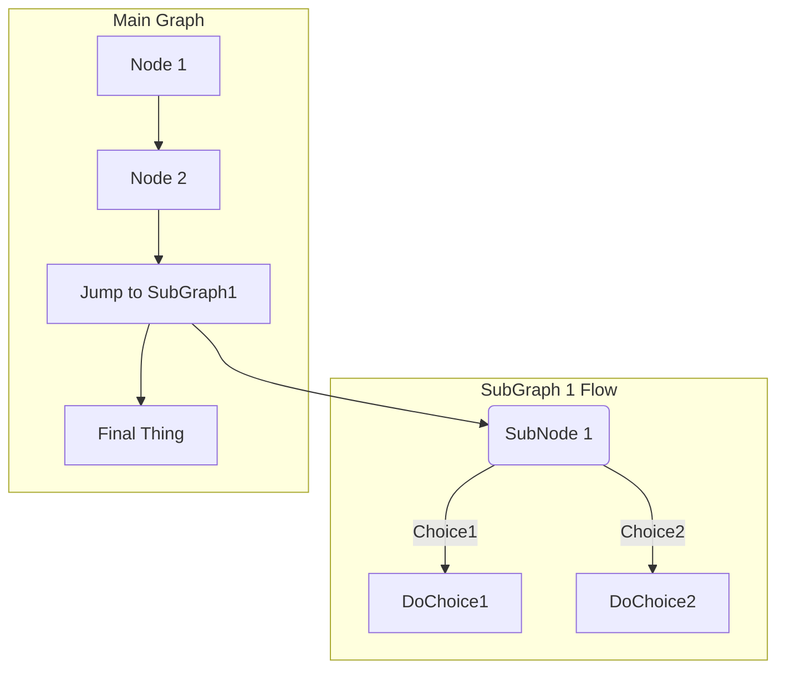



- プラン: Free、Premium、Ultimate
- 提供形態: GitLab.com、GitLab Self-Managed、GitLab Dedicated



GitLab Flavored Markdown（GLFM）は、GitLab UIでテキストをフォーマットする強力なマークアップ言語です。GLFMには、次の特徴があります。

- コード、図、数式、マルチメディアをサポートするリッチコンテンツを作成できます。
- イシュー、マージリクエスト、その他のGitLabコンテンツをクロスリファレンスでリンクできます。
- タスクリスト、テーブル、折りたたみ可能なセクションにより情報を整理できます。
- 100種類以上のプログラミング言語で、ハイライトした構文をサポートします。
- セマンティックな見出し構造と画像の説明により、アクセシビリティを確保できます。

GitLab UIにテキストを入力すると、GitLabはそのテキストがGitLab Flavored Markdownで記述されていると見なします。

GitLab Flavored Markdownは以下で使用できます。

- コメント
- イシュー
- エピック
- マージリクエスト
- マイルストーン
- スニペット（スニペットは`.md`拡張子を使って命名する必要があります）
- Wikiページ
- リポジトリ内のMarkdownドキュメント
- リリース

GitLabでは、他のリッチテキストファイルも使用できます。ただし、依存関係のインストールが必要になる場合があります。詳細については、[`gitlab-markup`gemプロジェクト](https://gitlab.com/gitlab-org/gitlab-markup)を参照してください。



このMarkdown仕様は**GitLabのみで有効**であるため、[これらのスタイルはGitLab上での表示で確認する](https://gitlab.com/gitlab-org/gitlab/-/blob/master/doc/user/markdown.md)必要があります。



ここではMarkdownを忠実にレンダリングするように最善を尽くしていますが、[GitLabドキュメントウェブサイト](https://docs.gitlab.com)と[GitLabハンドブック](https://handbook.gitlab.com)では異なるMarkdownプロセッサを使用しています。

## 標準Markdownとの違い

<!--
Use this topic to list features that are not present in standard Markdown.
Don't repeat this information in each individual topic, unless there's a specific
reason, like in "Newlines".
-->

GitLab Flavored Markdownは、以下で構成されています。

- [CommonMark仕様](https://spec.commonmark.org/current/)に基づく、コアMarkdown機能。
- [GitHub Flavored Markdown](https://github.github.com/gfm/)からの拡張機能。
- GitLab用に特別に作成された拡張機能。

すべての標準Markdownフォーマットは、GitLabで期待どおりに動作します。一部の標準機能は、一般的な使い方に影響を与えることなく、追加機能で拡張されます。

標準Markdownにはない機能は次のとおりです。

- [アラート](#alerts)
- [`HEX`、`RGB`、または`HSL`で記述されたカラーチップ](#colors)
- [説明リスト](#description-lists)
- [図とフローチャート](#diagrams-and-flowcharts)
- [絵文字](#emoji)
- [脚注](#footnotes)
- [フロントマター](#front-matter)
- [GitLab固有の参照](#gitlab-specific-references)
- [インクルード](#includes)
- [インライン差分](#inline-diff)
- [LaTeXで記述された数式と記号](#math-equations)
- [取り消し線](#emphasis)
- [目次](#table-of-contents)
- [テーブル](#tables)
- [タスクリスト](#task-lists)
- [Wiki固有のMarkdown](#wiki-specific-markdown)

以下の機能は、標準Markdownから拡張されたものです:

| 標準Markdown                     | GitLabで拡張されたMarkdown |
|---------------------------------------|-----------------------------|
| [引用](#blockquotes)           | [複数行の引用](#multiline-blockquote) |
| [コードブロック](#code-spans-and-blocks) | [ハイライトされたコードと構文](#syntax-highlighting) |
| [見出し](#headings)                 | [リンク可能な見出しID](#heading-ids-and-links) |
| [画像](#images)                     | [埋め込み動画](#videos)と[オーディオ](#audio) |
| [リンク](#links)                       | [URLの自動リンク](#url-auto-linking) |

## Markdownとアクセシビリティ

GitLab Flavored Markdownを使用すると、デジタルコンテンツが作成されます。このコンテンツは、オーディエンスにとって可能な限りアクセスしやすいものであるべきです。次のリストは網羅的なものではありませんが、特に注意すべきGitLab Flavored Markdownスタイルに関するガイダンスです。

### アクセスしやすい見出し

見出しの書式を使用して、論理的な見出し構造を作成します。ページ上の見出しの構造は、適切な目次のように、意味をなす必要があります。ページに`h1`要素が1つしかないこと、見出しレベルがスキップされていないこと、および正しくネストされていることを確認してください。

### アクセスしやすいテーブル

テーブルをアクセスしやすく、一目で読めるようにするには、テーブルに空のセルを含めないでください。セルに意味のある値がない場合は、該当しないことを示す「**N/A**」または「**なし**」と入力することを検討してください。

### アクセスしやすい画像と動画

`[alt text]`で画像または動画を説明します。説明は、正確、簡潔、かつユニークなものにしてください。説明で`image of`または`video of`を使用しないでください。詳細については、[WebAim代替テキスト](https://webaim.org/techniques/alttext/)を参照してください。

## 見出し

`#`を使用して、1–6までの見出しを作成します。

```markdown
# H1
## H2
### H3
#### H4
##### H5
###### H6
```

または、H1とH2の場合は、下線スタイルを使用します。

```markdown
Alt-H1
======

Alt-H2
------
```

### 見出しIDとリンク



- GitLab 17.0では、見出しリンクの生成が[変更](https://gitlab.com/gitlab-org/gitlab/-/issues/440733)されました。



[GitLabでレンダリングされたこのトピックを表示](https://gitlab.com/gitlab-org/gitlab/-/blob/master/doc/user/markdown.md#heading-ids-and-links)します。

コメントを除き、Markdownでレンダリングされたすべての見出しは、リンク可能なIDを自動的に取得します。

ホバーすると、これらのIDへのリンクが表示されます。これにより、見出しへのリンクをコピーして他の場所で使用するのが容易になります。

IDは、次のルールに従って見出しの内容から生成されます。

1. すべてのテキストが小文字に変換されます。
1. 単語以外のテキスト（句読点やHTMLなど）はすべて削除されます。
1. すべてのスペースがハイフンに変換されます。
1. 連続する2つ以上のハイフンは1つに変換されます。
1. 同じIDを持つ見出しがすでに生成されている場合は、一意の増分番号が1から始まって付加されます。

例:

```markdown
# This heading has spaces in it
## This heading has a :thumbsup: in it
# This heading has Unicode in it: 한글
## This heading has spaces in it
### This heading has spaces in it
## This heading has 3.5 in it (and parentheses)
## This heading has  multiple spaces and --- hyphens
```

次のリンクIDが生成されます。

1. `this-heading-has-spaces-in-it`
1. `this-heading-has-a-thumbsup-in-it`
1. `this-heading-has-unicode-in-it-한글`
1. `this-heading-has-spaces-in-it-1`
1. `this-heading-has-spaces-in-it-2`
1. `this-heading-has-35-in-it-and-parentheses`
1. `this-heading-has--multiple-spaces-and-----hyphens`

## 改行

[GitLabでレンダリングされたこのトピックを表示](https://gitlab.com/gitlab-org/gitlab/-/blob/master/doc/user/markdown.md#line-breaks)します。

前のテキストが2つの改行で終わっている場合、改行が挿入（新しい段落が開始）されます。たとえば、<kbd>Enter</kbd>キーを2回続けて押した場合です。改行を1つだけ使用した場合（<kbd>Enter</kbd>キーを1回押した場合）、続く文は同じ段落の一部として残ります。行の折り返しを防ぎ、編集可能な状態を維持する場合は、この方法を使用します。

```markdown
Here's a line for us to start with.

This longer line is separated from the one above by two newlines, so it is a *separate paragraph*.

This line is also a separate paragraph, but...
These lines are only separated by single newlines,
so they *do not break* and just follow the previous lines
in the *same paragraph*.
```

まず、この行から始めます。

この長い行は、上記の行とは2つの改行で区切られているため、*個別の段落*になります。

この行も個別の段落ですが、これらの行は1つの改行で区切られているだけなので、*区切られず*、*同じ段落*の前の行に従います。

### 改行

GitLab Flavored Markdownは、[段落と改行](https://spec.commonmark.org/current/)の処理に関するMarkdown仕様に準拠しています。

[上記で説明](#line-breaks)したとおり、段落は、1行以上の連続したテキストで構成され、1行以上の空白行（最初の段落の末尾に挿入された2つの改行）で区切られています。

改行またはソフトリターンをより細かく制御する必要がある場合、行末にバックスラッシュまたは2つ以上のスペースを追加して、1行の改行を追加します。連続する2つの改行は、間に空白行がある新しい段落を作成します。

```markdown
First paragraph.
Another line in the same paragraph.
A third line in the same paragraph, but this time ending with two spaces.<space><space>
A new line directly under the first paragraph.

Second paragraph.
Another line, this time ending with a backslash.\
A new line due to the previous backslash.
```

## 強調

[GitLabでレンダリングされたこのトピックを表示](https://gitlab.com/gitlab-org/gitlab/-/blob/master/doc/user/markdown.md#emphasis)します。

テキストは複数の方法で強調できます。斜体、太字、取り消し線を使用するか、これらの強調スタイルを組み合わせて使用します。

例:

```markdown
Emphasis, or italics, with *asterisks* or _underscores_.

Strong emphasis, or bold, with double **asterisks** or __underscores__.

Combined emphasis with **asterisks and _underscores_**.

Strikethrough with double tildes. ~~Scratch this.~~
```

<!-- markdownlint-disable MD050 -->

*アスタリスク*または_アンダースコア_を使用した強調または斜体。

二重の**アスタリスク**または__アンダースコア__を使用した強い強調または太字。

**アスタリスクと_アンダースコア_**を組み合わせた強調。

二重チルダによる取り消し線（~~例~~）。

<!-- markdownlint-enable MD050 -->

### 単語を途中で強調する

[GitLabでレンダリングされたこのトピックを表示](https://gitlab.com/gitlab-org/gitlab/-/blob/master/doc/user/markdown.md#multiple-underscores-in-words)します。

単語の一部を斜体化することは避けてください。複数のアンダースコアで表示されることが多いコードや名前を扱う場合は、特に避ける必要があります。

GitLab Flavored Markdownは、単語内の複数の下線を無視します。これは、コードについて説明するMarkdownドキュメントのレンダリングを改善するためです。

```markdown
perform_complicated_task

do_this_and_do_that_and_another_thing

but_emphasis is_desired _here_
```

<!-- vale gitlab_base.Spelling = NO -->

perform_complicated_task

do_this_and_do_that_and_another_thing

but_emphasis is_desired _here_

<!-- vale gitlab_base.Spelling = YES -->

---

単語の一部だけを強調したい場合は、アスタリスクを使用できます。

```markdown
perform*complicated*task

do*this*and*do*that*and*another thing
```

perform*complicated*task

do*this*and*do*that*and*another thing

### インライン差分

[GitLabでレンダリングされたこのトピックを表示](https://gitlab.com/gitlab-org/gitlab/-/blob/master/doc/user/markdown.md#inline-diff)します。

インライン差分タグを使用すると、`{+ additions +}`または`[- deletions -]`を表示できます。

ラップタグは、中括弧または角括弧のいずれかになります。

```markdown
- {+ addition 1 +}
- [+ addition 2 +]
- {- deletion 3 -}
- [- deletion 4 -]
```


---

ただし、ラップタグを混在させることはできません。

```markdown
- {+ addition +]
- [+ addition +}
- {- deletion -]
- [- deletion -}
```

差分の強調表示は`` `inline code` ``では機能しません。テキストにバッククォート（`` ` ``）が含まれている場合は、バックスラッシュ（<code>\</code>）を使用して各バッククォートを[エスケープ](#escape-characters)します。

```markdown
- {+ Just regular text +}
- {+ Text with `backticks` inside +}
- {+ Text with escaped \`backticks\` inside +}
```


### 水平線

[GitLabでレンダリングされたこのトピックを表示](https://gitlab.com/gitlab-org/gitlab/-/blob/master/doc/user/markdown.md#horizontal-rule)します。

3つ以上のハイフン、アスタリスク、またはアンダースコアを使用して水平線を作成します。

```markdown
---

***

___
```

---

---

---

## リスト

[GitLabでレンダリングされたこのトピックを表示](https://gitlab.com/gitlab-org/gitlab/-/blob/master/doc/user/markdown.md#lists)します。

順序付きリストと順序なしリストを作成できます。

順序付きリストの場合は、リストを開始する番号（`1.`など）を追加し、各行の先頭にスペースを入れます。最初の数字の後は、どの数字を使用してもかまいません。順序付きリストは垂直順に自動的に番号付けされるため、同じリスト内のすべての項目に対して`1.`を繰り返すのが一般的です。`1.`以外の数値で開始すると、それが最初の数値として使用され、そこからカウントアップされます。

例:

```markdown
1. First ordered list item
2. Another item
   - Unordered sub-list.
1. Actual numbers don't matter, just that it's a number
   1. Ordered sub-list
   1. Next ordered sub-list item
4. And another item.
```

<!--
The "2." and "4." in the example above are changed to "1." below, to match the style
standards on docs.gitlab.com.
See https://docs.gitlab.com/ee/development/documentation/styleguide/#lists
-->

1. 順序付きリストの最初の項目
1. 別の項目
   - 順序なしサブリスト
1. 実際の数値は重要ではありません。数値であることだけが重要です
   1. 順序付きサブリスト
   1. 順序付きサブリストの次の項目
1. さらに別の項目

順序なしリストの場合は、各行の先頭に`-`、`*`、または`+`を追加し、その後にスペースを入れます。同じリスト内で文字を混在させないでください。

```markdown
Unordered lists can:

- use
- minuses

They can also:

* use
* asterisks

They can even:

+ use
+ pluses
```

<!--
The "*" and "+" in the example above are changed to "-" below, to match the style
standards on docs.gitlab.com.
See https://docs.gitlab.com/ee/development/documentation/styleguide/#lists
-->

順序なしリストは次のことができます。

- use
- minuses

次のこともできます。

- use
- asterisks

さらに、次のこともできます。

- use
- pluses

---

リスト項目に複数の段落が含まれている場合、後続の各段落は、リスト項目テキストの開始位置と同じレベルまでインデントする必要があります。

例:

```markdown
1. First ordered list item

   Second paragraph of first item.

1. Another item
```

1. 順序付きリストの最初の項目

   最初の項目の2番目の段落。

1. 別の項目

---

最初の項目の段落が適切な数のスペースでインデントされていない場合、段落はリストの外側に表示されます。リスト項目の下を適切にインデントするには、適切な数のスペースを使用します。次に例を示します。

```markdown
1. First ordered list item

  (Paragraph of first item.)

1. Another item
```

1. 順序付きリストの最初の項目

  （最初の項目の段落。）

1. 別の項目

---

順序なしリスト項目の最初のサブ項目である順序付きリストは、`1.`で始まらない場合、先行する空白行が必要です。

**良い例**

```markdown
- Unordered list item

  5. First ordered list item
```

**悪い例**

```markdown
- Unordered list item
  5. First ordered list item
```

---

CommonMarkは、順序付きリスト項目と順序なしリスト項目の間の空白行を無視し、それらを単一のリストの一部と見なします。項目は_[ルーズ](https://spec.commonmark.org/0.30/#loose)_リストとしてレンダリングされます。各リスト項目は段落タグで囲まれているため、段落間隔と余白があります。これにより、リストでは各項目の間に余分な間隔があるように見えます。

次に例を示します。

```markdown
- First list item
- Second list item

- A different list
```

CommonMarkは空白行を無視し、段落間隔を持つ単一のリストとしてレンダリングします。

### 説明リスト



- GitLab 17.7では、説明リストが[導入](https://gitlab.com/gitlab-org/gitlab/-/issues/26314)されました。



説明リストは、対応する説明を含む用語のリストです。各用語には複数の説明を含めることができます。HTMLでは、これは`<dl>`、`<dt>`、および`<dd>`タグで表されます。

説明リストを作成するには、用語を1行に配置し、説明を次の行に配置してコロンで始めます。

```markdown
Fruits
: apple
: orange

Vegetables
: broccoli
: kale
: spinach
```

用語と説明の間に空白行を挿入することもできます。

```markdown
Fruits

: apple

: orange
```

### タスクリスト



- GitLab 15.3では、適用できないチェックボックスが[導入](https://gitlab.com/gitlab-org/gitlab/-/merge_requests/85982)されました。



[GitLabでレンダリングされたこのトピックを表示](https://gitlab.com/gitlab-org/gitlab/-/blob/master/doc/user/markdown.md#task-lists)します。

タスクリストは、Markdownがサポートされている場所ならどこにでも追加できます。

- イシュー、マージリクエスト、エピック、コメントでは、ボックスを選択できます。
- 他のすべての場所では、ボックスを選択できません。ブラケット内の`x`を追加または削除して、Markdownを手動で編集する必要があります。

タスクは、完了および未完了の他に、**適用不可能**にすることもできます。イシュー、マージリクエスト、エピック、またはコメントで適用できないチェックボックスを選択しても、効果はありません。

タスクリストを作成するには、順序付きまたは順序なしリストの形式に従います。

```markdown
- [x] Completed task
- [~] Inapplicable task
- [ ] Incomplete task
  - [x] Sub-task 1
  - [~] Sub-task 2
  - [ ] Sub-task 3

1. [x] Completed task
1. [~] Inapplicable task
1. [ ] Incomplete task
   1. [x] Sub-task 1
   1. [~] Sub-task 2
   1. [ ] Sub-task 3
```


テーブルにタスクリストを含めるには、[HTMLリストタグまたはHTMLテーブルを使用します](#task-lists-in-tables)。

## リンク

[GitLabでレンダリングされたこのトピックを表示](https://gitlab.com/gitlab-org/gitlab/-/blob/master/doc/user/markdown.md#links)します。

リンクは、インラインスタイルと参照スタイルの2つの方法で作成できます。次に例を示します。

<!--
The following codeblock uses HTML to skip the Vale ReferenceLinks test.
Do not change it back to a markdown codeblock.
-->

<pre class="highlight"><code>
- この行は、[インラインスタイルのリンク](https://www.google.com)を示しています
- この行は、[同じディレクトリ内のリポジトリファイルへのリンク](permissions.md)を示しています
- この行は、[1つ上のディレクトリにあるファイルへの相対リンク](../_index.md)を示しています
- この行は、[タイトルテキストも含むリンク](https://www.google.com "このリンクはGoogleに移動します！")を示しています

見出しIDアンカーを使用する:

- この行は、[#と見出しIDを使用した、別のMarkdownページ上のセクション](permissions.md#project-features-permissions)にリンクします
- この行は、[#と見出しIDを使用した、同じページ上の別のセクション](#heading-ids-and-links)にリンクします

参照を使用する:

- この行は、[参照スタイルのリンク（下記参照）][大文字小文字を区別しない、任意の参照テキスト]を示しています
- [参照スタイルのリンク定義に数字を使用できます（下記参照）][1]
- または、空のままにして[リンクテキスト自体][]を使用します（下記参照）。

参照リンクが後から続く可能性があることを示すテキスト。

&#91;大文字小文字を区別しない、任意の参照テキスト]: https://www.mozilla.org/en-US/
&#91;1]: https://slashdot.org
&#91;リンクテキスト自体]: https://about.gitlab.com/
</code></pre>

- この行は、[インラインスタイルのリンク](https://www.google.com)を示しています
- この行は、[同じディレクトリ内のリポジトリファイルへのリンク](permissions.md)を示しています
- この行は、[1つ上のディレクトリにあるファイルへの相対リンク](../_index.md)を示しています
- この行は、[タイトルテキストも含むリンク「」](https://www.google.com "このリンクはGoogleに移動します！")を示しています

見出しIDアンカーを使用する:

- この行は、[#と見出しIDを使用した、別のMarkdownページ上のセクション](permissions.md#project-members-permissions)にリンクします
- この行は、[#と見出しIDを使用した、同じページ上の別のセクション](#heading-ids-and-links)にリンクします

参照を使用する:

<!--
The example below uses in-line links to pass the Vale ReferenceLinks test.
Do not change to reference style links.
-->

- この行は、[参照スタイルのリンク（下記参照）](https://www.mozilla.org/en-US/)です
- [参照スタイルのリンク定義に数字を使用できます（下記参照）](https://slashdot.org)
- または、空のままにして[リンクテキスト自体](https://about.gitlab.com/)を使用します（下記参照）。

参照リンクが後から続く可能性があることを示すテキスト。



相対リンクでは、Wikiページ内のプロジェクトファイル、またはプロジェクトファイル内のWikiページを参照できません。なぜなら、Wikiは常にGitLabの別のGitリポジトリにあるからです。たとえば、`[I'm a reference-style link](style)`は、リンクがWiki Markdownファイル内にある場合にのみ、リンクを`wikis/style`にポイントします。



### URLの自動リンク

[GitLabでレンダリングされたこのトピックを表示](https://gitlab.com/gitlab-org/gitlab/-/blob/master/doc/user/markdown.md#url-auto-linking)します。

テキストに入力したほとんどすべてのURLは自動的にリンクされます。

```markdown
- https://www.google.com
- https://www.google.com
- ftp://ftp.us.debian.org/debian/
- smb://foo/bar/baz
- irc://irc.freenode.net/
- http://localhost:3000
```

- <https://www.google.com>
- <https://www.google.com>
- <ftp://ftp.us.debian.org/debian/>
- <a href="smb://foo/bar/baz/">smb://foo/bar/baz</a>
- <a href="irc://irc.freenode.net">irc://irc.freenode.net</a>
- <http://localhost:3000>

## GitLab固有の参照



- GitLab 16.11では、Wikiページのオートコンプリートが[導入](https://gitlab.com/gitlab-org/gitlab/-/issues/442229)されました。
- GitLab 17.1では、グループからのラベルを参照する機能が[導入](https://gitlab.com/gitlab-org/gitlab/-/issues/455120)されました。



GitLab Flavored Markdownは、GitLab固有の参照をレンダリングします。たとえば、イシュー、コミット、チームメンバー、またはプロジェクトチーム全体を参照できます。GitLab Flavored Markdownは、その参照をリンクに変えて、それらの間を移動できるようにします。プロジェクトへのすべての参照は、プロジェクト名ではなく、**プロジェクトスラッグ**を使用する必要があります。

さらに、GitLab Flavored Markdownは特定のクロスプロジェクト参照を認識します。また、同じネームスペースから他のプロジェクトを参照するための短縮版も用意されています。

GitLab Flavored Markdownは、以下を認識します。

<!-- When epics as work items are generally available and feature flag `work_item_epics` is removed,
update the Epic entry to use only the `#` symbol. -->

| 参照                                                                           | インプット                                                 | クロスプロジェクト参照                        | 同じネームスペース内のショートカット |
|--------------------------------------------------------------------------------------|-------------------------------------------------------|------------------------------------------------|------------------------------------|
| 特定のユーザー                                                                        | `@user_name`                                          |                                                |                                    |
| 特定のグループ                                                                       | `@group_name`                                         |                                                |                                    |
| チーム全体                                                                          | [`@all`](discussions/_index.md#mentioning-all-members) |                                                |                                    |
| プロジェクト                                                                              | `namespace/project>`                                  |                                                |                                    |
| イシュー                                                                                | ``#123``                                              | `namespace/project#123`                        | `project#123`                      |
| マージリクエスト                                                                        | `!123`                                                | `namespace/project!123`                        | `project!123`                      |
| スニペット                                                                              | `$123`                                                | `namespace/project$123`                        | `project$123`                      |
| [エピック](group/epics/_index.md)                                                        | `&123`または（``#123``[エピックの新しい外観](group/epics/epic_work_items.md)が有効になっている場合） | `group1/subgroup&123`または`group1/subgroup#123` | |
| [イテレーション](group/iterations/_index.md)                                              | `*iteration:"iteration title"`                        |                                                |                                    |
| ID別の[イテレーションケイデンス](group/iterations/_index.md)<sup>1</sup>                    | `[cadence:123]`                                       |                                                |                                    |
| タイトル（1語）別の[イテレーションケイデンス](group/iterations/_index.md)<sup>1</sup>      | `[cadence:plan]`                                      |                                                |                                    |
| タイトル（複数語）別の[イテレーションケイデンス](group/iterations/_index.md)<sup>1</sup> | `[cadence:"plan a"]`                                  |                                                |                                    |
| [脆弱性](application_security/vulnerabilities/_index.md)                       | `[vulnerability:123]`                                 | `[vulnerability:namespace/project/123]`        | `[vulnerability:project/123]`      |
| 機能フラグ                                                                         | `[feature_flag:123]`                                  | `[feature_flag:namespace/project/123]`         | `[feature_flag:project/123]`       |
| ID別ラベル<sup>2</sup>                                                             | `~123`                                                | `namespace/project~123`                        | `project~123`                      |
| 名前別ラベル（1語）<sup>2</sup>                                                | `~bug`                                                | `namespace/project~bug`                        | `project~bug`                      |
| 名前別ラベル（複数語）<sup>2</sup>                                          | `~"feature request"`                                  | `namespace/project~"feature request"`          | `project~"feature request"`        |
| 名前別ラベル（スコープ指定）<sup>2</sup>                                                  | `~"priority::high"`                                   | `namespace/project~"priority::high"`           | `project~"priority::high"`         |
| ID別プロジェクトマイルストーン<sup>2</sup>                                                 | `%123`                                                | `namespace/project%123`                        | `project%123`                      |
| 名前（1語）別マイルストーン<sup>2</sup>                                            | `%v1.23`                                              | `namespace/project%v1.23`                      | `project%v1.23`                    |
| 名前（複数語）別マイルストーン<sup>2</sup>                                      | `%"release candidate"`                                | `namespace/project%"release candidate"`        | `project%"release candidate"`      |
| コミット（特定）                                                                    | `9ba12248`                                            | `namespace/project@9ba12248`                   | `project@9ba12248`                 |
| コミット範囲比較                                                              | `9ba12248...b19a04f5`                                 | `namespace/project@9ba12248...b19a04f5`        | `project@9ba12248...b19a04f5`      |
| リポジトリファイル参照                                                            | `[README](doc/README.md)`                             |                                                |                                    |
| リポジトリファイル参照（特定の行）                                            | `[README](doc/README.md#L13)`                         |                                                |                                    |
| [アラート](../operations/incident_management/alerts.md)                                 | `^alert#123`                                          | `namespace/project^alert#123`                  | `project^alert#123`                |
| [連絡先](crm/_index.md#contacts)                                                    | `[contact:test@example.com]`                          |                                                |                                    |
| [Wikiページ](project/wiki/_index.md)（ページのスラッグがタイトルと同じ場合）       | `[[Home]]`                                            |                                                |                                    |
| [Wikiページ](project/wiki/_index.md)（ページのスラッグがタイトルと異なる場合）    | `[[How to use GitLab\|how-to-use-gitlab]]`            |                                                |                                    |

**脚注:**

1. GitLab 16.9で[導入](https://gitlab.com/gitlab-org/gitlab/-/issues/384885)されました。イテレーションケイデンスの参照は、常に`[cadence:<ID>]`形式でレンダリングされます。たとえば、参照イテレーションケイデンスのIDが`1`の場合、テキスト参照`[cadence:"plan"]`は`[cadence:1]`としてレンダリングされます。
1. ラベルまたはマイルストーンの場合は、`namespace/project`の前に`/`を追加して、特定のラベルまたはマイルストーンを指定し、あいまいさをなくします。

たとえば、`#123`を使用してイシューを参照すると、出力がイシュー番号123へのリンクとして`#123`のテキストでフォーマットされます。同様に、イシュー番号123へのリンクは認識され、`#123`のテキストでフォーマットされます。`#123`をイシューにリンクさせたくない場合は、先頭にバックスラッシュ`\#123`を追加します。

これに加えて、一部のオブジェクトへのリンクも認識され、フォーマットされます。次に例を示します。

- イシューに関するコメント: `"https://gitlab.com/gitlab-org/gitlab/-/issues/1234#note_101075757"`、`#1234 (comment 101075757)`としてレンダリング。
- イシューのデザインタブ: `"https://gitlab.com/gitlab-org/gitlab/-/issues/1234/designs"`、`#1234 (designs)`としてレンダリング。
- 個々のデザインへのリンク: `"https://gitlab.com/gitlab-org/gitlab/-/issues/1234/designs/layout.png"`、`#1234[layout.png]`としてレンダリング。

### アイテムのタイトルを表示する



- GitLab 16.0では、作業アイテム（タスク、目標、主な成果）のサポートが[導入](https://gitlab.com/gitlab-org/gitlab/-/issues/390854)されました。



<!-- When epics as work items are generally available and `work_item_epics` flag is removed,
refactor the link below and add a history note -->

エピック（[新しいルックを使用](group/epics/epic_work_items.md)）、イシュー、タスク、目標、主な成果、マージリクエスト、またはエピックのレンダリングされたリンクにタイトルを含めるには、次のようになります。

- 参照の最後にプラス（`+`）を追加します。

たとえば、`#123+`のような参照は`The issue title (#123)`としてレンダリングされます。

`https://gitlab.com/gitlab-org/gitlab/-/issues/1234+`のようなURL参照も展開されます。

### アイテムの概要を表示する



- GitLab 15.10では、イシューとマージリクエストのサポートが[導入](https://gitlab.com/gitlab-org/gitlab/-/issues/386937)されました。
- GitLab 16.0では、作業アイテム（タスク、目標、主な成果）のサポートが[導入](https://gitlab.com/gitlab-org/gitlab/-/issues/390854)されました。



<!-- When epics as work items are generally available and `work_item_epics` flag is removed,
refactor the link below and add a history note -->

エピック（[新しいルックを使用](group/epics/epic_work_items.md)）、イシュー、タスク、目標、主な成果、またはマージリクエストのレンダリングされたリンクに拡張概要を含めるには、次のようになります。

- 参照の最後に`+s`を追加します。

概要には、参照項目の作業項目の種類に応じて、該当する場合は、**担当者**、**マイルストーン**、および**ヘルスステータス**に関する情報が含まれます。

たとえば、`#123+s`のような参照は`The issue title (#123) • First Assignee, Second Assignee+ • v15.10 • Needs attention`としてレンダリングされます。

`https://gitlab.com/gitlab-org/gitlab/-/issues/1234+s`のようなURL参照も展開されます。

担当者、マイルストーン、またはヘルスステータスが変更された場合に、レンダリングされた参照を更新するには、次のようになります。

- コメントまたは説明を編集して保存します。

イシュー[420807](https://gitlab.com/gitlab-org/gitlab/-/issues/420807)は、これらの参照の更新方法の改善を追跡しています。

### ホバー時のコメントプレビュー



- GitLab 17.3で、`comment_tooltips`という名前の[フラグ](../administration/feature_flags.md)付きで[導入](https://gitlab.com/gitlab-org/gitlab/-/issues/29663)されました。デフォルトでは無効になっています。
- GitLab 17.6では、機能フラグが削除されました。



コメントへのリンクにカーソルを合わせると、コメントの作成者と最初の行が表示されます。

### 可観測性ダッシュボードを埋め込む

エピック、イシュー、マージリクエストなどでは、GitLab可観測性UIダッシュボードの説明とコメントを埋め込むことができます。

次の手順で、可観測性ダッシュボードのURLを埋め込みます。

1. GitLab可観測性UIで、アドレスバーのURLをコピーする。
1. コメントまたは説明にリンクを貼り付ける。GitLab Flavored MarkdownはURLを認識し、ソースを表示します。

## テーブル

[GitLabでレンダリングされたこのトピックを表示](https://gitlab.com/gitlab-org/gitlab/-/blob/master/doc/user/markdown.md#tables-1)します。

テーブルを作成する場合:

- 最初の行には、パイプ文字（`|`）で区切られたヘッダーが含まれています。
- 2行目では、ヘッダーとセルを区切ります。
  - セルには、空のスペース、ハイフン、および（オプションで）水平方向の配置のためのコロンのみを含めることができます。
  - 各セルには少なくとも1つのハイフンを含める必要がありますが、セルにハイフンを追加してもセルのレンダリングは変更されません。
  - ハイフン、空白、またはコロン以外のコンテンツは許可されません。
- 3行目以降には、セルの値が含まれています。
  - Markdownでは、複数の行にまたがってセルを区切ることは**できません**。セルは1行に収める必要がありますが、非常に長くすることはできます。必要に応じて、HTML`<br>`タグを含めて改行を強制することもできます。
  - セルのサイズは互いに**一致する必要はありません**。サイズは柔軟ですが、パイプ記号（`|`）で区切る必要があります。
  - 空白のセルを**含める**ことができます。
- 列幅は、セルの内容に基づいて動的に計算されます。
- パイプ文字（`|`）を、テーブル区切り文字としてではなくテキストで使用するには、バックスラッシュ（`\|`）で[エスケープ](#escape-characters)する必要があります。

例:

```markdown
| header 1 | header 2 | header 3 |
| ---      | ---      | ---      |
| cell 1   | cell 2   | cell 3   |
| cell 4 | cell 5 is longer | cell 6 is much longer than the others, but that's ok. It eventually wraps the text when the cell is too large for the display size. |
| cell 7   |          | cell 9   |
```

| ヘッダー1 | ヘッダー2 | ヘッダー3 |
| ---      | ---      | ---      |
| セル1   | セル2   | セル3   |
| セル4 | セル5は長くなります | セル6は他のセルよりもはるかに長いですが、問題ありません。セルがディスプレイサイズに対して大きすぎる場合、最終的にはテキストが折り返されます。 |
| セル7   |          | セル9   |

### 配置

[GitLabでレンダリングされたこのトピックを表示](https://gitlab.com/gitlab-org/gitlab/-/blob/master/doc/user/markdown.md#alignment)します。

さらに、2行目の「ダッシュ」行の横にコロン（`:`）を追加することにより、列のテキストの配置を選択できます。これは、列内のすべてのセルに影響します。

```markdown
| Left Aligned | Centered | Right Aligned |
| :---         | :---:    | ---:          |
| Cell 1       | Cell 2   | Cell 3        |
| Cell 4       | Cell 5   | Cell 6        |
```

| 左揃え | 中央揃え | 右揃え |
| :---         | :---:    | ---:          |
| セル1       | セル2   | セル3        |
| セル4       | セル5   | セル6        |

[GitLab自体](https://gitlab.com/gitlab-org/gitlab/-/blob/master/doc/user/markdown.md#tables)では、ヘッダーはChromeとFirefoxでは常に左揃え、Safariでは中央揃えになります。

### 複数行を含むセル

[GitLabでレンダリングされたこのトピックを表示](https://gitlab.com/gitlab-org/gitlab/-/blob/master/doc/user/markdown.md#cells-with-multiple-lines)します。

HTML形式を使用して、テーブルのレンダリングを調整できます。たとえば、`<br>`タグを使用して、セルに複数行を強制できます。

```markdown
| Name | Details |
| ---  | ---     |
| Item1 | This text is on one line |
| Item2 | This item has:<br>- Multiple items<br>- That we want listed separately |
```

| 名前 | 詳細 |
| ---  | ---     |
| アイテム1 | このテキストは1行に表示されます |
| アイテム2 | このアイテムは次のものを含みます<br>\- 複数のアイテム<br>\- 個別にリスト表示する内容 |

### テーブル内のタスクリスト

チェックボックス付きの[タスクリスト](#task-lists)を追加するには、HTML形式を使用します。次のいずれかを使用します。

- **セルにMarkdownを含むHTMLテーブル**。この方法でフォーマットされたテーブルは、完全に機能するタスクリストになります。

  ```html
  <table>
  <thead>
  <tr><th>header 1</th><th>header 2</th></tr>
  </thead>
  <tbody>
  <tr>
  <td>cell 1</td>
  <td>cell 2</td>
  </tr>
  <tr>
  <td>cell 3</td>
  <td>

  - [ ] Task one
  - [ ] Task two

  </td>
  </tr>
  </tbody>
  </table>
  ```

- **HTMLリストタグ付きのMarkdownテーブル**。これらのタスクは、選択時に状態を保存しません。この方法でフォーマットされたテーブルは、`docs.gitlab.com`で正しくレンダリングされません。

  ```markdown
  | header 1 | header 2 |
  | ---      | ---      |
  | cell 1   | cell 2   |
  | cell 3   | <ul><li> - [ ] Task one </li><li> - [ ] Task two </li></ul> |
  ```

リッチテキストエディタで[テーブルを作成し、タスクリストを挿入する](rich_text_editor.md#tables)こともできます。

### スプレッドシートからコピーアンドペーストする

スプレッドシートソフトウェア（たとえば、Microsoft Excel、Googleスプレッドシート、またはApple Numbers）を使用して、スプレッドシートからGitLabにコピーアンドペーストすると、Markdownテーブルが作成されます。たとえば、次のスプレッドシートがあるとします。


セルを選択してクリップボードにコピーします。GitLab Markdownエントリを開き、スプレッドシートを貼り付けます。


### JSONテーブル



- GitLab 15.3で[導入](https://gitlab.com/gitlab-org/gitlab/-/merge_requests/86353)されました。
- GitLab 17.9で、Markdownを使用する機能が[導入](https://gitlab.com/gitlab-org/gitlab/-/issues/375177)されました。



JSONコードブロックでテーブルをレンダリングするには、次の構文を使用します。

````markdown
```json:table
{}
```
````

この機能に関する動画チュートリアルをご覧ください:

<div class="video-fallback">
  参照用動画: <a href="https://www.youtube.com/watch?v=12yWKw1AdKY">Markdown内のJSONテーブルに関するデモ</a>。
</div>
<figure class="video-container">
  <iframe src="https://www.youtube-nocookie.com/embed/12yWKw1AdKY" frameborder="0" allowfullscreen> </iframe>
</figure>

`items`属性は、データポイントを表すオブジェクトのリストです。

````markdown
```json:table
{
    "items" : [
      {"a": "11", "b": "22", "c": "33"}
    ]
}
```
````

テーブルラベルを指定するには、`fields`属性を使用します。

````markdown
```json:table
{
    "fields" : ["a", "b", "c"],
    "items" : [
      {"a": "11", "b": "22", "c": "33"}
    ]
}
```
````

`items`のすべての要素で`fields`に対応する値が必須だとは限りません。

````markdown
```json:table
{
    "fields" : ["a", "b", "c"],
    "items" : [
      {"a": "11", "b": "22", "c": "33"},
      {"a": "211", "c": "233"}
    ]
}
```
````

`fields`が明示的に指定されていない場合、ラベルは`items`の最初の要素から選択されます。

````markdown
```json:table
{
    "items" : [
      {"a": "11", "b": "22", "c": "33"},
      {"a": "211", "c": "233"}
    ]
}
```
````

`fields`についてカスタムラベルを指定できます。

````markdown
```json:table
{
    "fields" : [
        {"key": "a", "label": "AA"},
        {"key": "b", "label": "BB"},
        {"key": "c", "label": "CC"}
    ],
    "items" : [
      {"a": "11", "b": "22", "c": "33"},
      {"a": "211", "b": "222", "c": "233"}
    ]
}
```
````

`fields`の個々の要素に対してソートを有効にできます。

````markdown
```json:table
{
    "fields" : [
        {"key": "a", "label": "AA", "sortable": true},
        {"key": "b", "label": "BB"},
        {"key": "c", "label": "CC"}
    ],
    "items" : [
      {"a": "11", "b": "22", "c": "33"},
      {"a": "211", "b": "222", "c": "233"}
    ]
}
```
````

`filter`属性を使用することで、ユーザーインプットによって動的にフィルタリングされたコンテンツを含むテーブルをレンダリングできます。

````markdown
```json:table
{
    "fields" : [
        {"key": "a", "label": "AA"},
        {"key": "b", "label": "BB"},
        {"key": "c", "label": "CC"}
    ],
    "items" : [
      {"a": "11", "b": "22", "c": "33"},
      {"a": "211", "b": "222", "c": "233"}
    ],
    "filter" : true
}
```
````

`markdown`属性を使用すると、GitLab参照を含むアイテムとキャプションで、GitLab Flavored Markdownを使用可能にできます。フィールドはMarkdownをサポートしていません。

````markdown
```json:table
{
    "fields" : [
        {"key": "a", "label": "AA"},
        {"key": "b", "label": "BB"},
        {"key": "c", "label": "CC"}
    ],
    "items" : [
      {"a": "11", "b": "**22**", "c": "33"},
      {"a": "#1", "b": "222", "c": "233"}
    ],
    "markdown" : true
}
```
````

デフォルトでは、すべてのJSONテーブルにキャプション`Generated with JSON data`があります。`caption`属性を指定することにより、このキャプションを上書きできます。

````markdown
```json:table
{
    "items" : [
      {"a": "11", "b": "22", "c": "33"}
    ],
    "caption" : "Custom caption"
}
```
````

JSONが無効な場合は、エラーが発生します。

````markdown
```json:table
{
    "items" : [
      {"a": "11", "b": "22", "c": "33"}
    ],
}
```
````

## マルチメディア

画像、動画、およびオーディオを埋め込みます。Markdown構文を使用してマルチメディアを追加することで、ファイルのリンク、ディメンションの設定、およびインラインでの表示を行うことができます。書式オプションを使用すると、タイトルをカスタマイズしたり、幅と高さを指定したり、レンダリングされた出力でのメディアの表示方法を制御したりできます。

### 画像

インラインまたは参照リンクを使用して画像を埋め込みます。タイトルテキストを表示するには、画像にカーソルを合わせます。

<!--
The following examples use HTML to skip the Vale ReferenceLinks test.
Do not change it back to a markdown codeblocks.
-->

<!--
DO NOT change the name of markdown_logo_v17_11.png. This file is used for a test in
spec/controllers/help_controller_spec.rb.
-->

<!--
The examples below use an in-line link to pass the Vale ReferenceLinks test.
Do not change to a reference style link.
-->

インラインスタイル:

<!-- markdownlint-disable proper-names -->

<pre class="highlight"><code>
</code></pre>


参照スタイル:

<pre class="highlight"><code>![代替テキスト1][ロゴ]
&#91;ロゴ]: img/markdown_logo_v17_11.png "タイトルテキスト"
</code></pre>


<!-- markdownlint-enable proper-names -->

### 動画

[GitLabでレンダリングされたこのトピックを表示](https://gitlab.com/gitlab-org/gitlab/-/blob/master/doc/user/markdown.md#videos)します。

動画拡張子を持つファイルにリンクする画像タグは、自動的に動画プレーヤーに変換されます。有効な動画拡張子は、`.mp4`、`.m4v`、`.mov`、`.webm`、`.ogv` です。

動画の例を次に示します。

```markdown

```


### 画像または動画のサイズを変更する



- 画像サポートはGitLab 15.7で[導入](https://gitlab.com/gitlab-org/gitlab/-/issues/28118)されました。
- 動画サポートはGitLab 15.9で[導入](https://gitlab.com/gitlab-org/gitlab/-/issues/17139)されました。



[GitLabでレンダリングされたこのトピックを表示](https://gitlab.com/gitlab-org/gitlab/-/blob/master/doc/user/markdown.md#change-the-image-or-video-dimensions)します。

属性リストで画像をたどると、画像または動画の幅と高さを制御できます。値は、`px`（デフォルト）または`%`のいずれかの単位の整数である必要があります。

例:

```markdown
{width=100 height=100px}

{width=75%}
```

{width=100 height=100px}

Markdownの代わりに`img`HTMLタグを使用し、その`height`パラメーターと`width`パラメーターを設定することもできます。

[GitLab 17.1 以降](https://gitlab.com/gitlab-org/gitlab/-/issues/419913)で、解像度の高いPNG画像をMarkdownテキストボックスに貼り付けると、サイズが常に付加されます。サイズは、Retina（およびその他の高解像度）ディスプレイに対応するように自動的に調整されます。たとえば、144ppiの画像はサイズの50%に、96ppiの画像はサイズの75%にサイズ変更されます。

### オーディオ

[GitLabでレンダリングされたこのトピックを表示](https://gitlab.com/gitlab-org/gitlab/-/blob/master/doc/user/markdown.md#audio)します。

動画と同様に、オーディオ拡張子を持つファイルのリンクタグも、自動的にオーディオプレーヤーに変換されます。有効なオーディオ拡張子は、`.mp3`、`.oga`、`.ogg`、`.spx`、`.wav`です。

オーディオクリップの例を次に示します。

```markdown

```


## 引用符

[GitLabでレンダリングされたこのトピックを表示](https://gitlab.com/gitlab-org/gitlab/-/blob/master/doc/user/markdown.md#blockquotes)します。

引用符を使って、サイドノートなどの情報を強調表示します。これは、引用符の行を `>` で始めることで生成されます。

```markdown
> Blockquotes help you emulate reply text.
> This line is part of the same quote.

Quote break.

> This very long line is still quoted properly when it wraps. Keep writing to make sure this line is long enough to actually wrap for everyone. You can also *use* **Markdown** in a blockquote.
```

> 引用符は、返信テキストをエミュレートするのに役立ちます。この行は同じ引用の一部です。

引用の区切り:

> この非常に長い行は、折り返されても適切に引用されます。この行が十分に長く、どの環境でも実際に折り返されるように、書き続けてください。引用符では*Markdown*を**使用**することもできます。

### 複数行の引用符

[GitLabでレンダリングされたこのトピックを表示](https://gitlab.com/gitlab-org/gitlab/-/blob/master/doc/user/markdown.md#multiline-blockquote)します。

`>>>` で囲まれた複数行の引用符を作成します。

```markdown
>>>
If you paste a message from somewhere else

that spans multiple lines,

you can quote that without having to manually prepend `>` to every line!
>>>
```

## コードスパンとブロック

[GitLabでレンダリングされたこのトピックを表示](https://gitlab.com/gitlab-org/gitlab/-/blob/master/doc/user/markdown.md#code-spans-and-blocks)します。

コードとして表示する必要があり、標準テキストとして表示する必要がないものを強調表示します。

インラインコードは、単一のバッククォート（`` ` ``）でフォーマットされます。

```markdown
Inline `code` has `back-ticks around` it.
```

インライン`code`には、その周りに`back-ticks around`があります。

---

より大きなコード例で同様の効果を得るには、次のようにします。

- トリプルのバッククォート（```` ``` ````）を使用して、コードブロック全体を囲みます。
  - 開始セットと終了セットの両方が同じ数であれば、3つ以上のバッククォートを使用できます。コードブロックを含む[複数行の提案](project/merge_requests/reviews/suggestions.md)を作成すると、バッククォートの数が自動的に増えます。
- トリプルのチルダ（`~~~`）を使用して、コードブロック全体を囲みます。
- 4つ以上のスペースでインデントします。

````markdown
```python
def function():
    #indenting works just fine in the fenced code block
    s = "Python code"
    print s
```

    Using 4 spaces
    is like using
    3-backtick fences.
````

```plaintext
~~~
Tildes are OK too.
~~~
```

上記の3つの例は、次のようにレンダリングされます。

```python
def function():
    #indenting works just fine in the fenced code block
    s = "Python code"
    print s
```

```plaintext
Using 4 spaces
is like using
3-backtick fences.
```

```plaintext
Tildes are OK too.
```

### ハイライトした構文

[GitLabでレンダリングされたこのトピックを表示](https://gitlab.com/gitlab-org/gitlab/-/blob/master/doc/user/markdown.md#syntax-highlighting)します。

GitLabは、コードブロックの構文をよりカラフルにハイライトするために、[Rouge Rubyライブラリ](https://github.com/rouge-ruby/rouge)を使用しています。サポートされている言語のリストについては、[RougeプロジェクトのWiki](https://github.com/rouge-ruby/rouge/wiki/List-of-supported-languages-and-lexers)をご覧ください。ハイライトした構文はコードブロックでのみサポートされます。インラインコードをハイライトすることはできません。

コードを囲んで構文のハイライトを適用するには、開始コード宣言（3つのバッククォート（```` ``` ````）または3つのチルダ（`~~~`））にコード言語を追加します。

````markdown
```javascript
var s = "JavaScript syntax highlighting";
alert(s);
```

```python
def function():
    #indenting works just fine in the fenced code block
    s = "Python syntax highlighting"
    print s
```

```ruby
require 'redcarpet'
markdown = Redcarpet.new("Hello World!")
puts markdown.to_html
```

```
No language indicated, so no syntax highlighting.
s = "No highlighting is shown for this line."
But let's throw in a <b>tag</b>.
```
````

上記の4つの例は、次のようにレンダリングされます。

```javascript
var s = "JavaScript syntax highlighting";
alert(s);
```

```python
def function():
    #indenting works just fine in the fenced code block
    s = "Python syntax highlighting"
    print s
```

```ruby
require 'redcarpet'
markdown = Redcarpet.new("Hello World!")
puts markdown.to_html
```

```plaintext
No language indicated, so no syntax highlighting.
s = "No highlighting is shown for this line."
But let's throw in a <b>tag</b>.
```

## 図とフローチャート

テキストからダイアグラムを生成するには、次を使用します。

- [Mermaid](https://mermaidjs.github.io/)
- [PlantUML](https://plantuml.com)
- [Kroki](https://kroki.io)（さまざまなダイアグラムを作成）

Wikiでは、[diagrams.netエディター](#diagramsnet-editor)で作成されたダイアグラムを追加および編集することもできます。

### Mermaid



- エンティティリレーションシップ図とマインドマップのサポートは、GitLab 16.0で[導入されました](https://gitlab.com/gitlab-org/gitlab/-/issues/384386)。



[GitLabでレンダリングされたこのトピックを表示](https://gitlab.com/gitlab-org/gitlab/-/blob/master/doc/user/markdown.md#mermaid)します。

詳細については、[公式ページ](https://mermaidjs.github.io/)をご覧ください。[Mermaid Live Editor](https://mermaid-js.github.io/mermaid-live-editor/)は、Mermaidについて学び、Mermaidコードの問題をデバッグするのに役立ちます。これを使用して、図の問題を特定し、解決できます。

ダイアグラムまたはフローチャートを生成するには、`mermaid`ブロック内にテキストを記述します。

````markdown

````


サブグラフを含めることもできます。

````markdown

````


### PlantUML

PlantUMLインテグレーションはGitLab.comで有効になっています。GitLabの[Self-Managedインスタンス](../administration/integration/plantuml.md)のGitLabでPlantUMLを利用できるようにするには、GitLab[管理者が有効にする](../administration/integration/plantuml.md)必要があります。

PlantUMLを有効にすると、ダイアグラムの区切り文字`@startuml`/`@enduml`は`plantuml`ブロックに置き換えられるため、不要になります。次に例を示します。

````markdown
```plantuml
Bob -> Alice : hello
Alice -> Bob : hi
```
````

`::include`ディレクティブを使用して、リポジトリ内の別のファイルからPlantUMLダイアグラムをインクルードするか、または埋め込むことができます。詳細については、[ダイアグラムファイルをインクルードする](../administration/integration/plantuml.md#include-diagram-files)を参照してください。

### Kroki

GitLabでKrokiを利用するには、GitLab管理者が有効にする必要があります。詳細については、[Krokiインテグレーション](../administration/integration/kroki.md)ページを参照してください。

## 数式



- GitLab 15.4で[導入](https://gitlab.com/gitlab-org/gitlab/-/issues/21757)されたLaTeX互換のフェンシングは、`markdown_dollar_math`という名前の[フラグが設定されています](../administration/feature_flags.md)。デフォルトでは無効になっています。GitLab.comで有効になっています。
- LaTeX互換のフェンシングはGitLab 15.8で[一般提供](https://gitlab.com/gitlab-org/gitlab/-/issues/371180)されました。機能フラグ`markdown_dollar_math`は削除されました。



[GitLabでレンダリングされたこのトピックを表示](https://gitlab.com/gitlab-org/gitlab/-/blob/master/doc/user/markdown.md#math)します。

LaTeX構文で記述された数式は[KaTeX](https://github.com/KaTeX/KaTeX)でレンダリングされます。_KaTeXはLaTeXの[サブセット](https://katex.org/docs/supported.html)のみをサポートしています_。この構文は、`:stem: latexmath`を使用するAsciiDoc Wikiおよびファイルでも機能します。詳細については、[Asciidoctorユーザーマニュアル](https://asciidoctor.org/docs/user-manual/#activating-stem-support)を参照してください。

悪意のあるアクティビティを防ぐため、GitLabは最初の50個のインライン数式インスタンスのみをレンダリングします。この制限は、[グループ](../api/graphql/reference/_index.md#mutationgroupupdate)または[GitLab Self-Managedインスタンス](../administration/instance_limits.md#math-rendering-limits)全体に対して無効にできます。

数式ブロックの数も、レンダリング時間に基づいて制限されます。制限を超えると、GitLabは超過した数式インスタンスをテキストとしてレンダリングします。Wikiファイルとリポジトリファイルには、これらの制限はありません。

バッククォート（``` $`...`$ ```）または単一のドル記号（`$...$`）が付いた、ドル記号で囲まれた数式は、テキストとインラインでレンダリングされます。

二重ドル記号（`$$...$$`）の間、または言語が`math`として宣言されている[コードブロック](#code-spans-and-blocks)で記述された数式は、別の行にレンダリングされます。

`````markdown
This math is inline: $`a^2+b^2=c^2`$.

This math is on a separate line using a ```` ```math ```` block:

```math
a^2+b^2=c^2
```

This math is on a separate line using inline `$$`: $$a^2+b^2=c^2$$

This math is on a separate line using a `$$...$$` block:

$$
a^2+b^2=c^2
$$
`````


## 目次

目次とは、ドキュメント内のサブ見出しにリンクする順不同リストです。イシュー、マージリクエスト、エピックには目次を追加できますが、ノートやコメントには追加できません。

サポートされているコンテンツタイプの**説明**フィールドに、次のいずれかのタグを独自の行として追加します。

<!--
Tags for the table of contents are presented in a code block to work around a Markdown bug.
Do not change the code block back to single backticks.
For more information, see https://gitlab.com/gitlab-org/gitlab/-/issues/359077.
-->

```markdown
[[_TOC_]]
or
[TOC]
```

- Markdownファイル。
- Wikiページ。
- イシュー。
- マージリクエスト。
- エピック。



TOCコードを単一の角括弧で使用すると、それ自体が1行にあるかどうかにかかわらず、目次もレンダリングされます。この動作は意図されていません。詳細については、[イシュー359077](https://gitlab.com/gitlab-org/gitlab/-/issues/359077)を参照してください。



```markdown
This sentence introduces my wiki page.

[[_TOC_]]

## My first heading

First section content.

## My second heading

Second section content.
```


## アラート



- GitLab 17.10で[導入](https://gitlab.com/gitlab-org/gitlab/-/issues/24482)されました。



アラートは、何かに注意を促したり、注意を引いたりするために使用できます。アラート構文では、Markdownブロック引用符構文の後にアラートのタイプが続きます。Markdownをサポートするどのテキストボックスでもアラートを使用できます。

次のタイプのアラートを使用できます。

- 注（ざっと目を通す場合でも注意すべき情報）:

  ```markdown
  > [!note]
  > The following information is useful.
  ```

- ヒント（ユーザーの成功に役立つ情報）（任意）:

  ```markdown
  > [!tip]
  > Tip of the day.
  ```

- 重要（ユーザーの成功に欠かせない重要な情報）:

  ```markdown
  > [!important]
  > This is something important you should know.
  ```

- 注意（アクションに悪影響を伴う可能性がある場合）:

  ```markdown
  > [!caution]
  > You need to be very careful about the following.
  ```

- 警告（重大なリスクを伴う場合）:

  ```markdown
  > [!warning]
  > The following would be dangerous.
  ```

アラートに表示されるタイトルテキストは、デフォルトでアラートの名前になります。たとえば、`> [!warning]`アラートのタイトルは「`Warning`」です。

アラートブロックのタイトルをオーバーライドするには、同じ行に任意のテキストを入力します。たとえば、警告カラーを使用しても、タイトルとして「`Data deletion`」を使用する場合は、次のようになります。

```markdown
> [!warning] Data deletion
> The following instructions will make your data unrecoverable.
```

[複数行のブロッククォート](#multiline-blockquote)もアラート構文をサポートしています。これにより、大きくてより複雑なテキストをアラートで囲めます。

```markdown
>>> [!note] Things to consider
You should consider the following ramifications:

1. consideration 1
1. consideration 2
>>>
```

アラートは次のようにレンダリングされます。


## カラー

[GitLabでレンダリングされたこのトピックを表示](https://gitlab.com/gitlab-org/gitlab/-/blob/master/doc/user/markdown.md#colors)します。

Markdownはテキストカラーの変更をサポートしていません。

カラーコードは、`HEX`、`RGB`、または`HSL`の形式で記述できます。

- `HEX`: `` `#RGB[A]` ``または`` `#RRGGBB[AA]` ``
- `RGB`: `` `RGB[A](R, G, B[, A])` ``
- `HSL`: `` `HSL[A](H, S, L[, A])` ``

カラーを名前で参照することはサポートされていません。

（GitLabドキュメントではなく）GitLabアプリケーションで、バッククォート内のカラーコードは、カラーコードの横にカラーチップを表示します。次に例を示します。

```markdown
- `#F00`
- `#F00A`
- `#FF0000`
- `#FF0000AA`
- `RGB(0,255,0)`
- `RGB(0%,100%,0%)`
- `RGBA(0,255,0,0.3)`
- `HSL(540,70%,50%)`
- `HSLA(540,70%,50%,0.3)`
```

- `#F00`
- `#F00A`
- `#FF0000`
- `#FF0000AA`
- `RGB(0,255,0)`
- `RGB(0%,100%,0%)`
- `RGBA(0,255,0,0.3)`
- `HSL(540,70%,50%)`
- `HSLA(540,70%,50%,0.3)`

## 絵文字

[GitLabでレンダリングされたこのトピックを表示](https://gitlab.com/gitlab-org/gitlab/-/blob/master/doc/user/markdown.md#emoji)します。

Sometimes you want to  around a bit and add some  to your .Well we have a gift for you:

 You can use emoji anywhere GitLab Flavored Markdown is supported. 

You can use it to point out a  or warn about  patches.If someone improves your really  code, send them some .People  you for that.

If you're new to this, don't be .You can join the emoji .Just look up one of the supported codes.

Consult the [TanukiEmoji reference](https://gitlab-org.gitlab.io/ruby/gems/tanuki_emoji/) for a list of all supported emoji codes. 

上記の段落をraw Markdownで記述した場合：

```markdown
Sometimes you want to :monkey: around a bit and add some :star2: to your
:speech_balloon:. Well we have a gift for you:

:zap: You can use emoji anywhere GitLab Flavored Markdown is supported. :v:

You can use it to point out a :bug: or warn about :speak_no_evil: patches.
And if someone improves your really :snail: code, send them some :birthday:.
People :heart: you for that.

If you're new to this, don't be :fearful:. You can join the emoji :family:.
Just look up one of the supported codes.

Consult the [Emoji Cheat Sheet](https://www.webfx.com/tools/emoji-cheat-sheet/)
for a list of all supported emoji codes. :thumbsup:
```

### 絵文字とオペレーティングシステム

前の絵文字の例では、ハードコードされた画像を使用しています。GitLabでレンダリングされた絵文字は、使用するOSとブラウザによって表示が異なる場合があります。

ほとんどの絵文字はmacOS、Windows、iOS、Androidでネイティブにサポートされていますが、サポートされていない場合は画像ベースの絵文字にフォールバックします。

<!-- vale gitlab_base.Spelling = NO -->

Linuxでは、[Noto Color Emoji](https://github.com/googlefonts/noto-emoji)をダウンロードして、絵文字の完全なネイティブサポートを利用できます。（多くの最新のLinuxディストリビューションと同様に）Ubuntu 22.04では、このフォントがデフォルトでインストールされています。

<!-- vale gitlab_base.Spelling = YES -->

カスタム絵文字の追加の詳細については、[カスタム絵文字](emoji_reactions.md#custom-emoji)を参照してください。

## フロントマター

フロントマターとは、Markdownドキュメントの先頭、コンテンツの前にあるメタデータのことです。このデータは、[Jekyll](https://jekyllrb.com/docs/front-matter/)や[Hugo](https://gohugo.io/content-management/front-matter/)などの静的サイトジェネレーターや、多くのアプリケーションで使用できます。

GitLabでレンダリングされたMarkdownファイルを表示すると、フロントマターはドキュメントの上部のボックスにそのまま表示されます。HTMLコンテンツは、フロントマターの後に表示されます。例を表示するには、[GitLabドキュメントファイル](https://gitlab.com/gitlab-org/gitlab/-/blob/master/doc/_index.md)のソースバージョンとレンダリングバージョンの間で切り替えることができます。

GitLabでは、フロントマターはMarkdownファイルとWikiページでのみ使用されます。Markdown形式がサポートされている他の場所では使用されません。ドキュメントの最上部にあり、区切り文字で囲まれている必要があります。

次の区切り文字がサポートされています。

- YAML（`---`）:

  ```yaml
  ---
  title: About Front Matter
  example:
    language: yaml
  ---
  ```

- TOML（`+++`）:

  ```toml
  +++
  title = "About Front Matter"
  [example]
  language = "toml"
  +++
  ```

- JSON（`;;;`）:

  ```json
  ;;;
  {
    "title": "About Front Matter"
    "example": {
      "language": "json"
    }
  }
  ;;;
  ```

他の言語は、既存の区切り文字に指定子を追加することでサポートされます。次に例を示します。

```php
---php
$title = "About Front Matter";
$example = array(
  'language' => "php",
);
---
```

## インクルード



- GitLab 17.7で[導入](https://gitlab.com/gitlab-org/gitlab/-/issues/195798)されました。



インクルード（インクルードディレクティブ）を使用して、ドキュメントの内容を別のドキュメント内に追加できます。

たとえば、本を複数の章に分割し、各章をメインブックドキュメントに含めることができます。

```markdown
::include{file=chapter1.md}

::include{file=chapter2.md}
```

GitLabでは、インクルードディレクティブはMarkdownファイルとWikiページでのみ使用されます。Markdown形式がサポートされている他の場所では使用されません。

Markdownファイルでインクルードディレクティブを使用する場合:

```markdown
::include{file=example_file.md}
```

Wikiページでインクルードディレクティブを使用する場合:

```markdown
::include{file=example_page.md}
```

各`::include`は行の先頭から始まり、`file=`についてファイルまたはURLを指定する必要があります。指定したファイル（またはURL）の内容は、`::include`の位置にインクルードされ、残りのMarkdownで処理されます。

インクルードされたファイル内のインクルードディレクティブは無視されます。たとえば、`file1`が`file2`を含み、`file2`が`file3`を含む場合、`file1`が処理されると、`file3`の内容は含まれません。

### インクルードの制限

システムパフォーマンスを維持し、悪意のあるドキュメントが問題を引き起こすのを防ぐために、GitLabではドキュメントで処理されるインクルードディレクティブの数に最大制限を設けています。デフォルトでは、ドキュメントには最大32個のインクルードディレクティブを含めることができます。

処理されるインクルードディレクティブの数をカスタマイズするには、管理者は`asciidoc_max_includes`アプリケーション設定を[アプリケーション設定API](../api/settings.md#available-settings)で変更できます。

### 外部URLからのインクルードを使用する

別のWikiページまたは外部URLからのインクルードを使用するには、管理者が`wiki_asciidoc_allow_uri_includes`[アプリケーション設定](../administration/wikis/_index.md#allow-uri-includes-for-asciidoc)を有効にできます。

```markdown
<!-- define application setting wiki_asciidoc_allow_uri_includes to true to allow content to be read from URI -->
::include{file=https://example.org/installation.md}
```

### コードブロックでインクルードを使用する

コードブロック内で`::include`ディレクティブを使用して、リポジトリ内のファイルからコンテンツを追加できます。たとえば、リポジトリにファイル`javascript_code.js`が含まれている場合、次のようになります。

```javascript
var s = "JavaScript syntax highlighting";
alert(s);
```

これは、次のようにMarkdownファイルに含めることができます。

````markdown
Our script contains:

```javascript
::include{file=javascript_code.js}
```
````

コンテンツは次のようにレンダリングされます。

スクリプトには以下が含まれています。

```javascript
var s = "JavaScript syntax highlighting";
alert(s);
```

## エスケープ文字

[GitLabでレンダリングされたこのトピックを表示](https://gitlab.com/gitlab-org/gitlab/-/blob/master/doc/user/markdown.md#escape-characters)します。

Markdownは、ページをフォーマットするために次のASCII文字を予約しています。

```plaintext
! " # $ % & ' ( ) * + , - . / : ; < = > ? @ [ \ ] ^ _ ` { | } ~
```

テキストでこれらの予約文字のいずれかを使用するには、予約文字の直前にバックスラッシュ文字（` \ `）を追加します。予約文字の前にバックスラッシュを配置すると、Markdownパーサーはバックスラッシュを省略し、予約文字を通常のテキストとして扱います。

例:

```plaintext
\# Not a heading

| Food            | Do you like this food? (circle) |
|-----------------|---------------------------------|
|  Pizza          |  Yes \| No                      |


\**Not bold, just italic text placed between some asterisks*\*
```

レンダリングすると、エスケープされた文字は次のようになります。

---

\# 見出しではありません

| 食べ物            | この食べ物が好きですか？(circle)|
|-----------------|--------------------------------|
|  ピザ          |  はい\|いいえ                     |

**太字ではなく、複数のアスタリスクの間に配置されたイタリックテキスト**

---

例外：

バックスラッシュは、常にそれに続く文字をエスケープするとは限りません。バックスラッシュは、次の場合に通常のテキストとして表示されます。

- バックスラッシュが`A`、`3`、またはスペースなどの予約されていない文字の前に表示される場合。
- バックスラッシュが次のMarkdown要素内に表示される場合:
  - コードブロック
  - コードスパン
  - 自動リンク
  - `<kbd>`などのインラインHTML

これらのインスタンスでは、場合によっては、同等のHTMLエンティティ（`]`の`&#93;`など）を使用する必要があります。

## 脚注

[GitLabでレンダリングされたこのトピックを表示](https://gitlab.com/gitlab-org/gitlab/-/blob/master/doc/user/markdown.md#footnotes)します。

脚注は、Markdownファイルの最後にレンダリングされたノートへのリンクを追加します。

脚注を作成するには、参照タグと、ノートコンテンツを含む別の行（ファイル内の任意の場所にある）の両方が必要です。

レンダリングされる番号付けは、タグ名に関係なく、参照タグの相対的な順序によって決まります。

ノートをどこに配置しても、常にファイルの最下部に表示されます。

<!--
The following codeblock uses HTML to skip the Vale ReferenceLinks test.
Do not change it back to a markdown codeblock.
-->

<pre class="highlight"><code>脚注参照タグは[^1]のようになります。

参照タグ[^footnote-42]は、文字と数字の組み合わせです。

[^1]:このテキストは脚注の中にあります。

[^footnote-42]:このテキストは別の脚注です。
</code></pre>

脚注参照タグは[^1]のようになります。

参照タグ[^footnote-42]は、文字と数字の組み合わせです。

<!--
Do not delete the single space before the [^1] and [^footnotes] references below.
These are used to force the Vale ReferenceLinks check to skip these examples.
-->

 [^1]:このテキストは脚注の中にあります。

 [^footnote-42]:このテキストは別の脚注です。

## インラインHTML

[GitLabでレンダリングされたこのトピックを表示](https://gitlab.com/gitlab-org/gitlab/-/blob/master/doc/user/markdown.md#inline-html)します。

Markdownでraw HTMLを使用することもできます。これは通常、よく動作します。

許可されているHTMLタグと属性のリストについては、`HTML::Pipeline`の[SanitizationFilter](https://github.com/gjtorikian/html-pipeline/blob/v2.12.3/lib/html/pipeline/sanitization_filter.rb#L42)クラスのドキュメントを参照してください。デフォルトの`SanitizationFilter`許可リストに加えて、GitLabでは`span`、`abbr`、`details`、および`summary`要素を許可しています。`rel="license"`は、[Rel-Licenseマイクロフォーマット](https://microformats.org/wiki/rel-license)とライセンス属性をサポートするために、リンクで許可されています。

```html
<dl>
  <dt>Definition list</dt>
  <dd>Is something people use sometimes.</dd>

  <dt>Markdown in HTML</dt>
  <dd>Does *not* work **very** well. HTML <em>tags</em> do <b>work</b>, in most cases.</dd>
</dl>
```

<dl>
  <dt>定義リスト</dt>
  <dd>時々使用されます。</dd>

  <dt>HTML内のMarkdown</dt>
  <dd>*あまり*よく動作しません。ただし、ほとんどの場合、HTML<em>タグ</em>は<b>機能</b>します。</dd>
</dl>

---

HTMLタグ内でMarkdownを使用することはできますが、Markdownを含む行を独自の行に分離する場合に限ります。

```html
<dl>
  <dt>Markdown in HTML</dt>
  <dd>Does *not* work **very** well. HTML tags work, in most cases.</dd>

  <dt>Markdown in HTML with proper spacing</dt>
  <dd>

  Does *not* work **very** well. HTML tags work, in most cases.

  </dd>
</dl>
```

<!--
The example below uses HTML to force correct rendering on docs.gitlab.com,
Markdown is fine in GitLab.
-->

<dl>
  <dt>HTML内のMarkdown</dt>
  <dd>*あまり*よく動作しません。ただし、ほとんどの場合、HTMLタグは機能します。</dd>

  <dt>適切な間隔のHTMLのMarkdown</dt>
  <dd>

  <b>あまり</b>よく<em>機能しません</em>。ただし、ほとんどの場合、HTMLタグは機能します。

  </dd>
</dl>

### 折りたたみ可能なセクション

[GitLabでレンダリングされたこのトピックを表示](https://gitlab.com/gitlab-org/gitlab/-/blob/master/doc/user/markdown.md#details-and-summary)します。

コンテンツは、HTMLの[`<details>`](https://developer.mozilla.org/en-US/docs/Web/HTML/Element/details)および[`<summary>`](https://developer.mozilla.org/en-US/docs/Web/HTML/Element/summary)タグを使用して[折りたたむ](https://developer.mozilla.org/en-US/docs/Web/HTML/Element/details)ことができます。たとえば、長いログファイルを折りたたんで、画面の占有スペースを小さくすることができます。

```html
<details>
<summary>Click to expand</summary>

These details <em>remain</em> <strong>hidden</strong> until expanded.

<pre><code>PASTE LOGS HERE</code></pre>

</details>
```

<details>
<summary>クリックして展開</summary>

展開するまで、これらの詳細は<em>表示されません</em><strong>。</strong>

<pre><code>ここにログを貼り付け</code></pre>

</details>

---

これらのタグ内のMarkdownもサポートされています。

次の例に示すように、Markdownセクションの前後に空白行を残すようにしてください。

````html
<details>
<summary>

Click to _expand._

</summary>

These details _remain_ **hidden** until expanded.

```
PASTE LOGS HERE
```

</details>
````

<!--
The example below uses HTML to force correct rendering on docs.gitlab.com, Markdown
works correctly in GitLab.
-->

<details>
<summary>クリックして<em>展開。</em></summary>

展開するまで、これらの詳細は<em>表示されません</em><b>。</b>

<pre><code>ここにログを貼り付け</code></pre>

</details>

### キーボードHTMLタグ

[GitLabでレンダリングされたこのトピックを表示](https://gitlab.com/gitlab-org/gitlab/-/blob/master/doc/user/markdown.md#keyboard-html-tag)します。

`<kbd>`要素は、ユーザーのキーボードインプットを表すテキストを識別するために使用されます。`<kbd>`タグで囲まれたテキストは、通常、ブラウザのデフォルトの等幅フォントで表示されます。

```html
Press <kbd>Enter</kbd> to go to the next page.
```

次のページに進むには、<kbd>Enter</kbd>キーを押してください。

### 上付き文字と下付き文字

[GitLabでレンダリングされたこのトピックを表示](https://gitlab.com/gitlab-org/gitlab/-/blob/master/doc/user/markdown.md#superscripts-subscripts)します。

上付き文字と下付き文字には、標準のHTML構文を使用します。

```html
The formula for water is H<sub>2</sub>O
while the equation for the theory of relativity is E = mc<sup>2</sup>.
```

<!-- vale gitlab_base.Spelling = NO -->

水の化学式はH<sub>2</sub>Oで、相対性理論の式はE = mc<sup>2</sup>です。

<!-- vale gitlab_base.Spelling = YES -->

GitLab Flavored Markdownは、Redcarpetの上付き構文（`x^2`）をサポートしていません。

## Wiki固有のMarkdown

次のトピックでは、Wiki内のリンクの動作について説明します。

Wikiページにリンクする場合は、ページ名ではなく**ページslug**を使用する必要があります。

### ダイレクトページリンク

ダイレクトページリンクには、Wikiのベースレベルで、そのページを指すページのslugが含まれます。

この例は、Wikiのルートにある`documentation`ページにリンクしています。

```markdown
[Link to Documentation](documentation)
```

### ダイレクトファイルリンク

ダイレクトファイルリンクは、現在のページを基準にして、ファイルのファイル拡張子を指します。

次の例が`<your_wiki>/documentation/related`のページにある場合、`<your_wiki>/documentation/file.md`にリンクします。

```markdown
[Link to File](file.md)
```

### 階層リンク

階層リンクは、`./<page>`や`../<page>`のような相対パスを使用して、現在のWikiページを基準に構築できます。

この例が`<your_wiki>/documentation/main`のページにある場合、`<your_wiki>/documentation/related`にリンクします。

```markdown
[Link to Related Page](related)
```

この例が`<your_wiki>/documentation/related/content`のページにある場合、`<your_wiki>/documentation/main`にリンクします。

```markdown
[Link to Related Page](../main)
```

この例が`<your_wiki>/documentation/main`のページにある場合、`<your_wiki>/documentation/related.md`にリンクします。

```markdown
[Link to Related Page](related.md)
```

この例が`<your_wiki>/documentation/related/content`のページにある場合、`<your_wiki>/documentation/main.md`にリンクします。

```markdown
[Link to Related Page](../main.md)
```

### ルートリンク

ルートリンクは、`/`で始まり、Wikiルートを基準にしています。

この例は、`<wiki_root>/documentation`にリンクしています。

```markdown
[Link to Related Page](/documentation)
```

この例は、`<wiki_root>/documentation.md`にリンクしています。

```markdown
[Link to Related Page](/documentation.md)
```

### diagrams.netエディタ



- GitLab 15.10で[導入](https://gitlab.com/gitlab-org/gitlab/-/issues/322174)されました。



Wikiでは、[diagrams.net](https://app.diagrams.net/)エディタを使用して図を作成できます。diagrams.netエディタで作成した図を編集することもできます。図エディタは、プレーンテキストエディタとリッチテキストエディタの両方で使用できます。

詳細については、[Diagrams.net](../administration/integration/diagrams_net.md)を参照してください。

#### プレーンテキストエディタ

次の手順により、プレーンテキストエディタで図を作成できます。

1. 編集するWikiページで**編集**を選択。
1. テキストボックスで、プレーンテキストエディタを使用していることを確認（左下のボタンに**リッチテキスト編集に切り替える**と表示されます）。
1. エディタのツールバーで**図の挿入または編集**（）を選択。
1. [app.diagrams.net](https://app.diagrams.net/)エディタで図を作成。
1. **保存して終了**を選択。

図へのMarkdown画像参照がWikiコンテンツに挿入されます。

次の手順により、プレーンテキストエディタで図を編集できます。

1. 編集するWikiページで**編集**を選択。
1. テキストボックスで、プレーンテキストエディタを使用していることを確認（左下のボタンに**リッチテキスト編集に切り替える**と表示されます）。
1. 図を含むMarkdown画像参照内にカーソルを置く。
1. エディタのツールバーで**図の挿入または編集**（）を選択。
1. [app.diagrams.net](https://app.diagrams.net/)エディタで図を編集。
1. **保存して終了**を選択。

図へのMarkdown画像参照がWikiコンテンツに挿入され、前の図が置き換えられます。

#### リッチテキストエディタ

次の手順により、リッチテキストエディタで図を作成できます。

1. 編集するWikiページで**編集**を選択。
1. テキストボックスで、リッチテキストエディタを使用していることを確認します（左下のボタンに**プレーンテキスト編集に切り替える**と表示されます）。
1. エディタのツールバーで**その他のオプション**（）を選択。
1. ドロップダウンリストで**図の作成または編集**を選択。
1. [app.diagrams.net](https://app.diagrams.net/)エディタで図を作成。
1. **保存して終了**を選択。

diagrams.netエディタで視覚化された図がWikiコンテンツに挿入されます。

次の手順により、リッチテキストエディタで図を編集できます。

1. 編集するWikiページで**編集**を選択。
1. テキストボックスで、リッチテキストエディタを使用していることを確認します（左下のボタンに**プレーンテキスト編集に切り替える**と表示されます）。
1. 編集する図を選択。
1. フローティングツールバーで**図の編]**（）を選択。
1. [app.diagrams.net](https://app.diagrams.net/)エディタで図を編集。
1. **保存して終了**を選択。

選択した図が更新されたバージョンに置き換えられます。

## 参照

- [GitLab Flavored Markdown開発ガイドライン](../development/gitlab_flavored_markdown/_index.md)は、GLFM仕様に関連するさまざまな目標、ツール、実装、用語について詳しく説明する、開発者向けドキュメントです。
- このドキュメントは、[Markdown-Cheatsheet](https://github.com/adam-p/markdown-here/wiki/Markdown-Cheatsheet)を大いに活用しています。
- Daring Fireballのオリジナルの[Markdown構文ガイド](https://daringfireball.net/projects/markdown/syntax)は、標準のMarkdownの詳細を確認できる役立つ資料です。
- CommonMarkの詳細な仕様は、[CommonMark Spec](https://spec.commonmark.org/current/)を参照してください。
- [CommonMark Dingus](https://spec.commonmark.org/dingus/)は、CommonMark構文のテストに役立ちます。
