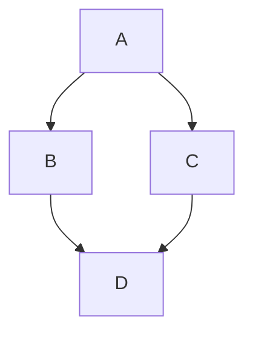



- プラン: Free、Premium、Ultimate
- 提供形態: GitLab.com、GitLab Self-Managed、GitLab Dedicated



GitLabは[`gitlab-markup`](https://gitlab.com/gitlab-org/gitlab-markup) gemを使用し、それが[`org-ruby`](https://github.com/wallyqs/org-ruby) gemを使用してOrgモードのコンテンツをHTMLに変換します。Orgモードの構文の完全な参照については、[Org manual](https://orgmode.org/manuals.html)を参照してください。

Orgモードは以下の領域で使用できます:

- リポジトリ内のOrgモードドキュメント（`.org`）
- スニペットファイルに`.org`拡張子が付いている場合のスニペット
- Wikiページ

## 見出し {#headings}

先頭のアスタリスク（`*`）は、見出し1から6としてレンダリングされます。

```org
* Heading 1
** Heading 2
*** Heading 3
**** Heading 4
***** Heading 5
****** Heading 6
```

`#+TITLE:`は、ページ上部のH1見出しとしてレンダリングされます:

```org
#+TITLE: Welcome to Org-mode
```

### 見出しアンカー {#heading-anchors}

GitLabはすべてのOrgモード見出しに自動的にアンカーを追加するため、それにリンクできます。

見出しにカーソルを合わせると、そのアンカーへのリンクが表示されるため、見出しへのリンクをコピーして他の場所で簡単に使用できます。

アンカーは、次のルールに従って見出しの内容から生成されます。

1. すべてのテキストは小文字に変換されます。
1. 文字、数字、ハイフン、アンダースコア以外はすべて削除されます。
1. すべてのスペースはハイフンに変換されます。
1. 同じアンカーを持つ見出しがすでに生成されている場合、1から始まる一意の連番が付加されます。

例: 

<!--
Translation note: DO NOT TRANSLATE this example.
The example must stay untranslated to stay in sync with the example anchors.
-->

```org
* This heading has spaces in it
** This heading has an accent in it: Café
** This heading has Unicode in it: 日本語
** This heading has spaces in it
*** This heading has spaces in it
** This heading has 3.5 in it (& parentheses)
** This heading has  multiple spaces and - hyphens_and_underscores
```

次の見出しアンカーが生成されます:

1. `#this-heading-has-spaces-in-it`
1. `#this-heading-has-an-accent-in-it-café`
1. `#this-heading-has-unicode-in-it-日本語`
1. `#this-heading-has-spaces-in-it-1`
1. `#this-heading-has-spaces-in-it-2`
1. `#this-heading-has-35-in-it--parentheses`
1. `#this-heading-has--multiple-spaces-and---hyphens_and_underscores`

スニペットでは、複数のファイル間でアンカーが重複しないように、ファイル名から生成したプレフィックスも見出しアンカーに付加されます。たとえば、`README.org`という名前のファイルにある`* TL;DR`見出しには、`#tldr`ではなく`#readme-tldr`というアンカーが設定されます。

## リスト {#lists}

Orgモードは、順序なしリスト、順序付きリスト、説明リスト、およびネストされたリストをサポートしています。

### 順序なしリスト {#unordered-lists}

ハイフン（`-`）またはプラス記号（`+`）は、順序なしリストを作成します:

```org
- Item one
- Item two
  - Nested item
```

```org
+ Item one
+ Item two
  + Nested item
```

レンダリングすると、両方の例は次のようになります:

> - 項目1
> - 項目2
>   - ネストされた項目

### 順序付きリスト {#ordered-lists}

数字の後にピリオド（`.`）または閉じ括弧（`)`）を続けると、順序付きリストが作成されます:

```org
1. First item
2. Second item
   1. Nested item
```

```org
1) First item
2) Second item
   1) Nested item
```

レンダリングすると、両方の例は次のようになります:

> 1. 最初の項目
> 1. 2番目の項目
>    1. ネストされた項目

### 説明リスト {#description-lists}

```org
- term1 :: Definition of term one
- term2 :: Definition of term two
```

レンダリングすると、この例は次のように表示されます。

> term1: 用語1の定義
>
> term2: 用語2の定義

## チェックボックス {#checkboxes}

リストマーカーの後の`[ ]`、`[X]`、および`[-]`は、チェックボックス入力要素としてレンダリングされます。`[-]`（部分的にチェック済み）は、不確定なチェックボックスとしてレンダリングされます:

<!--
Translation note: DO NOT TRANSLATE this example.
The example must stay untranslated to stay in sync with the image.
-->

```org
- [-] Prepare release
  - [X] Update changelog
  - [ ] Review merge requests
```

レンダリングすると、この例は次のように表示されます。


チェックボックスは順序付きリストでも機能します:

<!--
Translation note: DO NOT TRANSLATE this example.
The example must stay untranslated to stay in sync with the image.
-->

```org
1. [-] Prepare release
   1. [X] Update changelog
   2. [ ] Review merge requests
```

レンダリングすると、この例は次のように表示されます。


## テーブル {#tables}

パイプ（`|`）はテーブルを作成します。ダッシュ（`-`）とプラス記号（`+`）で作られた区切り行は、その上の行をテーブルヘッダーにします:

```org
| Item  | Unit price ($) | Quantity | Subtotal ($) |
|-------+----------------+----------+--------------|
| Eggs  |              3 |        2 |            6 |
| Milk  |              2 |        1 |            2 |
| Bread |              1 |        3 |            3 |
|-------+----------------+----------+--------------|
| Total |                |          |           11 |
#+TBLFM: $>=$2*$3::@>$>=vsum(@I..@II)
```

レンダリングすると、この例は次のように表示されます。

> | 項目  | 単価（$） | 数量 | 小計（$） |
> |-------|----------------|----------|--------------|
> | 卵  | 3              | 2        | 6            |
> | 牛乳  | 2              | 1        | 2            |
> | パン | 1              | 3        | 3            |
> | 合計 |                |          | 11           |

## リンク {#links}

リンクは複数の方法で作成できます。

```org
- This line shows an [[https://example.com][inline-style link]]
- This line shows a [[./permissions.md][link to a file in the same directory]]
- This line shows a [[../_index.md][relative link to a file one directory higher]]
- This line links to a [[#headings][heading on the same page, using a `#` and the heading anchor]]
```

レンダリングすると、この例は次のように表示されます。

> - この行は[インラインスタイルのリンク](https://example.com)を示しています
> - この行は、[同じディレクトリ内のファイルへのリンク](permissions.md)を示します。
> - この行は[1つ上のディレクトリにあるファイルへの相対リンク](../_index.md)を示しています
> - この行は、[同じページの見出しへのリンクであり、`#`と見出しアンカーを使用しています](#headings)。

### URLの自動リンク {#url-auto-linking}

テキストに入力したほとんどすべてのURLは自動的にリンクされます。

```org
See https://example.com for details.
```

レンダリングすると、この例は次のように表示されます。

> 詳細については、<https://example.com>を参照してください。

## 強調 {#emphasis}

| スタイル                           | 出力                                |
|---------------------------------|---------------------------------------|
| `*bold*`                        | **bold**                              |
| `/italic/`                      | *斜体*                              |
| `+strikethrough+`               | ~~取り消し線~~                     |
| `=verbatim=`                    | `verbatim`                            |
| `~code~`                        | `code`                                |
| `This is a ^{superscript} text` | これは<sup>上付き文字</sup>です |
| `This is a _{subscript} text`   | これは<sub>下付き文字</sub>です   |

## 画像 {#images}

インラインで画像を埋め込む説明テキストのない画像ファイルへのリンク:

```org
[[img/markdown_logo_v17_11.png]]
```

レンダリングすると、この例は次のように表示されます。


## 罫線 {#horizontal-rules}

5つ以上の連続するハイフン（`-`）は、罫線を作成します:

```org
Paragraph before.

-----

Paragraph after.
```

レンダリングすると、この例は次のように表示されます。

> 前の段落。
>
> ---
>
> 後の段落。

## コメント {#comments}

`#`で始まり、その後にスペースが続く行はレンダリングされません:

```org
Visible before.

# This line is a comment and isn't rendered.

Visible after.
```

レンダリングすると、この例は次のように表示されます。

> ブロックの前に表示。
>
> ブロックの後に表示。

`#+BEGIN_COMMENT`と`#+END_COMMENT`の間のコンテンツはレンダリングされません:

```org
Visible before the block.

#+BEGIN_COMMENT
This entire block is a comment.
None of these lines are rendered.
#+END_COMMENT

Visible after the block.
```

レンダリングすると、この例は次のように表示されます。

> ブロックの前に表示されます。
>
> ブロックの後に表示されます。

見出しマーカーの直後に`COMMENT`でマークされた見出し、およびその下にネストされたすべての内容はレンダリングされません:

```org
* Visible heading

Some visible text.

* COMMENT Hidden heading

This text isn't rendered.

** Nested under hidden heading

This text isn't rendered either.

* Another visible heading
```

レンダリングされた出力には、`Visible heading`と`Another visible heading`、およびそれらの間のテキストのみが表示されます。

## テキストブロック {#text-blocks}

`#+BEGIN_QUOTE`と`#+END_QUOTE`は引用ブロックを作成します:

```org
#+BEGIN_QUOTE
Everything should be made as simple as possible,
but not any simpler ---Albert Einstein
#+END_QUOTE
```

レンダリングすると、この例は次のように表示されます。

> > すべてを可能な限りシンプルにすべきだが、それ以上にシンプルにしてはならない —アルバートアインシュタイン

`#+BEGIN_EXAMPLE`と`#+END_EXAMPLE`は、整形済みテキストブロックを作成します:

```org
#+BEGIN_EXAMPLE
Here is an example.
#+END_EXAMPLE
```

レンダリングすると、この例は次のように表示されます。

> ```plaintext
> Here is an example.
> ```

コロン（`:`）とスペースも整形済みテキストブロックを作成します:

```org
: Here is an example.
```

レンダリングすると、この例は次のように表示されます。

> ```plaintext
> Here is an example.
> ```

## ソースコードブロック {#source-code-blocks}

`#+BEGIN_SRC`と`#+END_SRC`は、言語名で構文ハイライトされたコードブロックを作成します:

```org
#+BEGIN_SRC python
import requests
data = requests.get("https://jsonplaceholder.typicode.com/users/1").json()
#+END_SRC
```

レンダリングすると、この例は次のように表示されます。

> ```python
> import requests
> data = requests.get("https://jsonplaceholder.typicode.com/users/1").json()
> ```

GitLabは、構文ハイライトに[Rouge Ruby library](https://github.com/rouge-ruby/rouge)を使用しています。サポートされている言語のリストについては、[Rouge project Wiki](https://github.com/rouge-ruby/rouge/wiki/List-of-supported-languages-and-lexers)を参照してください。

ブロックヘッダーに`:exports both`を追加すると、レンダリングされた出力にソースブロックの実行結果（`#+RESULTS:`）が含まれます:

```org
#+BEGIN_SRC python :exports both :results output code
import requests
data = requests.get("https://jsonplaceholder.typicode.com/users/1").json()
print([data["username"], data["email"]])
#+END_SRC

#+RESULTS:
#+begin_src python
['Bret', 'Sincere@april.biz']
#+end_src
```

レンダリングすると、この例は次のように表示されます。

> ```python
> import requests
> data = requests.get("https://jsonplaceholder.typicode.com/users/1").json()
> print([data["username"], data["email"]])
> ```
>
> ```python
> ['Bret', 'Sincere@april.biz']
> ```

## 図表とフローチャート {#diagrams-and-flowcharts}

コードブロック内のテキストから、[GitLab Flavored Markdown](markdown.md#diagrams-and-flowcharts)と同様に図を生成できます。

### Mermaid {#mermaid}

```org
#+BEGIN_SRC mermaid
graph TD;
    A-->B;
    A-->C;
    B-->D;
    C-->D;
#+END_SRC
```

レンダリングすると、この例は次のように表示されます。



### PlantUML {#plantuml}

PlantUMLインテグレーションはGitLab.comで有効になっています。GitLab Self-ManagedでPlantUMLを利用可能にするには、GitLab管理者が[それを有効にする](../administration/integration/plantuml.md)必要があります。

```org
#+BEGIN_SRC plantuml
Bob -> Alice : hello
Alice -> Bob : hi
#+END_SRC
```

## 数式 {#math-equations}

言語が`math`として宣言されたソースコードブロックに記述された数式は、[KaTeX](https://github.com/KaTeX/KaTeX)でレンダリングされます。KaTeXはLaTeXの[一部の機能](https://katex.org/docs/supported.html)のみをサポートしています。

```org
#+BEGIN_SRC math
\left( \sum_{k=1}^n a_k b_k \right)^2 \leq \left( \sum_{k=1}^n a_k^2 \right) \left( \sum_{k=1}^n b_k^2 \right)
#+END_SRC
```

レンダリングすると、この例は次のように表示されます。


## GitLab Query Language（GLQL） {#gitlab-query-language-glql}

言語が`glql`として宣言されたソースコードブロックは、[GitLab Query Language（GLQL）](glql/_index.md)ビューを埋め込みます:

<!--
Translation note: DO NOT TRANSLATE this example.
The example must stay untranslated to stay in sync with the image.
-->

```yaml
#+BEGIN_SRC glql
display: table
title: GLQL table 🎉
description: This view lists my open issues
fields: title, state, health, epic, milestone, weight, updated
limit: 5
query: type = Issue AND group = "gitlab-org" AND assignee = currentUser() AND state = opened
#+END_SRC
```

レンダリングすると、この例は次のように表示されます。


