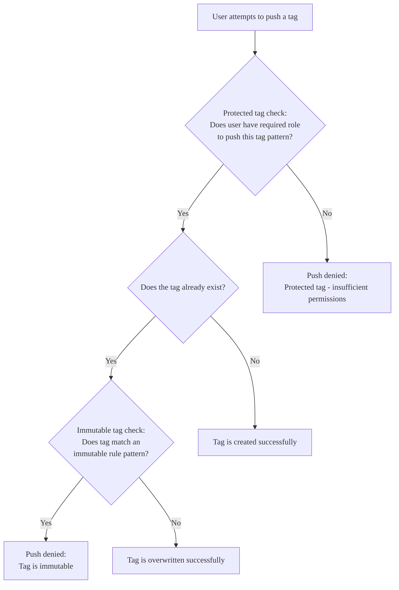



- プラン: Ultimate
- 提供形態: GitLab.com、GitLab Self-Managed
- ステータス: ベータ





- GitLab 18.1で`container_registry_immutable_tags`という[フラグ](../../../administration/feature_flags/_index.md)を使い、[実験](../../../policy/development_stages_support.md)という形で[導入](https://gitlab.com/gitlab-org/gitlab/-/issues/523276)されました。デフォルトでは無効になっています。
- GitLab 18.2で[GitLab.com](https://gitlab.com/gitlab-org/gitlab/-/issues/523276)で有効になりました。実験からベータに変更されました。機能フラグ`container_registry_immutable_tags`は削除されました。



イミュータブルタグを使用すると、プロジェクトでコンテナタグが更新または削除されるのを防ぐことができます。

デフォルトでは、少なくともデベロッパーロールを持つユーザーは、すべてのプロジェクトコンテナリポジトリでイメージタグをプッシュおよび削除できます。タグの不変性ルールを使用すると、次のことができます:

- 重要なイメージタグの変更を防ぎ、悪意のある変更や偶発的な変更のリスクを軽減します。
- プロジェクトごとに最大5つの保護ルールを作成します。
- プロジェクト内のすべてのコンテナリポジトリに保護ルールを適用します。

タグは、少なくとも1つの不変性保護ルールがタグの名前と一致する場合にイミュータブルになります。複数のルールが一致する場合、最も制限の厳しいルールが適用されます。

イミュータブルタグのルール:

- 作成のみ可能で、更新はできません
- [クリーンアップポリシー](reduce_container_registry_storage.md#cleanup-policy)では削除できません。

## 保護タグとの比較 {#comparison-with-protected-tags}

[保護タグ](protected_container_tags.md)とイミュータブルタグはいずれもイメージの整合性を維持しますが、目的が異なります。

保護タグは、ロールに基づいて特定のタグを作成、更新、または削除できるユーザーを制限します。タグの不変性により、タグが作成されると、誰も更新または削除できなくなります。

以下の図は、イメージのプッシュのコンテキストで保護ルールがどのように評価されるかを示しています:

### シナリオ例 {#example-scenarios}

これらのルールを持つプロジェクトの場合:

- 保護タグのルール: `v.*`パターンには、少なくともメンテナーロールが必要です。
- イミュータブルタグのルール: `v\d+\.\d+\.\d+`パターンは、セマンティックバージョンタグを保護します。

| ユーザーロール | アクション | 保護タグのチェック | イミュータブルタグのチェック | 結果 |
|-----------|--------|-------------------|-------------------|---------|
| デベロッパー | 新しいタグプッシュ`v1.0.0` | 拒否 | 評価されません | プッシュは拒否されました。必要なロールがありません。 |
| メンテナー | 新しいタグプッシュ`v1.0.0` | 許可 | 評価されません | タグが作成されました。 |
| メンテナー | 既存のタグプッシュを上書きします`v1.0.0` | 許可 | 拒否 | プッシュは拒否されました。タグはイミュータブルです。 |
| メンテナー | 新しいタグプッシュ`v-beta` | 許可 | 評価されません | タグが作成されました。 |

## 前提要件 {#prerequisites}

イミュータブルコンテナタグを使用するには、コンテナレジストリが利用可能であることを確認してください:

- GitLab.comでは、コンテナレジストリはデフォルトで有効になっています。
- GitLabセルフマネージドでは、[メタデータデータベースを有効](../../../administration/packages/container_registry_metadata_database.md)にします。

## イミュータブルルールを作成する {#create-an-immutable-rule}

前提要件: 

- オーナーロールを持っている必要があります。

イミュータブルルールを作成するには:

1. 左側のサイドバーで、**検索または移動先**を選択して、プロジェクトを見つけます。
1. **設定** > **パッケージとレジストリ**を選択します。
1. **コンテナレジストリ**を展開します。
1. **Protected container tags**（保護されたコンテナタグ）で、**保護ルールを追加する**を選択します。
1. **保護タイプ**で、**変更不可**を選択します。
1. **一致するタグに対して変更不可のルールを適用する**に、[RE2構文](https://github.com/google/re2/wiki/Syntax)を使用して正規表現パターンを入力します。パターンは100文字を超えてはなりません。詳しくは、[正規表現パターンの例](#regex-pattern-examples)をご覧ください。
1. **ルールを追加する**を選択します。

イミュータブルルールが作成され、一致するタグが保護されます。

## 正規表現パターンの例 {#regex-pattern-examples}

コンテナタグを保護するために使用できるパターンの例:

| パターン           | 説明 |
|-------------------|-------------|
| `.*`              | すべてのタグを保護します。 |
| `^v.*`            | 「v」で始まるタグを保護します（`v1.0.0`や`v2.1.0-rc1`など）。 |
| `\d+\.\d+\.\d+`   | セマンティックバージョンタグを保護します（`1.0.0`や`2.1.0`など）。 |
| `^latest$`        | `latest`タグを保護します。 |
| `.*-stable$`      | 「-stable」で終わるタグを保護します（`1.0-stable`や`main-stable`など）。 |
| `stable\|release` | 「stable」または「リリース」を含むタグを保護します（`1.0-stable`など）。 |

## イミュータブルルールの削除 {#delete-an-immutable-rule}

前提要件: 

- オーナーロールを持っている必要があります。

イミュータブルルールを削除するには:

1. 左側のサイドバーで、**検索または移動先**を選択して、プロジェクトを見つけます。
1. **設定** > **パッケージとレジストリ**を選択します。
1. **コンテナレジストリ**を展開します。
1. **Protected container tags**（保護されたコンテナタグ）で、削除するイミュータブルルールの横にある**削除**（）を選択します。
1. 確認プロンプトが表示されたら、**削除**を選択します。

イミュータブルルールが削除され、一致するタグは保護されなくなります。

## 伝播遅延 {#propagation-delay}

ルール変更は、サービス間で伝播するためにJSON Webトークンに依存します。その結果、保護ルールおよびユーザーアクセスロールへの変更は、現在のJSON Webトークンの有効期限が切れて初めて有効になる場合があります。遅延は、[設定されたトークンの有効期間](../../../administration/packages/container_registry.md#increase-token-duration)に相当します:

- デフォルト: 5分
- GitLab.com: [15分](../../gitlab_com/_index.md#container-registry)

ほとんどのコンテナレジストリクライアント（Docker、GitLab UI、APIなど）は、操作ごとに新しいトークンをリクエストしますが、カスタムクライアントはトークンをその完全な有効期間保持する場合があります。

## イメージマニフェストの削除 {#image-manifest-deletions}

GitLab UIとAPIは、イメージマニフェストの直接削除をサポートしていません。コンテナレジストリAPIコールを直接使用すると、マニフェストを削除すると、関連付けられているすべてのタグに影響します。

タグの保護を確実にするために、マニフェストの直接削除リクエストは、対応するプロジェクトにイミュータブルタグのルールがない場合にのみ許可されます。

この制限は、ルールパターンがコンテナイメージタグと一致するかどうかに関係なく適用されます。
