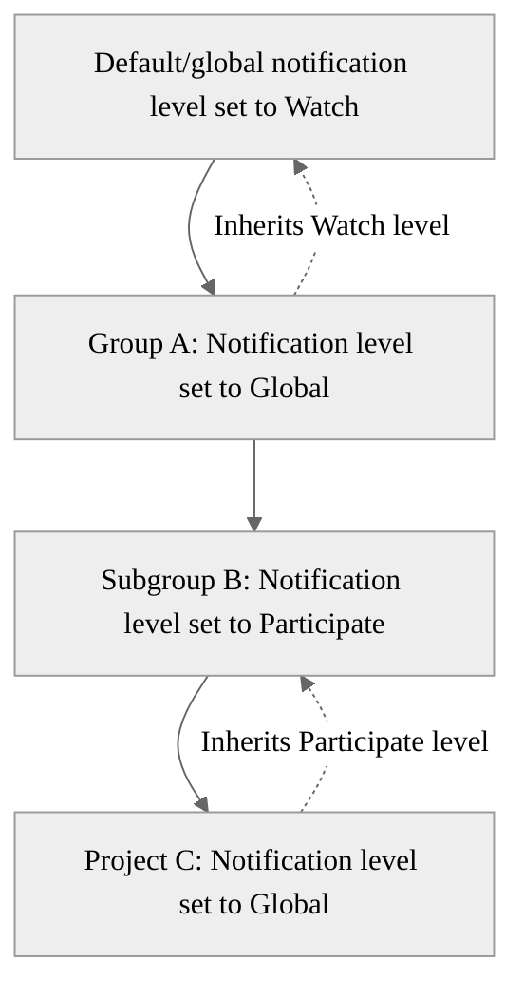



- プラン: Free、Premium、Ultimate
- 提供形態: GitLab.com、GitLab Self-Managed、GitLab Dedicated





- 強化されたメールスタイリングは、GitLab 14.9で`enhanced_notify_css`[機能フラグ](../../administration/feature_flags/_index.md)とともに[導入](https://gitlab.com/gitlab-org/gitlab/-/merge_requests/78604)されました。デフォルトでは無効になっています。
- 強化されたメールスタイリングは、GitLab 14.9の[GitLab.comで有効になりました](https://gitlab.com/gitlab-org/gitlab/-/issues/355907)。
- 強化されたメールスタイリングは、GitLab 15.0の[GitLab Self-Managedで有効になりました](https://gitlab.com/gitlab-org/gitlab/-/issues/355907)。
- GitLab 18.3で、強化されたメールのスタイリングが[一般的に利用可能](https://gitlab.com/gitlab-org/gitlab/-/issues/355907)になりました。機能フラグ`enhanced_notify_css`は削除されました。
- プロダクトマーケティングメールは、GitLab 16.6で[削除されました](https://gitlab.com/gitlab-org/gitlab/-/issues/418137)。



メール通知によりGitLabで何が起こっているかを常に把握できます。イシュー、マージリクエスト、エピック、およびデザインのアクティビティーに関する更新を受信できます。

GitLab管理者がユーザーにメッセージを送信するために使用できるツールについては、[GitLabからのメール](../../administration/email_from_gitlab.md)をお読みください。

GitLab 17.2以降では、通知は、24時間ごとにプロジェクト/グループまたはユーザー単位で[レート制限](../../security/rate_limits.md#notification-emails)されます。

## 通知を受け取るユーザー {#who-receives-notifications}

イシュー、マージリクエスト、またはエピックで通知が有効になっている場合、GitLabはそこで発生するアクションを通知します。

次のいずれかの理由で通知を受信する場合があります:

- イシュー、マージリクエスト、エピック、またはデザインに参加している。コメントまたは編集を行うか、誰かがあなたに<sup>1</sup>メンションすると、参加者になります。
- [イシュー、マージリクエスト、またはエピックで通知を有効にしている](#notifications-on-issues-merge-requests-and-epics)。
- [プロジェクト](#change-level-of-project-notifications)または[グループ](#group-notifications)の通知を設定している。
- パイプラインメール[インテグレーション](../project/integrations/_index.md)を介して、グループまたはプロジェクトのパイプライン通知をサブスクライブしている。

GitLabは、次の場合に通知を送信しません:

- アカウントがプロジェクトボットである。
- アカウントがデフォルトのメールアドレスを持つサービスアカウントである。
- アカウントがブロック（BAN）または非アクティブ化されている。
- [コメントが編集され、ユーザーメンションが含まれている](../discussions/_index.md#edit-a-comment-to-add-a-mention)。
- 管理者が通知をブロックしている。

## グローバル通知設定 {#global-notification-settings}

グローバル通知設定は、プロジェクトまたはグループに対して別の値を指定しない限り、デフォルトの設定になります。たとえば、特定のプロジェクト内のすべてのアクティビティーについて通知を受けたい場合があります。他のプロジェクトでは、名前でメンションされた場合のみに通知を受けたいと考えています。

これらの通知設定は、自分のみに適用されます。他の人が受け取る通知には影響しません。

### 通知設定の編集 {#edit-notification-settings}

通知設定を編集するには:

1. 左側のサイドバーで、自分のアバターを選択します。
1. **設定**を選択します。
1. 左側のサイドバーで、**通知**を選択します。
1. **グローバル通知メール**で、通知の送信先メールアドレスを入力します。デフォルトでは、プライマリメールアドレスになります。
1. **グローバル通知レベル**で、デフォルトの[通知レベル](#notification-levels)を選択して、通知に適用します。
1. **自身のアクティビティーに関する通知を受信する**チェックボックスをオンにすると、自分のアクティビティーに関する通知を受信できます。デフォルトでは選択されていません。

### 通知レベル {#notification-levels}

プロジェクトとグループごとに、次のいずれかのレベルを選択できます:

| レベル       | 説明 |
| ----------- | ----------- |
| グローバル      | デフォルトのグローバル設定が適用されます。 |
| すべて通知       | [ほとんどのアクティビティー](#events-not-included-in-the-watch-level)に関する通知を受信します。 |
| 参加 | 参加したスレッドに関する通知を受信します。 |
| メンション時  | コメントで[メンション](../discussions/_index.md#mentions)された場合に通知を受信します。 |
| 無効    | 通知を受信しません。 |
| カスタム      | 選択したイベントと参加したスレッドに関する通知を受信します。 |

### 通知スコープ {#notification-scope}

プロジェクトおよびグループごとに異なる通知レベルを選択することで、通知のスコープを調整できます。

通知スコープは、最も広範なレベルから最も具体的なレベルに適用されます:

- アクティビティーが発生したプロジェクトまたはグループの通知レベルを選択していない場合、グローバルまたは_デフォルト_の通知レベルが適用されます。
- グループ設定は、デフォルト設定よりも優先されます。
- プロジェクト設定は、グループ設定よりも優先されます。

プロジェクトまたはサブグループに対して通知レベルを**グローバル**設定しても、グローバル通知設定は直接継承されません。代わりに、グローバル通知レベルよりも階層が高い設定済み通知レベルを次の順序で継承します:

1. プロジェクト設定。
1. 親グループ設定。
1. 祖先グループ設定（階層を上がります）。
1. 最終的なフォールバック設定としてのグローバル通知の設定。

たとえば、デフォルトのグローバル通知設定を**すべて通知**に設定し、グループとプロジェクトの通知レベルを次のように設定します:



プロジェクトCは、サブグループBから**参加**通知レベルを継承します。グローバル通知設定から**すべて通知**通知レベルを継承しません。

### グループ通知 {#group-notifications}

グループごとに、通知レベルとメールアドレスを選択できます。

#### グループ通知のレベルを変更 {#change-level-of-group-notifications}

グループの通知レベルを選択するには、次のいずれかの方法を使用します:

1. 左側のサイドバーで、自分のアバターを選択します。
1. **設定**を選択します。
1. 左側のサイドバーで、**通知**を選択します。
1. **グループ**セクションでグループを見つけます。
1. 目的の[通知レベル](#notification-levels)を選択します。

または:

1. 左側のサイドバーで、**検索または移動先**を選択して、グループを見つけます。
1. ベルアイコン（）の横にある通知ドロップダウンリストを選択します。
1. 目的の[通知レベル](#notification-levels)を選択します。

#### グループ通知に使用されるメールアドレスを変更 {#change-email-address-used-for-group-notifications}

自分が所属するグループごとに、通知を受信するメールアドレスを選択できます。たとえば、フリーランスで仕事をしている場合、クライアントのプロジェクトに関するメールを個別に管理したいときに、グループ通知を使用できます。

1. 左側のサイドバーで、自分のアバターを選択します。
1. **設定**を選択します。
1. 左側のサイドバーで、**通知**を選択します。
1. **グループ**セクションでグループを見つけます。
1. 目的のメールアドレスを選択します。

### プロジェクト通知のレベルを変更 {#change-level-of-project-notifications}

最新情報を常に把握できるように、プロジェクトごとに通知レベルを選択できます。

プロジェクトの通知レベルを選択するには、次のいずれかの方法を使用します:

1. 左側のサイドバーで、自分のアバターを選択します。
1. **設定**を選択します。
1. 左側のサイドバーで、**通知**を選択します。
1. **プロジェクト**セクションでプロジェクトを見つけます。
1. 目的の[通知レベル](#notification-levels)を選択します。

または:

1. 左側のサイドバーで、**検索または移動先**を選択して、プロジェクトを見つけます。
1. ベルアイコン（）の横にある通知ドロップダウンリストを選択します。
1. 目的の[通知レベル](#notification-levels)を選択します。

<i class="fa fa-youtube-play youtube" aria-hidden="true"></i>新しいリリースが利用可能になったときに通知を受け取る方法については、[リリースの通知](https://www.youtube.com/watch?v=qyeNkGgqmH4)をご覧ください。

## 通知イベント {#notification-events}

ユーザーには、次のイベントが通知されます:

<!-- The table is sorted first by recipient, then alphabetically. -->

| イベント                                    | 送信先         | 設定レベル                                                                                                                          |
|------------------------------------------|-----------------|-----------------------------------------------------------------------------------------------------------------------------------------|
| 新しいリリース                              | プロジェクトメンバー | カスタム通知。                                                                                                                    |
| プロジェクトが移動した                            | プロジェクトメンバー | 無効以外。                                                                                                                |
| メールアドレスが変更された                            | ユーザー            | 常に送信されるセキュリティメール。                                                                                                            |
| グループアクセスレベルが変更された               | ユーザー            | ユーザーグループのアクセスレベルが変更された場合に送信されます。                                                                                           |
| 新しいメールアドレスが追加された                  | ユーザー            | プライマリメールアドレスに送信されるセキュリティメール。                                                                                          |
| 新しいメールアドレスが追加された                  | ユーザー            | 新しく追加されたメールアドレスに送信されるセキュリティメール。                                                                                      |
| 新しいSAML/SCIMユーザーがプロビジョニングされた           | ユーザー            | ユーザーがSAML/SCIMを介してプロビジョニングされた場合に送信されます。                                                                                      |
| 新しいSSHキーが追加された                        | ユーザー            | 常に送信されるセキュリティメール。                                                                                                            |
| 新しいユーザーが作成された                         | ユーザー            | ユーザーの作成時に送信されます。OmniAuth（LDAP）は除きます。                                                                                      |
| パスワードが変更された                         | ユーザー            | ユーザーが自分のパスワードを変更すると常に送信されるセキュリティメール。                                                                       |
| 管理者によってパスワードが変更された        | ユーザー            | 管理者が別のユーザーのパスワードを変更すると常に送信されるセキュリティメール。                                                 |
| パーソナルアクセストークンの有効期限が近づいている     | ユーザー            | 常に送信されるセキュリティメール。                                                                                                            |
| パーソナルアクセストークンが作成された | ユーザー            | 常に送信されるセキュリティメール。                                                                                                            |
| パーソナルアクセストークンの有効期限が切れた      | ユーザー            | 常に送信されるセキュリティメール。                                                                                                            |
| パーソナルアクセストークンが失効した   | ユーザー            | 常に送信されるセキュリティメール。GitLab 15.5で[導入](https://gitlab.com/gitlab-org/gitlab/-/merge_requests/98911)されました。                 |
| プロジェクトのデプロイトークンの有効期限が近づいています      | プロジェクトオーナーとメンテナー | 常に送信されるセキュリティメール。GitLab 18.3で[導入](https://gitlab.com/gitlab-org/gitlab/-/issues/512197)されました。           |
| パーソナルアクセストークンがローテーションされました   | ユーザー            | 常に送信されるセキュリティメール。GitLab 18.3で[導入](https://gitlab.com/gitlab-org/gitlab/-/merge_requests/199360)されました。                                                                                                           |
| グループアクセストークンの有効期限が近づいている        | 直接グループオーナー | 常に送信されるセキュリティメール。GitLab 16.4で[導入されました](https://gitlab.com/gitlab-org/gitlab/-/issues/367705)。                 |
| プロジェクトアクセストークンの有効期限が近づいている      | 直接プロジェクトオーナーとメンテナー | 常に送信されるセキュリティメール。GitLab 16.4で[導入されました](https://gitlab.com/gitlab-org/gitlab/-/issues/367706)。                 |
| プロジェクトアクセスレベルが変更された             | ユーザー            | ユーザープロジェクトのアクセスレベルが変更された場合に送信されます。                                                                                         |
| SSHキーの有効期限が切れた                      | ユーザー            | 常に送信されるセキュリティメール。                                                                                                            |
| 2要素認証が無効       | ユーザー            | 常に送信されるセキュリティメール。                                                                                                            |
| ユーザーがグループに追加された                      | ユーザー            | ユーザーがグループに追加されたときに送信されます。                                                                                                       |
| ユーザーがプロジェクトに追加された                    | ユーザー            | ユーザーがプロジェクトに追加されたときに送信されます。                                                                                                     |
| グループアクセスの有効期限が切れた                     | グループメンバー   | グループへのユーザーのアクセス権が7日後に期限切れになる場合に送信されます。_GitLab 16.3で[導入されました](https://gitlab.com/gitlab-org/gitlab/-/issues/12704)。_                                                                                 |
| プロジェクトアクセスの有効期限が切れた                   | プロジェクトメンバー | プロジェクトへのユーザーのアクセス権が7日後に期限切れになる場合に送信されます。_GitLab 16.3で[導入されました](https://gitlab.com/gitlab-org/gitlab/-/issues/12704)。_                                                                                                   |
| グループの削除がスケジュールされた             | グループオーナー    | グループの削除がスケジュールされている場合に送信されます。_GitLab 17.11で[導入](https://gitlab.com/gitlab-org/gitlab/-/issues/522883)されました_。         |
| プロジェクトの削除がスケジュールされた           | プロジェクトオーナー  | プロジェクトの削除がスケジュールされている場合に送信されます。_GitLab 17.11で[導入](https://gitlab.com/gitlab-org/gitlab/-/issues/522883)されました_。          |

GitLab Self-ManagedおよびGitLab Dedicatedで`always sent`メールを無効にするには、個々の[バックグラウンドジョブ](../../administration/maintenance_mode/_index.md#background-jobs)を無効にする必要があります。例:

- `personal_access_tokens_expiring_worker`
- `personal_access_tokens_expired_notification_worker`
- `ssh_keys_expiring_soon_notification_worker`
- `ssh_keys_expired_notification_worker`
- `send_recurring_notifications_worker`
- `deploy_tokens_expiring_worker`
- `members_expiring_worker`

バックグラウンドジョブを無効にするには、管理者である必要があります。

## イシュー、マージリクエスト、およびエピックに関する通知 {#notifications-on-issues-merge-requests-and-epics}

イシュー、マージリクエスト、およびエピックで発生するイベントに関する通知も受信します。

### イシュー、マージリクエスト、およびエピックに関する通知を受信するユーザー {#who-receives-notifications-on-issues-merge-requests-and-epics}

イシュー、マージリクエスト、およびエピックでは、ほとんどのイベントについて、通知は以下に送信されます:

- 参加者:
  - 作成者と担当者。
  - コメントの作成者。
  - タイトルまたは説明でユーザー名で[メンション](../discussions/_index.md#mentions)されたユーザー。
  - 通知レベルが「参加」以上のコメントでユーザー名でメンションされたユーザー。
- ウォッチャー: 通知レベルが「すべて通知」のユーザー（[いくつかの例外がある](#events-not-included-in-the-watch-level)）。
- サブスクライバー: 通知に手動でサブスクライブしたすべてのユーザー。
- カスタム: 通知レベルが「カスタム」で、適切なタイプのイベントの通知をオンにしたユーザー。

アクションを必要としない通知の数を最小限に抑えるため、適格な承認者には、プロジェクト内のすべてのアクティビティーについて通知されません。

すべてのイベントに関する通知を受け取るには、ユーザー通知の設定を**カスタム**に変更し、すべてのオプションを選択します。

#### 「すべて通知」レベルに含まれないイベント {#events-not-included-in-the-watch-level}

通知レベルを**すべて通知**に設定すると、ほとんどすべてのイベントについて通知されますが、次の例外があります:

- 誰かがマージリクエストにプッシュする。
- イシューが翌日に期限を迎える。
- パイプラインが成功する。
- 承認可能なマージリクエストが作成される。

イシュー[501083](https://gitlab.com/gitlab-org/gitlab/-/issues/501083)は、**すべて通知**レベルへのこれらのイベントの追加を追跡します。

### イシュー、マージリクエスト、エピックの通知設定を編集 {#edit-notification-settings-for-issues-merge-requests-and-epics}

イシュー、マージリクエスト、またはエピックの通知を切り替えるには、右側のサイドバーで、縦方向の省略記号（）を選択し、**通知**切替をオンまたはオフにします。

#### 通知の移動 {#moved-notifications}



- 提供形態: GitLab Self-Managed





- GitLab 16.5で`notifications_todos_buttons`[フラグ](../../administration/feature_flags/_index.md)とともに[導入](https://gitlab.com/gitlab-org/gitlab/-/merge_requests/132678)されました。デフォルトでは無効になっています。





この機能の利用可否は、機能フラグによって制御されます。詳細については、履歴を参照してください。この機能フラグを有効にすると、通知とTo Doアイテムのボタンがページ右上に移動します。



通知を**turn on**（オン）にすると、ディスカッションに参加していなくても、更新ごとに通知を受け取るようになります。エピックで通知をオンにしても、エピックにリンクされたイシューは自動的にサブスクライブされません。

通知を**turn off**（オフ）にすると、更新に関する通知の受信が停止されます。この切替をオフにすると、このイシュー、マージリクエスト、またはエピックに関連する更新のみからサブスクライブ解除されます。[GitLabからのすべてのメールをオプトアウトする方法](#opt-out-of-all-gitlab-emails)をご覧ください。

### イシュー、マージリクエスト、エピックに関する通知イベント {#notification-events-on-issues-merge-requests-and-epics}



- サービスアカウントのパイプラインの通知は、GitLab 18.1で[導入](https://gitlab.com/gitlab-org/gitlab/-/merge_requests/178740)されました。



次の表に、イシュー、マージリクエスト、およびエピックの通知を生成するイベントを示します:

<!-- For issue due timing source, see 'issue_due_scheduler_worker' in https://gitlab.com/gitlab-org/gitlab/-/blob/master/config/initializers/1_settings.rb -->

| タイプ | イベント | 送信先 |
|------|-------|---------|
| エピック | 完了 | サブスクライバーと参加者。 |
| エピック | 新規 | 説明でユーザー名でメンションされたすべてのユーザー（通知レベルが「メンション」以上）。 |
| エピック | 新しいメモ | 参加者、ウォッチャー、サブスクライバー、およびこのイベントが選択されたカスタム通知レベル。また、コメントでユーザー名でメンションされたすべてのユーザー（通知レベルが「メンション」以上）。 |
| エピック | 再開 | サブスクライバーと参加者。 |
| イシュー | 完了 | サブスクライバーと参加者。 |
| イシュー | 期限が明日に迫る。翌日が期限のオープンイシューについての通知は、サーバーのタイムゾーン（GitLab.comの場合はUTC）で午前0時50分に送信されます。 | 参加者と、このイベントが選択されたカスタム通知レベル。 |
| イシュー | マイルストーンが変更された | サブスクライバーと参加者。 |
| イシュー | マイルストーンが削除された | サブスクライバーと参加者。 |
| イシュー | 新規 | 説明でユーザー名でメンションされたすべてのユーザー（通知レベルが「メンション」以上）。 |
| イシュー | 新しいメモ | 参加者、ウォッチャー、サブスクライバー、およびこのイベントが選択されたカスタム通知レベル。また、コメントでユーザー名でメンションされたすべてのユーザー（通知レベルが「メンション」以上）。 |
| イシュー | タイトルまたは説明が変更された | ユーザー名による新しいメンション。 |
| イシュー | 再割り当てされた | 参加者、ウォッチャー、サブスクライバー、このイベントが選択されたカスタム通知レベル、および古い担当者。 |
| イシュー | 再開 | サブスクライバーと参加者。 |
| マージリクエスト | 完了 | サブスクライバーと参加者。 |
| マージリクエスト | 競合 | 作成者、およびマージリクエストを自動マージに設定したすべてのユーザー。 |
| マージリクエスト | [準備完了としてマークされた](../project/merge_requests/drafts.md) | ウォッチャーと参加者。 |
| マージリクエスト | マージされた | サブスクライバーと参加者。 |
| マージリクエスト | パイプラインが成功したときにマージされた | 作成者、参加者、ウォッチャー、サブスクライバー、およびこのイベントが選択されたカスタム通知レベル。作成者、ウォッチャー、およびサブスクライバーに対して、カスタム通知レベルは無視されます。 |
| マージリクエスト | マイルストーンが変更された | サブスクライバーと参加者。 |
| マージリクエスト | マイルストーンが削除された | サブスクライバーと参加者。 |
| マージリクエスト | 新規 | 説明でユーザー名でメンションされたすべてのユーザー（通知レベルが「メンション」以上）。 |
| マージリクエスト | 新しいメモ | 参加者、ウォッチャー、サブスクライバー、およびこのイベントが選択されたカスタム通知レベル。また、コメントでユーザー名でメンションされたすべてのユーザー（通知レベルが「メンション」以上）。 |
| マージリクエスト | プッシュされた | 参加者と、このイベントが選択されたカスタム通知レベル。 |
| マージリクエスト | 再割り当てされた | 参加者、ウォッチャー、サブスクライバー、このイベントが選択されたカスタム通知レベル、および古い担当者。 |
| マージリクエスト | レビューがリクエストされた | 参加者、ウォッチャー、サブスクライバー、このイベントが選択されたカスタム通知レベル、および古いレビュアー。 |
| マージリクエスト | 再開 | サブスクライバーと参加者。 |
| マージリクエスト | タイトルまたは説明が変更された | ユーザー名による新しいメンション。 |
| マージリクエスト | [承認可能な](../project/merge_requests/approvals/rules.md#eligible-approvers)マージリクエスが作成された | このイベントが選択されたカスタム通知レベル。GitLab 16.7で[導入](https://gitlab.com/gitlab-org/gitlab/-/issues/12855)されました。GitLab 17.11で名前が「承認者として追加」から[変更されました](https://gitlab.com/gitlab-org/gitlab/-/issues/465347)。 |
| パイプライン | 失敗した | パイプラインの作成者。 |
| パイプライン | 修正された | パイプラインの作成者。デフォルトでは有効になっています。 |
| パイプライン | 成功 | パイプラインの作成者（パイプラインの成功に対してカスタム通知レベルを持つ）。パイプラインが以前に失敗した場合、失敗後に最初に成功したパイプラインに対して「パイプラインが修正されました」というメッセージが送信され、その後、成功したパイプラインに対して「パイプラインが成功しました」というメッセージが送信されます。 |
| サービスアカウント別のパイプライン | 失敗した | サービスアカウントによってトリガーされた、失敗したパイプラインのカスタム通知レベル。 |
| サービスアカウント別のパイプライン | 修正された | サービスアカウントによってトリガーされた、修正されたパイプラインのカスタム通知レベル。 |
| サービスアカウント別のパイプライン | 成功 | サービスアカウントによってトリガーされた、成功したパイプラインのカスタム通知レベル。 |

デフォルトでは、自分が作成したイシュー、マージリクエスト、またはエピックに関する通知は受信しません。自分のイシューやマージリクエストなどで常に通知を受信するには、[自身のアクティビティーに関する通知を受信する](#global-notification-settings)をオンにします。

## 不明なサインインに関する通知 {#notifications-for-unknown-sign-ins}



- サインインしたユーザーのフルネームとユーザー名を一覧表示する機能は、GitLab 15.10で[導入](https://gitlab.com/gitlab-org/gitlab/-/issues/225183)されました。
- 地理的な場所は、GitLab 17.5で[追加](https://gitlab.com/gitlab-org/gitlab/-/issues/296128)されました。





この機能は、GitLab Self-Managedインスタンスでデフォルトで有効になっています。管理者は、UIの[サインインの制限](../../administration/settings/sign_in_restrictions.md#email-notification-for-unknown-sign-ins)セクションからこの機能を無効にできます。この機能は、GitLab.comで常に有効になっています。



ユーザーが以前に不明なIPアドレスまたはデバイスから正常にサインインすると、GitLabはメールでユーザーに通知します。このようにして、GitLabは潜在的に悪意のあるまたは不正なサインインをユーザーに事前に警告します。この通知メールには以下が含まれます:

- ホスト名。
- ユーザーの名前とユーザー名。
- IPアドレス。
- 地理的な場所。
- サインインの日時。

GitLabは、既知のサインインを識別するためにいくつかのメソッドを使用します。通知メールが送信されるには、すべてのメソッドが失敗する必要があります。

- 最終サインインIP: 現在のサインインIPアドレスは、最終サインインIPアドレスと照合されます。
- 現在のアクティブセッション: ユーザーが同じIPアドレスからの既存アクティブセッションを持っている場合。[アクティブセッション](active_sessions.md)を参照してください。
- Cookie: 正常なサインインの後、暗号化されたCookieがブラウザに保存されます。このCookieは、最後の正常なサインインから14日後に期限切れになるように設定されています。

## 誤った確認コードを使用したサインインの試行に関する通知 {#notifications-for-attempted-sign-ins-using-incorrect-verification-codes}



- GitLab 15.5で[導入されました](https://gitlab.com/gitlab-org/gitlab/-/issues/374740)。



GitLabは、誤った2要素認証（2FA）コードを使用してアカウントにサインインしようとする試みを検出した場合、メール通知を送信します。これにより、悪意のある第三者がユーザー名とパスワードにアクセスし、2FAをブルートフォース攻撃しようとしていることを検出できます。

## デザインに関する通知 {#notifications-on-designs}

誰かがデザインにコメントすると、参加者にメール通知が送信されます。

参加者は次のとおりです:

- デザインの作成者（異なる作成者が異なるバージョンのデザインをアップロードした場合、複数の人がいる可能性があります）。
- デザインに関するコメントの作成者。
- デザインに関するコメントで[メンション](../discussions/_index.md#mentions)されたすべてのユーザー。

## グループまたはプロジェクトのアクセス有効期限に関する通知 {#notifications-on-group-or-project-access-expiration}



- GitLab 16.3で[導入](https://gitlab.com/gitlab-org/gitlab/-/issues/12704)されました。



ユーザーのグループまたはプロジェクトへのアクセスが7日後に期限切れになる場合、GitLabはメール通知を送信します。これにより、グループまたはプロジェクトのメンバーは、必要に応じてアクセス期間を延長するように促されます。

## すべてのGitLabメールをオプトアウトする {#opt-out-of-all-gitlab-emails}

メール通知をもう受信したくない場合は、次の手順を実行します:

1. 左側のサイドバーで、自分のアバターを選択します。
1. **設定**を選択します。
1. 左側のサイドバーで、**通知**を選択します。
1. **グローバル通知レベル**を**無効**に設定します。
1. **自身のアクティビティーに関する通知を受信する**チェックボックスをオフにします。
1. グループまたはプロジェクトに所属している場合は、通知設定を**グローバル**または**無効**に設定します。

GitLab Self-ManagedおよびDedicatedインスタンスでは、これを実行した後でも、特定のイベント通知が送信されます:

- インスタンスの管理者が[引き続きメールを送信](../../administration/email_from_gitlab.md)できます
- `always sent`[イベント通知](#notification-events)

## 通知メールをサブスクライブ解除する {#unsubscribe-from-notification-emails}

リソース単位（たとえば、特定のイシュー）でGitLabからの通知メールをサブスクライブ解除できます。

### サブスクライブ解除リンクを使用する {#using-the-unsubscribe-link}

GitLabからのすべての通知メールの下部に、サブスクライブ解除リンクが含まれています。

サブスクライブ解除するには:

1. メールのサブスクライブ解除リンクを選択します。
1. ブラウザでGitLabにサインインしている場合は、すぐにサブスクライブ解除されます。
1. サインインしていない場合は、アクションを確認する必要があります。

### メールクライアントまたはその他のソフトウェアを使用する {#using-an-email-client-or-other-software}

メールクライアントは、GitLabからのメールを表示するときに**購読を解除**ボタンを表示する場合があります。サブスクライブ解除するには、このボタンを選択します。

GitLabからの通知メールには、特別なヘッダーが含まれています。これらのヘッダーにより、サポートされているメールクライアントおよびその他のソフトウェアがユーザーのサブスクライブを自動的に解除できるようになります。次に例を示します:

```plaintext
List-Unsubscribe: <https://gitlab.com/-/sent_notifications/[REDACTED]/unsubscribe>,<mailto:incoming+[REDACTED]-unsubscribe@incoming.gitlab.com>
List-Unsubscribe-Post: List-Unsubscribe=One-Click
```

`List-Unsubscribe`ヘッダーには次の2つのエントリがあります:

- ソフトウェアが`POST`リクエストを送信するためのリンク。このアクションは、ユーザーをリソースから直接サブスクライブ解除します。このリンクに`GET`リクエストを送信すると、サブスクライブ解除する代わりに確認ダイアログが表示されます。
- ソフトウェアがサブスクライブ解除メールを送信するためのメールアドレス。メールの内容は無視されます。

## メールのフィルタリングに使用できるメールヘッダー {#email-headers-you-can-use-to-filter-email}

通知メールメッセージには、GitLab固有のヘッダーが含まれます。通知をより適切に管理するために、これらのヘッダーの内容に基づいて通知メールをフィルタリングできます。

たとえば、マージリクエストまたはイシューが割り当てられている特定のプロジェクトからのすべてのメールをフィルタリングできます。

次の表に、GitLab固有のすべてのメールヘッダーを示します:

| ヘッダー                        | 説明 |
|-------------------------------|-------------|
| `List-Id`                     | RFC 2919メーリングリスト識別子のプロジェクトのパス。フィルターを使用して組織のメールを整理するために使用できます。 |
| `X-GitLab-(Resource)-ID`      | 通知の対象となるリソースのID。たとえば、リソースは、`Issue`、`MergeRequest`、`Commit`、またはその他のこのようなリソースです。 |
| `X-GitLab-(Resource)-State`   | 通知の対象となるリソースの状態。たとえば、リソースは、`Issue`や`MergeRequest`などです。値は、`opened`、`closed`、`merged`、`locked`などです。GitLab 16.4で[導入されました](https://gitlab.com/gitlab-org/gitlab/-/merge_requests/130967)。 |
| `X-GitLab-ConfidentialIssue`  | 通知のイシューの機密性を示すブール値。GitLab 16.0で[導入](https://gitlab.com/gitlab-org/gitlab/-/issues/222908)されました。 |
| `X-GitLab-Discussion-ID`      | コメントの通知メールで示される、コメントが属するスレッドのID。 |
| `X-GitLab-Group-Id`           | グループのID。[エピック](../group/epics/_index.md)の通知メールにのみ存在します。 |
| `X-GitLab-Group-Path`         | グループのパス。[エピック](../group/epics/_index.md)の通知メールにのみ存在します。 |
| `X-GitLab-NotificationReason` | 通知の理由。[可能な値を参照](#x-gitlab-notificationreason)してください。 |
| `X-GitLab-Pipeline-Id`        | パイプラインの通知メールで示される、通知の対象となるパイプラインのID。 |
| `X-GitLab-Project-Id`         | プロジェクトのID。 |
| `X-GitLab-Project-Path`       | プロジェクトのパス。 |
| `X-GitLab-Project`            | 通知が属するプロジェクトの名前。 |
| `X-GitLab-Reply-Key`          | メールによる返信をサポートする一意のトークン。 |

### X-GitLab-NotificationReason {#x-gitlab-notificationreason}

`X-GitLab-NotificationReason`ヘッダーには、通知の理由が含まれています。値は次のいずれかであり、優先度順に並べられています:

- `own_activity`
- `assigned`
- `review_requested`
- `mentioned`
- `subscribed`

通知の理由は、通知メールのフッターにも含まれています。たとえば、理由が`assigned`のメールには、フッターに次の文が含まれています:

```plaintext
You are receiving this email because you have been assigned an item on <configured GitLab hostname>.
```

#### オンコールアラート通知 {#on-call-alerts-notifications}



- プラン: Premium、Ultimate
- 提供形態: GitLab.com、GitLab Self-Managed、GitLab Dedicated



[オンコールアラート](../../operations/incident_management/oncall_schedules.md)通知メールには、[アラートの](../../operations/incident_management/alerts.md)次のいずれかの状態が含まれています:

- `alert_triggered`
- `alert_acknowledged`
- `alert_resolved`
- `alert_ignored`

#### インシデントエスカレーション通知 {#incident-escalation-notifications}



- プラン: Premium、Ultimate
- 提供形態: GitLab.com、GitLab Self-Managed、GitLab Dedicated



[インシデントエスカレーション](../../operations/incident_management/escalation_policies.md)通知メールには、[インシデントの](../../operations/incident_management/incidents.md)次のいずれかの状態が含まれています:

- `incident_triggered`
- `incident_acknowledged`
- `incident_resolved`
- `incident_ignored`

`X-GitLab-NotificationReason`ヘッダーに含めるイベントのリストを拡張することについては、[イシュー20689](https://gitlab.com/gitlab-org/gitlab/-/issues/20689)で追跡されています。

## トラブルシューティング {#troubleshooting}

### 通知の受信者のリストをプルする {#pull-a-list-of-recipients-for-notifications}

プロジェクトから通知を受信する受信者のリストをプルする場合は（主にカスタム通知のトラブルシューティングに使用）、Railsコンソールで`sudo gitlab-rails c`を実行し、プロジェクト名を必ず更新してください:

```plaintext
project = Project.find_by_full_path '<project_name>'
merge_request = project.merge_requests.find_by(iid: 1)
current_user = User.first
recipients = NotificationRecipients::BuildService.build_recipients(merge_request, current_user, action: "push_to"); recipients.count
recipients.each { |notify| puts notify.user.username }
```

### 存在しない失敗したパイプラインに関する通知 {#notifications-about-failed-pipeline-that-doesnt-exist}

存在しなくなった失敗したパイプラインに関する通知（メールまたはSlack経由）を受信する場合は、メッセージをトリガーした可能性のある重複したGitLabインスタンスがないか再確認してください。

### メール通知は有効になっているが、受信されない {#email-notifications-are-enabled-but-not-received}

GitLabでメール通知を有効にしたのに、ユーザーが期待どおりに通知を受信しない場合は、メールプロバイダーがGitLabインスタンスからのメールをブロックしていないことを確認してください。多くのメールプロバイダー（Outlookなど）は、あまり知られていないSelf-ManagedメールサーバーのIPアドレスからのメールをブロックします。確認するには、インスタンスのSMTPサーバーから直接メールを送信してみてください。たとえば、Sendmailからのテストメールは次のようになります:

```plaintext
# (echo subject: test; echo) | $(which sendmail) -v -Am -i <valid email address>
```

メールプロバイダーがメッセージをブロックしている場合は、次のような出力が表示される場合があります（メールプロバイダーとSMTPサーバーによって異なります）:

```plaintext
Diagnostic-Code: smtp; 550 5.7.1 Unfortunately, messages from [xx.xx.xx.xx]
weren't sent. For more information, please go to
http://go.microsoft.com/fwlink/?LinkID=526655 (http://go.microsoft.com/fwlink/?LinkID=526655) AS(900)
```

通常、この問題は、SMTPサーバーのIPアドレスをメールプロバイダーの許可リストに追加することで解決できます。手順については、メールプロバイダーのドキュメントを確認してください。
