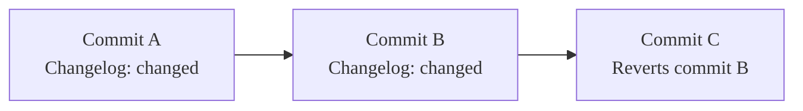
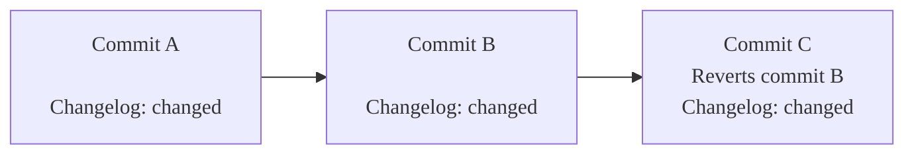



- プラン: Free、Premium、Ultimate
- 提供形態: GitLab.com、GitLab Self-Managed、GitLab Dedicated



変更履歴は、コミットタイトルとGitトレーラーに基づいて生成されます。変更履歴に含めるには、コミットに特定のGitトレーラーを追加する必要があります。変更履歴はコミットタイトルから生成され、Gitトレーラーの種類別に分類されます。マージリクエストへのリンクやコミット作成者に関する詳細など、追加データを使用して変更履歴エントリを充実させることができます。変更履歴の形式は、テンプレートを使用して[カスタマイズできます](#customize-the-changelog-output)。

デフォルトの変更履歴の各セクションには、バージョン番号とリリース日を含んだタイトルがあり、次のように表示されます:

```markdown
## 1.0.0 (2021-01-05)

### Features (4 changes)

- [Feature 1](gitlab-org/gitlab@123abc) by @alice ([merge request](gitlab-org/gitlab!123))
- [Feature 2](gitlab-org/gitlab@456abc) ([merge request](gitlab-org/gitlab!456))
- [Feature 3](gitlab-org/gitlab@234abc) by @steve
- [Feature 4](gitlab-org/gitlab@456)
```

セクションの日付形式はカスタマイズできますが、タイトルの残りの部分はカスタマイズできません。新しいセクションを追加すると、GitLabはこれらのタイトルを解析して、ファイル内に新しい情報を配置する場所を決定します。GitLabは、日付ではなくバージョンに基づいてセクションをソートします。

各セクションは、カテゴリ（「機能」など）でソートされた変更を含んでおり、これらのセクションの形式は変更できます。セクション名は、コミットを含めるまたは除外するために使用するGitトレーラーの値から派生します。

変更履歴のコミットはミラーで操作するときに取得できます。パッチリリースに公開プロジェクトとプライベートセキュリティミラーの両方からの変更を含めることができるため、GitLab自体もこの機能を使用しています。

## トレーラーをGitコミットに追加する {#add-a-trailer-to-a-git-commit}

コミットメッセージを作成するときに、手動でトレーラーを追加できます。`Changelog`のデフォルトトレーラーを使用してコミットを含め、機能として分類するには、文字列`Changelog: feature`を次のようにコミットメッセージに追加します:

```plaintext
<Commit message subject>

<Commit message description>

Changelog: feature
```

マージリクエストに複数のコミットがある場合は、最初のコミットに`Changelog`エントリを追加してください。これにより、コミットをスカッシュしたときに、正しいエントリが生成されるようになります。

`Changelog`トレーラーは、次の値を受け入れます:

- `added`: 新機能
- `fixed`: バグ修正
- `changed`: 機能変更
- `deprecated`: 新規非推奨
- `removed`: 機能削除
- `security`: セキュリティ修正
- `performance`: パフォーマンス改善
- `other`: その他

## 変更履歴を作成する {#create-a-changelog}

変更履歴は、APIまたはGitLab CLIのいずれかを使用して、コマンドラインから生成します。変更履歴はMarkdown形式で出力されますが、[カスタマイズできます](#customize-the-changelog-output)。

### APIから {#from-the-api}

APIを使用して`curl`コマンドで変更履歴を生成するには、APIドキュメントの[変更履歴データを変更履歴ファイルに追加する](../../api/repositories.md#add-changelog-data-to-file)を参照してください。

### GitLab CLIから {#from-the-gitlab-cli}



- `glab`バージョン1.30.0で[導入](https://gitlab.com/gitlab-org/cli/-/merge_requests/1222)されました。



前提要件:

- バージョン1.30.0以降の[GitLab CLI](../../editor_extensions/gitlab_cli/_index.md)をインストールし、設定していること。
- リポジトリのタグ命名スキーマが[想定されるタグ命名形式](#customize-the-tag-format-when-extracting-versions)と一致していること。
- コミットに[変更履歴トレーラー](#add-a-trailer-to-a-git-commit)が含まれていること。

変更履歴を生成するには:

1. `git fetch`でリポジトリのローカルコピーを更新します。
1. デフォルトのオプションを使用して、（`git describe --tags`によって決定された）現在のバージョンの変更履歴を生成するには:
   - コマンド`glab changelog generate`を実行します。
   - 出力をファイルに保存するには、コマンド`glab changelog generate > <filename>.md`を実行します。
1. カスタマイズしたオプションを使用して変更履歴を生成するには、コマンド`glab changelog generate`を実行し、目的のオプションを付け加えます。次のようなオプションがあります:

   - `--config-file [string]`: プロジェクトのGitリポジトリ内の変更履歴設定ファイルへのパス。このファイルは、プロジェクトのGitリポジトリに配置する必要があります。デフォルトは`.gitlab/changelog_config.yml`です。
   - コミット範囲:
     - `--from [string]`: 変更履歴の生成に使用するコミット範囲の開始（SHAとして）。このコミット自体は、変更履歴には含まれません。
     - `--to [string]`: 変更履歴の生成に使用するコミット範囲の終了（SHAとして）。このコミットはリストに含まれます。デフォルトは、デフォルトのプロジェクトブランチの`HEAD`です。
   - `--date [string]`: ISO 8601（`2016-03-11T03:45:40Z`）形式のリリース日時。デフォルトは現在の時刻です。
   - `--trailer [string]`: コミットを含めるために使用するGitトレーラー。デフォルトは`Changelog`です。
   - `--version [string]`: 変更履歴を生成するバージョン。

GitLab CLIで使用できるパラメータの詳細を確認するには、`glab changelog generate --help`を実行してください。定義と使用法については、[APIドキュメント](../../api/repositories.md#add-changelog-data-to-file)を参照してください。

## 変更履歴の出力をカスタマイズする {#customize-the-changelog-output}

変更履歴の出力をカスタマイズするには、変更履歴の設定ファイルを編集し、これらの変更をプロジェクトのGitリポジトリにコミットします。この設定のデフォルトの場所は`.gitlab/changelog_config.yml`です。

パフォーマンスとセキュリティ上の理由から、変更履歴の設定の解析は`2`秒に制限されています。設定の解析でタイムアウトエラーが発生する場合は、設定のサイズを小さくすることを検討してください。このファイルは、次の変数をサポートしています:

- `date_format`: 新しく追加される変更履歴データのタイトルに使用される日付形式（`strftime`形式）。
- `template`: 変更履歴データを生成するときに使用するカスタムテンプレート。
- `include_groups`: プロジェクトのメンバーシップに関係なく、コントリビュートを認める必要があるユーザーを含んでいるグループのフルパスのリスト。変更履歴を生成するユーザーのコントリビュートを認めるには、そのユーザーが各グループにアクセスできる必要があります。
- `categories`: rawカテゴリ名を変更履歴で使用する名前にマップするハッシュ。変更履歴に表示する名前を変更するには、これらの行を設定ファイルに追加し、必要に応じて編集します。この例では、カテゴリタイトルが`### Features`、`### Bug fixes`、および`### Performance improvements`としてレンダリングされます:

  ```yaml
  ---
  categories:
    feature: Features
    bug: Bug fixes
    performance: Performance improvements
  ```

### カスタムテンプレート {#custom-templates}



- GitLab 17.1で、デフォルトテンプレートは`commit.reference`と`merge_request.reference`の使用から`commit.web_url`と`merge_request.web_url`に[変更](https://gitlab.com/gitlab-org/gitlab/-/merge_requests/155806)されました。



カテゴリセクションは、テンプレートを使用して生成されます。デフォルトテンプレートは次のとおりです:

```plaintext


### {{ title }} (1 change{{ count }} changes)


- [{{ title }}]({{ commit.web_url }})\
 by {{ author.reference }}\
 ([merge request]({{ merge_request.web_url }}))





No changes.

```

``タグはステートメント用で、`{{ ... }}`はデータを出力するために使用されます。ステートメントは、``タグを使用して終了する必要があります。`if`ステートメントと`each`ステートメントの両方に、単一の引数が必要です。

たとえば、`valid`という名前の変数の場合、次のように入力して、この値がtrueの場合は「yes」と表示し、それ以外の場合は「nope」と表示できます:

```plaintext

yes

nope

```

`else`の使用はオプションです。値は、空でない値またはブール値`true`の場合にtrueと見なされます。空の配列とハッシュはfalseと見なされます。

ループは`each`を使用して行われ、ループ内の変数のスコーピングはそのループに制限されます。ループ内の現在の値を参照するには、変数タグ`{{ it }}`を使用します。他の変数は、現在のループ値から値を読み取ります。たとえば、次のテンプレートについて考えてみましょう:

```plaintext

{{name}}

```

`users`がオブジェクトの配列で、それぞれに`name`フィールドがあるとすると、この場合すべてのユーザーの名前が出力されます。

変数タグを使用すると、ネストされたオブジェクトにアクセスできます。たとえば、`{{ users.0.name }}`は、`users`変数の最初のユーザーの名前を出力します。

行がバックスラッシュで終わる場合、次の改行は無視されます。これにより、Markdown出力に不要な改行を追加せずに、コードを複数の行にわたって折り返すことができます。

``を使用するタグ（表現タグと呼ばれる）は、その直後に改行がある場合はその改行を消費します。これは、次のようになることを意味します:

```plaintext
---

bar

---
```

次のようにコンパイルされます:

```plaintext
---
bar
---
```

次のようにはコンパイルされません:

```plaintext
---

bar

---
```

設定でカスタムテンプレートを次のように指定できます:

```yaml
---
template: |
  
  
  ### {{ title }}

  
  - [{{ title }}]({{ commit.web_url }})\
   by {{ author.reference }}

  

  
  
  No changes.
  
```

テンプレートを指定するときは、`template: >`ではテンプレート内の改行が保持されないため、`template: |`を使用する必要があります。

### テンプレートデータ {#template-data}



- `commit.web_url`と`merge_request.web_url`はGitLab 17.1で[導入](https://gitlab.com/gitlab-org/gitlab/-/merge_requests/155806)されました。



トップレベルでは、次の変数を使用できます:

- `categories`: オブジェクトの配列。変更履歴カテゴリごとに1つ。

カテゴリでは、次の変数を使用できます:

- `count`: このカテゴリにあるエントリの数。
- `entries`: このカテゴリに属するエントリ。
- `single_change`: 変更が1つしかないか（`true`）、複数の変更があるか（`false`）を示すブール値。
- `title`: カテゴリのタイトル（再マップ後）。

エントリでは、次の変数を使用できます（`foo.bar`は`bar`が`foo`のサブフィールドであることを意味します）:

- `author.contributor`: 作成者がプロジェクトメンバーでない場合は`true`に設定され、それ以外の場合は`false`に設定されるブール値。
- `author.credit`: `author.contributor`が`true`の場合、または`include_groups`が設定されていて、作成者がいずれかのグループのメンバーである場合に`true`に設定されるブール値。
- `author.reference`: コミット作成者への参照（例: `@alice`）。
- `commit.reference`: コミットへの参照（例: `gitlab-org/gitlab@0a4cdd86ab31748ba6dac0f69a8653f206e5cfc7`）。
- `commit.web_url`: コミットのURL（例: `https://gitlab.com/gitlab-org/gitlab/-/commit/0a4cdd86ab31748ba6dac0f69a8653f206e5cfc7`）。
- `commit.trailers`: コミット本文に存在するすべてのGitトレーラーを含んでいるオブジェクト。

  これらのトレーラーは、`commit.trailers.<name>`を使用して参照できます。たとえば、次のコミットがあるとします:

  ```plaintext
  Add some impressive new feature

  Changelog: added
  Issue: https://gitlab.com/gitlab-org/gitlab/-/issues/1234
  Status: important
  ```

  `Changelog`、`Issue`、および`Status`トレーラーには、テンプレートで次のようにアクセスできます:

  ```yaml
  
   ([link to issue]({{ commit.trailers.Issue }}))
  Status: {{ commit.trailers.Status }}
  
  ```

- `merge_request.reference`: 変更を最初に導入したマージリクエストへの参照（例: `gitlab-org/gitlab!50063`）。
- `merge_request.web_url`: 変更を最初に導入したマージリクエストのURL（例: `https://gitlab.com/gitlab-org/gitlab/-/merge_requests/50063`）。
- `title`: 変更履歴エントリのタイトル（これはコミットタイトルです）。

データを特定できなかった場合、`author`オブジェクトと`merge_request`オブジェクトが存在しない可能性があります。たとえば、対応するマージリクエストなしでコミットが作成された場合、マージリクエストは表示されません。

### バージョンの抽出時にタグ形式をカスタマイズする {#customize-the-tag-format-when-extracting-versions}

GitLabは、正規表現（[re2](https://github.com/google/re2/)エンジンと構文を使用）を使用して、タグ名からセマンティックバージョンを抽出します。デフォルトの正規表現は次のとおりです:

```plaintext
^v?(?P<major>0|[1-9]\d*)\.(?P<minor>0|[1-9]\d*)\.(?P<patch>0|[1-9]\d*)(?:-(?P<pre>(?:0|[1-9]\d*|\d*[a-zA-Z-][0-9a-zA-Z-]*)(?:\.(?:0|[1-9]\d*|\d*[a-zA-Z-][0-9a-zA-Z-]*))*))?(?:\+(?P<meta>[0-9a-zA-Z-]+(?:\.[0-9a-zA-Z-]+)*))?$
```

この正規表現は、公式の[セマンティックバージョニング](https://semver.org/)正規表現に基づいており、文字`v`で始まるタグ名のサポートも含まれています。

プロジェクトでタグに異なる形式を使用する場合は、異なる正規表現を指定できます。使用する正規表現は、次のキャプチャグループを生成する必要があります。これらのキャプチャグループのいずれかが欠落している場合、タグは無視されます:

- `major`
- `minor`
- `patch`

次のキャプチャグループはオプションです:

- `pre`: 設定されている場合、タグは無視されます。`pre`タグを無視すると、変更履歴を生成するコミットの範囲を決定するときに、リリース候補タグやその他のプレリリースタグが考慮されなくなります。
- `meta`: オプション。ビルドメタデータを指定します。

GitLabは、この情報を使用して、Gitタグとそのリリースバージョンのマップをビルドします。次に、各タグから抽出されたバージョンに基づいて、最新のタグを決定します。

カスタムの正規表現を指定するには、変更履歴設定YAMLファイルで`tag_regex`設定を使用します。たとえば、このパターンは`version-1.2.3`などのタグ名には一致しますが、`version-1.2`には一致しません。

```yaml
---
tag_regex: '^version-(?P<major>\d+)\.(?P<minor>\d+)\.(?P<patch>\d+)$'
```

正規表現が機能しているかどうかをテストするには、[regex101](https://regex101.com/)などのウェブサイトを使用できます。正規表現の構文が無効な場合、変更履歴を生成するときにエラーが発生します。

## リバートコミット処理 {#reverted-commit-handling}

リバートコミットとして処理するには、コミットメッセージに文字列`This reverts commit <SHA>`を追加する必要があります。`SHA`は取り消すコミットのSHAです。

範囲の変更履歴を生成する場合、GitLabはその範囲で追加および取り消されたコミットを無視します。この例では、コミットCはコミットBを取り消します。コミットCに他のトレーラーがないため、コミットAのみが変更履歴に追加されます:



ただし、リバートコミット（コミットC）に変更履歴トレーラーも含まれている場合、コミットAとコミットCの両方が変更履歴に含まれます:



コミットBはスキップされます。

## 関連トピック {#related-topics}

- リポジトリAPIの[変更履歴関連のエンドポイント](../../api/repositories.md)。
- GitLab CLIドキュメントの[`glab changelog`](https://gitlab.com/gitlab-org/cli/-/tree/main/docs/source/changelog)。
